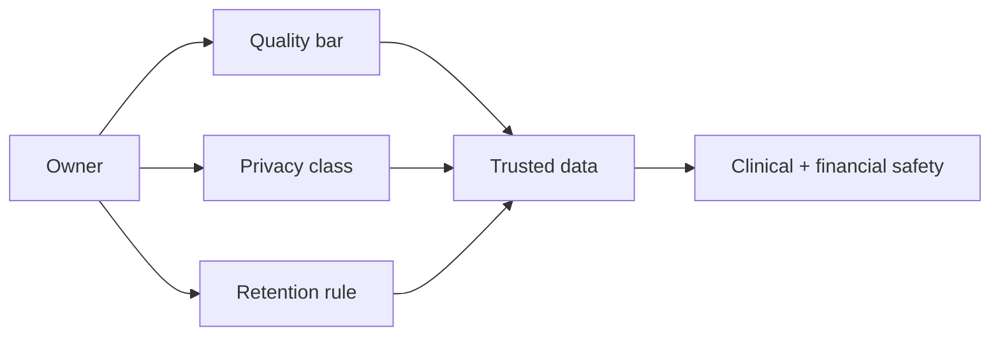
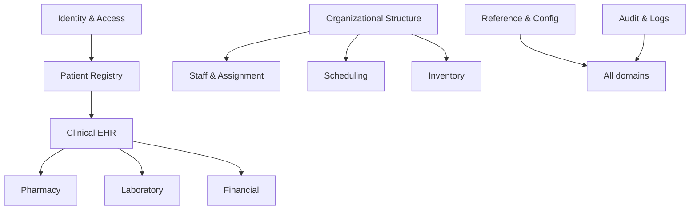
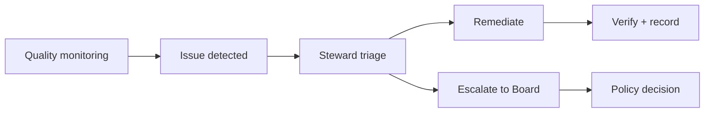
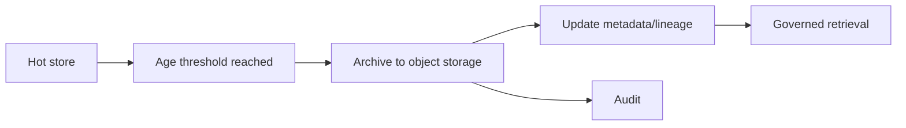
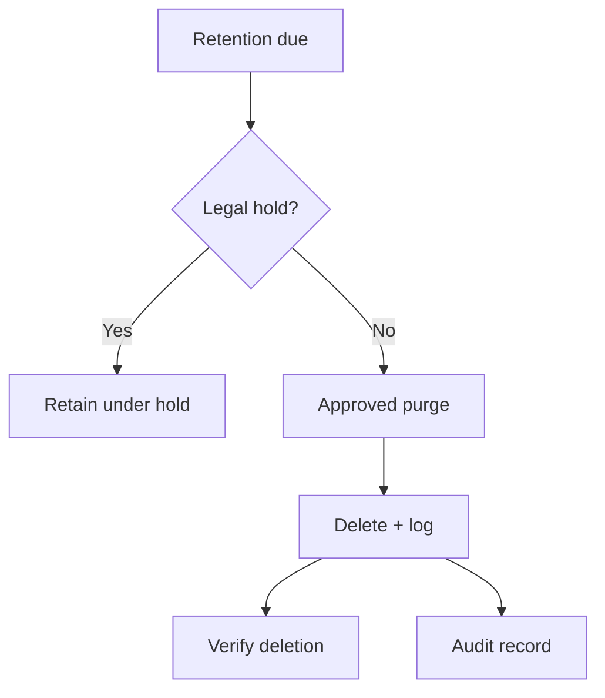
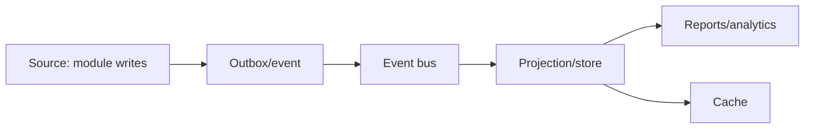
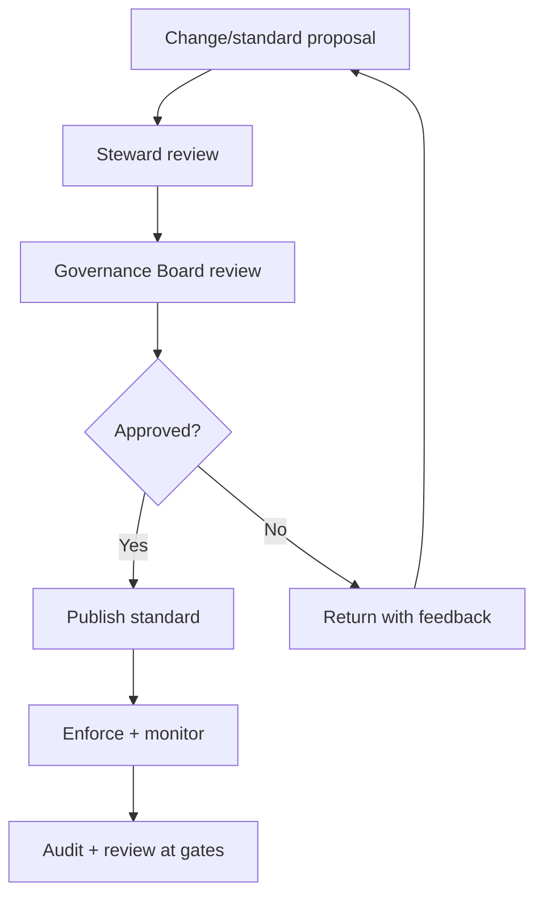

# Hospital ERP Enterprise — Data Governance

> **Document ID:** `17-DATA-GOVERNANCE.md`
> **Owner:** Chief Data Officer / Data Governance Board
> **Status:** 🔄 Pending approval (Phase 1 gate)
> **Version:** 1.0.0
> **Last updated:** 2026-08-06
> **Review cadence:** Re-reviewed at every phase gate and whenever the compliance or data model changes.
>
> **Relationship:** Defines the **enterprise-wide data governance framework** for the Hospital ERP Enterprise platform — the domains, ownership, quality, privacy, retention, and audit rules that govern all data. It operationalizes the single-source-of-truth principle in [02-SYSTEM-ARCHITECTURE](02-SYSTEM-ARCHITECTURE.md), the storage/retention policies in [05-DATABASE-ARCHITECTURE](05-DATABASE-ARCHITECTURE.md), the audit standard in [08-AUDIT-LOGGING](08-AUDIT-LOGGING.md), tenancy in [09-MULTI-TENANCY](09-MULTI-TENANCY.md), and the compliance matrix in [00-MASTER-ROADMAP](00-MASTER-ROADMAP.md).

---

## Table of Contents

1. [Executive Summary](#1-executive-summary)
2. [Vision](#2-vision)
3. [Scope](#3-scope)
4. [Data Domains](#4-data-domains)
5. [Master Data](#5-master-data)
6. [Transaction Data](#6-transaction-data)
7. [Reference Data](#7-reference-data)
8. [Metadata Management](#8-metadata-management)
9. [Data Ownership](#9-data-ownership)
10. [Data Stewardship](#10-data-stewardship)
11. [Data Quality Framework](#11-data-quality-framework)
12. [Data Validation Standards](#12-data-validation-standards)
13. [Data Integrity Rules](#13-data-integrity-rules)
14. [PHI & PII Classification](#14-phi--pii-classification)
15. [Data Privacy](#15-data-privacy)
16. [Data Retention Policy](#16-data-retention-policy)
17. [Archival Strategy](#17-archival-strategy)
18. [Data Purging Policy](#18-data-purging-policy)
19. [Data Lineage](#19-data-lineage)
20. [Audit Requirements](#20-audit-requirements)
21. [Security Controls](#21-security-controls)
22. [KPIs](#22-kpis)
23. [Governance Workflow](#23-governance-workflow)
24. [Cross References](#24-cross-references)

---

## 1. Executive Summary

The Hospital ERP Enterprise platform is a **data-driven clinical and financial system**. Data governance is the discipline that ensures its data is **accurate, complete, timely, consistent, private, and retained correctly** across every module and surface.

This framework establishes:

- A **canonical, single-source-of-truth** model with explicit domain ownership.
- **Accountability** through named data owners and stewards.
- **Quality** enforced at the boundary (validation) and continuously (measurement).
- **Privacy** by classification, least privilege, and consent ([06-AUTHENTICATION](06-AUTHENTICATION.md), [09-MULTI-TENANCY](09-MULTI-TENANCY.md)).
- **Lifecycle** control through retention, archival, and purging per the compliance matrix ([00-MASTER-ROADMAP](00-MASTER-ROADMAP.md)).
- **Observability** through lineage, audit, and KPIs.

Governance is a **board-governed, continuously reviewed** process, not a one-time artifact.

---

## 2. Vision

Become the hospital's **trusted data foundation** — where every datum has an owner, a quality bar, a privacy classification, and a retention rule, and where clinical safety and financial integrity are never compromised by data error.

---

## 3. Scope

**In scope:** data domains, master/transaction/reference data, metadata, ownership and stewardship, quality and validation, integrity, PHI/PII classification, privacy, retention, archival, purging, lineage, audit, security controls, KPIs, and the governance workflow.

**Out of scope:** database storage mechanics (see [05-DATABASE-ARCHITECTURE](05-DATABASE-ARCHITECTURE.md)), identity/access mechanics ([06-AUTHENTICATION](06-AUTHENTICATION.md), [07-ROLES-PERMISSIONS](07-ROLES-PERMISSIONS.md)), and module-specific requirements (e.g., the Hospital Setup module).

### 3.1 Governance Principles

| # | Principle | Application |
| --- | --- | --- |
| DG-01 | **Single source of truth** | One canonical model; no duplicated authoritative state ([02-SYSTEM-ARCHITECTURE](02-SYSTEM-ARCHITECTURE.md) A3). |
| DG-02 | **Owner for everything** | Every data domain has a named owner. |
| DG-03 | **Quality by default** | Validated at the boundary; measured continuously. |
| DG-04 | **Privacy by classification** | Handling follows a defined data classification. |
| DG-05 | **Lifecycle governed** | Retention/archival/purge follow policy, not ad-hoc deletion. |
| DG-06 | **Traceable** | Lineage and audit make every datum explainable. |
| DG-07 | **Least privilege** | Access follows roles and tenancy ([07-ROLES-PERMISSIONS](07-ROLES-PERMISSIONS.md), [09-MULTI-TENANCY](09-MULTI-TENANCY.md)). |

---

## 4. Data Domains

The platform's data is organized into domains. Each domain is owned and governed as a coherent unit.

| Domain | Description | Canonical store | Owner |
| --- | --- | --- | --- |
| Identity & Access (IAM) | Users, roles, tenants, sessions | Primary DB + IdP | Security Lead |
| Patient Registry | Patient identity, demographics, MRN | Primary DB | Clinical Data Owner |
| Organizational Structure | Facility → location → department → unit → room | Primary DB | Operations Owner |
| Staff & Assignment | Staff master, assignments, scope | Primary DB | HR/Ops Owner |
| Clinical (EHR) | Encounters, notes, orders, results | Primary DB + object store | Clinical Data Owner |
| Medication & Pharmacy | Formulary, prescriptions, dispensing | Primary DB | Pharmacy Owner |
| Laboratory | Specimens, orders, results | Primary DB | Lab Owner |
| Financial | Charges, claims, payments, GL | Primary DB | Finance Owner |
| Scheduling | Appointments, slots | Primary DB | Operations Owner |
| Inventory & Supply | Stock, procurement, assets | Primary DB | Ops/Procurement Owner |
| Reference & Configuration | Controlled vocabularies, system config | Primary DB | Data Governance Board |
| Audit & Logs | Change audit, application logs | Audit store | Security/Compliance Owner |
| Documents & Media | Images, FHIR bundles, exports | Object storage | Clinical Data Owner |

### Domain Map

---

## 5. Master Data

**Master data** is the core, stable entities shared across the platform — the "golden records" that other data references.

| Master data | Canonical source | Consumers |
| --- | --- | --- |
| Patient (identity, demographics, MRN) | Patient Registry | Clinical, Billing, Scheduling |
| Staff (people, credentials, departments) | Staff master / IAM | All modules |
| Facility / organization hierarchy | Organizational Structure | All modules |
| Formulary (medications) | Pharmacy | Prescribing, Dispensing |
| Charge master (price list) | Financial | Billing |
| Suppliers / vendors | Procurement | Inventory, Finance |

### Master Data Rules

| Rule | Application |
| --- | --- |
| **One source** | Master data is written once to the canonical store ([02-SYSTEM-ARCHITECTURE](02-SYSTEM-ARCHITECTURE.md) A3). |
| **Non-destructive** | Master records are deactivated, not deleted. |
| **Unique keys** | Stable, tenant-scoped identifiers enforced by constraint. |
| **Referenced, not copied** | Consumers hold references, not copies, of master identity. |
| **Audited** | Every master-data change is audited ([08-AUDIT-LOGGING](08-AUDIT-LOGGING.md)). |

---

## 6. Transaction Data

**Transaction data** records events and movements — the high-volume, time-stamped records produced by operations.

| Transaction data | Example |
| --- | --- |
| Encounters | Visit, admission, discharge |
| Clinical orders & results | Lab orders, medication orders, results |
| Financial transactions | Charges, claims, payments, GL entries |
| Scheduling events | Appointment booking, cancellation |
| Inventory movements | Stock receipts, issues, adjustments |
| Audit events | Changes to master/reference/config data |

### Transaction Data Rules

| Rule | Application |
| --- | --- |
| **Immutable where required** | Financial and audit transactions are append-only / tamper-evident ([08-AUDIT-LOGGING](08-AUDIT-LOGGING.md)). |
| **ACID** | Writes are transactional on the primary store ([05-DATABASE-ARCHITECTURE](05-DATABASE-ARCHITECTURE.md) §6). |
| **Reconcilable** | Financial transactions reconcile charge → GL. |
| **Partitioned** | High-volume tables partitioned by time ([05-DATABASE-ARCHITECTURE](05-DATABASE-ARCHITECTURE.md) §8). |
| **Correctable, not erased** | Errors are corrected via compensating entries, never silent overwrite. |

---

## 7. Reference Data

**Reference data** is the controlled vocabulary that standardizes values across the platform — ensuring consistency of codes, terms, and units.

| Reference category | Example values |
| --- | --- |
| Facility type | general, specialty, clinic, other |
| Department type | clinical, administrative |
| Specialty | cardiology, oncology, pediatrics |
| Service type | outpatient, inpatient, emergency |
| Shift template | morning, evening, night |
| Status values | draft, active, inactive, retired |
| Unit of measure | mg, ml, tablets |
| Currency | INR, USD |

### Reference Data Rules

| Rule | Application |
| --- | --- |
| **Centrally governed** | Reference values are managed data, versioned and reviewed ([05-DATABASE-ARCHITECTURE](05-DATABASE-ARCHITECTURE.md) §5). |
| **Unique codes** | Category+code unique within scope (tenant/facility). |
| **Standardized** | Prefer industry standards (see [18-INTEROPERABILITY](18-INTEROPERABILITY.md)). |
| **No hard-coding** | Business logic and UI reference the vocabulary, not literal values. |
| **Tenant-aware** | Enterprise-level vs facility-level scoping ([09-MULTI-TENANCY](09-MULTI-TENANCY.md)). |

---

## 8. Metadata Management

**Metadata** is data about data — the catalog, schemas, business glossaries, and technical definitions that make the platform explainable.

| Metadata type | Contents |
| --- | --- |
| Technical metadata | Schema, tables, columns, types, constraints ([05-DATABASE-ARCHITECTURE](05-DATABASE-ARCHITECTURE.md) §5) |
| Business metadata | Business glossary, definitions, owners, stewards |
| Operational metadata | Lineage, run statistics, freshness |
| Reference metadata | Code sets and their sources |

### Metadata Management

| Aspect | Decision |
| --- | --- |
| Catalog | Central data catalog of schemas and definitions |
| Business glossary | Canonical terms and their meanings |
| Lineage | Automated capture of data flow ([§19](#19-data-lineage)) |
| Schema | Versioned migrations; schema-as-code ([04-CODING-STANDARDS](04-CODING-STANDARDS.md)) |
| Discovery | Searchable, self-serve catalog |

---

## 9. Data Ownership

Every data domain has a **named owner** accountable for its quality, privacy, and governance.

| Owner role | Responsibilities |
| --- | --- |
| **Data Owner** | Accountable for a domain's data; approves standards, access, and changes. |
| **Business Owner** | Represents the business need; defines quality expectations. |
| **Data Steward** | Operational execution of quality, lineage, and remediation. |
| **Data Custodian** | Technical care: storage, security, retention implementation. |
| **Data Governance Board** | Cross-domain policy, dispute resolution, approval of standards. |

### Ownership Matrix (illustrative)

| Domain | Owner | Steward | Custodian |
| --- | --- | --- | --- |
| Patient Registry | Chief Medical Officer | Clinical Analyst | Platform Engineering |
| Financial | CFO | Finance Analyst | Platform Engineering |
| Organizational Structure | COO | Ops Analyst | Platform Engineering |
| Reference & Config | Data Governance Board | Data Steward | Platform Engineering |

---

## 10. Data Stewardship

**Stewards** implement and monitor governance day-to-day.

| Steward activity | Frequency |
| --- | --- |
| Monitor data quality KPIs | Continuous |
| Investigate and remediate quality issues | On detection |
| Maintain business glossary and lineage | Ongoing |
| Review access against least privilege | Periodic |
| Escalate unresolved issues to the Board | As needed |

### Stewardship Operating Model

---

## 11. Data Quality Framework

Quality is measured across six dimensions.

| Dimension | Definition | Measure |
| --- | --- | --- |
| Accuracy | Data reflects reality | Error rate |
| Completeness | Required data present | % complete |
| Consistency | Same value across surfaces | Conflict count |
| Timeliness | Data current when needed | Freshness lag |
| Validity | Data conforms to rules | Invalid-rate |
| Uniqueness | No unintended duplicates | Duplicate rate |

### Quality Rules

| Rule | Application |
| --- | --- |
| **Define per domain** | Each domain sets its quality bar. |
| **Measure continuously** | KPIs computed on a schedule ([§22](#22-kpis)). |
| **Fail loudly** | Quality issues are alerted, not hidden. |
| **Tiered response** | Severity drives remediation urgency. |
| **Improve, don't just report** | Root-cause analysis drives correction. |

---

## 12. Data Validation Standards

Validation is applied **at every write boundary** (API, import, UI) per [11-API-STANDARDS](11-API-STANDARDS.md) and [04-CODING-STANDARDS](04-CODING-STANDARDS.md).

| Validation type | Example |
| --- | --- |
| Required | Mandatory fields present |
| Format | Email, phone, identifiers |
| Length | Column length limits |
| Domain/range | Enum and bounded values |
| Referential | FK validity; valid parent |
| Uniqueness | Unique codes/keys |
| Cross-field | Date range start ≤ end |
| Semantic | Business-rule checks (e.g., single primary) |

### Validation Rules

| Rule | Application |
| --- | --- |
| **Validate at boundary** | All inputs validated at the API/service boundary. |
| **Server is authority** | UI validation is UX only; API is authoritative. |
| **Reject, don't coerce** | Invalid data is rejected with a clear reason. |
| **Deterministic** | Same input → same validation result. |
| **Tested** | Validation is automated-tested ([15-TESTING-STANDARDS](15-TESTING-STANDARDS.md)). |

---

## 13. Data Integrity Rules

Integrity protects correctness at the storage layer ([05-DATABASE-ARCHITECTURE](05-DATABASE-ARCHITECTURE.md) §6).

| Rule | Application |
| --- | --- |
| **ACID transactions** | Multi-statement writes are atomic ([05-DATABASE-ARCHITECTURE](05-DATABASE-ARCHITECTURE.md) §6). |
| **Referential integrity** | FK constraints; RESTRICT on delete; no silent cascade. |
| **Unique constraints** | Back critical uniqueness (codes, single-primary). |
| **Optimistic concurrency** | Version checks prevent lost updates on long-lived records. |
| **No partial state** | Cross-module writes use the outbox pattern ([05-DATABASE-ARCHITECTURE](05-DATABASE-ARCHITECTURE.md) §6). |
| **Append-only audit** | Audit and financial logs are immutable ([08-AUDIT-LOGGING](08-AUDIT-LOGGING.md)). |

---

## 14. PHI & PII Classification

Data is classified by sensitivity to drive handling, access, and retention.

| Class | Definition | Examples | Examples of controls |
| --- | --- | --- | --- |
| **PHI** | Protected health information | Names, MRN, diagnosis, lab results | Encryption, least privilege, consent, audit |
| **PII** | Personal identifiable information | Staff contact, demographics | Encryption, least privilege |
| **Financial** | Payment/GL data | Charges, claims, bank details | Reconciliation, access control |
| **Internal** | Organizational/config data | Structure, reference data | Access-controlled |
| **Public** | Non-sensitive | Published directory | Minimal controls |

### Classification Rules

| Rule | Application |
| --- | --- |
| **Classify at source** | Data is classified when created. |
| **Handle per class** | Controls scale with classification ([21-Security Controls](#21-security-controls)). |
| **No PHI outside prod** | Non-production uses synthetic/anonymized data ([00-MASTER-ROADMAP](00-MASTER-ROADMAP.md) §10). |
| **Consent-aware** | Sensitive access respects consent ([06-AUTHENTICATION](06-AUTHENTICATION.md)). |
| **Reviewed** | Classification reviewed at gates. |

---

## 15. Data Privacy

Privacy operationalizes the classification above and the platform security model ([06-AUTHENTICATION](06-AUTHENTICATION.md), [09-MULTI-TENANCY](09-MULTI-TENANCY.md)).

| Privacy control | Application |
| --- | --- |
| **Data minimization** | Collect and store only what is required. |
| **Least privilege** | Access by role + scope ([07-ROLES-PERMISSIONS](07-ROLES-PERMISSIONS.md)). |
| **Tenant isolation** | Row-level security prevents cross-tenant access ([09-MULTI-TENANCY](09-MULTI-TENANCY.md)). |
| **Consent** | Patient consent restricts sensitive access. |
| **Encryption** | At rest and in transit ([05-DATABASE-ARCHITECTURE](05-DATABASE-ARCHITECTURE.md) §11). |
| **De-identification** | Anonymization for analytics/test where required. |
| **Rights** | Subject access and erasure per legal requirements. |

---

## 16. Data Retention Policy

Retention is governed per data class and the compliance matrix in [00-MASTER-ROADMAP](00-MASTER-ROADMAP.md) §15, and operationalizes the retention schedule in [05-DATABASE-ARCHITECTURE](05-DATABASE-ARCHITECTURE.md) §8.

| Data class | Retention basis | Minimum (illustrative) |
| --- | --- | --- |
| PHI (clinical records) | Regulatory + clinical | Per compliance schedule |
| Financial records | Regulatory | Per compliance schedule |
| Audit records | Compliance/evidence | Per compliance schedule ([08-AUDIT-LOGGING](08-AUDIT-LOGGING.md)) |
| Master data | Active + history | Indefinite (deactivated, not deleted) |
| Reference data | Active + history | Indefinite (governed) |
| Session/log data | Operational | Shorter operational window |
| Non-production | Synthetic only | Bounded per environment |

### Retention Rules

| Rule | Application |
| --- | --- |
| **Policy-driven** | Retention periods defined per class, not per ad-hoc decision. |
| **Automated** | Retention jobs run on schedule, audited. |
| **Compliance-linked** | Periods align to [00-MASTER-ROADMAP](00-MASTER-ROADMAP.md) §15. |
| **Exception-governed** | Legal holds supersede standard retention. |
| **Verified** | Retention is tested and monitored. |

---

## 17. Archival Strategy

Archival moves older, infrequently-accessed data off the hot store to lower-cost storage ([05-DATABASE-ARCHITECTURE](05-DATABASE-ARCHITECTURE.md) §8).

| Aspect | Decision |
| --- | --- |
| Trigger | Age-based per data class |
| Target | Object storage (S3/MinIO) per [03-TECHNOLOGY-STACK](03-TECHNOLOGY-STACK.md) |
| Retention during archive | Fully retained; accessible on demand |
| Integrity | Archives preserve integrity (checksums/hash chains) |
| Access | Archived data retrievable via governed process |
| Audit | Archival actions audited |

### Archival Flow

---

## 18. Data Purging Policy

Purging is the governed, irreversible removal of data past its retention and outside legal-hold.

| Aspect | Decision |
| --- | --- |
| Trigger | Retention period elapsed + no legal hold |
| Approval | Approved, audited process |
| Irreversibility | Not recoverable; deletion is logged ([05-DATABASE-ARCHITECTURE](05-DATABASE-ARCHITECTURE.md) §8) |
| Exceptions | Legal holds and consent requirements supersede |
| Verification | Deletion verified and recorded |

### Purge Decision Table

| Data | Retain | Archive | Purge |
| --- | :---: | :---: | :---: |
| Master data | ✓ | · | · (deactivate only) |
| Clinical records | ✓ | ✓ | · (hold) |
| Financial records | ✓ | ✓ | · (hold) |
| Audit records | ✓ | ✓ | Per compliance |
| Session/log data | · | · | ✓ (per policy) |
| Non-production synthetic | · | · | ✓ (bounded) |

### Purge Flow

---

## 19. Data Lineage

**Lineage** traces where data comes from, how it is transformed, and where it flows — enabling impact analysis, debugging, and trust.

| Lineage level | Tracks |
| --- | --- |
| System | Source system → target store |
| Table | Source table → target table |
| Column/field | Source field → target field |
| Pipeline | Transformation steps |
| Business | Business meaning and owner |

### Lineage Rules

| Rule | Application |
| --- | --- |
| **Capture at build** | Lineage is recorded when data flows are built. |
| **Versioned** | Lineage reflects schema versions. |
| **Searchable** | Lineage is queryable in the catalog. |
| **Impact-aware** | Changes warn of downstream consumers. |
| **Audited** | Source of truth changes are audited. |

### Lineage Diagram

---

## 20. Audit Requirements

Audit provides the immutable, tamper-evident record of data and access changes ([08-AUDIT-LOGGING](08-AUDIT-LOGGING.md)).

| Audit category | Captures |
| --- | --- |
| Data changes | Who changed what, when, with what outcome |
| Access | Who accessed sensitive data, when |
| Governance | Retention/purge/archive actions |
| Approval | Elevated action approvals |
| Compliance | Evidence for regulatory review |

### Audit Rules

| Rule | Application |
| --- | --- |
| **Immutable** | Append-only; tamper-evident ([08-AUDIT-LOGGING](08-AUDIT-LOGGING.md)). |
| **Complete** | All sensitive and change operations audited. |
| **Attributable** | Actor, action, entity, time always present. |
| **Retained** | Per compliance schedule. |
| **Accessible** | Authorized, queryable audit trail. |

---

## 21. Security Controls

Controls map the classification (§14) to technical protection ([06-AUTHENTICATION](06-AUTHENTICATION.md), [07-ROLES-PERMISSIONS](07-ROLES-PERMISSIONS.md), [09-MULTI-TENANCY](09-MULTI-TENANCY.md), [05-DATABASE-ARCHITECTURE](05-DATABASE-ARCHITECTURE.md) §11).

| Control | Application |
| --- | --- |
| Authentication | OIDC; MFA for elevated access ([06-AUTHENTICATION](06-AUTHENTICATION.md)) |
| Authorization | RBAC + policy; least privilege ([07-ROLES-PERMISSIONS](07-ROLES-PERMISSIONS.md)) |
| Row-level security | Tenant isolation at the data layer ([09-MULTI-TENANCY](09-MULTI-TENANCY.md)) |
| Encryption at rest | Persistent stores encrypted |
| Encryption in transit | TLS on all endpoints |
| Secrets management | Central secret manager ([16-DEPLOYMENT-STANDARDS](16-DEPLOYMENT-STANDARDS.md) §7) |
| Audit | All sensitive/change operations logged |
| Data backup | Encrypted backups ([05-DATABASE-ARCHITECTURE](05-DATABASE-ARCHITECTURE.md) §10) |
| Non-production hygiene | No PHI outside production |

### Controls by Data Class

| Class | Encryption | RLS | Audit | Consent |
| --- | :---: | :---: | :---: | :---: |
| PHI | ✓ | ✓ | ✓ | ✓ |
| PII | ✓ | ✓ | ✓ | · |
| Financial | ✓ | ✓ | ✓ | · |
| Internal | ✓ | ✓ | ✓ | · |
| Public | · | · | · | · |

---

## 22. KPIs

| KPI | Target | Measurement |
| --- | --- | --- |
| Data quality score | ≥ 95% | Composite of quality dimensions |
| Duplicate rate | < 1% | Master-data duplicates |
| Invalid-rate | < 1% | Records failing validation |
| Governance coverage | 100% | Domains with owner + steward |
| Retention compliance | 100% | Retention jobs run on schedule |
| Lineage coverage | ≥ 90% | Critical data flows documented |
| Sensitive-access incidents | 0 | Unauthorized access to PHI/PII |
| Data classification coverage | 100% | All data classified |

---

## 23. Governance Workflow

Governance operates as a structured, board-reviewed workflow.

### Governance Activities

| Activity | Cadence |
| --- | --- |
| Data quality review | Monthly |
| Access review | Periodic |
| Retention/purge verification | Monthly |
| Compliance matrix review | At gates ([00-MASTER-ROADMAP](00-MASTER-ROADMAP.md)) |
| Standard approval | As needed, board-reviewed |
| Incident / data-breach review | On event |

---

## 24. Cross References

| Reference | Relationship | Direction |
| --- | --- | --- |
| [00-MASTER-ROADMAP](00-MASTER-ROADMAP.md) | Compliance matrix, environments | Consumes |
| [01-ENTERPRISE-VISION](01-ENTERPRISE-VISION.md) | Vision, principles | Consumes |
| [02-SYSTEM-ARCHITECTURE](02-SYSTEM-ARCHITECTURE.md) | Single source of truth, eventing | Consumes |
| [03-TECHNOLOGY-STACK](03-TECHNOLOGY-STACK.md) | Storage, messaging | Consumes |
| [04-CODING-STANDARDS](04-CODING-STANDARDS.md) | Validation, schema-as-code | Consumes |
| [05-DATABASE-ARCHITECTURE](05-DATABASE-ARCHITECTURE.md) | Retention, archival, backups, security | Consumes |
| [06-AUTHENTICATION](06-AUTHENTICATION.md) | Access, consent, MFA | Consumes |
| [07-ROLES-PERMISSIONS](07-ROLES-PERMISSIONS.md) | Least privilege, authorization | Consumes |
| [08-AUDIT-LOGGING](08-AUDIT-LOGGING.md) | Audit, tamper-evidence | Consumes |
| [09-MULTI-TENANCY](09-MULTI-TENANCY.md) | Tenant isolation | Consumes |
| [10-HOSPITAL-HIERARCHY](10-HOSPITAL-HIERARCHY.md) | Organizational master data | Consumes |
| [11-API-STANDARDS](11-API-STANDARDS.md) | API validation standards | Consumes |
| [14-PERFORMANCE-STANDARDS](14-PERFORMANCE-STANDARDS.md) | Quality/retention job performance | Consumes |
| [15-TESTING-STANDARDS](15-TESTING-STANDARDS.md) | Validation/integrity testing | Consumes |
| [16-DEPLOYMENT-STANDARDS](16-DEPLOYMENT-STANDARDS.md) | Secrets, operations | Consumes |
| [18-INTEROPERABILITY](18-INTEROPERABILITY.md) | Standardized reference data | Consumes |

---

*End of `docs/17-DATA-GOVERNANCE.md`.*
