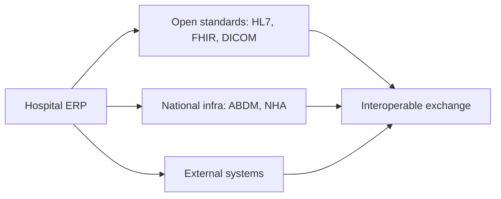
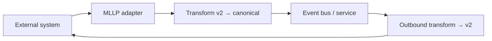
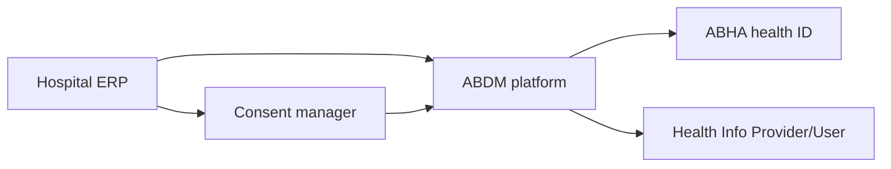
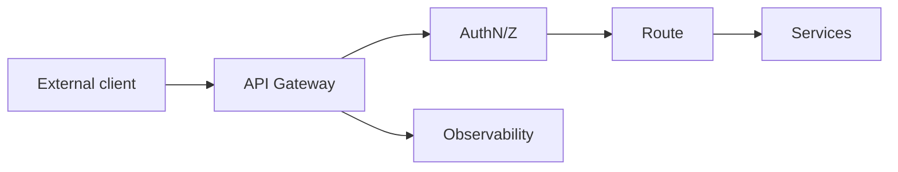
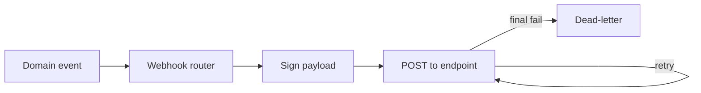
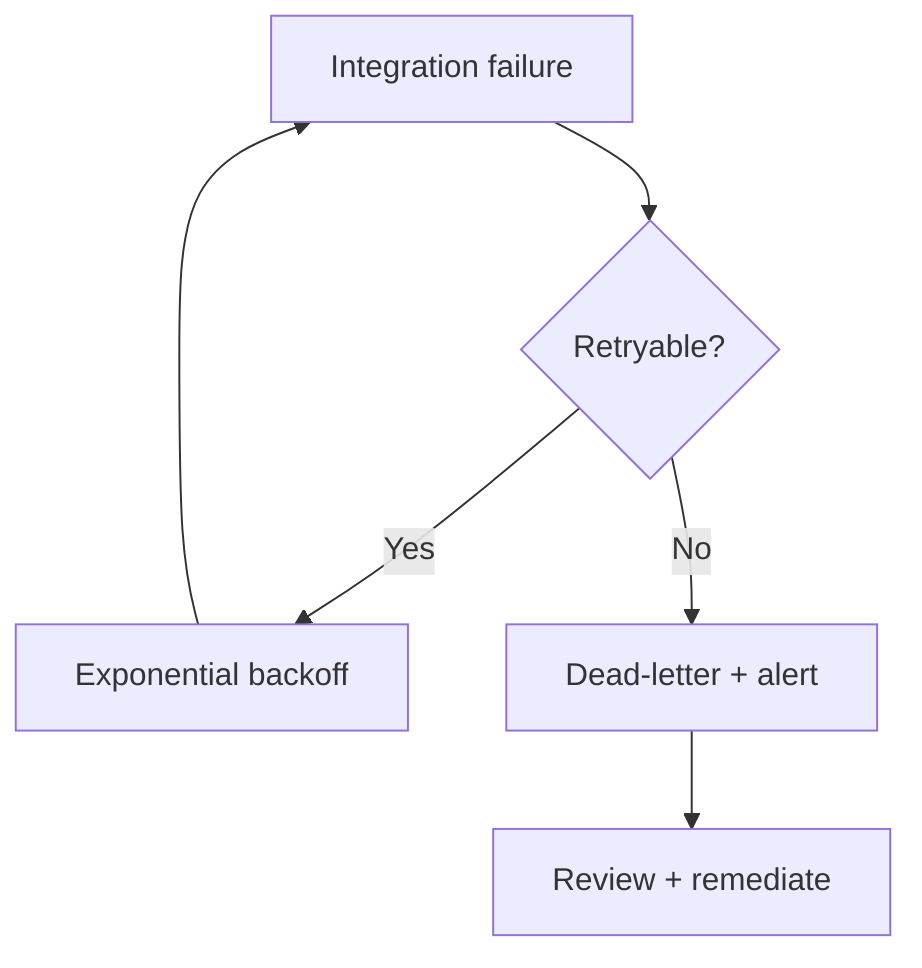

# Hospital ERP Enterprise — Interoperability Standards

> **Document ID:** `18-INTEROPERABILITY.md`
> **Owner:** Architecture / Engineering Lead (integration)
> **Status:** 🔄 Pending approval (Phase 1 gate)
> **Version:** 1.0.0
> **Last updated:** 2026-08-06
> **Review cadence:** Re-reviewed at every phase gate and when standards change.
>
> **Relationship:** Defines the **enterprise interoperability standard** for the Hospital ERP Enterprise platform: the healthcare and data-exchange standards it consumes, the integration mechanisms it uses, and the governance for external communication. It implements the integration architecture in [02-SYSTEM-ARCHITECTURE](02-SYSTEM-ARCHITECTURE.md) §11, the API standards in [11-API-STANDARDS](11-API-STANDARDS.md), the standardized data in [17-DATA-GOVERNANCE](17-DATA-GOVERNANCE.md), and the security/audit models in [06-AUTHENTICATION](06-AUTHENTICATION.md) and [08-AUDIT-LOGGING](08-AUDIT-LOGGING.md).

---

## Table of Contents

1. [Vision](#1-vision)
2. [Scope](#2-scope)
3. [HL7 v2](#3-hl7-v2)
4. [HL7 FHIR R4](#4-hl7-fhir-r4)
5. [DICOM](#5-dicom)
6. [CDA](#6-cda)
7. [SMART on FHIR](#7-smart-on-fhir)
8. [OpenEHR](#8-openehr)
9. [ABDM](#9-abdm)
10. [NHA](#10-nha)
11. [NABH](#11-nabh)
12. [External APIs](#12-external-apis)
13. [API Gateway](#13-api-gateway)
14. [Event Bus](#14-event-bus)
15. [Webhooks](#15-webhooks)
16. [Message Queue](#16-message-queue)
17. [Integration Security](#17-integration-security)
18. [Versioning](#18-versioning)
19. [Error Handling](#19-error-handling)
20. [Monitoring](#20-monitoring)
21. [Testing](#21-testing)
22. [Future Standards](#22-future-standards)
23. [KPIs](#23-kpis)
24. [Cross References](#24-cross-references)

---

## 1. Vision

Become a **standards-based, secure, and interoperable healthcare platform** — able to exchange clinical, administrative, and financial data with external health systems, national infrastructure (ABDM/NHA), payers, labs, and provider organizations, using open standards (HL7, FHIR, DICOM) rather than proprietary formats.

---

## 2. Scope

**In scope:** healthcare standards (HL7 v2, FHIR R4, DICOM, CDA, SMART on FHIR, OpenEHR), national/government integration (ABDM, NHA, NABH), integration mechanisms (external APIs, gateway, event bus, webhooks, message queue), and their security, versioning, error handling, monitoring, and testing.

**Out of scope:** internal module integration specifics (see [02-SYSTEM-ARCHITECTURE](02-SYSTEM-ARCHITECTURE.md) §11 and module docs), and data governance (see [17-DATA-GOVERNANCE](17-DATA-GOVERNANCE.md)).

### 2.1 Standards Principles

| # | Principle | Application |
| --- | --- | --- |
| INT-01 | **Standards first** | Use open standards over proprietary formats. |
| INT-02 | **Contract-first** | Exchange defined by schema before build. |
| INT-03 | **Secure by default** | AuthN, encryption, least privilege. |
| INT-04 | **Resilient** | Queues, retries, dead-lettering. |
| INT-05 | **Versioned** | Backward-compatible evolution. |
| INT-06 | **Audited** | All exchange is auditable ([08-AUDIT-LOGGING](08-AUDIT-LOGGING.md)). |
| INT-07 | **Tenant-scoped** | No cross-tenant leakage ([09-MULTI-TENANCY](09-MULTI-TENANCY.md)). |

---

## 3. HL7 v2

HL7 v2 is a mature, message-based standard widely used in hospital interfaces (ADT, orders, results).

| Aspect | Decision |
| --- | --- |
| Profile | HL7 v2.x (commonly 2.3–2.8) |
| Message types | ADT (admit/transfer/discharge), ORM (orders), ORU (results), SIU (scheduling) |
| Transport | MLLP (minimal lower layer protocol) over TCP/TLS |
| Usage | Clinical interfaces with labs, RIS, external systems |
| Direction | Inbound and outbound |
| Mapping | Message segments ↔ canonical model ([17-DATA-GOVERNANCE](17-DATA-GOVERNANCE.md) §4) |

### HL7 v2 Flow

---

## 4. HL7 FHIR R4

FHIR (Fast Healthcare Interoperability Resources) is the modern RESTful standard.

| Aspect | Decision |
| --- | --- |
| Version | FHIR R4 (4.0.1) |
| Transport | REST over HTTPS; JSON |
| Key resources | Patient, Practitioner, Organization, Location, Encounter, Observation, MedicationRequest |
| Operations | Standard CRUD + search; `$everything`, `$validate` |
| Profiles | Base R4; FHIR US/regional base profiles as applicable |
| Usage | Patient/clinical data exchange, national infra |
| Validation | Resources validated against profiles before accept |

### FHIR Resource Map

| FHIR resource | Platform concept |
| --- | --- |
| `Patient` | Patient Registry ([17-DATA-GOVERNANCE](17-DATA-GOVERNANCE.md) §4) |
| `Practitioner` | Staff master |
| `Organization` | Facility / hierarchy |
| `Location` | Location / unit |
| `Encounter` | Clinical encounter |
| `Observation` | Results |
| `MedicationRequest` | Prescription |

---

## 5. DICOM

DICOM governs medical imaging and its metadata.

| Aspect | Decision |
| --- | --- |
| Standard | DICOM (medical imaging) |
| Transport | DICOM C-STORE / DICOMweb REST |
| Data | Images and imaging metadata |
| Usage | Radiology/PACS integration |
| Storage | Imaging in object storage ([03-TECHNOLOGY-STACK](03-TECHNOLOGY-STACK.md)) |
| Mapping | Imaging references patient + encounter |
| Scope note | Consumed by imaging modules, not the organizational module ([10-HOSPITAL-HIERARCHY](10-HOSPITAL-HIERARCHY.md)) |

---

## 6. CDA

CDA (Clinical Document Architecture) encodes clinical documents as XML.

| Aspect | Decision |
| --- | --- |
| Standard | HL7 CDA (Release 2) |
| Format | XML; header + body sections |
| Usage | Document exchange (discharge summaries, referrals) |
| Templates | Domain templates (CCD) where applicable |
| Validation | Against CDA schema + templates |
| Direction | Outbound (share) and inbound (ingest) |

---

## 7. SMART on FHIR

SMART on FHIR enables third-party apps to run against FHIR data with OAuth.

| Aspect | Decision |
| --- | --- |
| Standard | SMART on FHIR |
| Auth | OAuth 2.0 / OIDC with scopes ([06-AUTHENTICATION](06-AUTHENTICATION.md)) |
| Scopes | Granular `patient/*.read`, `user/*.read` scopes |
| App launch | EHR/Portal-launched apps |
| Use | Patient-facing and clinical apps |
| Security | Consent + least privilege per scope |
| Alignment | Consistent with the platform identity model ([06-AUTHENTICATION](06-AUTHENTICATION.md)) |

---

## 8. OpenEHR

OpenEHR is a two-level modeling standard (reference + archetypes).

| Aspect | Decision |
| --- | --- |
| Relevance | **Evaluated, not adopted in v1** |
| Model | Two-level: reference model + archetypes |
| Trade-off | Powerful flexibility; higher complexity than FHIR for this platform |
| Decision | Standardize on FHIR for exchange; OpenEHR re-evaluated if archetype-driven clinical data is required |
| Status | Future consideration ([§22](#22-future-standards)) |

---

## 9. ABDM

ABDM (Ayushman Bharat Digital Mission) connects health data across India via national digital identity and standards.

| Aspect | Decision |
| --- | --- |
| Relevance | **Applicable** for national health interoperability |
| Components | ABHA (health ID), Health Records sharing, registries |
| Identity | Patient health ID linkage |
| Exchange | Consent-based health information exchange |
| Standard | FHIR-based exchange aligned to ABDM |
| Security | National APIs with mandated auth + consent |
| Status | Implemented where national integration is required |

### ABDM Context

---

## 10. NHA

NHA (National Health Authority) is the governing body for national digital health programs (including ABDM).

| Aspect | Decision |
| --- | --- |
| Role | Regulates national health digital infrastructure |
| Compliance | Alignment with NHA standards and frameworks |
| Relationship | ABDM integration governed under NHA |
| Evidence | Compliance evidence per [00-MASTER-ROADMAP](00-MASTER-ROADMAP.md) §15 |
| Status | Applicable where national programs are in scope |

---

## 11. NABH

NABH (National Accreditation Board for Hospitals) sets accreditation standards for hospitals.

| Aspect | Decision |
| --- | --- |
| Relevance | **Applicable** for hospital accreditation |
| Requirement | Documented organizational structure, governance, clinical processes |
| Contribution | Structure/compliance evidence ([17-DATA-GOVERNANCE](17-DATA-GOVERNANCE.md) §4) |
| Interoperability | Supports data exchange evidence for accreditation |
| Audit | Audit trail supports accreditation review ([08-AUDIT-LOGGING](08-AUDIT-LOGGING.md)) |
| Status | Compliance evidence ongoing |

---

## 12. External APIs

External integrations use a defined API surface.

| Aspect | Decision |
| --- | --- |
| Contract | OpenAPI-contracted ([11-API-STANDARDS](11-API-STANDARDS.md)) |
| Authentication | OAuth 2.0 / mTLS ([06-AUTHENTICATION](06-AUTHENTICATION.md)) |
| Rate limiting | Per client/tenant ([11-API-STANDARDS](11-API-STANDARDS.md)) |
| Idempotency | Keys for retryable writes |
| Timeouts | Bounded; async for long ops |
| Versioning | Per [§18](#18-versioning) |

---

## 13. API Gateway

All integration traffic enters through the API gateway.

| Aspect | Decision |
| --- | --- |
| Entry | All requests via gateway ([02-SYSTEM-ARCHITECTURE](02-SYSTEM-ARCHITECTURE.md) §11) |
| AuthN/Z | Gateway enforces authentication + coarse authorization |
| Routing | Routes to services/modules |
| Rate limit | Per client/tenant |
| Observability | Traces, metrics, logs |
| TLS | Terminated/forwarded securely |

### Gateway Flow

---

## 14. Event Bus

Asynchronous, durable, replayable event propagation across the platform ([02-SYSTEM-ARCHITECTURE](02-SYSTEM-ARCHITECTURE.md) §12).

| Aspect | Decision |
| --- | --- |
| Technology | Kafka ([03-TECHNOLOGY-STACK](03-TECHNOLOGY-STACK.md) §4.6) |
| Semantics | At-least-once; consumer groups |
| Outbox | Cross-module events via outbox ([05-DATABASE-ARCHITECTURE](05-DATABASE-ARCHITECTURE.md) §6) |
| Ordering | Per correlation/tenant |
| Replay | Events replayable for projections |
| Integrations | External systems consume/publish events where appropriate |

---

## 15. Webhooks

Webhooks notify external systems of events.

| Aspect | Decision |
| --- | --- |
| Purpose | Outbound event notifications to external consumers |
| Delivery | HTTP POST with signed payload |
| Retry | Exponential backoff with dead-letter |
| Security | HMAC/signature verification; HTTPS |
| Registry | Managed, tenant-scoped webhook registry |
| Audit | Webhook deliveries audited |

### Webhook Delivery

---

## 16. Message Queue

Message queues handle reliable point-to-point and workload processing.

| Aspect | Decision |
| --- | --- |
| Role | Durable message delivery for jobs/integrations |
| Ordering | Per correlation/tenant |
| Backpressure | Bounded concurrency |
| Dead-letter | Final failures to DLQ + alert |
| Retry | Exponential backoff |
| Idempotency | Dedupe on message id |
| Monitoring | Queue-depth + failure alerts |

---

## 17. Integration Security

Integrations follow the platform security model ([06-AUTHENTICATION](06-AUTHENTICATION.md), [08-AUDIT-LOGGING](08-AUDIT-LOGGING.md), [09-MULTI-TENANCY](09-MULTI-TENANCY.md)).

| Control | Application |
| --- | --- |
| Authentication | OAuth 2.0 / OIDC; mTLS for service-to-service |
| Authorization | Least privilege; scoped service identities ([07-ROLES-PERMISSIONS](07-ROLES-PERMISSIONS.md)) |
| Encryption | TLS in transit; at-rest encryption |
| Payload security | Signatures on webhooks; no PHI in URLs/logs |
| Tenant isolation | No cross-tenant data in exchange ([09-MULTI-TENANCY](09-MULTI-TENANCY.md)) |
| Secrets | Central secret manager ([16-DEPLOYMENT-STANDARDS](16-DEPLOYMENT-STANDARDS.md) §7) |
| Consent | Consent-based access for patient data (ABDM/SMART) |
| Audit | All integration exchange audited |

### Security by Standard

| Standard | Auth | Encryption | Consent | Audit |
| --- | --- | --- | --- | --- |
| FHIR | OAuth/mTLS | ✓ | ✓ | ✓ |
| SMART | OAuth scopes | ✓ | ✓ | ✓ |
| HL7 v2 | MLLP/TLS | ✓ | · | ✓ |
| ABDM | National APIs | ✓ | ✓ | ✓ |
| Webhooks | HMAC signature | ✓ | · | ✓ |

---

## 18. Versioning

Exchange contracts are versioned for backward compatibility ([11-API-STANDARDS](11-API-STANDARDS.md)).

| Aspect | Decision |
| --- | --- |
| API versioning | URL `/api/v{n}` + contract version |
| FHIR version | Explicit (R4) |
| HL7 version | Per message profile |
| Contract evolution | Additive within a version |
| Deprecation | Notified; sunset per policy |
| Compatibility | Backward-compatible changes avoid breaking consumers |

---

## 19. Error Handling

| Error | Handling |
| --- | --- |
| Invalid message | Reject with schema validation detail |
| AuthN failure | Log + alert; no data leak |
| Unreachable external | Retry with backoff |
| Contract violation | Reject; notify provider |
| Final failure | Dead-letter + alert |
| Partial batch | Per-item report; no partial commit ([05-DATABASE-ARCHITECTURE](05-DATABASE-ARCHITECTURE.md) §6) |
| Timeout | Async where slow; bounded |

### Error Flow

---

## 20. Monitoring

Integrations are monitored per the observability architecture ([02-SYSTEM-ARCHITECTURE](02-SYSTEM-ARCHITECTURE.md) §14).

| Metric | Alert |
| --- | --- |
| Success rate | Below target |
| Queue depth | Backlog |
| Dead-letter depth | Non-zero |
| Retry rate | Spike |
| Latency | Above SLA |
| Failure rate | Spike |

---

## 21. Testing

Integrations are tested per [15-TESTING-STANDARDS](15-TESTING-STANDARDS.md).

| Test | Covers |
| --- | --- |
| Contract tests | OpenAPI/FHIR profile conformance |
| Message tests | HL7/HL7 FHIR mapping correctness |
| Transformation | Segment/field mapping |
| Security | AuthN/Z, signature, isolation |
| Resilience | Retry, DLQ, outage |
| Interoperability | Conformance to standards (validation against official test tools) |
| Performance | Throughput/latency under load ([14-PERFORMANCE-STANDARDS](14-PERFORMANCE-STANDARDS.md)) |

---

## 22. Future Standards

| Standard | Consideration | Horizon |
| --- | --- | --- |
| OpenEHR | Adopt only if archetype-driven data needed | Evaluate |
| HL7 FHIR R5 | Track migration from R4 | Track |
| IHE profiles | Structured interoperability for imaging/health | Evaluate |
| Fast Healthcare Interoperability (bulk) | Bulk data export | Evaluate |
| Local/regional standards | Regional health exchange variants | Track |

Future standards are evaluated at gates ([00-MASTER-ROADMAP](00-MASTER-ROADMAP.md)).

---

## 23. KPIs

| KPI | Target |
| --- | --- |
| Integration success rate | ≥ 99% |
| Exchange latency | Within SLA ([14-PERFORMANCE-STANDARDS](14-PERFORMANCE-STANDARDS.md)) |
| Standards conformance | 100% validated |
| Dead-letter rate | < 1% |
| Security incidents | 0 |
| Contract coverage | 100% of interfaces contracted |

---

## 24. Cross References

| Reference | Relationship | Direction |
| --- | --- | --- |
| [00-MASTER-ROADMAP](00-MASTER-ROADMAP.md) | Compliance (NABH/NHA), phasing | Consumes |
| [02-SYSTEM-ARCHITECTURE](02-SYSTEM-ARCHITECTURE.md) | Integration + eventing architecture | Consumes |
| [03-TECHNOLOGY-STACK](03-TECHNOLOGY-STACK.md) | Kafka, storage | Consumes |
| [05-DATABASE-ARCHITECTURE](05-DATABASE-ARCHITECTURE.md) | Outbox, transactions | Consumes |
| [06-AUTHENTICATION](06-AUTHENTICATION.md) | AuthN/Z, OAuth/OIDC | Consumes |
| [07-ROLES-PERMISSIONS](07-ROLES-PERMISSIONS.md) | Least privilege, scoping | Consumes |
| [08-AUDIT-LOGGING](08-AUDIT-LOGGING.md) | Audit of exchange | Consumes |
| [09-MULTI-TENANCY](09-MULTI-TENANCY.md) | Tenant isolation | Consumes |
| [10-HOSPITAL-HIERARCHY](10-HOSPITAL-HIERARCHY.md) | Organizational data | Consumes |
| [11-API-STANDARDS](11-API-STANDARDS.md) | API contract standards | Consumes |
| [14-PERFORMANCE-STANDARDS](14-PERFORMANCE-STANDARDS.md) | Exchange performance | Consumes |
| [15-TESTING-STANDARDS](15-TESTING-STANDARDS.md) | Integration testing | Consumes |
| [16-DEPLOYMENT-STANDARDS](16-DEPLOYMENT-STANDARDS.md) | Secrets, operations | Consumes |
| [17-DATA-GOVERNANCE](17-DATA-GOVERNANCE.md) | Standardized data | Consumes |

---

*End of `docs/18-INTEROPERABILITY.md`.*
