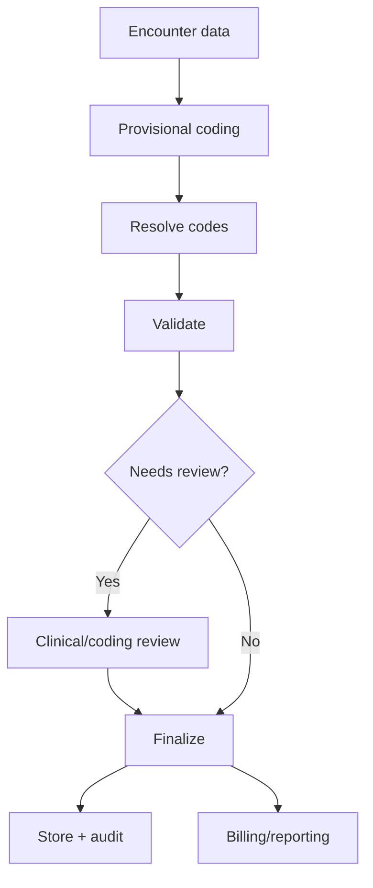

# Hospital ERP Enterprise — Clinical Standards

> **Document ID:** `19-CLINICAL-STANDARDS.md`
> **Owner:** Chief Medical Information Officer / Clinical Informatics
> **Status:** 🔄 Pending approval (Phase 1 gate)
> **Version:** 1.0.0
> **Last updated:** 2026-08-06
> **Review cadence:** Re-reviewed at every phase gate and when clinical terminology versions change.
>
> **Relationship:** Defines the **enterprise clinical standards** for the Hospital ERP Enterprise platform: the clinical terminologies (ICD, SNOMED CT, LOINC, RxNorm, ATC, UCUM), clinical coding, terminology services, diagnosis/procedure standards, clinical validation, coding workflow, and clinical quality. It operationalizes clinical reference data in [17-DATA-GOVERNANCE](17-DATA-GOVERNANCE.md), aligns with [18-INTEROPERABILITY](18-INTEROPERABILITY.md), and is audited per [08-AUDIT-LOGGING](08-AUDIT-LOGGING.md).

---

## Table of Contents

1. [Purpose & Scope](#1-purpose--scope)
2. [Vision](#2-vision)
3. [ICD-10](#3-icd-10)
4. [ICD-11](#4-icd-11)
5. [SNOMED CT](#5-snomed-ct)
6. [LOINC](#6-loinc)
7. [RxNorm](#7-rxnorm)
8. [ATC](#8-atc)
9. [UCUM](#9-ucum)
10. [Clinical Coding](#10-clinical-coding)
11. [Terminology Services](#11-terminology-services)
12. [Diagnosis Standards](#12-diagnosis-standards)
13. [Procedure Standards](#13-procedure-standards)
14. [Clinical Validation](#14-clinical-validation)
15. [Coding Workflow](#15-coding-workflow)
16. [Clinical Quality](#16-clinical-quality)
17. [Audit](#17-audit)
18. [Future Standards](#18-future-standards)
19. [Cross References](#19-cross-references)

---

## 1. Purpose & Scope

This document defines the **clinical terminologies and coding standards** used across the Hospital ERP Enterprise platform to ensure clinical data is captured, coded, exchanged, and reported in a consistent, safe, and auditable manner.

**Scope:** clinical terminology systems, clinical coding, terminology services, diagnosis/procedure standards, clinical validation, coding workflow, clinical quality, and clinical audit. **Out of scope:** data governance ([17-DATA-GOVERNANCE](17-DATA-GOVERNANCE.md)) and interoperability ([18-INTEROPERABILITY](18-INTEROPERABILITY.md)).

### 1.1 Clinical Standards Principles

| # | Principle | Application |
| --- | --- | --- |
| CS-01 | **Standards-based** | Use recognized clinical terminologies over free text. |
| CS-02 | **Patient safety** | Correct coding underpins safe care and reporting. |
| CS-03 | **Single terminology source** | Terms served centrally by terminology services. |
| CS-04 | **Validated** | Codes validated against authoritative editions. |
| CS-05 | **Audited** | Coding decisions and changes are auditable. |
| CS-06 | **Versioned** | Terminology versions pinned and migration-governed. |

---

## 2. Vision

Ensure every clinical concept — diagnosis, procedure, medication, observation — is **coded against a recognized standard**, served consistently across the platform, and safely exchanged and reported.

---

## 3. ICD-10

ICD-10 is the World Health Organization classification of diseases.

| Aspect | Decision |
| --- | --- |
| Standard | ICD-10 (WHO); regional/clinical modification as applicable |
| Purpose | Diagnosis classification and coding |
| Structure | Chapters, blocks, three/four-character codes |
| Usage | Diagnosis recording, billing, reporting |
| Editions | Pinned version; migration governed |
| Validation | Codes validated against the edition |

---

## 4. ICD-11

ICD-11 is the WHO's current revision, with a more detailed, computable model.

| Aspect | Decision |
| --- | --- |
| Standard | ICD-11 |
| Purpose | Current diagnosis classification |
| Advantages | Post-coordination, computable structure |
| Migration | Planned from ICD-10; dual-coding during transition |
| Status | Tracked; adoption governed at gates ([00-MASTER-ROADMAP](00-MASTER-ROADMAP.md)) |
| Coexistence | ICD-10 and ICD-11 both supported during migration |

### ICD Transition

---

## 5. SNOMED CT

SNOMED CT is a comprehensive clinical terminology for concepts and relationships.

| Aspect | Decision |
| --- | --- |
| Standard | SNOMED CT |
| Purpose | Detailed clinical concepts (findings, procedures) |
| Model | Concepts, descriptions, relationships; compositional |
| Usage | Rich clinical detail; complements ICD coding |
| Interoperability | Mapped for exchange ([18-INTEROPERABILITY](18-INTEROPERABILITY.md)) |
| Licensing | Managed per license terms |

---

## 6. LOINC

LOINC standardizes laboratory and clinical observations.

| Aspect | Decision |
| --- | --- |
| Standard | LOINC |
| Purpose | Lab tests and observations coding |
| Model | Component, property, time, scale, method |
| Usage | Laboratory orders and results |
| Mapping | Observations mapped to LOINC |
| Validation | Codes validated against the LOINC release |

---

## 7. RxNorm

RxNorm provides normalized names for clinical drugs.

| Aspect | Decision |
| --- | --- |
| Standard | RxNorm (US); national drug terminology as applicable |
| Purpose | Clinical drug naming and mapping |
| Model | Ingredient, brand, dose-form, NDC links |
| Usage | Medication prescribing and dispensing |
| Interoperability | MedicationRequest exchange ([18-INTEROPERABILITY](18-INTEROPERABILITY.md)) |

---

## 8. ATC

ATC (Anatomical Therapeutic Chemical) classifies drugs by therapeutic system.

| Aspect | Decision |
| --- | --- |
| Standard | ATC (WHO) |
| Purpose | Drug classification by therapeutic use |
| Model | Hierarchical (anatomical → chemical substance) |
| Usage | Medication analytics and classification |
| Complement | Complements RxNorm for clinical names |

---

## 9. UCUM

UCUM (Unified Code for Units of Measure) standardizes units.

| Aspect | Decision |
| --- | --- |
| Standard | UCUM |
| Purpose | Unambiguous units of measure |
| Usage | Medications (dose), lab results, vitals |
| Interoperability | Units expressed in UCUM in exchange |
| Validation | Units validated against UCUM |

---

## 10. Clinical Coding

**Clinical coding** is the process of assigning standard codes to diagnoses, procedures, and observations.

| Aspect | Decision |
| --- | --- |
| Input | Structured clinical data |
| Output | Standard codes (ICD, SNOMED, LOINC, etc.) |
| Method | Coder-assigned with terminology services support |
| Ambiguity | Unclear cases routed for clinical review |
| Consistency | Same concept → same code |
| Safety | Codes verified before use in billing/reporting |

### Coding Model

---

## 11. Terminology Services

A central terminology service serves codes consistently across the platform.

| Aspect | Decision |
| --- | --- |
| Service | Central terminology/classification server |
| Functions | Search, resolve, validate, map codes |
| Caching | Served via cache for performance ([03-TECHNOLOGY-STACK](03-TECHNOLOGY-STACK.md) §4.5) |
| Versions | Pinned editions; version-aware lookup |
| Consumers | All clinical modules via API ([11-API-STANDARDS](11-API-STANDARDS.md)) |
| Governance | Managed as governed reference data ([17-DATA-GOVERNANCE](17-DATA-GOVERNANCE.md) §7) |

---

## 12. Diagnosis Standards

| Aspect | Decision |
| --- | --- |
| Primary coding | ICD-10 (transitioning to ICD-11) |
| Detail | SNOMED CT for rich clinical detail |
| Principal diagnosis | Explicitly identified per encounter |
| Comorbidities | Additional diagnoses coded |
| Present-on-admission | Captured where required |
| Validation | Codes valid + appropriate to encounter |

---

## 13. Procedure Standards

| Aspect | Decision |
| --- | --- |
| Primary coding | Procedure terminology per standard in use |
| Detail | SNOMED CT where applicable |
| Modifiers | Captured (laterality, approach) |
| Validation | Codes valid + appropriate |
| Safety | Correct procedure coding for billing + clinical record |

---

## 14. Clinical Validation

Validation ensures coded data is safe and correct at the boundary ([11-API-STANDARDS](11-API-STANDARDS.md)).

| Validation | Application |
| --- | --- |
| Code validity | Exists in pinned edition |
| Code appropriateness | Valid in clinical context |
| Required fields | Diagnosis/procedure data present |
| Consistency | Cross-field consistency (e.g., sex/diagnosis) |
| Uniqueness | No duplicate diagnosis entries |
| Edit logic | Coding edits (e.g., valid code/principal diagnosis) |

---

## 15. Coding Workflow

| Stage | Action |
| --- | --- |
| Capture | Clinical data captured |
| Resolve | Codes assigned via terminology services |
| Validate | Coding edits applied |
| Review | Ambiguity escalated to clinical/coding review |
| Finalize | Coded record finalized |
| Audit | Coded + change events audited ([§17](#17-audit)) |

---

## 16. Clinical Quality

Quality measures ensure clinical data drives safe care and accurate reporting.

| Dimension | Measure |
| --- | --- |
| Coding accuracy | % codes correct against review |
| Completeness | % encounters fully coded |
| Timeliness | Coding lag |
| Validity | % invalid codes |
| Consistency | % same-concept-same-code |
| Safety | Coding-related incidents |

### Quality Rules

| Rule | Application |
| --- | --- |
| **Measure continuously** | KPIs computed on schedule. |
| **Alert on regression** | Quality drops alert. |
| **Root-cause** | Issues traced to source. |
| **Improve** | Corrective action at source. |

---

## 17. Audit

Clinical coding is audited per [08-AUDIT-LOGGING](08-AUDIT-LOGGING.md).

| Audit | Captures |
| --- | --- |
| Coding changes | Who coded/re-coded, what, when |
| Validation failures | Rejected codes and reason |
| Review decisions | Clinical review outcomes |
| Terminology version | Edition used at coding time |
| Access | Who accessed clinical coding |

### Audit Rules

| Rule | Application |
| --- | --- |
| Immutable | Append-only ([08-AUDIT-LOGGING](08-AUDIT-LOGGING.md)) |
| Attributable | Actor/action/entity/time |
| Version-aware | Terminology edition recorded |
| Retained | Per compliance schedule ([17-DATA-GOVERNANCE](17-DATA-GOVERNANCE.md) §16) |
| Authorized access | `audit`-scoped access ([07-ROLES-PERMISSIONS](07-ROLES-PERMISSIONS.md)) |

---

## 18. Future Standards

| Standard | Consideration | Horizon |
| --- | --- | --- |
| ICD-11 migration | Dual-coding then primary | Tracked |
| Regional terminologies | Local classification variants | Track |
| FHIR terminology | `$expand`/`$validate` operations | Adopt |
| Value-set governance | Versioned FHIR value sets | Adopt |
| AI-assisted coding | Suggest codes; human confirms | Evaluate |

Future standards are evaluated at gates ([00-MASTER-ROADMAP](00-MASTER-ROADMAP.md)).

---

## 19. Cross References

| Reference | Relationship | Direction |
| --- | --- | --- |
| [00-MASTER-ROADMAP](00-MASTER-ROADMAP.md) | Phasing, compliance | Consumes |
| [02-SYSTEM-ARCHITECTURE](02-SYSTEM-ARCHITECTURE.md) | Architecture, terminology service | Consumes |
| [07-ROLES-PERMISSIONS](07-ROLES-PERMISSIONS.md) | Clinical access scoping | Consumes |
| [08-AUDIT-LOGGING](08-AUDIT-LOGGING.md) | Coding audit | Consumes |
| [11-API-STANDARDS](11-API-STANDARDS.md) | Terminology service API | Consumes |
| [14-PERFORMANCE-STANDARDS](14-PERFORMANCE-STANDARDS.md) | Terminology lookup performance | Consumes |
| [15-TESTING-STANDARDS](15-TESTING-STANDARDS.md) | Coding validation testing | Consumes |
| [17-DATA-GOVERNANCE](17-DATA-GOVERNANCE.md) | Reference data, PHI, retention | Consumes |
| [18-INTEROPERABILITY](18-INTEROPERABILITY.md) | Clinical data exchange | Consumes |

---

*End of `docs/19-CLINICAL-STANDARDS.md`.*
