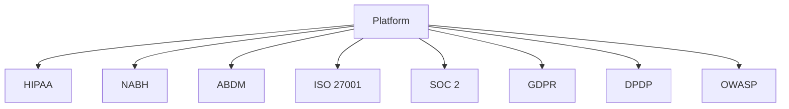
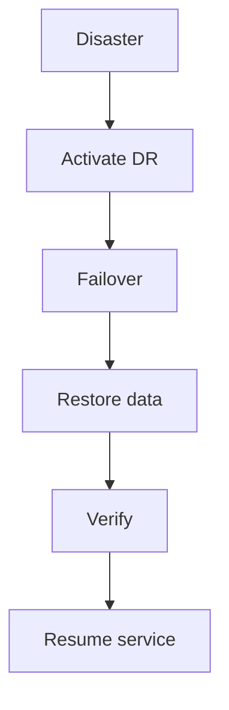

# Hospital ERP Enterprise — Compliance Framework

> **Document ID:** `20-COMPLIANCE.md`
> **Owner:** Chief Compliance Officer / Security & Compliance Lead
> **Status:** 🔄 Pending approval (Phase 1 gate)
> **Version:** 1.0.0
> **Last updated:** 2026-08-06
> **Review cadence:** Re-reviewed at every phase gate and when regulations change.
>
> **Relationship:** Defines the **enterprise compliance framework** for the Hospital ERP Enterprise platform — the regulations and standards (HIPAA, NABH, ABDM, ISO 27001, SOC 2, GDPR, DPDP, OWASP), the audit and retention obligations, and the DR/BC requirements. It operationalizes the compliance matrix in [00-MASTER-ROADMAP](00-MASTER-ROADMAP.md) §15, the audit standard in [08-AUDIT-LOGGING](08-AUDIT-LOGGING.md), retention in [17-DATA-GOVERNANCE](17-DATA-GOVERNANCE.md), and DR in [05-DATABASE-ARCHITECTURE](05-DATABASE-ARCHITECTURE.md).

---

## Table of Contents

1. [Purpose & Scope](#1-purpose--scope)
2. [Vision](#2-vision)
3. [Compliance Framework](#3-compliance-framework)
4. [HIPAA](#4-hipaa)
5. [NABH](#5-nabh)
6. [ABDM](#6-abdm)
7. [ISO 27001](#7-iso-27001)
8. [SOC 2](#8-soc-2)
9. [GDPR](#9-gdpr)
10. [DPDP Act (India)](#10-dpdp-act-india)
11. [OWASP](#11-owasp)
12. [Audit](#12-audit)
13. [Legal Retention](#13-legal-retention)
14. [Disaster Recovery](#14-disaster-recovery)
15. [Business Continuity](#15-business-continuity)
16. [Compliance KPIs](#16-compliance-kpis)
17. [Cross References](#17-cross-references)

---

## 1. Purpose & Scope

This document defines the **enterprise compliance framework** for the Hospital ERP Enterprise platform: the applicable regulations and standards, the obligations they impose on the platform, and the audit, retention, DR, and continuity measures that satisfy them.

**Scope:** regulatory and standards compliance, audit, legal retention, DR, business continuity, and compliance KPIs. **Out of scope:** security controls in depth ([06-AUTHENTICATION](06-AUTHENTICATION.md), [07-ROLES-PERMISSIONS](07-ROLES-PERMISSIONS.md)) and data governance ([17-DATA-GOVERNANCE](17-DATA-GOVERNANCE.md)).

### 1.1 Compliance Principles

| # | Principle | Application |
| --- | --- | --- |
| CM-01 | **Compliance by design** | Controls built in, not retrofitted. |
| CM-02 | **Evidence-based** | Automated, auditable evidence. |
| CM-03 | **Least privilege** | Minimized access and data ([07-ROLES-PERMISSIONS](07-ROLES-PERMISSIONS.md)). |
| CM-04 | **Documented** | Policies, records, and evidence retained. |
| CM-05 | **Reviewed** | Re-assessed at gates and on change. |
| CM-06 | **Privacy-first** | Patient data handled per classification ([17-DATA-GOVERNANCE](17-DATA-GOVERNANCE.md) §14). |

---

## 2. Vision

Achieve and sustain **regulatory and accreditation compliance** — HIPAA alignment, NABH accreditation, ABDM integration, ISO 27001 / SOC 2 certification, and GDPR / DPDP privacy compliance — through an auditable, automated, and continuously reviewed framework.

---

## 3. Compliance Framework

The platform maps its controls to each applicable standard.

| Standard | Scope | Primary controls |
| --- | --- | --- |
| HIPAA | PHI protection (US) | Encryption, access, audit, BAA |
| NABH | Hospital accreditation (India) | Structure, governance, clinical processes |
| ABDM | National health interoperability (India) | Consent, national identity, FHIR |
| ISO 27001 | Information security management (global) | ISMS, risk, controls |
| SOC 2 | Trust services (global) | Security, availability, confidentiality |
| GDPR | Data protection (EU) | Consent, rights, privacy |
| DPDP Act | Data protection (India) | Consent, rights, purpose limitation |
| OWASP | Secure development (global) | Secure coding, testing, review |

### Coverage Matrix

---

## 4. HIPAA

HIPAA protects US health information (PHI).

| Aspect | Decision |
| --- | --- |
| Relevance | **Applicable** where PHI is handled (US scope) |
| Safeguards | Administrative, physical, technical |
| Technical | Encryption, access control, audit ([06-AUTHENTICATION](06-AUTHENTICATION.md), [08-AUDIT-LOGGING](08-AUDIT-LOGGING.md)) |
| Privacy Rule | Consent and minimum necessary |
| Security Rule | Confidentiality, integrity, availability of PHI |
| BAA | Business associate agreements for vendors |
| Breach | Notification per regulation |

---

## 5. NABH

NABH is the Indian hospital accreditation standard.

| Aspect | Decision |
| --- | --- |
| Relevance | **Applicable** for hospital accreditation |
| Focus | Patient safety, governance, quality |
| Contribution | Organizational structure, clinical standards ([19-CLINICAL-STANDARDS](19-CLINICAL-STANDARDS.md)) |
| Evidence | Documented, audited controls |
| Governance | Quality and safety committees |
| Interop | Data exchange supports evidence ([18-INTEROPERABILITY](18-INTEROPERABILITY.md)) |

---

## 6. ABDM

ABDM governs India's national digital health infrastructure ([18-INTEROPERABILITY](18-INTEROPERABILITY.md) §9).

| Aspect | Decision |
| --- | --- |
| Relevance | **Applicable** for national health interoperability |
| Identity | ABHA health ID linkage |
| Consent | Consent-manager-based sharing |
| Exchange | FHIR-based, national APIs |
| Compliance | Aligned to NHA regulations |
| Security | Mandated auth + consent ([06-AUTHENTICATION](06-AUTHENTICATION.md)) |

---

## 7. ISO 27001

ISO 27001 is the international information security management standard.

| Aspect | Decision |
| --- | --- |
| Relevance | **Applicable** for ISMS |
| ISMS | Documented management system |
| Risk | Risk assessment and treatment ([00-MASTER-ROADMAP](00-MASTER-ROADMAP.md) §14) |
| Controls | Annex A controls mapped to platform |
| Audit | Internal + external audits |
| Certification | Pursued at defined gates ([00-MASTER-ROADMAP](00-MASTER-ROADMAP.md)) |

---

## 8. SOC 2

SOC 2 reports on trust service criteria.

| Aspect | Decision |
| --- | --- |
| Relevance | **Applicable** for third-party assurance |
| Criteria | Security, availability, processing integrity, confidentiality, privacy |
| Report | Type I / Type II assessment |
| Controls | Mapped to platform security model ([06-AUTHENTICATION](06-AUTHENTICATION.md), [09-MULTI-TENANCY](09-MULTI-TENANCY.md)) |
| Monitoring | Continuous evidence collection |

---

## 9. GDPR

GDPR protects EU data subjects' personal data.

| Aspect | Decision |
| --- | --- |
| Relevance | **Applicable** where EU data is processed |
| Lawful basis | Consent / legitimate interest |
| Rights | Access, rectification, erasure, portability |
| DPIA | For high-risk processing |
| Records | Processing records retained |
| Breach | Notification within regulation timeframe |

---

## 10. DPDP Act (India)

The DPDP (Digital Personal Data Protection) Act governs Indian data protection.

| Aspect | Decision |
| --- | --- |
| Relevance | **Applicable** for Indian data subjects |
| Consent | Explicit, informed consent |
| Purpose limitation | Data used for stated purpose |
| Rights | Access, correction, erasure |
| Security | Safeguards and breach notification |
| Children | Special handling of minors' data |

---

## 11. OWASP

OWASP provides secure-development guidance.

| Aspect | Decision |
| --- | --- |
| Relevance | **Applicable** to all development |
| Application | Secure coding per [04-CODING-STANDARDS](04-CODING-STANDARDS.md) |
| Testing | SAST/DAST per [15-TESTING-STANDARDS](15-TESTING-STANDARDS.md) |
| Top 10 | Threat-modeled and mitigated |
| Review | Security review at gates |
| Training | Developer security awareness |

---

## 12. Audit

Compliance is evidenced through audit ([08-AUDIT-LOGGING](08-AUDIT-LOGGING.md)).

| Audit type | Captures |
| --- | --- |
| Change audit | Who changed what, when |
| Access audit | Who accessed sensitive data |
| Compliance evidence | Control operating records |
| Regulatory evidence | NABH/ABDM/ISO evidence |
| External audit | Independent assessment |

### Audit Rules

| Rule | Application |
| --- | --- |
| Immutable | Tamper-evident, append-only ([08-AUDIT-LOGGING](08-AUDIT-LOGGING.md)) |
| Complete | All sensitive/change operations |
| Attributable | Actor/action/entity/time |
| Retained | Per legal retention ([§13](#13-legal-retention)) |
| Authorized | `audit`-scoped access ([07-ROLES-PERMISSIONS](07-ROLES-PERMISSIONS.md)) |

---

## 13. Legal Retention

Data and evidence are retained per legal and regulatory schedules ([17-DATA-GOVERNANCE](17-DATA-GOVERNANCE.md) §16).

| Record | Retention basis |
| --- | --- |
| Clinical/PHI records | Regulatory schedule |
| Financial records | Regulatory schedule |
| Audit records | Compliance/evidence schedule |
| Consent records | Duration of processing + law |
| DR backups | Retention + recovery needs |
| Contracts/BAA | Contract duration + law |

### Retention Rules

| Rule | Application |
| --- | --- |
| Policy-driven | Defined per class ([17-DATA-GOVERNANCE](17-DATA-GOVERNANCE.md) §16) |
| Automated | Scheduled jobs, audited |
| Legal hold | Supersedes standard retention |
| Compliance-linked | Aligned to schedules ([00-MASTER-ROADMAP](00-MASTER-ROADMAP.md) §15) |
| Verified | Retention tested and monitored |

---

## 14. Disaster Recovery

DR restores service and data after a disaster ([05-DATABASE-ARCHITECTURE](05-DATABASE-ARCHITECTURE.md) §10, [16-DEPLOYMENT-STANDARDS](16-DEPLOYMENT-STANDARDS.md)).

| Aspect | Decision |
| --- | --- |
| RPO | Defined per data class |
| RTO | Defined and tested |
| Backups | Encrypted, automated, verified |
| Cross-region | Where supported |
| Failover | Tested drills |
| Restore | Point-in-time recovery ([05-DATABASE-ARCHITECTURE](05-DATABASE-ARCHITECTURE.md) §10) |

### DR Flow

---

## 15. Business Continuity

BC ensures critical functions continue during disruption ([16-DEPLOYMENT-STANDARDS](16-DEPLOYMENT-STANDARDS.md) §10).

| Aspect | Decision |
| --- | --- |
| BCP | Documented continuity plan |
| Critical functions | Prioritized recovery |
| Availability | 99.9% target ([00-MASTER-ROADMAP](00-MASTER-ROADMAP.md) §2.2) |
| Degraded mode | Serve critical functions during partial outage |
| Communication | Notify stakeholders per plan |
| Drills | Periodic tested exercises |

---

## 16. Compliance KPIs

| KPI | Target |
| --- | --- |
| Open high/critical findings | 0 ([00-MASTER-ROADMAP](00-MASTER-ROADMAP.md) §2.3) |
| Audit evidence completeness | 100% |
| Retention compliance | 100% |
| RPO/RTO met | 100% of drills |
| Security incidents | 0 |
| Breach response time | Within regulation |
| Certification status | Maintained at gates |

---

## 17. Cross References

| Reference | Relationship | Direction |
| --- | --- | --- |
| [00-MASTER-ROADMAP](00-MASTER-ROADMAP.md) | Compliance matrix, KPIs | Consumes |
| [04-CODING-STANDARDS](04-CODING-STANDARDS.md) | OWASP secure coding | Consumes |
| [05-DATABASE-ARCHITECTURE](05-DATABASE-ARCHITECTURE.md) | DR, backups, security | Consumes |
| [06-AUTHENTICATION](06-AUTHENTICATION.md) | Access, consent, MFA | Consumes |
| [07-ROLES-PERMISSIONS](07-ROLES-PERMISSIONS.md) | Least privilege, audit scope | Consumes |
| [08-AUDIT-LOGGING](08-AUDIT-LOGGING.md) | Audit evidence | Consumes |
| [09-MULTI-TENANCY](09-MULTI-TENANCY.md) | Tenant isolation | Consumes |
| [15-TESTING-STANDARDS](15-TESTING-STANDARDS.md) | Security testing | Consumes |
| [16-DEPLOYMENT-STANDARDS](16-DEPLOYMENT-STANDARDS.md) | DR/BC, operations | Consumes |
| [17-DATA-GOVERNANCE](17-DATA-GOVERNANCE.md) | Retention, privacy, PHI | Consumes |
| [18-INTEROPERABILITY](18-INTEROPERABILITY.md) | ABDM exchange | Consumes |
| [19-CLINICAL-STANDARDS](19-CLINICAL-STANDARDS.md) | NABH clinical evidence | Consumes |
| [00-MASTER-ROADMAP](00-MASTER-ROADMAP.md) | Risk register (§14) | Consumes |

---

*End of `docs/20-COMPLIANCE.md`.*
