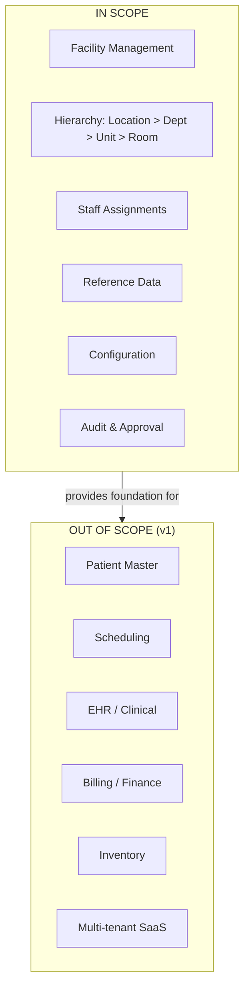
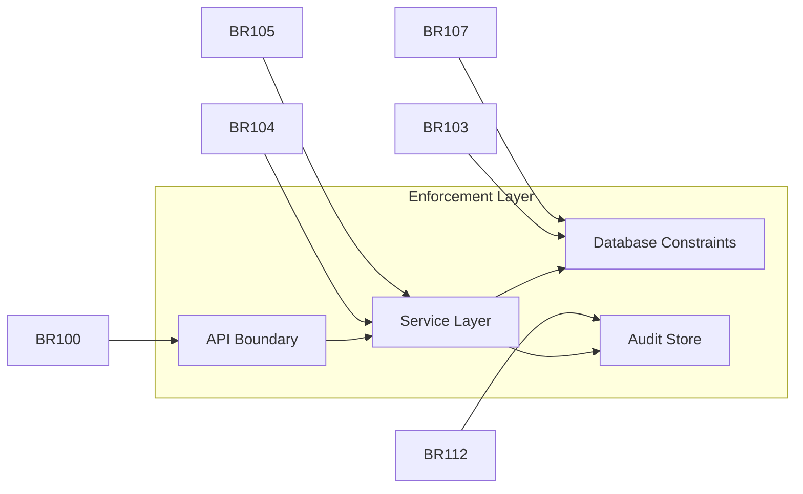
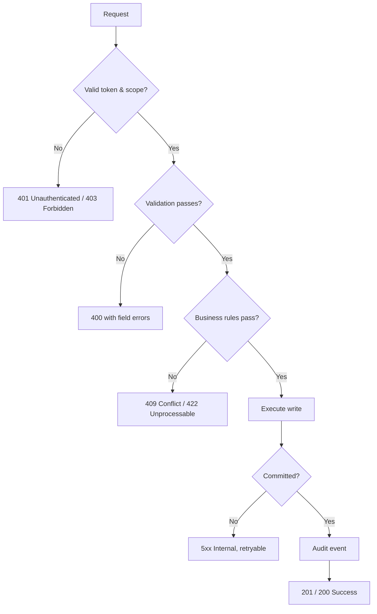
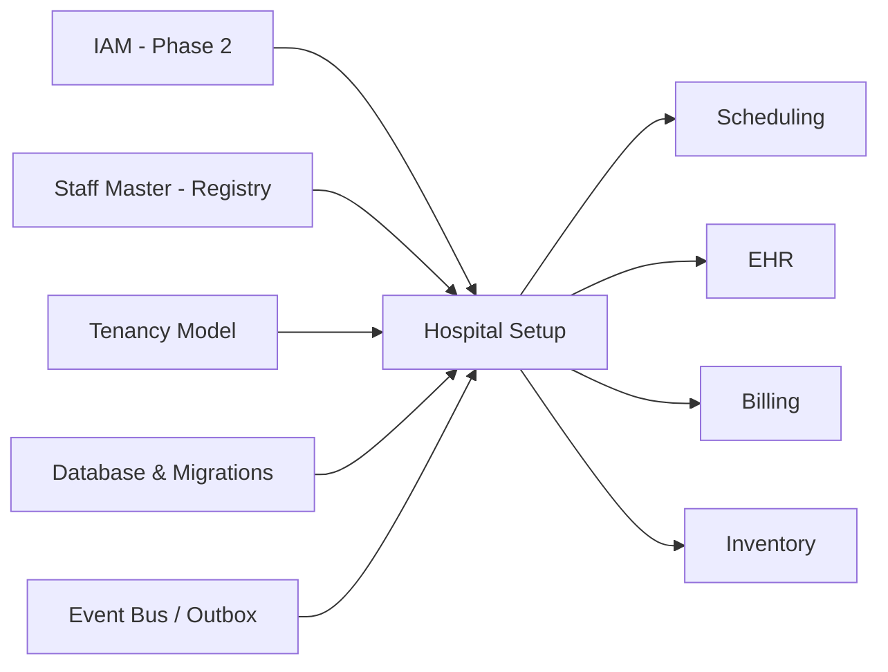

# Hospital Setup Module — Business Requirements Specification (BRS)

> **Document ID:** `hospital-setup/01-Business-Requirements`
> **Owner:** Product Lead / Business Analyst (hospital configuration)
> **Status:** 🔄 Pending approval (Phase 1 gate)
> **Version:** 1.0.0
> **Last updated:** 2026-08-06
> **Review cadence:** Re-reviewed at every phase gate and when the hospital structure model changes.
>
> **Relationship:** This BRS is the authoritative statement of *what* the Hospital Setup module must do. It is the parent of the module's technical design documents ([02-Workflow](../../hospital-setup/02-Workflow.md), subsequent specifications) and the approved module overview in [README](../../hospital-setup/README.md). It traces to platform objectives in [01-ENTERPRISE-VISION](../../01-ENTERPRISE-VISION.md) and is sequenced by [00-MASTER-ROADMAP](../../00-MASTER-ROADMAP.md).

---

## Table of Contents

1. [Executive Summary](#1-executive-summary)
2. [Business Objectives](#2-business-objectives)
3. [Scope](#3-scope)
4. [Stakeholders](#4-stakeholders)
5. [Functional Requirements](#5-functional-requirements)
6. [Non-Functional Requirements](#6-non-functional-requirements)
7. [Business Rules](#7-business-rules)
8. [User Stories](#8-user-stories)
9. [Acceptance Criteria](#9-acceptance-criteria)
10. [Exception Handling](#10-exception-handling)
11. [Constraints](#11-constraints)
12. [Dependencies](#12-dependencies)
13. [Risks](#13-risks)
14. [Assumptions](#14-assumptions)
15. [Regulatory Considerations](#15-regulatory-considerations)
16. [Success Metrics](#16-success-metrics)
17. [Traceability Matrix](#17-traceability-matrix)
18. [Cross References](#18-cross-references)

---

## 1. Executive Summary

The **Hospital Setup** module establishes the foundational organizational and configuration model of the hospital within the Hospital ERP Enterprise platform. It defines the facility, its locations, departments, units, staff assignments, reference data, and operating configuration that every other module (scheduling, EHR, billing, inventory) depends upon.

This Business Requirements Specification (BRS) defines the complete scope of the module: the capabilities it must deliver, the rules that govern them, the quality and compliance standards they must meet, and the measurable outcomes that define success. It is the authoritative source from which all technical design, build, and test activity proceeds.

The module is the foundation of the platform's **Registry** capability and is delivered in Phase 3 of the [00-MASTER-ROADMAP](../../00-MASTER-ROADMAP.md). It implements the hospital hierarchy model in [10-HOSPITAL-HIERARCHY](../../10-HOSPITAL-HIERARCHY.md), tenancy isolation in [09-MULTI-TENANCY](../../09-MULTI-TENANCY.md), and the authorization model in [07-ROLES-PERMISSIONS](../../07-ROLES-PERMISSIONS.md).

**Key scope commitments:**

- A single, canonical, tenant-scoped organization model as the single source of truth.
- Non-destructive lifecycle: deactivation over deletion, with full audit.
- Least-privilege access derived from staff assignments.
- Versioned, auditable structure that preserves historical accuracy.
- Multi-facility ready, single-facility first.

---

## 2. Business Objectives

The objectives below translate the platform vision ([01-ENTERPRISE-VISION](../../01-ENTERPRISE-VISION.md)) into measurable outcomes for this module. They are SMART (Specific, Measurable, Achievable, Relevant, Time-bound) and map to the module's success metrics (§16).

| # | Objective | Measurable target | Success metric (ref) | Timebox |
| --- | --- | --- | --- | --- |
| OBJ-01 | Provide a single, authoritative organization model for the platform | One facility/hierarchy source consumed by all modules; no duplicated structure | SM-01 | End of Phase 3 |
| OBJ-02 | Enable least-privilege access via staff assignments | 100% of staff access scoped by assignment | SM-02 | End of Phase 3 |
| OBJ-03 | Preserve organizational history and auditability | 100% of structure changes immutable-logged | SM-03 | End of Phase 3 |
| OBJ-04 | Allow configuration of a new facility without code changes | Onboard a facility through UI/API only | SM-04 | End of Phase 3 |
| OBJ-05 | Ensure data integrity of the hierarchy | Zero structural violations (cycles, orphans, invalid parents) | SM-05 | End of Phase 3 |
| OBJ-06 | Be multi-facility ready with single-facility deployment | Model supports multiple facilities; one active in v1 | SM-06 | End of Phase 3 |

---

## 3. Scope

### 3.1 In Scope

| Capability | Description |
| --- | --- |
| Facility management | Create, read, update, deactivate facility profiles and operating parameters. |
| Organization hierarchy | Manage locations, departments, units, and optional rooms/beds. |
| Staff assignment | Assign staff to departments/units with primary/secondary designation and effective dates. |
| Reference data | Manage setup-time controlled vocabularies (specialties, service types, shift templates). |
| Facility configuration | Manage key-value operating configuration with validated keys. |
| Audit & governance | Immutable audit of all setup changes; approval workflow for elevated actions. |
| Reporting | Structure, assignment, configuration, change-log, and health reports. |

### 3.2 Out of Scope (for v1)

| Capability | Reason | Reference |
| --- | --- | --- |
| Patient master & encounters | Separate Registry workflow | [00-MASTER-ROADMAP](../../00-MASTER-ROADMAP.md) §8 |
| Scheduling, EHR, billing, inventory | Consuming modules, later phases | [00-MASTER-ROADMAP](../../00-MASTER-ROADMAP.md) §8 |
| Identity and role catalog definition | Owned by IAM | [07-ROLES-PERMISSIONS](../../07-ROLES-PERMISSIONS.md) |
| Full room/bed occupancy tracking | Deferred enhancement | §16 / [12](../../modules/README.md) (Future Enhancements) |
| Multi-facility *active* operation | Single facility in v1 | [09-MULTI-TENANCY](../../09-MULTI-TENANCY.md) §9 |
| Multi-tenant SaaS hosting | Out of scope for v1 | [09-MULTI-TENANCY](../../09-MULTI-TENANCY.md) §9 |

### 3.3 Scope Boundary Diagram

---

## 4. Stakeholders

### 4.1 Stakeholder Register

| Stakeholder | Role | Interests / needs | Involvement |
| --- | --- | --- | --- |
| **System administrator** | Global platform config | Global structure, enterprise reference data, approvals | Setup & configuration |
| **Facility administrator** | Per-facility config | Facility profile, hierarchy, staff assignment, local config | Setup & configuration |
| **Facility admin (view)** | Read-only | Visibility of structure and assignments for planning | Read-only |
| **Auditor** | Compliance | Complete, immutable audit trail and structure review | Read-only / review |
| **Front-desk / Admissions** | Consumer | Correct facility/department reference for registration | Consumer |
| **Clinical staff** | Consumer | Correct unit/department scoping for orders and results | Consumer |
| **Finance / Accounts** | Consumer | Correct department reference for billing and GL | Consumer |
| **Operations / Procurement** | Consumer | Correct unit/room reference for inventory | Consumer |
| **Executive / Leadership** | Consumer | Structure and capacity dashboards | Read-only |
| **Engineering / QA** | Delivery | Requirements to build and test | Throughout |

### 4.2 Stakeholder Power / Interest Matrix

| Quadrant | Stakeholders | Strategy |
| --- | --- | --- |
| High power, high interest | System admin, Facility admin, Auditor | Manage closely; involve in gates |
| High power, low interest | Executive | Keep satisfied; report at milestones |
| Low power, high interest | Engineering, QA, consuming staff | Keep informed; involve in design |
| Low power, low interest | Front-desk, Finance (as consumers) | Monitor; communicate changes |

---

## 5. Functional Requirements

Functional requirements are numbered **BR-001** onward and grouped by capability. Each carries a priority (MoSCoW) and traceability (§17).

### 5.1 Facility & Tenant Management

| ID | Requirement | Priority |
| --- | --- | --- |
| BR-001 | The system SHALL support creating a facility with identity, type, and status. | Must |
| BR-002 | The system SHALL enforce a unique facility code within the tenant. | Must |
| BR-003 | The system SHALL capture facility address, contact, and IANA time zone. | Must |
| BR-004 | The system SHALL allow updating the facility profile while preserving change history. | Must |
| BR-005 | The system SHALL support facility statuses: draft, active, inactive, retired. | Must |
| BR-006 | The system SHALL prevent deactivating a facility that has active children or references. | Must |
| BR-007 | The system SHALL scope all facility data to its tenant. | Must |
| BR-008 | The system SHALL support multiple facilities under an enterprise with isolated data. | Should |
| BR-009 | The system COULD support facility branding via configuration tokens. | Could |

### 5.2 Organization Hierarchy

| ID | Requirement | Priority |
| --- | --- | --- |
| BR-010 | The system SHALL support a configurable hierarchy: locations → departments → units → rooms. | Must |
| BR-011 | The system SHALL require each node to reference a valid parent. | Must |
| BR-012 | The system SHALL prevent hierarchy cycles on re-parenting. | Must |
| BR-013 | The system SHALL support creating, updating, and deactivating nodes. | Must |
| BR-014 | The system SHALL NOT hard-delete a node that has data; deactivation is the removal path. | Must |
| BR-015 | The system SHALL version hierarchy changes so historical records remain accurate. | Must |
| BR-016 | The system SHALL type departments as clinical or administrative. | Must |
| BR-017 | The system SHALL prevent deactivating a node with active child nodes. | Must |
| BR-018 | The system SHOULD support arbitrary hierarchy depth and custom node types. | Should |
| BR-019 | The system COULD support room/bed tracking for operational modules. | Could |

### 5.3 Staff Assignment & Scoping

| ID | Requirement | Priority |
| --- | --- | --- |
| BR-020 | The system SHALL assign each staff member a primary department/unit and optional secondaries. | Must |
| BR-021 | The system SHALL derive a staff member's access scope from their assignments. | Must |
| BR-022 | The system SHALL enforce exactly one active primary assignment per staff member. | Must |
| BR-023 | The system SHALL enforce effective dates (start ≤ end) on assignments. | Must |
| BR-024 | The system SHALL only allow assignments within facilities the assigning user is scoped to. | Must |
| BR-025 | The system SHALL immediately reflect assignment changes in access. | Must |
| BR-026 | The system SHALL support historical assignment records for audit. | Must |
| BR-027 | The system SHOULD support cross-facility assignment where explicitly granted. | Should |

### 5.4 Reference Data & Configuration

| ID | Requirement | Priority |
| --- | --- | --- |
| BR-028 | The system SHALL manage setup reference data (specialties, service types, shift templates). | Must |
| BR-029 | The system SHALL enforce uniqueness of reference category + code within a facility. | Must |
| BR-030 | The system SHALL support facility operating configuration (time zone, contacts, defaults). | Must |
| BR-031 | The system SHALL validate configuration keys against a known schema. | Must |
| BR-032 | The system SHALL support enterprise-level (facility-null) reference values. | Must |
| BR-033 | The system SHOULD support reference data inheritance/overrides down the hierarchy. | Should |

### 5.5 Audit & Governance

| ID | Requirement | Priority |
| --- | --- | --- |
| BR-034 | The system SHALL record the full audit trail of all setup changes (actor, action, entity, time). | Must |
| BR-035 | The system SHALL make the audit trail immutable and tamper-evident. | Must |
| BR-036 | The system SHALL require approval for deactivation and elevated setup actions. | Must |
| BR-037 | The system SHALL support periodic review of structure and assignments. | Should |
| BR-038 | The system SHALL NOT log sensitive data (no PHI, no secrets) in setup records. | Must |

### 5.6 APIs & Integration

| ID | Requirement | Priority |
| --- | --- | --- |
| BR-039 | The system SHALL expose REST APIs per the API standards, versioned and OpenAPI-contracted. | Must |
| BR-040 | The system SHALL support idempotency keys for retryable write endpoints. | Must |
| BR-041 | The system SHALL propagate structure changes to consuming modules via events. | Must |
| BR-042 | The system SHALL paginate, filter, and sort all list endpoints. | Must |

---

## 6. Non-Functional Requirements

Non-functional requirements are numbered **NFR-001** onward and align with the platform standards referenced in each row.

| ID | Category | Requirement | Reference |
| --- | --- | --- | --- |
| NFR-001 | Performance | Setup reads SHALL respond within the platform SLO (p95 < 1 s). | [14-PERFORMANCE-STANDARDS](../../14-PERFORMANCE-STANDARDS.md) §3 |
| NFR-002 | Performance | Search and hierarchy queries SHALL return within 500 ms p95. | [14-PERFORMANCE-STANDARDS](../../14-PERFORMANCE-STANDARDS.md) §3 |
| NFR-003 | Data integrity | Setup writes SHALL be ACID and atomic; no partial hierarchy. | [05-DATABASE-ARCHITECTURE](../../05-DATABASE-ARCHITECTURE.md) §6 |
| NFR-004 | Security | Every request SHALL be authenticated and authorized (zero trust). | [06-AUTHENTICATION](../../06-AUTHENTICATION.md) §2 |
| NFR-005 | Security | Setup data SHALL be tenant-isolated with row-level security. | [09-MULTI-TENANCY](../../09-MULTI-TENANCY.md) §4 |
| NFR-006 | Compliance | All changes SHALL be immutable-logged and tamper-evident. | [08-AUDIT-LOGGING](../../08-AUDIT-LOGGING.md) §6 |
| NFR-007 | Reliability | Availability SHALL meet the platform target (≥ 99.9%). | [00-MASTER-ROADMAP](../../00-MASTER-ROADMAP.md) §2 |
| NFR-008 | Reliability | Structure changes SHALL be idempotent and safe to retry. | [11-API-STANDARDS](../../11-API-STANDARDS.md) §8 |
| NFR-009 | Accessibility | Setup UI SHALL meet WCAG 2.1 AA. | [12-UI-UX-GUIDELINES](../../12-UI-UX-GUIDELINES.md) §4 |
| NFR-010 | Usability | Configuration of a new facility SHALL be achievable through UI/API without code. | [13-DESIGN-SYSTEM](../../13-DESIGN-SYSTEM.md) |
| NFR-011 | Maintainability | Schema SHALL be governed by versioned migrations; no ad-hoc DDL. | [05-DATABASE-ARCHITECTURE](../../05-DATABASE-ARCHITECTURE.md) §5 |
| NFR-012 | Testability | The module SHALL be covered by automated tests including negative/guardrail cases. | [15-TESTING-STANDARDS](../../15-TESTING-STANDARDS.md) §8 |
| NFR-013 | Observability | Structure changes SHALL emit metrics and traceable logs. | [02-SYSTEM-ARCHITECTURE](../../02-SYSTEM-ARCHITECTURE.md) §14 |
| NFR-014 | Deployability | Changes SHALL ship via versioned migrations and CI/CD. | [16-DEPLOYMENT-STANDARDS](../../16-DEPLOYMENT-STANDARDS.md) §8 |

---

## 7. Business Rules

Business rules are the stable constraints the module must always uphold. They are referenced by functional requirements and enforced at the appropriate layers.

| # | Rule | Category | Applies to | Enforced at |
| --- | --- | --- | --- | --- |
| BR-100 | A facility code is required, unique per tenant, alphanumeric, ≤ 20 chars. | Validation | Facility | API + service |
| BR-101 | A facility name is required and ≤ 120 chars. | Validation | Facility | API + service |
| BR-102 | A department/unit code is required, unique within its parent, ≤ 20 chars. | Validation | Hierarchy | API + service |
| BR-103 | A department must reference a valid location; a unit a valid department; a room a valid unit. | Integrity | Hierarchy | DB constraint |
| BR-104 | Re-parenting must not create a cycle (a node cannot be its own ancestor). | Integrity | Hierarchy | Service |
| BR-105 | A node with active children or active references cannot be deactivated. | Lifecycle | Hierarchy | Service + DB |
| BR-106 | No hard deletes of nodes that have data; deactivation and retirement are the removal paths. | Lifecycle | Hierarchy | Service |
| BR-107 | Exactly one active primary assignment per staff member. | Integrity | Assignment | DB partial unique |
| BR-108 | Assignment effective dates must satisfy start ≤ end. | Validation | Assignment | Service |
| BR-109 | A staff member can only be assigned within facilities the assigning user is scoped to. | Security | Assignment | Service |
| BR-110 | Reference category + code must be unique per facility. | Integrity | Reference data | DB unique |
| BR-111 | Configuration keys must match a known schema; unknown keys rejected. | Validation | Configuration | Service |
| BR-112 | Elevated actions (deactivation, global config) require approval and audit. | Governance | All | Workflow |
| BR-113 | All setup changes are audited immutably. | Governance | All | Audit store |

### Business Rule Dependency Diagram

---

## 8. User Stories

User stories are written from the perspective of the stakeholders in §4. Each maps to functional requirements (§5) and acceptance criteria (§9).

| ID | As a… | I want to… | So that… | Maps to |
| --- | --- | --- | --- | --- |
| US-001 | System administrator | create a facility with identity and contact | the organization has a foundation | BR-001, BR-002, BR-003 |
| US-002 | Facility administrator | add locations, departments, and units | the structure reflects the hospital | BR-010, BR-013 |
| US-003 | Facility administrator | deactivate an outdated unit | staff are not routed to it | BR-013, BR-017, BR-105 |
| US-004 | Facility administrator | assign a nurse to a ward as primary | their access is scoped correctly | BR-020, BR-021 |
| US-005 | Facility administrator | give a clinician a secondary assignment | they can cover another unit | BR-020, BR-027 |
| US-006 | Facility administrator | manage reference data for specialties | clinical modules have controlled vocab | BR-028, BR-029 |
| US-007 | Facility administrator | update the facility time zone | schedules and reports are correct | BR-030 |
| US-008 | Auditor | view the complete setup audit trail | compliance can be verified | BR-034, BR-035 |
| US-009 | Facility administrator | submit a deactivation for approval | accidental changes are prevented | BR-036 |
| US-010 | Facility admin (view) | view the structure read-only | planning without risk of change | BR-021 |
| US-011 | Executive | view a structure health report | leadership sees organizational state | BR-034, §16 |

---

## 9. Acceptance Criteria

Acceptance criteria define the testable conditions under which each user story (and its requirements) is complete. They follow the platform testing standards in [15-TESTING-STANDARDS](../../15-TESTING-STANDARDS.md).

| User story | Acceptance criteria |
| --- | --- |
| US-001 | Given a valid facility payload, when created, then a facility with `draft` status and unique code is returned with `201`. |
| US-002 | Given an active facility, when a location, department, and unit are added, then each is persisted with a valid parent and returns `201`. |
| US-003 | Given a unit with no active children or references, when deactivated, then its status becomes `inactive` and an audit event is recorded. Given a unit with active children, when deactivation is attempted, then it is blocked with `422` and a message listing active children. |
| US-004 | Given a staff member with no primary assignment, when assigned as primary, then the assignment is created and access scope is derived. Given an existing active primary, when another primary is attempted, then it is rejected with `409`. |
| US-005 | Given an active staff member, when a secondary assignment is added, then it is allowed and scoped as secondary. |
| US-006 | Given a facility, when a reference value is created, then category+code is unique and it is listed for consumers. Given a duplicate, then it is rejected with `409`. |
| US-007 | Given a valid config key, when updated, then the value is persisted and audited. Given an unknown key, then it is rejected with `400`. |
| US-008 | Given an auditor with `audit:read`, when the audit trail is queried, then all setup changes are returned with actor, action, entity, and time. |
| US-009 | Given a deactivation proposal, when submitted, then it is routed for approval and only executes on approval. Given rejection, then it is not executed and the requester is notified. |
| US-010 | Given a view-only role, when the structure is opened, then it is readable but all write actions are disabled. |
| US-011 | Given an executive, when the structure health report is run, then active/inactive counts and incomplete nodes are returned. |

### Acceptance Criteria Compliance

| Criterion | Verified by |
| --- | --- |
| Functional acceptance | Automated tests (unit + integration) per [15-TESTING-STANDARDS](../../15-TESTING-STANDARDS.md) |
| Negative/guardrail acceptance | Negative-case tests (duplicates, cycles, deactivation blocks) |
| Accessibility acceptance | WCAG automated + manual checks per [12-UI-UX-GUIDELINES](../../12-UI-UX-GUIDELINES.md) |
| Security acceptance | Authorization tests + scans per [15-TESTING-STANDARDS](../../15-TESTING-STANDARDS.md) §11 |

---

## 10. Exception Handling

The module must handle exceptions gracefully and deterministically, per [11-API-STANDARDS](../../11-API-STANDARDS.md) §6 and [04-CODING-STANDARDS](../../04-CODING-STANDARDS.md) §7.

### 10.1 Exception Catalog

| Scenario | Exception | User outcome | Retryable |
| --- | --- | --- | :---: |
| Missing/invalid token | Unauthenticated | Prompt to authenticate | No |
| Not authorized / out of scope | Forbidden | Inform user of insufficient access | No |
| Resource not found | Not found | Inform user | No |
| Field validation failure | Validation error | Show field-level errors | No |
| Duplicate code / primary | Conflict | Show actionable message | No |
| Structural violation (active children) | Unprocessable | List blocking children | No |
| Concurrency conflict (version mismatch) | Conflict | Prompt to refresh and retry | Yes |
| Rate limit exceeded | Rate limited | Advise backoff | Yes |
| Downstream/DB failure | Internal | Notify; retry | Yes |

### 10.2 Exception Handling Strategy

**Rules:**
- Exceptions MUST return structured, safe error envelopes (no stack traces, no sensitive data).
- Failed writes MUST NOT leave partial state (ACID per [05-DATABASE-ARCHITECTURE](../../05-DATABASE-ARCHITECTURE.md) §6).
- Retryable failures MUST support idempotency keys ([11-API-STANDARDS](../../11-API-STANDARDS.md) §8).
- All failures MUST be logged with correlation id and monitored.

---

## 11. Constraints

| # | Constraint | Type | Implication | Reference |
| --- | --- | --- | --- | --- |
| C-01 | Single facility active in v1 | Business | Multi-facility is model-ready, not active | [09-MULTI-TENANCY](../../09-MULTI-TENANCY.md) §9 |
| C-02 | No real PHI in non-production | Compliance | Synthetic/anonymized data only | [00-MASTER-ROADMAP](../../00-MASTER-ROADMAP.md) §10 |
| C-03 | IAM is a hard prerequisite | Dependency | Module requires identity from Phase 2 | [06-AUTHENTICATION](../../06-AUTHENTICATION.md) |
| C-04 | Schema governed by migrations | Technical | No ad-hoc DDL | [05-DATABASE-ARCHITECTURE](../../05-DATABASE-ARCHITECTURE.md) §5 |
| C-05 | Contract-first APIs | Technical | OpenAPI before implementation | [11-API-STANDARDS](../../11-API-STANDARDS.md) §2 |
| C-06 | No hard deletes of data-bearing nodes | Business | Deactivation/retirement only | §7 (BR-106) |
| C-07 | Performance budget (p95 < 1 s) | Technical | Indexing & pagination | [14-PERFORMANCE-STANDARDS](../../14-PERFORMANCE-STANDARDS.md) §3 |
| C-08 | Accessibility (WCAG 2.1 AA) | Compliance | Accessible UI mandatory | [12-UI-UX-GUIDELINES](../../12-UI-UX-GUIDELINES.md) §4 |

---

## 12. Dependencies

| # | Dependency | Type | Required for | Risk if unmet |
| --- | --- | --- | --- | --- |
| D-01 | IAM / identity & roles | Internal (Phase 2) | Authentication, scoping | Module unusable without it |
| D-02 | Staff master (Registry) | Internal | Staff assignments | Assignments cannot resolve staff |
| D-03 | Tenancy model | Internal | Tenant isolation | Data isolation fails |
| D-04 | Database & migration framework | Internal | Persistence | No storage |
| D-05 | Event bus / outbox | Internal | Propagating structure changes | Consumers stale |
| D-06 | Design system | Internal | UI consistency | Inconsistent UX |
| D-07 | API gateway | Internal | AuthN/Z, rate limiting | Security surface weakens |
| D-08 | Observability stack | Internal | Monitoring/alerting | No visibility |
| D-09 | FHIR/HL7 and external systems | External | Future interoperability | Deferred (Phase 10) |

### Dependency Order

---

## 13. Risks

Risk assessment follows the platform methodology (Impact × Likelihood) in [00-MASTER-ROADMAP](../../00-MASTER-ROADMAP.md) §14.

### 13.1 Risk Register

| # | Risk | Impact (1-5) | Likelihood (1-5) | Exposure | Mitigation | Owner |
| --- | --- | --- | --- | --- | --- | --- |
| R-01 | Scope creep into clinical/ops features | 5 | 3 | 15 High | Strict scope boundary; change control | Product lead |
| R-02 | Data model changes late in build | 5 | 3 | 15 High | Phase 1 design; versioned migrations | Architect |
| R-03 | Incorrect access scoping → over/under-privilege | 5 | 2 | 10 High | Assignment-based scope; tests; RLS | Security |
| R-04 | Structural data corruption (cycles, orphans) | 4 | 2 | 8 Medium | DB constraints; validation; negative tests | Engineering |
| R-05 | Integration delay with consuming modules | 3 | 3 | 9 Medium | Contract-first; stub consumers early | Integration |
| R-06 | Organizational restructuring complexity | 4 | 3 | 12 High | Versioned hierarchy; merge/reassign workflow | Architecture |
| R-07 | Audit integrity failure | 5 | 1 | 5 Low | Immutable store; hash chaining; checks | Security |
| R-08 | Key-person dependency | 3 | 3 | 9 Medium | Cross-training; documentation | Engineering |

### 13.2 Escalation Rule

Any **Critical** exposure (≥ 16) triggers an immediate mitigation plan and program-level review, per [00-MASTER-ROADMAP](../../00-MASTER-ROADMAP.md) §14.

---

## 14. Assumptions

| # | Assumption | Rationale | If false |
| --- | --- | --- | --- |
| A-01 | A modern browser is the web target; iOS/Android for mobile | Platform assumption | Additional testing/tooling |
| A-02 | Reliable connectivity for cloud components | Platform assumption | Offline evaluation per module |
| A-03 | Facility == tenant root in v1 | Tenancy model | Re-scope tenancy |
| A-04 | Staff master exists before assignments | Dependency D-02 | Build staff reference first |
| A-05 | IAM is delivered before this module | Phase sequencing | Block module delivery |
| A-06 | Reference data is setup-time controlled, not runtime-managed | Design decision | Add runtime management |
| A-07 | Single facility active; multi-facility is model-ready | v1 scope | Expand operations |
| A-08 | Setup contains no PHI | Domain scope | Apply PHI controls |
| A-09 | Structure changes propagate via events, not direct DB access | Architecture | Add direct coupling |

---

## 15. Regulatory Considerations

| # | Requirement | Module implication | Reference |
| --- | --- | --- | --- |
| REG-01 | HIPAA alignment: protect health data | Module stores no PHI; setup data is organizational | [00-MASTER-ROADMAP](../../00-MASTER-ROADMAP.md) §15 |
| REG-02 | Complete audit trail for security-relevant changes | Immutable audit of all setup changes | [08-AUDIT-LOGGING](../../08-AUDIT-LOGGING.md) |
| REG-03 | Least-privilege access | Assignment-scoped access; elevated-action approval | [07-ROLES-PERMISSIONS](../../07-ROLES-PERMISSIONS.md) |
| REG-04 | Data retention & destruction schedules | Retention policy per data class; audited archival | [05-DATABASE-ARCHITECTURE](../../05-DATABASE-ARCHITECTURE.md) §8 |
| REG-05 | Consent & data minimization | Module minimizes stored data to organizational structure | [01-ENTERPRISE-VISION](../../01-ENTERPRISE-VISION.md) §8 |
| REG-06 | Local health-data regulation | Exact list confirmed in platform security standards | [08-AUDIT-LOGGING](../../08-AUDIT-LOGGING.md) §9 |
| REG-07 | Accessibility regulation | WCAG 2.1 AA compliance | [12-UI-UX-GUIDELINES](../../12-UI-UX-GUIDELINES.md) §4 |

---

## 16. Success Metrics

Success metrics measure the module's business objectives (§2). Each is measurable and reported at gates.

| ID | Metric | Target | Measures | Source |
| --- | --- | --- | --- | --- |
| SM-01 | Single-source-of-truth adoption | 1 canonical structure consumed by all modules | No duplicated hierarchy | Registry |
| SM-02 | Scoped access coverage | 100% of staff access scoped by assignment | Access derived from assignments | IAM |
| SM-03 | Audit completeness | 100% of structure changes immutable-logged | Audit trail coverage | Audit |
| SM-04 | Code-free configuration | New facility onboarded via UI/API only | No code changes required | Delivery |
| SM-05 | Structure integrity | 0 structural violations (cycles, orphans, invalid parents) | Integrity checks | Database |
| SM-06 | Multi-facility readiness | Model supports multiple facilities; 1 active | Model assessment | Architecture |
| SM-07 | Setup latency | p95 < 1 s for reads | Performance monitoring | [14-PERFORMANCE-STANDARDS](../../14-PERFORMANCE-STANDARDS.md) |
| SM-08 | Test coverage (critical paths) | ≥ 80% | Coverage reports | [15-TESTING-STANDARDS](../../15-TESTING-STANDARDS.md) |

---

## 17. Traceability Matrix

The matrix traces functional requirements to objectives, user stories, acceptance criteria, and business rules.

| Requirement | Objective | User story | Acceptance | Business rule | Success metric |
| --- | --- | --- | --- | --- | --- |
| BR-001 | OBJ-01, OBJ-04 | US-001 | US-001 | BR-100, BR-101 | SM-01, SM-04 |
| BR-002 | OBJ-01 | US-001 | US-001 | BR-100 | SM-01 |
| BR-003 | OBJ-01 | US-001 | US-001 | BR-101 | SM-01 |
| BR-004 | OBJ-03 | US-001 | US-001 | BR-113 | SM-03 |
| BR-005 | OBJ-01 | US-001 | US-001 | BR-105 | SM-05 |
| BR-006 | OBJ-05 | US-003 | US-003 | BR-105 | SM-05 |
| BR-007 | OBJ-01 | US-001 | US-001 | BR-109 | SM-02 |
| BR-008 | OBJ-06 | US-001 | US-001 | — | SM-06 |
| BR-010 | OBJ-01 | US-002 | US-002 | BR-103 | SM-01, SM-05 |
| BR-011 | OBJ-05 | US-002 | US-002 | BR-103 | SM-05 |
| BR-012 | OBJ-05 | US-002 | US-002 | BR-104 | SM-05 |
| BR-013 | OBJ-01 | US-002 | US-002 | BR-103 | SM-01 |
| BR-014 | OBJ-03 | US-003 | US-003 | BR-106 | SM-03 |
| BR-015 | OBJ-03 | US-002 | US-002 | BR-113 | SM-03 |
| BR-016 | OBJ-01 | US-002 | US-002 | BR-103 | SM-05 |
| BR-017 | OBJ-05 | US-003 | US-003 | BR-105 | SM-05 |
| BR-020 | OBJ-02 | US-004 | US-004 | BR-107 | SM-02 |
| BR-021 | OBJ-02 | US-010 | US-010 | BR-109 | SM-02 |
| BR-022 | OBJ-02 | US-004 | US-004 | BR-107 | SM-02 |
| BR-023 | OBJ-02 | US-004 | US-004 | BR-108 | SM-05 |
| BR-024 | OBJ-02 | US-004 | US-004 | BR-109 | SM-02 |
| BR-025 | OBJ-02 | US-004 | US-004 | BR-109 | SM-02 |
| BR-026 | OBJ-03 | US-008 | US-008 | BR-113 | SM-03 |
| BR-028 | OBJ-04 | US-006 | US-006 | BR-110 | SM-04 |
| BR-029 | OBJ-05 | US-006 | US-006 | BR-110 | SM-05 |
| BR-030 | OBJ-04 | US-007 | US-007 | BR-111 | SM-04 |
| BR-031 | OBJ-04 | US-007 | US-007 | BR-111 | SM-05 |
| BR-034 | OBJ-03 | US-008 | US-008 | BR-113 | SM-03 |
| BR-035 | OBJ-03 | US-008 | US-008 | BR-113 | SM-03 |
| BR-036 | OBJ-03 | US-009 | US-009 | BR-112 | SM-03 |
| BR-039 | OBJ-04 | US-001 | US-001 | — | SM-04 |
| BR-040 | OBJ-04 | US-001 | US-001 | — | SM-04 |
| BR-041 | OBJ-01 | US-002 | US-002 | BR-113 | SM-01 |
| BR-042 | OBJ-04 | US-001 | US-001 | — | SM-07 |

---

## 18. Cross References

| Reference | Relationship | Direction |
| --- | --- | --- |
| [README](../../hospital-setup/README.md) | Module overview, structure, and technical summary | This BRS is authoritative on requirements |
| [02-Workflow](../../hospital-setup/02-Workflow.md) | Detailed workflow specification | Consumes this BRS |
| [00-MASTER-ROADMAP](../../00-MASTER-ROADMAP.md) | Phase sequencing, Definition of Done, risk methodology | Consumes |
| [01-ENTERPRISE-VISION](../../01-ENTERPRISE-VISION.md) | Strategic objectives and guiding principles | Consumes |
| [02-SYSTEM-ARCHITECTURE](../../02-SYSTEM-ARCHITECTURE.md) | Module and data architecture | Consumes |
| [03-TECHNOLOGY-STACK](../../03-TECHNOLOGY-STACK.md) | Technology choices | Consumes |
| [04-CODING-STANDARDS](../../04-CODING-STANDARDS.md) | Coding, error handling, security rules | Consumes |
| [05-DATABASE-ARCHITECTURE](../../05-DATABASE-ARCHITECTURE.md) | Persistence, migrations, integrity | Consumes |
| [06-AUTHENTICATION](../../06-AUTHENTICATION.md) | Identity, tokens, scoping | Consumes |
| [07-ROLES-PERMISSIONS](../../07-ROLES-PERMISSIONS.md) | Roles, permissions, enforcement | Consumes |
| [08-AUDIT-LOGGING](../../08-AUDIT-LOGGING.md) | Audit trail, integrity, retention | Consumes |
| [09-MULTI-TENANCY](../../09-MULTI-TENANCY.md) | Tenant isolation and scoping | Consumes |
| [10-HOSPITAL-HIERARCHY](../../10-HOSPITAL-HIERARCHY.md) | Organization hierarchy model | Consumes |
| [11-API-STANDARDS](../../11-API-STANDARDS.md) | API contracts, versioning, errors | Consumes |
| [12-UI-UX-GUIDELINES](../../12-UI-UX-GUIDELINES.md) | UX and accessibility | Consumes |
| [13-DESIGN-SYSTEM](../../13-DESIGN-SYSTEM.md) | UI components and tokens | Consumes |
| [14-PERFORMANCE-STANDARDS](../../14-PERFORMANCE-STANDARDS.md) | Performance targets | Consumes |
| [15-TESTING-STANDARDS](../../15-TESTING-STANDARDS.md) | Testing and quality gates | Consumes |
| [16-DEPLOYMENT-STANDARDS](../../16-DEPLOYMENT-STANDARDS.md) | Deployment and operations | Consumes |

---

*End of `docs/modules/hospital-setup/01-Business-Requirements.md`.*
