# Hospital Setup Module — Workflow Specification

> **Document ID:** `hospital-setup/02-Workflow`
> **Owner:** Engineering Lead / Business Analyst (hospital configuration)
> **Status:** 🔄 Pending approval (Phase 1 gate)
> **Version:** 1.0.0
> **Last updated:** 2026-08-06
> **Review cadence:** Re-reviewed at every phase gate and when the hospital structure model changes.
>
> **Relationship:** This workflow specification defines *how* the Hospital Setup module behaves operationally — the flows, states, approvals, audit, and recovery that implement the requirements in [01-Business-Requirements](01-Business-Requirements.md). It builds on the module overview in [README](README.md).

---

## Table of Contents

1. [Workflow Overview](#1-workflow-overview)
2. [Actors](#2-actors)
3. [Preconditions](#3-preconditions)
4. [Triggers](#4-triggers)
5. [Main Success Flow](#5-main-success-flow)
6. [Alternate Flows](#6-alternate-flows)
7. [Exception Flows](#7-exception-flows)
8. [State Transitions](#8-state-transitions)
9. [Approval Workflow](#9-approval-workflow)
10. [Configuration Workflow](#10-configuration-workflow)
11. [Staff Assignment Workflow](#11-staff-assignment-workflow)
12. [Change Management Workflow](#12-change-management-workflow)
13. [Audit Events](#13-audit-events)
14. [Notifications](#14-notifications)
15. [SLA Rules](#15-sla-rules)
16. [BPMN-style Mermaid Diagrams](#16-bpmn-style-mermaid-diagrams)
17. [Sequence Diagrams](#17-sequence-diagrams)
18. [Activity Diagrams](#18-activity-diagrams)
19. [Cross Module Dependencies](#19-cross-module-dependencies)
20. [Business Rules](#20-business-rules)
21. [Edge Cases](#21-edge-cases)
22. [Rollback Strategy](#22-rollback-strategy)
23. [Recovery Flow](#23-recovery-flow)
24. [KPIs](#24-kpis)
25. [Cross References](#25-cross-references)

---

## 1. Workflow Overview

The Hospital Setup module governs the operational lifecycle of the hospital's organizational and configuration model. It supports the end-to-end flows by which a facility is provisioned, its structure is created and maintained, staff are assigned and scoped, configuration is managed, and changes are approved, audited, and rolled back when necessary.

This specification defines the complete, deterministic behavior of those flows, including the conditions that trigger them, the states they traverse, the actors and approvals involved, and the guarantees (audit, SLA, recovery) that must hold at every step.

The module is the operational backbone of the platform's **Registry** capability (Phase 3 of [00-MASTER-ROADMAP](../../00-MASTER-ROADMAP.md)). It implements the hierarchy in [10-HOSPITAL-HIERARCHY](../../10-HOSPITAL-HIERARCHY.md), scoping in [07-ROLES-PERMISSIONS](../../07-ROLES-PERMISSIONS.md), and audit in [08-AUDIT-LOGGING](../../08-AUDIT-LOGGING.md).

### 1.1 Flow Inventory

| Flow | Purpose | Section |
| --- | --- | --- |
| Facility provisioning | Create and activate a facility | §5, §6.1 |
| Hierarchy management | Create/update/deactivate structure | §5, §8 |
| Staff assignment | Assign/revoke staff scope | §11 |
| Configuration | Manage operating parameters | §10 |
| Change management | Approve, version, and publish changes | §12 |
| Approval | Elevated-action governance | §9 |
| Audit | Immutable record of all changes | §13 |
| Recovery | Rollback and restore | §22, §23 |

### 1.2 End-to-End View

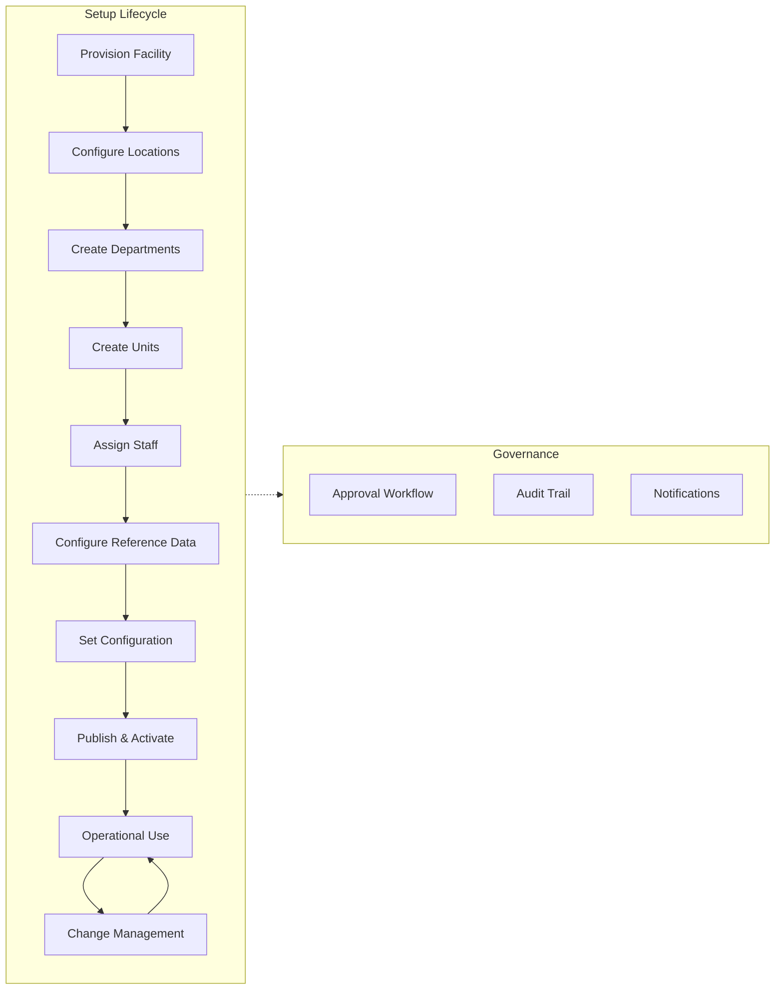

---

## 2. Actors

Actors interact with the module through web, mobile, or API. Their permissions follow [07-ROLES-PERMISSIONS](../../07-ROLES-PERMISSIONS.md).

| Actor | Type | Permissions | Primary flows |
| --- | --- | --- | --- |
| **System administrator** | User | `hospital:configure`, `hospital:approve`, `audit:read` | Provisioning, approvals, global config |
| **Facility administrator** | User | `hospital:configure` (facility scope) | Hierarchy, assignments, config |
| **Facility admin (view)** | User | `hospital:read` | Read-only review |
| **Auditor** | User | `hospital:read`, `audit:read` | Audit review |
| **System** (automated) | Service | `hospital:configure` (machine) | Provisioning triggers, event propagation |
| **Staff master (Registry)** | External module | Read staff | Assignment resolution |
| **IAM** | External module | Validate identity | Authorization |
| **Notification service** | External module | Send email/in-app | Notifications (§14) |

### Actor Interaction Map

```mermaid
flowchart TB
    SA[System Administrator] --> HS[Hospital Setup Module]
    FA[Facility Administrator] --> HS
    FAV[Facility Admin (View)] -->|read| HS
    AU[Auditor] -->|read + audit| HS
    IAM[IAM] -->|validate| HS
    REG[Staff Master] -->|staff data| HS
    HS --> NOTIF[Notification Service]
    HS --> BUS[Event Bus / Outbox]
```

---

## 3. Preconditions

The following must hold before setup flows can operate correctly.

| # | Precondition | Owner | Verification |
| --- | --- | --- | --- |
| P-01 | IAM is available and identities/roles provisioned | IAM (Phase 2) | Authentication works |
| P-02 | A staff master exists to resolve staff references | Registry | Staff resolvable |
| P-03 | The tenancy model is initialized (at least one tenant) | Platform | Tenant context present |
| P-04 | The database and migrations are applied | Platform | Schema version current |
| P-05 | The event bus / outbox is operational | Platform | Events can be emitted |
| P-06 | The requester holds `hospital:configure` in the relevant scope | Authorization | Scope check passes |
| P-07 | The facility context (tenant) is established for the request | Authorization | Tenant derived |

### Precondition Gate

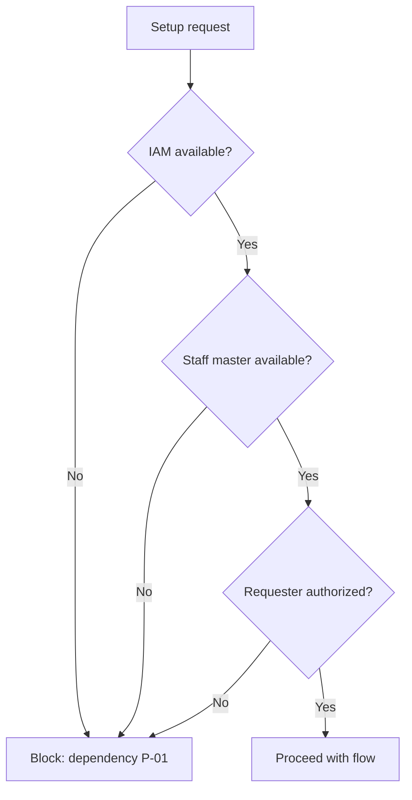

---

## 4. Triggers

Flows begin on defined triggers.

| # | Trigger | Flow started | Initiated by |
| --- | --- | --- | --- |
| TR-01 | Create facility (UI/API) | Facility provisioning | System admin |
| TR-02 | Add/update/deactivate a hierarchy node | Hierarchy management | Facility admin |
| TR-03 | Assign/revoke staff | Staff assignment | Facility admin |
| TR-04 | Update configuration key | Configuration | Facility admin / system |
| TR-05 | Submit elevated change | Change management / approval | Facility admin |
| TR-06 | Approve/reject a proposal | Approval | System admin / approver |
| TR-07 | Scheduled periodic review | Change management | System (automated) |
| TR-08 | Structure change event | Event propagation | System (automated) |

### Trigger → Flow Map

| Flow | Direct triggers | Scheduled/event triggers |
| --- | --- | --- |
| Provisioning | TR-01 | — |
| Hierarchy | TR-02 | — |
| Assignment | TR-03 | TR-07 (review) |
| Configuration | TR-04 | — |
| Approval | TR-05, TR-06 | — |
| Propagation | — | TR-08 |

---

## 5. Main Success Flow

The **Main Success Flow** provisions a new facility end-to-end and makes it operational.

| Step | Action | Actor | Output / state |
| --- | --- | --- | --- |
| 1 | Create facility with identity, type, and status `draft` | System admin | Facility created (BR-001) |
| 2 | Add a location | Facility admin | Location created |
| 3 | Add departments (typed clinical/administrative) | Facility admin | Departments created |
| 4 | Add units under departments | Facility admin | Units created |
| 5 | Assign staff to primary/secondary units | Facility admin | Assignments created |
| 6 | Load reference data (specialties, service types, shift templates) | Facility admin | Reference values active |
| 7 | Set facility configuration (time zone, contacts, defaults) | Facility admin | Configuration saved |
| 8 | Publish and activate the facility | System admin | Facility status `active` |
| 9 | Emit structure-ready event to consuming modules | System | Event propagated |
| 10 | Record audit trail of all steps | System | Audit complete |
| 11 | Send activation notification | System | Notification sent |

### Main Success Flow — Activity Diagram

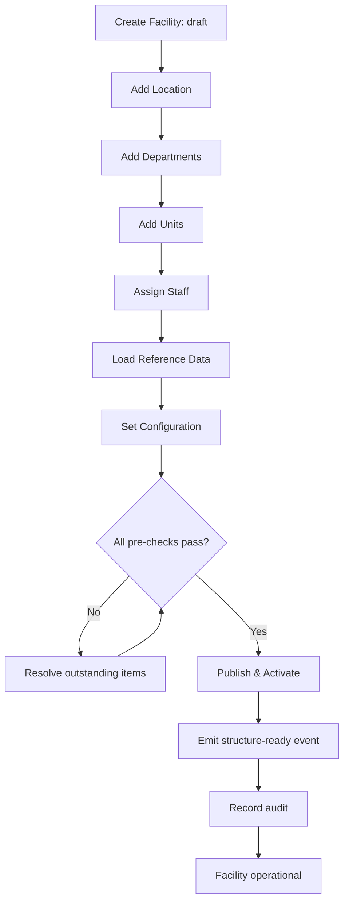

**Success criteria:** facility is `active`; hierarchy is complete; staff are scoped; configuration is valid; consuming modules have received the event; full audit exists.

---

## 6. Alternate Flows

### 6.1 Alternate Flow — Create Facility (Asynchronous/External Trigger)

If facility creation is triggered by an external provisioning system or a bulk onboarding, the flow runs without direct UI interaction.

| Step | Action | Deviation |
| --- | --- | --- |
| 1a | Ingest facility payload via API (idempotency key) | Source is API, not UI |
| 2a | Validate against the same rules | Identical validation |
| 3a | Create facility in `draft` | Same state |
| 4a | Notify the facility administrator to complete configuration | Added notification |
| 5a | Facility awaits human configuration before activation | No auto-activation |

### 6.2 Alternate Flow — Reorganize a Department (Merge)

When two units are merged, the flow diverges from simple deactivation.

| Step | Action | Deviation |
| --- | --- | --- |
| 1b | Propose merge of unit A into unit B | New operation |
| 2b | Reassign active data/assignments from A to B | Data migration |
| 3b | Deactivate unit A (approval) | Approval required |
| 4b | Preserve history of A | Versioned retention |
| 5b | Emit event to consuming modules | Propagation |

### 6.3 Alternate Flow — Cross-Facility Assignment

When a staff member is assigned across facilities (explicitly granted), the flow verifies the grant.

| Step | Action | Deviation |
| --- | --- | --- |
| 1c | Validate the target facility is within the assigner's scope | Scope check |
| 2c | Validate the staff member's cross-facility grant | Grant check (BR-027) |
| 3c | Create assignment with the target facility context | Cross-facility context |
| 4c | Emit scope-change event | Propagation |

### 6.4 Alternate Flow Summary

| Flow | Trigger | Key deviation | Outcome |
| --- | --- | --- | --- |
| API-provisioned facility | External trigger | No UI; awaits config | Draft facility + notification |
| Unit merge | Restructure | Data reassignment + approval | Consolidated structure |
| Cross-facility assignment | Explicit grant | Grant verification | Scoped cross-facility access |

---

## 7. Exception Flows

Exception flows handle failure and rule-violation conditions deterministically (per [11-API-STANDARDS](../../11-API-STANDARDS.md) §6).

| # | Exception | Detected | Handling | Outcome |
| --- | --- | --- | --- | --- |
| EX-01 | Duplicate facility code | Uniqueness check | Reject with `409`, actionable message | No change |
| EX-02 | Invalid parent (orphan/cycle) | Structural validation | Reject with `422` | No change |
| EX-03 | Deactivate node with active children | Lifecycle check | Block with `422`, list children | No change |
| EX-04 | Duplicate primary assignment | Uniqueness constraint | Reject with `409` | No change |
| EX-05 | Assignment date overlap | Validation | Reject with `400` | No change |
| EX-06 | Out-of-scope assignment | Authorization | Reject with `403` | No change |
| EX-07 | Unknown config key | Schema validation | Reject with `400` | No change |
| EX-08 | Concurrent edit conflict | Version check | Reject with `409`, prompt refresh | Retry |
| EX-09 | Downstream event failure | Outbox retry | Retry with backoff | Event delivered |
| EX-10 | Database/transaction failure | ACID failure | Abort; no partial state | Retry |

### Exception Handling Activity

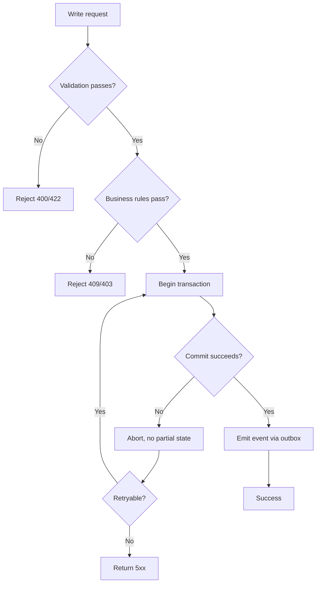

---

## 8. State Transitions

### 8.1 Facility States

| State | Meaning | Allowed next states |
| --- | --- | --- |
| `draft` | Provisioned, not yet usable | active, inactive, retired |
| `active` | Operational; consumed by modules | inactive, draft (rollback) |
| `inactive` | Deactivated; not consuming | active (reactivate) |
| `retired` | Archived; terminal | (none) |

### 8.2 Hierarchy Node States

| State | Meaning | Allowed next states |
| --- | --- | --- |
| `draft` | Created, unpublished | active, inactive |
| `active` | Published and in use | inactive, draft |
| `inactive` | Deactivated | active, retired |
| `retired` | Archived | (none) |

### 8.3 Assignment States

| State | Meaning | Allowed next states |
| --- | --- | --- |
| `active` | Current effective assignment | inactive |
| `inactive` | Revoked or expired | active (reactivate) |

### 8.4 State Diagram — Hierarchy Node

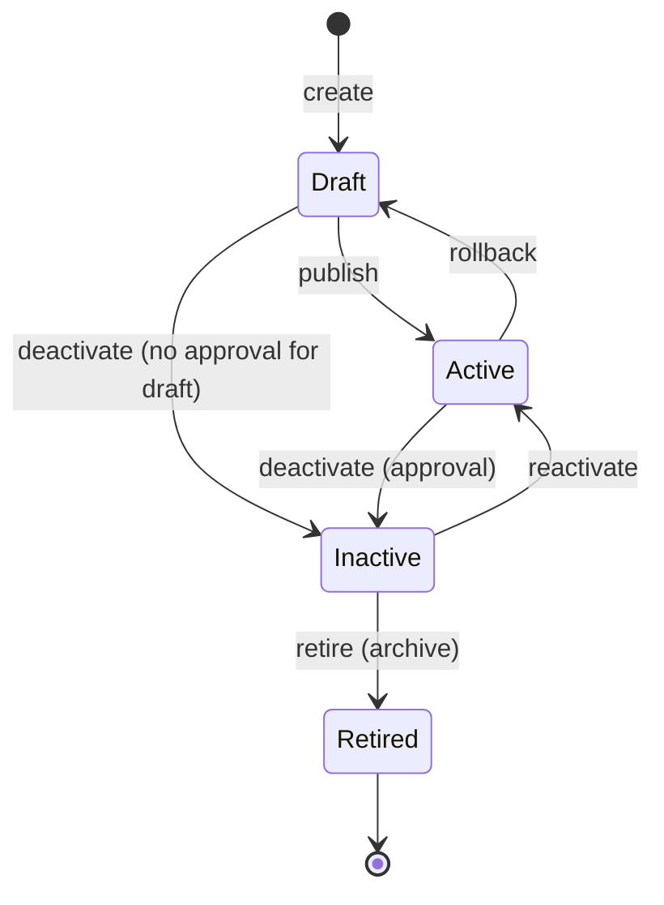

### 8.5 State Transition Guard Rules

| Transition | Guard condition | Approval required |
| --- | --- | --- |
| Draft → Active | All pre-checks pass | No |
| Active → Inactive | No active children; no active references | Yes |
| Inactive → Active | No conflicts with active data | Yes |
| Inactive → Retired | History retention policy met | Yes |
| Active → Draft | Only as controlled rollback | Yes |

---

## 9. Approval Workflow

Elevated actions follow an approval workflow before execution (BR-036).

### 9.1 Approval-Mandated Actions

| Action | Requires approval | Approver |
| --- | --- | --- |
| Create facility | No | — |
| Update facility profile | No | — |
| Deactivate facility / node | Yes | System admin |
| Reactivate a node | Yes | System admin |
| Merge/reorganize units | Yes | System admin |
| Staff assignment create/change | No | — |
| Staff assignment revoke | Yes | Facility admin / system admin |
| Reference data add/edit | No | — |
| Global configuration change | Yes | System admin |
| Facility configuration change | No | Facility admin |

### 9.2 Approval Flow

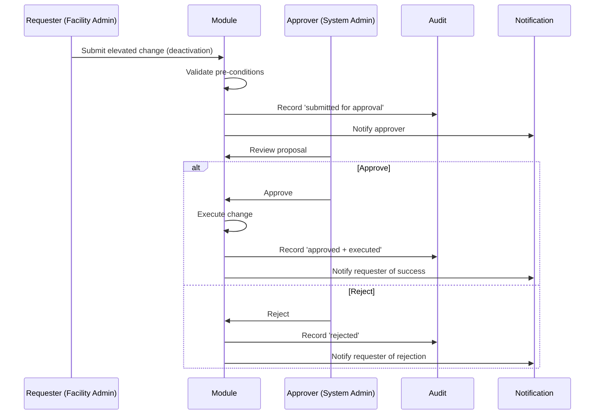

### 9.3 Approval Decision Table

| Proposal | Auto-approve? | Escalation | Timeout (SLA) |
| --- | :---: | --- | --- |
| Deactivation of a node with no active data | No | Approver only | 1 business day |
| Global config change | No | Approver + change board | 1 business day |
| Unit merge | No | Approver + data owner | 2 business days |
| Staff revocation | No | Approver | 1 business day |

---

## 10. Configuration Workflow

### 10.1 Configuration Management Flow

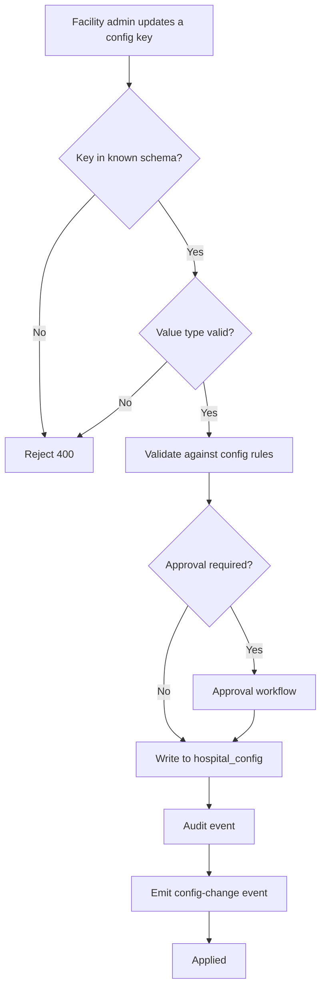

### 10.2 Config Change Effects

| Config key class | Effect | Propagation |
| --- | --- | --- |
| Time zone | Schedule/report correctness | Event to scheduling & reporting |
| Contact details | Display in consumer surfaces | Read on demand |
| Operating defaults | Default values for new records | Read on demand |
| Feature toggles | Enable/disable capabilities | Event to affected modules |

### 10.3 Configuration Guardrails

| Guardrail | Rule |
| --- | --- |
| Key whitelist | Only known keys accepted |
| Value typing | Value must match the key's declared type |
| Scope | Config is facility-scoped; global config is elevated |
| Versioning | Every change versioned and audited |
| Revert | Previous value retained for rollback |

---

## 11. Staff Assignment Workflow

### 11.1 Assign Staff (Main Flow)

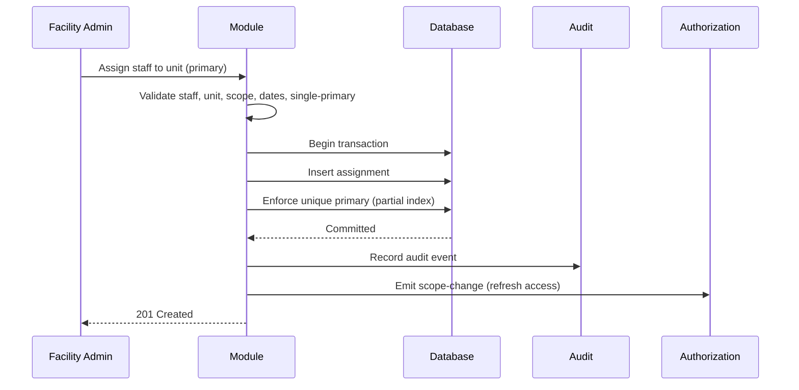

### 11.2 Revoke Staff Access

| Step | Action | Approval | Outcome |
| --- | --- | --- | --- |
| 1 | Request revocation of an assignment | Yes | — |
| 2 | Approve the revocation | Approver | — |
| 3 | Deactivate the assignment (effective immediately) | — | Access revoked |
| 4 | Emit scope-change event | — | IAM refresh |
| 5 | Record audit + notification | — | Complete |

### 11.3 Assignment Rules

| Rule | Enforcement |
| --- | --- |
| Exactly one active primary | DB partial unique index |
| No overlapping primary periods | Service validation |
| Valid effective dates (start ≤ end) | Service validation |
| In-scope facility | Service authorization |
| Immediate access reflection | Event to IAM |

---

## 12. Change Management Workflow

### 12.1 Change Types & Lifecycle

| Change type | Example | Lifecycle |
| --- | --- | --- |
| Routine | Add a unit, edit reference data | Proposed → Applied |
| Elevated | Deactivate node, global config | Proposed → Approved/Rejected → Applied |
| Restructure | Merge units, re-parent | Proposed → Approved → Data migration → Applied |
| Emergency | Critical config correction | Proposed → Expedited approval → Applied |

### 12.2 Change Management Flow

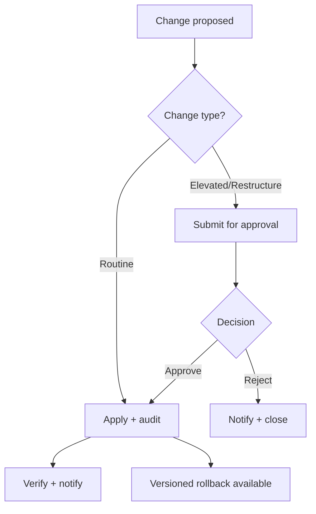

### 12.3 Versioning & History

- Every change is **versioned**; the previous state is retained for rollback (§22).
- Historical records preserve the structure as it was at the time (BR-015).
- Change history is queryable by actor, entity, and time.
- Release of changes follows [16-DEPLOYMENT-STANDARDS](../../16-DEPLOYMENT-STANDARDS.md) §8 (versioned migrations).

---

## 13. Audit Events

Audit events follow the taxonomy and integrity model in [08-AUDIT-LOGGING](../../08-AUDIT-LOGGING.md).

### 13.1 Audit Event Catalog

| Event | Actor | Captures |
| --- | --- | --- |
| `setup.facility_created` | System admin | Facility details, timestamp, correlation |
| `setup.facility_updated` | Facility admin | Changed fields |
| `setup.facility_deactivated` | System admin | Reason, approval ref |
| `setup.hierarchy.created` | Facility admin | Node, parent, type |
| `setup.hierarchy.updated` | Facility admin | Changed fields |
| `setup.hierarchy.deactivated` | Facility admin | Reason, approval ref |
| `setup.assignment.created` | Facility admin | Staff, unit, type, dates |
| `setup.assignment.revoked` | Facility admin | Reason, approval ref |
| `setup.config.updated` | Facility admin | Key, prior value, new value |
| `setup.approval.submitted` | Facility admin | Proposal ref |
| `setup.approval.approved` | Approver | Proposal ref |
| `setup.approval.rejected` | Approver | Proposal ref |

### 13.2 Audit Integrity

```mermaid
flowchart LR
    E1[Event 1] --> E2[Event 2]
    E2 --> E3[Event 3]
    subgraph CHAIN["Hash Chain (tamper-evident)"]
        H1[hash(E1)] --> H2[hash(E2)]
        H2 --> H3[hash(E3)]
    end
```

- Append-only; no update/delete in place.
- Each record carries a hash of the previous (chain).
- Integrity checks run periodically and alert on break.

### 13.3 Audit Requirements

| Requirement | Detail |
| --- | --- |
| Immutability | No modification possible |
| Attribution | Actor, action, entity, time always present |
| Correlation | `correlation_id` links to request/flow |
| No sensitive data | No PHI, secrets, or tokens in records |
| Retention | Per platform schedule |

---

## 14. Notifications

### 14.1 Notification Catalog

| Notification | Recipient | Trigger | Channel | SLA |
| --- | --- | --- | --- | --- |
| Facility provisioned | Facility admin | TR-01 | Email + in-app | Immediate |
| Approval requested | Approver | TR-05 | Email + in-app | Immediate |
| Approval approved | Requester | TR-06 | Email + in-app | Immediate |
| Approval rejected | Requester | TR-06 | Email + in-app | Immediate |
| Assignment changed | Staff member | TR-03 | In-app | Immediate |
| Structure change published | Consumers | TR-08 | Event | Immediate |
| Config change applied | Facility admin | TR-04 | In-app | Immediate |
| Periodic review due | Facility admin | TR-07 | Email | Scheduled |

### 14.2 Notification Flow

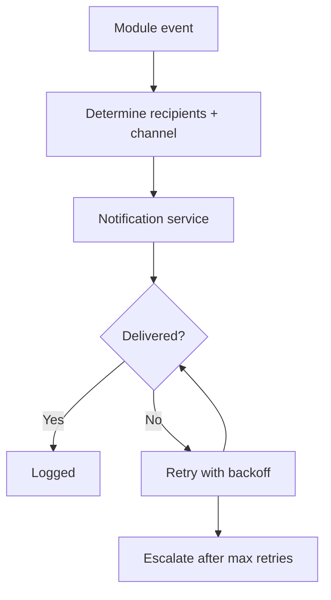

---

## 15. SLA Rules

Service-level agreements govern response and completion times.

| # | SLA | Target | Measurement |
| --- | --- | --- | --- |
| SLA-01 | Setup read response | p95 < 1 s | API latency |
| SLA-02 | Write (non-approval) completion | < 5 s to committed | Transaction time |
| SLA-03 | Approval decision | ≤ 1 business day (elevated), ≤ 2 days (merge) | Approval queue |
| SLA-04 | Event delivery to consumers | ≤ 1 min after commit | Event bus lag |
| SLA-05 | Access reflection after assignment | Immediate (< 1 min) | IAM refresh lag |
| SLA-06 | Availability | ≥ 99.9% | Uptime |
| SLA-07 | Audit write completion | Critical events synchronous; others ≤ 1 min | Audit latency |

### SLA Escalation

| Breach | Escalation |
| --- | --- |
| Read latency over target | Alert; capacity review |
| Approval overdue | Remind; escalate to approver's manager at 2× |
| Event delivery lag | Alert; retry; incident |
| Availability breach | Incident response ([16-DEPLOYMENT-STANDARDS](../../16-DEPLOYMENT-STANDARDS.md) §10) |

---

## 16. BPMN-style Mermaid Diagrams

BPMN-style diagrams model the complete processes with start/end events, tasks, gateways, and flows.

### 16.1 Facility Provisioning Process (BPMN)

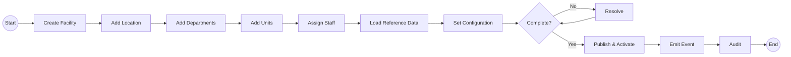

### 16.2 Deactivation Process (BPMN)

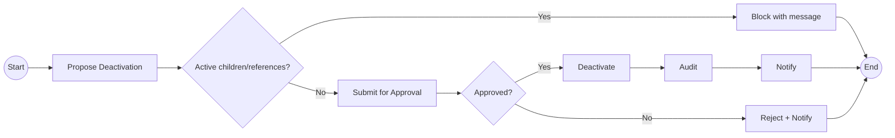

### 16.3 Change Propagation Process (BPMN)

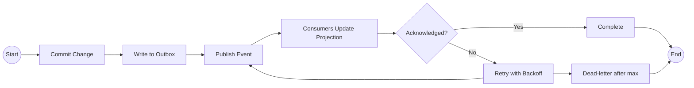

---

## 17. Sequence Diagrams

### 17.1 Sequence — Add a Department

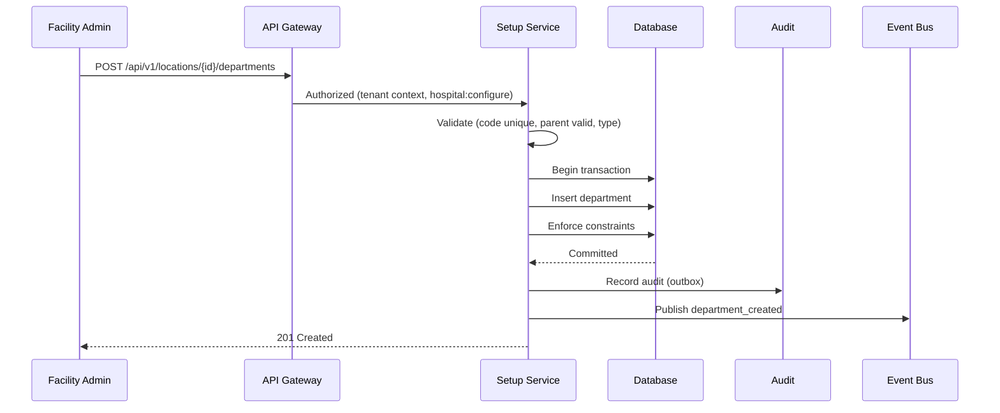

### 17.2 Sequence — Deactivation (With Approval)

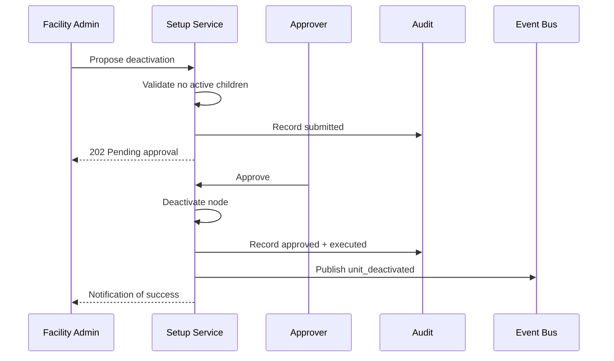

### 17.3 Sequence — Rollback After Failed Publication

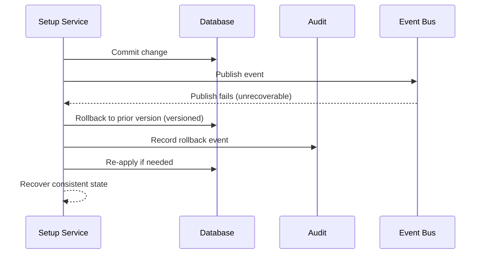

---

## 18. Activity Diagrams

### 18.1 Activity — Staff Assignment Validation

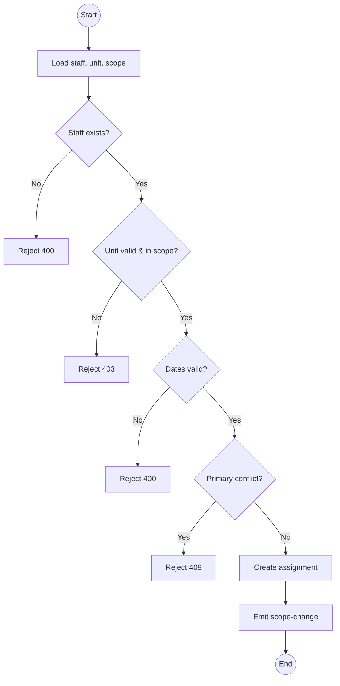

### 18.2 Activity — Periodic Review

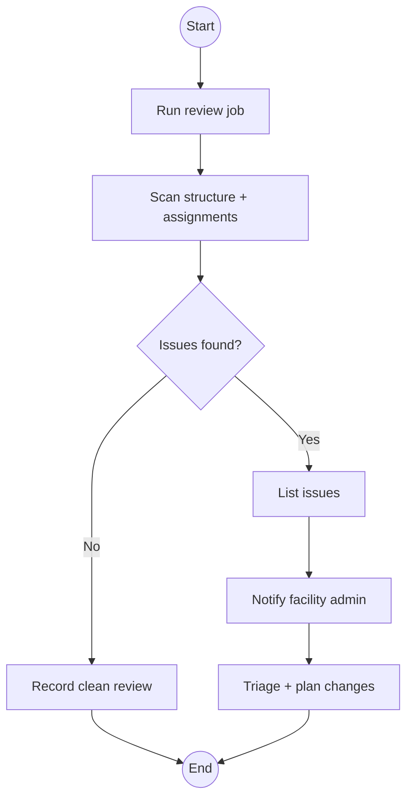

### 18.3 Activity — Emergency Config Correction

```mermaid
flowchart TD
    Start6((Start)) --> Detect[Detect critical config error]
    Detect --> Eval{Expedite approval?}
    Eval -- Yes --> Fast[Expedited approval]
    Fast --> Apply[Apply correction]
    Eval -- No --> Std[Standard approval]
    Std --> Apply
    Apply --> Audit3[Audit]
    Audit3 --> Notify3[Notify affected]
    Notify3 --> End6((End))
```

---

## 19. Cross Module Dependencies

The module depends on, and is consumed by, other modules. Refer to the module overview in [README](README.md) §6 for the relationship matrix.

| Dependency | Direction | Nature | Failure impact |
| --- | --- | --- | --- |
| IAM ([06-AUTHENTICATION](../../06-AUTHENTICATION.md)) | Inbound | Authorization | Setup inaccessible |
| Staff master (Registry) | Inbound | Staff reference | Assignments cannot resolve |
| Tenancy model ([09-MULTI-TENANCY](../../09-MULTI-TENANCY.md)) | Inbound | Isolation | Data isolation fails |
| Event bus / outbox | Bidirectional | Propagation | Consumers stale |
| Scheduling (consumer) | Outbound | Read structure | Wrong routing |
| EHR / clinical (consumer) | Outbound | Read structure | Wrong scoping |
| Billing / finance (consumer) | Outbound | Read structure | Wrong GL |
| Inventory / ops (consumer) | Outbound | Read structure | Wrong locations |
| Notification service | Outbound | Notify | Silent failures |

### Dependency Interaction

```mermaid
flowchart LR
    IAM --> HS[Hospital Setup]
    REG[Staff Master] --> HS
    TEN[Tenancy] --> HS
    HS --> BUS[Event Bus]
    BUS --> SCH[Scheduling]
    BUS --> EHR[EHR]
    BUS --> BIL[Billing]
    BUS --> INV[Inventory]
    HS --> NOT[Notification Service]
```

---

## 20. Business Rules

Business rules are the stable constraints the flows must uphold. They are defined authoritatively in [01-Business-Requirements](01-Business-Requirements.md) §7 and restated here for workflow execution.

| Rule | Applied in flow |
| --- | --- |
| Facility code unique per tenant | Provisioning |
| Node must have valid parent; no cycles | Hierarchy |
| No deactivation of nodes with active children | Deactivation |
| No hard delete; deactivation/retirement only | Change management |
| Exactly one active primary per staff | Assignment |
| Valid assignment dates | Assignment |
| In-scope assignments only | Assignment |
| Reference category+code unique | Reference data |
| Config keys validated | Configuration |
| Elevated actions require approval | Approval |
| All changes audited | Audit |

---

## 21. Edge Cases

| # | Edge case | Behavior | Mitigation |
| --- | --- | --- | --- |
| EC-01 | Deactivate the last active unit in a department | Allowed if no active references; department becomes empty | Publish event; alert if expected non-empty |
| EC-02 | Assign staff during a department merge | Blocked until merge completes | Lock assignment during restructure |
| EC-03 | Two admins edit the same node concurrently | Version conflict; second rejected with `409` | Optimistic concurrency ([05-DATABASE-ARCHITECTURE](../../05-DATABASE-ARCHITECTURE.md) §6) |
| EC-04 | Config value is a feature toggle with active consumers | Change propagates; consumers may need restart | Event + guidance; staged rollout |
| EC-05 | Facility deactivation with scheduled appointments | Blocked; list active consumers | Deactivation eligibility check |
| EC-06 | Reference value deactivated while in use | Read consumers fall back to last known | Graceful degradation + alert |
| EC-07 | Time zone change mid-day | New schedule defaults use new zone | Event; clear cutover message |
| EC-08 | Bulk import with partial failures | Transaction per item; report successes/failures | Idempotent import; summary report |
| EC-09 | Retry of an already-applied idempotent request | Returns original result | Idempotency key ([11-API-STANDARDS](../../11-API-STANDARDS.md) §8) |
| EC-10 | Node re-parented to its own descendant | Cycle; rejected | Cycle detection (BR-104) |

---

## 22. Rollback Strategy

Rollbacks restore a safe, known state after a failed or incorrect change.

### 22.1 Rollback Approaches

| Change type | Rollback method | Scope |
| --- | --- | --- |
| Routine data change | Reverse via a corrective change (not down-migration) | Row-level |
| Configuration change | Restore previous config value | Key-level |
| Hierarchy change | Re-parent/reactivate via corrective change | Node-level |
| Schema migration | Point-in-time recovery (PITR), not down-migrations | Schema-level ([05-DATABASE-ARCHITECTURE](../../05-DATABASE-ARCHITECTURE.md) §5) |
| Published event | Compensating event | Cross-module |

### 22.2 Rollback Decision

| Condition | Rollback? |
| --- | :---: |
| Change not yet published | Yes — block before propagation |
| Change published, no consumers affected | Yes — corrective change + compensating event |
| Change published, consumers affected | Controlled — notify, coordinate, compensating event |
| Schema migration applied and incompatible | Yes — PITR to prior point |

### 22.3 Rollback Flow

```mermaid
flowchart TD
    F[Failed/incorrect change detected] --> I{Published to consumers?}
    I -- No --> C1[Correct in place before propagation]
    C1 --> A[Audit]
    I -- Yes --> C2[Apply compensating corrective change]
    C2 --> COORD{Consumers coordinated?}
    COORD -- Yes --> EMIT[Emit compensating event]
    COORD -- No --> NOT[Notify + coordinate]
    NOT --> EMIT
    EMIT --> A
    A --> DONE4[Consistent state restored]
```

---

## 23. Recovery Flow

Recovery restores service and data after an incident, per [16-DEPLOYMENT-STANDARDS](../../16-DEPLOYMENT-STANDARDS.md) and [05-DATABASE-ARCHITECTURE](../../05-DATABASE-ARCHITECTURE.md) §10.

### 23.1 Recovery Tiers

| Tier | Trigger | Recovery action | RTO |
| --- | --- | --- | --- |
| T1 | Single transaction failure | Retry / idempotent re-apply | Immediate |
| T2 | Service instance failure | Restart / rolling redeploy | ≤ 1 hour |
| T3 | Data corruption | PITR from backup | ≤ 1 hour |
| T4 | Regional/DR event | Failover / cross-region restore | ≤ 1 hour |

### 23.2 Recovery Flow

```mermaid
flowchart TD
    INC[Incident detected] --> SEV{Severity}
    SEV -- T1 --> RET[Retry / re-apply]
    SEV -- T2 --> DEP[Restart / redeploy]
    SEV -- T3/T4 --> PITR[Point-in-time recovery]
    DEP --> VER2[Verify health]
    PITR --> VER2
    RET --> VER2
    VER2 --> RESUME[Resume operations]
    RESUME --> POST[Post-incident review]
```

### 23.3 Recovery Guarantees

| Guarantee | Target |
| --- | --- |
| Recovery Point Objective (RPO) | ≤ 15 min |
| Recovery Time Objective (RTO) | ≤ 1 hour |
| Backup testing | Quarterly restore drills |
| Audit continuity | Audit trail intact through recovery |

---

## 24. KPIs

Key performance indicators measure the workflow's operational health and align with [01-Business-Requirements](01-Business-Requirements.md) §16.

| KPI | Definition | Target | Source |
| --- | --- | --- | --- |
| KPI-01 | Setup read latency | p95 < 1 s | API metrics |
| KPI-02 | Write success rate | ≥ 99.9% | Transaction metrics |
| KPI-03 | Approval turnaround | ≤ 1 business day | Approval queue |
| KPI-04 | Event delivery latency | ≤ 1 min | Event bus lag |
| KPI-05 | Access reflection latency | < 1 min | IAM refresh |
| KPI-06 | Audit completeness | 100% of changes audited | Audit store |
| KPI-07 | Structure integrity | 0 violations | Integrity checks |
| KPI-08 | Rollback success rate | ≥ 99% | Rollback logs |
| KPI-09 | Recovery time | ≤ 1 hour | Incident records |
| KPI-10 | Test coverage (critical paths) | ≥ 80% | Coverage reports |

### KPI Dashboard Dimensions

| Dimension | Granularity | Trend tracked |
| --- | --- | --- |
| Latency & throughput | Per facility / global | Weekly |
| Approvals | Per approver / action | Weekly |
| Events & propagation | Per event type | Weekly |
| Audit & integrity | Global | Daily |
| Recovery & rollback | Per incident | Monthly |

---

## 25. Cross References

| Reference | Relationship | Direction |
| --- | --- | --- |
| [README](README.md) | Module overview, structure, data model | Consumes |
| [01-Business-Requirements](01-Business-Requirements.md) | Authoritative requirements this workflow implements | Consumes |
| [03-Database](03-Database.md) | Schema and persistence | Consumes |
| [00-MASTER-ROADMAP](../../00-MASTER-ROADMAP.md) | Phase sequencing, Definition of Done | Consumes |
| [01-ENTERPRISE-VISION](../../01-ENTERPRISE-VISION.md) | Strategic objectives | Consumes |
| [02-SYSTEM-ARCHITECTURE](../../02-SYSTEM-ARCHITECTURE.md) | Module and data architecture | Consumes |
| [03-TECHNOLOGY-STACK](../../03-TECHNOLOGY-STACK.md) | Technology choices | Consumes |
| [04-CODING-STANDARDS](../../04-CODING-STANDARDS.md) | Coding, error handling | Consumes |
| [05-DATABASE-ARCHITECTURE](../../05-DATABASE-ARCHITECTURE.md) | Persistence, transactions, backup | Consumes |
| [06-AUTHENTICATION](../../06-AUTHENTICATION.md) | Identity, tokens, scoping | Consumes |
| [07-ROLES-PERMISSIONS](../../07-ROLES-PERMISSIONS.md) | Roles, permissions, enforcement | Consumes |
| [08-AUDIT-LOGGING](../../08-AUDIT-LOGGING.md) | Audit trail, integrity, retention | Consumes |
| [09-MULTI-TENANCY](../../09-MULTI-TENANCY.md) | Tenant isolation | Consumes |
| [10-HOSPITAL-HIERARCHY](../../10-HOSPITAL-HIERARCHY.md) | Organization hierarchy model | Consumes |
| [11-API-STANDARDS](../../11-API-STANDARDS.md) | API contracts, errors | Consumes |
| [14-PERFORMANCE-STANDARDS](../../14-PERFORMANCE-STANDARDS.md) | Performance targets | Consumes |
| [15-TESTING-STANDARDS](../../15-TESTING-STANDARDS.md) | Testing and quality gates | Consumes |
| [16-DEPLOYMENT-STANDARDS](../../16-DEPLOYMENT-STANDARDS.md) | Deployment, recovery, rollback | Consumes |

---

*End of `docs/modules/hospital-setup/02-Workflow.md`.*
