# Hospital Setup Module — Database Architecture Specification

> **Document ID:** `hospital-setup/03-Database`
> **Owner:** Data / Engineering Lead (hospital configuration)
> **Status:** 🔄 Pending approval (Phase 1 gate)
> **Version:** 1.0.0
> **Last updated:** 2026-08-06
> **Review cadence:** Re-reviewed at every phase gate and when the data model changes.
>
> **Relationship:** This database architecture specification defines *how the Hospital Setup module stores, protects, and accesses data*. It implements the platform data standards in [05-DATABASE-ARCHITECTURE](../../05-DATABASE-ARCHITECTURE.md), the tenancy model in [09-MULTI-TENANCY](../../09-MULTI-TENANCY.md), and the requirements in [01-Business-Requirements](01-Business-Requirements.md).

---

## Table of Contents

1. [Database Overview](#1-database-overview)
2. [Domain Model](#2-domain-model)
3. [Entity Catalog](#3-entity-catalog)
4. [Entity Responsibilities](#4-entity-responsibilities)
5. [Database Design Principles](#5-database-design-principles)
6. [Normalization Strategy (3NF/BCNF where applicable)](#6-normalization-strategy-3nfbcnf-where-applicable)
7. [Table Groups](#7-table-groups)
8. [Primary Keys Strategy](#8-primary-keys-strategy)
9. [Foreign Key Strategy](#9-foreign-key-strategy)
10. [Indexing Strategy](#10-indexing-strategy)
11. [Unique Constraints](#11-unique-constraints)
12. [Check Constraints](#12-check-constraints)
13. [Tenant Isolation Strategy](#13-tenant-isolation-strategy)
14. [Soft Delete Strategy](#14-soft-delete-strategy)
15. [Audit Strategy](#15-audit-strategy)
16. [Versioning Strategy](#16-versioning-strategy)
17. [Reference Data Strategy](#17-reference-data-strategy)
18. [Configuration Data Strategy](#18-configuration-data-strategy)
19. [Data Lifecycle](#19-data-lifecycle)
20. [Archival Policy](#20-archival-policy)
21. [Partitioning Strategy](#21-partitioning-strategy)
22. [Performance Considerations](#22-performance-considerations)
23. [Security Considerations](#23-security-considerations)
24. [Backup & Recovery Considerations](#24-backup--recovery-considerations)
25. [Data Integrity Rules](#25-data-integrity-rules)
26. [Cross-Module Relationships](#26-cross-module-relationships)
27. [Mermaid ER Overview](#27-mermaid-er-overview)
28. [Data Flow Diagram](#28-data-flow-diagram)
29. [Naming Conventions](#29-naming-conventions)
30. [Cross References](#30-cross-references)

---

## 1. Database Overview

The Hospital Setup module persists the canonical, tenant-scoped organizational and configuration model of the hospital: facilities, locations, departments, units, rooms, staff assignments, reference data, configuration, and the audit of all changes.

Data is stored in **PostgreSQL**, the platform's primary system of record ([03-TECHNOLOGY-STACK](../../03-TECHNOLOGY-STACK.md) §4.3), following [05-DATABASE-ARCHITECTURE](../../05-DATABASE-ARCHITECTURE.md). The schema is governed as versioned migrations in `database/` and is the single source of truth for the module.

### 1.1 Data at a Glance

| Aspect | Approach |
| --- | --- |
| Storage engine | PostgreSQL 16+ |
| Schema | Versioned migrations under `database/` |
| Tenancy | Shared schema with `tenant_id` + row-level security |
| Keys | UUID primary keys |
| Integrity | Foreign keys, unique constraints, check constraints |
| Audit | Append-only `setup_change_audit` with hash chaining |
| Deletion | Soft delete (status/soft flags); no hard delete of data-bearing rows |

### 1.2 Data Volume Characteristics

| Table group | Growth pattern | Volume expectation |
| --- | --- | --- |
| Facility & hierarchy | Low, stable | Hundreds of nodes per facility |
| Staff assignments | Moderate, changing | Thousands per facility over time |
| Reference data | Low | Hundreds per facility |
| Configuration | Low | Tens of keys |
| Audit | High, append-only | Grows continuously |

---

## 2. Domain Model

The domain model expresses the core concepts and their relationships. It is derived from [10-HOSPITAL-HIERARCHY](../../10-HOSPITAL-HIERARCHY.md).

### 2.1 Core Concepts

| Concept | Definition |
| --- | --- |
| **Facility** | The top-level organizational and tenant boundary; owns configuration and reference data. |
| **Location** | A physical or administrative grouping under a facility. |
| **Department** | A functional area (clinical or administrative) with an owner. |
| **Unit** | A sub-area of a department (ward, ICU, lab, service desk). |
| **Room** | Optional granular operational tracking under a unit. |
| **Staff assignment** | The relationship of a staff member to a department/unit, with primary/secondary designation and effective dates. |
| **Reference value** | Setup-time controlled vocabulary. |
| **Configuration** | Facility operating parameters. |
| **Audit event** | An immutable record of a setup change. |

### 2.2 Domain Model Diagram

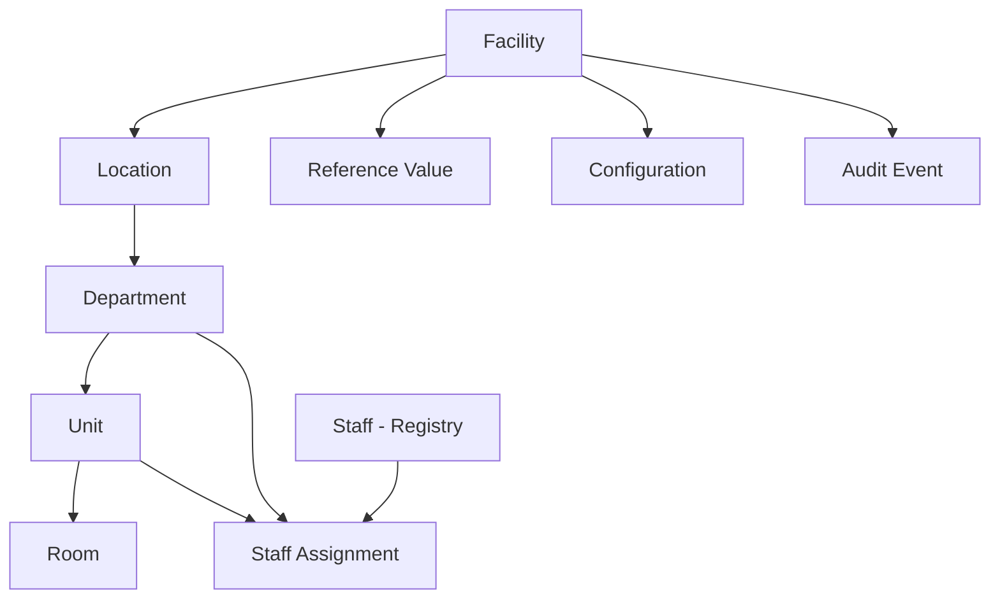

---

## 3. Entity Catalog

| # | Entity | Type | Tenant-scoped | Audit |
| --- | --- | --- | :---: | :---: |
| 1 | `facility` | Aggregate root | Yes | Yes |
| 2 | `facility_location` | Aggregate root | Yes | Yes |
| 3 | `department` | Aggregate root | Yes | Yes |
| 4 | `unit` | Aggregate root | Yes | Yes |
| 5 | `room` | Aggregate root | Yes | Yes |
| 6 | `staff_assignment` | Aggregate root | Yes | Yes |
| 7 | `reference_value` | Reference data | Yes | Yes |
| 8 | `hospital_config` | Configuration | Yes | Yes |
| 9 | `setup_change_audit` | Audit | Yes | Yes |

---

## 4. Entity Responsibilities

| Entity | Responsibilities |
| --- | --- |
| **facility** | Represents the facility/tenant root; holds identity, type, status, time zone, and contact; owns hierarchy and config. |
| **facility_location** | Groups physical/administrative areas under a facility. |
| **department** | Represents a functional area; typed clinical/administrative; may have a head. |
| **unit** | Represents a sub-area of a department; the target of most assignments. |
| **room** | Tracks optional granular rooms/beds under a unit. |
| **staff_assignment** | Links staff to departments/units with primary/secondary designation and effective dates; drives access scope. |
| **reference_value** | Holds setup-time controlled vocabularies (specialties, service types, shift templates). |
| **hospital_config** | Holds facility operating parameters with validated keys. |
| **setup_change_audit** | Immutable record of all setup changes with integrity chain. |

---

## 5. Database Design Principles

The design follows the principles in [05-DATABASE-ARCHITECTURE](../../05-DATABASE-ARCHITECTURE.md) §2.

| # | Principle | Application |
| --- | --- | --- |
| P1 | **Single source of truth** | The module's relational schema is the canonical store; no duplicated structure. |
| P2 | **Transactional integrity first** | Setup writes are ACID; no partial hierarchy. |
| P3 | **Consistency over convenience** | Canonical model over denormalized convenience. |
| P4 | **Tenant isolation by default** | All tables carry `tenant_id`; RLS backstop. |
| P5 | **Schema is code** | Versioned migrations, reviewed like code. |
| P6 | **No hard deletes** | Soft delete + retirement preserve history. |
| P7 | **Operable and observable** | Indexing, backups, and monitoring per platform standards. |

---

## 6. Normalization Strategy (3NF/BCNF where applicable)

The schema targets **3rd Normal Form (3NF)** and applies **Boyce-Codd Normal Form (BCNF)** where candidate keys are complex.

| Normal form | Applied where | Examples |
| --- | --- | --- |
| 1NF | All tables | Atomic columns; no repeating groups |
| 2NF | All tables | No partial dependencies on composite keys |
| 3NF | All tables | No transitive dependencies; attributes depend on the key |
| BCNF | Composite candidate keys | Facility+code, department+location+code, reference category+code |

### 6.1 Normalization Notes

- **De-normalization is avoided by default.** Projections (search, reporting) are materialized separately per [05-DATABASE-ARCHITECTURE](../../05-DATABASE-ARCHITECTURE.md) §3, not by denormalizing the canonical store.
- **JSONB** is used only where flexibility is intrinsic (e.g., `hospital_config.config_value`), not to model normalized relations.
- Every non-key attribute depends on the whole primary key, not part of it.

---

## 7. Table Groups

Tables are grouped by concern to guide ownership and lifecycle.

| Group | Tables | Purpose | Lifecycle |
| --- | --- | --- | --- |
| **Core structure** | `facility`, `facility_location`, `department`, `unit`, `room` | Organizational hierarchy | Stable; low change |
| **Staffing** | `staff_assignment` | Access scoping | Changing |
| **Reference & config** | `reference_value`, `hospital_config` | Controlled vocabulary & parameters | Stable; config changes |
| **Audit** | `setup_change_audit` | Immutable change record | Append-only; high growth |

### Table Group Diagram

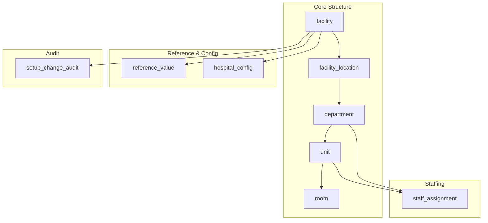

---

## 8. Primary Keys Strategy

| Aspect | Decision | Rationale |
| --- | --- | --- |
| Key type | **UUID** (`uuid`) | Globally unique; safe across imports/merges; no enumeration |
| Generation | Application/UUIDv7 (time-ordered) | Ordering + index locality ([05-DATABASE-ARCHITECTURE](../../05-DATABASE-ARCHITECTURE.md) §7) |
| Naming | `id` on each table | Consistent convention |
| Composite PKs | Avoided; surrogate `id` with unique constraints instead | Simplifies FKs and ORM mapping |

### Primary Key Decisions

| Table | Primary key | Notes |
| --- | --- | --- |
| All tables | `id uuid` | Surrogate key |
| — | — | Natural uniqueness enforced via unique constraints (§11), not composite PKs |

---

## 9. Foreign Key Strategy

| Aspect | Decision |
| --- | --- |
| FK enforcement | Database-enforced (`REFERENCES`) |
| Cascade behavior | **Restrict** on delete (prevent hard deletes) |
| Indexing | FKs are indexed for join performance |
| Cross-tenant FK | Forbidden; FKs must remain within the same tenant |
| Naming | `fk_<child>_<parent>` |

### Foreign Keys

| Child | Parent | Constraint | Notes |
| --- | --- | --- | --- |
| `facility_location` | `facility` | `fk_facility_location_facility` | Restrict |
| `department` | `facility` | `fk_department_facility` | Restrict |
| `department` | `facility_location` | `fk_department_location` | Restrict |
| `unit` | `department` | `fk_unit_department` | Restrict |
| `room` | `unit` | `fk_room_unit` | Restrict |
| `staff_assignment` | `staff` (Registry) | `fk_staff_assignment_staff` | Cross-module; restrict |
| `staff_assignment` | `department` | `fk_staff_assignment_department` | Optional; restrict |
| `staff_assignment` | `unit` | `fk_staff_assignment_unit` | Optional; restrict |
| `reference_value` | `facility` | `fk_reference_value_facility` | Facility nullable = enterprise |
| `hospital_config` | `facility` | `fk_hospital_config_facility` | Restrict |
| `setup_change_audit` | `facility` | `fk_setup_audit_facility` | Restrict |

---

## 10. Indexing Strategy

Indexing follows [05-DATABASE-ARCHITECTURE](../../05-DATABASE-ARCHITECTURE.md) §7: index hot query paths, EXPLAIN/ANALYZE slow queries, index WHERE/JOIN/ORDER columns.

### 10.1 Index Catalog

| Table | Column(s) | Type | Purpose |
| --- | --- | --- | --- |
| `facility` | `tenant_id` | btree | Tenant lookup |
| `facility` | `tenant_id`, `code` | unique | Tenant-scoped uniqueness |
| `facility_location` | `facility_id`, `code` | unique | Hierarchy navigation |
| `facility_location` | `facility_id` | btree | List by facility |
| `department` | `facility_id`, `location_id` | btree | Lookup by location |
| `department` | `location_id` | btree | FK join |
| `unit` | `department_id` | btree | Lookup by department |
| `room` | `unit_id` | btree | Lookup by unit |
| `staff_assignment` | `staff_id`, `status` | btree | Active assignments per staff |
| `staff_assignment` | `staff_id` where `type='primary' and status='active'` | partial unique | Single-primary rule |
| `staff_assignment` | `unit_id` | btree | Assignments per unit |
| `reference_value` | `facility_id`, `category`, `code` | unique | Controlled vocab lookup |
| `reference_value` | `facility_id`, `category` | btree | Category listing |
| `hospital_config` | `facility_id`, `config_key` | unique | Config lookup |
| `setup_change_audit` | `tenant_id`, `occurred_at` | btree | Audit query by time |
| `setup_change_audit` | `facility_id`, `occurred_at` | btree | Facility audit |

### 10.2 Index Design Rules

| Rule | Application |
| --- | --- |
| Index the join columns | All FKs indexed |
| Index WHERE clauses | Status, facility, category, occurred_at |
| Partial indexes for sparse predicates | Single-primary assignment |
| Composite indexes for combined filters | tenant+code, facility+category+code |
| Avoid over-indexing | Only hot paths; measure with EXPLAIN/ANALYZE |

---

## 11. Unique Constraints

| # | Table | Constraint | Columns | Purpose |
| --- | --- | --- | --- | --- |
| UQ-01 | `facility` | `uq_facility_tenant_code` | `tenant_id`, `code` | Unique facility code per tenant |
| UQ-02 | `facility_location` | `uq_location_facility_code` | `facility_id`, `code` | Unique location code per facility |
| UQ-03 | `department` | `uq_department_location_code` | `location_id`, `code` | Unique department code per location |
| UQ-04 | `unit` | `uq_unit_department_code` | `department_id`, `code` | Unique unit code per department |
| UQ-05 | `room` | `uq_room_unit_code` | `unit_id`, `room_code` | Unique room code per unit |
| UQ-06 | `staff_assignment` | `uq_assignment_single_primary` | partial: `staff_id` where type=primary & active | Exactly one active primary |
| UQ-07 | `reference_value` | `uq_reference_facility_category_code` | `facility_id`, `category`, `code` | Unique reference value |
| UQ-08 | `hospital_config` | `uq_config_facility_key` | `facility_id`, `config_key` | One value per key |

---

## 12. Check Constraints

| # | Table | Constraint | Rule |
| --- | --- | --- | --- |
| CH-01 | `facility` | `chk_facility_code_len` | `length(code) <= 20` |
| CH-02 | `facility` | `chk_facility_name_len` | `length(name) <= 120` |
| CH-03 | `facility` | `chk_facility_type` | `facility_type IN ('general','specialty','clinic','other')` |
| CH-04 | `facility` | `chk_facility_status` | `status IN ('draft','active','inactive','retired')` |
| CH-05 | `department` | `chk_department_type` | `department_type IN ('clinical','administrative')` |
| CH-06 | `department` | `chk_department_status` | `status IN ('active','inactive')` |
| CH-07 | `unit` | `chk_unit_status` | `status IN ('active','inactive')` |
| CH-08 | `room` | `chk_room_bed_count` | `bed_count > 0` |
| CH-09 | `staff_assignment` | `chk_assignment_type` | `assignment_type IN ('primary','secondary')` |
| CH-10 | `staff_assignment` | `chk_assignment_status` | `status IN ('active','inactive')` |
| CH-11 | `staff_assignment` | `chk_assignment_dates` | `effective_from <= effective_to` |
| CH-12 | `staff_assignment` | `chk_assignment_target` | at least one of `department_id` or `unit_id` is set |
| CH-13 | `reference_value` | `chk_reference_sort` | `sort_order >= 0` |
| CH-14 | `hospital_config` | `chk_config_key_len` | `length(config_key) <= 100` |

---

## 13. Tenant Isolation Strategy

Tenant isolation follows [09-MULTI-TENANCY](../../09-MULTI-TENANCY.md) §4.

| Aspect | Decision |
| --- | --- |
| Model | Shared schema with `tenant_id` on every tenant-scoped table |
| Enforcement | Application layer + row-level security (RLS) backstop |
| RLS policy | `USING (tenant_id = current_setting('app.tenant_id')::uuid)` on each table |
| Cross-tenant | Forbidden by FKs and RLS; no cross-tenant references |
| Performance | `tenant_id` leading index on hot queries |

### Tenant Isolation

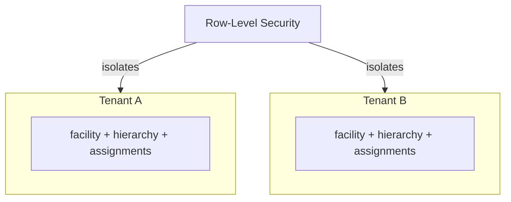

---

## 14. Soft Delete Strategy

| Aspect | Decision |
| --- | --- |
| Approach | Soft delete via status/soft flags; no hard delete of data-bearing rows |
| Facility/node | `status` transitions to `inactive`/`retired` |
| Assignment | `status` set to `inactive`; `effective_to` set on revocation |
| Reference/config | `is_active` flag on reference values; config updated in place with versioning |
| Hard delete | Allowed only for draft rows with no data, via an explicit audited operation |

### Soft Delete Rules

| Row type | Deletion mechanism | History preserved |
| --- | --- | --- |
| Active node | `status = inactive` (approval) | Yes |
| Retired node | `status = retired` (archive) | Yes |
| Assignment | `status = inactive`, set `effective_to` | Yes |
| Reference value | `is_active = false` | Yes |
| Draft row (no data) | Hard delete (audited) | No |

---

## 15. Audit Strategy

Audit follows [08-AUDIT-LOGGING](../../08-AUDIT-LOGGING.md).

| Aspect | Decision |
| --- | --- |
| Store | Append-only `setup_change_audit` table |
| Immutability | No update/delete in place; WORM semantics |
| Integrity | Hash chaining (each record carries hash of prior) |
| Correlation | `correlation_id` links to request/flow |
| Sensitive data | None stored (no PHI, secrets, tokens) |
| Write path | Critical events synchronous; others via outbox |

### Audit Table Highlights

| Column | Purpose |
| --- | --- |
| `event_id`, `event_type` | Identity and taxonomy |
| `tenant_id`, `facility_id` | Scope |
| `actor`, `actor_type` | Attribution |
| `action`, `resource` | What was done to what |
| `outcome` | success/failure/denied |
| `correlation_id` | Traceability |
| `chain_hash` | Integrity |
| `occurred_at` | Timing |

---

## 16. Versioning Strategy

| Aspect | Decision |
| --- | --- |
| Schema | Versioned migrations in `database/`, forward-only, CI clean-DB gate |
| Record history | Structure changes preserve historical accuracy via versioned/effective state |
| Optimistic concurrency | `version` or `updated_at`-based check on long-lived edits |
| Rollback | Via PITR/compensating change, not down-migrations ([05-DATABASE-ARCHITECTURE](../../05-DATABASE-ARCHITECTURE.md) §5) |
| Release | Migrations ship with the release ([16-DEPLOYMENT-STANDARDS](../../16-DEPLOYMENT-STANDARDS.md) §8) |

### Schema Versioning

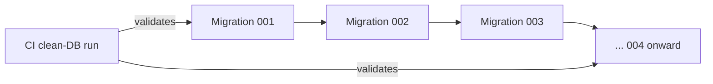

---

## 17. Reference Data Strategy

| Aspect | Decision |
| --- | --- |
| Scope | Facility-scoped; `facility_id` nullable = enterprise-level |
| Uniqueness | `facility_id` + `category` + `code` unique |
| Activation | `is_active` flag; deactivation is soft |
| Inheritance | v1 facility-scoped; lower-hierarchy overrides deferred |
| Versioning | Values are versioned and audited |

### Reference Data

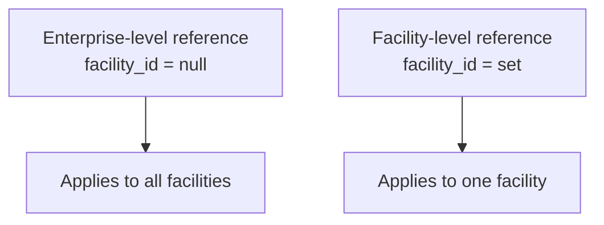

---

## 18. Configuration Data Strategy

| Aspect | Decision |
| --- | --- |
| Storage | `hospital_config` table; `config_value` as JSONB (typed) |
| Uniqueness | One value per `facility_id` + `config_key` |
| Validation | Keys validated against a known schema; unknown rejected |
| Versioning | Prior value retained; changes audited |
| Propagation | Config changes emit events to consumers |

### Config Data

| Config key | Type | Example |
| --- | --- | --- |
| `timezone` | string | `America/New_York` |
| `contact.primary_email` | string | `info@hospital.example` |
| `operating.default_shift` | string | `day` |
| `feature.toggles` | JSONB | `{"pharmacy": true}` |

---

## 19. Data Lifecycle

| Stage | Description | Trigger |
| --- | --- | --- |
| **Draft** | Provisioned, not yet usable | Creation |
| **Active** | Operational and consumed | Publish/activation |
| **Inactive** | Deactivated; not consuming | Deactivation (approval) |
| **Retired** | Archived | Retirement (approval) |
| **Purged** | Archived then deleted per retention | Retention policy |

### Lifecycle Diagram

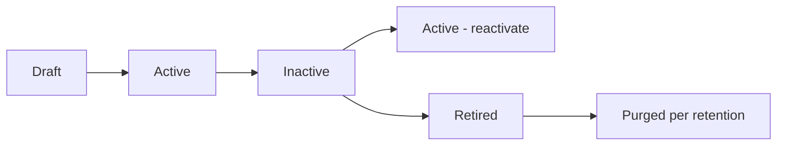

---

## 20. Archival Policy

| Aspect | Decision |
| --- | --- |
| What to archive | Retired nodes, old audit records, historical assignments beyond retention |
| Where | Object storage (S3/MinIO) per [05-DATABASE-ARCHITECTURE](../../05-DATABASE-ARCHITECTURE.md) §8 |
| When | Automated per schedule; audited |
| Retention | Per data class and compliance matrix ([00-MASTER-ROADMAP](../../00-MASTER-ROADMAP.md) §15) |
| Deletion | Only by approved, audited process; clinical deletion follows consent/legal rules |

### Archival Decision

| Data | Retain online | Archive | Purge |
| --- | --- | --- | --- |
| Active structure | Yes | — | — |
| Retired structure | No | Yes (retention) | Per policy |
| Active assignments | Yes | — | — |
| Historical assignments | No | Yes | Per policy |
| Audit records | No (old) | Yes | Per compliance |

---

## 21. Partitioning Strategy

| Aspect | Decision |
| --- | --- |
| Partitioned table | `setup_change_audit` (high, append-only growth) |
| Partition key | By time (`occurred_at`), e.g., monthly/quarterly |
| Other tables | Low volume; not partitioned in v1 |
| Maintenance | Partition pruning, archiving, vacuum per [05-DATABASE-ARCHITECTURE](../../05-DATABASE-ARCHITECTURE.md) §8 |

### Partitioning

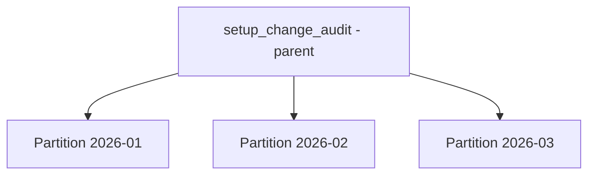

---

## 22. Performance Considerations

| Aspect | Target / approach |
| --- | --- |
| Read latency | p95 < 1 s ([14-PERFORMANCE-STANDARDS](../../14-PERFORMANCE-STANDARDS.md) §3) |
| Indexing | Hot-path indexes (§10) |
| Connection pooling | Pooled, short-lived connections ([05-DATABASE-ARCHITECTURE](../../05-DATABASE-ARCHITECTURE.md) §9) |
| N+1 avoidance | ORM joins/batching; no N+1 on hierarchy |
| Vacuum/statistics | Scheduled autovacuum tuned |
| Query analysis | EXPLAIN/ANALYZE on slow queries |
| Read/write splitting | Single primary in v1; replicas when read load justifies |

### Performance Budget

| Operation | p95 target |
| --- | --- |
| Facility/hierarchy read | < 1 s |
| Assignment list | < 1 s |
| Reference value lookup | < 500 ms |
| Audit query | < 1 s (paginated) |

---

## 23. Security Considerations

| Aspect | Decision |
| --- | --- |
| Encryption at rest | Enabled on persistent stores |
| Encryption in transit | TLS enforced ([05-DATABASE-ARCHITECTURE](../../05-DATABASE-ARCHITECTURE.md) §11) |
| Least privilege | Dedicated DB roles; no shared superuser in app paths |
| Secrets | Credentials in secret manager; never in code/env |
| Network | DB not publicly exposed; only authorized app/backup paths |
| RLS | Row-level security backstop for tenant isolation |
| Audit | All sensitive operations audited |
| No PHI | Module stores no clinical data; minimized to structure |

---

## 24. Backup & Recovery Considerations

Backup/recovery follows [05-DATABASE-ARCHITECTURE](../../05-DATABASE-ARCHITECTURE.md) §10.

| Aspect | Target |
| --- | --- |
| RPO | ≤ 15 min (PITR via WAL) |
| RTO | ≤ 1 hour |
| Backup | Full + incremental/WAL; automated, monitored |
| Testing | Quarterly restore drills; documented runbook |
| Off-site | Backups in separate region/location |
| Failover | Primary + replica; automated failover |

### Backup Flow

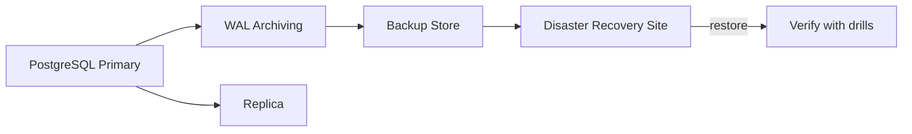

---

## 25. Data Integrity Rules

| # | Rule | Enforced by |
| --- | --- | --- |
| DI-01 | Facility code unique per tenant | Unique constraint |
| DI-02 | Node must reference a valid parent | Foreign key |
| DI-03 | No hierarchy cycles | Service + query |
| DI-04 | No hard delete of data-bearing rows | Applies RESTRICT FK + soft delete |
| DI-05 | No deactivation of nodes with active children | Service + constraints |
| DI-06 | Exactly one active primary per staff | Partial unique index |
| DI-07 | Assignment dates valid | Check constraint |
| DI-08 | Assignment targets at least one of dept/unit | Check constraint |
| DI-09 | Reference category+code unique | Unique constraint |
| DI-10 | Config keys unique + validated | Unique constraint + schema |
| DI-11 | Tenant isolation maintained | RLS + tenant-scoped FKs |
| DI-12 | Audit immutable | Append-only + hash chain |

---

## 26. Cross-Module Relationships

| Module | Relationship | Nature |
| --- | --- | --- |
| Staff master (Registry) | Provides `staff` referenced by `staff_assignment` | Inbound FK |
| IAM ([06-AUTHENTICATION](../../06-AUTHENTICATION.md)) | Consumes assignments for scope | Outbound read |
| Scheduling | Consumes structure for routing | Outbound read |
| EHR / clinical | Consumes structure for scoping | Outbound read |
| Billing / finance | Consumes structure for GL | Outbound read |
| Inventory / ops | Consumes structure for locations | Outbound read |
| Event bus | Propagates structure changes | Bidirectional |

### Cross-Module Data Flow

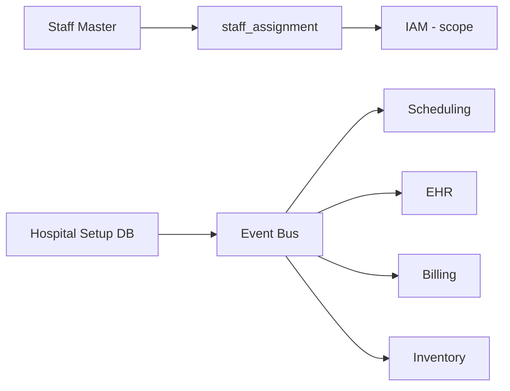

---

## 27. Mermaid ER Overview

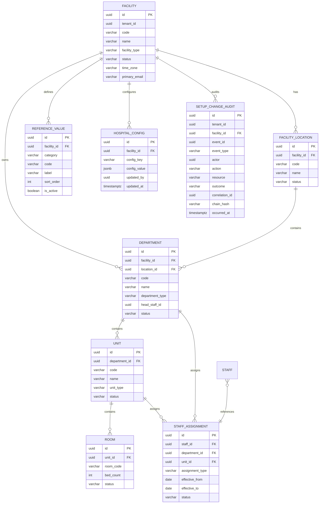

---

## 28. Data Flow Diagram

### 28.1 Write Path

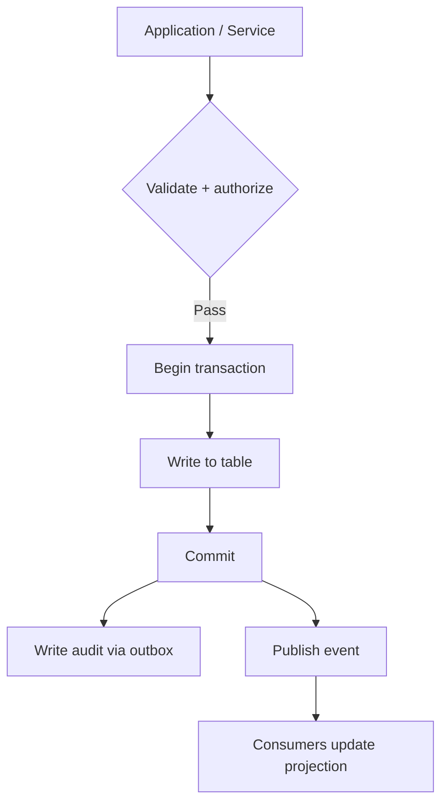

### 28.2 Read Path

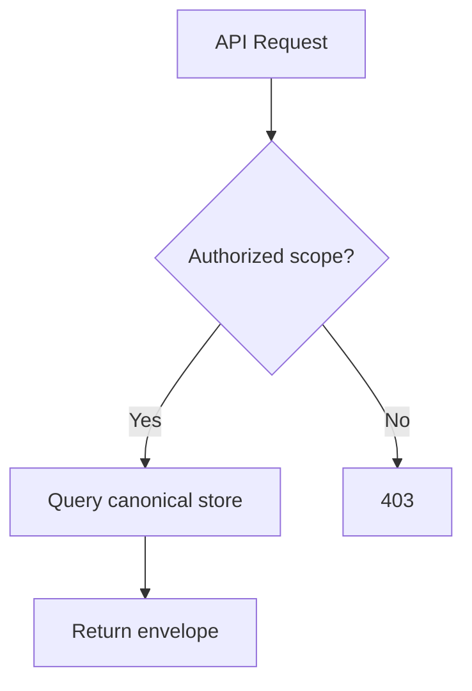

### 28.3 Audit Flow

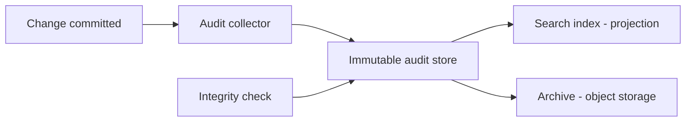

---

## 29. Naming Conventions

Naming follows [04-CODING-STANDARDS](../../04-CODING-STANDARDS.md) §5 and the platform SQL conventions in [05-DATABASE-ARCHITECTURE](../../05-DATABASE-ARCHITECTURE.md).

### 29.1 Object Naming

| Object | Convention | Example |
| --- | --- | --- |
| Tables | `snake_case`, plural | `staff_assignment` |
| Columns | `snake_case` | `effective_from` |
| Primary key | `id` | — |
| Foreign key | `<child>_id` | `department_id` |
| Primary key constraint | `pk_<table>` | `pk_department` |
| Foreign key constraint | `fk_<child>_<parent>` | `fk_unit_department` |
| Unique constraint | `uq_<table>_<cols>` | `uq_reference_facility_category_code` |
| Check constraint | `chk_<table>_<rule>` | `chk_assignment_dates` |
| Index | `ix_<table>_<cols>` | `ix_staff_assignment_staff_status` |

### 29.2 Data Type Conventions

| Data | Type |
| --- | --- |
| Identifiers | `uuid` |
| Codes | `varchar(20)` |
| Names/labels | `varchar(120)` / `varchar(160)` |
| Status/type enums | `varchar` with check constraint |
| Dates | `date` |
| Timestamps | `timestamptz` |
| Flexible values | `jsonb` (config only) |

---

## 30. Cross References

| Reference | Relationship | Direction |
| --- | --- | --- |
| [README](README.md) | Module overview, structure, data tables | Consumes |
| [01-Business-Requirements](01-Business-Requirements.md) | Authoritative requirements | Consumes |
| [02-Workflow](02-Workflow.md) | Operational flows this schema supports | Consumes |
| [04-Database-Tables](04-Database-Tables.md) | Detailed table DDL | Consumes |
| [00-MASTER-ROADMAP](../../00-MASTER-ROADMAP.md) | Phase sequencing, compliance matrix | Consumes |
| [01-ENTERPRISE-VISION](../../01-ENTERPRISE-VISION.md) | Strategic objectives | Consumes |
| [02-SYSTEM-ARCHITECTURE](../../02-SYSTEM-ARCHITECTURE.md) | Module and data architecture | Consumes |
| [03-TECHNOLOGY-STACK](../../03-TECHNOLOGY-STACK.md) | Storage technology choices | Consumes |
| [04-CODING-STANDARDS](../../04-CODING-STANDARDS.md) | Naming, SQL conventions | Consumes |
| [05-DATABASE-ARCHITECTURE](../../05-DATABASE-ARCHITECTURE.md) | Persistence, transactions, backups | Consumes |
| [06-AUTHENTICATION](../../06-AUTHENTICATION.md) | Identity, scoping | Consumes |
| [07-ROLES-PERMISSIONS](../../07-ROLES-PERMISSIONS.md) | Roles, permissions | Consumes |
| [08-AUDIT-LOGGING](../../08-AUDIT-LOGGING.md) | Audit trail, integrity | Consumes |
| [09-MULTI-TENANCY](../../09-MULTI-TENANCY.md) | Tenant isolation | Consumes |
| [10-HOSPITAL-HIERARCHY](../../10-HOSPITAL-HIERARCHY.md) | Organization hierarchy model | Consumes |
| [11-API-STANDARDS](../../11-API-STANDARDS.md) | API contracts | Consumes |
| [14-PERFORMANCE-STANDARDS](../../14-PERFORMANCE-STANDARDS.md) | Performance targets | Consumes |
| [15-TESTING-STANDARDS](../../15-TESTING-STANDARDS.md) | Testing and quality gates | Consumes |
| [16-DEPLOYMENT-STANDARDS](../../16-DEPLOYMENT-STANDARDS.md) | Deployment, migrations | Consumes |

---

*End of `docs/modules/hospital-setup/03-Database.md`.*
