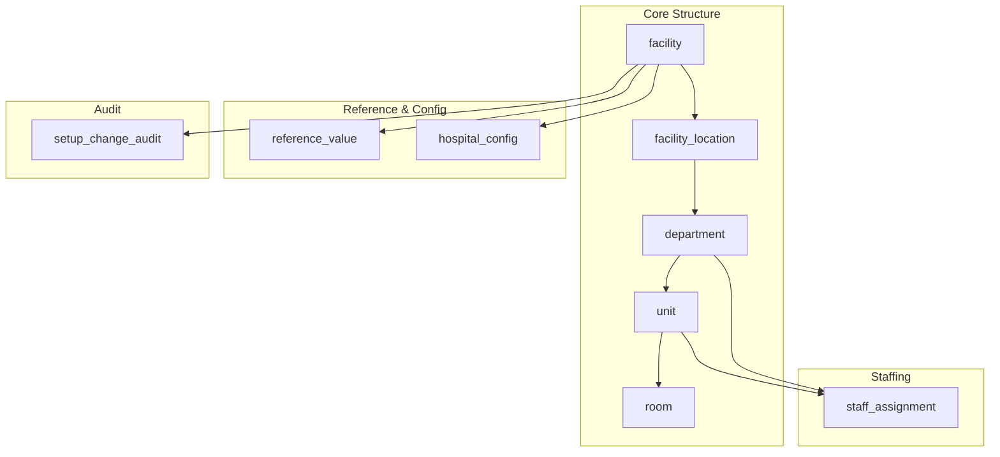

# Hospital Setup Module — Database Tables Specification

> **Document ID:** `hospital-setup/04-Database-Tables`
> **Owner:** Data / Engineering Lead (hospital configuration)
> **Status:** 🔄 Pending approval (Phase 1 gate)
> **Version:** 1.0.0
> **Last updated:** 2026-08-06
> **Review cadence:** Re-reviewed at every phase gate and when the data model changes.
>
> **Relationship:** This specification details every table, column, constraint, index, and relationship of the Hospital Setup module. It is the detailed companion to the database architecture in [03-Database](03-Database.md), implements the requirements in [01-Business-Requirements](01-Business-Requirements.md), and follows the platform data standards in [05-DATABASE-ARCHITECTURE](../../05-DATABASE-ARCHITECTURE.md).

---

## Table of Contents

1. [Purpose & Scope](#1-purpose--scope)
2. [Schema Context](#2-schema-context)
3. [Table Catalog](#3-table-catalog)
4. [facility](#4-facility)
5. [facility_location](#5-facility_location)
6. [department](#6-department)
7. [unit](#7-unit)
8. [room](#8-room)
9. [staff_assignment](#9-staff_assignment)
10. [reference_value](#10-reference_value)
11. [hospital_config](#11-hospital_config)
12. [setup_change_audit](#12-setup_change_audit)
13. [Shared Column Conventions](#13-shared-column-conventions)
14. [Integrity Summary](#14-integrity-summary)
15. [Query Patterns](#15-query-patterns)
16. [Data Volume & Growth](#16-data-volume--growth)
17. [Migration & Versioning](#17-migration--versioning)
18. [Security & Tenancy](#18-security--tenancy)
19. [Data Quality & Governance](#19-data-quality--governance)
20. [Cross References](#20-cross-references)

---

## 1. Purpose & Scope

This document is the **authoritative, table-level reference** for the Hospital Setup module database. It specifies, for every table:

- The purpose and ownership.
- The full column dictionary (name, type, nullability, default, purpose).
- The primary key and foreign keys.
- The unique, check, and soft-delete constraints.
- The index catalog.
- The allowed values (enumerations).
- The query patterns the table serves.
- The data lifecycle, growth profile, and retention.

**Scope:** the nine module tables and their shared conventions. **Out of scope:** the platform-wide database architecture (see [03-Database](03-Database.md) and [05-DATABASE-ARCHITECTURE](../../05-DATABASE-ARCHITECTURE.md)).

---

## 2. Schema Context

### 2.1 Storage

- **Engine:** PostgreSQL 16+ ([03-TECHNOLOGY-STACK](../../03-TECHNOLOGY-STACK.md) §4.3).
- **Schema:** versioned migrations under `database/`; forward-only; CI clean-DB gate.
- **Tenancy:** shared schema, every table carries `tenant_id`, row-level security backstop ([09-MULTI-TENANCY](../../09-MULTI-TENANCY.md)).
- **Naming:** `snake_case`; constraint/index names per [03-Database](03-Database.md) §29.

### 2.2 Schema Map

---

## 3. Table Catalog

| # | Table | Table group | Primary key | Tenant | Soft-delete | Audit | Partitioned |
| --- | --- | --- | --- | :---: | :---: | :---: | :---: |
| 1 | [facility](#4-facility) | Core structure | `id` | Yes | `status` | Yes | No |
| 2 | [facility_location](#5-facility_location) | Core structure | `id` | Yes | `status` | Yes | No |
| 3 | [department](#6-department) | Core structure | `id` | Yes | `status` | Yes | No |
| 4 | [unit](#7-unit) | Core structure | `id` | Yes | `status` | Yes | No |
| 5 | [room](#8-room) | Core structure | `id` | Yes | `status` | Yes | No |
| 6 | [staff_assignment](#9-staff_assignment) | Staffing | `id` | Yes | `status` | Yes | No |
| 7 | [reference_value](#10-reference_value) | Reference & config | `id` | Yes | `is_active` | Yes | No |
| 8 | [hospital_config](#11-hospital_config) | Reference & config | `id` | Yes | overwrite | Yes | No |
| 9 | [setup_change_audit](#12-setup_change_audit) | Audit | `id` | Yes | — (append-only) | n/a | By time |

---

## 4. facility

### 4.1 Purpose

The `facility` table represents the facility/tenant root. It is the top-level organizational and tenancy boundary and owns all configuration and reference data. It is the source of the tenant context for every module.

### 4.2 Column Dictionary

| Column | Type | Null | Default | Purpose |
| --- | --- | :---: | --- | --- |
| `id` | `uuid` | No | generated | Surrogate primary key. |
| `tenant_id` | `uuid` | No | — | Tenant scoping key; equals facility id in v1. |
| `code` | `varchar(20)` | No | — | Short facility identifier; unique per tenant. |
| `name` | `varchar(120)` | No | — | Display name. |
| `facility_type` | `varchar(40)` | No | `general` | Category of facility. |
| `status` | `varchar(20)` | No | `draft` | Lifecycle state. |
| `time_zone` | `varchar(64)` | No | `UTC` | IANA time zone name. |
| `address_line1` | `varchar(200)` | Yes | — | Street address line 1. |
| `address_line2` | `varchar(200)` | Yes | — | Street address line 2. |
| `city` | `varchar(100)` | Yes | — | City. |
| `region` | `varchar(100)` | Yes | — | State/province/region. |
| `postal_code` | `varchar(20)` | Yes | — | Postal/ZIP code. |
| `country` | `varchar(80)` | Yes | — | Country. |
| `primary_phone` | `varchar(30)` | Yes | — | Primary contact phone. |
| `primary_email` | `varchar(120)` | Yes | — | Primary contact email. |
| `created_by` | `uuid` | No | — | Actor who created the row. |
| `created_at` | `timestamptz` | No | now | Creation timestamp. |
| `updated_by` | `uuid` | No | — | Actor of last update. |
| `updated_at` | `timestamptz` | No | now | Last-update timestamp. |

### 4.3 Keys & Constraints

| Constraint | Type | Columns | Rule |
| --- | --- | --- | --- |
| `pk_facility` | Primary key | `id` | Unique identity. |
| `fk_facility_tenant` | Foreign key | `tenant_id` | Valid tenant. |
| `uq_facility_tenant_code` | Unique | `tenant_id`, `code` | Facility code unique per tenant. |
| `chk_facility_code_len` | Check | `code` | `length(code) <= 20`. |
| `chk_facility_name_len` | Check | `name` | `length(name) <= 120`. |
| `chk_facility_type` | Check | `facility_type` | `IN ('general','specialty','clinic','other')`. |
| `chk_facility_status` | Check | `status` | `IN ('draft','active','inactive','retired')`. |

### 4.4 Enumerations

| Field | Allowed values |
| --- | --- |
| `facility_type` | `general`, `specialty`, `clinic`, `other` |
| `status` | `draft`, `active`, `inactive`, `retired` |

### 4.5 Indexes

| Index | Type | Purpose |
| --- | --- | --- |
| `pk_facility` | primary (btree) | Identity lookup. |
| `uq_facility_tenant_code` | unique (btree) | Tenant-scoped code lookup + uniqueness. |
| `ix_facility_tenant` | btree | Tenant listing. |

### 4.6 Query Patterns

| Pattern | Query shape |
| --- | --- |
| Facility by code | `WHERE tenant_id = ? AND code = ?` |
| Active facilities | `WHERE tenant_id = ? AND status = 'active'` |
| Facility profile | `WHERE id = ?` |

---

## 5. facility_location

### 5.1 Purpose

The `facility_location` table groups physical or administrative areas under a facility (e.g., campus, building, site).

### 5.2 Column Dictionary

| Column | Type | Null | Default | Purpose |
| --- | --- | :---: | --- | --- |
| `id` | `uuid` | No | generated | Surrogate primary key. |
| `tenant_id` | `uuid` | No | — | Tenant scoping key. |
| `facility_id` | `uuid` | No | — | Owning facility. |
| `code` | `varchar(20)` | No | — | Short identifier; unique per facility. |
| `name` | `varchar(120)` | No | — | Display name. |
| `address` | `varchar(300)` | Yes | — | Physical address. |
| `status` | `varchar(20)` | No | `active` | Lifecycle state. |
| `created_at` | `timestamptz` | No | now | Creation timestamp. |
| `updated_at` | `timestamptz` | No | now | Last-update timestamp. |

### 5.3 Keys & Constraints

| Constraint | Type | Columns | Rule |
| --- | --- | --- | --- |
| `pk_facility_location` | Primary key | `id` | Unique identity. |
| `fk_facility_location_tenant` | Foreign key | `tenant_id` | Valid tenant. |
| `fk_facility_location_facility` | Foreign key | `facility_id` | Valid facility; RESTRICT on delete. |
| `uq_location_facility_code` | Unique | `facility_id`, `code` | Location code unique per facility. |
| `chk_location_status` | Check | `status` | `IN ('active','inactive')`. |

### 5.4 Enumerations

| Field | Allowed values |
| --- | --- |
| `status` | `active`, `inactive` |

### 5.5 Indexes

| Index | Type | Purpose |
| --- | --- | --- |
| `pk_facility_location` | primary (btree) | Identity lookup. |
| `uq_location_facility_code` | unique (btree) | Facility-scoped code lookup. |
| `ix_facility_location_facility` | btree | List locations by facility. |

### 5.6 Query Patterns

| Pattern | Query shape |
| --- | --- |
| Locations by facility | `WHERE facility_id = ? AND status = 'active'` |
| Location by code | `WHERE facility_id = ? AND code = ?` |

---

## 6. department

### 6.1 Purpose

The `department` table represents a functional area of the facility (clinical or administrative) with an optional head. It is the parent of units and a possible assignment target.

### 6.2 Column Dictionary

| Column | Type | Null | Default | Purpose |
| --- | --- | :---: | --- | --- |
| `id` | `uuid` | No | generated | Surrogate primary key. |
| `tenant_id` | `uuid` | No | — | Tenant scoping key. |
| `facility_id` | `uuid` | No | — | Owning facility. |
| `location_id` | `uuid` | No | — | Parent location. |
| `code` | `varchar(20)` | No | — | Short identifier; unique per location. |
| `name` | `varchar(120)` | No | — | Display name. |
| `department_type` | `varchar(20)` | No | `clinical` | Clinical or administrative. |
| `head_staff_id` | `uuid` | Yes | — | Optional department head (staff reference). |
| `status` | `varchar(20)` | No | `active` | Lifecycle state. |
| `created_at` | `timestamptz` | No | now | Creation timestamp. |
| `updated_at` | `timestamptz` | No | now | Last-update timestamp. |

### 6.3 Keys & Constraints

| Constraint | Type | Columns | Rule |
| --- | --- | --- | --- |
| `pk_department` | Primary key | `id` | Unique identity. |
| `fk_department_tenant` | Foreign key | `tenant_id` | Valid tenant. |
| `fk_department_facility` | Foreign key | `facility_id` | Valid facility; RESTRICT. |
| `fk_department_location` | Foreign key | `location_id` | Valid location; RESTRICT. |
| `uq_department_location_code` | Unique | `location_id`, `code` | Department code unique per location. |
| `chk_department_type` | Check | `department_type` | `IN ('clinical','administrative')`. |
| `chk_department_status` | Check | `status` | `IN ('active','inactive')`. |

### 6.4 Enumerations

| Field | Allowed values |
| --- | --- |
| `department_type` | `clinical`, `administrative` |
| `status` | `active`, `inactive` |

### 6.5 Indexes

| Index | Type | Purpose |
| --- | --- | --- |
| `pk_department` | primary (btree) | Identity lookup. |
| `uq_department_location_code` | unique (btree) | Location-scoped code lookup. |
| `ix_department_facility_location` | btree | Departments by facility/location. |
| `ix_department_location` | btree | FK join to location. |

### 6.6 Query Patterns

| Pattern | Query shape |
| --- | --- |
| Departments by location | `WHERE location_id = ? AND status = 'active'` |
| Departments by facility | `WHERE facility_id = ?` |
| Department by code | `WHERE location_id = ? AND code = ?` |

---

## 7. unit

### 7.1 Purpose

The `unit` table represents a sub-area of a department (e.g., ward, ICU, lab station, service desk) and is the primary target of staff assignments.

### 7.2 Column Dictionary

| Column | Type | Null | Default | Purpose |
| --- | --- | :---: | --- | --- |
| `id` | `uuid` | No | generated | Surrogate primary key. |
| `tenant_id` | `uuid` | No | — | Tenant scoping key. |
| `department_id` | `uuid` | No | — | Parent department. |
| `code` | `varchar(20)` | No | — | Short identifier; unique per department. |
| `name` | `varchar(120)` | No | — | Display name. |
| `unit_type` | `varchar(40)` | No | `general` | Type of unit. |
| `status` | `varchar(20)` | No | `active` | Lifecycle state. |
| `created_at` | `timestamptz` | No | now | Creation timestamp. |
| `updated_at` | `timestamptz` | No | now | Last-update timestamp. |

### 7.3 Keys & Constraints

| Constraint | Type | Columns | Rule |
| --- | --- | --- | --- |
| `pk_unit` | Primary key | `id` | Unique identity. |
| `fk_unit_tenant` | Foreign key | `tenant_id` | Valid tenant. |
| `fk_unit_department` | Foreign key | `department_id` | Valid department; RESTRICT. |
| `uq_unit_department_code` | Unique | `department_id`, `code` | Unit code unique per department. |
| `chk_unit_status` | Check | `status` | `IN ('active','inactive')`. |

### 7.4 Enumerations

| Field | Allowed values |
| --- | --- |
| `unit_type` | open (e.g., `ward`, `icu`, `lab`, `pharmacy`, `service`) |
| `status` | `active`, `inactive` |

### 7.5 Indexes

| Index | Type | Purpose |
| --- | --- | --- |
| `pk_unit` | primary (btree) | Identity lookup. |
| `uq_unit_department_code` | unique (btree) | Department-scoped code lookup. |
| `ix_unit_department` | btree | FK join to department. |

### 7.6 Query Patterns

| Pattern | Query shape |
| --- | --- |
| Units by department | `WHERE department_id = ? AND status = 'active'` |
| Unit by code | `WHERE department_id = ? AND code = ?` |

---

## 8. room

### 8.1 Purpose

The `room` table tracks optional granular rooms/beds under a unit for operational modules. It is optional in v1 and used where room-level tracking is required.

### 8.2 Column Dictionary

| Column | Type | Null | Default | Purpose |
| --- | --- | :---: | --- | --- |
| `id` | `uuid` | No | generated | Surrogate primary key. |
| `tenant_id` | `uuid` | No | — | Tenant scoping key. |
| `unit_id` | `uuid` | No | — | Parent unit. |
| `room_code` | `varchar(20)` | No | — | Short identifier; unique per unit. |
| `bed_count` | `int` | No | `1` | Number of beds in the room. |
| `status` | `varchar(20)` | No | `active` | Lifecycle state. |
| `created_at` | `timestamptz` | No | now | Creation timestamp. |
| `updated_at` | `timestamptz` | No | now | Last-update timestamp. |

### 8.3 Keys & Constraints

| Constraint | Type | Columns | Rule |
| --- | --- | --- | --- |
| `pk_room` | Primary key | `id` | Unique identity. |
| `fk_room_tenant` | Foreign key | `tenant_id` | Valid tenant. |
| `fk_room_unit` | Foreign key | `unit_id` | Valid unit; RESTRICT. |
| `uq_room_unit_code` | Unique | `unit_id`, `room_code` | Room code unique per unit. |
| `chk_room_bed_count` | Check | `bed_count` | `bed_count > 0`. |
| `chk_room_status` | Check | `status` | `IN ('active','inactive')`. |

### 8.4 Enumerations

| Field | Allowed values |
| --- | --- |
| `status` | `active`, `inactive` |

### 8.5 Indexes

| Index | Type | Purpose |
| --- | --- | --- |
| `pk_room` | primary (btree) | Identity lookup. |
| `uq_room_unit_code` | unique (btree) | Unit-scoped code lookup. |
| `ix_room_unit` | btree | FK join to unit. |

### 8.6 Query Patterns

| Pattern | Query shape |
| --- | --- |
| Rooms by unit | `WHERE unit_id = ? AND status = 'active'` |
| Room by code | `WHERE unit_id = ? AND room_code = ?` |

---

## 9. staff_assignment

### 9.1 Purpose

The `staff_assignment` table links a staff member to a department and/or unit with a primary/secondary designation and effective dates. It is the basis for deriving a staff member's access scope.

### 9.2 Column Dictionary

| Column | Type | Null | Default | Purpose |
| --- | --- | :---: | --- | --- |
| `id` | `uuid` | No | generated | Surrogate primary key. |
| `tenant_id` | `uuid` | No | — | Tenant scoping key. |
| `staff_id` | `uuid` | No | — | Staff member (Registry master reference). |
| `department_id` | `uuid` | Yes | — | Target department (optional if unit set). |
| `unit_id` | `uuid` | Yes | — | Target unit (optional if department set). |
| `assignment_type` | `varchar(20)` | No | `primary` | Primary or secondary. |
| `effective_from` | `date` | No | — | Assignment start date. |
| `effective_to` | `date` | Yes | — | Assignment end date (null = open-ended). |
| `status` | `varchar(20)` | No | `active` | Lifecycle state. |
| `created_at` | `timestamptz` | No | now | Creation timestamp. |
| `updated_at` | `timestamptz` | No | now | Last-update timestamp. |

### 9.3 Keys & Constraints

| Constraint | Type | Columns | Rule |
| --- | --- | --- | --- |
| `pk_staff_assignment` | Primary key | `id` | Unique identity. |
| `fk_staff_assignment_tenant` | Foreign key | `tenant_id` | Valid tenant. |
| `fk_staff_assignment_staff` | Foreign key | `staff_id` | Valid staff (Registry); RESTRICT. |
| `fk_staff_assignment_department` | Foreign key | `department_id` | Valid department; RESTRICT (optional). |
| `fk_staff_assignment_unit` | Foreign key | `unit_id` | Valid unit; RESTRICT (optional). |
| `uq_assignment_single_primary` | Partial unique | `staff_id` where `type='primary' and status='active'` | Exactly one active primary per staff. |
| `chk_assignment_type` | Check | `assignment_type` | `IN ('primary','secondary')`. |
| `chk_assignment_status` | Check | `status` | `IN ('active','inactive')`. |
| `chk_assignment_dates` | Check | `effective_from`, `effective_to` | `effective_from <= effective_to`. |
| `chk_assignment_target` | Check | `department_id`, `unit_id` | At least one of department_id or unit_id is set. |

### 9.4 Enumerations

| Field | Allowed values |
| --- | --- |
| `assignment_type` | `primary`, `secondary` |
| `status` | `active`, `inactive` |

### 9.5 Indexes

| Index | Type | Purpose |
| --- | --- | --- |
| `pk_staff_assignment` | primary (btree) | Identity lookup. |
| `uq_assignment_single_primary` | partial unique (btree) | Single-primary enforcement. |
| `ix_staff_assignment_staff_status` | btree | Active assignments per staff. |
| `ix_staff_assignment_unit` | btree | Assignments per unit. |
| `ix_staff_assignment_department` | btree | Assignments per department. |

### 9.6 Query Patterns

| Pattern | Query shape |
| --- | --- |
| Active primary for staff | `WHERE staff_id = ? AND assignment_type = 'primary' AND status = 'active'` |
| All assignments for staff | `WHERE staff_id = ?` |
| Staff in a unit | `WHERE unit_id = ? AND status = 'active'` |

---

## 10. reference_value

### 10.1 Purpose

The `reference_value` table holds setup-time controlled vocabularies (e.g., specialties, service types, shift templates). Values may be enterprise-level (`facility_id` null) or facility-scoped.

### 10.2 Column Dictionary

| Column | Type | Null | Default | Purpose |
| --- | --- | :---: | --- | --- |
| `id` | `uuid` | No | generated | Surrogate primary key. |
| `tenant_id` | `uuid` | No | — | Tenant scoping key. |
| `facility_id` | `uuid` | Yes | — | Scoping facility; null = enterprise-level. |
| `category` | `varchar(60)` | No | — | Vocabulary category. |
| `code` | `varchar(40)` | No | — | Value code. |
| `label` | `varchar(160)` | No | — | Display label. |
| `sort_order` | `int` | No | `0` | Display ordering. |
| `is_active` | `boolean` | No | `true` | Soft-delete/activation flag. |
| `created_at` | `timestamptz` | No | now | Creation timestamp. |
| `updated_at` | `timestamptz` | No | now | Last-update timestamp. |

### 10.3 Keys & Constraints

| Constraint | Type | Columns | Rule |
| --- | --- | --- | --- |
| `pk_reference_value` | Primary key | `id` | Unique identity. |
| `fk_reference_value_tenant` | Foreign key | `tenant_id` | Valid tenant. |
| `fk_reference_value_facility` | Foreign key | `facility_id` | Valid facility (nullable); RESTRICT. |
| `uq_reference_facility_category_code` | Unique | `facility_id`, `category`, `code` | Unique reference value. |
| `chk_reference_sort` | Check | `sort_order` | `sort_order >= 0`. |

### 10.4 Enumerations / Categories

| Category | Example codes |
| --- | --- |
| `specialty` | `cardiology`, `emergency`, `oncology` |
| `service_type` | `outpatient`, `inpatient`, `daycare` |
| `shift_template` | `day`, `night`, `evening` |

> Categories are open and governed as data; the values above are illustrative, not exhaustive.

### 10.5 Indexes

| Index | Type | Purpose |
| --- | --- | --- |
| `pk_reference_value` | primary (btree) | Identity lookup. |
| `uq_reference_facility_category_code` | unique (btree) | Controlled-vocab uniqueness. |
| `ix_reference_facility_category` | btree | Category listing. |

### 10.6 Query Patterns

| Pattern | Query shape |
| --- | --- |
| Active values by category | `WHERE facility_id = ? AND category = ? AND is_active = true ORDER BY sort_order` |
| Value by code | `WHERE facility_id = ? AND category = ? AND code = ?` |

---

## 11. hospital_config

### 11.1 Purpose

The `hospital_config` table holds facility operating parameters with validated keys. Values are typed (JSONB) and versioned via audit.

### 11.2 Column Dictionary

| Column | Type | Null | Default | Purpose |
| --- | --- | :---: | --- | --- |
| `id` | `uuid` | No | generated | Surrogate primary key. |
| `tenant_id` | `uuid` | No | — | Tenant scoping key. |
| `facility_id` | `uuid` | No | — | Scoping facility. |
| `config_key` | `varchar(100)` | No | — | Validated configuration key. |
| `config_value` | `jsonb` | No | — | Typed configuration value. |
| `updated_by` | `uuid` | No | — | Actor of last update. |
| `updated_at` | `timestamptz` | No | now | Last-update timestamp. |

### 11.3 Keys & Constraints

| Constraint | Type | Columns | Rule |
| --- | --- | --- | --- |
| `pk_hospital_config` | Primary key | `id` | Unique identity. |
| `fk_hospital_config_tenant` | Foreign key | `tenant_id` | Valid tenant. |
| `fk_hospital_config_facility` | Foreign key | `facility_id` | Valid facility; RESTRICT. |
| `uq_config_facility_key` | Unique | `facility_id`, `config_key` | One value per key. |
| `chk_config_key_len` | Check | `config_key` | `length(config_key) <= 100`. |

### 11.4 Config Key Schema (Illustrative)

| Config key | Value type | Purpose |
| --- | --- | --- |
| `timezone` | string | Operating time zone. |
| `contact.primary_email` | string | Primary contact email. |
| `contact.primary_phone` | string | Primary contact phone. |
| `operating.default_shift` | string | Default shift template. |
| `feature.toggles` | JSONB object | Feature enable/disable flags. |

> Keys are validated against a defined schema; unknown keys are rejected ([01-Business-Requirements](01-Business-Requirements.md) BR-031).

### 11.5 Indexes

| Index | Type | Purpose |
| --- | --- | --- |
| `pk_hospital_config` | primary (btree) | Identity lookup. |
| `uq_config_facility_key` | unique (btree) | Config lookup per facility+key. |

### 11.6 Query Patterns

| Pattern | Query shape |
| --- | --- |
| Config value | `WHERE facility_id = ? AND config_key = ?` |
| All config for facility | `WHERE facility_id = ?` |

---

## 12. setup_change_audit

### 12.1 Purpose

The `setup_change_audit` table is the immutable, tamper-evident record of all setup changes. It is append-only and partitioned by time.

### 12.2 Column Dictionary

| Column | Type | Null | Default | Purpose |
| --- | --- | :---: | --- | --- |
| `id` | `uuid` | No | generated | Surrogate primary key. |
| `tenant_id` | `uuid` | No | — | Tenant scoping key. |
| `facility_id` | `uuid` | No | — | Scoping facility. |
| `event_id` | `uuid` | No | — | Stable event identity. |
| `event_type` | `varchar(60)` | No | — | Audit event taxonomy type. |
| `actor` | `uuid` | No | — | Actor (user/service) id. |
| `actor_type` | `varchar(20)` | No | `user` | Actor category. |
| `action` | `varchar(20)` | No | — | create/update/deactivate/reactivate/retire/approve/reject. |
| `resource` | `varchar(80)` | No | — | Resource type + id (e.g., `department:...`). |
| `outcome` | `varchar(20)` | No | `success` | success/failure/denied. |
| `correlation_id` | `uuid` | No | — | Request/flow correlation. |
| `chain_hash` | `varchar(64)` | No | — | Hash linking to prior record (integrity). |
| `occurred_at` | `timestamptz` | No | now | Event time. |

### 12.3 Keys & Constraints

| Constraint | Type | Columns | Rule |
| --- | --- | --- | --- |
| `pk_setup_audit` | Primary key | `id` | Unique identity. |
| `fk_setup_audit_facility` | Foreign key | `facility_id` | Valid facility; RESTRICT. |
| `chk_audit_actor_type` | Check | `actor_type` | `IN ('user','service')`. |
| `chk_audit_outcome` | Check | `outcome` | `IN ('success','failure','denied')`. |

### 12.4 Enumerations

| Field | Allowed values |
| --- | --- |
| `actor_type` | `user`, `service` |
| `outcome` | `success`, `failure`, `denied` |
| `action` | `create`, `update`, `deactivate`, `reactivate`, `retire`, `approve`, `reject` |

### 12.5 Indexes & Partitioning

| Index | Type | Purpose |
| --- | --- | --- |
| `pk_setup_audit` | primary (btree) | Identity lookup. |
| `ix_setup_audit_tenant_occurred` | btree | Tenant audit query by time. |
| `ix_setup_audit_facility_occurred` | btree | Facility audit query by time. |
| Partition | by `occurred_at` (e.g., monthly/quarterly) | Bound growth; speed maintenance. |

### 12.6 Query Patterns

| Pattern | Query shape |
| --- | --- |
| Audit for a facility | `WHERE facility_id = ? AND occurred_at >= ? AND occurred_at < ?` |
| Audit by actor | `WHERE actor = ? AND occurred_at >= ?` |
| Integrity check | Walk `chain_hash` sequence for a range |

---

## 13. Shared Column Conventions

Columns that recur across tables follow consistent conventions.

| Column | Type | Convention |
| --- | --- | --- |
| `id` | `uuid` | Surrogate PK on every table; UUIDv7 (time-ordered). |
| `tenant_id` | `uuid` | Present on every table; RLS key. |
| `created_at` | `timestamptz` | `now` default; immutable. |
| `updated_at` | `timestamptz` | `now` default; updated on change. |
| `created_by` / `updated_by` | `uuid` | Actor attribution on owned tables. |
| `status` | `varchar` | Soft-delete/lifecycle enum with check constraint. |
| `code` | `varchar` | Natural identifier, unique within parent scope. |

### Shared Rules

- All `uuid` columns are indexed where used in WHERE/JOIN.
- All `status`/`type` columns are constrained by a check constraint.
- All parent-scoped `code` columns are covered by a unique constraint.
- All tables enforce tenant consistency (child in same tenant as parent).

---

## 14. Integrity Summary

### 14.1 Referential Integrity

| Child | Parent | Constraint | Cascade |
| --- | --- | --- | --- |
| `facility_location` | `facility` | `fk_facility_location_facility` | RESTRICT |
| `department` | `facility` | `fk_department_facility` | RESTRICT |
| `department` | `facility_location` | `fk_department_location` | RESTRICT |
| `unit` | `department` | `fk_unit_department` | RESTRICT |
| `room` | `unit` | `fk_room_unit` | RESTRICT |
| `staff_assignment` | `staff` (Registry) | `fk_staff_assignment_staff` | RESTRICT |
| `staff_assignment` | `department` | `fk_staff_assignment_department` | RESTRICT |
| `staff_assignment` | `unit` | `fk_staff_assignment_unit` | RESTRICT |
| `reference_value` | `facility` | `fk_reference_value_facility` | RESTRICT |
| `hospital_config` | `facility` | `fk_hospital_config_facility` | RESTRICT |
| `setup_change_audit` | `facility` | `fk_setup_audit_facility` | RESTRICT |

### 14.2 Uniqueness

| Constraint | Table | Scope |
| --- | --- | --- |
| `uq_facility_tenant_code` | `facility` | Tenant + code |
| `uq_location_facility_code` | `facility_location` | Facility + code |
| `uq_department_location_code` | `department` | Location + code |
| `uq_unit_department_code` | `unit` | Department + code |
| `uq_room_unit_code` | `room` | Unit + room_code |
| `uq_assignment_single_primary` | `staff_assignment` | Staff (active primary) |
| `uq_reference_facility_category_code` | `reference_value` | Facility + category + code |
| `uq_config_facility_key` | `hospital_config` | Facility + config_key |

### 14.3 Check Integrity

| Constraint | Table | Rule |
| --- | --- | --- |
| `chk_facility_type` | `facility` | enum |
| `chk_facility_status` | `facility` | enum |
| `chk_department_type` | `department` | enum |
| `chk_department_status` | `department` | enum |
| `chk_unit_status` | `unit` | enum |
| `chk_room_bed_count` | `room` | `bed_count > 0` |
| `chk_assignment_type` | `staff_assignment` | enum |
| `chk_assignment_dates` | `staff_assignment` | `effective_from <= effective_to` |
| `chk_assignment_target` | `staff_assignment` | dept or unit set |
| `chk_reference_sort` | `reference_value` | `sort_order >= 0` |

---

## 15. Query Patterns

### 15.1 Hot Queries

| # | Query | Table(s) | Access pattern |
| --- | --- | --- | --- |
| 1 | Facility by code | `facility` | Tenant + unique |
| 2 | Active hierarchy for a facility | `facility`, `facility_location`, `department`, `unit` | Tree walk |
| 3 | Active primary for staff | `staff_assignment` | Partial unique |
| 4 | Assignments for a unit | `staff_assignment` | Indexed |
| 5 | Reference values by category | `reference_value` | Indexed + sort |
| 6 | Config for a facility | `hospital_config` | Unique per key |
| 7 | Audit by facility/time | `setup_change_audit` | Indexed + partitioned |

### 15.2 Query Guidance

- **MUST** avoid N+1 on hierarchy walks; use joins/batching per [04-CODING-STANDARDS](../../04-CODING-STANDARDS.md) §11.
- **MUST** paginate list queries ([11-API-STANDARDS](../../11-API-STANDARDS.md) §7).
- **MUST** EXPLAIN/ANALYZE slow queries ([05-DATABASE-ARCHITECTURE](../../05-DATABASE-ARCHITECTURE.md) §7).
- **MUST** use parameterized queries; no raw string SQL.

---

## 16. Data Volume & Growth

| Table | Growth rate | Expected volume | Notes |
| --- | --- | --- | --- |
| `facility` | Very low | 1 per facility | Stable |
| `facility_location` | Low | Low tens | Stable |
| `department` | Low | Low tens | Stable |
| `unit` | Low | Low hundreds | Stable |
| `room` | Low | Low hundreds | Optional |
| `staff_assignment` | Moderate | Low thousands | Changes over time |
| `reference_value` | Low | Low hundreds | Stable |
| `hospital_config` | Very low | Tens | Stable |
| `setup_change_audit` | High | High, append-only | Partitioned; archived |

---

## 17. Migration & Versioning

| Aspect | Decision |
| --- | --- |
| Management | Versioned migrations under `database/` |
| Direction | Forward-only |
| CI gate | Clean-DB run in CI to detect drift |
| Rollback | PITR / compensating change; no down-migrations |
| Release | Ships with the application ([16-DEPLOYMENT-STANDARDS](../../16-DEPLOYMENT-STANDARDS.md) §8) |
| Concurrency | Optimistic via version/updated_at on long-lived edits |

---

## 18. Security & Tenancy

| Aspect | Decision |
| --- | --- |
| Tenancy | Every table carries `tenant_id`; RLS backstop |
| Encryption | At rest enabled; TLS in transit |
| Least privilege | Dedicated DB roles; no shared superuser |
| Secrets | Credentials in secret manager; never in code |
| Network | DB not public; only authorized app/backup paths |
| Audit | All sensitive operations audited |
| No PHI | Module stores organizational structure, not clinical data |

---

## 19. Data Quality & Governance

| Aspect | Decision |
| --- | --- |
| Integrity | FKs, unique, and check constraints enforce quality |
| Business rules | Enforced in service layer + DB backstop ([01-Business-Requirements](01-Business-Requirements.md) §7) |
| Soft delete | Preserves history; no destructive deletion |
| Audit | Every change immutable-logged |
| Ownership | Tables grouped by concern; clear data owners |
| Review | Structure and assignments re-reviewed at gates |

---

## 20. Cross References

| Reference | Relationship | Direction |
| --- | --- | --- |
| [README](README.md) | Module overview; §5 database tables | Consumes |
| [01-Business-Requirements](01-Business-Requirements.md) | Requirements the schema implements | Consumes |
| [02-Workflow](02-Workflow.md) | Operational flows the schema supports | Consumes |
| [03-Database](03-Database.md) | Database architecture; entity catalog | Consumes |
| [00-MASTER-ROADMAP](../../00-MASTER-ROADMAP.md) | Phase sequencing, compliance | Consumes |
| [04-CODING-STANDARDS](../../04-CODING-STANDARDS.md) | Naming, SQL conventions | Consumes |
| [05-DATABASE-ARCHITECTURE](../../05-DATABASE-ARCHITECTURE.md) | Persistence, backups, indexing | Consumes |
| [06-AUTHENTICATION](../../06-AUTHENTICATION.md) | Identity, scoping | Consumes |
| [07-ROLES-PERMISSIONS](../../07-ROLES-PERMISSIONS.md) | Roles, permissions | Consumes |
| [08-AUDIT-LOGGING](../../08-AUDIT-LOGGING.md) | Audit trail, integrity | Consumes |
| [09-MULTI-TENANCY](../../09-MULTI-TENANCY.md) | Tenant isolation | Consumes |
| [10-HOSPITAL-HIERARCHY](../../10-HOSPITAL-HIERARCHY.md) | Organization hierarchy model | Consumes |
| [11-API-STANDARDS](../../11-API-STANDARDS.md) | API contracts | Consumes |
| [14-PERFORMANCE-STANDARDS](../../14-PERFORMANCE-STANDARDS.md) | Performance targets | Consumes |
| [16-DEPLOYMENT-STANDARDS](../../16-DEPLOYMENT-STANDARDS.md) | Migrations, deployment | Consumes |

---

*End of `docs/modules/hospital-setup/04-Database-Tables.md`.*
