# Hospital Setup Module — Entity-Relationship Diagram (ERD)

> **Document ID:** `hospital-setup/06-ERD`
> **Owner:** Data / Engineering Lead (hospital configuration)
> **Status:** 🔄 Pending approval (Phase 1 gate)
> **Version:** 1.0.0
> **Last updated:** 2026-08-06
> **Review cadence:** Re-reviewed at every phase gate and when the data model changes.
>
> **Relationship:** This document specifies the **entity-relationship diagram** of the Hospital Setup module: every entity, attribute, relationship, cardinality, and constraint, rendered as Mermaid ER diagrams and documented in tabular form. It is the visual companion to the table definitions in [04-Database-Tables](04-Database-Tables.md) and the database architecture in [03-Database](03-Database.md), and implements the requirements in [01-Business-Requirements](01-Business-Requirements.md).

---

## Table of Contents

1. [Purpose & Scope](#1-purpose--scope)
2. [ERD Conventions](#2-erd-conventions)
3. [Entity Index](#3-entity-index)
4. [Full ERD](#4-full-erd)
5. [Relationship Catalog](#5-relationship-catalog)
6. [Identifying vs Non-Identifying Relationships](#6-identifying-vs-non-identifying-relationships)
7. [Cardinality & Optionality Matrix](#7-cardinality--optionality-matrix)
8. [ERD by Table Group](#8-erd-by-table-group)
9. [Core Structure ERD](#9-core-structure-erd)
10. [Staffing ERD](#10-staffing-erd)
11. [Reference & Configuration ERD](#11-reference--configuration-erd)
12. [Audit ERD](#12-audit-erd)
13. [Cross-Module ERD](#13-cross-module-erd)
14. [Relationship Integrity Rules](#14-relationship-integrity-rules)
15. [Key-based Relationships](#15-key-based-relationships)
16. [Role-Played Relationships](#16-role-played-relationships)
17. [Recursive Relationships](#17-recursive-relationships)
18. [Relationship to Constraints](#18-relationship-to-constraints)
19. [Read-path Projections & Views](#19-read-path-projections--views)
20. [Relationship Maintenance](#20-relationship-maintenance)
21. [Mermaid ER Legend](#21-mermaid-er-legend)
22. [Cross References](#22-cross-references)

---

## 1. Purpose & Scope

This document defines the **complete entity-relationship model** of the Hospital Setup module. It answers, for every pair of entities:

- Whether a relationship exists and why.
- The **cardinality** (1:1, 1:N, N:M) and **optionality** (mandatory/optional) of each side.
- Which **foreign key** implements the relationship.
- Whether the relationship is **identifying** (child's key includes parent's key) or **non-identifying** (child has its own key).
- The **integrity rule** governing the relationship.

**Scope:** the nine module entities and their relationships, plus the cross-module relationship to the staff registry. **Out of scope:** the platform-wide data model (see [03-Database](03-Database.md)).

### 1.1 Entity Set

| # | Entity | Role in model |
| --- | --- | --- |
| 1 | `facility` | Aggregate root; tenancy boundary |
| 2 | `facility_location` | Child of facility |
| 3 | `department` | Child of facility + location |
| 4 | `unit` | Child of department |
| 5 | `room` | Child of unit |
| 6 | `staff_assignment` | Association (staff ↔ unit/department) |
| 7 | `reference_value` | Reference data; scoped to facility |
| 8 | `hospital_config` | Configuration; scoped to facility |
| 9 | `setup_change_audit` | Audit; scoped to facility |
| X | `staff` | External (Registry) entity, referenced only |

---

## 2. ERD Conventions

### 2.1 Notation

| Element | Mermaid symbol | Meaning |
| --- | --- | --- |
| Entity | `ENTITY { ... }` | A table. |
| Primary key | `uuid id PK` | Surrogate key. |
| Foreign key | `uuid parent_id FK` | References a parent. |
| One-to-many | `||--o{` / `||--|{` | Parent-to-many children. |
| One-to-one | `||--||` / `||--o|` | At most one. |
| Crow's foot | `|{` (many), `||` (one), `o{` (zero-or-more), `o|` (zero-or-one) | Cardinality and optionality. |

### 2.2 Reading Crow's Foot

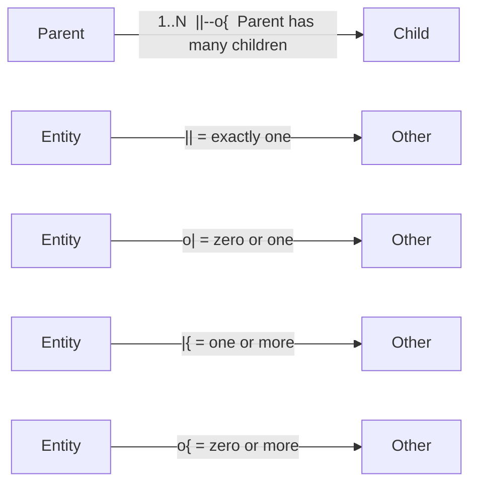

### 2.3 Conventions Applied

| Convention | Rule |
| --- | --- |
| Every entity has a surrogate `id` primary key. | Yes |
| Foreign keys are named `<child>_id` or per role. | Yes |
| Relationships are enforced by database foreign keys. | Yes |
| All relationships are RESTRICT on delete (no cascade deletes). | Yes |
| All relationships respect tenant isolation (same tenant). | Yes |
| No many-to-many junctions in v1 (avoided; see §5.3). | Yes |

---

## 3. Entity Index

| Entity | Description | Parent(s) | Children | Key |
| --- | --- | --- | --- | --- |
| `facility` | Facility/tenant root | — | facility_location, department, reference_value, hospital_config, setup_change_audit, staff_assignment (via context) | `id` |
| `facility_location` | Physical grouping | facility | department | `id` |
| `department` | Functional area | facility, facility_location | unit, staff_assignment | `id` |
| `unit` | Sub-area | department | room, staff_assignment | `id` |
| `room` | Rooms/beds | unit | — | `id` |
| `staff_assignment` | Staff ↔ unit/dept | unit (or dept), staff (external) | — | `id` |
| `reference_value` | Controlled vocab | facility (optional) | — | `id` |
| `hospital_config` | Operating params | facility | — | `id` |
| `setup_change_audit` | Change audit | facility | — | `id` |

---

## 4. Full ERD

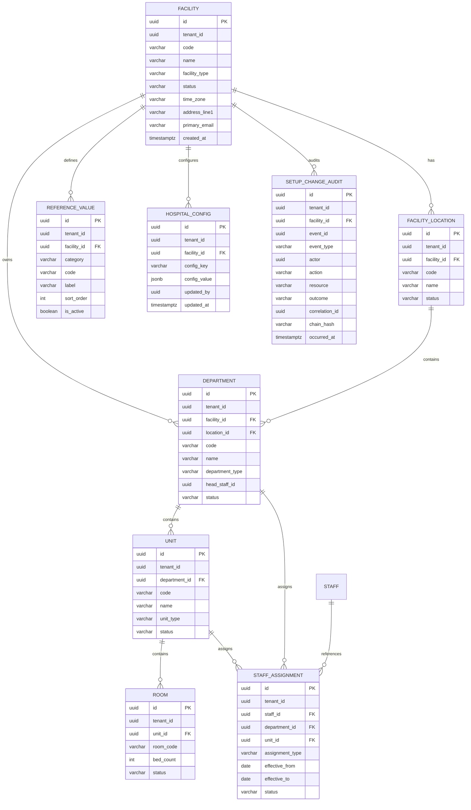

---

## 5. Relationship Catalog

### 5.1 Internal Relationships

| # | Relationship | Cardinality | FK | Description |
| --- | --- | --- | --- | --- |
| R-01 | `facility` → `facility_location` | 1:N | `facility_location.facility_id` | A facility has many locations; a location belongs to one facility. |
| R-02 | `facility` → `department` | 1:N | `department.facility_id` | A facility owns many departments. |
| R-03 | `facility_location` → `department` | 1:N | `department.location_id` | A location contains many departments. |
| R-04 | `department` → `unit` | 1:N | `unit.department_id` | A department contains many units. |
| R-05 | `unit` → `room` | 1:N | `room.unit_id` | A unit may have many rooms. |
| R-06 | `unit` → `staff_assignment` | 1:N | `staff_assignment.unit_id` | A unit has many staff assignments (optional target). |
| R-07 | `department` → `staff_assignment` | 1:N | `staff_assignment.department_id` | A department may have many assignments (optional target). |
| R-08 | `facility` → `reference_value` | 1:N | `reference_value.facility_id` | A facility defines many reference values (facility-scoped). |
| R-09 | `facility` → `hospital_config` | 1:N | `hospital_config.facility_id` | A facility has many configuration entries. |
| R-10 | `facility` → `setup_change_audit` | 1:N | `setup_change_audit.facility_id` | A facility accumulates many audit records. |

### 5.2 Cross-Module Relationships

| # | Relationship | Cardinality | FK | Description |
| --- | --- | --- | --- | --- |
| X-01 | `staff` (Registry) → `staff_assignment` | 1:N | `staff_assignment.staff_id` | A staff member has many assignments; an assignment references one staff member. |
| X-02 | `department.head_staff_id` → `staff` (Registry) | N:1 | `department.head_staff_id` | A department may name one staff member as head (role-played reference). |

### 5.3 Relationships Explicitly Avoided in v1

| Possible relationship | Why avoided |
| --- | --- |
| Many-to-many `staff` ↔ `unit` via junction | Modeled instead via `staff_assignment` association rows with type/dates; a junction would add no value. |
| `room` → `staff_assignment` (room-level assignment) | Room tracking is deferred (see [README](README.md) §12). |
| Direct `unit` ↔ `facility` | Redundant; unit resolves through department → facility. Denormalization avoided per [03-Database](03-Database.md) §6. |

---

## 6. Identifying vs Non-Identifying Relationships

All module relationships are **non-identifying**: every child has its own surrogate `id` primary key, and the parent key is carried only as a foreign key. This keeps keys stable and simplifies re-parenting and ORM mapping ([03-Database](03-Database.md) §8).

| Relationship | Identifying? | Reason |
| --- | --- | --- |
| facility → facility_location | No | Location has its own `id`. |
| facility_location → department | No | Department has its own `id`. |
| department → unit | No | Unit has its own `id`. |
| unit → room | No | Room has its own `id`. |
| unit/department → staff_assignment | No | Assignment has its own `id`. |
| facility → reference_value | No | Reference value has its own `id`. |
| facility → hospital_config | No | Config has its own `id`. |
| facility → setup_change_audit | No | Audit has its own `id`. |
| staff → staff_assignment | No | Assignment has its own `id`. |

### Identifying vs Non-Identifying

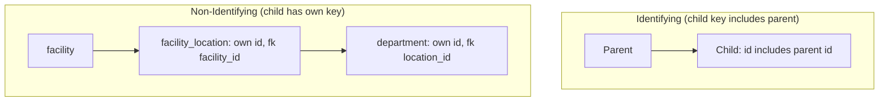

---

## 7. Cardinality & Optionality Matrix

The matrix states, for each relationship, the minimum and maximum occurrence on each side.

| Relationship | Parent side | Child side | Parent optional | Child optional |
| --- | --- | --- | --- | --- |
| facility → facility_location | 1 | 0..N | No (mandatory facility) | Yes (a facility may have zero locations in v1) |
| facility → department | 1 | 0..N | No | Yes |
| facility_location → department | 1 | 0..N | No | Yes |
| department → unit | 1 | 0..N | No | Yes |
| unit → room | 1 | 0..N | No | Yes (rooms optional) |
| unit → staff_assignment | 1 | 0..N | No | Yes (a unit may have no assignments) |
| department → staff_assignment | 1 | 0..N | No | Yes |
| facility → reference_value | 1 | 0..N | No | Yes |
| facility → hospital_config | 1 | 0..N | No | Yes |
| facility → setup_change_audit | 1 | 0..N | No | No (each audit references a facility) |
| staff → staff_assignment | 1 | 0..N | No (external) | Yes |

### Optionality Notes

| Rule | Detail |
| --- | --- |
| Mandatory parent | Every child row must reference a valid parent (FK NOT NULL). |
| Optional target | `staff_assignment` allows either `unit_id` or `department_id` (at least one), not necessarily both. |
| Optional head | `department.head_staff_id` is nullable (a department may have no named head). |
| Optional facility scope | `reference_value.facility_id` is nullable (enterprise-level value). |

---

## 8. ERD by Table Group

The model is best read by table group, mirroring [03-Database](03-Database.md) §7.

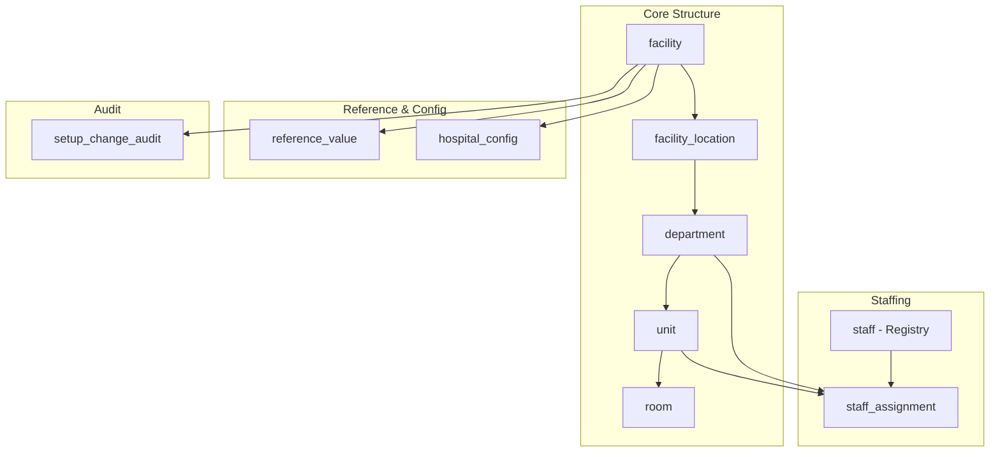

---

## 9. Core Structure ERD

The hierarchy `facility → location → department → unit → room` is the backbone.

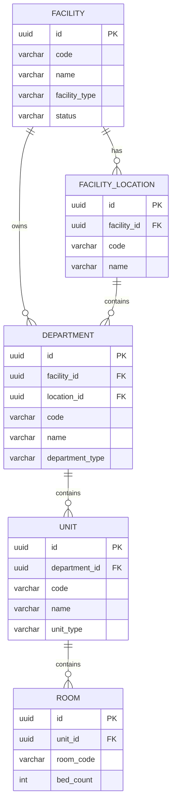

### Hierarchy Integrity Rules

| Rule | Detail |
| --- | --- |
| Single parent path | A child resolves to a single facility through its parent chain. |
| No cycles | Re-parenting cannot create a cycle ([01-Business-Requirements](01-Business-Requirements.md) §7, BR-104). |
| Tenant consistency | All nodes in a chain share the same `tenant_id`. |
| Deactivation guard | A node with active children cannot be deactivated. |

---

## 10. Staffing ERD

The `staff_assignment` entity is an **association** linking a staff member to a unit and/or department.

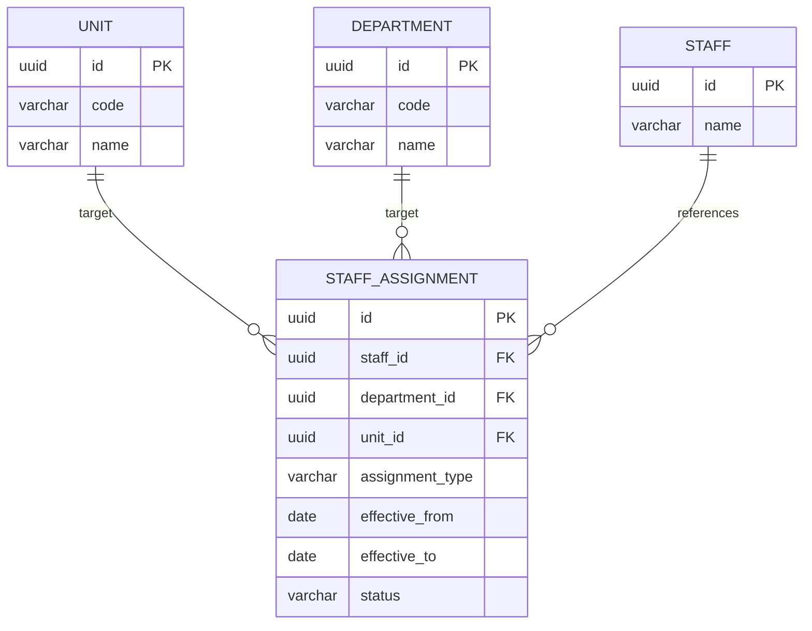

### Assignment Relationship Rules

| Rule | Detail |
| --- | --- |
| Target optionality | `department_id` and `unit_id` are individually optional, but at least one must be set. |
| Single primary | Exactly one active `primary` assignment per staff member. |
| Effective period | `effective_from <= effective_to`. |
| Scope | Assignments only within facilities the assigner is scoped to. |
| Cross-module | `staff_id` references the Registry staff master (not defined in this module). |

---

## 11. Reference & Configuration ERD

Reference values and configuration both hang off the facility.

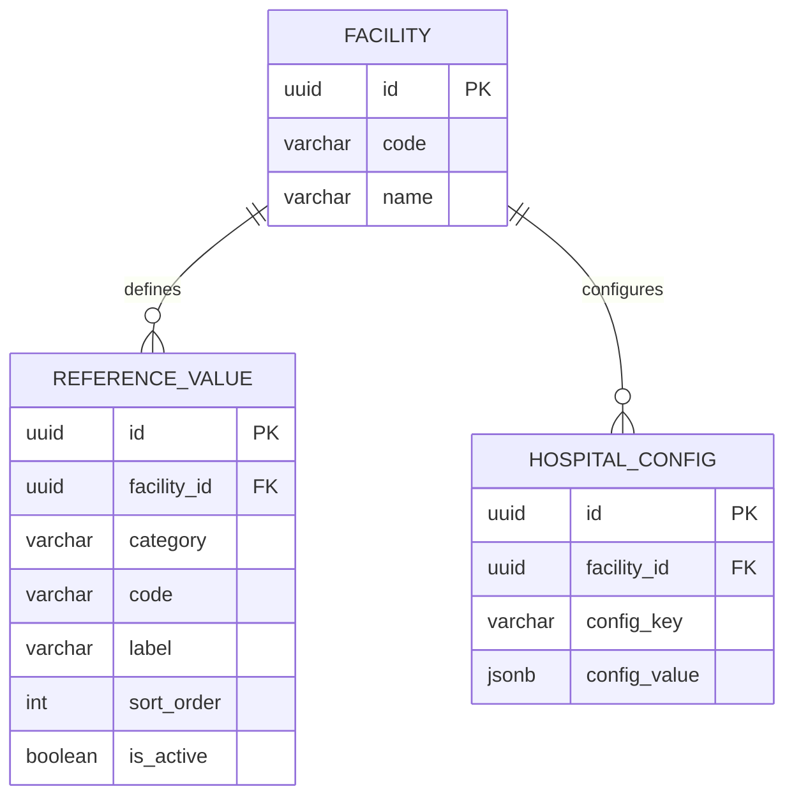

### Reference & Config Relationship Rules

| Entity | Rule |
| --- | --- |
| `reference_value` | Facility-scoped or enterprise-level (`facility_id` null). Unique per facility+category+code. |
| `hospital_config` | Facility-scoped. One value per facility+config_key. |

---

## 12. Audit ERD

The audit entity references the facility for scope but does not share its key.

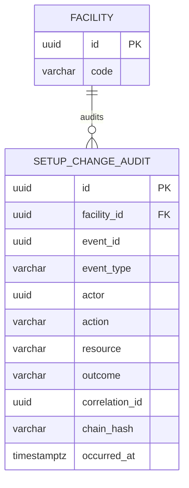

### Audit Relationship Rules

| Rule | Detail |
| --- | --- |
| Append-only | Audit records are never updated or deleted. |
| Facility-bound | Each audit record references a facility. |
| Correlation | `correlation_id` links a change to its audit records. |
| Integrity | `chain_hash` links each record to its predecessor. |

---

## 13. Cross-Module ERD

The module references the **staff registry** (external) and is consumed by IAM, scheduling, EHR, billing, and inventory.

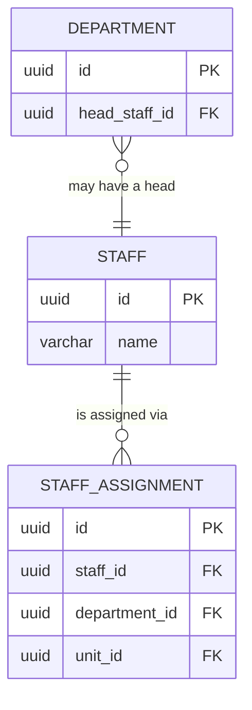

### Cross-Module Consumption

| Consuming module | Consumes | Nature |
| --- | --- | --- |
| IAM ([06-AUTHENTICATION](../../06-AUTHENTICATION.md)) | Assignments → access scope | Read |
| Scheduling | Hierarchy | Read |
| EHR / clinical | Hierarchy | Read |
| Billing / finance | Hierarchy | Read |
| Inventory / ops | Hierarchy | Read |
| Event bus | Structure-change events | Event |

> The staff master is defined in the Registry module, not this module; the relationship is a foreign-key reference only ([04-Database-Tables](04-Database-Tables.md) §9).

---

## 14. Relationship Integrity Rules

| # | Rule | Enforced by | Relationship |
| --- | --- | --- | --- |
| RI-01 | Every child references a valid parent. | Foreign key | All |
| RI-02 | Parent and child share the same tenant. | Tenant FKs + RLS | All |
| RI-03 | No cascade deletes on data-bearing parents. | RESTRICT | All |
| RI-04 | No hard delete of data-bearing children. | Soft delete + RESTRICT | All |
| RI-05 | Assignment targets at least one of dept/unit. | Check `chk_assignment_target` | R-06, R-07 |
| RI-06 | Exactly one active primary per staff. | Partial unique | R-06, R-07 |
| RI-07 | Reference value unique per facility+category+code. | Unique | R-08 |
| RI-08 | Config unique per facility+key. | Unique | R-09 |
| RI-09 | Audit is append-only and facility-bound. | App-only + FK | R-10 |

---

## 15. Key-based Relationships

### 15.1 Primary-to-Foreign Mapping

| Child table | FK column | References | Constraint |
| --- | --- | --- | --- |
| `facility_location` | `facility_id` | `facility.id` | `fk_facility_location_facility` |
| `department` | `facility_id` | `facility.id` | `fk_department_facility` |
| `department` | `location_id` | `facility_location.id` | `fk_department_location` |
| `unit` | `department_id` | `department.id` | `fk_unit_department` |
| `room` | `unit_id` | `unit.id` | `fk_room_unit` |
| `staff_assignment` | `staff_id` | `staff.id` (Registry) | `fk_staff_assignment_staff` |
| `staff_assignment` | `department_id` | `department.id` | `fk_staff_assignment_department` |
| `staff_assignment` | `unit_id` | `unit.id` | `fk_staff_assignment_unit` |
| `reference_value` | `facility_id` | `facility.id` | `fk_reference_value_facility` |
| `hospital_config` | `facility_id` | `facility.id` | `fk_hospital_config_facility` |
| `setup_change_audit` | `facility_id` | `facility.id` | `fk_setup_audit_facility` |

### 15.2 Key Path (Resolving a Unit to a Facility)

```
unit.id
  → department_id → department.id
      → location_id → facility_location.id
          → facility_id → facility.id
```

All resolution paths terminate at the facility (tenant root).

---

## 16. Role-Played Relationships

A role-played relationship reuses an entity in a specific role.

| Relationship | Entity | Role | FK |
| --- | --- | --- | --- |
| department → staff | `staff` | **Head** of department | `department.head_staff_id` |
| staff_assignment → staff | `staff` | **Assigned** staff member | `staff_assignment.staff_id` |

The `staff` entity participates in two distinct roles; the foreign keys are separate columns with separate meanings.

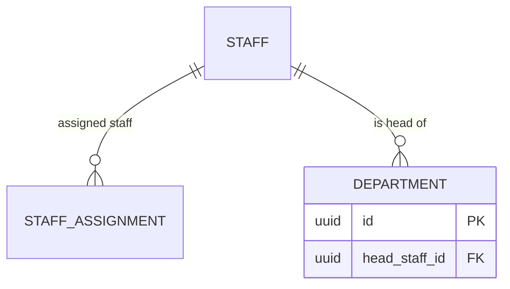

---

## 17. Recursive Relationships

The module **has no recursive (self-referencing) relationships** in its tables. Hierarchy depth is modeled by distinct entity types (location → department → unit), not by a self-referential parent pointer.

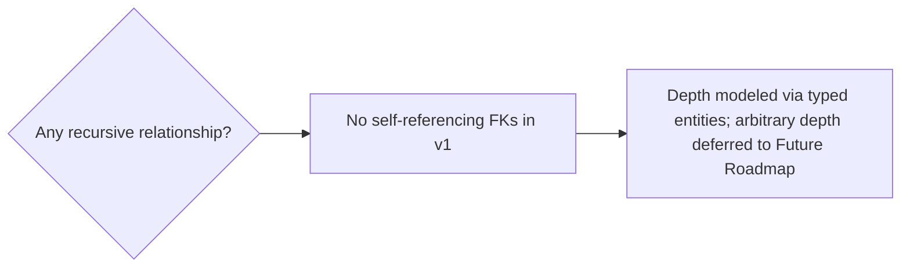

| Aspect | Decision |
| --- | --- |
| Recursive parent pointer | Not used in v1. |
| Arbitrary depth | Deferred (see [README](README.md) §12, Future Enhancements FE-01). |
| Cycle risk | Managed in service layer on any re-parent operation. |

---

## 18. Relationship to Constraints

Each relationship is backed by the constraint catalog in [04-Database-Tables](04-Database-Tables.md).

| Constraint type | Backs | Examples |
| --- | --- | --- |
| Primary key | Entity identity | `pk_facility`, `pk_unit` |
| Foreign key | Relationships | `fk_unit_department`, `fk_staff_assignment_staff` |
| Unique | Optionality/uniqueness on relationships | `uq_department_location_code`, `uq_assignment_single_primary` |
| Check | Value rules on relationship columns | `chk_assignment_target`, `chk_room_bed_count` |

---

## 19. Read-path Projections & Views

Read-heavy consumers may use projections/views over the canonical ERD; these are not additional entities in the source of truth.

| Projection / view | Basis | Purpose |
| --- | --- | --- |
| Facility tree view | facility + location + department + unit | Hierarchy navigation |
| Staff scope view | staff_assignment + staff | Access-scope derivation for IAM |
| Reference catalog view | reference_value | Controlled-vocabulary lookup |
| Audit listing view | setup_change_audit | Audit queries (paginated) |

> Projections are derived, never written to directly ([05-DATABASE-ARCHITECTURE](../../05-DATABASE-ARCHITECTURE.md) §3).

---

## 20. Relationship Maintenance

| Aspect | Decision |
| --- | --- |
| Re-parenting | Allowed with cycle + tenant checks; versioned. |
| Deactivation | Parent cannot be deactivated while active children exist. |
| Merges | Reassign children/assignments before deactivating the target. |
| Cascade | RESTRICT prevents orphaned children. |
| Migration | Relationship changes ship via versioned migrations. |
| Audit | Every relationship change is audited. |

---

## 21. Mermaid ER Legend

| Symbol | Meaning |
| --- | --- |
| `||--||` | One to exactly one |
| `||--o|` | One to zero-or-one |
| `||--|{` | One to one-or-more |
| `||--o{` | One to zero-or-more |
| `}o--||` | Zero-or-more to one |
| `}o--o{` | Zero-or-more to zero-or-more |

```mermaid
flowchart LR
    A[||--||  one to one] 
    B[||--o|  one to zero-or-one]
    C[||--|{  one to one-or-more]
    D[||--o{  one to zero-or-more]
```

---

## 22. Cross References

| Reference | Relationship | Direction |
| --- | --- | --- |
| [README](README.md) | Module overview; §6 relationships | Consumes |
| [01-Business-Requirements](01-Business-Requirements.md) | Requirements the model implements | Consumes |
| [02-Workflow](02-Workflow.md) | Operational flows the model supports | Consumes |
| [03-Database](03-Database.md) | Database architecture; ERD context | Consumes |
| [04-Database-Tables](04-Database-Tables.md) | Table/column/constraint definitions | Consumes |
| [00-MASTER-ROADMAP](../../00-MASTER-ROADMAP.md) | Phase sequencing, compliance | Consumes |
| [05-DATABASE-ARCHITECTURE](../../05-DATABASE-ARCHITECTURE.md) | Persistence, integrity, projections | Consumes |
| [06-AUTHENTICATION](../../06-AUTHENTICATION.md) | Access-scope derivation | Consumes |
| [07-ROLES-PERMISSIONS](../../07-ROLES-PERMISSIONS.md) | Roles, permissions | Consumes |
| [08-AUDIT-LOGGING](../../08-AUDIT-LOGGING.md) | Audit integrity | Consumes |
| [09-MULTI-TENANCY](../../09-MULTI-TENANCY.md) | Tenant isolation | Consumes |
| [10-HOSPITAL-HIERARCHY](../../10-HOSPITAL-HIERARCHY.md) | Organization hierarchy model | Consumes |
| [11-API-STANDARDS](../../11-API-STANDARDS.md) | API contracts | Consumes |
| [14-PERFORMANCE-STANDARDS](../../14-PERFORMANCE-STANDARDS.md) | Performance targets | Consumes |
| [16-DEPLOYMENT-STANDARDS](../../16-DEPLOYMENT-STANDARDS.md) | Migrations, deployment | Consumes |

---

*End of `docs/modules/hospital-setup/06-ERD.md`.*
