# Hospital Setup Module — Domain Model Specification

> **Document ID:** `hospital-setup/07-Domain-Model`
> **Owner:** Domain / Engineering Lead (hospital configuration)
> **Status:** 🔄 Pending approval (Phase 1 gate)
> **Version:** 1.0.0
> **Last updated:** 2026-08-06
> **Review cadence:** Re-reviewed at every phase gate and when the domain model changes.
>
> **Relationship:** This document specifies the **domain model** of the Hospital Setup module: the domain entities, value objects, aggregates, domain services, domain events, invariants, and the mapping from the domain to the persistence model. It is the conceptual companion to the relational model in [06-ERD](06-ERD.md), the table definitions in [04-Database-Tables](04-Database-Tables.md), and the database architecture in [03-Database](03-Database.md). It implements the requirements in [01-Business-Requirements](01-Business-Requirements.md).

---

## Table of Contents

1. [Purpose & Scope](#1-purpose--scope)
2. [Domain Model Principles](#2-domain-model-principles)
3. [Domain vs Persistence Model](#3-domain-vs-persistence-model)
4. [Aggregates & Boundaries](#4-aggregates--boundaries)
5. [Domain Entities](#5-domain-entities)
6. [Value Objects](#6-value-objects)
7. [Domain Services](#7-domain-services)
8. [Domain Events](#8-domain-events)
9. [Repositories](#9-repositories)
10. [Invariants](#10-invariants)
11. [Class Diagram](#11-class-diagram)
12. [Aggregate Diagrams](#12-aggregate-diagrams)
13. [Entity Lifecycle & State](#13-entity-lifecycle--state)
14. [Domain Rules & Policies](#14-domain-rules--policies)
15. [Transaction Scripts vs Rich Model](#15-transaction-scripts-vs-rich-model)
16. [Anti-Corruption Layer](#16-anti-corruption-layer)
17. [Mapping to Persistence](#17-mapping-to-persistence)
18. [Cross-Module Domain Contracts](#18-cross-module-domain-contracts)
19. [Consistency & Concurrency](#19-consistency--concurrency)
20. [Glossary](#20-glossary)
21. [Cross References](#21-cross-references)

---

## 1. Purpose & Scope

This document defines the **domain model** of the Hospital Setup module. A domain model captures the *conceptual structure and behavior* of the hospital-configuration problem space in domain language, independent of technical persistence choices.

**Scope:** domain entities, value objects, aggregates, services, events, invariants, and their mapping to the persistence model. **Out of scope:** the relational schema (see [06-ERD](06-ERD.md)), the physical tables (see [04-Database-Tables](04-Database-Tables.md)), and UI/API surfaces (later documents in this module series).

### 1.1 The Domain in One Sentence

The Hospital Setup module governs the **organizational and configuration backbone** of a hospital facility — where it is, how it is organized, who works where, and how the platform is configured to operate — as a single, tenant-scoped, audited source of truth.

---

## 2. Domain Model Principles

| # | Principle | Consequence |
| --- | --- | --- |
| DM-01 | **Ubiquitous language** | Terms from [10-HOSPITAL-HIERARCHY](../../10-HOSPITAL-HIERARCHY.md) (facility, location, department, unit) are used verbatim in code. |
| DM-02 | **Persistence ignorance** | Domain objects are independent of ORM and table shapes. |
| DM-03 | **Aggregates as consistency boundaries** | Transactions operate on one aggregate; cross-aggregate changes via domain events. |
| DM-04 | **Invariants inside the aggregate** | Rules such as "exactly one active primary" live with the owning aggregate. |
| DM-05 | **Events for side effects** | Cross-cutting effects (audit, notifications, propagation) are triggered by domain events. |
| DM-06 | **Tenancy-aware** | Every aggregate root carries tenant context; scoping is a first-class concern. |

---

## 3. Domain vs Persistence Model

The domain model and the persistence model (tables in [04-Database-Tables](04-Database-Tables.md)) correspond closely but are not identical.

| Aspect | Domain model | Persistence model |
| --- | --- | --- |
| Purpose | Expresses behavior and rules | Persists state |
| Naming | PascalCase (e.g., `Facility`) | snake_case (e.g., `facility`) |
| Identifiers | Surrogate identity object | `id` column |
| Relationships | Object references / IDs | Foreign keys |
| Enumerations | Typed enums | `varchar` + check constraint |
| Status | Typed status | `varchar` + check constraint |

### Mapping Table

| Domain type | Table |
| --- | --- |
| `Facility` (aggregate root) | `facility` |
| `FacilityLocation` | `facility_location` |
| `Department` | `department` |
| `Unit` | `unit` |
| `Room` | `room` |
| `StaffAssignment` | `staff_assignment` |
| `ReferenceValue` | `reference_value` |
| `HospitalConfiguration` | `hospital_config` |
| `SetupAuditEvent` | `setup_change_audit` |

---

## 4. Aggregates & Boundaries

An **aggregate** is a cluster of domain objects treated as a unit for data changes. Each aggregate has a **root** and a transaction boundary.

### 4.1 Aggregate Catalog

| Aggregate root | Members | Rationale |
| --- | --- | --- |
| **Facility** | Facility (root), FacilityLocation, Department, Unit, Room, ReferenceValue, HospitalConfiguration | The hierarchy and configuration form one consistency unit; invariants (unique codes, valid parents, no cycles) span the hierarchy. |
| **StaffAssignment** | StaffAssignment (root) | Assignment invariants (single primary, dates, target) are local to the assignment. |
| **SetupAuditLog** | SetupAuditEvent (root) | Append-only log; independent write path. |

### 4.2 Boundary Decision Table

| Change | Aggregate | Cross-aggregate effect |
| --- | --- | --- |
| Add a department | Facility | None (within Facility aggregate) |
| Deactivate a unit | Facility | Emits event → StaffAssignment/IAM refresh |
| Create an assignment | StaffAssignment | Emits event → IAM scope refresh |
| Update configuration | Facility | Emits event → consumers |

---

## 5. Domain Entities

Entities have identity and a lifecycle. All derive from a base `Entity` with an identity and audit metadata.

### 5.1 Facility (Aggregate Root)

| Attribute | Type | Notes |
| --- | --- | --- |
| `id` | `FacilityId` | Identity |
| `tenantId` | `TenantId` | Tenancy key |
| `code` | `FacilityCode` (value) | Unique per tenant |
| `name` | `string` | Display name |
| `type` | `FacilityType` (enum) | general/specialty/clinic/other |
| `status` | `FacilityStatus` (enum) | draft/active/inactive/retired |
| `timeZone` | `TimeZoneValue` (value) | IANA name |
| `address` | `Address` (value) | Contact/address object |
| `primaryContact` | `ContactInfo` (value) | Phone/email |

**Behavior:** `activate()`, `deactivate(reason)`, `retire()`, `changeTimeZone()`, `updateProfile()`.

### 5.2 FacilityLocation

| Attribute | Type | Notes |
| --- | --- | --- |
| `id` | `FacilityLocationId` | Identity |
| `facilityId` | `FacilityId` | Parent |
| `code` | `LocationCode` (value) | Unique per facility |
| `name` | `string` | Display name |
| `address` | `string?` | Optional |
| `status` | `LocationStatus` (enum) | active/inactive |

### 5.3 Department

| Attribute | Type | Notes |
| --- | --- | --- |
| `id` | `DepartmentId` | Identity |
| `facilityId` | `FacilityId` | Owning facility |
| `locationId` | `FacilityLocationId` | Parent location |
| `code` | `DepartmentCode` (value) | Unique per location |
| `name` | `string` | Display name |
| `type` | `DepartmentType` (enum) | clinical/administrative |
| `headStaffId` | `StaffId?` | Optional head (role-played) |

### 5.4 Unit

| Attribute | Type | Notes |
| --- | --- | --- |
| `id` | `UnitId` | Identity |
| `departmentId` | `DepartmentId` | Parent |
| `code` | `UnitCode` (value) | Unique per department |
| `name` | `string` | Display name |
| `type` | `UnitType` (enum) | ward/icu/lab/pharmacy/service/general |
| `status` | `UnitStatus` (enum) | active/inactive |

### 5.5 Room

| Attribute | Type | Notes |
| --- | --- | --- |
| `id` | `RoomId` | Identity |
| `unitId` | `UnitId` | Parent |
| `code` | `RoomCode` (value) | Unique per unit |
| `bedCount` | `PositiveInt` (value) | > 0 |
| `status` | `RoomStatus` (enum) | active/inactive |

### 5.6 StaffAssignment (Aggregate Root)

| Attribute | Type | Notes |
| --- | --- | --- |
| `id` | `StaffAssignmentId` | Identity |
| `staffId` | `StaffId` | Registry reference |
| `departmentId` | `DepartmentId?` | Optional target |
| `unitId` | `UnitId?` | Optional target |
| `type` | `AssignmentType` (enum) | primary/secondary |
| `effectiveFrom` | `DateValue` (value) | Start |
| `effectiveTo` | `DateValue?` (value) | End (null = open) |
| `status` | `AssignmentStatus` (enum) | active/inactive |

**Behavior:** `assignPrimary()`, `assignSecondary()`, `revoke()`, `reactivate()`.

### 5.7 ReferenceValue

| Attribute | Type | Notes |
| --- | --- | --- |
| `id` | `ReferenceValueId` | Identity |
| `facilityId` | `FacilityId?` | Null = enterprise |
| `category` | `ReferenceCategory` (value) | specialty/service_type/shift_template |
| `code` | `ReferenceCode` (value) | Unique per category+facility |
| `label` | `string` | Display label |
| `sortOrder` | `NonNegativeInt` (value) | Ordering |
| `isActive` | `bool` | Activation flag |

### 5.8 HospitalConfiguration

| Attribute | Type | Notes |
| --- | --- | --- |
| `id` | `ConfigurationId` | Identity |
| `facilityId` | `FacilityId` | Owning facility |
| `key` | `ConfigurationKey` (value) | Validated key |
| `value` | `ConfigurationValue` (value) | Typed value |
| `updatedBy` | `ActorId` | Last actor |

### 5.9 SetupAuditEvent (Aggregate Root)

| Attribute | Type | Notes |
| --- | --- | --- |
| `id` | `AuditEventId` | Identity |
| `facilityId` | `FacilityId` | Scope |
| `eventType` | `AuditEventType` (value) | Taxonomy |
| `actor` | `ActorId` | Attribution |
| `action` | `AuditAction` (enum) | create/update/deactivate/... |
| `resource` | `string` | Type + id |
| `outcome` | `AuditOutcome` (enum) | success/failure/denied |
| `correlationId` | `CorrelationId` | Traceability |
| `chainHash` | `string` | Integrity |
| `occurredAt` | `DateTimeValue` | Timing |

---

## 6. Value Objects

Value objects are immutable, compared by value, and have no identity.

### 6.1 Value Object Catalog

| Value object | Type of value | Holds | Rules |
| --- | --- | --- | --- |
| `FacilityCode` | code | short identifier | ≤ 20 alnum; required |
| `LocationCode` | code | short identifier | ≤ 20 alnum |
| `DepartmentCode` | code | short identifier | ≤ 20 alnum |
| `UnitCode` | code | short identifier | ≤ 20 alnum |
| `RoomCode` | code | short identifier | ≤ 20 alnum |
| `ReferenceCode` | code | vocabulary code | ≤ 40 |
| `ReferenceCategory` | code | category | one of known categories |
| `ConfigurationKey` | code | config key | validated against schema |
| `ConfigurationValue` | typed | config value | typed JSONB |
| `Address` | object | address fields | optional components |
| `ContactInfo` | object | phone/email | email format |
| `TimeZoneValue` | code | IANA name | valid IANA |
| `DateValue` | date | effective date | valid |
| `PositiveInt` | number | bed count | > 0 |
| `NonNegativeInt` | number | sort order | ≥ 0 |
| `TenantId` | identity | tenant | required |
| `CorrelationId` | identity | trace | required |
| `ActorId` | identity | actor | required |
| `DateTimeValue` | timestamp | time | UTC |

### 6.2 Value Object Equality

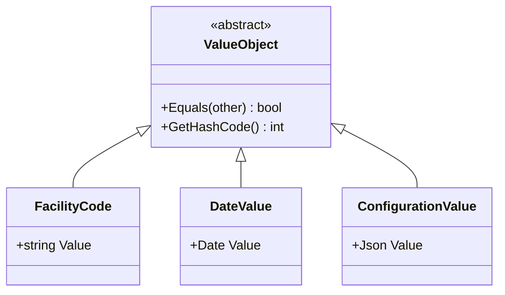

---

## 7. Domain Services

Domain services encapsulate behavior that does not naturally belong to a single entity.

| Service | Responsibility | Notable rules |
| --- | --- | --- |
| `HierarchyService` | Validate and re-parent hierarchy nodes | Cycle detection, valid parent, tenant consistency |
| `AssignmentService` | Create/revoke staff assignments | Single primary, date validity, target rule |
| `ReferenceCatalogService` | Manage controlled vocabularies | Category+code uniqueness |
| `ConfigurationService` | Manage operating parameters | Key schema validation |
| `TenantScopeService` | Enforce facility scoping | Cross-facility grants |

### Domain Service Interaction

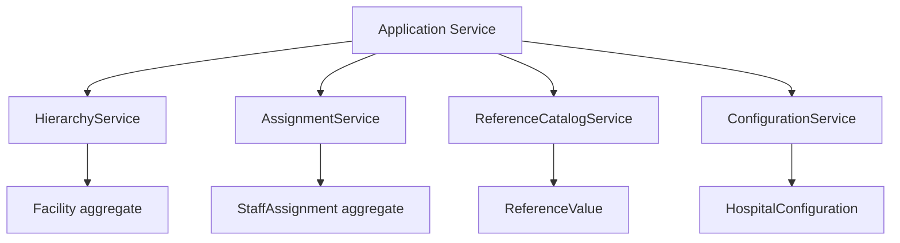

---

## 8. Domain Events

Domain events capture facts that have happened, for cross-cutting side effects (audit, notifications, propagation).

| Event | Raised by | Carries | Side effects |
| --- | --- | --- | --- |
| `FacilityProvisioned` | Facility | facilityId | Notification |
| `FacilityActivated` | Facility | facilityId | Event propagation |
| `HierarchyNodeAdded` | Facility | nodeType, nodeId | Audit |
| `HierarchyNodeDeactivated` | Facility | nodeId, reason | Audit, consumers |
| `StaffAssigned` | StaffAssignment | staffId, unitId, type | IAM scope refresh |
| `StaffAssignmentRevoked` | StaffAssignment | staffId | IAM scope refresh |
| `ConfigurationChanged` | HospitalConfiguration | key, value | Audit, consumers |
| `SetupChangeAudited` | AuditLog | event | Audit integrity |

### Event Flow

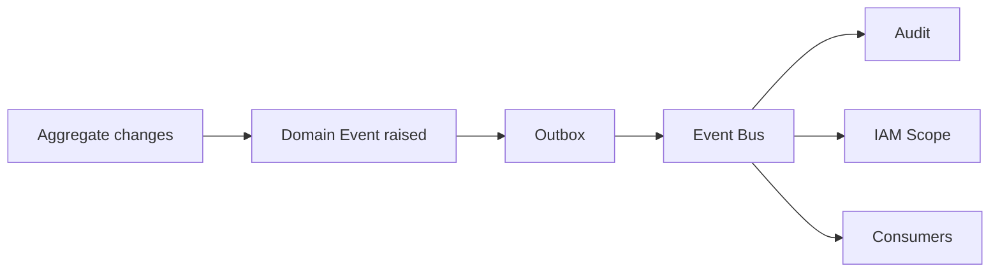

---

## 9. Repositories

Repositories abstract persistence of aggregates ([03-TECHNOLOGY-STACK](../../03-TECHNOLOGY-STACK.md), [04-Database-Tables](04-Database-Tables.md)).

| Repository | Aggregate | Key operations |
| --- | --- | --- |
| `FacilityRepository` | Facility | find, save, byCode, active |
| `StaffAssignmentRepository` | StaffAssignment | find, save, activePrimaryFor, forUnit |
| `SetupAuditLogRepository` | SetupAuditLog | append, queryByFacility |

### Repository Interface (Conceptual)

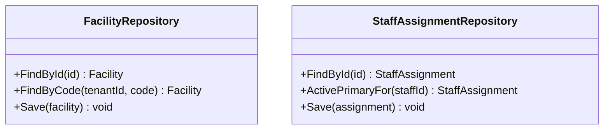

> Persistence follows the interface → application → domain → infrastructure layering in [02-SYSTEM-ARCHITECTURE](../../02-SYSTEM-ARCHITECTURE.md) §7.

---

## 10. Invariants

Invariants are rules that must always hold; they are enforced at the aggregate boundary and backed by the database ([06-ERD](06-ERD.md) §14).

| Invariant | Enforced by | Reference |
| --- | --- | --- |
| Facility code unique per tenant | Facility aggregate + unique constraint | BR-002 |
| Node has a valid parent; no cycles | HierarchyService | BR-011, BR-012 |
| No deactivation with active children | Facility aggregate | BR-017 |
| No hard delete of data-bearing nodes | Facility aggregate + RESTRICT | BR-014 |
| Exactly one active primary per staff | StaffAssignment aggregate + partial unique | BR-022 |
| Assignment dates valid (start ≤ end) | StaffAssignment aggregate + check | BR-023 |
| Assignment targets at least one of dept/unit | StaffAssignment aggregate + check | BR-024 |
| Reference category+code unique per facility | ReferenceCatalogService + unique | BR-029 |
| Config keys validated | ConfigurationService | BR-031 |

---

## 11. Class Diagram

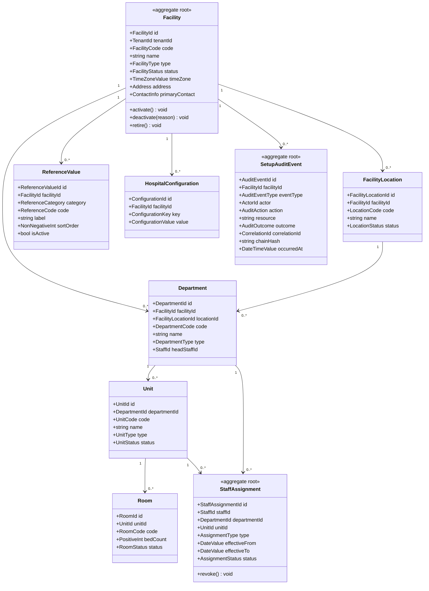

---

## 12. Aggregate Diagrams

### 12.1 Facility Aggregate

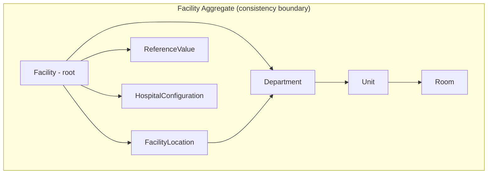

### 12.2 StaffAssignment Aggregate

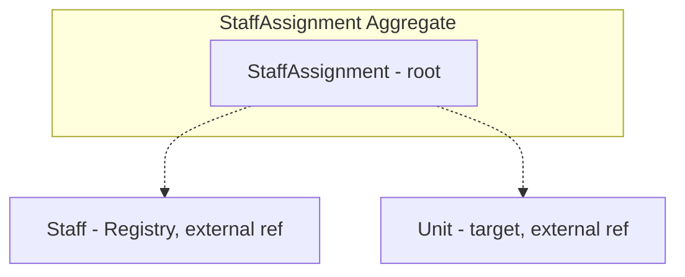

### 12.3 SetupAuditLog Aggregate

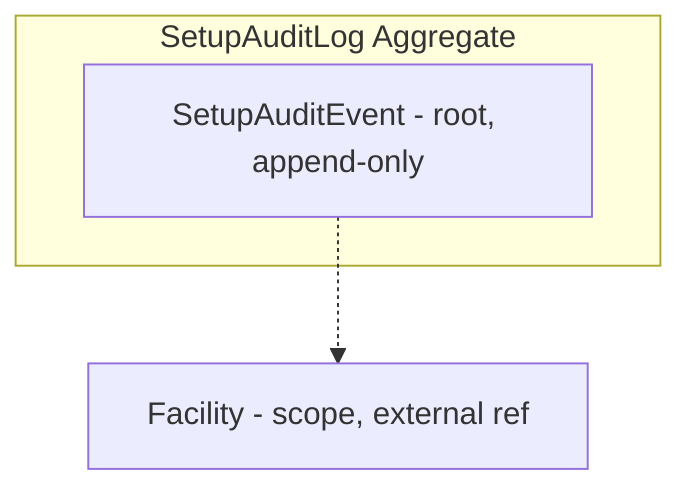

---

## 13. Entity Lifecycle & State

### 13.1 Facility State

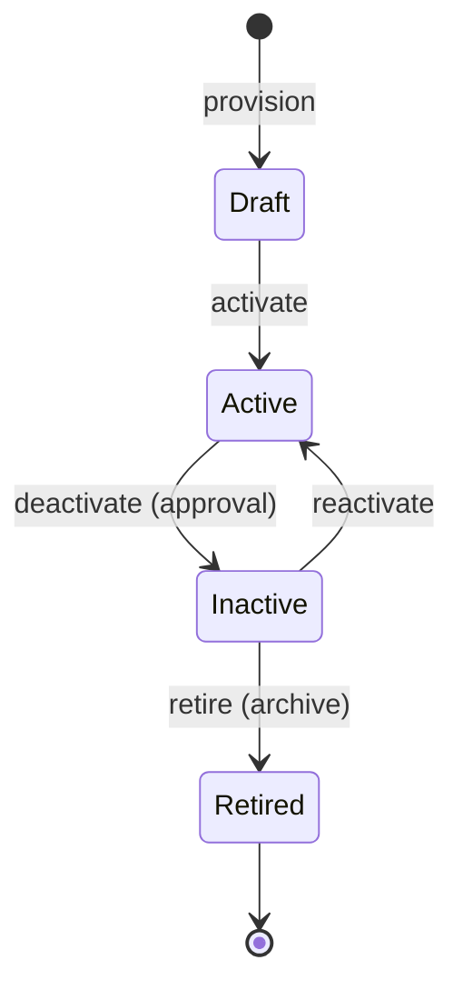

### 13.2 Assignment State

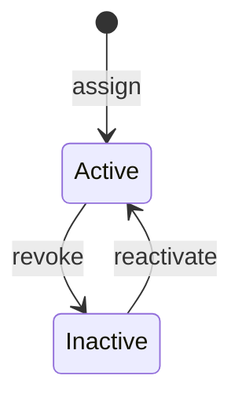

### 13.3 Node State

| State | Meaning | Transitions |
| --- | --- | --- |
| Draft | Created, unpublished | active, inactive |
| Active | Published | inactive, draft |
| Inactive | Deactivated | active, retired |
| Retired | Archived | — |

State transitions align with [02-Workflow](02-Workflow.md) §8.

---

## 14. Domain Rules & Policies

Policies are business rules applied by domain logic, sourced from [01-Business-Requirements](01-Business-Requirements.md) §7.

| Policy | Applied by | Rule |
| --- | --- | --- |
| Deactivation guard | Facility aggregate | Block if active children/references |
| Single primary | StaffAssignment aggregate | One active primary per staff |
| Scope constraint | TenantScopeService | Assign only within authorized facility |
| Approval requirement | Application workflow | Elevated changes require approval ([02-Workflow](02-Workflow.md) §9) |
| Audit requirement | Domain event handlers | Every change audited ([08-AUDIT-LOGGING](../../08-AUDIT-LOGGING.md)) |

---

## 15. Transaction Scripts vs Rich Model

| Approach | Applied to | Rationale |
| --- | --- | --- |
| **Rich domain model** | Facility hierarchy, StaffAssignment | Complex invariants and lifecycle justify behavior in the model. |
| **Transaction scripts** | Reference value management, simple config reads | Simple, data-centric operations; no rich behavior. |

This hybrid follows the modular-monolith architecture in [02-SYSTEM-ARCHITECTURE](../../02-SYSTEM-ARCHITECTURE.md) §4: rich where domain complexity demands, thin where it does not.

---

## 16. Anti-Corruption Layer

The module isolates itself from the (external) staff registry and consuming modules via an anti-corruption layer, so domain language is not polluted by external models.

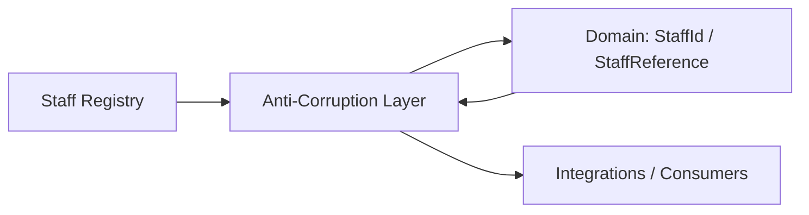

| Concern | Handling |
| --- | --- |
| Staff identity | Mapped to a `StaffId` value; no external attributes leak. |
| Consuming modules | Expose domain events, not internal entities. |
| External systems | Integration via the platform integration layer ([02-SYSTEM-ARCHITECTURE](../../02-SYSTEM-ARCHITECTURE.md) §11). |

---

## 17. Mapping to Persistence

| Domain type | Table | Mapping notes |
| --- | --- | --- |
| `Facility` | `facility` | Direct; enum → varchar + check |
| `FacilityLocation` | `facility_location` | Direct |
| `Department` | `department` | headStaffId → `head_staff_id` FK |
| `Unit` | `unit` | Direct |
| `Room` | `room` | bedCount → `bed_count` |
| `StaffAssignment` | `staff_assignment` | type → `assignment_type` |
| `ReferenceValue` | `reference_value` | isActive → `is_active` |
| `HospitalConfiguration` | `hospital_config` | value → `config_value` JSONB |
| `SetupAuditEvent` | `setup_change_audit` | chainHash → `chain_hash` |

Mapping preserves the invariants in §10 via the constraints in [04-Database-Tables](04-Database-Tables.md).

---

## 18. Cross-Module Domain Contracts

| Contract | Provider | Consumer | Content |
| --- | --- | --- | --- |
| Staff identity | Registry | This module | `StaffId`, minimal staff reference |
| Hierarchy reference | This module | Scheduling, EHR, Billing, Inventory | Facility/Location/Department/Unit IDs |
| Assignment scope | This module | IAM | Staff → scoped units/depts |
| Structure events | This module | Event bus → consumers | Hierarchy-change events |

These contracts are implemented via the domain events in §8 and the relationships in [06-ERD](06-ERD.md) §13.

---

## 19. Consistency & Concurrency

| Aspect | Approach |
| --- | --- |
| Aggregate transaction | One aggregate per transaction ([05-DATABASE-ARCHITECTURE](../../05-DATABASE-ARCHITECTURE.md) §6). |
| Optimistic concurrency | Version/updated_at check on long-lived edits. |
| Outbox | Domain events persisted with the aggregate write; published reliably. |
| Idempotency | Event handlers and API writes idempotent ([11-API-STANDARDS](../../11-API-STANDARDS.md) §8). |
| Cross-aggregate | Event-driven, never direct writes across aggregates. |

---

## 20. Glossary

| Term | Definition |
| --- | --- |
| **Aggregate** | A cluster of domain objects treated as a unit for changes. |
| **Aggregate root** | The entity that owns an aggregate's consistency boundary. |
| **Value object** | An immutable object compared by value, with no identity. |
| **Domain event** | A fact that happened, used for side effects. |
| **Domain service** | Behavior that spans entities. |
| **Invariant** | A rule that must always hold. |
| **Anti-corruption layer** | Isolation from external domain models. |
| **Ubiquitous language** | A shared domain vocabulary used in code and docs. |

---

## 21. Cross References

| Reference | Relationship | Direction |
| --- | --- | --- |
| [README](README.md) | Module overview; §6 relationships | Consumes |
| [01-Business-Requirements](01-Business-Requirements.md) | Requirements and rules the domain implements | Consumes |
| [02-Workflow](02-Workflow.md) | States and flows the domain supports | Consumes |
| [03-Database](03-Database.md) | Database architecture | Consumes |
| [04-Database-Tables](04-Database-Tables.md) | Table/column definitions mapped in §17 | Consumes |
| [06-ERD](06-ERD.md) | Relationships and integrity | Consumes |
| [00-MASTER-ROADMAP](../../00-MASTER-ROADMAP.md) | Phase sequencing | Consumes |
| [02-SYSTEM-ARCHITECTURE](../../02-SYSTEM-ARCHITECTURE.md) | Layering, modular monolith | Consumes |
| [03-TECHNOLOGY-STACK](../../03-TECHNOLOGY-STACK.md) | Language/technology | Consumes |
| [05-DATABASE-ARCHITECTURE](../../05-DATABASE-ARCHITECTURE.md) | Transactions, outbox | Consumes |
| [06-AUTHENTICATION](../../06-AUTHENTICATION.md) | Access-scope contracts | Consumes |
| [07-ROLES-PERMISSIONS](../../07-ROLES-PERMISSIONS.md) | Roles, permissions | Consumes |
| [08-AUDIT-LOGGING](../../08-AUDIT-LOGGING.md) | Audit events | Consumes |
| [09-MULTI-TENANCY](../../09-MULTI-TENANCY.md) | Tenant model | Consumes |
| [10-HOSPITAL-HIERARCHY](../../10-HOSPITAL-HIERARCHY.md) | Ubiquitous language source | Consumes |
| [11-API-STANDARDS](../../11-API-STANDARDS.md) | API contracts | Consumes |

---

*End of `docs/modules/hospital-setup/07-Domain-Model.md`.*
