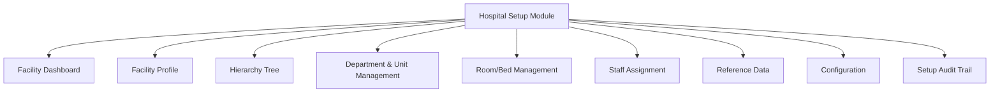
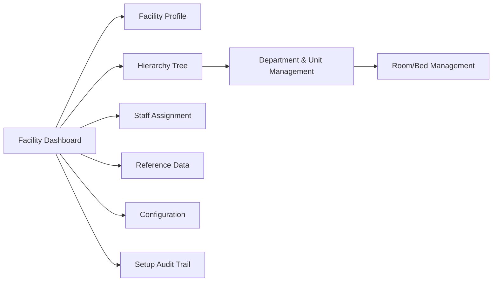
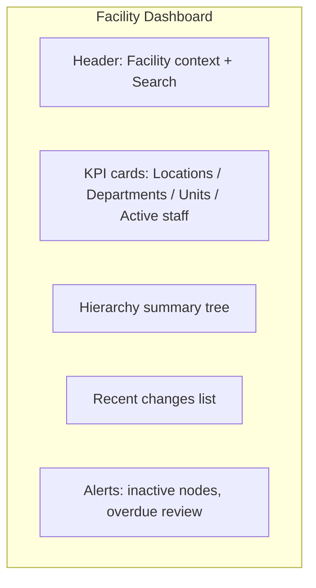
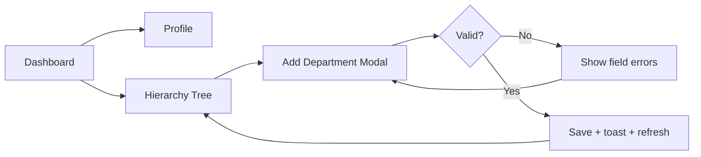
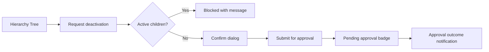
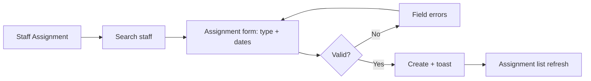

# Hospital Setup Module — UI Specification

> **Document ID:** `hospital-setup/08-UI`
> **Owner:** Frontend / UX Lead (hospital configuration)
> **Status:** 🔄 Pending approval (Phase 1 gate)
> **Version:** 1.0.0
> **Last updated:** 2026-08-06
> **Review cadence:** Re-reviewed at every phase gate and when the module changes.
>
> **Relationship:** This document specifies the **user interface** of the Hospital Setup module: the screens, layouts, components, navigation, interactions, and states that facility administrators and system administrators use to configure the hospital. It implements the design system in [13-DESIGN-SYSTEM](../../13-DESIGN-SYSTEM.md), the UX guidelines in [12-UI-UX-GUIDELINES](../../12-UI-UX-GUIDELINES.md), and the requirements in [01-Business-Requirements](01-Business-Requirements.md).

---

## Table of Contents

1. [Purpose & Scope](#1-purpose--scope)
2. [UI Design Principles](#2-ui-design-principles)
3. [User Roles in UI](#3-user-roles-in-ui)
4. [Information Architecture](#4-information-architecture)
5. [Navigation Map](#5-navigation-map)
6. [Screen Catalog](#6-screen-catalog)
7. [Screen Specifications](#7-screen-specifications)
8. [Component Usage](#8-component-usage)
9. [Form & Interaction Patterns](#9-form--interaction-patterns)
10. [Validation in UI](#10-validation-in-ui)
11. [States & Feedback](#11-states--feedback)
12. [Error Handling in UI](#12-error-handling-in-ui)
13. [Accessibility](#13-accessibility)
14. [Responsive & Multi-Surface](#14-responsive--multi-surface)
15. [Empty, Loading & Error States](#15-empty-loading--error-states)
16. [UI Decision Tables](#16-ui-decision-tables)
17. [Screen Flow Diagrams](#17-screen-flow-diagrams)
18. [Localization](#18-localization)
19. [Performance & Load in UI](#19-performance--load-in-ui)
20. [Cross References](#20-cross-references)

---

## 1. Purpose & Scope

This document specifies the **user interface** of the Hospital Setup module. It describes what a facility or system administrator sees and does when provisioning and maintaining the hospital organization and configuration.

**Scope:** web portal screens for the Hospital Setup module, their layouts, components, navigation, states, and interactions. **Out of scope:** mobile-specific UI (covered separately), API behavior (later document), and the visual design system itself ([13-DESIGN-SYSTEM](../../13-DESIGN-SYSTEM.md)).

### 1.1 Surface

| Surface | Users | Availability |
| --- | --- | --- |
| Web portal (admin/clinical shell) | System admin, Facility admin, Facility admin (view), Auditor | Primary |
| Mobile | Staff read-only of assignments (deferred) | Later |

---

## 2. UI Design Principles

| # | Principle | Application |
| --- | --- | --- |
| UI-01 | **Clarity over density** | Hierarchy and config shown legibly; avoid overwhelming the operator. |
| UI-02 | **Consistent patterns** | Reuse design-system components; no bespoke widgets. |
| UI-03 | **Safe by default** | Destructive actions (deactivation) require confirmation; elevated actions routed for approval. |
| UI-04 | **Actionable feedback** | Every action yields clear success/error/blocking feedback. |
| UI-05 | **Accessible** | WCAG 2.1 AA ([12-UI-UX-GUIDELINES](../../12-UI-UX-GUIDELINES.md) §4). |
| UI-06 | **Permission-aware** | UI reflects the user's permissions; write actions hidden/disabled when not authorized. |
| UI-07 | **Auditable** | Users can trace change history from the UI. |

---

## 3. User Roles in UI

The UI tailors itself to the roles defined in [README](README.md) §3 and [07-ROLES-PERMISSIONS](../../07-ROLES-PERMISSIONS.md).

| Role | UI capabilities | Write actions enabled |
| --- | --- | --- |
| **System administrator** | Full structure + config + approvals + audit | Yes (global) |
| **Facility administrator** | Structure + config for own facility | Yes (facility scope) |
| **Facility admin (view)** | Read-only structure/assignments | No |
| **Auditor** | Audit trail read-only | No |

### Role × Screen Matrix

| Screen | Sys admin | Facility admin | Facility admin (view) | Auditor |
| --- | :---: | :---: | :---: | :---: |
| Facility Dashboard | ✓ | ✓ | ✓ | read |
| Facility Profile | edit | edit | read | read |
| Hierarchy Tree | edit | edit (own) | read | read |
| Department & Unit Mgmt | edit | edit (own) | read | read |
| Room/Bed Mgmt | edit | edit (own) | read | read |
| Staff Assignment | edit | edit (own) | read | read |
| Reference Data | edit | edit (own) | read | read |
| Configuration | edit | edit (own) | read | read |
| Setup Audit Trail | ✓ | · | · | ✓ |

---

## 4. Information Architecture

---

## 5. Navigation Map

---

## 6. Screen Catalog

| # | Screen | Purpose | Primary role | Write |
| --- | --- | --- | --- | --- |
| S-01 | Facility Dashboard | Overview of structure health and recent changes | All | No |
| S-02 | Facility Profile | View/edit facility identity and contact | Facility admin | Yes |
| S-03 | Hierarchy Tree | Visualize/manage org structure | Facility admin | Yes |
| S-04 | Department & Unit Management | CRUD for departments and units | Facility admin | Yes |
| S-05 | Room/Bed Management | Optional room/bed tracking | Facility admin | Yes |
| S-06 | Staff Assignment | Assign staff to departments/units | Facility admin | Yes |
| S-07 | Reference Data | Manage setup reference values | Facility admin | Yes |
| S-08 | Configuration | Facility/system parameters | Facility admin | Yes |
| S-09 | Setup Audit Trail | Review setup changes | Auditor / Sys admin | No |

---

## 7. Screen Specifications

### 7.1 S-01 Facility Dashboard

| Aspect | Detail |
| --- | --- |
| Purpose | Overview of structure health and recent changes |
| Layout | Header (facility context + search) + KPI cards + hierarchy summary + recent changes |
| Components | Stat cards, hierarchy tree (read), change list, alert banner |
| Interactions | Navigate to any sub-screen; view recent changes; filter by period |
| States | Loading, loaded, empty (no facility), error |

### 7.2 S-02 Facility Profile

| Aspect | Detail |
| --- | --- |
| Purpose | View/edit facility identity, contact, time zone, status |
| Layout | Form sections: Identity, Type & Status, Time Zone, Address, Contact |
| Components | Text fields, select, date, status badge, Save/Cancel, audit link |
| Interactions | Edit and save; validate on save; view change history |
| States | View (read), Edit, Saving, Saved, Error |

### 7.3 S-03 Hierarchy Tree

| Aspect | Detail |
| --- | --- |
| Purpose | Visualize and manage the org structure |
| Layout | Collapsible tree (facility → location → dept → unit → room) + action panel |
| Components | Tree, context menu (Add/Edit/Deactivate), search, Publish button |
| Interactions | Expand/collapse; add node; edit node; re-parent; deactivate; publish |
| States | Loading, loaded, editing, publishing, empty |

### 7.4 S-04 Department & Unit Management

| Aspect | Detail |
| --- | --- |
| Purpose | CRUD for departments and units |
| Layout | List + filter bar + detail form (drawer/modal) |
| Components | Table, filters (facility, type, status), form, status badge |
| Interactions | Create/edit/deactivate; inline validation |
| States | Loading, list, form, saving, error |

### 7.5 S-05 Room/Bed Management

| Aspect | Detail |
| --- | --- |
| Purpose | Optional room/bed tracking |
| Layout | Grid of rooms per unit + add form |
| Components | Room cards, bed count, status, add/edit |
| Interactions | Add/edit/ deactivate rooms |
| States | Loading, loaded, empty, saving |

### 7.6 S-06 Staff Assignment

| Aspect | Detail |
| --- | --- |
| Purpose | Assign staff to departments/units |
| Layout | Staff search + assignment list + assignment form |
| Components | Staff search, assignment table (type, dates, status), form |
| Interactions | Search staff; assign primary/secondary; revoke (approval); view effective dates |
| States | Loading, search, list, form, saving, error |

### 7.7 S-07 Reference Data

| Aspect | Detail |
| --- | --- |
| Purpose | Manage setup reference values |
| Layout | Category tabs + value list + add/edit form |
| Components | Tabs (specialty, service type, shift template), table, form, active toggle |
| Interactions | Add/edit/deactivate values; reorder |
| States | Loading, list, form, saving |

### 7.8 S-08 Configuration

| Aspect | Detail |
| --- | --- |
| Purpose | Facility/system parameters |
| Layout | Key-value settings grouped by category |
| Components | Config list, typed editors (text, toggle, JSON), Save, audit link |
| Interactions | Edit and save; validate keys; view change history |
| States | Loading, edit, saving, error |

### 7.9 S-09 Setup Audit Trail

| Aspect | Detail |
| --- | --- |
| Purpose | Review setup changes |
| Layout | Filterable audit table + detail drawer |
| Components | Table, filters (actor, action, entity, time), pagination, detail |
| Interactions | Filter; paginate; open detail (correlation, prior/new values) |
| States | Loading, loaded, empty, error |

---

## 8. Component Usage

Components come from the design system ([13-DESIGN-SYSTEM](../../13-DESIGN-SYSTEM.md) §4).

| Screen | Primary components |
| --- | --- |
| Dashboard | Stat card, banner, list |
| Profile | Form field, select, button, status badge |
| Hierarchy Tree | Tree, context menu, tooltip, modal |
| Dept/Unit | Table, filter, drawer, form |
| Room/Bed | Card grid, form |
| Staff Assignment | Search, table, form, toggle |
| Reference Data | Tabs, table, toggle, form |
| Configuration | Config list, toggle, JSON editor |
| Audit | Table, filter, pagination, drawer |

---

## 9. Form & Interaction Patterns

| Pattern | Behavior |
| --- | --- |
| **Add** | Opens modal/drawer; inline validation; on success toast + list refresh. |
| **Edit** | Opens prefilled form; save validates; cancel discards. |
| **Deactivate** | Confirmation dialog; elevated actions route to approval; blocked with message if children exist. |
| **Re-parent** | Confirmation; shows effect on history; publishes. |
| **Assign staff** | Search-then-assign; validates single-primary and dates. |
| **Publish** | Confirmation; on success activates and notifies. |
| **Save config** | Validates keys; field-level errors; success confirmation. |

### Interaction Confirmation Matrix

| Action | Confirm? | Approval required? | Undoable? |
| --- | :---: | :---: | :---: |
| Add node | No | No | Yes (edit) |
| Edit node | No | No | Yes |
| Deactivate node | Yes | Yes | Via reactivate |
| Re-parent node | Yes | Yes | Via corrective |
| Assign staff | No | No | Via revoke |
| Revoke staff | Yes | Yes | Via reactivate |
| Change config | No | Global: yes | Yes (revert) |

---

## 10. Validation in UI

Validation mirrors [01-Business-Requirements](01-Business-Requirements.md) §8; the UI surfaces errors before submit where feasible.

| Field | UI validation | On submit (server) |
| --- | --- | --- |
| Facility code | Required, ≤ 20, alphanumeric | Unique per tenant |
| Facility name | Required, ≤ 120 | — |
| Department/unit code | Required, ≤ 20 | Unique within parent |
| Department type | Required (clinical/admin) | — |
| Room bed count | Required, > 0 | Check |
| Assignment type | Primary/secondary | Single-primary rule |
| Assignment dates | start ≤ end | Check |
| Config key | Known key | Schema validation |
| Reference category+code | Required | Unique per facility |

---

## 11. States & Feedback

| State | Behavior |
| --- | --- |
| **Loading** | Skeleton per component. |
| **Empty** | Friendly empty state with a primary call-to-action. |
| **Success** | Toast confirmation; list refresh. |
| **Error** | Inline error with actionable message; no data loss. |
| **Blocked** | Deactivation blocked → message listing active children. |
| **Pending approval** | Status badge "Pending approval" on elevated changes. |
| **Saving** | Disabled controls + progress. |

---

## 12. Error Handling in UI

Errors map to API outcomes ([11-API-STANDARDS](../../11-API-STANDARDS.md) §6).

| Error | UI behavior |
| --- | --- |
| 400 validation | Field-level inline errors. |
| 401 unauthenticated | Redirect to login. |
| 403 forbidden | Disable/hide action; show message. |
| 404 not found | Show "not found" state. |
| 409 conflict | Show conflict message (e.g., duplicate primary); suggest resolution. |
| 422 unprocessable | List blocking children/reason. |
| 429 rate limited | Advise retry after backoff. |
| 5xx | Show retryable error; preserve input. |

---

## 13. Accessibility

| Requirement | Application |
| --- | --- |
| WCAG 2.1 AA | All screens meet AA ([12-UI-UX-GUIDELINES](../../12-UI-UX-GUIDELINES.md) §4). |
| Keyboard operable | All actions reachable by keyboard; focus managed. |
| ARIA | Correct roles/labels on tree, tabs, dialogs. |
| Screen reader | Descriptive labels, status announcements. |
| Color contrast | Token-compliant contrast ([13-DESIGN-SYSTEM](../../13-DESIGN-SYSTEM.md) §7). |
| Focus order | Logical focus order; no traps. |

---

## 14. Responsive & Multi-Surface

| Surface | Behavior |
| --- | --- |
| Desktop | Full layouts; tree side-by-side with action panel. |
| Tablet | Stacked panels; tree full-width; drawers. |
| Mobile | Collapsed tree; modals full-screen; read-mostly. |
| Mobile app (later) | Read-only assignment view (deferred). |

---

## 15. Empty, Loading & Error States

| Screen | Empty state | Loading state | Error state |
| --- | --- | --- | --- |
| Dashboard | "No facility configured" + CTA | Skeleton cards | Retry |
| Hierarchy Tree | "Add your first location" | Tree skeleton | Retry |
| Dept/Unit | "Add a department" | Table skeleton | Retry |
| Room/Bed | "Add a room" | Grid skeleton | Retry |
| Staff Assignment | "Assign your first staff member" | Skeleton | Retry |
| Reference Data | "Add a value" | Tabs skeleton | Retry |
| Configuration | "Add configuration" | Skeleton | Retry |
| Audit | "No changes found" | Table skeleton | Retry |

---

## 16. UI Decision Tables

### 16.1 Visibility of Actions by Role

| Action | Sys admin | Facility admin | View | Auditor |
| --- | :---: | :---: | :---: | :---: |
| Edit facility | ✓ | ✓ (own) | hidden | hidden |
| Add node | ✓ | ✓ (own) | hidden | hidden |
| Deactivate node | ✓ | ✓ (propose) | hidden | hidden |
| Assign staff | ✓ | ✓ (own) | hidden | hidden |
| Manage reference | ✓ | ✓ (own) | hidden | hidden |
| Manage config | ✓ | ✓ (own) | hidden | hidden |
| View audit | ✓ | hidden | hidden | ✓ |

### 16.2 Deactivation UI Path

| Condition | UI behavior |
| --- | --- |
| Node has active children | Block with message listing children |
| Node has no active children | Confirm dialog → submit for approval |
| Approval pending | Badge "Pending approval" |
| Approved | Execute + toast + refresh |
| Rejected | Notification; no change |

---

## 17. Screen Flow Diagrams

### 17.1 Facility Configuration Flow

### 17.2 Deactivation Flow

### 17.3 Staff Assignment Flow

---

## 18. Localization

| Aspect | Decision |
| --- | --- |
| Language | English first; multi-locale support planned ([README](README.md) §12) |
| Labels | Resource-keyed; no hard-coded strings |
| Locale | Facility-level locale for display |
| Right-to-left | Considered in design tokens ([13-DESIGN-SYSTEM](../../13-DESIGN-SYSTEM.md) §6) |
| Dates/numbers | Locale-aware formatting ([12-UI-UX-GUIDELINES](../../12-UI-UX-GUIDELINES.md) §8) |

---

## 19. Performance & Load in UI

| Aspect | Target |
| --- | --- |
| LCP | < 2.5 s ([14-PERFORMANCE-STANDARDS](../../14-PERFORMANCE-STANDARDS.md) §6) |
| INP | < 200 ms |
| CLS | < 0.1 |
| Lazy-loading | Tree and audit screens lazy-loaded |
| Pagination | All lists paginated; no unbounded renders |
| Code splitting | Route-level code splitting |

---

## 20. Cross References

| Reference | Relationship | Direction |
| --- | --- | --- |
| [README](README.md) | Module overview; §7 UI screens | Consumes |
| [01-Business-Requirements](01-Business-Requirements.md) | Requirements the UI implements | Consumes |
| [02-Workflow](02-Workflow.md) | Flows the UI supports | Consumes |
| [03-Database](03-Database.md) | Data model | Consumes |
| [04-Database-Tables](04-Database-Tables.md) | Data definitions | Consumes |
| [06-ERD](06-ERD.md) | Relationships | Consumes |
| [07-Domain-Model](07-Domain-Model.md) | Domain concepts surfaced in UI | Consumes |
| [09-UX](09-UX.md) | UX guidelines | Consumes |
| [00-MASTER-ROADMAP](../../00-MASTER-ROADMAP.md) | Phase sequencing | Consumes |
| [07-ROLES-PERMISSIONS](../../07-ROLES-PERMISSIONS.md) | Roles/permissions | Consumes |
| [11-API-STANDARDS](../../11-API-STANDARDS.md) | Error mapping | Consumes |
| [12-UI-UX-GUIDELINES](../../12-UI-UX-GUIDELINES.md) | UX and accessibility | Consumes |
| [13-DESIGN-SYSTEM](../../13-DESIGN-SYSTEM.md) | Components and tokens | Consumes |
| [14-PERFORMANCE-STANDARDS](../../14-PERFORMANCE-STANDARDS.md) | Performance targets | Consumes |

---

*End of `docs/modules/hospital-setup/08-UI.md`.*
