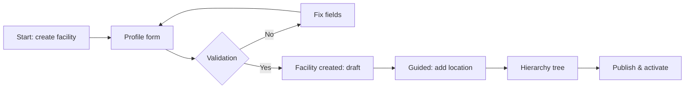
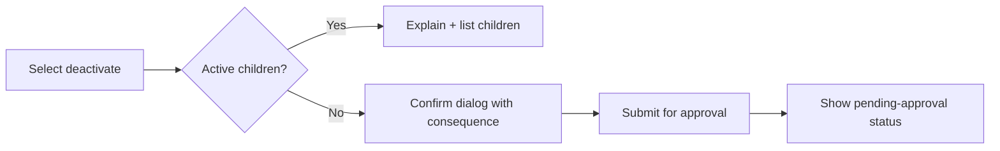
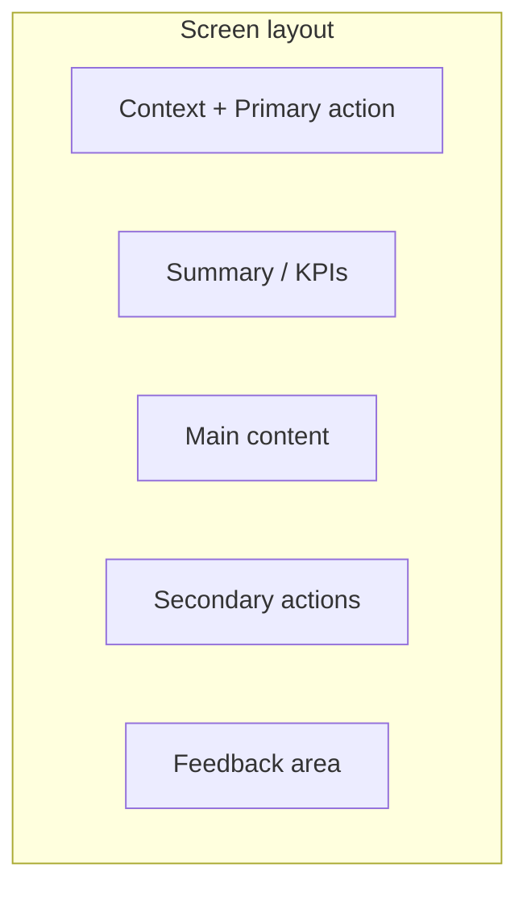
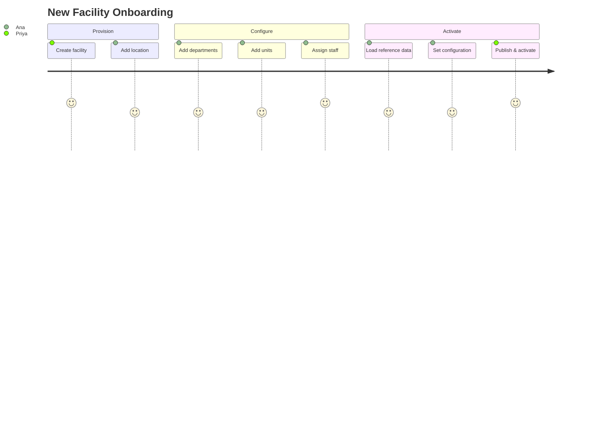
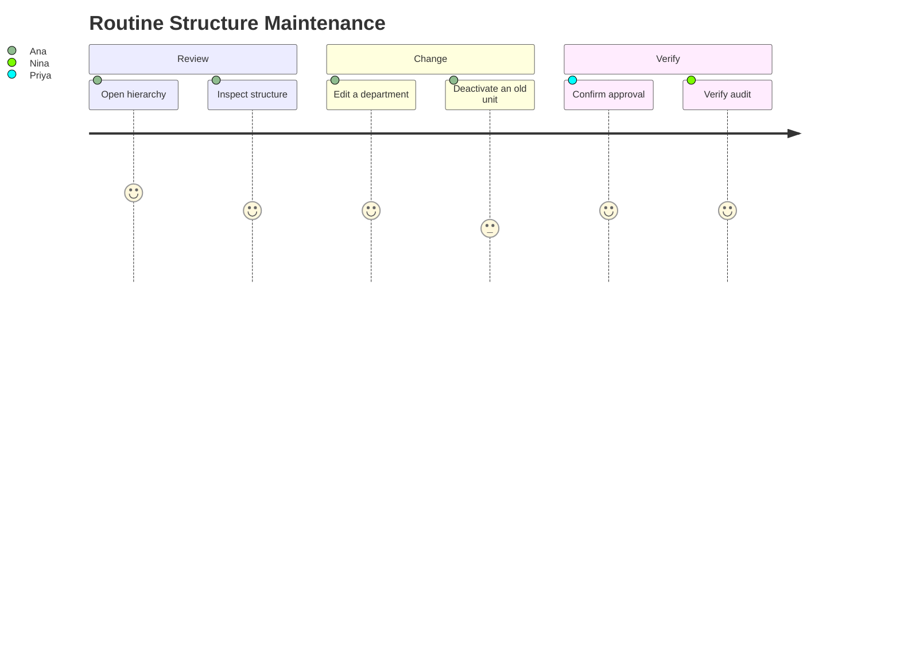

# Hospital Setup Module — UX Specification

> **Document ID:** `hospital-setup/09-UX`
> **Owner:** UX / Product Lead (hospital configuration)
> **Status:** 🔄 Pending approval (Phase 1 gate)
> **Version:** 1.0.0
> **Last updated:** 2026-08-06
> **Review cadence:** Re-reviewed at every phase gate and when the module changes.
>
> **Relationship:** This document specifies the **user experience** of the Hospital Setup module: the interaction model, task flows, information presentation, feedback, accessibility, and usability standards that guide how facility and system administrators configure the hospital. It is the UX companion to the UI specification in [08-UI](08-UI.md), follows [12-UI-UX-GUIDELINES](../../12-UI-UX-GUIDELINES.md), and implements the requirements in [01-Business-Requirements](01-Business-Requirements.md).

---

## Table of Contents

1. [Purpose & Scope](#1-purpose--scope)
2. [UX Principles](#2-ux-principles)
3. [Personas](#3-personas)
4. [User Goals & Tasks](#4-user-goals--tasks)
5. [Task Flows](#5-task-flows)
6. [Information Presentation](#6-information-presentation)
7. [Navigation & Wayfinding](#7-navigation--wayfinding)
8. [Interaction Model](#8-interaction-model)
9. [Feedback & Confirmation](#9-feedback--confirmation)
10. [Error Messaging](#10-error-messaging)
11. [Empty & Loading States](#11-empty--loading-states)
12. [Accessibility & Inclusive Design](#12-accessibility--inclusive-design)
13. [Usability Metrics](#13-usability-metrics)
14. [UX Decision Tables](#14-ux-decision-tables)
15. [Journey Maps](#15-journey-maps)
16. [Microcopy](#16-microcopy)
17. [Heuristic Evaluation](#17-heuristic-evaluation)
18. [User Testing](#18-user-testing)
19. [Cross References](#19-cross-references)

---

## 1. Purpose & Scope

This document specifies the **user experience** of the Hospital Setup module — *how* the UI in [08-UI](08-UI.md) feels and behaves for its users, beyond the visual layout.

**Scope:** interaction model, task flows, information presentation, feedback, accessibility, and usability for the web portal. **Out of scope:** visual components/tokens (see [13-DESIGN-SYSTEM](../../13-DESIGN-SYSTEM.md)) and mobile UX (later).

### 1.1 Experience Intent

The Hospital Setup module must feel **confident and safe**. Administrators are configuring the backbone of a hospital; mistakes have downstream clinical and operational consequences. The experience prioritizes clarity, predictability, and protection against accidental destructive changes — while remaining fast enough for routine configuration.

---

## 2. UX Principles

| # | Principle | Application |
| --- | --- | --- |
| UX-01 | **Confidence over speed** | Destructive and elevated actions are deliberate, not frictionless. |
| UX-02 | **Predictable outcomes** | Users can anticipate the effect of every action. |
| UX-03 | **Progressive disclosure** | Advanced actions revealed on demand; default view is simple. |
| UX-04 | **Recovery always possible** | Every change has a path back (edit, reactivate, revert). |
| UX-05 | **Invisible complexity** | Hierarchy relationships handled by the system, not the operator. |
| UX-06 | **Respect expertise** | Frequent operators get keyboard + batch affordances. |
| UX-07 | **Consistency** | Matches platform patterns ([12-UI-UX-GUIDELINES](../../12-UI-UX-GUIDELINES.md)). |

---

## 3. Personas

Personas derive from [01-Business-Requirements](01-Business-Requirements.md) §4 and [README](README.md) §3.

| Persona | Role | Experience | Key needs | Frustrations |
| --- | --- | --- | --- | --- |
| **Priya, System Admin** | System administrator | Expert, technical | Global structure, approvals, config | Mis-scoping; audit gaps |
| **Ana, Facility Admin** | Facility administrator | Domain, moderate tech | Structure CRUD, staff assignment | Accidental deactivation |
| **Marcus, View Admin** | Facility admin (view) | Varies | Read structure for planning | Accidental edits |
| **Nina, Auditor** | Auditor | Compliance expert | Full audit trail | Gaps in record |

### Persona Need Matrix

| Need | Priya | Ana | Marcus | Nina |
| --- | :---: | :---: | :---: | :---: |
| Global view | ✓ | · | · | ✓ |
| Facility-scoped edit | ✓ | ✓ | · | · |
| Read-only structure | ✓ | ✓ | ✓ | ✓ |
| Approval workflow | ✓ | propose | · | · |
| Audit trail | ✓ | · | · | ✓ |

---

## 4. User Goals & Tasks

### 4.1 Goals

| Goal | Persona(s) |
| --- | --- |
| Provision a new facility | Priya |
| Configure the organization hierarchy | Priya, Ana |
| Assign staff scope | Ana |
| Manage reference data | Ana |
| Manage configuration | Priya, Ana |
| Verify compliance via audit | Nina |

### 4.2 Core Tasks

| Task | Goal | Frequency | Complexity |
| --- | --- | --- | --- |
| Create facility | Provision | Low | Medium |
| Add location/department/unit | Configure | Medium | Medium |
| Deactivate a node | Maintain | Medium | Medium |
| Assign/revoke staff | Configure | Medium | Low |
| Edit reference value | Configure | Low | Low |
| Change config key | Configure | Low | Medium |
| Review audit | Compliance | Recurring | Low |

---

## 5. Task Flows

### 5.1 Provision a Facility (UX Flow)



**UX intent:** after creating a facility, the system guides the administrator to the next logical step (adding a location), rather than leaving them lost.

### 5.2 Deactivate a Node (UX Flow)



**UX intent:** the user always knows *what will happen* and *that approval is pending*, so they are never surprised.

### 5.3 Assign Staff (UX Flow)

```mermaid
flowchart LR
    NAV[Open Staff Assignment] --> SEARCH[Search staff]
    SEARCH --> PICK[Select staff]
    PICK --> FORM[Type + effective dates]
    FORM --> VAL2{Valid?}
    VAL2 -- No --> ERR2[Explain (e.g., primary exists)]
    VAL2 -- Yes --> DONE[Assigned; scope updated]
```

---

## 6. Information Presentation

| Aspect | Guidance |
| --- | --- |
| Hierarchy | Tree with clear depth cues; breadcrumbs for context. |
| Status | Consistent status badges (draft/active/inactive/retired). |
| KPIs | Dashboard stat cards (locations, departments, units, active staff). |
| Tables | Sortable, filterable, paginated; density appropriate to task. |
| Relationships | Shown implicitly (tree), not as raw IDs. |
| History | "View changes" links surface audit trail contextually. |

### Presentation Hierarchy



---

## 7. Navigation & Wayfinding

| Aspect | Guidance |
| --- | --- |
| Primary nav | Module grouped under the platform shell nav. |
| Breadcrumbs | Shown on detail screens (Facility > Location > Department). |
| Deep links | Direct links to a node from lists/notifications. |
| Search | Global and within-hierarchy search. |
| Back behavior | Predictable back; no lost state. |
| Tabs | Reference data and audit use tabs/filters. |

---

## 8. Interaction Model

| Interaction | Model |
| --- | --- |
| Direct manipulation | Tree add/edit/re-parent via context menus and drag. |
| Forms | Validate inline; submit once; no silent failures. |
| Confirmation | Only for destructive/irreversible actions. |
| Approval | Elevated changes show status and routing; not blocking the operator flow. |
| Keyboard | Full keyboard operability; shortcuts for frequent tasks. |
| Batch | Bulk import/export for large reference/staff loads (later). |

---

## 9. Feedback & Confirmation

| Event | Feedback |
| --- | --- |
| Save success | Toast confirmation + list refresh. |
| Save failure | Inline error; input preserved. |
| Deactivate blocked | Explanatory message listing children. |
| Submitted for approval | "Pending approval" badge + notification. |
| Approved/Rejected | Notification with outcome. |
| Scope change | Confirmation that access was updated. |
| Configuration change | Confirmation + affected-consumer note. |

### Confirmation Decision

| Action | Confirm dialog | Explains consequence |
| --- | :---: | :---: |
| Add node | No | n/a |
| Edit node | No | n/a |
| Deactivate node | Yes | Yes |
| Re-parent node | Yes | Yes |
| Revoke staff | Yes | Yes |
| Change global config | Yes | Yes |

---

## 10. Error Messaging

| Guidance | Detail |
| --- | --- |
| Plain language | No jargon; say what happened and what to do. |
| Location | Inline near the field/action; summary for page-level. |
| Actionable | Provide the next step (fix field, contact admin, retry). |
| No blame | Neutral tone; never "you caused". |
| Preservation | Never discard user input on error. |
| Consistency | Same error patterns across screens ([11-API-STANDARDS](../../11-API-STANDARDS.md) §6). |

---

## 11. Empty & Loading States

| State | Guidance |
| --- | --- |
| Empty | Friendly message + primary call-to-action (e.g., "Add your first location"). |
| Loading | Skeletons; no layout shift. |
| Partial | Indicate filtering/limits; never silently truncate. |
| Error | Retry affordance; no data loss. |

---

## 12. Accessibility & Inclusive Design

Aligns with [08-UI](08-UI.md) §13 and [12-UI-UX-GUIDELINES](../../12-UI-UX-GUIDELINES.md) §4.

| Requirement | Application |
| --- | --- |
| WCAG 2.1 AA | Mandatory across screens. |
| Keyboard | Full operation; visible focus. |
| Screen reader | Semantic structure; ARIA on tree/tabs/dialogs. |
| Color | Token-based; not color-only for status. |
| Motion | Reduced-motion support. |
| Language | Clear, plain language for all copy. |
| Forms | Accessible labels, errors linked to fields. |

---

## 13. Usability Metrics

| Metric | Target |
| --- | --- |
| Task success | ≥ 95% for core tasks |
| Time-on-task | Measured and benchmarked |
| Errors per task | Low; measure in testing |
| SUS score | ≥ 70 |
| Deactivation misclicks | 0 (guarded) |
| Accessibility audit | No AA failures |

---

## 14. UX Decision Tables

### 14.1 Default Action Visibility

| Role | Create facility | Edit facility | Deactivate | Assign staff | View audit |
| --- | :---: | :---: | :---: | :---: | :---: |
| System admin | ✓ | ✓ | ✓ | ✓ | ✓ |
| Facility admin | · | ✓ (own) | propose | ✓ (own) | · |
| Facility admin (view) | · | · | · | · | · |
| Auditor | · | · | · | · | ✓ |

### 14.2 Feedback Tone by Severity

| Severity | Tone | Example |
| --- | --- | --- |
| Info | Neutral | "Location added." |
| Success | Affirming | "Staff assigned; access updated." |
| Warning | Caution | "This unit has active children and cannot be deactivated." |
| Error | Actionable | "Code is already in use in this facility." |
| Blocked | Clarifying | "Approval required; submitted for review." |

---

## 15. Journey Maps

### 15.1 New-Facility Onboarding Journey



### 15.2 Routine Maintenance Journey



---

## 16. Microcopy

| Element | Recommended copy | Tone |
| --- | --- | --- |
| Empty structure | "Add your first location to begin structuring your facility." | Helpful |
| Deactivate confirm | "Deactivating this unit will stop new assignments. History is preserved." | Clear |
| Pending approval | "This change is pending approval." | Neutral |
| Blocked deactivate | "This unit has active children. Deactivate them first." | Actionable |
| Save success | "Changes saved." | Affirming |
| Config revert | "Previous value is retained for rollback." | Reassuring |

---

## 17. Heuristic Evaluation

The design is evaluated against Nielsen heuristics:

| Heuristic | How met |
| --- | --- |
| Visibility of status | Status badges + pending-approval states. |
| Match to real world | Uses hospital terminology ([10-HOSPITAL-HIERARCHY](../../10-HOSPITAL-HIERARCHY.md)). |
| User control & freedom | Edit/reactivate/revert affordances. |
| Consistency | Design-system components ([13-DESIGN-SYSTEM](../../13-DESIGN-SYSTEM.md)). |
| Error prevention | Confirmations + deactivation guards. |
| Recognition over recall | Hierarchies shown, not typed IDs. |
| Flexibility | Keyboard + batch for experts. |
| Aesthetic & minimal | Progressive disclosure. |
| Help & recovery | Actionable error copy; audit trail. |

---

## 18. User Testing

| Activity | Frequency | Participants |
| --- | --- | --- |
| Moderated usability tests | Per milestone | Priya/Ana persona proxies |
| Accessibility audit | At gates | Automated + manual |
| A/B on confirmations | As needed | N/A |
| Task success measurement | Per release | Representative operators |
| Feedback loop | Continuous | Facility admins |

Findings feed the [23-Changelog](23-Changelog.md) and [24-Future-Roadmap](24-Future-Roadmap.md).

---

## 19. Cross References

| Reference | Relationship | Direction |
| --- | --- | --- |
| [README](README.md) | Module overview | Consumes |
| [01-Business-Requirements](01-Business-Requirements.md) | Requirements and personas | Consumes |
| [02-Workflow](02-Workflow.md) | Flows the UX supports | Consumes |
| [08-UI](08-UI.md) | UI screens this UX governs | Consumes |
| [00-MASTER-ROADMAP](../../00-MASTER-ROADMAP.md) | Phase sequencing | Consumes |
| [07-ROLES-PERMISSIONS](../../07-ROLES-PERMISSIONS.md) | Roles/permissions | Consumes |
| [10-HOSPITAL-HIERARCHY](../../10-HOSPITAL-HIERARCHY.md) | Domain terminology | Consumes |
| [11-API-STANDARDS](../../11-API-STANDARDS.md) | Error patterns | Consumes |
| [12-UI-UX-GUIDELINES](../../12-UI-UX-GUIDELINES.md) | UX and accessibility standards | Consumes |
| [13-DESIGN-SYSTEM](../../13-DESIGN-SYSTEM.md) | Components and tokens | Consumes |
| [14-PERFORMANCE-STANDARDS](../../14-PERFORMANCE-STANDARDS.md) | Performance in UX | Consumes |
| [15-TESTING-STANDARDS](../../15-TESTING-STANDARDS.md) | Usability testing | Consumes |

---

*End of `docs/modules/hospital-setup/09-UX.md`.*
