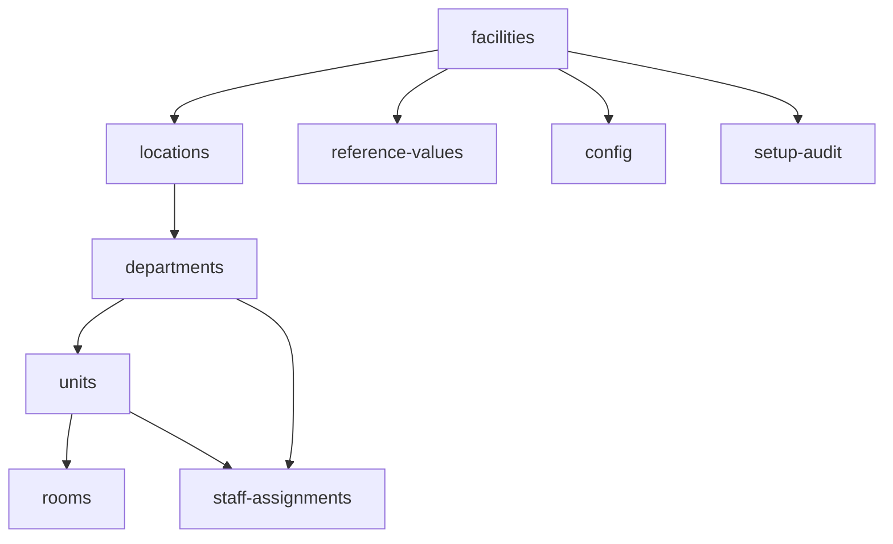

# Hospital Setup Module — API Specification

> **Document ID:** `hospital-setup/10-API`
> **Owner:** Engineering Lead (hospital configuration)
> **Status:** 🔄 Pending approval (Phase 1 gate)
> **Version:** 1.0.0
> **Last updated:** 2026-08-06
> **Review cadence:** Re-reviewed at every phase gate and when the API surface changes.
>
> **Relationship:** This document specifies the **REST API** of the Hospital Setup module. It is the authoritative contract for how clients configure the hospital. It strictly follows the platform API standards in [11-API-STANDARDS](../../11-API-STANDARDS.md) and the module requirements in [01-Business-Requirements](01-Business-Requirements.md).

---

## Table of Contents

1. [API Overview](#1-api-overview)
2. [REST Design Principles](#2-rest-design-principles)
3. [Resource Model](#3-resource-model)
4. [Endpoint Catalog](#4-endpoint-catalog)
5. [Request/Response Contracts](#5-requestresponse-contracts)
6. [Validation Rules](#6-validation-rules)
7. [Error Responses](#7-error-responses)
8. [Authentication & Authorization](#8-authentication--authorization)
9. [Pagination](#9-pagination)
10. [Filtering](#10-filtering)
11. [Sorting](#11-sorting)
12. [Search](#12-search)
13. [Bulk Operations](#13-bulk-operations)
14. [Rate Limiting](#14-rate-limiting)
15. [Idempotency](#15-idempotency)
16. [Versioning](#16-versioning)
17. [Audit Events](#17-audit-events)
18. [Webhooks (if applicable)](#18-webhooks-if-applicable)
19. [API Security](#19-api-security)
20. [OpenAPI Mapping](#20-openapi-mapping)
21. [Cross References](#21-cross-references)

---

## 1. API Overview

The Hospital Setup API exposes the organizational and configuration model of the hospital as REST resources. It enables clients to provision facilities, manage the hierarchy, assign staff, manage reference data, manage configuration, and read the audit trail — all through a versioned, contract-first API.

The API:

- Follows [11-API-STANDARDS](../../11-API-STANDARDS.md) for conventions, errors, and versioning.
- Is **contract-first**: defined by OpenAPI before implementation.
- Is **tenant-scoped**: every request resolves a facility/tenant context.
- Emits **audit events** and **domain events** for side effects.

### 1.1 API at a Glance

| Aspect | Decision |
| --- | --- |
| Style | REST, resource-oriented |
| Base path | `/api/v1` |
| Format | JSON |
| Auth | OAuth 2.0 / OIDC bearer tokens |
| Contract | OpenAPI 3.x |
| Versioning | URL path versioning |
| Idempotency | Idempotency-Key header on writes |
| Errors | Standard envelope per [11-API-STANDARDS](../../11-API-STANDARDS.md) §6 |

---

## 2. REST Design Principles

| # | Principle | Application |
| --- | --- | --- |
| API-01 | **Resource-oriented** | Nouns, not verbs; collection + item resources. |
| API-02 | **HTTP verbs** | GET read, POST create, PUT replace, PATCH partial, DELETE deactivate. |
| API-03 | **Contract-first** | OpenAPI defines the contract before code. |
| API-04 | **Stateless** | No server-side session; tokens carry identity. |
| API-05 | **Idempotent where retryable** | Idempotency-Key on writes. |
| API-06 | **Tenant-scoped** | All reads/writes resolve facility context. |
| API-07 | **Consistent envelope** | Uniform success/error response shape. |
| API-08 | **Versioned** | Breaking changes require a new version. |

---

## 3. Resource Model

Resources mirror the domain model in [07-Domain-Model](07-Domain-Model.md) and the relational model in [06-ERD](06-ERD.md).

| Resource | Represents | Sub-resources |
| --- | --- | --- |
| `facilities` | Facility (root) | locations, departments, config |
| `locations` | FacilityLocation | departments |
| `departments` | Department | units |
| `units` | Unit | rooms, staff-assignments |
| `rooms` | Room | — |
| `staff-assignments` | StaffAssignment | — |
| `reference-values` | ReferenceValue | — |
| `config` | HospitalConfiguration | — |
| `setup-audit` | SetupAuditEvent | — |

### Resource Hierarchy



---

## 4. Endpoint Catalog

| # | Method | Path | Purpose | Idempotent |
| --- | --- | --- | --- | :---: |
| 1 | GET | `/api/v1/facilities` | List facilities | Yes |
| 2 | POST | `/api/v1/facilities` | Create facility | Key |
| 3 | GET | `/api/v1/facilities/{id}` | Read facility | Yes |
| 4 | PUT | `/api/v1/facilities/{id}` | Replace facility | Yes |
| 5 | PATCH | `/api/v1/facilities/{id}` | Partial update | Yes |
| 6 | GET | `/api/v1/facilities/{id}/locations` | List locations | Yes |
| 7 | POST | `/api/v1/facilities/{id}/locations` | Add location | Key |
| 8 | GET | `/api/v1/locations/{id}` | Read location | Yes |
| 9 | PATCH | `/api/v1/locations/{id}` | Update location | Yes |
| 10 | DELETE | `/api/v1/locations/{id}` | Deactivate location | Key |
| 11 | GET | `/api/v1/locations/{id}/departments` | List departments | Yes |
| 12 | POST | `/api/v1/locations/{id}/departments` | Add department | Key |
| 13 | GET | `/api/v1/departments/{id}` | Read department | Yes |
| 14 | PATCH | `/api/v1/departments/{id}` | Update department | Yes |
| 15 | GET | `/api/v1/departments/{id}/units` | List units | Yes |
| 16 | POST | `/api/v1/departments/{id}/units` | Add unit | Key |
| 17 | GET | `/api/v1/units/{id}` | Read unit | Yes |
| 18 | PATCH | `/api/v1/units/{id}` | Update unit | Yes |
| 19 | GET | `/api/v1/units/{id}/rooms` | List rooms | Yes |
| 20 | POST | `/api/v1/units/{id}/rooms` | Add room | Key |
| 21 | GET | `/api/v1/staff-assignments` | List assignments | Yes |
| 22 | POST | `/api/v1/staff-assignments` | Create assignment | Key |
| 23 | GET | `/api/v1/staff-assignments/{id}` | Read assignment | Yes |
| 24 | PATCH | `/api/v1/staff-assignments/{id}` | Update assignment | Yes |
| 25 | DELETE | `/api/v1/staff-assignments/{id}` | Revoke assignment | Key |
| 26 | GET | `/api/v1/reference-values` | List reference values | Yes |
| 27 | POST | `/api/v1/reference-values` | Create reference value | Key |
| 28 | GET | `/api/v1/reference-values/{id}` | Read reference value | Yes |
| 29 | PATCH | `/api/v1/reference-values/{id}` | Update reference value | Yes |
| 30 | GET | `/api/v1/config` | Read facility configuration | Yes |
| 31 | PUT | `/api/v1/config` | Update facility configuration | Yes |
| 32 | GET | `/api/v1/setup-audit` | Query setup audit trail | Yes |

### Endpoint Method Semantics

| Method | Semantics | Notes |
| --- | --- | --- |
| GET | Read; never mutates | Idempotent |
| POST | Create on collection | Requires Idempotency-Key |
| PUT | Full replace | Idempotent |
| PATCH | Partial update | Idempotent |
| DELETE | Deactivate/revoke (soft) | Requires Idempotency-Key |

---

## 5. Request/Response Contracts

### 5.1 Facility Resource

| Field | Type | Required | Notes |
| --- | --- | --- | --- |
| `id` | uuid | read-only | Assigned by system |
| `code` | string | Yes | ≤ 20, unique per tenant |
| `name` | string | Yes | ≤ 120 |
| `facilityType` | enum | Yes | general/specialty/clinic/other |
| `status` | enum | read-only | draft/active/inactive/retired |
| `timeZone` | string | Yes | IANA name |
| `address` | object | No | address components |
| `primaryContact` | object | No | phone/email |
| `createdAt` | datetime | read-only | |
| `updatedAt` | datetime | read-only | |

### 5.2 Example — Create Facility

**Request**

```
POST /api/v1/facilities
Authorization: Bearer <token>
Idempotency-Key: 7c9e6679-7425-40de-944b-e07fc1f90ae7
Content-Type: application/json

{
  "code": "STMARY",
  "name": "St. Mary's General Hospital",
  "facilityType": "general",
  "timeZone": "America/New_York",
  "address": { "line1": "1 Main Street", "city": "Springfield", "country": "US" },
  "primaryContact": { "email": "info@hospital.example" }
}
```

**Response — 201 Created**

```
{
  "data": {
    "id": "3fa85f64-5717-4562-b3fc-2c963f66afa6",
    "code": "STMARY",
    "name": "St. Mary's General Hospital",
    "facilityType": "general",
    "status": "draft",
    "timeZone": "America/New_York",
    "createdAt": "2026-08-06T14:30:00Z"
  }
}
```

### 5.3 Staff Assignment Resource

| Field | Type | Required | Notes |
| --- | --- | --- | --- |
| `id` | uuid | read-only | |
| `staffId` | uuid | Yes | Registry reference |
| `departmentId` | uuid | conditional | set if no unit |
| `unitId` | uuid | conditional | set if no department |
| `assignmentType` | enum | Yes | primary/secondary |
| `effectiveFrom` | date | Yes | |
| `effectiveTo` | date | No | null = open |
| `status` | enum | read-only | active/inactive |

---

## 6. Validation Rules

Validation is enforced at the API boundary and re-checked in the service. Rules derive from [01-Business-Requirements](01-Business-Requirements.md) §8 and [06-ERD](06-ERD.md) §14.

| Field / scenario | Rule | Error |
| --- | --- | --- |
| Facility code | Required, ≤ 20, alphanumeric | 400 |
| Facility code unique | Unique per tenant | 409 |
| Facility name | Required, ≤ 120 | 400 |
| Department/unit code | Required, ≤ 20, unique within parent | 400 / 409 |
| Department type | clinical/administrative | 400 |
| Room bed count | > 0 | 400 |
| Assignment target | at least one of dept/unit | 400 |
| Assignment type | primary/secondary | 400 |
| Assignment dates | start ≤ end | 400 |
| Single primary | one active primary per staff | 409 |
| Assignment scope | in authorized facility | 403 |
| Reference category+code | unique per facility | 409 |
| Config key | known schema | 400 |
| Deactivate with active children | blocked | 422 |

---

## 7. Error Responses

Errors follow the standard envelope in [11-API-STANDARDS](../../11-API-STANDARDS.md) §6.

| HTTP | `code` | Meaning | Retryable |
| --- | --- | --- | :---: |
| 400 | `VALIDATION_ERROR` | Field/rule violation | No |
| 401 | `UNAUTHENTICATED` | Missing/invalid token | No |
| 403 | `FORBIDDEN` | Not authorized / out of scope | No |
| 404 | `NOT_FOUND` | Resource not found | No |
| 409 | `CONFLICT` | Uniqueness/state conflict | No |
| 422 | `UNPROCESSABLE` | Structural rule violation | No |
| 429 | `RATE_LIMITED` | Rate limit exceeded | Yes |
| 5xx | `INTERNAL` | Server error | Yes |

### Error Envelope

```
{
  "error": {
    "code": "VALIDATION_ERROR",
    "message": "Facility code is required.",
    "details": [ { "field": "code", "message": "must not be empty" } ],
    "traceId": "abc-123"
  }
}
```

No stack traces or sensitive data are returned.

---

## 8. Authentication & Authorization

| Aspect | Decision |
| --- | --- |
| AuthN | OAuth 2.0 / OIDC bearer tokens ([06-AUTHENTICATION](../../06-AUTHENTICATION.md)) |
| AuthZ | RBAC permissions; gateway + service re-check |
| Scoping | Facility/tenant scope from token + assignment |
| MFA | Elevated actions (deactivation, global config) |
| Permissions | `hospital:configure`, `hospital:read`, `hospital:approve`, `audit:read` |

### Permission × Method Matrix

| Permission | GET | POST | PUT/PATCH | DELETE |
| --- | :---: | :---: | :---: | :---: |
| `hospital:read` | ✓ | · | · | · |
| `hospital:configure` | ✓ | ✓ | ✓ | propose |
| `hospital:approve` | ✓ | · | · | ✓ (approval) |
| `audit:read` | audit GET only | · | · | · |

---

## 9. Pagination

Pagination follows [11-API-STANDARDS](../../11-API-STANDARDS.md) §7.

| Parameter | Type | Default | Max |
| --- | --- | --- | --- |
| `limit` | int | 50 | 200 |
| `offset` | int | 0 | — |
| `cursor` | string | — | — |

Cursor-based pagination is preferred for high-volume lists (audit); offset for stable lists.

### Response Pagination Meta

```
{
  "data": [ ... ],
  "pagination": {
    "limit": 50,
    "offset": 0,
    "total": 137,
    "next": "/api/v1/departments?offset=50"
  }
}
```

---

## 10. Filtering

| Pattern | Syntax | Example |
| --- | --- | --- |
| Equality | `?field=value` | `?status=active` |
| Multiple values | `?field=a&field=b` | `?status=active&status=inactive` |
| Nested | `?resource.field=value` | `?facility.code=STMARY` |
| Comparison | `?field[gte]=v` | `?effectiveFrom[gte]=2026-01-01` |

### Filterable Fields

| Resource | Filterable |
| --- | --- |
| facilities | status, facilityType, code |
| locations | facilityId, status |
| departments | facilityId, locationId, type, status |
| units | departmentId, status, unitType |
| staff-assignments | staffId, unitId, departmentId, status, assignmentType |
| reference-values | facilityId, category, isActive |
| setup-audit | facilityId, actor, action, occurredAt |

---

## 11. Sorting

| Parameter | Syntax | Example |
| --- | --- | --- |
| `sort` | `field` or `-field` (desc) | `sort=-updatedAt` |
| Multiple | comma-separated | `sort=name,status` |

Sorting is limited to indexed/whitelisted fields per resource to avoid expensive sorts.

---

## 12. Search

| Aspect | Decision |
| --- | --- |
| Search fields | name, code, label (per resource) |
| Mechanism | Partial/fuzzy on indexed fields; full-text for reference labels |
| Endpoint | Dedicated search endpoints or `q` parameter |
| Scope | Tenant-scoped; never cross-facility |
| Backend | PostgreSQL + OpenSearch projection where needed ([03-TECHNOLOGY-STACK](../../03-TECHNOLOGY-STACK.md)) |

### Search Query

```
GET /api/v1/departments?q=cardio&facilityId=3fa85f64-5717-4562-b3fc-2c963f66afa6
```

---

## 13. Bulk Operations

Bulk operations support large reference/staff loads.

| Operation | Endpoint | Notes |
| --- | --- | --- |
| Bulk create reference values | `POST /api/v1/reference-values/bulk` | Transactional per batch |
| Bulk import assignments | `POST /api/v1/staff-assignments/bulk` | Report per item |
| Bulk deactivate nodes | `POST /api/v1/units/bulk-deactivate` | Approval required |

### Bulk Response

```
{
  "data": { "succeeded": 45, "failed": 2, "errors": [ { "index": 3, "code": "CONFLICT", "message": "..." } ] }
}
```

Bulk operations are idempotent and report partial failures without partial commits ([05-DATABASE-ARCHITECTURE](../../05-DATABASE-ARCHITECTURE.md) §6).

---

## 14. Rate Limiting

| Aspect | Decision |
| --- | --- |
| Mechanism | Redis-backed token bucket ([03-TECHNOLOGY-STACK](../../03-TECHNOLOGY-STACK.md) §4.5) |
| Scope | Per client / tenant |
| Read limit | Higher threshold (e.g., 600/min) |
| Write limit | Lower threshold (e.g., 120/min) |
| Response | `429` with `Retry-After` |
| Exemption | Bulk/integration clients by agreement |

---

## 15. Idempotency

| Aspect | Decision |
| --- | --- |
| Header | `Idempotency-Key` on write endpoints |
| Scope | Unique per client + request |
| Behavior | Replayed request returns original result |
| Storage | Keyed store with TTL |
| Conflicts | Duplicate key with different payload → `409` |

Idempotency ensures retries do not duplicate facilities, nodes, or assignments ([11-API-STANDARDS](../../11-API-STANDARDS.md) §8).

---

## 16. Versioning

| Aspect | Decision |
| --- | --- |
| Scheme | URL path versioning (`/api/v1`, `/api/v2`) |
| Backward compat | Additive changes in same version |
| Breaking changes | New major version; deprecation window |
| Deprecation | Header `Deprecation` + sunset date |
| Contract | Per-version OpenAPI document |

Versioning follows [11-API-STANDARDS](../../11-API-STANDARDS.md) §3.

---

## 17. Audit Events

Every API mutation emits an audit event ([08-AUDIT-LOGGING](../../08-AUDIT-LOGGING.md)).

| Event | Trigger |
| --- | --- |
| `setup.facility_created` | POST facilities |
| `setup.facility_updated` | PUT/PATCH facility |
| `setup.facility_deactivated` | DELETE facility (soft) |
| `setup.hierarchy.created` | POST location/department/unit/room |
| `setup.hierarchy.updated` | PATCH node |
| `setup.hierarchy.deactivated` | DELETE node |
| `setup.assignment.created` | POST staff-assignments |
| `setup.assignment.revoked` | DELETE assignment |
| `setup.config.updated` | PUT config |
| `setup.approval.*` | Approval workflow |

Audit events carry `correlation_id` linking to the API request.

---

## 18. Webhooks (if applicable)

| Aspect | Decision |
| --- | --- |
| Webhooks | Not in v1 for this module |
| Alternative | Outbound domain events on the event bus to consumers |
| Future | Configurable webhooks for external integrations (see [18-Integrations](18-Integrations.md)) |

The module propagates changes to consumers via the event bus rather than webhooks in v1 ([02-Workflow](02-Workflow.md) §19).

---

## 19. API Security

| Control | Implementation |
| --- | --- |
| TLS | HTTPS enforced |
| AuthN | OIDC bearer tokens; MFA for elevated |
| AuthZ | RBAC + scope; gateway + service re-check |
| Injection | Parameterized queries; input validation |
| Rate limiting | Redis token bucket |
| Audit | Every mutation audited |
| No sensitive data | No PHI; no secrets in responses |
| Logging | Correlation-id logs; no secrets |
| Secrets | In secret manager; never in API |

Threat model aligns with [06-AUTHENTICATION](../../06-AUTHENTICATION.md) and [07-ROLES-PERMISSIONS](../../07-ROLES-PERMISSIONS.md).

---

## 20. OpenAPI Mapping

| Aspect | Decision |
| --- | --- |
| Spec | OpenAPI 3.x |
| Location | Contract files under `api/` (platform convention) |
| Schemas | One schema per resource |
| Servers | Environment-scoped server objects |
| Security | OAuth2/OpenIDConnect security scheme |
| Components | Reusable schemas for address, contact, envelope, error, pagination |
| Generation | Client/server generation enabled from contract |

OpenAPI is the single source of truth for the contract ([11-API-STANDARDS](../../11-API-STANDARDS.md) §2).

---

## 21. Cross References

| Reference | Relationship | Direction |
| --- | --- | --- |
| [README](README.md) | Module overview | Consumes |
| [01-Business-Requirements](01-Business-Requirements.md) | Requirements implemented | Consumes |
| [02-Workflow](02-Workflow.md) | Flows the API supports | Consumes |
| [03-Database](03-Database.md) | Data model | Consumes |
| [04-Database-Tables](04-Database-Tables.md) | Data definitions | Consumes |
| [06-ERD](06-ERD.md) | Relationships | Consumes |
| [07-Domain-Model](07-Domain-Model.md) | Resources mapped from domain | Consumes |
| [08-UI](08-UI.md) | Client of the API | Consumes |
| [09-UX](09-UX.md) | UX error mapping | Consumes |
| [00-MASTER-ROADMAP](../../00-MASTER-ROADMAP.md) | Phase sequencing | Consumes |
| [03-TECHNOLOGY-STACK](../../03-TECHNOLOGY-STACK.md) | Redis, OpenSearch | Consumes |
| [05-DATABASE-ARCHITECTURE](../../05-DATABASE-ARCHITECTURE.md) | Transactions, outbox | Consumes |
| [06-AUTHENTICATION](../../06-AUTHENTICATION.md) | AuthN/Z | Consumes |
| [07-ROLES-PERMISSIONS](../../07-ROLES-PERMISSIONS.md) | Permissions matrix | Consumes |
| [08-AUDIT-LOGGING](../../08-AUDIT-LOGGING.md) | Audit events | Consumes |
| [11-API-STANDARDS](../../11-API-STANDARDS.md) | Conventions, errors, versioning | Consumes |
| [14-PERFORMANCE-STANDARDS](../../14-PERFORMANCE-STANDARDS.md) | Performance targets | Consumes |
| [15-TESTING-STANDARDS](../../15-TESTING-STANDARDS.md) | Contract testing | Consumes |

---

*End of `docs/modules/hospital-setup/10-API.md`.*
