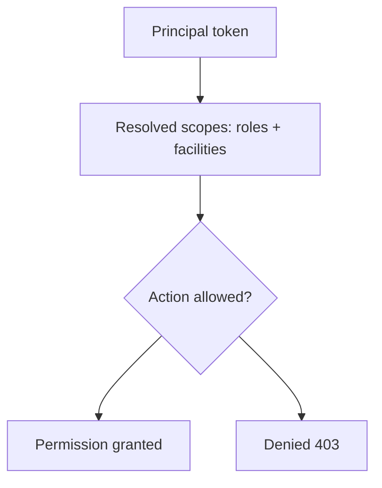
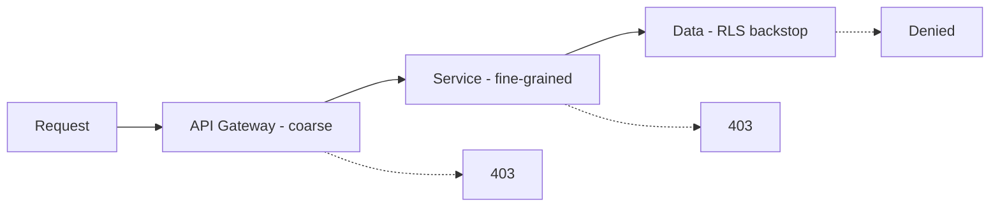

# Hospital Setup Module — Permissions Specification

> **Document ID:** `hospital-setup/11-Permissions`
> **Owner:** Engineering Lead (security) / hospital configuration
> **Status:** 🔄 Pending approval (Phase 1 gate)
> **Version:** 1.0.0
> **Last updated:** 2026-08-06
> **Review cadence:** Re-reviewed at every phase gate and when roles/permissions change.
>
> **Relationship:** This document specifies the **permissions** of the Hospital Setup module: the permission set, role × permission matrix, scoping, separation of duties, and enforcement. It implements the module requirements in [01-Business-Requirements](01-Business-Requirements.md) and follows the platform authorization model in [07-ROLES-PERMISSIONS](../../07-ROLES-PERMISSIONS.md) and [06-AUTHENTICATION](../../06-AUTHENTICATION.md).

---

## Table of Contents

1. [Purpose & Scope](#1-purpose--scope)
2. [Permission Principles](#2-permission-principles)
3. [Permission Set](#3-permission-set)
4. [Role Catalog](#4-role-catalog)
5. [Role × Permission Matrix](#5-role--permission-matrix)
6. [Scoping & Context](#6-scoping--context)
7. [Permission Granularity](#7-permission-granularity)
8. [Separation of Duties](#8-separation-of-duties)
9. [Enforcement Points](#9-enforcement-points)
10. [Elevated & MFA-gated Actions](#10-elevated--mfa-gated-actions)
11. [Permission Decision Tables](#11-permission-decision-tables)
12. [Permission Lifecycle & Management](#12-permission-lifecycle--management)
13. [Authorization Testing](#13-authorization-testing)
14. [Cross References](#14-cross-references)

---

## 1. Purpose & Scope

This document defines **who can do what, where** within the Hospital Setup module. It specifies the granular permissions, the roles that aggregate them, the facility/department scoping that constrains them, and how they are enforced and governed.

**Scope:** authorization for the Hospital Setup module. **Out of scope:** authentication mechanics ([06-AUTHENTICATION](../../06-AUTHENTICATION.md)), the platform role catalog at large ([07-ROLES-PERMISSIONS](../../07-ROLES-PERMISSIONS.md)), and module data (see [06-ERD](06-ERD.md), [04-Database-Tables](04-Database-Tables.md)).

---

## 2. Permission Principles

| # | Principle | Application |
| --- | --- | --- |
| P-01 | **Least privilege** | Roles grant the minimum permissions needed. |
| P-02 | **Default deny** | Access denied unless a permission grants it. |
| P-03 | **Separation of duties** | No single role executes conflicting steps in critical processes. |
| P-04 | **Context matters** | Permissions are scoped to facility/department context. |
| P-05 | **Centrally governed** | Catalog is data, reviewed at gates, versioned. |
| P-06 | **Testable** | Authorization rules are automated-tested. |

---

## 3. Permission Set

Permissions follow the `resource:action` convention ([07-ROLES-PERMISSIONS](../../07-ROLES-PERMISSIONS.md) §5).

| Permission | Definition |
| --- | --- |
| `hospital:read` | View facility structure, assignments, reference data, configuration. |
| `hospital:configure` | Create, update, deactivate facilities, hierarchy, assignments, reference data, configuration. |
| `hospital:approve` | Approve/reject elevated setup changes. |
| `hospital:propose` | Submit elevated changes for approval (deactivation, revocation). |
| `audit:read` | View the setup audit trail. |

### Permission Granularity

| Coarse permission | Granular capabilities |
| --- | --- |
| `hospital:configure` | `facilities:create`, `facilities:update`, `hierarchy:create`, `hierarchy:update`, `hierarchy:deactivate`, `assignment:create`, `assignment:revoke`, `reference:manage`, `config:manage` |
| `hospital:propose` | `hierarchy:deactivate` (propose), `assignment:revoke` (propose) |

---

## 4. Role Catalog

Roles align with [README](README.md) §3 and [07-ROLES-PERMISSIONS](../../07-ROLES-PERMISSIONS.md) §4.

| Role | Scope | Purpose |
| --- | --- | --- |
| **System administrator** | Global | Global structure, approvals, config, audit. |
| **Facility administrator** | Per facility | Facility structure, assignments, reference data, config. |
| **Facility admin (view)** | Per facility | Read-only structure/assignments for planning. |
| **Auditor** | Global read | Read-only compliance review of structure and audit. |

---

## 5. Role × Permission Matrix

| Role | `hospital:read` | `hospital:configure` | `hospital:propose` | `hospital:approve` | `audit:read` |
| --- | :---: | :---: | :---: | :---: | :---: |
| System administrator | ✓ | ✓ | · | ✓ | ✓ |
| Facility administrator | ✓ | ✓ | ✓ | · | · |
| Facility admin (view) | ✓ | · | · | · | · |
| Auditor | ✓ | · | · | · | ✓ |

---

## 6. Scoping & Context

| Aspect | Decision |
| --- | --- |
| Facility scope | Most roles apply within a facility/set of facilities. |
| Effective scope | Intersection of role permissions and facility assignments. |
| Department/unit scope | Clinical/operational roles may be scoped to departments/units. |
| Tenant context | Resolved from the authenticated principal. |
| Multi-facility | Model-ready; single-facility first ([09-MULTI-TENANCY](../../09-MULTI-TENANCY.md)). |

### Scope Derivation

---

## 7. Permission Granularity

| Risk level | Granularity | Example |
| --- | --- | --- |
| Low (read) | Coarse | `hospital:read` |
| Medium (routine writes) | Capability-level | `facilities:create`, `reference:manage` |
| High (destructive/elevated) | Fine-grained + MFA | `hierarchy:deactivate`, `assignment:revoke`, `config:manage` (global) |

Granularity matches risk: clinical/financial-adjacent and destructive actions are finer-grained and gated ([06-AUTHENTICATION](../../06-AUTHENTICATION.md) §9).

---

## 8. Separation of Duties

| Rule | Detail |
| --- | --- |
| Requester ≠ approver | A user who submits an elevated change cannot be its sole approver. |
| Config releaser ≠ approver | Global config changes and their approval are separated. |
| Enforcement | Modeled as policy at the enforcement point, not just a role constraint. |

### SoD Decision Table

| Action | Can propose | Can approve | Same person allowed? |
| --- | --- | --- | --- |
| Deactivate node | Facility admin / Sys admin | System admin | No |
| Revoke staff | Facility admin / Sys admin | System admin | No |
| Global config change | Facility admin | System admin | No |

---

## 9. Enforcement Points

| Layer | Enforcement |
| --- | --- |
| API gateway | Coarse authorization (is this route permitted?). |
| Service/domain | Fine-grained: scope, relationship, consent, SoD policy. |
| Data layer | Row-level security backstop on most sensitive records ([06-ERD](06-ERD.md) §14). |
| UI | Reflects permissions for UX only; API is the authority ([08-UI](08-UI.md) §3). |

---

## 10. Elevated & MFA-gated Actions

| Action | MFA | Approval | Permission |
| --- | :---: | :---: | --- |
| Deactivate facility/node | ✓ | ✓ | `hospital:propose` → `hospital:approve` |
| Revoke staff | ✓ | ✓ | `hospital:propose` → `hospital:approve` |
| Global config change | ✓ | ✓ | `hospital:configure` + approval |
| Read setup data | · | · | `hospital:read` |
| Routine node write | · | · | `hospital:configure` |

Elevated actions follow the approval workflow in [02-Workflow](02-Workflow.md) §9.

---

## 11. Permission Decision Tables

### 11.1 Who May Perform Each Action

| Action | Sys admin | Facility admin | View | Auditor |
| --- | :---: | :---: | :---: | :---: |
| Create facility | ✓ | · | · | · |
| Update facility | ✓ | ✓ (own) | · | · |
| Add hierarchy node | ✓ | ✓ (own) | · | · |
| Deactivate node | approve | propose | · | · |
| Assign staff | ✓ | ✓ (own) | · | · |
| Revoke staff | approve | propose | · | · |
| Manage reference | ✓ | ✓ (own) | · | · |
| Manage config | ✓ | ✓ (own) | · | · |
| View structure | ✓ | ✓ | ✓ | ✓ |
| View audit | ✓ | · | · | ✓ |

### 11.2 Permission × HTTP Method

| Permission | GET | POST | PUT/PATCH | DELETE |
| --- | :---: | :---: | :---: | :---: |
| `hospital:read` | ✓ | · | · | · |
| `hospital:configure` | ✓ | ✓ | ✓ | propose |
| `hospital:approve` | ✓ | · | · | ✓ (approval) |
| `audit:read` | audit GET | · | · | · |

---

## 12. Permission Lifecycle & Management

| Aspect | Decision |
| --- | --- |
| Storage | Data-defined, versioned (per [07-ROLES-PERMISSIONS](../../07-ROLES-PERMISSIONS.md) §5). |
| Review | Reviewed and signed off at the Phase 2 gate and each gate. |
| Change control | Permission changes are versioned and audited. |
| Offboarding | Immediate revocation cascades to tokens/sessions ([06-AUTHENTICATION](../../06-AUTHENTICATION.md) §3). |
| Provisioning | Setup-time role provisioning aligns staff to facilities. |

---

## 13. Authorization Testing

| Test | Covers |
| --- | --- |
| Positive | Each role can perform its permitted actions. |
| Negative | Each role is denied non-permitted actions (403). |
| Scoping | Facility scope enforced; no cross-facility access. |
| SoD | Requester cannot approve own change. |
| Elevation | MFA required for elevated actions. |
| RLS | Data-layer isolation verified. |

Testing follows [15-TESTING-STANDARDS](../../15-TESTING-STANDARDS.md) §11.

---

## 14. Cross References

| Reference | Relationship | Direction |
| --- | --- | --- |
| [README](README.md) | Module roles (§3) | Consumes |
| [01-Business-Requirements](01-Business-Requirements.md) | Requirements | Consumes |
| [02-Workflow](02-Workflow.md) | Approval workflow | Consumes |
| [06-ERD](06-ERD.md) | RLS backstop | Consumes |
| [07-Domain-Model](07-Domain-Model.md) | Domain resources | Consumes |
| [08-UI](08-UI.md) | UI permission-awareness | Consumes |
| [09-UX](09-UX.md) | UX role visibility | Consumes |
| [10-API](10-API.md) | Permission × method matrix | Consumes |
| [00-MASTER-ROADMAP](../../00-MASTER-ROADMAP.md) | Phase gates | Consumes |
| [06-AUTHENTICATION](../../06-AUTHENTICATION.md) | AuthN/Z, MFA | Consumes |
| [07-ROLES-PERMISSIONS](../../07-ROLES-PERMISSIONS.md) | Platform authorization model | Consumes |
| [08-AUDIT-LOGGING](../../08-AUDIT-LOGGING.md) | Audit of permission changes | Consumes |
| [09-MULTI-TENANCY](../../09-MULTI-TENANCY.md) | Tenant scoping | Consumes |
| [10-HOSPITAL-HIERARCHY](../../10-HOSPITAL-HIERARCHY.md) | Scoping hierarchy | Consumes |
| [15-TESTING-STANDARDS](../../15-TESTING-STANDARDS.md) | Authorization testing | Consumes |

---

*End of `docs/modules/hospital-setup/11-Permissions.md`.*
