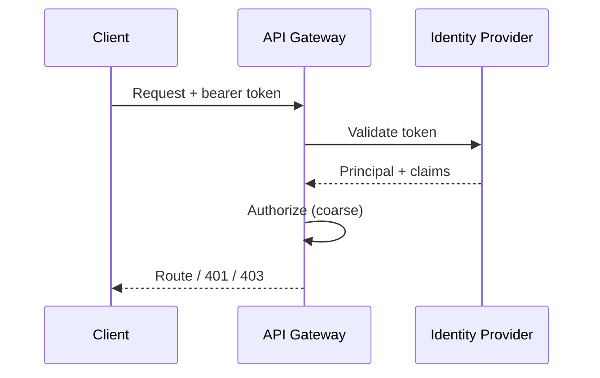
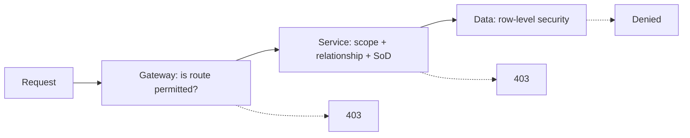
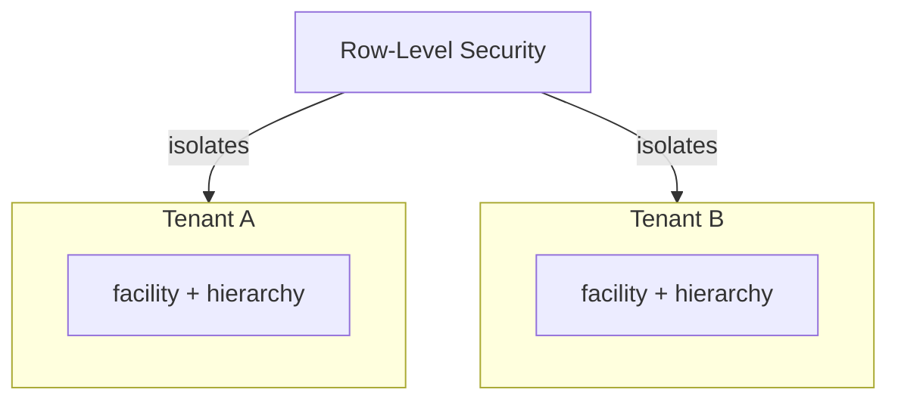

# Hospital Setup Module — Security Specification

> **Document ID:** `hospital-setup/12-Security`
> **Owner:** Engineering Lead (security) / hospital configuration
> **Status:** 🔄 Pending approval (Phase 1 gate)
> **Version:** 1.0.0
> **Last updated:** 2026-08-06
> **Review cadence:** Re-reviewed at every phase gate and when security posture changes.
>
> **Relationship:** This document specifies the **security architecture** of the Hospital Setup module: authentication, authorization, tenant isolation, audit, encryption, secrets management, threat model, and compliance. It implements the module permissions in [11-Permissions](11-Permissions.md) and follows the platform security standards in [06-AUTHENTICATION](../../06-AUTHENTICATION.md), [08-AUDIT-LOGGING](../../08-AUDIT-LOGGING.md), [09-MULTI-TENANCY](../../09-MULTI-TENANCY.md), and [07-ROLES-PERMISSIONS](../../07-ROLES-PERMISSIONS.md).

---

## Table of Contents

1. [Purpose & Scope](#1-purpose--scope)
2. [Security Principles](#2-security-principles)
3. [Security Objectives](#3-security-objectives)
4. [Authentication](#4-authentication)
5. [Authorization](#5-authorization)
6. [Tenant Isolation](#6-tenant-isolation)
7. [Least Privilege](#7-least-privilege)
8. [Encryption](#8-encryption)
9. [Secrets Management](#9-secrets-management)
10. [Audit & Logging](#10-audit--logging)
11. [Threat Model](#11-threat-model)
12. [Application Security](#12-application-security)
13. [OWASP Alignment](#13-owasp-alignment)
14. [Zero Trust](#14-zero-trust)
15. [Data Protection](#15-data-protection)
16. [Compliance](#16-compliance)
17. [Security Decision Tables](#17-security-decision-tables)
18. [Incident Response](#18-incident-response)
19. [Security Testing](#19-security-testing)
20. [Cross References](#20-cross-references)

---

## 1. Purpose & Scope

This document defines the **security architecture** of the Hospital Setup module — how it authenticates, authorizes, isolates, protects, and audits the organizational and configuration data it manages.

**Scope:** module security controls. **Out of scope:** authentication/authorization mechanics (see [06-AUTHENTICATION](../../06-AUTHENTICATION.md), [07-ROLES-PERMISSIONS](../../07-ROLES-PERMISSIONS.md)), audit mechanics ([08-AUDIT-LOGGING](../../08-AUDIT-LOGGING.md)), and platform infrastructure security (see [02-SYSTEM-ARCHITECTURE](../../02-SYSTEM-ARCHITECTURE.md) §13).

### 1.1 Security Posture

The module holds **organizational and configuration data, not clinical PHI**. Its security posture focuses on: preventing unauthorized structural/configuration changes, enforcing tenant isolation, ensuring audit integrity, and defending against abuse of destructive actions. This is lower-risk than clinical modules but still governed by the platform's zero-trust and least-privilege standards.

---

## 2. Security Principles

| # | Principle | Application |
| --- | --- | --- |
| S-01 | **Zero trust** | Every request authenticated and authorized regardless of origin. |
| S-02 | **Least privilege** | Minimum access for minimum time. |
| S-03 | **Defense in depth** | Authorization at gateway + service + data layers. |
| S-04 | **Immutable audit** | All sensitive operations logged tamper-evidently. |
| S-05 | **Minimal data** | Module stores organizational structure, not clinical data. |
| S-06 | **Tenant isolation** | No cross-tenant access by design. |
| S-07 | **Secure by default** | Fail-safe defaults; no insecure configurations. |

---

## 3. Security Objectives

| # | Objective | Measured by |
| --- | --- | --- |
| OBJ-S1 | Prevent unauthorized structural/configuration changes | Zero unauthorized-change findings |
| OBJ-S2 | Enforce tenant isolation | No cross-tenant access (audit + tests) |
| OBJ-S3 | Ensure audit integrity | No tamper-evidence failures |
| OBJ-S4 | Protect elevated/destructive actions | MFA + approval enforced |
| OBJ-S5 | No sensitive data leakage | No PHI/secrets in logs/responses |

---

## 4. Authentication

| Aspect | Decision |
| --- | --- |
| Protocol | OAuth 2.0 / OIDC ([06-AUTHENTICATION](../../06-AUTHENTICATION.md)) |
| Clients | Web uses Authorization Code + PKCE |
| Tokens | Short-lived access; rotating refresh |
| MFA | Required for elevated actions ([11-Permissions](11-Permissions.md) §10) |
| Services | Client-credentials for service-to-service |

### Authentication Flow

---

## 5. Authorization

| Aspect | Decision |
| --- | --- |
| Model | RBAC + policy-based scoping |
| Permissions | `hospital:read`, `hospital:configure`, `hospital:propose`, `hospital:approve`, `audit:read` |
| Enforcement | Gateway coarse; service fine-grained; RLS backstop |
| Elevation | MFA + approval for destructive actions |
| SoD | Requester ≠ approver ([11-Permissions](11-Permissions.md) §8) |

### Authorization Layers

---

## 6. Tenant Isolation

| Aspect | Decision |
| --- | --- |
| Model | Shared schema; every table carries `tenant_id` |
| RLS | Row-level security backstop per table |
| Scoping | Effective scope = roles ∩ facility assignments |
| Cross-tenant | Forbidden; FKs and RLS prevent it |
| Multi-facility | Model-ready; single-facility first ([09-MULTI-TENANCY](../../09-MULTI-TENANCY.md)) |

### Isolation Diagram

---

## 7. Least Privilege

| Aspect | Decision |
| --- | --- |
| DB roles | Dedicated roles; no shared superuser in app paths |
| Service accounts | Scoped to needed operations |
| Token claims | Minimal claims; no PHI in tokens |
| Time-bound | Short-lived tokens; immediate revocation on offboarding |
| UI | Write actions hidden/disabled when not authorized |

---

## 8. Encryption

| Aspect | Decision |
| --- | --- |
| In transit | TLS enforced on all endpoints |
| At rest | Encryption enabled on persistent stores |
| Keys | Managed key store; rotation |
| Tokens | No sensitive data in tokens |
| Backups | Encrypted backups |

---

## 9. Secrets Management

| Aspect | Decision |
| --- | --- |
| Storage | Central secret manager ([04-CODING-STANDARDS](../../04-CODING-STANDARDS.md) §9) |
| Never in code | No secrets in source, config, or images |
| Never in logs | Redaction of any accidental leakage |
| Rotation | Automated rotation; audited |
| Access | Least-privilege access to secrets |

---

## 10. Audit & Logging

| Aspect | Decision |
| --- | --- |
| Audit trail | Immutable, tamper-evident `setup_change_audit` ([08-AUDIT-LOGGING](../../08-AUDIT-LOGGING.md)) |
| Events | All setup mutations emit audit events |
| Logging | Structured logs with correlation id; no sensitive data |
| Monitoring | Security events alert |
| Retention | Per platform schedule |

---

## 11. Threat Model

| Threat | Vector | Impact | Mitigation |
| --- | --- | --- | --- |
| Unauthorized change | API/web | High | RBAC + MFA + approval + audit |
| Cross-tenant access | API/data | High | Tenant scoping + RLS |
| Privilege escalation | Role abuse | High | Least privilege + SoD |
| Destructive-action abuse | Deactivation/revoke | High | Approval + MFA |
| Audit tampering | Data store | High | Hash chain + integrity checks |
| Injection | API/input | High | Parameterized queries + validation |
| Enumeration | API | Medium | Rate limiting + scope checks |
| Insider misuse | Staff | Medium | Audit + review + alerting |
| Secrets leakage | Config/logs | High | Secrets manager + redaction |

---

## 12. Application Security

| Control | Implementation |
| --- | --- |
| Input validation | All input validated at boundary + service |
| Parameterized queries | No raw SQL ([04-CODING-STANDARDS](../../04-CODING-STANDARDS.md) §9) |
| Output encoding | Prevents injection/XSS |
| CSRF | Protected state-changing endpoints |
| Rate limiting | Redis token bucket ([10-API](10-API.md) §14) |
| Idempotency | Prevents duplicate destructive effects |
| Dependency scanning | CI gate |
| SAST/DAST | Scans in CI ([16-DEPLOYMENT-STANDARDS](../../16-DEPLOYMENT-STANDARDS.md) §4) |

---

## 13. OWASP Alignment

| OWASP Top 10 | Module control |
| --- | --- |
| A01 Broken Access Control | RBAC + scope + RLS + SoD |
| A02 Cryptographic Failures | Encryption at rest/in transit; no PHI in tokens |
| A03 Injection | Parameterized queries + validation |
| A04 Insecure Design | Default deny + threat modeling |
| A05 Security Misconfiguration | Secure-by-default config |
| A06 Vulnerable Components | Dependency scanning + patching |
| A07 AuthN/Verification Failures | OIDC + MFA |
| A08 Software/Data Integrity | Idempotency + supply-chain provenance |
| A09 Logging/Monitoring Failures | Audit + alerting |
| A10 SSRF | Egress controls on integrations |

---

## 14. Zero Trust

| Pillar | Application |
| --- | --- |
| Identity | Verify every request ([06-AUTHENTICATION](../../06-AUTHENTICATION.md)) |
| Least privilege | Minimal access ([11-Permissions](11-Permissions.md)) |
| Network | Micro-segmentation; no broad trust |
| Device | Device posture for elevated actions |
| Continuous verification | Re-check authorization at each layer |

---

## 15. Data Protection

| Aspect | Decision |
| --- | --- |
| Data class | Organizational/configuration; not PHI |
| Minimization | Store only what is required |
| Retention | Per compliance schedule ([05-DATABASE-ARCHITECTURE](../../05-DATABASE-ARCHITECTURE.md) §8) |
| Anonymization | No real PHI in non-production ([00-MASTER-ROADMAP](../../00-MASTER-ROADMAP.md) §10) |
| Export/erasure | Per consent/legal requirements |

---

## 16. Compliance

| Requirement | Module implication |
| --- | --- |
| HIPAA alignment | Module stores no PHI; organizational data only |
| Audit requirement | Complete immutable audit of changes |
| Least privilege | Scoped access + approval |
| Retention | Scheduled archival/deletion |
| Accessibility | WCAG AA (UI) |
| Local regulation | Confirmed in platform security standards |

---

## 17. Security Decision Tables

### 17.1 Controls by Action

| Action | MFA | Approval | Audited | Rate limited |
| --- | :---: | :---: | :---: | :---: |
| Read setup data | · | · | ✓ | ✓ |
| Create/update node | · | · | ✓ | ✓ |
| Deactivate node | ✓ | ✓ | ✓ | ✓ |
| Revoke staff | ✓ | ✓ | ✓ | ✓ |
| Global config change | ✓ | ✓ | ✓ | ✓ |
| Approve change | ✓ | · | ✓ | ✓ |

### 17.2 Data Classification

| Data | Classification | Protection |
| --- | --- | --- |
| Facility identity | Internal | Access-controlled |
| Structure/assignments | Internal | Access-controlled + scoped |
| Audit records | Sensitive | Immutable + access-controlled |
| Configuration | Internal | Access-controlled |

---

## 18. Incident Response

| Aspect | Decision |
| --- | --- |
| Severity | Per platform incident response ([16-DEPLOYMENT-STANDARDS](../../16-DEPLOYMENT-STANDARDS.md) §10) |
| Detection | Audit + monitoring alerts |
| Response | Runbooks; revocation of compromised access |
| Recovery | Restore; PITR if needed |
| Review | Post-incident review; remediation |
| Communication | Status communication per severity |

---

## 19. Security Testing

| Activity | Gate |
| --- | --- |
| Authorization tests | Per [15-TESTING-STANDARDS](../../15-TESTING-STANDARDS.md) §11 |
| SAST | CI gate |
| Dependency scan | CI gate |
| Container scan | CI gate |
| Penetration testing | Pre-launch + periodic |
| Threat model review | At gates |

---

## 20. Cross References

| Reference | Relationship | Direction |
| --- | --- | --- |
| [README](README.md) | Module overview | Consumes |
| [01-Business-Requirements](01-Business-Requirements.md) | Requirements | Consumes |
| [02-Workflow](02-Workflow.md) | Approval workflow | Consumes |
| [06-ERD](06-ERD.md) | RLS backstop | Consumes |
| [08-UI](08-UI.md) | UI security behavior | Consumes |
| [09-UX](09-UX.md) | UX security tone | Consumes |
| [10-API](10-API.md) | API security controls | Consumes |
| [11-Permissions](11-Permissions.md) | Permission model | Consumes |
| [00-MASTER-ROADMAP](../../00-MASTER-ROADMAP.md) | Compliance matrix | Consumes |
| [02-SYSTEM-ARCHITECTURE](../../02-SYSTEM-ARCHITECTURE.md) | Security architecture | Consumes |
| [03-TECHNOLOGY-STACK](../../03-TECHNOLOGY-STACK.md) | Technology | Consumes |
| [04-CODING-STANDARDS](../../04-CODING-STANDARDS.md) | Coding/security rules | Consumes |
| [05-DATABASE-ARCHITECTURE](../../05-DATABASE-ARCHITECTURE.md) | Encryption, backups | Consumes |
| [06-AUTHENTICATION](../../06-AUTHENTICATION.md) | AuthN/Z, MFA | Consumes |
| [07-ROLES-PERMISSIONS](../../07-ROLES-PERMISSIONS.md) | Authorization model | Consumes |
| [08-AUDIT-LOGGING](../../08-AUDIT-LOGGING.md) | Audit integrity | Consumes |
| [09-MULTI-TENANCY](../../09-MULTI-TENANCY.md) | Tenant isolation | Consumes |
| [15-TESTING-STANDARDS](../../15-TESTING-STANDARDS.md) | Security testing | Consumes |
| [16-DEPLOYMENT-STANDARDS](../../16-DEPLOYMENT-STANDARDS.md) | Incident response | Consumes |

---

*End of `docs/modules/hospital-setup/12-Security.md`.*
