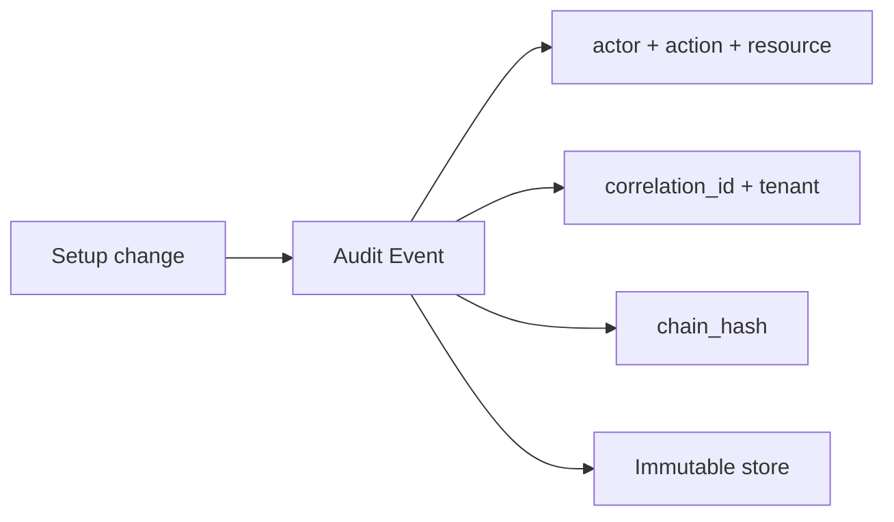
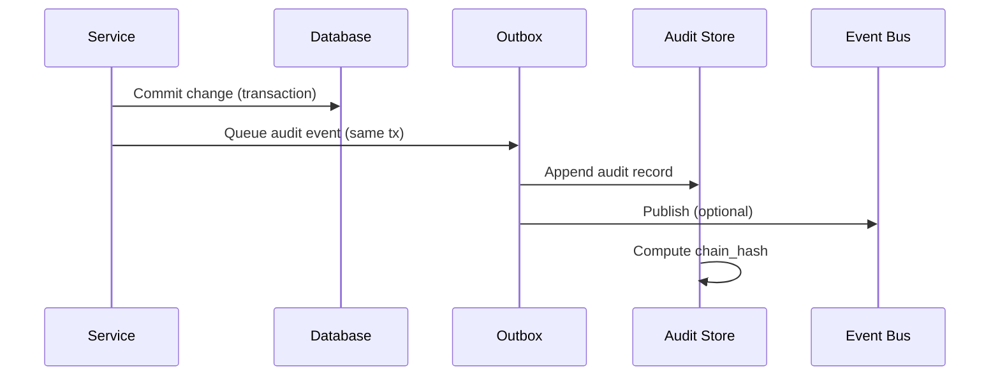
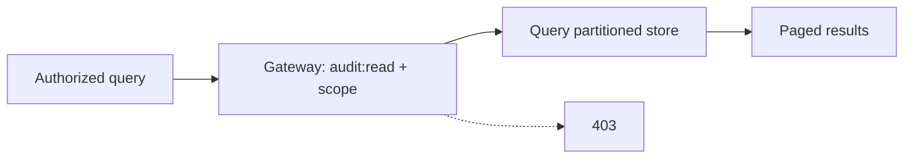
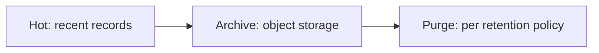

# Hospital Setup Module — Audit Specification

> **Document ID:** `hospital-setup/13-Audit`
> **Owner:** Engineering Lead (security) / hospital configuration
> **Status:** 🔄 Pending approval (Phase 1 gate)
> **Version:** 1.0.0
> **Last updated:** 2026-08-06
> **Review cadence:** Re-reviewed at every phase gate and when the audit model changes.
>
> **Relationship:** This document specifies the **audit** of the Hospital Setup module: the audit events, the audit trail schema, integrity, retention, and query. It implements the platform audit standard in [08-AUDIT-LOGGING](../../08-AUDIT-LOGGING.md), aligns with the audit table in [04-Database-Tables](04-Database-Tables.md) §12, and supports the requirements in [01-Business-Requirements](01-Business-Requirements.md).

---

## Table of Contents

1. [Purpose & Scope](#1-purpose--scope)
2. [Audit Principles](#2-audit-principles)
3. [Audit Objectives](#3-audit-objectives)
4. [Audit Event Model](#4-audit-event-model)
5. [Audit Event Catalog](#5-audit-event-catalog)
6. [Audit Trail Schema](#6-audit-trail-schema)
7. [Audit Integrity](#7-audit-integrity)
8. [Audit Write Path](#8-audit-write-path)
9. [Audit Query Path](#9-audit-query-path)
10. [Retention & Archival](#10-retention--archival)
11. [Audit & Approval](#11-audit--approval)
12. [Audit & Authorization](#12-audit--authorization)
13. [Sensitive Data in Audit](#13-sensitive-data-in-audit)
14. [Audit Reports & Review](#14-audit-reports--review)
15. [Audit Decision Tables](#15-audit-decision-tables)
16. [Monitoring & Alerting](#16-monitoring--alerting)
17. [Audit Testing](#17-audit-testing)
18. [Cross References](#18-cross-references)

---

## 1. Purpose & Scope

This document specifies **how the Hospital Setup module records, protects, retains, and exposes audit information** for every change to the hospital organization and configuration.

**Scope:** audit events, trail schema, integrity, retention, query, and review. **Out of scope:** audit mechanics at the platform level (see [08-AUDIT-LOGGING](../../08-AUDIT-LOGGING.md)) and application logging beyond audit.

### 1.1 Audit Intent

The audit trail is the **authoritative, immutable record** of who changed what in the hospital setup, when, and with what outcome. It exists to support accountability, compliance, troubleshooting, and recovery — and is never subject to in-place modification.

---

## 2. Audit Principles

| # | Principle | Application |
| --- | --- | --- |
| A-01 | **Complete** | Every setup change is audited. |
| A-02 | **Immutable** | Append-only; no update/delete in place. |
| A-03 | **Tamper-evident** | Hash chaining detects modification. |
| A-04 | **Attributable** | Actor, action, entity, time always present. |
| A-05 | **Correlated** | `correlation_id` links to request/flow. |
| A-06 | **Minimal** | No PHI, secrets, or sensitive values in records. |
| A-07 | **Queryable** | Authorized, efficient retrieval. |

---

## 3. Audit Objectives

| # | Objective | Measured by |
| --- | --- | --- |
| AU-O1 | Every setup change is recorded | 100% coverage |
| AU-O2 | Trail is tamper-evident | Zero integrity-check failures |
| AU-O3 | Authorized review is fast | p95 query within SLA |
| AU-O4 | Retention is compliant | No premature/late deletion |
| AU-O5 | No sensitive data in records | No PHI/secrets findings |

---

## 4. Audit Event Model

An audit event captures a single security-relevant fact.

| Attribute | Meaning |
| --- | --- |
| `event_id` | Stable event identity |
| `event_type` | Taxonomy type (see §5) |
| `actor` | Subject (user/service) |
| `action` | create/update/deactivate/reactivate/retire/approve/reject |
| `resource` | Type + id of target |
| `outcome` | success/failure/denied |
| `correlation_id` | Links to request/flow |
| `chain_hash` | Integrity link |
| `occurred_at` | Event time |

### Event Model Diagram



---

## 5. Audit Event Catalog

| Event | Trigger | Captures |
| --- | --- | --- |
| `setup.facility_created` | Create facility | Facility details |
| `setup.facility_updated` | Update facility | Changed fields |
| `setup.facility_deactivated` | Deactivate facility | Reason, approval ref |
| `setup.hierarchy.created` | Add node | Node, parent, type |
| `setup.hierarchy.updated` | Update node | Changed fields |
| `setup.hierarchy.deactivated` | Deactivate node | Reason, approval ref |
| `setup.assignment.created` | Assign staff | Staff, target, type, dates |
| `setup.assignment.revoked` | Revoke staff | Reason, approval ref |
| `setup.config.updated` | Update config | Key, prior/new value |
| `setup.reference.created` | Add reference value | Category, code |
| `setup.reference.updated` | Update reference | Changed fields |
| `setup.approval.submitted` | Submit change | Proposal ref |
| `setup.approval.approved` | Approve change | Proposal ref |
| `setup.approval.rejected` | Reject change | Proposal ref |

---

## 6. Audit Trail Schema

The audit trail is stored in `setup_change_audit` (detailed in [04-Database-Tables](04-Database-Tables.md) §12).

| Column | Type | Purpose |
| --- | --- | --- |
| `id` | uuid | Surrogate PK |
| `tenant_id` | uuid | Tenant scope |
| `facility_id` | uuid | Facility scope |
| `event_id` | uuid | Stable event identity |
| `event_type` | varchar(60) | Taxonomy |
| `actor` | uuid | Actor id |
| `actor_type` | varchar(20) | user/service |
| `action` | varchar(20) | Action verb |
| `resource` | varchar(80) | Type + id |
| `outcome` | varchar(20) | success/failure/denied |
| `correlation_id` | uuid | Traceability |
| `chain_hash` | varchar(64) | Integrity |
| `occurred_at` | timestamptz | Event time |

### Partitioning

The audit table is **partitioned by time** (monthly/quarterly) to bound growth and speed maintenance ([04-Database-Tables](04-Database-Tables.md) §12.5).

---

## 7. Audit Integrity

The audit trail is protected by **hash chaining**: each record stores a hash derived from its own content and the prior record's hash.

```mermaid
flowchart LR
    E1[Event 1<br/>hash1 = H(content1)] --> E2[Event 2<br/>hash2 = H(content2 + hash1)]
    E2 --> E3[Event 3<br/>hash3 = H(content3 + hash2)]
    CHK[Integrity check] --> E1
    CHK --> E2
    CHK --> E3
```

| Guarantee | Mechanism |
| --- | --- |
| No in-place modification | Append-only store |
| Tamper detection | Chain hash recomputation |
| Alert on break | Integrity checks on a schedule |
| Immutability | No update/delete privileges on the table |

---

## 8. Audit Write Path



| Aspect | Decision |
| --- | --- |
| Critical events | Written synchronously with the change |
| Other events | Via outbox; ≤ 1 min |
| Atomicity | Audit queued in the same transaction ([05-DATABASE-ARCHITECTURE](../../05-DATABASE-ARCHITECTURE.md) §6) |
| Ordering | Sequence preserved for integrity |

---

## 9. Audit Query Path



| Aspect | Decision |
| --- | --- |
| Access | Requires `audit:read` ([11-Permissions](11-Permissions.md)) |
| Scope | Facility-scoped; no cross-tenant |
| Filters | facility, actor, action, event_type, time range |
| Pagination | Cursor-based (high volume) |
| Exports | Authorized export ([15-Reports](15-Reports.md)) |

---

## 10. Retention & Archival

| Aspect | Decision |
| --- | --- |
| Retention | Per compliance schedule ([05-DATABASE-ARCHITECTURE](../../05-DATABASE-ARCHITECTURE.md) §8) |
| Online | Recent records on hot store |
| Archive | Older records to object storage |
| Purge | Only by approved, audited process |
| Schedule | Automated, monitored |
| Integrity | Archival preserves chain (integrity maintained) |

### Lifecycle



---

## 11. Audit & Approval

Audit records the full approval lifecycle for elevated changes ([02-Workflow](02-Workflow.md) §9).

| Stage | Audit event |
| --- | --- |
| Proposal submitted | `setup.approval.submitted` |
| Approval granted | `setup.approval.approved` |
| Approval rejected | `setup.approval.rejected` |
| Change executed | The corresponding `setup.*` event |

This gives a complete, auditable chain from proposal to effect.

---

## 12. Audit & Authorization

| Aspect | Decision |
| --- | --- |
| Viewing audit | Requires `audit:read` |
| Scope | Facility-scoped; global for system admin/auditor |
| Writing audit | System-only; no user API writes to the trail |
| UI | Audit screen read-only ([08-UI](08-UI.md) S-09) |
| RLS | Audit table row-level security |

---

## 13. Sensitive Data in Audit

| Aspect | Decision |
| --- | --- |
| No PHI | Module stores organizational data; audit contains no clinical data |
| No secrets | Tokens, credentials, keys never logged |
| No sensitive values | Full prior/new config values logged only where safe; secrets redacted |
| Redaction | Applied at write; verified in testing |

---

## 14. Audit Reports & Review

| Report / review | Purpose |
| --- | --- |
| Setup Change Log | All changes in a period (facility/actor/action) |
| Approval history | Proposals and their outcomes |
| Integrity report | Hash-chain verification result |
| Periodic review | Compliance check of structure + audit |
| Unauthorized-change detection | Alerts on denied attempts |

Reports align with [15-Reports](15-Reports.md).

---

## 15. Audit Decision Tables

### 15.1 What Is Audited

| Action | Audited | Approval also recorded |
| --- | :---: | :---: |
| Read | No (access logged at coarse level) | — |
| Create node | Yes | No |
| Update node | Yes | No |
| Deactivate node | Yes | Yes |
| Revoke staff | Yes | Yes |
| Config change | Yes | Global: yes |
| Approval decision | Yes | n/a |

### 15.2 Audit Access

| Role | View audit | Export audit |
| --- | :---: | :---: |
| System administrator | ✓ | ✓ |
| Auditor | ✓ | ✓ |
| Facility administrator | · | · |
| Facility admin (view) | · | · |

---

## 16. Monitoring & Alerting

| Signal | Alert |
| --- | --- |
| Integrity check failure | Critical alert |
| Unauthorized access attempts | Security alert |
| Audit write failure | Operational alert |
| Retention job failure | Operational alert |
| Anomalous actor activity | Review trigger |

Monitoring aligns with the platform observability architecture ([02-SYSTEM-ARCHITECTURE](../../02-SYSTEM-ARCHITECTURE.md) §14).

---

## 17. Audit Testing

| Test | Verifies |
| --- | --- |
| Event coverage | Every mutation produces an event |
| Immutability | No update/delete possible |
| Integrity | Chain hash recomputation passes |
| Tamper detection | Modified record detected |
| Authorization | Only `audit:read` can view |
| Scoping | No cross-tenant audit access |
| Redaction | No sensitive data in records |

Testing follows [15-TESTING-STANDARDS](../../15-TESTING-STANDARDS.md).

---

## 18. Cross References

| Reference | Relationship | Direction |
| --- | --- | --- |
| [README](README.md) | Module overview | Consumes |
| [01-Business-Requirements](01-Business-Requirements.md) | Audit requirements | Consumes |
| [02-Workflow](02-Workflow.md) | Approval workflow | Consumes |
| [04-Database-Tables](04-Database-Tables.md) | Audit table schema | Consumes |
| [06-ERD](06-ERD.md) | Audit entity relationships | Consumes |
| [08-UI](08-UI.md) | Audit screen | Consumes |
| [10-API](10-API.md) | Audit endpoint | Consumes |
| [11-Permissions](11-Permissions.md) | `audit:read` permission | Consumes |
| [12-Security](12-Security.md) | Audit integrity controls | Consumes |
| [00-MASTER-ROADMAP](../../00-MASTER-ROADMAP.md) | Compliance matrix | Consumes |
| [02-SYSTEM-ARCHITECTURE](../../02-SYSTEM-ARCHITECTURE.md) | Observability | Consumes |
| [05-DATABASE-ARCHITECTURE](../../05-DATABASE-ARCHITECTURE.md) | Retention, outbox | Consumes |
| [08-AUDIT-LOGGING](../../08-AUDIT-LOGGING.md) | Platform audit standard | Consumes |
| [09-MULTI-TENANCY](../../09-MULTI-TENANCY.md) | Tenant isolation | Consumes |
| [15-TESTING-STANDARDS](../../15-TESTING-STANDARDS.md) | Audit testing | Consumes |
| [16-DEPLOYMENT-STANDARDS](../../16-DEPLOYMENT-STANDARDS.md) | Monitoring/alerting | Consumes |

---

*End of `docs/modules/hospital-setup/13-Audit.md`.*
