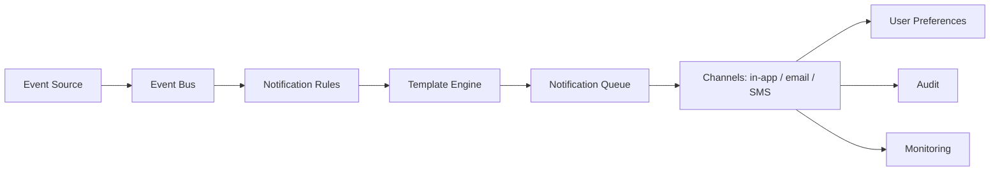
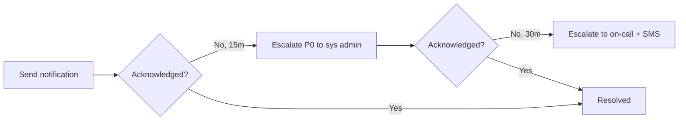
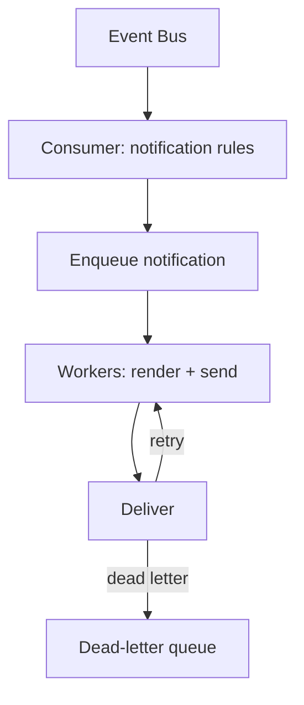
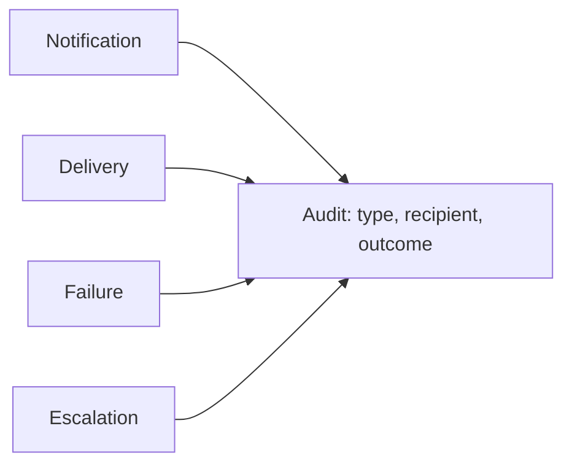

# Hospital Setup Module — Notifications Specification

> **Document ID:** `hospital-setup/14-Notifications`
> **Owner:** Engineering Lead / Product (hospital configuration)
> **Status:** 🔄 Pending approval (Phase 1 gate)
> **Version:** 1.0.0
> **Last updated:** 2026-08-06
> **Review cadence:** Re-reviewed at every phase gate and when the notification model changes.
>
> **Relationship:** This document specifies the **notifications** of the Hospital Setup module: what is notified, to whom, through which channels, with what priority, and how delivery is made reliable. It implements the cross-cutting notification concern in [02-SYSTEM-ARCHITECTURE](../../02-SYSTEM-ARCHITECTURE.md) §12, uses the event bus in [03-TECHNOLOGY-STACK](../../03-TECHNOLOGY-STACK.md), and supports the workflows in [02-Workflow](02-Workflow.md).

---

## Table of Contents

1. [Purpose](#1-purpose)
2. [Scope](#2-scope)
3. [Notification Architecture](#3-notification-architecture)
4. [Event Sources](#4-event-sources)
5. [Notification Types](#5-notification-types)
6. [Delivery Channels](#6-delivery-channels)
7. [Priority Levels](#7-priority-levels)
8. [Notification Templates](#8-notification-templates)
9. [User Preferences](#9-user-preferences)
10. [Escalation Rules](#10-escalation-rules)
11. [Retry Strategy](#11-retry-strategy)
12. [Queue Processing](#12-queue-processing)
13. [Failure Handling](#13-failure-handling)
14. [Rate Limiting](#14-rate-limiting)
15. [Security & Privacy](#15-security--privacy)
16. [Audit Integration](#16-audit-integration)
17. [Monitoring](#17-monitoring)
18. [Reports](#18-reports)
19. [KPIs](#19-kpis)
20. [Cross References](#20-cross-references)

---

## 1. Purpose

This document specifies **how the Hospital Setup module notifies its users** of events that require attention — approvals, deactivations, configuration changes, and anomalies. Notifications keep operators and administrators informed and drive accountability without requiring them to continuously monitor the system.

---

## 2. Scope

**In scope:** notification types, event sources, delivery channels, templates, preferences, escalation, retry, queueing, failure handling, rate limiting, security, audit, monitoring, reports, and KPIs for the Hospital Setup module.

**Out of scope:** the platform notification infrastructure itself (see [02-SYSTEM-ARCHITECTURE](../../02-SYSTEM-ARCHITECTURE.md) §12), email/SMS provider integration details (see [18-Integrations](18-Integrations.md)), and notifications for other modules.

### 2.1 Notification Surface

| Surface | Usage |
| --- | --- |
| Web portal (in-app) | Primary for setup events |
| Email | Approval notifications, audit alerts |
| SMS | High-priority alerts (optional, configurable) |

---

## 3. Notification Architecture

### Architecture Components

| Component | Responsibility |
| --- | --- |
| Event bus | Reliable delivery of domain events |
| Notification rules | Determine what/whom/when |
| Template engine | Render per-channel content |
| Notification queue | Durable, ordered processing |
| Channel adapters | In-app, email, SMS delivery |
| Preference service | Per-user opt-in/out + channel |
| Audit | Immutable record of sends |
| Monitoring | Delivery health + metrics |

---

## 4. Event Sources

Notifications are triggered by domain events from [07-Domain-Model](07-Domain-Model.md) §8 and audit events from [13-Audit](13-Audit.md) §5.

| Source | Event | Notification |
| --- | --- | --- |
| `setup.facility_created` | Facility provisioned | Facility admin |
| `setup.facility_updated` | Profile changed | Facility admin |
| `setup.approval.submitted` | Change proposed | Approver |
| `setup.approval.approved` | Change approved | Proposer |
| `setup.approval.rejected` | Change rejected | Proposer |
| `setup.hierarchy.deactivated` | Node deactivated | Facility admin |
| `setup.assignment.revoked` | Staff revoked | Facility admin |
| `setup.config.updated` | Config changed | Facility admin |
| Unauthorized-change attempt | Security event | System admin, Auditor |

---

## 5. Notification Types

| Type | Purpose | Default recipients |
| --- | --- | --- |
| Approval request | A change awaits your decision | Approvers |
| Approval outcome | Your change was approved/rejected | Proposer |
| Change confirmation | A setup change succeeded | Facility admin |
| Structure alert | A node was deactivated/impacted | Facility admin |
| Configuration change | Config updated | Facility admin |
| Security alert | Suspicious/unauthorized attempt | System admin, Auditor |
| Anomaly alert | Anomalous activity detected | System admin |

---

## 6. Delivery Channels

| Channel | Use case | Reliability | Default |
| --- | --- | --- | --- |
| In-app | Routine, low-priority | High (server-side) | Always |
| Email | Approvals, confirmations, alerts | Medium | On for elevated |
| SMS | High-priority security/outage alerts | Medium | Optional |
| Webhook | External consumers (future) | Medium | Off ([18-Integrations](18-Integrations.md)) |

### Channel × Type Matrix

| Notification type | In-app | Email | SMS |
| --- | :---: | :---: | :---: |
| Approval request | ✓ | ✓ | · |
| Approval outcome | ✓ | ✓ | · |
| Change confirmation | ✓ | ✓ | · |
| Structure alert | ✓ | ✓ | · |
| Configuration change | ✓ | ✓ | · |
| Security alert | ✓ | ✓ | ✓ |
| Anomaly alert | ✓ | ✓ | ✓ |

---

## 7. Priority Levels

| Priority | Label | Example | Delivery |
| --- | --- | --- | --- |
| P0 | Critical | Security/outage alert | Immediate + SMS |
| P1 | High | Approval required, deactivation | Immediate + email |
| P2 | Normal | Change confirmation | In-app + email |
| P3 | Low | Routine updates | In-app only |

### Priority Decision Table

| Notification type | Priority |
| --- | --- |
| Security alert | P0 |
| Anomaly alert | P0/P1 |
| Approval request | P1 |
| Approval outcome | P2 |
| Change confirmation | P2 |
| Structure alert | P1/P2 |
| Configuration change | P2 |

---

## 8. Notification Templates

| Aspect | Decision |
| --- | --- |
| Rendering | Template engine per channel |
| Content | Type, actor, resource, outcome, link |
| Localization | Resource-keyed, locale-aware ([08-UI](08-UI.md) §18) |
| Tone | Consistent with [09-UX](09-UX.md) §16 |
| Linking | Deep link to the relevant entity |

### Template Data

| Placeholder | Example |
| --- | --- |
| `{actor}` | Ana (Facility Admin) |
| `{resource}` | Unit: ICU-2 |
| `{action}` | deactivated |
| `{outcome}` | pending approval |
| `{link}` | /setup/units/icu-2 |

---

## 9. User Preferences

| Aspect | Decision |
| --- | --- |
| Opt-in/out | Per notification type and channel |
| Defaults | Elevated types on by default |
| Quiet hours | Optional suppression window |
| Channel preference | Per-type selection |
| Storage | Part of user preference data |
| Enforcement | Applies at send time |

### Preference Model

| Preference | Allowed |
| --- | --- |
| Approval requests | channel (in-app/email) |
| Change confirmations | channel / off |
| Security alerts | channel / always on |
| Quiet hours | yes/no + window |
| SMS on P0 | yes/no |

---

## 10. Escalation Rules

Escalation ensures critical notifications are not missed.

| Condition | Escalation |
| --- | --- |
| P0 not acknowledged in 15 min | Escalate to system admin |
| P0 not acknowledged in 30 min | Escalate to on-call + SMS |
| Approval pending > 24 h | Reminder to approver |
| Approval pending > 48 h | Escalate to system admin |
| Delivery failure (final) | Notify on-call (P0) / log (P1+) |

### Escalation Flow

---

## 11. Retry Strategy

| Aspect | Decision |
| --- | --- |
| Backoff | Exponential with jitter |
| Max attempts | Configurable (default 3) |
| Retry window | Bounded (e.g., 24 h) |
| Ordering | Per-correlation; no reordering across channels |
| Persistence | Durable queue; no loss on restart |

### Retry Parameters

| Parameter | Default |
| --- | --- |
| Initial delay | 1 min |
| Backoff factor | 2× |
| Max attempts | 3 |
| Max window | 24 h |

---

## 12. Queue Processing

| Aspect | Decision |
| --- | --- |
| Ordering | Ordered per correlation/tenant |
| Idempotency | Dedupe on event id ([10-API](10-API.md) §15) |
| Throughput | Scales with workers |
| Backpressure | Queue depth limits |

---

## 13. Failure Handling

| Failure | Handling |
| --- | --- |
| Provider down | Retry with backoff |
| Final failure | Dead-letter queue + alert |
| Invalid template | Log + send fallback text |
| Unsubscribed recipient | Skip; do not send |
| P0 delivery failure | Escalate to on-call |
| Partial channel failure | Deliver to remaining channels; retry failed |

### Failure Decision Table

| Failure | Retry | Dead-letter | Alert | Escalate |
| --- | :---: | :---: | :---: | :---: |
| Transient provider error | ✓ | · | · | · |
| Permanent reject | · | ✓ | ✓ | P0 only |
| Template error | ✓ (fallback) | · | ✓ | · |
| Recipient unsubscribed | · | · | · | · |

---

## 14. Rate Limiting

| Aspect | Decision |
| --- | --- |
| Per-recipient | Cap to prevent notification storms |
| Per-type | Cap on repeat alerts (e.g., security) |
| Coalescing | Aggressive alerts within a window collapsed |
| Provider limits | Respect upstream rate limits |
| Backpressure | Queue delays excess safely |

---

## 15. Security & Privacy

| Aspect | Decision |
| --- | --- |
| No PHI | Notifications carry organizational context only |
| No secrets | Tokens/credentials never in notifications |
| Authentication | Deep links require authenticated session |
| Tenant isolation | Recipients scoped to their facility ([09-MULTI-TENANCY](../../09-MULTI-TENANCY.md)) |
| Authorization | Only authorized recipients notified ([11-Permissions](11-Permissions.md)) |
| Data minimization | Minimal content; no sensitive values |

---

## 16. Audit Integration

Notifications are audited per [13-Audit](13-Audit.md).

| Event | Audit record |
| --- | --- |
| Notification generated | Type, recipient, priority, channel |
| Delivery attempt | Outcome |
| Delivery failure | Reason, retry state |
| Escalation | Escalation target |

### Audit Flow

---

## 17. Monitoring

| Signal | Metric | Alert |
| --- | --- | --- |
| Delivery success rate | % | Below SLA |
| Queue depth | count | Backlog |
| Failure rate | % | Spike |
| Retry rate | % | Spike |
| Escalation rate | count | Trend |
| DLQ depth | count | Non-zero |

Monitoring follows [02-SYSTEM-ARCHITECTURE](../../02-SYSTEM-ARCHITECTURE.md) §14.

---

## 18. Reports

| Report | Purpose |
| --- | --- |
| Delivery report | Sends, successes, failures by channel |
| Failure report | Permanent failures with reasons |
| Escalation report | Escalated notifications |
| Preference report | Subscription coverage |
| Volume report | Notifications by type/priority |

Reports align with [15-Reports](15-Reports.md).

---

## 19. KPIs

| KPI | Target |
| --- | --- |
| Delivery success rate | ≥ 99% |
| P0 acknowledgment | ≤ 15 min median |
| Approval response | ≤ 24 h |
| Escalation rate | < 5% of P0 |
| Notification latency | P0 immediate; P2 ≤ 5 min |
| Failed-delivery escalation | 100% of P0 |

---

## 20. Cross References

| Reference | Relationship | Direction |
| --- | --- | --- |
| [README](README.md) | Module overview | Consumes |
| [01-Business-Requirements](01-Business-Requirements.md) | Requirements | Consumes |
| [02-Workflow](02-Workflow.md) | Approval workflow | Consumes |
| [07-Domain-Model](07-Domain-Model.md) | Domain events | Consumes |
| [08-UI](08-UI.md) | In-app surface | Consumes |
| [09-UX](09-UX.md) | Notification tone | Consumes |
| [11-Permissions](11-Permissions.md) | Recipient authorization | Consumes |
| [13-Audit](13-Audit.md) | Audit integration | Consumes |
| [00-MASTER-ROADMAP](../../00-MASTER-ROADMAP.md) | Phase sequencing | Consumes |
| [02-SYSTEM-ARCHITECTURE](../../02-SYSTEM-ARCHITECTURE.md) | Eventing/observability | Consumes |
| [03-TECHNOLOGY-STACK](../../03-TECHNOLOGY-STACK.md) | Event bus, Redis | Consumes |
| [09-MULTI-TENANCY](../../09-MULTI-TENANCY.md) | Tenant isolation | Consumes |
| [18-Integrations](18-Integrations.md) | Channel provider integration | Consumes |

---

*End of `docs/modules/hospital-setup/14-Notifications.md`.*
