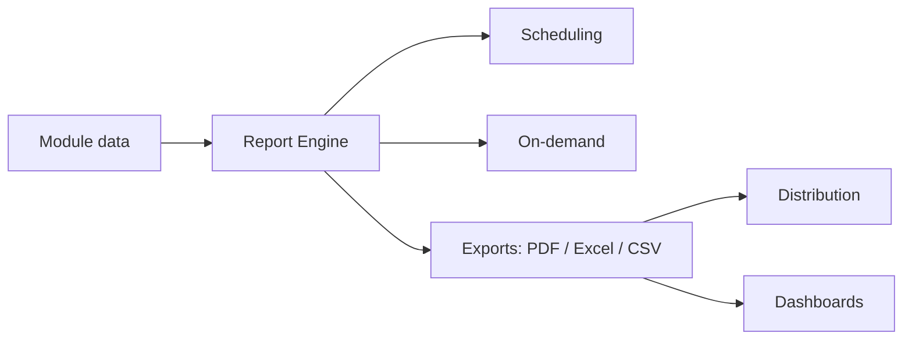
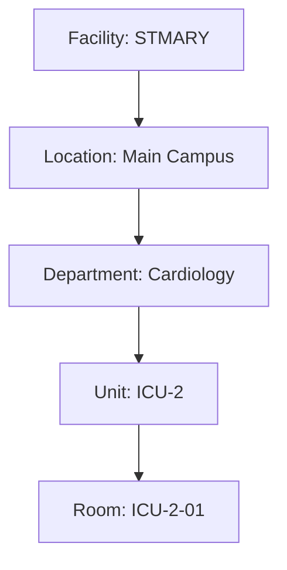

# Hospital Setup Module — Reports Specification

> **Document ID:** `hospital-setup/15-Reports`
> **Owner:** Engineering Lead / Analytics (hospital configuration)
> **Status:** 🔄 Pending approval (Phase 1 gate)
> **Version:** 1.0.0
> **Last updated:** 2026-08-06
> **Review cadence:** Re-reviewed at every phase gate and when the reporting model changes.
>
> **Relationship:** This document defines the **complete reporting architecture** of the Hospital Setup module: the reports produced, their stakeholders, sources, delivery, and governance. It supports the requirements in [01-Business-Requirements](01-Business-Requirements.md), uses the data model in [06-ERD](06-ERD.md) and [04-Database-Tables](04-Database-Tables.md), and feeds dashboards in [16-Dashboards](16-Dashboards.md) (next document).

---

## Table of Contents

1. [Report Overview](#1-report-overview)
2. [Reporting Objectives](#2-reporting-objectives)
3. [Stakeholders](#3-stakeholders)
4. [Report Categories](#4-report-categories)
5. [Operational Reports](#5-operational-reports)
6. [Administrative Reports](#6-administrative-reports)
7. [Compliance Reports](#7-compliance-reports)
8. [Audit Reports](#8-audit-reports)
9. [Configuration Reports](#9-configuration-reports)
10. [Staff Assignment Reports](#10-staff-assignment-reports)
11. [Department Reports](#11-department-reports)
12. [Facility Reports](#12-facility-reports)
13. [Room & Unit Reports](#13-room--unit-reports)
14. [KPI Reports](#14-kpi-reports)
15. [Dashboard Integration](#15-dashboard-integration)
16. [Scheduling & Distribution](#16-scheduling--distribution)
17. [Export Formats (PDF, Excel, CSV)](#17-export-formats-pdf-excel-csv)
18. [Filters & Parameters](#18-filters--parameters)
19. [Data Sources](#19-data-sources)
20. [Report Security](#20-report-security)
21. [Tenant Isolation](#21-tenant-isolation)
22. [Performance Considerations](#22-performance-considerations)
23. [Report Retention](#23-report-retention)
24. [Cross References](#24-cross-references)

---

## 1. Report Overview

The Hospital Setup module produces **operational, administrative, compliance, and audit reports** that describe the state of the hospital organization and configuration. Reports serve facility/system administrators, auditors, and executives — providing visibility, accountability, and evidence for compliance and review.

Reports are **read-only projections** over the module's data ([06-ERD](06-ERD.md) §19), never direct writes to the source of truth.

---

## 2. Reporting Objectives

| # | Objective | Measured by |
| --- | --- | --- |
| RP-01 | Provide complete structure visibility | All hierarchy levels reported |
| RP-02 | Support compliance and audit evidence | Audit/compliance reports on demand |
| RP-03 | Enable operational planning | Assignment and structure reports |
| RP-04 | Provide configuration transparency | Config reports on demand |
| RP-05 | Deliver KPIs to leadership | KPI reports and dashboards |
| RP-06 | Keep reports secure and tenant-isolated | No cross-tenant data |

---

## 3. Stakeholders

| Stakeholder | Persona | Reports needed |
| --- | --- | --- |
| System administrator | Priya | All reports, global |
| Facility administrator | Ana | Facility-scoped reports |
| Facility admin (view) | Marcus | Structure and configuration reads |
| Auditor | Nina | Audit and compliance reports |
| Executive | — | KPI reports, dashboards |
| HR / operations | — | Staff assignment reports |

### Stakeholder × Report Matrix

| Report | Sys admin | Facility admin | View | Auditor | Executive |
| --- | :---: | :---: | :---: | :---: | :---: |
| Structure | ✓ | ✓ | ✓ | ✓ | · |
| Staff assignment | ✓ | ✓ | ✓ | · | · |
| Audit | ✓ | · | · | ✓ | · |
| Compliance | ✓ | · | · | ✓ | · |
| KPI | ✓ | ✓ | · | · | ✓ |

---

## 4. Report Categories

| Category | Purpose | Examples |
| --- | --- | --- |
| Operational | Day-to-day visibility | Structure inventory, assignment lists |
| Administrative | Planning and governance | Facility summary, config snapshot |
| Compliance | Evidence for reviews | Structure compliance, change compliance |
| Audit | Immutable change record | Setup change log, approval history |
| KPI | Leadership metrics | Structure health, assignment coverage |

---

## 5. Operational Reports

| Report | Purpose | Key fields |
| --- | --- | --- |
| Structure Inventory | Full hierarchy listing | facility, location, department, unit, room, status |
| Unit Occupancy Snapshot | Units and their status | unit, status, active assignments |
| Staff Assignment List | Assignments by staff/unit | staff, target, type, dates, status |
| Reference Value Catalog | Controlled vocabularies | category, code, label, active |

### Structure Inventory

---

## 6. Administrative Reports

| Report | Purpose | Key fields |
| --- | --- | --- |
| Facility Summary | Facility identity and status | code, name, type, status, timeZone, contact |
| Configuration Snapshot | All config keys | key, value, updatedBy, updatedAt |
| Department Overview | Departments and heads | department, type, head, location, status |
| Assignment Coverage | Primary coverage per unit | unit, primary count, gaps |

---

## 7. Compliance Reports

| Report | Purpose |
| --- | --- |
| Structure Compliance | Confirms structure meets governance (required fields, statuses, no orphaned nodes) |
| Change Compliance | Confirms all changes followed approval where required |
| Review Evidence | Snapshot supporting periodic reviews |

Compliance aligns with [00-MASTER-ROADMAP](../../00-MASTER-ROADMAP.md) §15.

---

## 8. Audit Reports

| Report | Purpose | Source |
| --- | --- | --- |
| Setup Change Log | All changes in a period | `setup_change_audit` |
| Approval History | Proposals + outcomes | audit events |
| Actor Activity | Changes by actor | audit events |
| Unauthorized-Attempt Report | Denied attempts | audit events |
| Integrity Report | Hash-chain verification | [13-Audit](13-Audit.md) §7 |

Audit reports require `audit:read` ([11-Permissions](11-Permissions.md)).

---

## 9. Configuration Reports

| Report | Purpose | Key fields |
| --- | --- | --- |
| Configuration Snapshot | Current config per facility | key, value, updatedBy |
| Configuration History | Changes over time | key, prior, new, actor, time |
| Defaults Report | Applied defaults vs overrides | key, default, effective |

---

## 10. Staff Assignment Reports

| Report | Purpose | Key fields |
| --- | --- | --- |
| Active Assignments | Current assignments | staff, target, type, dates |
| Assignment History | Full assignment timeline | staff, type, from, to, status |
| Coverage by Unit | Primary assignment coverage | unit, primary, gaps |
| Expiring Assignments | Ending soon | staff, effectiveTo |

---

## 11. Department Reports

| Report | Purpose | Key fields |
| --- | --- | --- |
| Department Directory | All departments | name, type, head, location, status |
| Departments by Facility | Grouping | facility, department |
| Department Head Report | Heads of departments | department, head, contact |

---

## 12. Facility Reports

| Report | Purpose | Key fields |
| --- | --- | --- |
| Facility Profile | Identity + contact | code, name, type, status, address, contact |
| Facility Summary | Structure counts | locations, departments, units, rooms, staff |
| Facility Status Report | Status distribution | facility, status |

---

## 13. Room & Unit Reports

| Report | Purpose | Key fields |
| --- | --- | --- |
| Room Inventory | Rooms per unit | unit, room, bed count, status |
| Unit Status Report | Units and status | unit, status |
| Bed Capacity Summary | Bed counts by unit | unit, total beds |

---

## 14. KPI Reports

| Report | KPI(s) |
| --- | --- |
| Structure Health | Active vs inactive nodes |
| Assignment Coverage | % of units with a primary |
| Configuration Completeness | % of required config set |
| Change Volume | Changes over time by type |
| Approval Efficiency | Time to approval, approval rate |

KPI reports feed the executive dashboards in [16-Dashboards](16-Dashboards.md).

---

## 15. Dashboard Integration

| Aspect | Decision |
| --- | --- |
| Source | KPI reports power dashboard widgets |
| Frequency | Refreshed per dashboard cadence |
| Linking | Dashboard drill-down to underlying reports |
| Ownership | Shared between module and dashboard platform |
| Read access | Per role ([11-Permissions](11-Permissions.md)) |

---

## 16. Scheduling & Distribution

| Aspect | Decision |
| --- | --- |
| On-demand | User requests, runs immediately |
| Scheduled | Daily/weekly/monthly per report |
| Distribution | Email / in-app / download |
| Recipients | Per report role and preference ([14-Notifications](14-Notifications.md) §9) |
| Time zone | Facility time zone ([04-Database-Tables](04-Database-Tables.md) §4) |

### Schedule Table

| Report | Cadence | Distribution |
| --- | --- | --- |
| Structure Compliance | Weekly | Facility admin |
| Configuration Snapshot | Monthly | Sys admin |
| Approval History | Monthly | Auditor |
| Assignment Coverage | Weekly | Facility admin |
| Facility Summary | Monthly | Executive |

---

## 17. Export Formats (PDF, Excel, CSV)

| Format | Use case | Notes |
| --- | --- | --- |
| PDF | Compliance, formal review | Fixed layout, paginated |
| Excel | Analysis, manipulation | Multi-sheet, totals |
| CSV | Data interchange, import to tools | Flat, delimited |

### Format Decision Table

| Report | PDF | Excel | CSV |
| --- | :---: | :---: | :---: |
| Structure Inventory | ✓ | ✓ | ✓ |
| Compliance report | ✓ | · | · |
| Change Log | ✓ | ✓ | ✓ |
| KPI report | ✓ | ✓ | · |
| Configuration snapshot | · | ✓ | ✓ |

---

## 18. Filters & Parameters

| Parameter | Applies to |
| --- | --- |
| Facility | All reports |
| Date range | Audit, change, history reports |
| Status | Structure, assignment reports |
| Actor | Audit, actor-activity reports |
| Department/unit | Department, unit, assignment reports |
| Category | Reference, config reports |

Filters follow the API filtering conventions in [10-API](10-API.md) §10.

---

## 19. Data Sources

| Source | Used by |
| --- | --- |
| Primary DB (canonical) | All reports (via read path) |
| `setup_change_audit` | Audit reports |
| Read projections | KPI/aggregate reports ([06-ERD](06-ERD.md) §19) |
| Event log | Change-history reports |
| Reference data | Reference/config reports |

Reporting reads from projections/read replicas, never the write path ([05-DATABASE-ARCHITECTURE](../../05-DATABASE-ARCHITECTURE.md) §3).

---

## 20. Report Security

| Aspect | Decision |
| --- | --- |
| Authorization | Report access by role ([11-Permissions](11-Permissions.md)) |
| Row-level | Data filtered by tenant/facility scope |
| Sensitive data | No PHI, secrets, or sensitive values in reports |
| Exports | Authorized; auditable |
| Audit | Report generation/distribution audited |
| Least privilege | Only authorized roles view/export |

---

## 21. Tenant Isolation

| Aspect | Decision |
| --- | --- |
| Isolation | Reports strictly scoped to the caller's tenant/facility |
| Cross-tenant | Forbidden by query + RLS ([09-MULTI-TENANCY](../../09-MULTI-TENANCY.md)) |
| Global reports | Only system admin/auditor across facilities |
| Exports | Tenant context preserved |
| Verification | Isolation tested ([15-TESTING-STANDARDS](../../15-TESTING-STANDARDS.md) §11) |

---

## 22. Performance Considerations

| Aspect | Decision |
| --- | --- |
| Read replicas | Heavy reports read from projections |
| Caching | Aggregates cached; bounded TTL |
| Pagination | Large lists paginated |
| Scheduling | Heavy reports pre-computed on schedule |
| Timeouts | Long reports run async with notification |
| Budget | p95 within reporting SLA ([14-PERFORMANCE-STANDARDS](../../14-PERFORMANCE-STANDARDS.md)) |

---

## 23. Report Retention

| Aspect | Decision |
| --- | --- |
| Generated reports | Retained per compliance schedule |
| Scheduled reports | Stored per distribution history |
| Archives | Older reports to object storage ([05-DATABASE-ARCHITECTURE](../../05-DATABASE-ARCHITECTURE.md) §8) |
| Purge | Automated, audited |
| Compliance | Retained for required periods ([00-MASTER-ROADMAP](../../00-MASTER-ROADMAP.md) §15) |

---

## 24. Cross References

| Reference | Relationship | Direction |
| --- | --- | --- |
| [README](README.md) | Module overview | Consumes |
| [01-Business-Requirements](01-Business-Requirements.md) | Requirements | Consumes |
| [02-Workflow](02-Workflow.md) | Workflows reported | Consumes |
| [04-Database-Tables](04-Database-Tables.md) | Data sources | Consumes |
| [06-ERD](06-ERD.md) | Read projections | Consumes |
| [08-UI](08-UI.md) | Report surfaces | Consumes |
| [10-API](10-API.md) | Filtering conventions | Consumes |
| [11-Permissions](11-Permissions.md) | Report access | Consumes |
| [13-Audit](13-Audit.md) | Audit reports | Consumes |
| [14-Notifications](14-Notifications.md) | Distribution | Consumes |
| [00-MASTER-ROADMAP](../../00-MASTER-ROADMAP.md) | Compliance | Consumes |
| [05-DATABASE-ARCHITECTURE](../../05-DATABASE-ARCHITECTURE.md) | Projections, retention | Consumes |
| [09-MULTI-TENANCY](../../09-MULTI-TENANCY.md) | Tenant isolation | Consumes |
| [14-PERFORMANCE-STANDARDS](../../14-PERFORMANCE-STANDARDS.md) | Performance | Consumes |
| [15-TESTING-STANDARDS](../../15-TESTING-STANDARDS.md) | Isolation testing | Consumes |
| [16-Dashboards](16-Dashboards.md) | Dashboard integration | Consumes |

---

*End of `docs/modules/hospital-setup/15-Reports.md`.*
