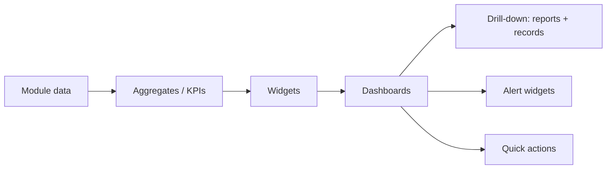
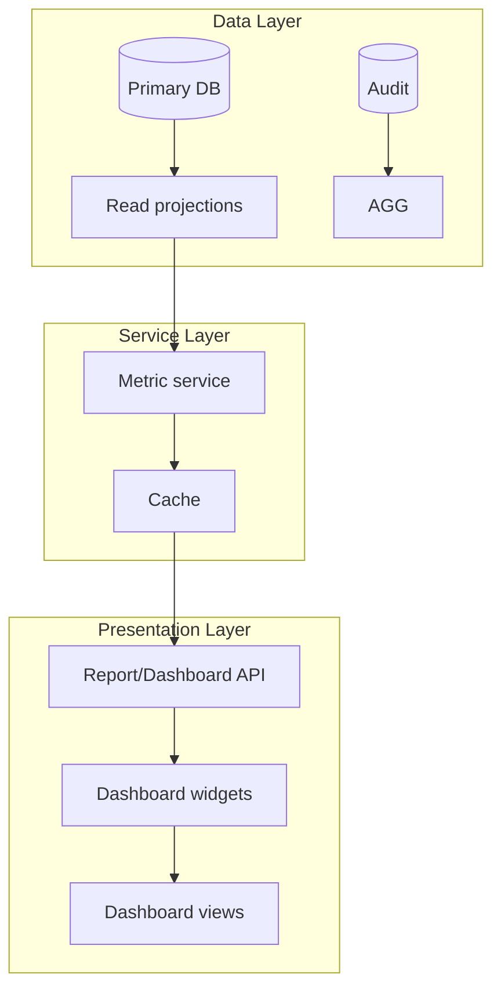
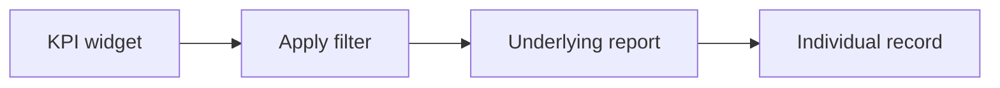
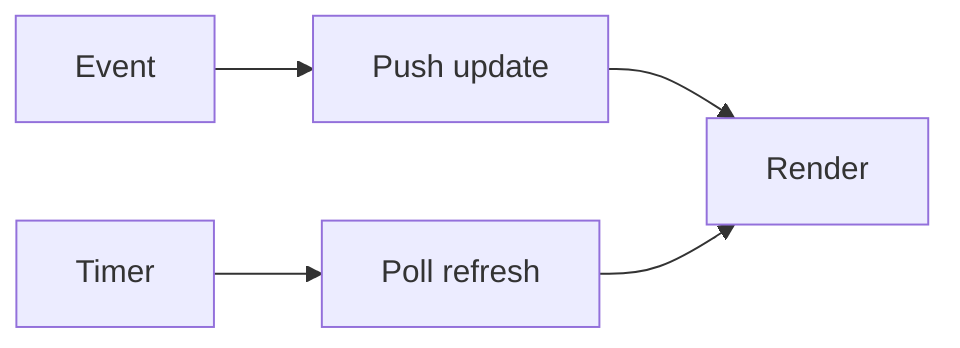

# Hospital Setup Module — Dashboards Specification

> **Document ID:** `hospital-setup/16-Dashboards`
> **Owner:** Engineering Lead / Analytics (hospital configuration)
> **Status:** 🔄 Pending approval (Phase 1 gate)
> **Version:** 1.0.0
> **Last updated:** 2026-08-06
> **Review cadence:** Re-reviewed at every phase gate and when the dashboard model changes.
>
> **Relationship:** This document specifies the **dashboard architecture** of the Hospital Setup module: the dashboards, widgets, metrics, and visualization used by administrators and executives to understand the hospital organization and configuration at a glance. It consumes the reports in [15-Reports](15-Reports.md), the data model in [06-ERD](06-ERD.md), and the UI/UX patterns in [08-UI](08-UI.md) and [09-UX](09-UX.md).

---

## Table of Contents

1. [Dashboard Overview](#1-dashboard-overview)
2. [Dashboard Objectives](#2-dashboard-objectives)
3. [Dashboard Architecture](#3-dashboard-architecture)
4. [User Personas](#4-user-personas)
5. [Executive Dashboard](#5-executive-dashboard)
6. [Facility Dashboard](#6-facility-dashboard)
7. [Department Dashboard](#7-department-dashboard)
8. [Administrator Dashboard](#8-administrator-dashboard)
9. [Operations Dashboard](#9-operations-dashboard)
10. [KPI Widgets](#10-kpi-widgets)
11. [Charts & Visualizations](#11-charts--visualizations)
12. [Filters & Drill-down](#12-filters--drill-down)
13. [Real-time Metrics](#13-real-time-metrics)
14. [Alert Widgets](#14-alert-widgets)
15. [Notification Widgets](#15-notification-widgets)
16. [Quick Actions](#16-quick-actions)
17. [Role-based Visibility](#17-role-based-visibility)
18. [Performance Considerations](#18-performance-considerations)
19. [Refresh Strategy](#19-refresh-strategy)
20. [Caching Strategy](#20-caching-strategy)
21. [Accessibility](#21-accessibility)
22. [Mobile Responsiveness](#22-mobile-responsiveness)
23. [Cross References](#23-cross-references)

---

## 1. Dashboard Overview

The Hospital Setup module provides **dashboards** that give administrators and executives immediate, at-a-glance insight into the hospital organization and configuration: structure health, assignment coverage, configuration completeness, and change/approval activity.

Dashboards are **read-only, aggregate views** over the module's data and reports. They surface KPIs, trends, alerts, and recent activity, with drill-down to underlying reports and records.

---

## 2. Dashboard Objectives

| # | Objective | Measured by |
| --- | --- | --- |
| DB-01 | Provide instant structure health | Structure KPIs visible |
| DB-02 | Surface assignment coverage | Coverage widgets |
| DB-03 | Show configuration completeness | Config widgets |
| DB-04 | Track change and approval activity | Activity widgets |
| DB-05 | Alert to anomalies and pending items | Alert widgets |
| DB-06 | Enable quick action | Quick actions present |
| DB-07 | Role-appropriate visibility | Per-role dashboard content |

---

## 3. Dashboard Architecture

### Architecture Components

| Component | Responsibility |
| --- | --- |
| Read projections | Pre-aggregated data for dashboards ([06-ERD](06-ERD.md) §19) |
| Metric service | Computes KPIs and metrics |
| Cache | Bounded, time-based cache of aggregates |
| Dashboard API | Serves widget data ([10-API](10-API.md)) |
| Widget renderer | Renders charts and cards ([08-UI](08-UI.md)) |

---

## 4. User Personas

Personas follow [09-UX](09-UX.md) §3 and [01-Business-Requirements](01-Business-Requirements.md) §4.

| Persona | Role | Primary dashboard |
| --- | --- | --- |
| Priya | System administrator | Administrator |
| Ana | Facility administrator | Facility / Operations |
| Marcus | Facility admin (view) | Facility (read) |
| Nina | Auditor | Administrator (audit view) |
| Executive | Leadership | Executive |

### Persona × Dashboard Matrix

| Persona | Executive | Facility | Department | Administrator | Operations |
| --- | :---: | :---: | :---: | :---: | :---: |
| Priya | · | ✓ | ✓ | ✓ | ✓ |
| Ana | · | ✓ | ✓ | · | ✓ |
| Marcus | · | ✓ | ✓ | · | ✓ (read) |
| Nina | · | · | · | ✓ (audit) | · |
| Executive | ✓ | · | · | · | · |

---

## 5. Executive Dashboard

| Aspect | Detail |
| --- | --- |
| Audience | Executive / leadership |
| Purpose | Strategic structure and activity overview |
| Widgets | Structure health KPI, assignment coverage, config completeness, change volume trend, approval efficiency |
| Drill-down | To facility/report level |
| Cadence | Near-real-time aggregate |

---

## 6. Facility Dashboard

| Aspect | Detail |
| --- | --- |
| Audience | Facility admin / view |
| Purpose | Facility structure and configuration status |
| Widgets | Structure summary, status distribution, recent changes, pending approvals, config completeness |
| Drill-down | To department/unit/record |
| Cadence | Near-real-time |

---

## 7. Department Dashboard

| Aspect | Detail |
| --- | --- |
| Audience | Facility admin |
| Purpose | Department-level structure and staffing |
| Widgets | Units by department, assignment coverage, department head, unit status |
| Drill-down | To unit/assignment |
| Cadence | Near-real-time |

---

## 8. Administrator Dashboard

| Aspect | Detail |
| --- | --- |
| Audience | System administrator, auditor |
| Purpose | Platform-wide structure, approvals, audit health |
| Widgets | Approval queue, pending changes, audit integrity, unauthorized attempts, anomaly alerts |
| Drill-down | To audit records |
| Cadence | Near-real-time |

---

## 9. Operations Dashboard

| Aspect | Detail |
| --- | --- |
| Audience | Facility/operations admin |
| Purpose | Operational structure and room/unit state |
| Widgets | Room inventory, unit status, bed capacity, assignment coverage |
| Drill-down | To room/unit |
| Cadence | Near-real-time |

---

## 10. KPI Widgets

| Widget | KPI | Source |
| --- | --- | --- |
| Structure Health | Active vs inactive nodes | [15-Reports](15-Reports.md) §14 |
| Assignment Coverage | % units with a primary | §14 |
| Configuration Completeness | % required config set | §14 |
| Change Volume | Changes over time | §14 |
| Approval Efficiency | Time to approval, approval rate | §14 |

### KPI Widget Definition

| Field | Example |
| --- | --- |
| KPI | Assignment Coverage |
| Value | 92% |
| Trend | ▲ +4% vs last month |
| Target | ≥ 95% |
| Sparkline | last 30 days |
| Link | coverage report |

---

## 11. Charts & Visualizations

| Chart | Use case |
| --- | --- |
| Stat card | Single KPI value |
| Bar chart | Counts by department/status |
| Line chart | Trends over time |
| Pie/donut | Status distribution |
| Heatmap | Coverage/health by unit |
| Tree/graph | Hierarchy visualization |

Visualizations follow the data-viz standards in [13-DESIGN-SYSTEM](../../13-DESIGN-SYSTEM.md) and [12-UI-UX-GUIDELINES](../../12-UI-UX-GUIDELINES.md).

---

## 12. Filters & Drill-down

| Aspect | Detail |
| --- | --- |
| Filters | Facility, department, unit, date range, status ([15-Reports](15-Reports.md) §18) |
| Drill-down | Widget → report → record |
| Context | Filters persist across drill-down |
| Reset | Clear filters returns to default view |

### Drill-down Flow

---

## 13. Real-time Metrics

| Aspect | Decision |
| --- | --- |
| What's real-time | Approval queue, pending changes, alerts, activity |
| What's cached | Aggregates, KPIs, trends |
| Mechanism | Event-driven updates via event bus ([02-SYSTEM-ARCHITECTURE](../../02-SYSTEM-ARCHITECTURE.md) §12) |
| Poll vs push | Push for high-activity; poll for low |
| Lag | Bounded (< 1 min for critical) |

---

## 14. Alert Widgets

| Alert | Trigger |
| --- | --- |
| Pending approval | An elevated change awaits |
| Structure issue | Node with active-children conflict, orphaned data |
| Unauthorized attempt | Denied access attempt |
| Configuration gap | Required config missing |
| Audit integrity | Integrity check failure ([13-Audit](13-Audit.md) §7) |

Alert severity follows [14-Notifications](14-Notifications.md) §7 (P0–P3).

---

## 15. Notification Widgets

| Widget | Content |
| --- | --- |
| Recent activity | Latest setup changes |
| Approvals | Approvals awaiting/in progress |
| Alerts | Active alerts by severity |
| Unread notifications | Count of unread ([14-Notifications](14-Notifications.md)) |

---

## 16. Quick Actions

| Action | Target |
| --- | --- |
| Add department/unit | Hierarchy tree ([08-UI](08-UI.md) S-04) |
| Assign staff | Staff assignment (S-06) |
| Approve pending change | Approval queue (S-09) |
| Run a report | Reports ([15-Reports](15-Reports.md)) |
| Manage config | Configuration (S-08) |

Quick actions respect the caller's permissions ([11-Permissions](11-Permissions.md)).

---

## 17. Role-based Visibility

| Role | Dashboards | Write actions |
| --- | --- | --- |
| System administrator | All | Yes |
| Facility administrator | Facility, Department, Operations | Yes (own) |
| Facility admin (view) | Facility, Department (read) | No |
| Auditor | Administrator (audit view) | No |
| Executive | Executive | No |

### Visibility Rules

| Widget/action | Visible to |
| --- | --- |
| Audit integrity | Sys admin, Auditor |
| Approval queue | Sys admin |
| Pending approvals | Facility admin (own) |
| Quick action (write) | Sys admin, Facility admin |
| KPI read | All authorized |

---

## 18. Performance Considerations

| Aspect | Decision |
| --- | --- |
| Aggregates | Pre-computed in read projections |
| Caching | Bounded, time-based |
| Pagination | Lists paginated ([10-API](10-API.md) §9) |
| Lazy load | Widgets load on view; below-fold deferred |
| Budget | Dashboard load within UI performance targets ([14-PERFORMANCE-STANDARDS](../../14-PERFORMANCE-STANDARDS.md) §6) |

---

## 19. Refresh Strategy

| Widget type | Refresh |
| --- | --- |
| Real-time (approvals, alerts, activity) | Event push |
| KPI aggregates | Time-based (e.g., 5 min) |
| Trends | Daily cache refresh |
| Manual | User-triggered refresh |

---

## 20. Caching Strategy

| Aspect | Decision |
| --- | --- |
| Cache store | Redis ([03-TECHNOLOGY-STACK](../../03-TECHNOLOGY-STACK.md) §4.5) |
| Scope | Per facility/tenant |
| TTL | Bounded per metric type |
| Invalidation | Event-driven on data change |
| Stale fallback | Serve cached while refreshing |

---

## 21. Accessibility

| Requirement | Application |
| --- | --- |
| WCAG 2.1 AA | All widgets accessible ([12-UI-UX-GUIDELINES](../../12-UI-UX-GUIDELINES.md) §4) |
| Not color-only | Charts use pattern + labels |
| Screen reader | Text alternatives for charts |
| Keyboard | Widgets keyboard-operable |
| Reduced motion | Motion honors preference |
| Contrast | Token-compliant ([13-DESIGN-SYSTEM](../../13-DESIGN-SYSTEM.md) §7) |

---

## 22. Mobile Responsiveness

| Aspect | Decision |
| --- | --- |
| Layout | Responsive; stacks on mobile ([08-UI](08-UI.md) §14) |
| Widgets | Reflow; KPIs as cards |
| Charts | Scrollable/rescaled |
| Real-time | Push notifications on mobile |
| Read-mostly | Mobile is read-primary for dashboards |

---

## 23. Cross References

| Reference | Relationship | Direction |
| --- | --- | --- |
| [README](README.md) | Module overview | Consumes |
| [01-Business-Requirements](01-Business-Requirements.md) | Requirements | Consumes |
| [06-ERD](06-ERD.md) | Read projections | Consumes |
| [08-UI](08-UI.md) | Dashboard screens/widgets | Consumes |
| [09-UX](09-UX.md) | UX patterns | Consumes |
| [10-API](10-API.md) | Dashboard API | Consumes |
| [11-Permissions](11-Permissions.md) | Role-based visibility | Consumes |
| [13-Audit](13-Audit.md) | Audit widgets | Consumes |
| [14-Notifications](14-Notifications.md) | Notification/alert widgets | Consumes |
| [15-Reports](15-Reports.md) | KPI reports / drill-down | Consumes |
| [00-MASTER-ROADMAP](../../00-MASTER-ROADMAP.md) | Phase sequencing | Consumes |
| [02-SYSTEM-ARCHITECTURE](../../02-SYSTEM-ARCHITECTURE.md) | Eventing, observability | Consumes |
| [03-TECHNOLOGY-STACK](../../03-TECHNOLOGY-STACK.md) | Redis cache | Consumes |
| [12-UI-UX-GUIDELINES](../../12-UI-UX-GUIDELINES.md) | Accessibility | Consumes |
| [13-DESIGN-SYSTEM](../../13-DESIGN-SYSTEM.md) | Charts and tokens | Consumes |
| [14-PERFORMANCE-STANDARDS](../../14-PERFORMANCE-STANDARDS.md) | Performance | Consumes |

---

*End of `docs/modules/hospital-setup/16-Dashboards.md`.*
