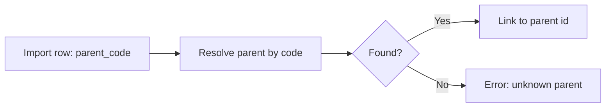
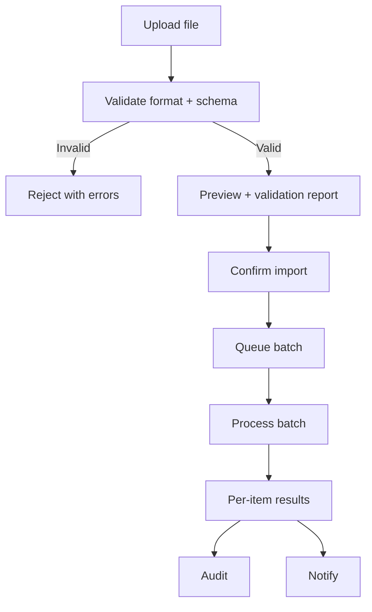
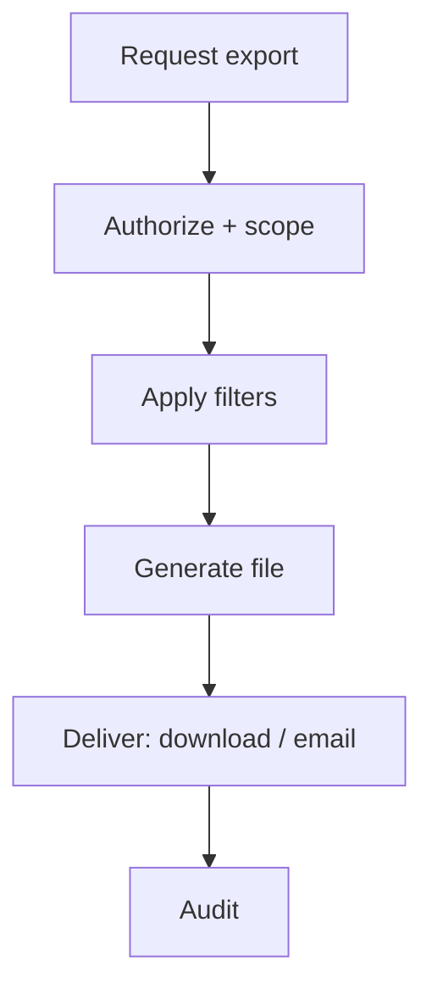
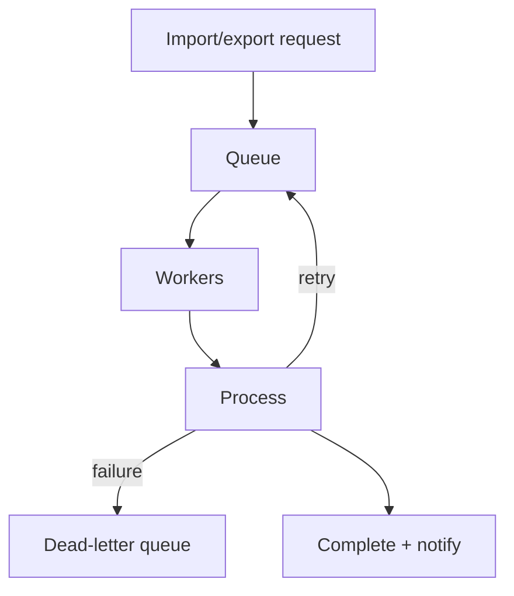

# Hospital Setup Module — Import & Export Specification

> **Document ID:** `hospital-setup/17-Import-Export`
> **Owner:** Engineering Lead (hospital configuration)
> **Status:** 🔄 Pending approval (Phase 1 gate)
> **Version:** 1.0.0
> **Last updated:** 2026-08-06
> **Review cadence:** Re-reviewed at every phase gate and when the import/export model changes.
>
> **Relationship:** This document specifies the **import and export architecture** of the Hospital Setup module: formats, mapping, validation, conflicts, workflows, and governance for moving setup data in and out of the system. It implements the data model in [04-Database-Tables](04-Database-Tables.md) and [06-ERD](06-ERD.md), the bulk operations in [10-API](10-API.md) §13, and the audit/notification/security standards in [13-Audit](13-Audit.md), [14-Notifications](14-Notifications.md), and [12-Security](12-Security.md).

---

## Table of Contents

1. [Purpose & Scope](#1-purpose--scope)
2. [Supported Import Formats](#2-supported-import-formats)
3. [Supported Export Formats](#3-supported-export-formats)
4. [Data Mapping Rules](#4-data-mapping-rules)
5. [Field Validation Rules](#5-field-validation-rules)
6. [Duplicate Detection Strategy](#6-duplicate-detection-strategy)
7. [Conflict Resolution Rules](#7-conflict-resolution-rules)
8. [Bulk Import Workflow](#8-bulk-import-workflow)
9. [Bulk Export Workflow](#9-bulk-export-workflow)
10. [Import Templates](#10-import-templates)
11. [Export Templates](#11-export-templates)
12. [Preview & Validation](#12-preview--validation)
13. [Error Handling](#13-error-handling)
14. [Rollback Strategy](#14-rollback-strategy)
15. [Audit Logging](#15-audit-logging)
16. [Notifications](#16-notifications)
17. [Security & Permissions](#17-security--permissions)
18. [Tenant Isolation](#18-tenant-isolation)
19. [Performance Considerations](#19-performance-considerations)
20. [Batch Processing](#20-batch-processing)
21. [Queue Processing](#21-queue-processing)
22. [Monitoring](#22-monitoring)
23. [Cross References](#23-cross-references)

---

## 1. Purpose & Scope

This document defines **how the Hospital Setup module imports and exports data** — moving facility structure, departments, units, rooms, staff assignments, reference data, and configuration into and out of the system.

**Scope:** import/export formats, mapping, validation, conflicts, workflows, and governance. **Out of scope:** the platform integration layer (see [18-Integrations](18-Integrations.md), next document) and reporting exports (see [15-Reports](15-Reports.md) §17).

### 1.1 Purpose

| Purpose | Description |
| --- | --- |
| Onboarding | Load existing hospital structure/reference data |
| Bulk maintenance | Large assignment/room loads |
| Migration | Move data between facilities/environments |
| Reporting | Export structure/assignments for external analysis |
| Backup/portability | Extract a snapshot |

---

## 2. Supported Import Formats

| Format | Use case | Notes |
| --- | --- | --- |
| CSV | Bulk loads (reference, assignments) | Flat, delimited |
| Excel (.xlsx) | Structured loads with headers | Multi-sheet supported |
| JSON | API-driven import | Structured, typed |
| ZIP (bundled) | Multi-file import | Combines above |

### Import Format Decision

| Data | CSV | Excel | JSON |
| --- | :---: | :---: | :---: |
| Reference values | ✓ | ✓ | ✓ |
| Departments/units | ✓ | ✓ | ✓ |
| Staff assignments | ✓ | ✓ | ✓ |
| Rooms | ✓ | ✓ | ✓ |
| Configuration | · | ✓ | ✓ |

---

## 3. Supported Export Formats

| Format | Use case | Notes |
| --- | --- | --- |
| CSV | Data interchange | Flat |
| Excel (.xlsx) | Analysis | Multi-sheet, totals |
| PDF | Formal/frozen view | Paginated ([15-Reports](15-Reports.md) §17) |
| JSON | API/portability | Structured |

---

## 4. Data Mapping Rules

Mapping translates external fields to canonical model fields ([06-ERD](06-ERD.md)).

| Source field | Target field | Mapping |
| --- | --- | --- |
| `code` | `code` | Direct |
| `name` | `name` | Direct |
| `type` | `facilityType`/`departmentType` | Enum map |
| `parent_code` | parent `id` | Resolve by code |
| `time_zone` | `timeZone` | IANA validation |
| `contact` | `primaryContact` | Object map |
| `start_date` | `effectiveFrom` | Date map |
| `status` | `status` | Enum map |

### Parent Resolution

---

## 5. Field Validation Rules

Validation mirrors [01-Business-Requirements](01-Business-Requirements.md) §8 and [10-API](10-API.md) §6.

| Field / rule | Validation |
| --- | --- |
| Required fields | Present and non-empty |
| Code format | ≤ 20 alphanumeric |
| Name length | ≤ 120 |
| Enum values | Must match allowed values |
| Dates | Valid; start ≤ end |
| Parent references | Resolvable within facility |
| Bed count | > 0 |
| Config keys | Known schema |
| Reference uniqueness | Category+code unique |

---

## 6. Duplicate Detection Strategy

| Strategy | Applies to | Behavior |
| --- | --- | --- |
| Exact match | Code uniqueness | Detect + flag |
| Fuzzy match | Name-based | Warn (future, [24-Future-Roadmap](24-Future-Roadmap.md)) |
| Idempotency | Re-run of import | Skip already-applied |

### Detection Decision

| Duplicate | Action |
| --- | --- |
| Same code, same facility | Conflict — reject/merge (see §7) |
| Same code, different facility | Allowed (facility-scoped) |
| Re-import of same file | Idempotent skip |
| Same reference category+code | Conflict — reject/merge |

---

## 7. Conflict Resolution Rules

| Conflict | Default action | Alternative |
| --- | --- | --- |
| Code already exists | Reject with report | Merge (update) if explicitly selected |
| Parent code ambiguous | Reject | Specify parent id |
| Status mismatch | Use import value (validated) | Keep existing |
| Date overlap (assignment) | Reject | Adjust dates |
| Config key unknown | Reject | Map to known key |

### Resolution Mode

| Mode | Behavior |
| --- | --- |
| Skip | Ignore conflicting rows; report |
| Update | Overwrite existing (approval for destructive) |
| Fail-fast | Abort on first conflict |
| Reject-list | Collect and report at end |

---

## 8. Bulk Import Workflow

### Import Steps

| Step | Action |
| --- | --- |
| 1 | Upload file |
| 2 | Validate format and schema |
| 3 | Preview + validation report |
| 4 | Confirm import (permissions) |
| 5 | Queue and process in batch |
| 6 | Report success/failure per item |
| 7 | Audit and notify |

---

## 9. Bulk Export Workflow

### Export Steps

| Step | Action |
| --- | --- |
| 1 | Request export with filters |
| 2 | Authorize + tenant scope |
| 3 | Generate in chosen format |
| 4 | Deliver (download/email) |
| 5 | Audit and notify |

---

## 10. Import Templates

| Template | Purpose | Required columns |
| --- | --- | --- |
| Departments | Load departments | code, name, type, location_code |
| Units | Load units | code, name, department_code, unit_type |
| Rooms | Load rooms | room_code, unit_code, bed_count |
| Staff assignments | Load assignments | staff_id, unit_code, type, from, to |
| Reference values | Load vocabularies | category, code, label, sort_order |
| Configuration | Load config | config_key, config_value |

### Template Header Example

| Column | Type | Required | Notes |
| --- | --- | --- | --- |
| `code` | text | Yes | Unique within scope |
| `name` | text | Yes | ≤ 120 |
| `location_code` | text | Yes | Must exist |
| `type` | enum | Yes | clinical/admin |

---

## 11. Export Templates

| Template | Content | Format |
| --- | --- | --- |
| Structure snapshot | Full hierarchy | Excel/CSV |
| Assignment list | Active assignments | Excel/CSV |
| Reference catalog | Reference values | CSV |
| Configuration snapshot | Config keys | Excel/JSON |
| Audit export | Change log | CSV/PDF |

---

## 12. Preview & Validation

| Aspect | Decision |
| --- | --- |
| Preview | Rendered before confirm |
| Validation report | Per-row errors/warnings |
| Row counts | Expected vs valid vs invalid |
| Drill-down | Click a row for detail |
| Confirm | Only after preview reviewed |

### Preview Report

| Column | Detail |
| --- | --- |
| Total rows | 100 |
| Valid | 92 |
| Warnings | 4 |
| Errors | 4 |
| Status | Ready / Needs review |

---

## 13. Error Handling

| Error | Handling |
| --- | --- |
| Format error | Reject file with reason |
| Row validation error | Mark row invalid; continue |
| Unknown parent | Row error with detail |
| Duplicate conflict | Row error / resolution mode |
| Partial batch failure | Report per-item; no partial commit ([05-DATABASE-ARCHITECTURE](../../05-DATABASE-ARCHITECTURE.md) §6) |
| Out-of-scope data | Row error |

### Error Report

| Column | Detail |
| --- | --- |
| Row | Original row number |
| Field | Failing field |
| Error code | Machine-readable |
| Message | Human-readable |
| Resolution | Suggested fix |

---

## 14. Rollback Strategy

| Aspect | Decision |
| --- | --- |
| Before import | Snapshot of affected scope |
| Failed import | Rollback to snapshot; no partial state |
| Approved destructive update | Compensating corrective change |
| Export | Read-only; no rollback needed |
| Audit | Rollback events recorded |

Rollback follows [02-Workflow](02-Workflow.md) §22.

---

## 15. Audit Logging

Import/export is audited per [13-Audit](13-Audit.md).

| Event | Records |
| --- | --- |
| `setup.import.submitted` | File, count, actor |
| `setup.import.completed` | Success/failure counts |
| `setup.import.rolled_back` | Rollback reason |
| `setup.export.requested` | Filters, format, actor |
| `setup.export.completed` | File delivery |

---

## 16. Notifications

| Notification | Recipient | Channel |
| --- | --- | --- |
| Import completed | Requester | In-app + email |
| Import has errors | Requester | In-app |
| Import rolled back | Requester + admin | Email |
| Export ready | Requester | In-app + email |
| Pending approval (destructive import) | Approver | Email |

Notification behavior follows [14-Notifications](14-Notifications.md).

---

## 17. Security & Permissions

| Aspect | Decision |
| --- | --- |
| Import permission | `hospital:configure` ([11-Permissions](11-Permissions.md)) |
| Export permission | `hospital:read` (data), `audit:read` (audit) |
| Elevated import | Destructive/mass updates require approval |
| File scanning | Malware scan on upload |
| No sensitive data | No PHI, secrets in files |
| MFA | For destructive imports |

---

## 18. Tenant Isolation

| Aspect | Decision |
| --- | --- |
| Scope | Imports/exports scoped to caller's tenant/facility |
| Cross-tenant | Forbidden ([09-MULTI-TENANCY](../../09-MULTI-TENANCY.md)) |
| Parent resolution | Within facility only |
| Verification | Isolation tested ([15-TESTING-STANDARDS](../../15-TESTING-STANDARDS.md) §11) |

---

## 19. Performance Considerations

| Aspect | Decision |
| --- | --- |
| Large files | Processed in batches, not in memory |
| Timeouts | Large jobs async with notification |
| Streaming | Streamed where possible |
| Budget | Batch throughput within limits ([14-PERFORMANCE-STANDARDS](../../14-PERFORMANCE-STANDARDS.md)) |
| Parallelism | Bounded workers per batch |

---

## 20. Batch Processing

| Aspect | Decision |
| --- | --- |
| Batch size | Configurable (e.g., 1000 rows) |
| Commit | Per-batch transaction |
| Idempotency | Re-run safe ([10-API](10-API.md) §15) |
| Progress | Reported as batches complete |
| Failure | Per-batch rollback + continue |

---

## 21. Queue Processing

| Aspect | Decision |
| --- | --- |
| Durable | Queue survives restart |
| Ordered | Per tenant/correlation |
| Idempotent | Dedupe on job id |
| Backpressure | Bounded concurrency |

---

## 22. Monitoring

| Signal | Alert |
| --- | --- |
| Job success rate | Below target |
| Queue depth | Backlog |
| Failure rate | Spike |
| Import error ratio | High errors |
| Rollback rate | Unexpected |
| Dead-letter depth | Non-zero |

Monitoring follows [02-SYSTEM-ARCHITECTURE](../../02-SYSTEM-ARCHITECTURE.md) §14.

---

## 23. Cross References

| Reference | Relationship | Direction |
| --- | --- | --- |
| [README](README.md) | Module overview | Consumes |
| [01-Business-Requirements](01-Business-Requirements.md) | Requirements | Consumes |
| [02-Workflow](02-Workflow.md) | Rollback workflow | Consumes |
| [04-Database-Tables](04-Database-Tables.md) | Data definitions | Consumes |
| [06-ERD](06-ERD.md) | Data mapping targets | Consumes |
| [10-API](10-API.md) | Bulk operations | Consumes |
| [11-Permissions](11-Permissions.md) | Import/export permissions | Consumes |
| [12-Security](12-Security.md) | Security controls | Consumes |
| [13-Audit](13-Audit.md) | Audit logging | Consumes |
| [14-Notifications](14-Notifications.md) | Notifications | Consumes |
| [15-Reports](15-Reports.md) | Export formats | Consumes |
| [00-MASTER-ROADMAP](../../00-MASTER-ROADMAP.md) | Phase sequencing | Consumes |
| [02-SYSTEM-ARCHITECTURE](../../02-SYSTEM-ARCHITECTURE.md) | Eventing, observability | Consumes |
| [05-DATABASE-ARCHITECTURE](../../05-DATABASE-ARCHITECTURE.md) | Transactions, outbox | Consumes |
| [09-MULTI-TENANCY](../../09-MULTI-TENANCY.md) | Tenant isolation | Consumes |
| [14-PERFORMANCE-STANDARDS](../../14-PERFORMANCE-STANDARDS.md) | Performance | Consumes |
| [15-TESTING-STANDARDS](../../15-TESTING-STANDARDS.md) | Isolation testing | Consumes |
| [18-Integrations](18-Integrations.md) | Integration layer | Consumes |

---

*End of `docs/modules/hospital-setup/17-Import-Export.md`.*
