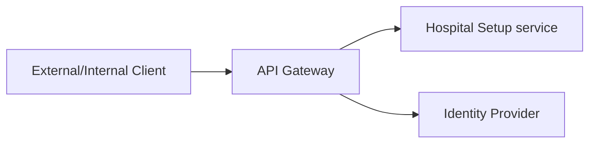
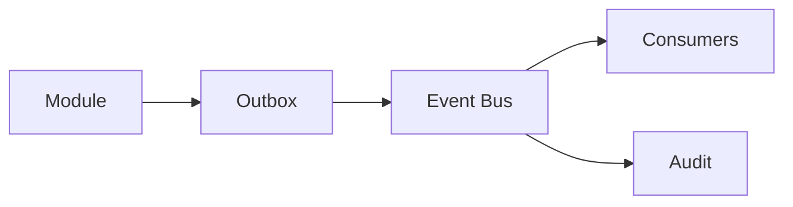

# Hospital Setup Module — Integrations Specification

> **Document ID:** `hospital-setup/18-Integrations`
> **Owner:** Engineering Lead (integration) / hospital configuration
> **Status:** 🔄 Pending approval (Phase 1 gate)
> **Version:** 1.0.0
> **Last updated:** 2026-08-06
> **Review cadence:** Re-reviewed at every phase gate and when the integration model changes.
>
> **Relationship:** This document specifies the **integration architecture** of the Hospital Setup module: how it connects to internal modules and external systems, and how it consumes standards-based healthcare data. It follows the integration architecture in [02-SYSTEM-ARCHITECTURE](../../02-SYSTEM-ARCHITECTURE.md) §11, the eventing model in §12, and the security/audit standards in [12-Security](12-Security.md) and [13-Audit](13-Audit.md).

---

## Table of Contents

1. [Purpose & Scope](#1-purpose--scope)
2. [Integration Principles](#2-integration-principles)
3. [Internal Integrations](#3-internal-integrations)
4. [External Integrations](#4-external-integrations)
5. [API Gateway Integration](#5-api-gateway-integration)
6. [Event Bus Integration](#6-event-bus-integration)
7. [HL7 v2 Integration](#7-hl7-v2-integration)
8. [HL7 FHIR Integration](#8-hl7-fhir-integration)
9. [DICOM Integration](#9-dicom-integration)
10. [ICD-10 / ICD-11](#10-icd-10--icd-11)
11. [SNOMED CT](#11-snomed-ct)
12. [LOINC](#12-loinc)
13. [ABDM Integration](#13-abdm-integration)
14. [NABH Compliance](#14-nabh-compliance)
15. [LDAP / Active Directory](#15-ldap--active-directory)
16. [Email Integration](#16-email-integration)
17. [SMS Integration](#17-sms-integration)
18. [WhatsApp Integration](#18-whatsapp-integration)
19. [Payment Gateway Integration](#19-payment-gateway-integration)
20. [Queue & Retry Strategy](#20-queue--retry-strategy)
21. [Error Handling](#21-error-handling)
22. [Security](#22-security)
23. [Audit](#23-audit)
24. [Monitoring](#24-monitoring)
25. [Cross References](#25-cross-references)

---

## 1. Purpose & Scope

This document defines **how the Hospital Setup module integrates** with other internal modules and external systems. It governs the consumption of standards-based healthcare data (HL7, FHIR, terminology standards) and the connection to identity, messaging, and payment infrastructure.

**Scope:** integration types, protocols, data flows, and governance for the Hospital Setup module. **Out of scope:** the platform integration gateway implementation (see [02-SYSTEM-ARCHITECTURE](../../02-SYSTEM-ARCHITECTURE.md) §11), and other modules' integrations.

### 1.1 Applicability Note

The Hospital Setup module manages **organizational and configuration data** — not clinical encounters, images, or billing transactions. Several of the standards listed in this document (HL7 v2, DICOM, ICD-10/11, SNOMED CT, LOINC, ABDM) are **primarily consumed by clinical modules**, not by setup. Where an item is **not applicable to this module in v1**, this is stated explicitly rather than invented, consistent with the principle of using previous documentation as source of truth.

---

## 2. Integration Principles

| # | Principle | Application |
| --- | --- | --- |
| I-01 | **Contract-first** | Integrations defined by schema before code. |
| I-02 | **Standards-based** | Use healthcare and web standards over proprietary formats. |
| I-03 | **Loose coupling** | Integrate via events/messages, not direct calls. |
| I-04 | **Resilient** | Queues, retries, and dead-lettering for delivery. |
| I-05 | **Tenant-scoped** | No cross-tenant data leakage. |
| I-06 | **Audited** | All integrations audited ([13-Audit](13-Audit.md)). |
| I-07 | **Secure** | AuthN, encryption, least privilege ([12-Security](12-Security.md)). |

---

## 3. Internal Integrations

Internal modules consumed by or consuming the Hospital Setup module (from [06-ERD](06-ERD.md) §13).

| Module | Direction | Nature |
| --- | --- | --- |
| IAM ([06-AUTHENTICATION](../../06-AUTHENTICATION.md)) | Outbound | Consumes assignments for access scope |
| Staff master (Registry) | Inbound | Provides `staff_id` references |
| Scheduling | Outbound | Consumes hierarchy |
| EHR / clinical | Outbound | Consumes hierarchy |
| Billing / finance | Outbound | Consumes hierarchy |
| Inventory / ops | Outbound | Consumes structure |
| Notification service | Outbound | Sends notifications ([14-Notifications](14-Notifications.md)) |
| Event bus | Bidirectional | Propagates structure changes |

---

## 4. External Integrations

External systems connected for setup-related data.

| System | Purpose | Protocol |
| --- | --- | --- |
| Identity provider (LDAP/AD/SSO) | Staff/operator authentication | OIDC/LDAP ([15-LDAP](#15-ldap--active-directory)) |
| Email/SMS/WhatsApp providers | Notifications | Provider APIs ([16-Email](#16-email-integration)) |
| Reference data sources | Controlled vocabularies | JSON/terminology services |
| Payment gateway | (See applicability in §19) | PCI-compliant API |

External integrations use the platform integration gateway ([02-SYSTEM-ARCHITECTURE](../../02-SYSTEM-ARCHITECTURE.md) §11).

---

## 5. API Gateway Integration

All integrations enter through the API gateway ([10-API](10-API.md)).

| Aspect | Decision |
| --- | --- |
| Entry | All requests via gateway |
| AuthN/Z | Gateway enforces authentication + coarse authorization |
| Rate limit | Per client/tenant ([10-API](10-API.md) §14) |
| Routing | Routes to module services |
| Observability | Traces, metrics, logs |

---

## 6. Event Bus Integration

The module emits and consumes events on the event bus ([02-SYSTEM-ARCHITECTURE](../../02-SYSTEM-ARCHITECTURE.md) §12).

| Event | Direction | Consumer |
| --- | --- | --- |
| `setup.facility_provisioned` | Outbound | Consumers |
| `setup.hierarchy.changed` | Outbound | Scheduling, EHR, Billing |
| `setup.assignment.scope_changed` | Outbound | IAM |
| `setup.config.changed` | Outbound | Consumers |
| Staff reference changes | Inbound | Module (from Registry) |

### Event Bus Flow

---

## 7. HL7 v2 Integration

| Aspect | Decision |
| --- | --- |
| Relevance to setup | **Not applicable in v1** — HL7 v2 carries clinical messages (ADT, orders, results) consumed by clinical modules, not by hospital configuration. |
| Reference | If the platform consumes HL7 v2, it is handled by the EHR/integration modules, not the setup module. |
| Future | Evaluated in [24-Future-Roadmap](24-Future-Roadmap.md) only if setup consumes ADT for structure-derived routing. |

---

## 8. HL7 FHIR Integration

| Aspect | Decision |
| --- | --- |
| Relevance | **Partially applicable** — FHIR Organization/Location/Practitioner resources map to the setup hierarchy. |
| Mapping | FHIR `Organization` ↔ facility/location; `Location` ↔ location/unit; `PractitionerRole` ↔ assignment. |
| Direction | Potential export/import of organization structure via FHIR. |
| Standard | FHIR R4 ([02-SYSTEM-ARCHITECTURE](../../02-SYSTEM-ARCHITECTURE.md) §11). |
| In v1 | Optional; capability-based. |

### FHIR Mapping

| FHIR resource | Setup entity |
| --- | --- |
| `Organization` | facility / facility_location |
| `Location` | unit / room |
| `PractitionerRole` | staff_assignment |
| `Practitioner` | staff (Registry) |

---

## 9. DICOM Integration

| Aspect | Decision |
| --- | --- |
| Relevance | **Not applicable to setup** — DICOM carries medical imaging, consumed by the imaging/radiology module. |
| Reference | The setup module provides unit/location structure that imaging may reference, but does not itself integrate DICOM. |

---

## 10. ICD-10 / ICD-11

| Aspect | Decision |
| --- | --- |
| Relevance | **Not applicable to setup data in v1** — ICD codes classify diagnoses/encounters, consumed by clinical/billing modules. |
| Reference | If reference-data management later needs to include diagnosis code sets, this is evaluated under [17-Import-Export](17-Import-Export.md) reference data, not direct integration. |

---

## 11. SNOMED CT

| Aspect | Decision |
| --- | --- |
| Relevance | **Not applicable to setup in v1** — SNOMED CT is a clinical terminology consumed by clinical modules. |
| Reference | The setup module may reference terminology data but does not integrate SNOMED directly. |

---

## 12. LOINC

| Aspect | Decision |
| --- | --- |
| Relevance | **Not applicable to setup in v1** — LOINC codes laboratory observations, consumed by the lab module. |
| Reference | Setup manages organizational structure, not lab observation coding. |

---

## 13. ABDM Integration

| Aspect | Decision |
| --- | --- |
| Relevance | **Not applicable to setup data in v1** — ABDM (Ayushman Bharat Digital Mission) connects patient/clinical identity and records. |
| Reference | Where the platform implements ABDM, it is in the patient/clinical modules. Setup provides facility context only. |
| Future | Evaluated in [24-Future-Roadmap](24-Future-Roadmap.md). |

---

## 14. NABH Compliance

| Aspect | Decision |
| --- | --- |
| Relevance | **Applicable** — NABH (National Accreditation Board for Hospitals) requires documented organizational structure and governance. |
| Contribution | Setup structure/compliance reports evidence NABH requirements ([15-Reports](15-Reports.md) §7). |
| Reference | Compliance matrix in [00-MASTER-ROADMAP](../../00-MASTER-ROADMAP.md) §15. |
| Audit | Setup audit trail supports accreditation evidence ([13-Audit](13-Audit.md)). |

---

## 15. LDAP / Active Directory

| Aspect | Decision |
| --- | --- |
| Relevance | **Applicable** — operator authentication may integrate with LDAP/Active Directory. |
| Model | OIDC federation; setup does not store credentials ([06-AUTHENTICATION](../../06-AUTHENTICATION.md)). |
| Provisioning | Staff/operators provisioned by identity provider. |
| Scope | Access scope derived from assignments ([11-Permissions](11-Permissions.md)). |

---

## 16. Email Integration

| Aspect | Decision |
| --- | --- |
| Purpose | Approval and confirmation notifications ([14-Notifications](14-Notifications.md) §6). |
| Provider | Platform email provider via notification service. |
| Reliability | Retry with backoff ([14-Notifications](14-Notifications.md) §11). |
| Security | No secrets/PHI in email. |
| Templates | Per [14-Notifications](14-Notifications.md) §8. |

---

## 17. SMS Integration

| Aspect | Decision |
| --- | --- |
| Purpose | P0/P1 alerts ([14-Notifications](14-Notifications.md) §6). |
| Provider | Platform SMS provider. |
| Reliability | Retry + escalation ([14-Notifications](14-Notifications.md) §10). |
| Opt-out | Honor recipient preferences. |
| Security | No sensitive content. |

---

## 18. WhatsApp Integration

| Aspect | Decision |
| --- | --- |
| Relevance | **Not in v1** for setup notifications — WhatsApp business messaging is evaluated as a future notification channel. |
| Reference | Follows the same channel-adapter pattern as email/SMS ([14-Notifications](14-Notifications.md) §3). |
| Future | [25-Future-Roadmap](25-Future-Roadmap.md). |

---

## 19. Payment Gateway Integration

| Aspect | Decision |
| --- | --- |
| Relevance | **Not applicable to setup** — payments are handled by the Billing/Finance module, not hospital configuration. |
| Reference | Setup provides the facility/tenant context that billing uses; it does not integrate payment gateways. |

---

## 20. Queue & Retry Strategy

| Aspect | Decision |
| --- | --- |
| Queue | Durable queue for integration messages ([17-Import-Export](17-Import-Export.md) §21). |
| Retry | Exponential backoff with jitter. |
| Max attempts | Configurable (default 3). |
| Ordering | Per correlation/tenant. |
| Dead-letter | Final failures to DLQ + alert. |
| Idempotency | Dedupe on message id. |

---

## 21. Error Handling

| Error | Handling |
| --- | --- |
| Unreachable system | Retry with backoff |
| Invalid message | Reject to DLQ + log |
| Contract violation | Schema validation error |
| AuthN failure | Log + alert; no data leak |
| Out-of-scope | Reject (tenant guard) |
| Partial integration | Report; no partial commit ([05-DATABASE-ARCHITECTURE](../../05-DATABASE-ARCHITECTURE.md) §6) |

---

## 22. Security

| Control | Application |
| --- | --- |
| AuthN | OIDC, mTLS for service-to-service ([12-Security](12-Security.md)) |
| Encryption | TLS in transit; at-rest encryption |
| Least privilege | Scoped service identities |
| Secrets | Central secret manager ([12-Security](12-Security.md) §9) |
| Tenant isolation | No cross-tenant data ([09-MULTI-TENANCY](../../09-MULTI-TENANCY.md)) |
| No PHI | Setup integrations carry organizational data |

---

## 23. Audit

All integrations are audited ([13-Audit](13-Audit.md)).

| Event | Records |
| --- | --- |
| `setup.integration.sent` | Outbound message |
| `setup.integration.received` | Inbound message |
| `setup.integration.failed` | Failure reason |
| `setup.integration.delivered` | Delivery confirmation |

---

## 24. Monitoring

| Signal | Alert |
| --- | --- |
| Integration success rate | Below target |
| Queue depth | Backlog |
| Dead-letter depth | Non-zero |
| Retry rate | Spike |
| Latency | Above SLA |

Monitoring follows [02-SYSTEM-ARCHITECTURE](../../02-SYSTEM-ARCHITECTURE.md) §14.

---

## 25. Cross References

| Reference | Relationship | Direction |
| --- | --- | --- |
| [README](README.md) | Module overview | Consumes |
| [01-Business-Requirements](01-Business-Requirements.md) | Requirements | Consumes |
| [02-Workflow](02-Workflow.md) | Workflows | Consumes |
| [06-ERD](06-ERD.md) | Cross-module relationships | Consumes |
| [10-API](10-API.md) | API gateway | Consumes |
| [11-Permissions](11-Permissions.md) | Permissions | Consumes |
| [12-Security](12-Security.md) | Security controls | Consumes |
| [13-Audit](13-Audit.md) | Audit | Consumes |
| [14-Notifications](14-Notifications.md) | Notification channels | Consumes |
| [17-Import-Export](17-Import-Export.md) | Queue/data exchange | Consumes |
| [00-MASTER-ROADMAP](../../00-MASTER-ROADMAP.md) | Compliance (NABH) | Consumes |
| [02-SYSTEM-ARCHITECTURE](../../02-SYSTEM-ARCHITECTURE.md) | Integration + eventing | Consumes |
| [03-TECHNOLOGY-STACK](../../03-TECHNOLOGY-STACK.md) | Technology | Consumes |
| [05-DATABASE-ARCHITECTURE](../../05-DATABASE-ARCHITECTURE.md) | Transactions, outbox | Consumes |
| [06-AUTHENTICATION](../../06-AUTHENTICATION.md) | AuthN/Z, LDAP | Consumes |
| [09-MULTI-TENANCY](../../09-MULTI-TENANCY.md) | Tenant isolation | Consumes |

---

*End of `docs/modules/hospital-setup/18-Integrations.md`.*
