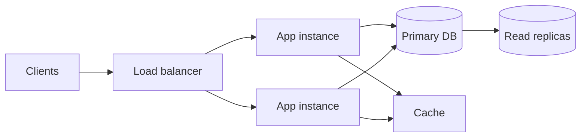
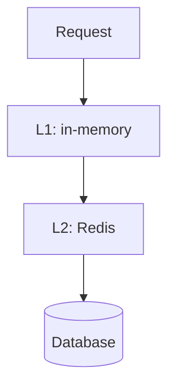
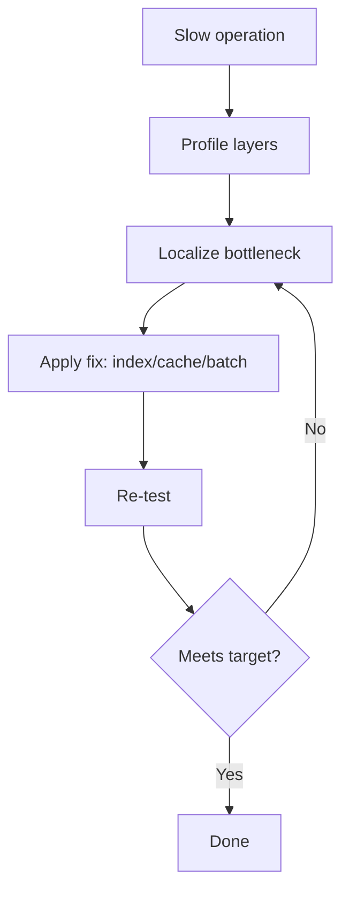

# Hospital Setup Module — Performance Specification

> **Document ID:** `hospital-setup/19-Performance`
> **Owner:** Engineering Lead (performance) / hospital configuration
> **Status:** 🔄 Pending approval (Phase 1 gate)
> **Version:** 1.0.0
> **Last updated:** 2026-08-06
> **Review cadence:** Re-reviewed at every phase gate and when performance targets change.
>
> **Relationship:** This document defines the **performance architecture** of the Hospital Setup module: objectives, targets, strategies, and monitoring for response time, throughput, scalability, and resource use. It implements the platform performance standards in [14-PERFORMANCE-STANDARDS](../../14-PERFORMANCE-STANDARDS.md) and applies the architecture in [03-Database](03-Database.md) and [06-ERD](06-ERD.md).

---

## Table of Contents

1. [Purpose & Scope](#1-purpose--scope)
2. [Performance Objectives](#2-performance-objectives)
3. [Performance Principles](#3-performance-principles)
4. [Response Time Targets](#4-response-time-targets)
5. [Throughput Targets](#5-throughput-targets)
6. [Scalability Strategy](#6-scalability-strategy)
7. [Concurrency Model](#7-concurrency-model)
8. [Database Performance](#8-database-performance)
9. [Query Optimization](#9-query-optimization)
10. [Indexing Strategy](#10-indexing-strategy)
11. [Caching Strategy](#11-caching-strategy)
12. [Queue Performance](#12-queue-performance)
13. [API Performance](#13-api-performance)
14. [Dashboard Performance](#14-dashboard-performance)
15. [Report Performance](#15-report-performance)
16. [Import Performance](#16-import-performance)
17. [Export Performance](#17-export-performance)
18. [Monitoring Metrics](#18-monitoring-metrics)
19. [Alert Thresholds](#19-alert-thresholds)
20. [Capacity Planning](#20-capacity-planning)
21. [Performance Testing](#21-performance-testing)
22. [Bottleneck Analysis](#22-bottleneck-analysis)
23. [Optimization Strategy](#23-optimization-strategy)
24. [Cross References](#24-cross-references)

---

## 1. Purpose & Scope

This document defines **how the Hospital Setup module meets its performance targets**: the measurable objectives for response time and throughput, the strategies for scalability and concurrency, and the monitoring that verifies them.

**Scope:** performance of the module's read/write paths, API, database, dashboards, reports, and import/export. **Out of scope:** platform-wide infrastructure performance (see [14-PERFORMANCE-STANDARDS](../../14-PERFORMANCE-STANDARDS.md) and [02-SYSTEM-ARCHITECTURE](../../02-SYSTEM-ARCHITECTURE.md) §16).

### 1.1 Performance Profile

The Hospital Setup module is **low-write, moderate-read, and low-volume** relative to clinical modules. Its critical performance concern is **fast, consistent reads of the hierarchy and configuration** for operators and dashboards, plus **reliable bulk import/export** for onboarding and maintenance.

---

## 2. Performance Objectives

| # | Objective | Measured by |
| --- | --- | --- |
| PF-01 | Sub-second interactive reads | p95 read latency |
| PF-02 | Stable throughput under concurrency | Throughput per second |
| PF-03 | Scalable read path | Linear scaling with replicas/cache |
| PF-04 | Efficient bulk processing | Import/export throughput |
| PF-05 | Bounded resource use | CPU/memory/IO budgets |
| PF-06 | Observable performance | Metrics + alerts |

---

## 3. Performance Principles

| # | Principle | Application |
| --- | --- | --- |
| P-01 | **Measure first** | Baseline before optimizing ([14-PERFORMANCE-STANDARDS](../../14-PERFORMANCE-STANDARDS.md)). |
| P-02 | **Index the hot path** | Indexes on WHERE/JOIN/ORDER columns. |
| P-03 | **Cache reads** | Cache stable aggregates and reference data. |
| P-04 | **Avoid N+1** | Batch/join; no per-row queries ([04-CODING-STANDARDS](../../04-CODING-STANDARDS.md) §11). |
| P-05 | **Project for reads** | Heavy reads from projections/read replicas ([06-ERD](06-ERD.md) §19). |
| P-06 | **Bound work** | Paginate, limit, and time out. |
| P-07 | **Fail predictably** | Degrade gracefully under load. |

---

## 4. Response Time Targets

Targets align with [14-PERFORMANCE-STANDARDS](../../14-PERFORMANCE-STANDARDS.md) §6.

| Operation | Target (p95) |
| --- | --- |
| Read facility/hierarchy node | < 200 ms |
| List nodes (paginated) | < 400 ms |
| Create/update node | < 500 ms |
| Deactivate (with approval) | < 500 ms |
| Reference value lookup | < 150 ms |
| Configuration read | < 150 ms |
| Dashboard load | < 2.5 s LCP ([16-Dashboards](16-Dashboards.md) §18) |
| Report generation (small) | < 5 s |
| Import/export job submit | < 500 ms |

### Response Time Budget

| Layer | Budget share |
| --- | --- |
| Network/gateway | 15% |
| Application/service | 35% |
| Database | 40% |
| Serialization | 10% |

---

## 5. Throughput Targets

| Operation | Target |
| --- | --- |
| Read requests | 100+ RPS per instance |
| Write requests | 10+ WPS per instance |
| Reference lookups | 500+ RPS (cached) |
| Audit writes | 1000+/min (append-only) |
| Import rows | 1000+ rows/min per batch |
| Export rows | 1000+ rows/min per batch |

---

## 6. Scalability Strategy

| Aspect | Decision |
| --- | --- |
| Read scaling | Read replicas + cache ([03-Database](03-Database.md) §4) |
| Write scaling | Single primary; scale via partitioning of audit |
| Stateless services | Horizontal scaling of app instances |
| Queue | Scales with workers ([17-Import-Export](17-Import-Export.md) §21) |
| Modular monolith | Extract services only when evidenced ([02-SYSTEM-ARCHITECTURE](../../02-SYSTEM-ARCHITECTURE.md) §4) |

### Scalability Model

---

## 7. Concurrency Model

| Aspect | Decision |
| --- | --- |
| Reads | Concurrent, read replicas + cache |
| Writes | Transactional, short-lived ([05-DATABASE-ARCHITECTURE](../../05-DATABASE-ARCHITECTURE.md) §6) |
| Isolation | Read Committed default; Serializable for critical ([03-Database](03-Database.md) §6) |
| Optimistic | Version check on long-lived edits |
| Connection pooling | Sized and monitored ([03-Database](03-Database.md) §7) |
| Backpressure | Bounded concurrency on bulk jobs |

---

## 8. Database Performance

| Aspect | Decision |
| --- | --- |
| Connection pooling | Sized per instance; no churn |
| Autovacuum | Tuned for steady-state ([03-Database](03-Database.md) §7) |
| Partitioning | Audit partitioned by time ([04-Database-Tables](04-Database-Tables.md) §12.5) |
| Read replicas | Heavy reads off primary |
| Warm pool | Pools for dashboard/report reads |
| Budget | p95 sub-second OLTP reads ([03-Database](03-Database.md) §7) |

---

## 9. Query Optimization

| Rule | Application |
| --- | --- |
| EXPLAIN/ANALYZE | Slow-query analysis ([03-Database](03-Database.md) §7) |
| No N+1 | Batch/join hierarchy walks |
| Parameterized | Prepared statements |
| Projection | Select needed columns only |
| Pagination | Keyset for large lists ([10-API](10-API.md) §9) |
| Index on hot columns | WHERE/JOIN/ORDER ([06-ERD](06-ERD.md) §15) |

---

## 10. Indexing Strategy

Indexes follow [04-Database-Tables](04-Database-Tables.md) and [03-Database](03-Database.md) §7.

| Table | Key indexes |
| --- | --- |
| `facility` | PK, unique (tenant, code) |
| `facility_location` | PK, unique (facility, code), ix facility |
| `department` | PK, unique (location, code), ix (facility, location) |
| `unit` | PK, unique (department, code), ix department |
| `room` | PK, unique (unit, room_code), ix unit |
| `staff_assignment` | PK, ix staff/status, ix unit, ix department, partial-unique primary |
| `reference_value` | PK, unique (facility, category, code), ix (facility, category) |
| `hospital_config` | PK, unique (facility, config_key) |
| `setup_change_audit` | PK, ix (facility, occurred_at), ix (tenant, occurred_at) |

### Index Rules

| Rule | Detail |
| --- | --- |
| Cover hot queries | Index WHERE/JOIN/ORDER |
| Avoid over-indexing | Indexes cost writes; match to load |
| Partial unique | For single-active-primary ([06-ERD](06-ERD.md) §15) |
| Maintenance | Monitor unused/redundant indexes |

---

## 11. Caching Strategy

| Aspect | Decision |
| --- | --- |
| Cache store | Redis ([03-TECHNOLOGY-STACK](../../03-TECHNOLOGY-STACK.md) §4.5) |
| Cached data | Reference values, config, hierarchy aggregates, dashboard aggregates |
| Key | Per facility/tenant |
| TTL | Bounded per type |
| Invalidation | Event-driven on change ([18-Integrations](18-Integrations.md) §6) |
| Stale fallback | Serve cached while refreshing |

### Cache Layers

---

## 12. Queue Performance

| Aspect | Decision |
| --- | --- |
| Durable | Queue survives restart ([17-Import-Export](17-Import-Export.md) §21) |
| Throughput | Scales with workers |
| Backpressure | Bounded concurrency; queue-depth alerts |
| Ordering | Per correlation/tenant |
| Latency | Notify jobs within SLA ([14-Notifications](14-Notifications.md) §19) |

---

## 13. API Performance

| Aspect | Target |
| --- | --- |
| Pagination | Keyset for large lists ([10-API](10-API.md) §9) |
| Rate limiting | Token bucket ([10-API](10-API.md) §14) |
| Payload | Minimal fields; no over-fetch |
| Idempotency | Replay returns cached result ([10-API](10-API.md) §15) |
| Latency | Per §4 targets |
| Timeouts | Bounded request deadlines |

---

## 14. Dashboard Performance

| Aspect | Decision |
| --- | --- |
| Aggregates | Pre-computed in projections ([16-Dashboards](16-Dashboards.md) §18) |
| Caching | Aggregates cached; bounded TTL |
| Lazy load | Widgets load on view |
| LCP | < 2.5 s ([16-Dashboards](16-Dashboards.md) §18) |
| INP | < 200 ms |
| Refresh | Event push for real-time; timer for KPIs ([16-Dashboards](16-Dashboards.md) §19) |

---

## 15. Report Performance

| Aspect | Decision |
| --- | --- |
| Read path | Reports read projections/read replicas ([15-Reports](15-Reports.md) §19) |
| Pre-compute | Heavy reports on schedule ([15-Reports](15-Reports.md) §16) |
| Pagination | Large lists paginated |
| Async | Long reports run async with notification |
| Timeout | Bounded; async for slow |
| Budget | p95 within reporting SLA ([14-PERFORMANCE-STANDARDS](../../14-PERFORMANCE-STANDARDS.md)) |

---

## 16. Import Performance

| Aspect | Decision |
| --- | --- |
| Batch | Bounded batch size ([17-Import-Export](17-Import-Export.md) §20) |
| Streaming | Process in batches, not in memory |
| Parallelism | Bounded workers |
| Idempotent | Re-run safe ([10-API](10-API.md) §15) |
| Timeout | Large jobs async with notification |
| Throughput | 1000+ rows/min per batch |

---

## 17. Export Performance

| Aspect | Decision |
| --- | --- |
| Streaming | Stream generated files |
| Format cost | CSV fastest; Excel/PDF heavier |
| Async | Large exports async with notification ([17-Import-Export](17-Import-Export.md) §9) |
| Throughput | 1000+ rows/min per batch |
| Resource bound | Memory bounded during generation |

---

## 18. Monitoring Metrics

Metrics follow [02-SYSTEM-ARCHITECTURE](../../02-SYSTEM-ARCHITECTURE.md) §14.

| Metric | Measures |
| --- | --- |
| Latency (p50/p95/p99) | Response time |
| Throughput (RPS/WPS) | Load |
| Error rate | Reliability |
| Cache hit rate | Cache effectiveness |
| Queue depth | Backlog |
| DB query time | Query health |
| CPU/memory/IO | Resource use |
| Import/export rate | Bulk throughput |
| Audit write rate | Append throughput |

---

## 19. Alert Thresholds

| Signal | Warning | Critical |
| --- | --- | --- |
| p95 latency (read) | > 300 ms | > 1 s |
| Error rate | > 1% | > 5% |
| Cache hit rate | < 80% | < 60% |
| Queue depth | > 1000 | > 10,000 |
| DB connection saturation | > 80% | > 95% |
| CPU | > 75% sustained | > 90% |
| Memory | > 80% | > 95% |
| Import failure rate | > 2% | > 5% |

---

## 20. Capacity Planning

| Aspect | Decision |
| --- | --- |
| Baseline | Established by load testing ([15-TESTING-STANDARDS](../../15-TESTING-STANDARDS.md) §10) |
| Projection | Model growth from expected volumes ([03-Database](03-Database.md) §22) |
| Headroom | Plan for peak + buffer |
| Audit growth | Partitioning bounds table growth ([04-Database-Tables](04-Database-Tables.md) §16) |
| Review | Revisit at gates and releases |

---

## 21. Performance Testing

| Test | Covers |
| --- | --- |
| Load | Sustained expected load |
| Stress | Beyond capacity; degradation behavior |
| Soak | Long-running stability |
| Spike | Sudden load |
| Bulk | Import/export throughput |
| Database | Query under load |

Testing follows [15-TESTING-STANDARDS](../../15-TESTING-STANDARDS.md) §10 and [14-PERFORMANCE-STANDARDS](../../14-PERFORMANCE-STANDARDS.md) §9.

---

## 22. Bottleneck Analysis

| Candidate | Analysis |
| --- | --- |
| N+1 queries | Hierarchy walks; fix with joins/batching |
| Missing index | EXPLAIN/ANALYZE on slow queries |
| Cache misses | TTL/invalidation tuning |
| DB lock contention | Shorten transactions ([05-DATABASE-ARCHITECTURE](../../05-DATABASE-ARCHITECTURE.md) §6) |
| Queue backlog | Worker scaling |
| Serialization | Payload/minimal fields |
| Connection pool | Pool sizing |

### Bottleneck Flow

---

## 23. Optimization Strategy

| Strategy | Application |
| --- | --- |
| Optimize the measured | Fix measured bottlenecks, not guessed ones. |
| Index hot paths | Add indexes on verified hot queries. |
| Cache stability | Cache reference/config/aggregates. |
| Project reads | Move heavy reads to projections/replicas. |
| Bound lists | Paginate; never unbounded. |
| Async heavy work | Move slow jobs to queues. |
| Verify each change | Re-test after each optimization. |

Optimization is evidence-driven per [14-PERFORMANCE-STANDARDS](../../14-PERFORMANCE-STANDARDS.md) §2.

---

## 24. Cross References

| Reference | Relationship | Direction |
| --- | --- | --- |
| [README](README.md) | Module overview | Consumes |
| [03-Database](03-Database.md) | Database performance | Consumes |
| [04-Database-Tables](04-Database-Tables.md) | Indexing, partitioning | Consumes |
| [06-ERD](06-ERD.md) | Read projections | Consumes |
| [10-API](10-API.md) | API performance | Consumes |
| [15-Reports](15-Reports.md) | Report performance | Consumes |
| [16-Dashboards](16-Dashboards.md) | Dashboard performance | Consumes |
| [17-Import-Export](17-Import-Export.md) | Import/export performance | Consumes |
| [18-Integrations](18-Integrations.md) | Event invalidation | Consumes |
| [00-MASTER-ROADMAP](../../00-MASTER-ROADMAP.md) | Phase sequencing | Consumes |
| [02-SYSTEM-ARCHITECTURE](../../02-SYSTEM-ARCHITECTURE.md) | Scalability, observability | Consumes |
| [03-TECHNOLOGY-STACK](../../03-TECHNOLOGY-STACK.md) | Redis, PostgreSQL | Consumes |
| [04-CODING-STANDARDS](../../04-CODING-STANDARDS.md) | N+1 avoidance | Consumes |
| [05-DATABASE-ARCHITECTURE](../../05-DATABASE-ARCHITECTURE.md) | Transactions, replicas | Consumes |
| [14-PERFORMANCE-STANDARDS](../../14-PERFORMANCE-STANDARDS.md) | Performance targets | Consumes |
| [15-TESTING-STANDARDS](../../15-TESTING-STANDARDS.md) | Load/performance testing | Consumes |

---

*End of `docs/modules/hospital-setup/19-Performance.md`.*
