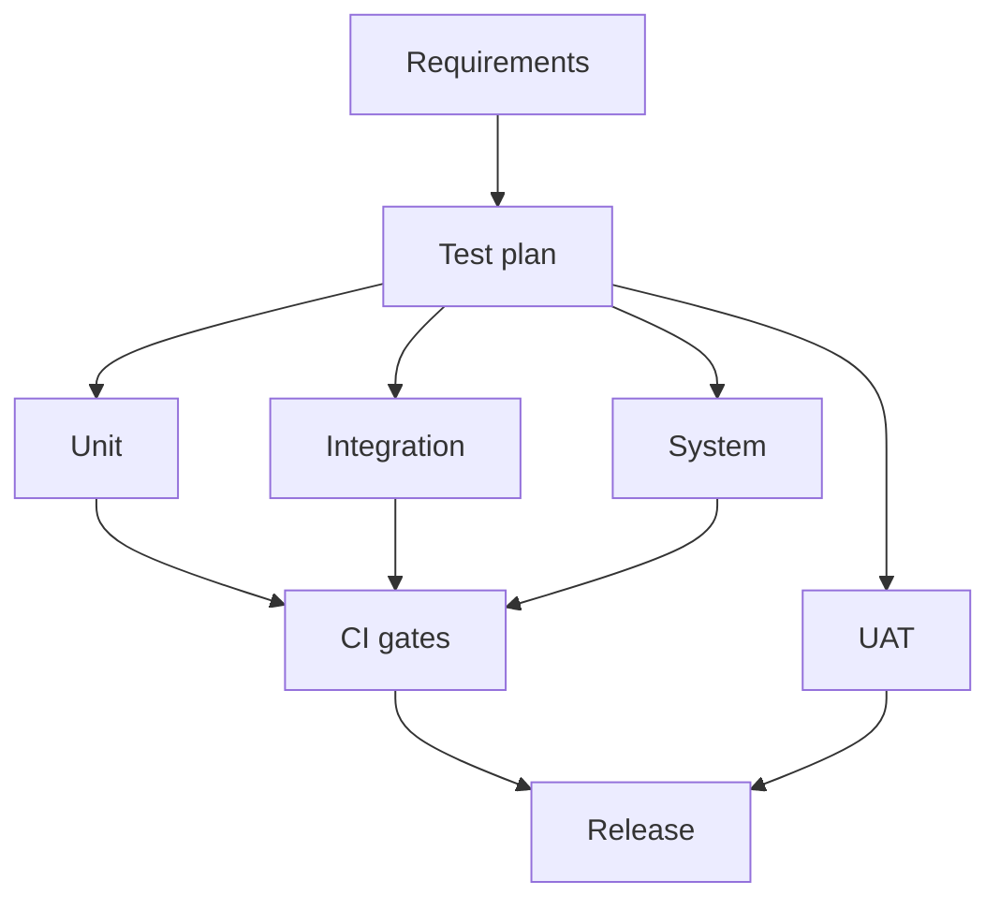

# Hospital Setup Module — Testing Specification

> **Document ID:** `hospital-setup/20-Testing`
> **Owner:** Engineering Lead (quality) / hospital configuration
> **Status:** 🔄 Pending approval (Phase 1 gate)
> **Version:** 1.0.0
> **Last updated:** 2026-08-06
> **Review cadence:** Re-reviewed at every phase gate and when the test model changes.
>
> **Relationship:** This document defines the **testing strategy** of the Hospital Setup module: objectives, levels, scenarios, and quality gates that verify the module is correct, secure, and reliable. It implements the platform testing standards in [15-TESTING-STANDARDS](../../15-TESTING-STANDARDS.md) and verifies the behaviors specified in [02-Workflow](02-Workflow.md), [10-API](10-API.md), [11-Permissions](11-Permissions.md), and [19-Performance](19-Performance.md).

---

## Table of Contents

1. [Purpose & Scope](#1-purpose--scope)
2. [Testing Objectives](#2-testing-objectives)
3. [Testing Principles](#3-testing-principles)
4. [Test Strategy](#4-test-strategy)
5. [Test Levels](#5-test-levels)
6. [Functional Test Scenarios](#6-functional-test-scenarios)
7. [Non-Functional Testing](#7-non-functional-testing)
8. [Performance Testing](#8-performance-testing)
9. [Security Testing](#9-security-testing)
10. [Authorization Testing](#10-authorization-testing)
11. [Validation Testing](#11-validation-testing)
12. [Workflow Testing](#12-workflow-testing)
13. [API Testing](#13-api-testing)
14. [Database Testing](#14-database-testing)
15. [Import/Export Testing](#15-importexport-testing)
16. [Notification Testing](#16-notification-testing)
17. [Audit Testing](#17-audit-testing)
18. [Dashboard Testing](#18-dashboard-testing)
19. [Regression Testing](#19-regression-testing)
20. [Test Data Management](#20-test-data-management)
21. [Defect Management](#21-defect-management)
22. [Test Reports](#22-test-reports)
23. [Exit Criteria](#23-exit-criteria)
24. [Cross References](#24-cross-references)

---

## 1. Purpose & Scope

This document defines **how the Hospital Setup module is tested** across all levels and dimensions, ensuring it meets its functional, security, reliability, and performance requirements before release.

**Scope:** unit, integration, system, and UAT testing; functional and non-functional scenarios; and quality gates. **Out of scope:** platform-wide testing infrastructure (see [15-TESTING-STANDARDS](../../15-TESTING-STANDARDS.md)).

### 1.1 Quality Intent

The Hospital Setup module is the organizational backbone of the hospital. Testing focuses on: **data integrity** (no orphaned/incorrect structure), **authorization** (no unauthorized or cross-tenant access), **workflow correctness** (approvals and deactivations behave correctly), and **reliability** (imports/exports and dashboards work under load).

---

## 2. Testing Objectives

| # | Objective | Measured by |
| --- | --- | --- |
| T-01 | Verify functional correctness | Functional scenarios pass |
| T-02 | Verify authorization integrity | Authorization tests pass ([11-Permissions](11-Permissions.md)) |
| T-03 | Verify data integrity | No integrity failures |
| T-04 | Verify workflow correctness | Workflow tests pass |
| T-05 | Verify performance | Within targets ([19-Performance](19-Performance.md) §4) |
| T-06 | Verify security | Security tests pass ([12-Security](12-Security.md)) |
| T-07 | Maintain regression safety | Regression suite green |

---

## 3. Testing Principles

| # | Principle | Application |
| --- | --- | --- |
| TP-01 | **Test critical paths** | Focus on clinical-adjacent and destructive actions. |
| TP-02 | **Automate by default** | CI gates; manual only where required ([15-TESTING-STANDARDS](../../15-TESTING-STANDARDS.md)). |
| TP-03 | **Authorization is code-tested** | Not inferred from UI ([11-Permissions](11-Permissions.md) §13). |
| TP-04 | **Data integrity enforced** | Constraints + tests ([06-ERD](06-ERD.md) §14). |
| TP-05 | **Deterministic** | No flaky tests; isolated data. |
| TP-06 | **Traceable** | Tests map to requirements ([01-Business-Requirements](01-Business-Requirements.md)). |

---

## 4. Test Strategy

### Strategy Summary

| Aspect | Decision |
| --- | --- |
| Pyramid | Many unit, fewer integration, fewest E2E |
| CI | All levels run in CI gates ([16-DEPLOYMENT-STANDARDS](../../16-DEPLOYMENT-STANDARDS.md) §4) |
| Environments | Dev, staging mirror production ([00-MASTER-ROADMAP](../../00-MASTER-ROADMAP.md) §10) |
| Data | Synthetic, tenant-scoped ([20-Testing](#20-test-data-management)) |
| Coverage | Critical-path coverage ≥ 80% |

---

## 5. Test Levels

### 5.1 Unit Testing

| Aspect | Detail |
| --- | --- |
| Scope | Domain logic, invariants, value objects ([07-Domain-Model](07-Domain-Model.md)) |
| Focus | Invariants, enum rules, date/scope validation |
| Speed | Fast; no external dependencies |
| Frameworks | Per platform standard ([15-TESTING-STANDARDS](../../15-TESTING-STANDARDS.md)) |

### 5.2 Integration Testing

| Aspect | Detail |
| --- | --- |
| Scope | Service + database + queue + event bus |
| Focus | Constraint enforcement, outbox/audit, assignment rules |
| Data | Clean DB per test ([03-Database](03-Database.md) §5) |
| Isolation | Tenant-scoped fixtures |

### 5.3 System Testing

| Aspect | Detail |
| --- | --- |
| Scope | End-to-end via API + UI |
| Focus | Workflows, import/export, dashboards |
| Environment | Staging |
| Automation | E2E suites in CI |

### 5.4 UAT

| Aspect | Detail |
| --- | --- |
| Scope | Acceptance by role (admin, auditor) |
| Focus | Usability, workflow acceptance ([09-UX](09-UX.md) §18) |
| Environment | UAT/staging with representative data |
| Gate | Pre-release sign-off |

---

## 6. Functional Test Scenarios

Scenarios trace to requirements in [01-Business-Requirements](01-Business-Requirements.md).

| Scenario | Requirement | Expected result |
| --- | --- | --- |
| Create a facility | BR-001..003 | Facility created (draft); code validated |
| Add hierarchy node | BR-011..012 | Node created; parent validated; no cycle |
| Deactivate with children | BR-017 | Blocked with explanation |
| Deactivate without children | BR-017 | Submitted for approval |
| Assign single primary | BR-022 | Exactly one active primary |
| Assign with invalid dates | BR-023 | Rejected |
| Manage reference value | BR-029 | Category+code uniqueness |
| Update config key | BR-031 | Key validated |
| Approve/reject change | BR-042 | Workflow proceeds/aborts |
| View audit | AU-O1 | Full immutable history |

---

## 7. Non-Functional Testing

| Dimension | Test |
| --- | --- |
| Performance | Load/stress/soak ([19-Performance](19-Performance.md) §21) |
| Security | SAST/DAST/penetration ([12-Security](12-Security.md) §19) |
| Reliability | Failure injection; recovery |
| Usability | Usability tests ([09-UX](09-UX.md) §18) |
| Accessibility | WCAG 2.1 AA audit ([08-UI](08-UI.md) §13) |
| Compatibility | Cross-browser, responsive |

---

## 8. Performance Testing

| Test | Verifies |
| --- | --- |
| Load | Sustained expected load ([19-Performance](19-Performance.md) §5) |
| Stress | Beyond capacity; graceful degradation |
| Soak | Long-running stability |
| Spike | Sudden load |
| Bulk | Import/export throughput ([19-Performance](19-Performance.md) §16–17) |
| DB | Query under load |

Targets and thresholds in [19-Performance](19-Performance.md) §4 and §19.

---

## 9. Security Testing

| Test | Covers |
| --- | --- |
| SAST | Static code scan (CI) |
| DAST | Dynamic scan of running app |
| Dependency scan | Vulnerable components |
| Container scan | Image vulnerabilities |
| Penetration testing | Pre-launch + periodic ([12-Security](12-Security.md) §19) |
| Threat model | Review at gates |

---

## 10. Authorization Testing

Verifies the matrix in [11-Permissions](11-Permissions.md) §13.

| Test | Verifies |
| --- | --- |
| Positive | Each role performs permitted actions |
| Negative | Each role denied non-permitted (403) |
| Scoping | Facility scope enforced; no cross-facility |
| SoD | Requester cannot approve own change |
| Elevation | MFA required for elevated actions |
| RLS | Data-layer isolation verified |

---

## 11. Validation Testing

| Test | Covers |
| --- | --- |
| Field validation | Required, length, format ([10-API](10-API.md) §6) |
| Enum validation | Allowed values |
| Cross-field | Date ranges, assignment targets |
| Uniqueness | Codes, reference category+code, single primary |
| Config keys | Known schema |
| Import validation | Row-level ([17-Import-Export](17-Import-Export.md) §5) |

---

## 12. Workflow Testing

Verifies flows in [02-Workflow](02-Workflow.md).

| Workflow | Test |
| --- | --- |
| Provision facility | Create → configure → publish → activate |
| Deactivate node | Propose → approval → execute / block / reject |
| Assign staff | Search → assign → scope refresh |
| Manage reference/config | CRUD + validation |
| Rollback | Snapshot → rollback on failure ([02-Workflow](02-Workflow.md) §22) |

---

## 13. API Testing

| Test | Covers |
| --- | --- |
| Contract | OpenAPI conformance ([10-API](10-API.md) §20) |
| CRUD | Each endpoint happy path |
| Errors | Error envelope per code ([10-API](10-API.md) §7) |
| Pagination | Limit/offset/cursor ([10-API](10-API.md) §9) |
| Filter/sort/search | Correct results |
| Idempotency | Replay returns original result |
| Bulk | Partial-failure reporting |

---

## 14. Database Testing

| Test | Covers |
| --- | --- |
| Migrations | Clean-DB run in CI ([03-Database](03-Database.md) §5) |
| Constraints | FK, unique, check enforced |
| Integrity | Referential integrity ([06-ERD](06-ERD.md) §14) |
| RLS | Row-level isolation |
| Partitioning | Audit partition behavior |
| Query | Slow-query regression ([19-Performance](19-Performance.md) §9) |

---

## 15. Import/Export Testing

| Test | Covers |
| --- | --- |
| Format | CSV/Excel/JSON/ZIP acceptance ([17-Import-Export](17-Import-Export.md) §2) |
| Mapping | Field mapping correctness |
| Validation | Row-level validation report |
| Duplicates | Detection + resolution |
| Conflicts | Resolution modes |
| Rollback | Failed import rollback |
| Large files | Batch/queue performance |
| Idempotency | Re-run safe |

---

## 16. Notification Testing

| Test | Covers |
| --- | --- |
| Delivery | Channel success ([14-Notifications](14-Notifications.md)) |
| Templates | Correct content/tone |
| Preferences | Opt-in/out honored |
| Escalation | P0 escalation path |
| Retry | Backoff behavior |
| Failure | Dead-letter handling |

---

## 17. Audit Testing

Verifies [13-Audit](13-Audit.md) §17.

| Test | Verifies |
| --- | --- |
| Coverage | Every mutation produces an event |
| Immutability | No update/delete possible |
| Integrity | Chain hash recomputation passes |
| Tamper detection | Modified record detected |
| Authorization | Only `audit:read` can view |
| Scoping | No cross-tenant audit access |
| Redaction | No sensitive data in records |

---

## 18. Dashboard Testing

| Test | Covers |
| --- | --- |
| Widgets | KPI correctness ([16-Dashboards](16-Dashboards.md) §10) |
| Charts | Correct data rendering |
| Filters | Filter + drill-down behavior |
| Real-time | Event updates |
| Role visibility | Per-role widget access |
| Performance | LCP < 2.5 s ([16-Dashboards](16-Dashboards.md) §18) |
| Accessibility | WCAG AA |

---

## 19. Regression Testing

| Aspect | Decision |
| --- | --- |
| Suite | Automated critical-path suite in CI |
| Cadence | Every merge + pre-release |
| Focus | Core structure, assignments, workflows |
| Data | Deterministic fixtures |
| Gate | No regressions before merge ([00-MASTER-ROADMAP](../../00-MASTER-ROADMAP.md) §13) |

---

## 20. Test Data Management

| Aspect | Decision |
| --- | --- |
| Synthetic | No real PHI in tests ([00-MASTER-ROADMAP](../../00-MASTER-ROADMAP.md) §10) |
| Tenant-scoped | Fixtures per tenant; isolation verified |
| Deterministic | Stable fixtures; no flakiness |
| Migrations | Clean DB per run ([03-Database](03-Database.md) §5) |
| Seeds | Versioned seed data ([05-DATABASE-ARCHITECTURE](../../05-DATABASE-ARCHITECTURE.md) §5) |

---

## 21. Defect Management

| Aspect | Decision |
| --- | --- |
| Tracking | Issue tracker ([16-DEPLOYMENT-STANDARDS](../../16-DEPLOYMENT-STANDARDS.md)) |
| Severity | Critical/high/medium/low ([15-TESTING-STANDARDS](../../15-TESTING-STANDARDS.md)) |
| Triage | Prioritized by severity + impact |
| Lifecycle | New → triaged → fixed → verified → closed |
| Critical gate | No open high/critical at release ([00-MASTER-ROADMAP](../../00-MASTER-ROADMAP.md) §2.3) |

---

## 22. Test Reports

| Report | Purpose |
| --- | --- |
| Test plan | Scope, levels, scenarios |
| Execution report | Pass/fail by level |
| Coverage report | Critical-path coverage |
| Performance report | Targets vs results |
| Security report | Scan + review results |
| Regression report | Suite results per release |
| UAT sign-off | Acceptance evidence |

---

## 23. Exit Criteria

| Criterion | Required |
| --- | --- |
| All critical-path tests pass | Yes |
| Zero open high/critical defects | Yes |
| Authorization tests pass | Yes |
| Performance meets targets | Yes |
| Security scans clean | Yes |
| UAT signed off | Yes |
| No regressions | Yes |

---

## 24. Cross References

| Reference | Relationship | Direction |
| --- | --- | --- |
| [README](README.md) | Module overview | Consumes |
| [01-Business-Requirements](01-Business-Requirements.md) | Requirement traceability | Consumes |
| [02-Workflow](02-Workflow.md) | Workflow testing | Consumes |
| [03-Database](03-Database.md) | DB/migration testing | Consumes |
| [06-ERD](06-ERD.md) | Integrity testing | Consumes |
| [07-Domain-Model](07-Domain-Model.md) | Unit-test scope | Consumes |
| [08-UI](08-UI.md) | UI/E2E testing | Consumes |
| [09-UX](09-UX.md) | Usability/UAT | Consumes |
| [10-API](10-API.md) | API testing | Consumes |
| [11-Permissions](11-Permissions.md) | Authorization testing | Consumes |
| [12-Security](12-Security.md) | Security testing | Consumes |
| [13-Audit](13-Audit.md) | Audit testing | Consumes |
| [14-Notifications](14-Notifications.md) | Notification testing | Consumes |
| [16-Dashboards](16-Dashboards.md) | Dashboard testing | Consumes |
| [17-Import-Export](17-Import-Export.md) | Import/export testing | Consumes |
| [19-Performance](19-Performance.md) | Performance testing | Consumes |
| [00-MASTER-ROADMAP](../../00-MASTER-ROADMAP.md) | Quality gates | Consumes |
| [05-DATABASE-ARCHITECTURE](../../05-DATABASE-ARCHITECTURE.md) | Migrations, seeds | Consumes |
| [15-TESTING-STANDARDS](../../15-TESTING-STANDARDS.md) | Platform test standards | Consumes |
| [16-DEPLOYMENT-STANDARDS](../../16-DEPLOYMENT-STANDARDS.md) | CI gates, defects | Consumes |

---

*End of `docs/modules/hospital-setup/20-Testing.md`.*
