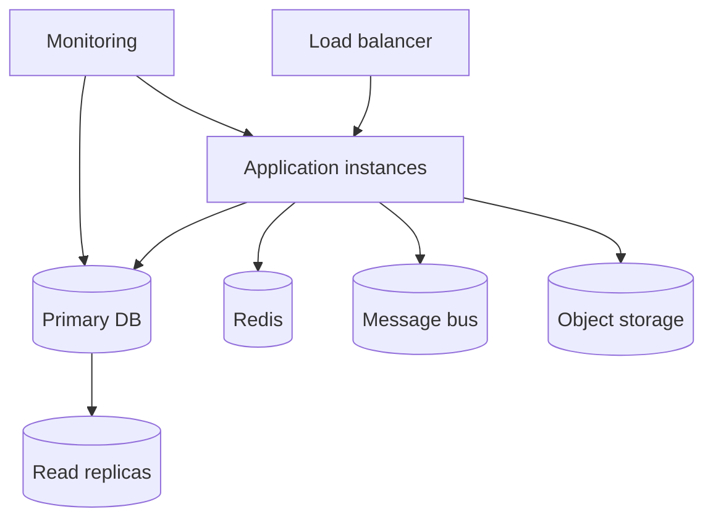
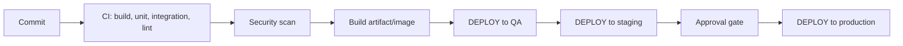
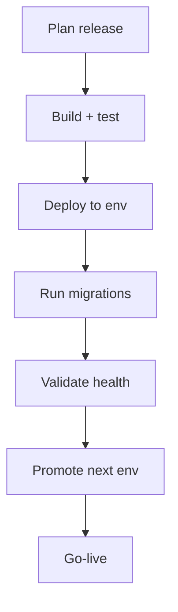
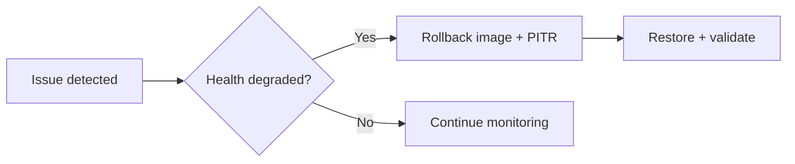

# Hospital Setup Module — Deployment Specification

> **Document ID:** `hospital-setup/21-Deployment`
> **Owner:** Engineering Lead (operations) / hospital configuration
> **Status:** 🔄 Pending approval (Phase 1 gate)
> **Version:** 1.0.0
> **Last updated:** 2026-08-06
> **Review cadence:** Re-reviewed at every phase gate and when the deployment model changes.
>
> **Relationship:** This document defines the **deployment architecture and operational strategy** of the Hospital Setup module: environments, infrastructure, CI/CD, migrations, rollback, HA/DR, and runbooks. It implements the platform deployment standards in [16-DEPLOYMENT-STANDARDS](../../16-DEPLOYMENT-STANDARDS.md) and the infrastructure architecture in [02-SYSTEM-ARCHITECTURE](../../02-SYSTEM-ARCHITECTURE.md) §15.

---

## Table of Contents

1. [Purpose & Scope](#1-purpose--scope)
2. [Deployment Objectives](#2-deployment-objectives)
3. [Deployment Principles](#3-deployment-principles)
4. [Environment Strategy](#4-environment-strategy)
5. [Infrastructure Architecture](#5-infrastructure-architecture)
6. [Containerization Strategy](#6-containerization-strategy)
7. [CI/CD Pipeline](#7-cicd-pipeline)
8. [Database Migration Strategy](#8-database-migration-strategy)
9. [Configuration Management](#9-configuration-management)
10. [Secrets Management](#10-secrets-management)
11. [Deployment Workflow](#11-deployment-workflow)
12. [Rollback Strategy](#12-rollback-strategy)
13. [High Availability](#13-high-availability)
14. [Backup & Disaster Recovery](#14-backup--disaster-recovery)
15. [Monitoring & Logging](#15-monitoring--logging)
16. [Health Checks](#16-health-checks)
17. [Scaling Strategy](#17-scaling-strategy)
18. [Security Hardening](#18-security-hardening)
19. [Release Management](#19-release-management)
20. [Go-Live Checklist](#20-go-live-checklist)
21. [Post Deployment Validation](#21-post-deployment-validation)
22. [Operational Runbooks](#22-operational-runbooks)
23. [Deployment Risks](#23-deployment-risks)
24. [Cross References](#24-cross-references)

---

## 1. Purpose & Scope

This document defines **how the Hospital Setup module is deployed and operated** across environments, and how releases are delivered safely, observably, and recoverably.

**Scope:** environments, infrastructure, CI/CD, migrations, config/secrets, HA/DR, runbooks. **Out of scope:** platform-wide infrastructure (see [02-SYSTEM-ARCHITECTURE](../../02-SYSTEM-ARCHITECTURE.md) §15) and other modules' deployment.

### 1.1 Deployment Profile

The Hospital Setup module is a **service in the modular monolith** ([02-SYSTEM-ARCHITECTURE](../../02-SYSTEM-ARCHITECTURE.md) §4). It deploys as part of the platform release, with forward-only database migrations gated by CI.

---

## 2. Deployment Objectives

| # | Objective | Measured by |
| --- | --- | --- |
| DP-01 | Safe, repeatable releases | CI/CD green before deploy |
| DP-02 | Zero data loss | Backup/RPO met |
| DP-03 | Fast recovery | RTO met |
| DP-04 | High availability | 99.9% availability ([00-MASTER-ROADMAP](../../00-MASTER-ROADMAP.md) §2.2) |
| DP-05 | Observable operation | Metrics, logs, health checks |
| DP-06 | Secure deployment | Hardened environments; secrets managed |

---

## 3. Deployment Principles

| # | Principle | Application |
| --- | --- | --- |
| DP-01 | **Everything through CI/CD** | No manual deploys ([16-DEPLOYMENT-STANDARDS](../../16-DEPLOYMENT-STANDARDS.md)). |
| DP-02 | **Migrations forward-only** | Versioned; rollback via PITR ([03-Database](03-Database.md) §5). |
| DP-03 | **Immutable artifacts** | Containers built once, promoted. |
| DP-04 | **Reversible** | Rollback path for every release. |
| DP-05 | **Observable** | Health checks + logs + metrics. |
| DP-06 | **Least privilege** | Scoped deployment credentials. |

---

## 4. Environment Strategy

| Environment | Purpose | Data | Deploy trigger |
| --- | --- | --- | --- |
| **Development** | Local development | Synthetic | On commit |
| **QA** | Automated testing | Synthetic | On merge |
| **UAT** | Acceptance testing | Representative | Pre-release |
| **Staging** | Production mirror | Anonymized sample | Pre-release |
| **Production** | Live operation | Real | Approved release |

### Environment Comparison

| Environment | Isolated | PHI-free | Mirrors prod | Approval |
| --- | :---: | :---: | :---: | :---: |
| Development | ✓ | ✓ | · | · |
| QA | ✓ | ✓ | · | · |
| UAT | ✓ | ✓ | Partial | · |
| Staging | ✓ | ✓ | ✓ | · |
| Production | ✓ | n/a | ✓ | ✓ |

Per [00-MASTER-ROADMAP](../../00-MASTER-ROADMAP.md) §10.

---

## 5. Infrastructure Architecture

### Components

| Component | Role |
| --- | --- |
| Load balancer | Distribute traffic ([02-SYSTEM-ARCHITECTURE](../../02-SYSTEM-ARCHITECTURE.md) §15) |
| Application instances | Stateless module services |
| Primary DB | Canonical store ([05-DATABASE-ARCHITECTURE](../../05-DATABASE-ARCHITECTURE.md)) |
| Read replicas | Read scaling/failover |
| Redis | Cache, sessions, rate limits |
| Message bus | Events ([18-Integrations](18-Integrations.md) §6) |
| Object storage | Documents, archives |
| Monitoring | Metrics, logs, traces |

---

## 6. Containerization Strategy

| Aspect | Decision |
| --- | --- |
| Container | Docker ([03-TECHNOLOGY-STACK](../../03-TECHNOLOGY-STACK.md) §4.11) |
| Orchestration | Kubernetes in prod; Compose in dev |
| Immutable | Images built once, promoted |
| Registry | Internal registry with scanning |
| Images | Minimal, hardened base images |
| Tags | Versioned + SHA immutable |

### Image Build

---

## 7. CI/CD Pipeline

| Stage | Actions |
| --- | --- |
| CI | Build, unit/integration tests, lint, SAST ([20-Testing](20-Testing.md) §4) |
| QA deploy | Automated |
| Staging deploy | Automated |
| Production | Approval-gated |

CI/CD follows [16-DEPLOYMENT-STANDARDS](../../16-DEPLOYMENT-STANDARDS.md) §4.

---

## 8. Database Migration Strategy

| Aspect | Decision |
| --- | --- |
| Management | Versioned migrations under `database/` |
| Direction | Forward-only ([03-Database](03-Database.md) §5) |
| CI gate | Clean-DB run in CI |
| Rollback | PITR, not down-migrations |
| Order | Applied in order; idempotent |
| Release | Migrations ship with app |
| Backups | Taken before migration |

---

## 9. Configuration Management

| Aspect | Decision |
| --- | --- |
| App config | Environment-based ([16-DEPLOYMENT-STANDARDS](../../16-DEPLOYMENT-STANDARDS.md) §8) |
| Versioned | Config in repo/version control |
| Per-env | Overrides per environment |
| Feature flags | Flags for gradual rollout |
| No secrets | Config and secrets separated |

---

## 10. Secrets Management

| Aspect | Decision |
| --- | --- |
| Store | Central secret manager ([12-Security](12-Security.md) §9) |
| Never in repo | No secrets in source/config/images |
| Access | Least privilege ([12-Security](12-Security.md) §7) |
| Rotation | Automated, audited |
| Scoping | Per-env credentials |

---

## 11. Deployment Workflow

### Deployment Steps

| Step | Action |
| --- | --- |
| 1 | Build + test + scan |
| 2 | Deploy artifact |
| 3 | Run forward migrations |
| 4 | Validate health checks |
| 5 | Promote through environments |
| 6 | Go-live with monitoring |

---

## 12. Rollback Strategy

| Aspect | Decision |
| --- | --- |
| Application | Revert to prior immutable image |
| Database | PITR to pre-release point ([03-Database](03-Database.md) §5) |
| Compensating | Forward corrective migration |
| Triggers | Health failures, critical defects |
| Communication | Per incident response ([16-DEPLOYMENT-STANDARDS](../../16-DEPLOYMENT-STANDARDS.md) §10) |

### Rollback Flow

---

## 13. High Availability

| Aspect | Decision |
| --- | --- |
| Availability | 99.9% target ([00-MASTER-ROADMAP](../../00-MASTER-ROADMAP.md) §2.2) |
| App | Stateless; multi-instance; load-balanced |
| DB | Primary + replicas; failover ([05-DATABASE-ARCHITECTURE](../../05-DATABASE-ARCHITECTURE.md) §4) |
| Multi-AZ | Where supported |
| Failover drills | Tested, not only theorized ([05-DATABASE-ARCHITECTURE](../../05-DATABASE-ARCHITECTURE.md) §4.4) |

---

## 14. Backup & Disaster Recovery

| Aspect | Decision |
| --- | --- |
| Backups | Automated, encrypted ([05-DATABASE-ARCHITECTURE](../../05-DATABASE-ARCHITECTURE.md) §10) |
| RPO | Per compliance schedule |
| RTO | Defined and tested |
| Object store | Documents/archives backed up |
| Cross-region | DR capability where supported |
| Restore drills | Periodic, documented |

---

## 15. Monitoring & Logging

| Aspect | Decision |
| --- | --- |
| Metrics | Prometheus ([03-TECHNOLOGY-STACK](../../03-TECHNOLOGY-STACK.md)) |
| Logs | Structured; correlation id ([19-Performance](19-Performance.md) §18) |
| Traces | Distributed tracing ([02-SYSTEM-ARCHITECTURE](../../02-SYSTEM-ARCHITECTURE.md) §14) |
| Alerting | Per thresholds ([19-Performance](19-Performance.md) §19) |
| Dashboards | Ops dashboards |

---

## 16. Health Checks

| Aspect | Decision |
| --- | --- |
| Liveness | Process alive |
| Readiness | Ready to serve traffic |
| Startup | Started and initialized |
| Dependency | DB/Redis/queue reachable |
| Failure | Route away / rollback trigger ([16-DEPLOYMENT-STANDARDS](../../16-DEPLOYMENT-STANDARDS.md) §5) |

---

## 17. Scaling Strategy

| Aspect | Decision |
| --- | --- |
| Horizontal | Stateless app instances ([19-Performance](19-Performance.md) §6) |
| Read | Read replicas + cache |
| Audit | Partitioning bounds growth ([04-Database-Tables](04-Database-Tables.md) §12.5) |
| Queue | Scale workers ([17-Import-Export](17-Import-Export.md) §21) |
| Auto-scaling | Metric-driven where configured |

---

## 18. Security Hardening

| Aspect | Decision |
| --- | --- |
| Network | Segmentation; no public DB ([12-Security](12-Security.md) §12) |
| Images | Minimal, scanned |
| Least privilege | Scoped service accounts |
| Patch | Automated patching schedule |
| Audit | Deployment events audited |
| Compliance | Controls per [00-MASTER-ROADMAP](../../00-MASTER-ROADMAP.md) §15 |

---

## 19. Release Management

| Aspect | Decision |
| --- | --- |
| Versioning | Semantic versioning |
| Release notes | Changelog per release ([23-Changelog](23-Changelog.md)) |
| Approval | Gate before production |
| Schedule | Release cadence per roadmap |
| Communication | Stakeholder notification ([14-Notifications](14-Notifications.md)) |

---

## 20. Go-Live Checklist

| Check | Status |
| --- | --- |
| All tests green | Required |
| Security scans clean | Required |
| Migrations validated on clean DB | Required |
| Backups verified | Required |
| Health checks configured | Required |
| Monitoring/alerts live | Required |
| Runbooks available | Required |
| Rollback path confirmed | Required |
| UAT/staging sign-off | Required |
| Approvals recorded | Required |

---

## 21. Post Deployment Validation

| Validation | Action |
| --- | --- |
| Health checks | Green |
| Smoke tests | Critical paths pass ([20-Testing](20-Testing.md) §19) |
| Monitoring | No error spikes |
| Audit | Deploy audited |
| Performance | Within targets ([19-Performance](19-Performance.md) §4) |
| Data | Integrity checks pass |

---

## 22. Operational Runbooks

| Runbook | Covers |
| --- | --- |
| Deploy/rollback | Standard release + revert |
| Incident response | Severity-based ([12-Security](12-Security.md) §18) |
| DB failover | Failover + restore |
| Backup restore | PITR restore |
| Migration failure | Recovery path |
| Scaling | Scale triggers + actions |

---

## 23. Deployment Risks

| Risk | Mitigation |
| --- | --- |
| Migration failure | Forward-only + backup + PITR |
| Bad release | Rollback path + health gates |
| Data loss | Backups + RPO/RTO + drills |
| Availability drop | HA + failover + monitoring |
| Secret exposure | Secrets manager + rotation |
| Configuration drift | Versioned config + per-env |
| Scaling failure | Auto-scaling + capacity planning ([19-Performance](19-Performance.md) §20) |

---

## 24. Cross References

| Reference | Relationship | Direction |
| --- | --- | --- |
| [README](README.md) | Module overview | Consumes |
| [02-Workflow](02-Workflow.md) | Operational flows | Consumes |
| [03-Database](03-Database.md) | Migrations | Consumes |
| [04-Database-Tables](04-Database-Tables.md) | Partitioning | Consumes |
| [12-Security](12-Security.md) | Security hardening | Consumes |
| [17-Import-Export](17-Import-Export.md) | Queue scaling | Consumes |
| [19-Performance](19-Performance.md) | Scaling, monitoring | Consumes |
| [20-Testing](20-Testing.md) | CI gates, smoke tests | Consumes |
| [00-MASTER-ROADMAP](../../00-MASTER-ROADMAP.md) | Environments, SLAs | Consumes |
| [02-SYSTEM-ARCHITECTURE](../../02-SYSTEM-ARCHITECTURE.md) | Infrastructure | Consumes |
| [03-TECHNOLOGY-STACK](../../03-TECHNOLOGY-STACK.md) | Docker, K8s, observability | Consumes |
| [05-DATABASE-ARCHITECTURE](../../05-DATABASE-ARCHITECTURE.md) | HA/DR, backups | Consumes |
| [16-DEPLOYMENT-STANDARDS](../../16-DEPLOYMENT-STANDARDS.md) | Deployment standards | Consumes |

---

*End of `docs/modules/hospital-setup/21-Deployment.md`.*
