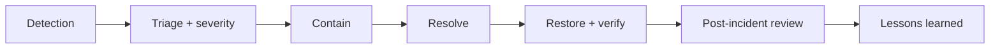

# Hospital Setup Module — Risk Management Specification

> **Document ID:** `hospital-setup/22-Risks`
> **Owner:** Engineering Lead / Risk (hospital configuration)
> **Status:** 🔄 Pending approval (Phase 1 gate)
> **Version:** 1.0.0
> **Last updated:** 2026-08-06
> **Review cadence:** Re-reviewed at every phase gate and when risk posture changes.
>
> **Relationship:** This document defines the **enterprise risk management framework** for the Hospital Setup module: risk categories, assessment, register, mitigation, monitoring, and continuity. It complements the module threat model in [12-Security](12-Security.md) §11 and the platform risk register in [00-MASTER-ROADMAP](../../00-MASTER-ROADMAP.md) §14.

---

## Table of Contents

1. [Purpose & Scope](#1-purpose--scope)
2. [Risk Management Objectives](#2-risk-management-objectives)
3. [Risk Management Principles](#3-risk-management-principles)
4. [Risk Categories](#4-risk-categories)
5. [Business Risks](#5-business-risks)
6. [Technical Risks](#6-technical-risks)
7. [Security Risks](#7-security-risks)
8. [Compliance Risks](#8-compliance-risks)
9. [Operational Risks](#9-operational-risks)
10. [Data Integrity Risks](#10-data-integrity-risks)
11. [Availability Risks](#11-availability-risks)
12. [Performance Risks](#12-performance-risks)
13. [Integration Risks](#13-integration-risks)
14. [Deployment Risks](#14-deployment-risks)
15. [Disaster Recovery Risks](#15-disaster-recovery-risks)
16. [Third-Party Dependency Risks](#16-third-party-dependency-risks)
17. [Risk Assessment Matrix](#17-risk-assessment-matrix)
18. [Risk Register](#18-risk-register)
19. [Risk Mitigation Strategies](#19-risk-mitigation-strategies)
20. [Risk Monitoring](#20-risk-monitoring)
21. [Incident Response](#21-incident-response)
22. [Business Continuity](#22-business-continuity)
23. [Lessons Learned](#23-lessons-learned)
24. [Cross References](#24-cross-references)

---

## 1. Purpose & Scope

This document defines **how the Hospital Setup module identifies, assesses, mitigates, and monitors risk** across business, technical, security, compliance, operational, and continuity dimensions.

**Scope:** the risk management framework for the module. **Out of scope:** platform-wide risk (see [00-MASTER-ROADMAP](../../00-MASTER-ROADMAP.md) §14) and the security threat model (see [12-Security](12-Security.md) §11, which this doc complements).

### 1.1 Risk Posture

The Hospital Setup module is the **organizational backbone** of the hospital. While it holds no clinical PHI, a failure or compromise here has **downstream impact** on every module that depends on the hierarchy, assignments, and configuration. Risk management focuses on protecting structure integrity, authorization, availability, and the trust placed in the configuration.

---

## 2. Risk Management Objectives

| # | Objective | Measured by |
| --- | --- | --- |
| RM-01 | Identify material risks | Complete risk register |
| RM-02 | Assess likelihood and impact | Risk matrix populated |
| RM-03 | Mitigate high risks | High risks reduced/owned |
| RM-04 | Monitor risk posture | Regular review cadence |
| RM-05 | Ensure continuity | BCP/DR tested |
| RM-06 | Learn from incidents | Lessons applied |

---

## 3. Risk Management Principles

| # | Principle | Application |
| --- | --- | --- |
| R-01 | **Proactive** | Identify risk before it materializes. |
| R-02 | **Proportionate** | Treat according to likelihood × impact. |
| R-03 | **Owned** | Every risk has an owner. |
| R-04 | **Evidence-driven** | Assessed on data, not assumption. |
| R-05 | **Transparent** | Register visible and reviewed. |
| R-06 | **Continuously reviewed** | Updated at gates and incidents. |

---

## 4. Risk Categories

| Category | Focus | Relates to |
| --- | --- | --- |
| Business | Mission, adoption, scope | [01-Business-Requirements](01-Business-Requirements.md) |
| Technical | Architecture, technology | [02-SYSTEM-ARCHITECTURE](../../02-SYSTEM-ARCHITECTURE.md) |
| Security | Threats, access | [12-Security](12-Security.md) |
| Compliance | Regulation, accreditation | [00-MASTER-ROADMAP](../../00-MASTER-ROADMAP.md) §15 |
| Operational | Processes, staff, runbooks | [21-Deployment](21-Deployment.md) §22 |
| Data integrity | Structure correctness | [06-ERD](06-ERD.md) |
| Availability | Uptime, failover | [21-Deployment](21-Deployment.md) §13 |
| Performance | Latency, throughput | [19-Performance](19-Performance.md) |
| Integration | Cross-module/external | [18-Integrations](18-Integrations.md) |
| Deployment | Release safety | [21-Deployment](21-Deployment.md) |
| DR | Recovery | [21-Deployment](21-Deployment.md) §14 |
| Third-party | Dependencies | [03-TECHNOLOGY-STACK](../../03-TECHNOLOGY-STACK.md) |

---

## 5. Business Risks

| Risk | Description | Mitigation |
| --- | --- | --- |
| Adoption risk | Admins underuse or misuse configuration | Training, UX ([09-UX](09-UX.md)) |
| Scope creep | Unbounded module scope | Roadmap governance ([00-MASTER-ROADMAP](../../00-MASTER-ROADMAP.md)) |
| Misconfiguration | Incorrect structure/config | Validation + approval ([02-Workflow](02-Workflow.md)) |
| Data-quality trust | Stale/incorrect structure erodes trust | Audit + review ([13-Audit](13-Audit.md)) |

---

## 6. Technical Risks

| Risk | Description | Mitigation |
| --- | --- | --- |
| Architecture drift | Deviations from modular monolith | ADR governance ([02-SYSTEM-ARCHITECTURE](../../02-SYSTEM-ARCHITECTURE.md) §18) |
| Technology aging | EOL dependencies | Versioning policy ([03-TECHNOLOGY-STACK](../../03-TECHNOLOGY-STACK.md) §5) |
| Technical debt | Accumulated shortcuts | Refactoring gates |
| Schema complexity | Over-complex model | 3NF + review ([03-Database](03-Database.md)) |

---

## 7. Security Risks

Security risks complement the threat model in [12-Security](12-Security.md) §11.

| Risk | Description | Mitigation |
| --- | --- | --- |
| Unauthorized change | Access control breach | RBAC + MFA + approval ([11-Permissions](11-Permissions.md)) |
| Cross-tenant access | Isolation breach | RLS + scoping ([09-MULTI-TENANCY](../../09-MULTI-TENANCY.md)) |
| Privilege escalation | Role abuse | Least privilege + SoD |
| Audit tampering | Trail modification | Hash chain ([13-Audit](13-Audit.md) §7) |
| Secrets leakage | Credential exposure | Secrets manager ([12-Security](12-Security.md) §9) |

---

## 8. Compliance Risks

| Risk | Description | Mitigation |
| --- | --- | --- |
| Accreditation gap | NABH evidence shortfall | Compliance reports ([15-Reports](15-Reports.md) §7) |
| Audit completeness | Missing change records | Audit coverage ([13-Audit](13-Audit.md)) |
| Retention non-compliance | Improper retention | Retention schedule ([05-DATABASE-ARCHITECTURE](../../05-DATABASE-ARCHITECTURE.md) §8) |
| Regulatory drift | Regulation changes | Compliance matrix review ([00-MASTER-ROADMAP](../../00-MASTER-ROADMAP.md) §15) |

---

## 9. Operational Risks

| Risk | Description | Mitigation |
| --- | --- | --- |
| Runbook gaps | Missing procedures | Runbooks ([21-Deployment](21-Deployment.md) §22) |
| Staff dependency | Single-person knowledge | Cross-training, documentation |
| Human error | Mistaken deactivation | Confirmation + approval ([02-Workflow](02-Workflow.md)) |
| Monitoring gaps | Missed alerts | Alert thresholds ([19-Performance](19-Performance.md) §19) |

---

## 10. Data Integrity Risks

| Risk | Description | Mitigation |
| --- | --- | --- |
| Orphaned data | Broken hierarchy | FK + RESTRICT ([06-ERD](06-ERD.md) §14) |
| Duplicate codes | Code collisions | Unique constraints ([04-Database-Tables](04-Database-Tables.md)) |
| Single-primary violation | Multiple primaries | Partial unique ([06-ERD](06-ERD.md) §15) |
| Cycle creation | Loop in hierarchy | Cycle detection ([02-Workflow](02-Workflow.md)) |
| Partial imports | Incomplete loads | Batch rollback ([17-Import-Export](17-Import-Export.md) §14) |

---

## 11. Availability Risks

| Risk | Description | Mitigation |
| --- | --- | --- |
| App outage | Service unavailable | HA multi-instance ([21-Deployment](21-Deployment.md) §13) |
| DB outage | Primary failure | Failover + replicas |
| Dependency outage | Redis/queue down | Degraded modes |
| Load spike | Overwhelm capacity | Scaling ([21-Deployment](21-Deployment.md) §17) |

---

## 12. Performance Risks

| Risk | Description | Mitigation |
| --- | --- | --- |
| Latency regression | Slow reads | Indexing + caching ([19-Performance](19-Performance.md)) |
| N+1 queries | Hierarchy walks | Batching ([04-CODING-STANDARDS](../../04-CODING-STANDARDS.md) §11) |
| Bulk slowdown | Import/export lag | Batch sizing ([19-Performance](19-Performance.md) §16) |
| Cache thrash | Misses | TTL/invalidation ([19-Performance](19-Performance.md) §11) |

---

## 13. Integration Risks

| Risk | Description | Mitigation |
| --- | --- | --- |
| Contract drift | Schema mismatch | Contract-first ([18-Integrations](18-Integrations.md)) |
| Event loss | Missed propagation | Outbox + retry ([05-DATABASE-ARCHITECTURE](../../05-DATABASE-ARCHITECTURE.md) §6) |
| External dependency | Provider failure | Retry + DLQ ([18-Integrations](18-Integrations.md) §20) |
| Data mapping error | Incorrect translation | Mapping tests ([17-Import-Export](17-Import-Export.md) §4) |

---

## 14. Deployment Risks

Deployment risks mirror [21-Deployment](21-Deployment.md) §23.

| Risk | Mitigation |
| --- | --- |
| Migration failure | Forward-only + backup + PITR |
| Bad release | Rollback + health gates |
| Config drift | Versioned config |
| Secret exposure | Secrets manager + rotation |

---

## 15. Disaster Recovery Risks

| Risk | Description | Mitigation |
| --- | --- | --- |
| Data loss | RPO breach | Backups ([21-Deployment](21-Deployment.md) §14) |
| Slow recovery | RTO breach | DR drills |
| Backup failure | Silent backup loss | Monitoring |
| Regional outage | Site loss | Cross-region where supported |

---

## 16. Third-Party Dependency Risks

| Risk | Description | Mitigation |
| --- | --- | --- |
| Provider failure | Redis/DB/queue vendor | Managed services + HA |
| License change | Open-source license shift | Licensing review ([03-TECHNOLOGY-STACK](../../03-TECHNOLOGY-STACK.md) §7) |
| Supply chain | Compromised dependency | Scanning + provenance |
| EOL | Discontinued component | Versioning policy |

---

## 17. Risk Assessment Matrix

Risk = **Likelihood × Impact**.

### Likelihood Scale

| Level | Score | Meaning |
| --- | --- | --- |
| Rare | 1 | Unlikely |
| Unlikely | 2 | Possible |
| Possible | 3 | Occasional |
| Likely | 4 | Frequent |
| Almost certain | 5 | Certain |

### Impact Scale

| Level | Score | Meaning |
| --- | --- | --- |
| Negligible | 1 | Minor effect |
| Minor | 2 | Limited effect |
| Moderate | 3 | Significant effect |
| Major | 4 | Severe effect |
| Critical | 5 | Catastrophic |

### Matrix

| L\I | Negligible 1 | Minor 2 | Moderate 3 | Major 4 | Critical 5 |
| --- | --- | --- | --- | --- | --- |
| **5 Certain** | 5 | 10 | 15 | 20 | **25** |
| **4 Frequent** | 4 | 8 | 12 | **16** | **20** |
| **3 Occasional** | 3 | 6 | 9 | 12 | **15** |
| **2 Possible** | 2 | 4 | 6 | 8 | 10 |
| **1 Rare** | 1 | 2 | 3 | 4 | 5 |

**Rating:** 1–4 Low · 5–9 Medium · 10–14 High · 15+ Critical

---

## 18. Risk Register

| # | Risk | Cat | L | I | Score | Rating | Owner | Status |
| --- | --- | --- | :---: | :---: | :---: | --- | --- | --- |
| RK-01 | Unauthorized change | Security | 2 | 5 | 10 | High | Security | Mitigating |
| RK-02 | Cross-tenant access | Security | 2 | 5 | 10 | High | Security | Mitigating |
| RK-03 | Data integrity (orphans/cycles) | Data | 3 | 4 | 12 | High | Data | Mitigating |
| RK-04 | Audit tampering | Security | 2 | 4 | 8 | Medium | Security | Mitigating |
| RK-05 | Availability outage | Availability | 2 | 4 | 8 | Medium | Ops | Mitigating |
| RK-06 | Migration failure | Deployment | 2 | 4 | 8 | Medium | Ops | Mitigating |
| RK-07 | Performance regression | Performance | 2 | 3 | 6 | Medium | Eng | Monitoring |
| RK-08 | Integration contract drift | Integration | 3 | 3 | 9 | Medium | Eng | Monitoring |
| RK-09 | Accreditation gap | Compliance | 2 | 3 | 6 | Medium | Compliance | Mitigating |
| RK-10 | Misconfiguration | Business | 3 | 3 | 9 | Medium | Product | Monitoring |

Register is living and reviewed at gates ([00-MASTER-ROADMAP](../../00-MASTER-ROADMAP.md) §14).

---

## 19. Risk Mitigation Strategies

| Strategy | Application |
| --- | --- |
| Avoid | Eliminate the risk (e.g., not integrating DICOM in setup). |
| Mitigate | Reduce likelihood/impact (controls, approval). |
| Transfer | Insure/outsource where appropriate. |
| Accept | Accept residual low risk with owner. |

### Mitigation Decision Table

| Risk rating | Strategy |
| --- | --- |
| Critical (15+) | Must mitigate/avoid; gate on resolution |
| High (10–14) | Mitigate with controls; owner |
| Medium (5–9) | Monitor + control |
| Low (1–4) | Accept; review |

---

## 20. Risk Monitoring

| Aspect | Decision |
| --- | --- |
| Cadence | Review at gates + quarterly |
| Triggers | Incident, material change, new dependency |
| Indicators | Threat/availability/performance metrics ([12-Security](12-Security.md) §16, [19-Performance](19-Performance.md) §18) |
| Escalation | Rating change escalates |
| Ownership | Named owner per risk |
| Tracking | Register in issue/risk tracker |

---

## 21. Incident Response

Incidents are handled per [12-Security](12-Security.md) §18 and [21-Deployment](21-Deployment.md) §22.

| Severity | Response |
| --- | --- |
| Critical | Immediate; on-call; communication |
| High | Prompt; assigned |
| Medium | Scheduled |
| Low | Logged |

---

## 22. Business Continuity

| Aspect | Decision |
| --- | --- |
| BCP | Continuity plan per [21-Deployment](21-Deployment.md) §14 |
| DR | RPO/RTO defined and tested |
| Failover | Tested drills ([05-DATABASE-ARCHITECTURE](../../05-DATABASE-ARCHITECTURE.md) §4.4) |
| Degraded mode | Serve cached reads during partial outage |
| Recovery | PITR + image rollback ([21-Deployment](21-Deployment.md) §12) |

---

## 23. Lessons Learned

| Aspect | Decision |
| --- | --- |
| Source | Post-incident reviews, tests, audits |
| Capture | Logged in register/changelog |
| Apply | Update controls, runbooks, risks |
| Review | Incorporated at gates |
| Reuse | Shared across modules |

Lessons feed [23-Changelog](23-Changelog.md) (next document).

---

## 24. Cross References

| Reference | Relationship | Direction |
| --- | --- | --- |
| [README](README.md) | Module overview | Consumes |
| [01-Business-Requirements](01-Business-Requirements.md) | Business risks | Consumes |
| [02-Workflow](02-Workflow.md) | Integrity controls | Consumes |
| [04-Database-Tables](04-Database-Tables.md) | Integrity constraints | Consumes |
| [06-ERD](06-ERD.md) | Data integrity | Consumes |
| [11-Permissions](11-Permissions.md) | Authorization risks | Consumes |
| [12-Security](12-Security.md) | Security risks, incident response | Consumes |
| [13-Audit](13-Audit.md) | Audit integrity | Consumes |
| [17-Import-Export](17-Import-Export.md) | Partial-import risk | Consumes |
| [18-Integrations](18-Integrations.md) | Integration risks | Consumes |
| [19-Performance](19-Performance.md) | Performance risks | Consumes |
| [21-Deployment](21-Deployment.md) | Deployment/DR risks | Consumes |
| [00-MASTER-ROADMAP](../../00-MASTER-ROADMAP.md) | Risk register, compliance | Consumes |
| [02-SYSTEM-ARCHITECTURE](../../02-SYSTEM-ARCHITECTURE.md) | Architecture risks | Consumes |
| [03-TECHNOLOGY-STACK](../../03-TECHNOLOGY-STACK.md) | Third-party risks | Consumes |
| [05-DATABASE-ARCHITECTURE](../../05-DATABASE-ARCHITECTURE.md) | Integrity, DR | Consumes |
| [09-MULTI-TENANCY](../../09-MULTI-TENANCY.md) | Tenant isolation | Consumes |

---

*End of `docs/modules/hospital-setup/22-Risks.md`.*
