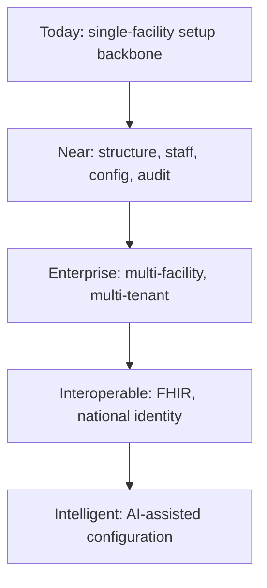
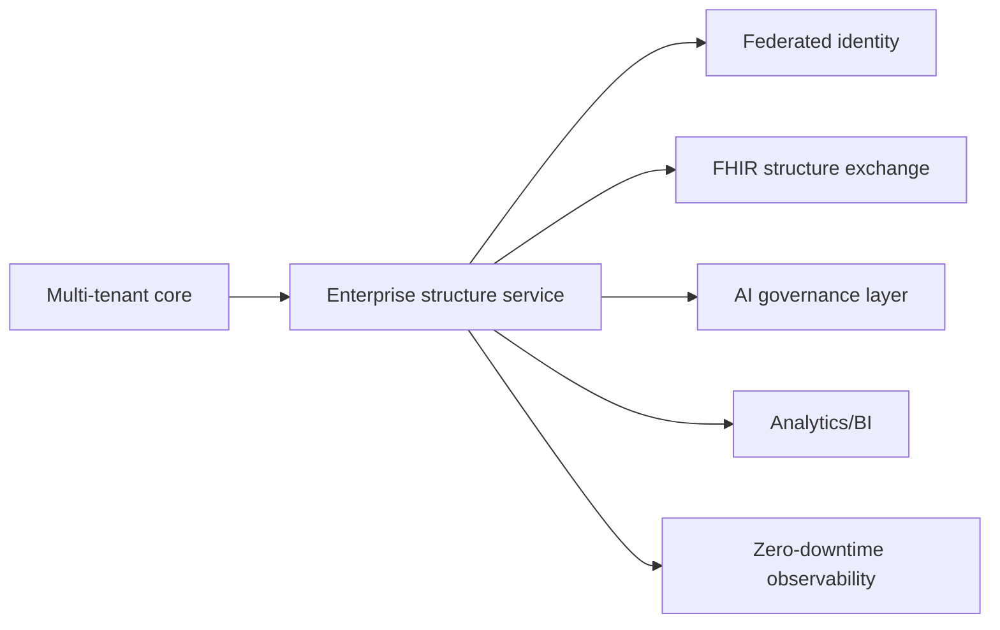

# Hospital Setup Module — Future Roadmap

> **Document ID:** `hospital-setup/24-Future-Roadmap`
> **Owner:** Architecture / Engineering Lead (hospital configuration)
> **Status:** 🔄 Living / Forward-looking
> **Version:** 1.0.0
> **Last updated:** 2026-08-06
> **Review cadence:** Re-reviewed at every phase gate and annually.
>
> **Relationship:** This document defines the **strategic evolution** of the Hospital Setup module over a 5–10 year horizon. It is the forward-looking companion to the approved baseline and the near-term plan in [00-MASTER-ROADMAP](../../00-MASTER-ROADMAP.md). It builds on the applicability boundaries established in [18-Integrations](18-Integrations.md) §1.1 and the deferred items in [README](README.md) §12.

---

## Table of Contents

1. [Vision](#1-vision)
2. [Strategic Objectives](#2-strategic-objectives)
3. [Product Roadmap](#3-product-roadmap)
4. [Phase 2 Enhancements](#4-phase-2-enhancements)
5. [Phase 3 Enhancements](#5-phase-3-enhancements)
6. [Enterprise Expansion](#6-enterprise-expansion)
7. [Multi-Hospital & Multi-Tenant Evolution](#7-multi-hospital--multi-tenant-evolution)
8. [Internationalization & Localization](#8-internationalization--localization)
9. [AI & Automation Roadmap](#9-ai--automation-roadmap)
10. [Clinical Integration Roadmap](#10-clinical-integration-roadmap)
11. [Interoperability Roadmap (HL7, FHIR, DICOM)](#11-interoperability-roadmap-hl7-fhir-dicom)
12. [Government & Regulatory Integration](#12-government--regulatory-integration)
13. [Analytics & BI Roadmap](#13-analytics--bi-roadmap)
14. [Security Roadmap](#14-security-roadmap)
15. [Performance & Scalability Roadmap](#15-performance--scalability-roadmap)
16. [Cloud & DevOps Roadmap](#16-cloud--devops-roadmap)
17. [Technical Debt Strategy](#17-technical-debt-strategy)
18. [Innovation Opportunities](#18-innovation-opportunities)
19. [Success Metrics](#19-success-metrics)
20. [Risks & Assumptions](#20-risks--assumptions)
21. [Dependencies](#21-dependencies)
22. [Long-term Architecture Vision](#22-long-term-architecture-vision)
23. [Cross References](#23-cross-references)
24. [Executive Summary](#24-executive-summary)

---

## 1. Vision

The Hospital Setup module will evolve from the **organizational and configuration backbone of a single facility** into the **enterprise identity and structure backbone of a multi-hospital healthcare group** — the canonical, audited, and interoperable source of truth for *where the organization is, how it is organized, who works where, and how it is configured* — trusted by every clinical, financial, and operational module and interoperable with national and international health infrastructure.

---

## 2. Strategic Objectives

| # | Objective | Horizon |
| --- | --- | --- |
| FR-01 | Multi-facility, multi-tenant structure | 2–3 years |
| FR-02 | National/regional identity interoperability | 3–5 years |
| FR-03 | FHIR-based structure exchange | 2–4 years |
| FR-04 | AI-assisted configuration and governance | 3–5 years |
| FR-05 | Global localization and regulatory readiness | 3–5 years |
| FR-06 | Zero-downtime, highly observable operation | 1–2 years |

---

## 3. Product Roadmap

| Horizon | Focus | Deliverables |
| --- | --- | --- |
| Near (0–1 yr) | Baseline hardening | Live approval workflows, import/export polish |
| Medium (1–3 yr) | Multi-facility | Multi-facility data model, enterprise hierarchy |
| Long (3–5 yr) | Interoperability | FHIR structure, national identity |
| Strategic (5–10 yr) | Intelligent enterprise | AI governance, global localization |

Per [00-MASTER-ROADMAP](../../00-MASTER-ROADMAP.md) phase sequencing.

---

## 4. Phase 2 Enhancements

| Enhancement | Description |
| --- | --- |
| Room/bed lifecycle | Room-level assignment tracking (deferred in [README](README.md) §12) |
| Bulk refresh UI | In-browser review of bulk imports before commit |
| Export scheduling | Scheduled report/export distribution |
| Assignment history UI | Timeline view of staff assignments |
| Config version compare | Diff across configuration snapshots |

---

## 5. Phase 3 Enhancements

| Enhancement | Description |
| --- | --- |
| Enterprise hierarchy | Location group → facility → site modelling |
| Centralized role matrix | Data-driven permission matrix administration |
| Structure templates | Reusable facility/department templates |
| Approval delegation | Delegated and multi-level approvals |
| Reference catalog federation | Central + facility-specific reference data |

---

## 6. Enterprise Expansion

| Aspect | Direction |
| --- | --- |
| Multi-hospital groups | Consolidated structure across facilities |
| Corporate functions | Group-level departments/units |
| Shared services | Cross-facility assignment and configuration |
| Standardization | Enterprise templates and governance |
| Regional hubs | Hub-and-spoke facility relationships |

Consistent with the multi-facility readiness in [07-ROLES-PERMISSIONS](../../07-ROLES-PERMISSIONS.md) §10.

---

## 7. Multi-Hospital & Multi-Tenant Evolution

| Aspect | Now | Future |
| --- | --- | --- |
| Tenancy | Single-facility first | Multi-facility within tenant; multi-tenant SaaS ([09-MULTI-TENANCY](../../09-MULTI-TENANCY.md)) |
| Scoping | Facility-scoped roles | Group/hub-scoped roles |
| Isolation | RLS per facility | Extended hierarchy-aware isolation |
| Cross-tenant | Forbidden | Contracted, governed sharing |

---

## 8. Internationalization & Localization

| Aspect | Direction |
| --- | --- |
| Locales | Multi-locale UI ([08-UI](08-UI.md) §18) |
| Regulatory variants | Per-country compliance rules ([00-MASTER-ROADMAP](../../00-MASTER-ROADMAP.md) §15) |
| Terminology | Local terminology sets ([18-Integrations](18-Integrations.md)) |
| Time zones | Multi-timezone operations |
| Language | Right-to-left support in design system ([13-DESIGN-SYSTEM](../../13-DESIGN-SYSTEM.md)) |

---

## 9. AI & Automation Roadmap

| Opportunity | Description | Benefit |
| --- | --- | --- |
| Structure validation | AI checks for orphaned/inconsistent structure | Integrity |
| Duplicate detection | Fuzzy matching of nodes/reference values | Quality |
| Config recommendations | Suggest configuration based on facility type | Efficiency |
| Anomaly detection | Flag unusual assignment/change patterns | Security |
| Natural-language review | Summarize change history for auditors | Productivity |
| Automated approval triage | Route proposals to appropriate approvers | Speed |

AI is assistive; **human approval remains mandatory** for elevated actions ([11-Permissions](11-Permissions.md) §10).

---

## 10. Clinical Integration Roadmap

| Aspect | Direction |
| --- | --- |
| Relationship today | Setup provides structure to clinical modules ([06-ERD](06-ERD.md) §13) |
| Future | Bidirectional structure awareness with EHR |
| Clinical reference | Shared terminology via reference data |
| Safety | Clinical modules consume verified structure |

Setup remains the source of structure; clinical modules consume it ([18-Integrations](18-Integrations.md) §3).

---

## 11. Interoperability Roadmap (HL7, FHIR, DICOM)

| Standard | Now | Future |
| --- | --- | --- |
| FHIR | Optional Organization/Location mapping ([18-Integrations](18-Integrations.md) §8) | Full structure export/import |
| HL7 v2 | Not applicable to setup | Evaluated for ADT-derived structure |
| DICOM | Not applicable to setup | Imaging references structure |

Alignment: [02-SYSTEM-ARCHITECTURE](../../02-SYSTEM-ARCHITECTURE.md) §11.

---

## 12. Government & Regulatory Integration

| Aspect | Direction |
| --- | --- |
| ABDM | Evaluated for patient/clinical identity ([18-Integrations](18-Integrations.md) §13) |
| NABH | Structure/compliance evidence now; extended accreditation support |
| Regulatory reporting | Structure-based compliance reports ([15-Reports](15-Reports.md) §7) |
| National standards | Align to national health data standards |

---

## 13. Analytics & BI Roadmap

| Aspect | Direction |
| --- | --- |
| Predictive analytics | Assignment coverage forecasting |
| Benchmarking | Structure norms across facilities |
| Advanced dashboards | Deeper executive analytics ([16-Dashboards](16-Dashboards.md)) |
| Self-service BI | User-defined reports ([15-Reports](15-Reports.md)) |
| Data platform | Feeding analytics projections ([05-DATABASE-ARCHITECTURE](../../05-DATABASE-ARCHITECTURE.md)) |

---

## 14. Security Roadmap

| Aspect | Direction |
| --- | --- |
| Continuous compliance | Automated evidence collection |
| Advanced threat | Behavioral anomaly detection |
| Post-quantum | Cryptographic readiness review |
| Zero trust | Deepen device/posture verification ([12-Security](12-Security.md) §14) |
| Privacy | Enhanced consent-aware access |

---

## 15. Performance & Scalability Roadmap

| Aspect | Direction |
| --- | --- |
| Global scale | Multi-region deployments ([21-Deployment](21-Deployment.md) §14) |
| Auto-scaling | Metric-driven scaling ([21-Deployment](21-Deployment.md) §17) |
| Projection scaling | Managed read projections ([19-Performance](19-Performance.md) §6) |
| Cost optimization | Right-sized capacity |
| Edge | Low-latency regional reads where needed |

---

## 16. Cloud & DevOps Roadmap

| Aspect | Direction |
| --- | --- |
| Multi-cloud | Cloud-portable deployment ([16-DEPLOYMENT-STANDARDS](../../16-DEPLOYMENT-STANDARDS.md)) |
| GitOps | Declarative config and deployments |
| IaC | Infrastructure as code |
| SRE practices | SLOs, error budgets |
| DevEx | Developer inner-loop improvements |

---

## 17. Technical Debt Strategy

| Aspect | Direction |
| --- | --- |
| Track | Register debt items ([22-Risks](22-Risks.md)) |
| Quantify | Prioritize by cost/risk |
| Pay down | Allocate per release |
| Prevent | Quality gates ([20-Testing](20-Testing.md) §23) |
| Legacy | Retire ad-hoc naming/migrations |

Per [04-CODING-STANDARDS](../../04-CODING-STANDARDS.md).

---

## 18. Innovation Opportunities

| Opportunity | Description |
| --- | --- |
| Structure-as-code | Version structure in code for review |
| Federated identity | SSO across the group ([18-Integrations](18-Integrations.md) §15) |
| Digital twin | Live operational model of facilities |
| Configuration CI | Test config changes before deploy |
| Conversational admin | Assistant-driven configuration |

---

## 19. Success Metrics

| Metric | Target |
| --- | --- |
| Adoption | All facilities configured |
| Integrity | Zero orphaned/cycle findings |
| Approval time | ≤ 24 h median |
| Availability | ≥ 99.9% ([00-MASTER-ROADMAP](../../00-MASTER-ROADMAP.md) §2.2) |
| Interoperability | FHIR exchange operational |
| Multi-tenant | Enterprise deployment live |
| Automation | % of routine changes assisted |

---

## 20. Risks & Assumptions

| Item | Type | Mitigation |
| --- | --- | --- |
| Regulatory change | Assumption | Compliance review ([22-Risks](22-Risks.md) §8) |
| Multi-tenant complexity | Risk | Phased rollout ([22-Risks](22-Risks.md)) |
| AI reliability | Risk | Human-in-the-loop approval |
| Interop standards shift | Risk | Standards-based design ([18-Integrations](18-Integrations.md)) |
| Scope pressure | Risk | Roadmap governance ([00-MASTER-ROADMAP](../../00-MASTER-ROADMAP.md)) |

---

## 21. Dependencies

| Dependency | On | Notes |
| --- | --- | --- |
| Multi-tenancy | [09-MULTI-TENANCY](../../09-MULTI-TENANCY.md) | Enables multi-facility |
| Identity | [06-AUTHENTICATION](../../06-AUTHENTICATION.md) | Federated SSO |
| Interop platform | [02-SYSTEM-ARCHITECTURE](../../02-SYSTEM-ARCHITECTURE.md) §11 | FHIR/exchange |
| Analytics platform | [05-DATABASE-ARCHITECTURE](../../05-DATABASE-ARCHITECTURE.md) | BI projections |
| Design system | [13-DESIGN-SYSTEM](../../13-DESIGN-SYSTEM.md) | Localization/RTL |

---

## 22. Long-term Architecture Vision

The module remains a **modular component within the platform monolith** until demonstrated need justifies extraction ([02-SYSTEM-ARCHITECTURE](../../02-SYSTEM-ARCHITECTURE.md) §4), then evolves into an independent structure service with clean contracts.

---

## 23. Cross References

| Reference | Relationship | Direction |
| --- | --- | --- |
| [README](README.md) | Deferred items (§12) | Consumes |
| [08-UI](08-UI.md) | Localization | Consumes |
| [09-UX](09-UX.md) | Adoption | Consumes |
| [15-Reports](15-Reports.md) | Analytics | Consumes |
| [16-Dashboards](16-Dashboards.md) | BI | Consumes |
| [18-Integrations](18-Integrations.md) | Interop boundaries | Consumes |
| [20-Testing](20-Testing.md) | Quality gates | Consumes |
| [21-Deployment](21-Deployment.md) | Cloud/DevOps | Consumes |
| [22-Risks](22-Risks.md) | Risk/assumptions | Consumes |
| [23-Changelog](23-Changelog.md) | Version history | Consumes |
| [00-MASTER-ROADMAP](../../00-MASTER-ROADMAP.md) | Near-term plan | Consumes |
| [02-SYSTEM-ARCHITECTURE](../../02-SYSTEM-ARCHITECTURE.md) | Architecture vision | Consumes |
| [05-DATABASE-ARCHITECTURE](../../05-DATABASE-ARCHITECTURE.md) | Analytics platform | Consumes |
| [06-AUTHENTICATION](../../06-AUTHENTICATION.md) | Federated identity | Consumes |
| [09-MULTI-TENANCY](../../09-MULTI-TENANCY.md) | Multi-tenant evolution | Consumes |
| [13-DESIGN-SYSTEM](../../13-DESIGN-SYSTEM.md) | Localization | Consumes |

---

## 24. Executive Summary

The Hospital Setup module is positioned to grow from a **single-facility configuration backbone** into the **enterprise structure and identity backbone of a multi-hospital group**, delivered over three horizons:

1. **Near (0–1 yr):** harden the approved baseline — live approvals, polish import/export, and defer to the near-term roadmap.
2. **Medium (1–3 yr):** enable **multi-facility, multi-tenant** operation, enterprise hierarchies, and FHIR structure exchange.
3. **Strategic (3–10 yr):** deliver **national interoperability** (FHIR, ABDM), **AI-assisted configuration** with mandatory human approval, and **global localization** — all on a zero-downtime, observable, and secure platform.

Success is measured by adoption, data integrity, fast approvals, high availability, and operational interoperability — always governed by the human-approval and clinical-safety principles established in the baseline.

---

*End of `docs/modules/hospital-setup/24-Future-Roadmap.md`.*
