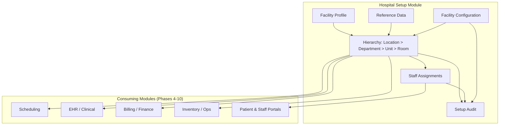
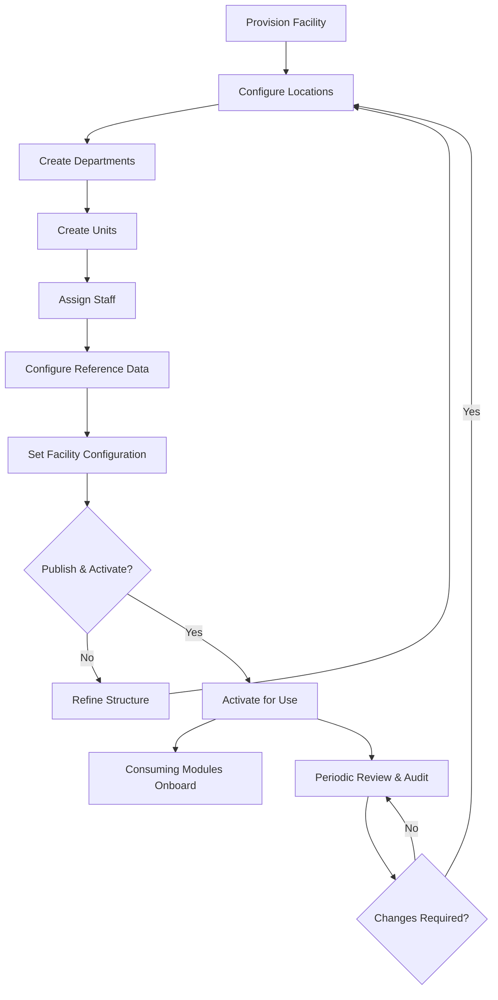
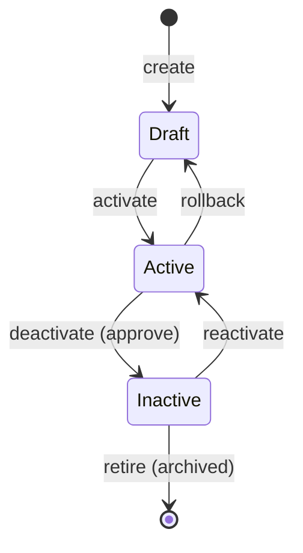
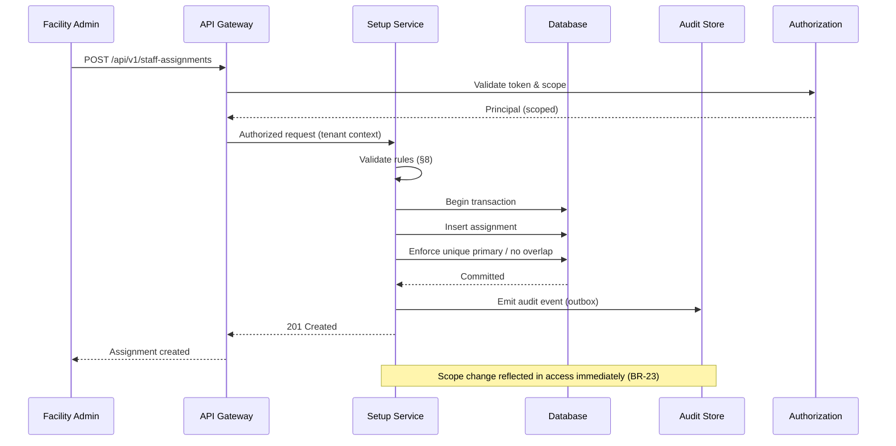
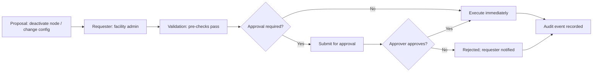
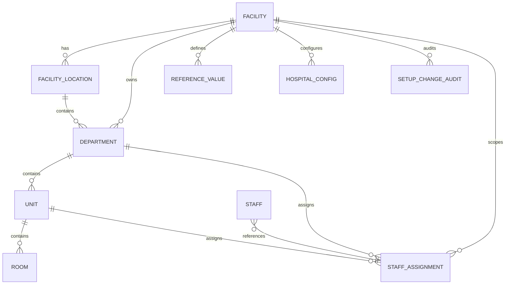
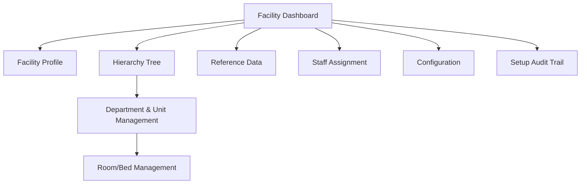

# Hospital Setup Module

> **Module ID:** `hospital-setup`
> **Document:** `docs/modules/hospital-setup/README.md`
> **Owner:** Architecture / Engineering Lead (hospital configuration)
> **Status:** 🔄 Pending approval (Phase 1 gate)
> **Version:** 2.0.0
> **Last updated:** 2026-08-06
> **Review cadence:** Re-reviewed at every phase gate and whenever the hospital structure model changes.
>
> **Relationship:** Defines the hospital configuration module — the organizational baseline every other module depends on. It implements the hierarchy in [10-HOSPITAL-HIERARCHY](../../10-HOSPITAL-HIERARCHY.md), the tenancy isolation in [09-MULTI-TENANCY](../../09-MULTI-TENANCY.md), and the authorization model in [07-ROLES-PERMISSIONS](../../07-ROLES-PERMISSIONS.md). Data storage follows [05-DATABASE-ARCHITECTURE](../../05-DATABASE-ARCHITECTURE.md); APIs follow [11-API-STANDARDS](../../11-API-STANDARDS.md).

---

## Table of Contents

1. [Module Overview](#1-module-overview)
2. [Business Requirements](#2-business-requirements)
3. [User Roles](#3-user-roles)
4. [Workflow](#4-workflow)
5. [Database Tables](#5-database-tables)
6. [Relationships](#6-relationships)
7. [UI Screens](#7-ui-screens)
8. [Validation Rules](#8-validation-rules)
9. [APIs](#9-apis)
10. [Security](#10-security)
11. [Reports](#11-reports)
12. [Future Enhancements](#12-future-enhancements)

---

## 1. Module Overview

### 1.1 Purpose

The **Hospital Setup** module establishes the foundational configuration and organizational structure of the hospital within the ERP platform. It defines *where the hospital is, how it is organized, who works where, and how the platform is configured to operate* — the baseline that every clinical, financial, and operational workflow references.

Without this module, no other capability can function correctly: a patient record needs a facility, an appointment needs a department and location, an order needs a unit, and a user needs scoped assignments to know what they may access.

### 1.2 Mission

Provide a single, authoritative, tenant-scoped model of the hospital organization and configuration that:

- Gives every module a stable reference for facility, location, department, and unit.
- Enables precise, least-privilege access scoping through staff assignments.
- Keeps the structure accurate, versioned, and audited as the hospital evolves.
- Scales from a single facility to a multi-facility enterprise without rework.

### 1.3 Scope

**In scope:**

- Facility profile and operating parameters.
- Organizational hierarchy: locations, departments, units, and optional rooms/beds.
- Setup reference data (specialties, service types, shift templates, operating profiles).
- Staff-to-department/unit assignments and setup-time role provisioning.
- Facility/tenant-level configuration.
- Full audit of all setup changes.

**Out of scope:**

- Patient master, scheduling, EHR, billing, and inventory workflows (separate modules).
- The identity and role/permission catalog itself (see [07-ROLES-PERMISSIONS](../../07-ROLES-PERMISSIONS.md)).
- Clinical, financial, or operational data (managed by their respective modules).
- Multi-tenant *SaaS* hosting (v1 is single-facility-first; see [09-MULTI-TENANCY](../../09-MULTI-TENANCY.md)).

### 1.4 Strategic Context

This module is the foundation of the **Registry** capability and is sequenced in Phase 3 of the [00-MASTER-ROADMAP](../../00-MASTER-ROADMAP.md). It operationalizes the hospital hierarchy defined in [10-HOSPITAL-HIERARCHY](../../10-HOSPITAL-HIERARCHY.md).



### 1.5 Principles

| # | Principle | Consequence |
| --- | --- | --- |
| S1 | **One canonical structure** | A single source of truth for the organization model, referenced by all modules; no duplicated structure. |
| S2 | **Flexible and configurable** | Supports varied hospital structures without code changes. |
| S3 | **Scoping anchor** | The hierarchy drives data and authorization scoping ([10-HOSPITAL-HIERARCHY](../../10-HOSPITAL-HIERARCHY.md)). |
| S4 | **Auditable** | Structure, assignments, and configuration changes are immutable-logged ([08-AUDIT-LOGGING](../../08-AUDIT-LOGGING.md)). |
| S5 | **Non-destructive** | No hard deletes of nodes with data; deactivation and reassignment preserve history. |
| S6 | **Tenant-isolated** | All setup data is scoped to the facility/tenant ([09-MULTI-TENANCY](../../09-MULTI-TENANCY.md)). |
| S7 | **Least privilege** | Access is derived from assignments; setup writes are elevated and approved. |

### 1.6 Glossary of Terms

| Term | Definition |
| --- | --- |
| **Facility** | The top-level organizational and tenant boundary; owns configuration and reference data. |
| **Location** | A physical or administrative grouping (campus, building, site) under a facility. |
| **Department** | A functional area (clinical or administrative) with an owner/head. |
| **Unit** | A sub-area of a department (ward, ICU, lab station, service desk). |
| **Room / Bed** | Optional granular operational tracking under a unit. |
| **Staff assignment** | The relationship of a staff member to a department/unit, with a primary/secondary designation and effective dates. |
| **Reference value** | Setup-time controlled vocabulary (specialty, service type, shift template). |
| **Facility configuration** | Operating parameters (time zone, contact, defaults, feature toggles). |
| **Tenant scope** | The set of facilities a principal is authorized to act within. |

### 1.7 Assumptions & Dependencies

| Assumption / Dependency | Notes |
| --- | --- |
| Identity and roles exist | The module consumes IAM from Phase 2 ([06-AUTHENTICATION](../../06-AUTHENTICATION.md)). |
| Staff master exists | Assignments reference the staff registry (Registry module, Phase 3). |
| Tenancy model present | Facility == tenant root ([09-MULTI-TENANCY](../../09-MULTI-TENANCY.md)). |
| Design system available | UI follows [13-DESIGN-SYSTEM](../../13-DESIGN-SYSTEM.md). |
| API standards established | Endpoints follow [11-API-STANDARDS](../../11-API-STANDARDS.md). |
| Single facility in v1 | Multi-facility is model-ready but not active in v1. |

---

## 2. Business Requirements

Requirements are grouped by capability and carry a priority per the MoSCoW convention. Every requirement traces to the platform objectives in [01-ENTERPRISE-VISION](../../01-ENTERPRISE-VISION.md) and to the roadmap's Definition of Done in [00-MASTER-ROADMAP](../../00-MASTER-ROADMAP.md).

### 2.1 Requirement Naming

| Element | Convention |
| --- | --- |
| Identifier | `HS-BR-<NN>` |
| Priority | **Must** (v1 mandatory), **Should** (v1 important), **Could** (desirable), **Won't** (explicitly out of v1) |
| Trace | Each requirement references a platform objective and the hierarchy model section it implements |

### 2.2 Facility & Tenant Management

| ID | Requirement | Priority | Trace |
| --- | --- | --- | --- |
| HS-BR-01 | The system MUST support creating a facility profile with identity, type, and status. | Must | [10-HOSPITAL-HIERARCHY](../../10-HOSPITAL-HIERARCHY.md) §4 |
| HS-BR-02 | The system MUST support a unique facility code within the tenant. | Must | [05-DATABASE-ARCHITECTURE](../../05-DATABASE-ARCHITECTURE.md) §7 |
| HS-BR-03 | The system MUST capture facility address, contact, and time zone. | Must | [10-HOSPITAL-HIERARCHY](../../10-HOSPITAL-HIERARCHY.md) §4 |
| HS-BR-04 | The system MUST allow updating the facility profile while preserving history. | Must | [08-AUDIT-LOGGING](../../08-AUDIT-LOGGING.md) §3 |
| HS-BR-05 | The system MUST prevent deactivating a facility that has active children or references. | Must | §8 Validation Rules |
| HS-BR-06 | The system MUST scope all facility data to its tenant. | Must | [09-MULTI-TENANCY](../../09-MULTI-TENANCY.md) §4 |
| HS-BR-07 | The system SHOULD support multiple facilities under an enterprise with isolated data. | Should | [09-MULTI-TENANCY](../../09-MULTI-TENANCY.md) §9 |
| HS-BR-08 | The system COULD support facility branding/theme via configuration tokens. | Could | [13-DESIGN-SYSTEM](../../13-DESIGN-SYSTEM.md) §6 |

### 2.3 Organizational Hierarchy

| ID | Requirement | Priority | Trace |
| --- | --- | --- | --- |
| HS-BR-09 | The system MUST support a configurable hierarchy: locations → departments → units → rooms. | Must | [10-HOSPITAL-HIERARCHY](../../10-HOSPITAL-HIERARCHY.md) §3 |
| HS-BR-10 | The system MUST enforce that each node references a valid parent. | Must | §8 Validation Rules |
| HS-BR-11 | The system MUST prevent hierarchy cycles on re-parenting. | Must | §8 Validation Rules |
| HS-BR-12 | The system MUST support creating, updating, and deactivating nodes. | Must | §4 Workflow |
| HS-BR-13 | The system MUST NOT hard-delete a node that has data; deactivation is the removal path. | Must | S5 principle |
| HS-BR-14 | The system MUST version hierarchy changes so historical records stay accurate. | Must | §4 Workflow |
| HS-BR-15 | The system MUST type departments as clinical or administrative. | Must | [10-HOSPITAL-HIERARCHY](../../10-HOSPITAL-HIERARCHY.md) §5 |
| HS-BR-16 | The system SHOULD support arbitrary hierarchy depth / custom node types. | Should | [10-HOSPITAL-HIERARCHY](../../10-HOSPITAL-HIERARCHY.md) §10 |
| HS-BR-17 | The system COULD support room/bed tracking for operational modules. | Could | §12 Future Enhancements |

### 2.4 Staff Assignment & Scoping

| ID | Requirement | Priority | Trace |
| --- | --- | --- | --- |
| HS-BR-18 | The system MUST assign each staff member a primary department/unit and optional secondaries. | Must | [07-ROLES-PERMISSIONS](../../07-ROLES-PERMISSIONS.md) §7 |
| HS-BR-19 | The system MUST derive a staff member's access scope from their assignments. | Must | [06-AUTHENTICATION](../../06-AUTHENTICATION.md) §8 |
| HS-BR-20 | The system MUST prevent overlapping active primary assignments. | Must | §8 Validation Rules |
| HS-BR-21 | The system MUST enforce effective dates (start ≤ end) on assignments. | Must | §8 Validation Rules |
| HS-BR-22 | The system MUST only allow assignments within facilities the assigning user is scoped to. | Must | §8 Validation Rules |
| HS-BR-23 | The system MUST immediately reflect assignment changes in access. | Must | [06-AUTHENTICATION](../../06-AUTHENTICATION.md) §6 |
| HS-BR-24 | The system SHOULD support historical assignment records for audit. | Should | [08-AUDIT-LOGGING](../../08-AUDIT-LOGGING.md) §5 |

### 2.5 Reference Data & Configuration

| ID | Requirement | Priority | Trace |
| --- | --- | --- | --- |
| HS-BR-25 | The system MUST manage setup reference data (specialties, service types, shift templates). | Must | §5 Database Tables |
| HS-BR-26 | The system MUST enforce uniqueness of reference category + code within a facility. | Must | §8 Validation Rules |
| HS-BR-27 | The system MUST support facility operating configuration (time zone, contacts, defaults). | Must | §5 Database Tables |
| HS-BR-28 | The system MUST validate configuration keys against a known schema. | Must | §8 Validation Rules |
| HS-BR-29 | The system SHOULD support reference data inheritance/overrides at lower hierarchy levels. | Should | §12 Future Enhancements |

### 2.6 Audit & Governance

| ID | Requirement | Priority | Trace |
| --- | --- | --- | --- |
| HS-BR-30 | The system MUST record the full audit trail of all setup changes (actor, action, entity, time). | Must | [08-AUDIT-LOGGING](../../08-AUDIT-LOGGING.md) §3 |
| HS-BR-31 | The system MUST make the audit trail immutable and tamper-evident. | Must | [08-AUDIT-LOGGING](../../08-AUDIT-LOGGING.md) §6 |
| HS-BR-32 | The system MUST require approval for deactivation and elevated setup actions. | Must | §10 Security |
| HS-BR-33 | The system SHOULD support periodic review of structure and assignments. | Should | [00-MASTER-ROADMAP](../../00-MASTER-ROADMAP.md) §8 |
| HS-BR-34 | The system MUST NOT log sensitive data (no PHI, no secrets) in setup records. | Must | [04-CODING-STANDARDS](../../04-CODING-STANDARDS.md) §9 |

### 2.7 Non-Functional Requirements

| ID | Requirement | Priority | Trace |
| --- | --- | --- | --- |
| HS-BR-35 | Setup reads MUST respond within the platform SLO (p95 < 1 s). | Must | [14-PERFORMANCE-STANDARDS](../../14-PERFORMANCE-STANDARDS.md) §3 |
| HS-BR-36 | Setup writes MUST be ACID and atomic (no partial hierarchy). | Must | [05-DATABASE-ARCHITECTURE](../../05-DATABASE-ARCHITECTURE.md) §6 |
| HS-BR-37 | The module MUST be covered by automated tests including negative/guardrail cases. | Must | [15-TESTING-STANDARDS](../../15-TESTING-STANDARDS.md) §8 |
| HS-BR-38 | Setup UI MUST meet WCAG 2.1 AA accessibility. | Must | [12-UI-UX-GUIDELINES](../../12-UI-UX-GUIDELINES.md) §4 |
| HS-BR-39 | Setup changes MUST be deployable via versioned migrations. | Must | [16-DEPLOYMENT-STANDARDS](../../16-DEPLOYMENT-STANDARDS.md) §8 |

---

## 3. User Roles

Setup actions are governed by the role/permission model in [07-ROLES-PERMISSIONS](../../07-ROLES-PERMISSIONS.md). The module defines a minimal, scoped permission surface.

### 3.1 Permissions Used by the Module

| Permission | Definition |
| --- | --- |
| `hospital:configure` | Create, update, deactivate facilities, hierarchy, assignments, reference data, and configuration. |
| `hospital:read` | View setup data (read-only). |
| `audit:read` | View the setup audit trail. |
| `hospital:approve` | Approve elevated/deactivation changes. |

### 3.2 Role × Permission Matrix

| Role | Scope | `hospital:read` | `hospital:configure` | `hospital:approve` | `audit:read` |
| --- | --- | :---: | :---: | :---: | :---: |
| **System administrator** | Global | ✓ | ✓ | ✓ | ✓ |
| **Facility administrator** | Per facility | ✓ | ✓ | ✓ | ✓ |
| **Facility admin (view)** | Per facility | ✓ | · | · | · |
| **Auditor** | Global read | ✓ | · | · | ✓ |

> The full role catalog (including clinical, finance, and operations roles that *consume* setup data) is defined in [07-ROLES-PERMISSIONS](../../07-ROLES-PERMISSIONS.md) §4. This module only owns the configuration-facing roles above.

### 3.3 Role Responsibilities

| Role | Responsibilities | Elevated actions |
| --- | --- | --- |
| **System administrator** | Global structure and config; enterprise-level reference data; cross-facility oversight. | Facility deactivation, global config changes, approvals. |
| **Facility administrator** | Facility profile, hierarchy, staff assignments, local reference data, operating config. | Deactivation, assignment changes, config changes. |
| **Facility admin (view)** | Read-only visibility of structure and assignments for planning. | None. |
| **Auditor** | Review structure, assignments, and audit trail for compliance. | None (read-only). |

### 3.4 Decision Table — Who May Perform an Action

| Action | System admin | Facility admin | Facility admin (view) | Auditor |
| --- | :---: | :---: | :---: | :---: |
| Create facility | ✓ | · | · | · |
| Update facility profile | ✓ | ✓ (own) | · | · |
| Deactivate facility | ✓ (approve) | ✓ (propose) | · | · |
| Manage locations/departments/units | ✓ | ✓ (own facility) | · | · |
| Assign staff | ✓ | ✓ (own facility) | · | · |
| Manage reference data | ✓ | ✓ (own facility) | · | · |
| Manage configuration | ✓ | ✓ (own facility) | · | · |
| View structure | ✓ | ✓ | ✓ | ✓ |
| View audit trail | ✓ | · | · | ✓ |

**Enforcement:** coarse checks at the gateway; fine-grained scope re-checked in services; RLS backstop per [09-MULTI-TENANCY](../../09-MULTI-TENANCY.md).

---

## 4. Workflow

### 4.1 Provisioning Workflow (Setup Lifecycle)

The end-to-end flow from creating a facility to making it operational.



### 4.2 State Transitions for a Hierarchy Node



**Rules:**
- A node moves **Draft → Active** on publish.
- **Active → Inactive** requires approval and requires no active children.
- **Inactive → Active** is a controlled reactivation.
- **Retire** is an archive path, never a hard delete.

### 4.3 Sequence Diagram — Staff Assignment



### 4.4 Approval Workflow for Elevated Actions



**Approval matrix:**

| Change type | Approval required | Approver |
| --- | :---: | --- |
| Create facility | No | — |
| Update facility profile | No | — |
| Deactivate facility / node | Yes | System admin |
| Staff assignment create/change | No | — |
| Staff assignment revoke | Yes | Facility admin / system admin |
| Reference data add/edit | No | — |
| Global configuration change | Yes | System admin |
| Facility configuration change | No | Facility admin |

### 4.5 Operational Decision Table — Hierarchy Change Effects

| Change | Impact on existing data | Impact on access scope | Required action |
| --- | --- | --- | --- |
| Add a unit | None (new records only) | None | Publish |
| Rename a unit | None (same id) | None | Update + audit |
| Re-parent a unit to another department | Historical records keep old department (versioned) | Scope updates to new department | Re-parent + publish |
| Deactivate a unit | Future records disallowed; history preserved | Access revoked for that unit | Approve + deactivate |
| Merge two units | Reassignment required | Scope consolidated | Approve + reassign + deactivate |

---

## 5. Database Tables

> Governed as versioned migrations under `database/` per [05-DATABASE-ARCHITECTURE](../../05-DATABASE-ARCHITECTURE.md). Naming follows [04-CODING-STANDARDS](../../04-CODING-STANDARDS.md) (`snake_case`, explicit constraint names). Every tenant-scoped table carries `tenant_id` and row-level security per [09-MULTI-TENANCY](../../09-MULTI-TENANCY.md).

### 5.1 Table Catalog

| # | Table | Purpose | Tenant-scoped | Audit |
| --- | --- | --- | :---: | :---: |
| 1 | `facility` | Facility/tenant root profile | Yes | Yes |
| 2 | `facility_location` | Physical/administrative locations | Yes | Yes |
| 3 | `department` | Functional areas (clinical/admin) | Yes | Yes |
| 4 | `unit` | Sub-areas of departments | Yes | Yes |
| 5 | `room` | Optional rooms/beds | Yes | Yes |
| 6 | `staff_assignment` | Staff to departments/units | Yes | Yes |
| 7 | `reference_value` | Setup reference data | Yes | Yes |
| 8 | `hospital_config` | Facility operating parameters | Yes | Yes |
| 9 | `setup_change_audit` | Audit of setup changes | Yes | Yes (append-only) |

### 5.2 Column Specifications

#### Table: `facility`

| Column | Type | Null | Default | Constraint / Notes |
| --- | --- | :---: | --- | --- |
| `id` | `uuid` | No | gen | `pk_facility` |
| `tenant_id` | `uuid` | No | — | `fk_facility_tenant`; RLS key |
| `code` | `varchar(20)` | No | — | `uq_facility_tenant_code` (unique per tenant) |
| `name` | `varchar(120)` | No | — | required |
| `facility_type` | `varchar(40)` | No | `general` | enum: general, specialty, clinic, other |
| `status` | `varchar(20)` | No | `draft` | enum: draft, active, inactive, retired |
| `time_zone` | `varchar(64)` | No | `UTC` | IANA name |
| `address_line1` | `varchar(200)` | Yes | — | |
| `address_line2` | `varchar(200)` | Yes | — | |
| `city` | `varchar(100)` | Yes | — | |
| `region` | `varchar(100)` | Yes | — | |
| `postal_code` | `varchar(20)` | Yes | — | |
| `country` | `varchar(80)` | Yes | — | |
| `primary_phone` | `varchar(30)` | Yes | — | |
| `primary_email` | `varchar(120)` | Yes | — | email format |
| `created_by` | `uuid` | No | — | actor |
| `created_at` | `timestamptz` | No | now | |
| `updated_by` | `uuid` | No | — | actor |
| `updated_at` | `timestamptz` | No | now | |

#### Table: `facility_location`

| Column | Type | Null | Default | Constraint / Notes |
| --- | --- | :---: | --- | --- |
| `id` | `uuid` | No | gen | `pk_facility_location` |
| `tenant_id` | `uuid` | No | — | `fk_location_tenant`; RLS key |
| `facility_id` | `uuid` | No | — | `fk_location_facility` |
| `code` | `varchar(20)` | No | — | `uq_location_facility_code` |
| `name` | `varchar(120)` | No | — | |
| `address` | `varchar(300)` | Yes | — | |
| `status` | `varchar(20)` | No | `active` | enum: active, inactive |
| `created_at` | `timestamptz` | No | now | |
| `updated_at` | `timestamptz` | No | now | |

#### Table: `department`

| Column | Type | Null | Default | Constraint / Notes |
| --- | --- | :---: | --- | --- |
| `id` | `uuid` | No | gen | `pk_department` |
| `tenant_id` | `uuid` | No | — | `fk_department_tenant`; RLS key |
| `facility_id` | `uuid` | No | — | `fk_department_facility` |
| `location_id` | `uuid` | No | — | `fk_department_location` |
| `code` | `varchar(20)` | No | — | `uq_department_location_code` |
| `name` | `varchar(120)` | No | — | |
| `department_type` | `varchar(20)` | No | `clinical` | enum: clinical, administrative |
| `head_staff_id` | `uuid` | Yes | — | optional dept head |
| `status` | `varchar(20)` | No | `active` | enum: active, inactive |
| `created_at` | `timestamptz` | No | now | |
| `updated_at` | `timestamptz` | No | now | |

#### Table: `unit`

| Column | Type | Null | Default | Constraint / Notes |
| --- | --- | :---: | --- | --- |
| `id` | `uuid` | No | gen | `pk_unit` |
| `tenant_id` | `uuid` | No | — | `fk_unit_tenant`; RLS key |
| `department_id` | `uuid` | No | — | `fk_unit_department` |
| `code` | `varchar(20)` | No | — | `uq_unit_department_code` |
| `name` | `varchar(120)` | No | — | |
| `unit_type` | `varchar(40)` | No | `general` | e.g. ward, ICU, lab, pharmacy, service |
| `status` | `varchar(20)` | No | `active` | enum: active, inactive |
| `created_at` | `timestamptz` | No | now | |
| `updated_at` | `timestamptz` | No | now | |

#### Table: `room`

| Column | Type | Null | Default | Constraint / Notes |
| --- | --- | :---: | --- | --- |
| `id` | `uuid` | No | gen | `pk_room` |
| `tenant_id` | `uuid` | No | — | `fk_room_tenant`; RLS key |
| `unit_id` | `uuid` | No | — | `fk_room_unit` |
| `room_code` | `varchar(20)` | No | — | `uq_room_unit_code` |
| `bed_count` | `int` | No | `1` | `> 0` |
| `status` | `varchar(20)` | No | `active` | enum: active, inactive |
| `created_at` | `timestamptz` | No | now | |
| `updated_at` | `timestamptz` | No | now | |

#### Table: `staff_assignment`

| Column | Type | Null | Default | Constraint / Notes |
| --- | --- | :---: | --- | --- |
| `id` | `uuid` | No | gen | `pk_staff_assignment` |
| `tenant_id` | `uuid` | No | — | `fk_assignment_tenant`; RLS key |
| `staff_id` | `uuid` | No | — | `fk_assignment_staff` (Registry master) |
| `department_id` | `uuid` | Yes | — | at least one of dept/unit required |
| `unit_id` | `uuid` | Yes | — | |
| `assignment_type` | `varchar(20)` | No | `primary` | enum: primary, secondary |
| `effective_from` | `date` | No | — | |
| `effective_to` | `date` | Yes | — | null = open-ended |
| `status` | `varchar(20)` | No | `active` | enum: active, inactive |
| `created_at` | `timestamptz` | No | now | |
| `updated_at` | `timestamptz` | No | now | |

**Constraint:** exactly one active primary per staff member (partial unique index on `staff_id` where `assignment_type = 'primary'` and `status = 'active'`).

#### Table: `reference_value`

| Column | Type | Null | Default | Constraint / Notes |
| --- | --- | :---: | --- | --- |
| `id` | `uuid` | No | gen | `pk_reference_value` |
| `tenant_id` | `uuid` | No | — | `fk_reference_tenant`; RLS key |
| `facility_id` | `uuid` | Yes | — | null = enterprise-level |
| `category` | `varchar(60)` | No | — | e.g. specialty, service_type, shift_template |
| `code` | `varchar(40)` | No | — | |
| `label` | `varchar(160)` | No | — | |
| `sort_order` | `int` | No | `0` | non-negative |
| `is_active` | `boolean` | No | `true` | |
| `created_at` | `timestamptz` | No | now | |
| `updated_at` | `timestamptz` | No | now | |

**Constraint:** `uq_reference_facility_category_code` (facility_id, category, code) — unique.

#### Table: `hospital_config`

| Column | Type | Null | Default | Constraint / Notes |
| --- | --- | :---: | --- | --- |
| `id` | `uuid` | No | gen | `pk_hospital_config` |
| `tenant_id` | `uuid` | No | — | `fk_config_tenant`; RLS key |
| `facility_id` | `uuid` | No | — | `fk_config_facility` |
| `config_key` | `varchar(100)` | No | — | validated against schema |
| `config_value` | `jsonb` | No | — | typed value |
| `updated_by` | `uuid` | No | — | actor |
| `updated_at` | `timestamptz` | No | now | |

**Constraint:** `uq_config_facility_key` (facility_id, config_key).

#### Table: `setup_change_audit`

| Column | Type | Null | Default | Constraint / Notes |
| --- | --- | :---: | --- | --- |
| `id` | `uuid` | No | gen | `pk_setup_audit` |
| `tenant_id` | `uuid` | No | — | RLS key |
| `facility_id` | `uuid` | No | — | |
| `event_id` | `uuid` | No | — | |
| `event_type` | `varchar(60)` | No | — | taxonomy per [08-AUDIT-LOGGING](../../08-AUDIT-LOGGING.md) §4 |
| `actor` | `uuid` | No | — | subject id |
| `actor_type` | `varchar(20)` | No | `user` | user/service |
| `action` | `varchar(20)` | No | — | create/update/deactivate/reactivate |
| `resource` | `varchar(80)` | No | — | e.g. `department:...` |
| `outcome` | `varchar(20)` | No | `success` | success/failure/denied |
| `correlation_id` | `uuid` | No | — | |
| `chain_hash` | `varchar(64)` | No | — | integrity per [08-AUDIT-LOGGING](../../08-AUDIT-LOGGING.md) §6 |
| `occurred_at` | `timestamptz` | No | now | |

### 5.3 Indexing Strategy

| Table | Index | Type | Purpose |
| --- | --- | --- | --- |
| `facility` | `tenant_id`, `code` | unique | tenant-scoped uniqueness & lookup |
| `facility_location` | `facility_id`, `code` | unique | hierarchy navigation |
| `department` | `facility_id`, `location_id` | non-unique | lookup by location |
| `unit` | `department_id` | non-unique | lookup by department |
| `room` | `unit_id` | non-unique | lookup by unit |
| `staff_assignment` | `staff_id`, `status` | non-unique | active assignments per staff |
| `staff_assignment` | `staff_id` where `type=primary and status=active` | partial unique | single-primary rule |
| `reference_value` | `facility_id`, `category`, `code` | unique | controlled vocabulary lookup |
| `hospital_config` | `facility_id`, `config_key` | unique | config lookup |
| `setup_change_audit` | `tenant_id`, `occurred_at` | non-unique | audit query by time |

> Index naming and query guidance per [05-DATABASE-ARCHITECTURE](../../05-DATABASE-ARCHITECTURE.md) §7.

---

## 6. Relationships

### 6.1 Entity-Relationship Diagram



### 6.2 Relationship Matrix

| From | To | Cardinality | Type | Notes |
| --- | --- | --- | --- | --- |
| `facility` | `facility_location` | 1:N | Identifying | Location belongs to exactly one facility |
| `facility` | `department` | 1:N | Reference | Department scoped to facility |
| `facility_location` | `department` | 1:N | Reference | Department has one location |
| `department` | `unit` | 1:N | Reference | Unit has one department |
| `unit` | `room` | 1:N | Reference | Room has one unit |
| `department` | `staff_assignment` | 1:N | Reference | Assignment may target a department |
| `unit` | `staff_assignment` | 1:N | Reference | Assignment may target a unit |
| `staff` (Registry) | `staff_assignment` | 1:N | Cross-module | Assignment references staff master |
| `facility` | `reference_value` | 1:N | Reference | Reference data scoped to facility (or enterprise) |
| `facility` | `hospital_config` | 1:N | Reference | Config per facility |
| `facility` | `setup_change_audit` | 1:N | Audit | Audit per facility |

### 6.3 Cross-Module Dependencies

| Consumed from | Consumed by | Nature |
| --- | --- | --- |
| `facility`, `location`, `department`, `unit` | Scheduling, EHR, Billing, Inventory | Read reference for scoping & routing |
| `staff_assignment` | IAM / authorization | Scope derivation ([06-AUTHENTICATION](../../06-AUTHENTICATION.md) §8) |
| `reference_value` | Various modules | Controlled vocabulary |
| `hospital_config` | All modules | Operating parameters |

**Integrity rule:** modules reference setup entities by stable `id`; deactivation must be coordinated to avoid dangling references. The outbox pattern ([05-DATABASE-ARCHITECTURE](../../05-DATABASE-ARCHITECTURE.md) §6) propagates structure changes to consuming modules.

---

## 7. UI Screens

> Follows the design system in [13-DESIGN-SYSTEM](../../13-DESIGN-SYSTEM.md), UX guidelines in [12-UI-UX-GUIDELINES](../../12-UI-UX-GUIDELINES.md), and WCAG 2.1 AA.

### 7.1 Screen Map



### 7.2 Screen Catalog

| # | Screen | Purpose | Key elements | Role access |
| --- | --- | --- | --- | --- |
| 1 | **Facility Dashboard** | Overview of structure health and recent changes | Counts (locations, departments, units), recent changes, inactive nodes, alerts | View |
| 2 | **Facility Profile** | View/edit facility identity and contact | Profile form, status, time zone, contact, audit link | Configure/View |
| 3 | **Hierarchy Tree** | Visualize/manage the org structure | Collapsible tree, add/edit/deactivate, re-parent, publish | Configure |
| 4 | **Department & Unit Management** | CRUD for departments and units | List, filters, form, type selector, status | Configure |
| 5 | **Room/Bed Management** | Optional room/bed tracking | Grid/list, bed counts, status | Configure |
| 6 | **Staff Assignment** | Assign staff to departments/units | Search staff, primary/secondary, effective dates | Configure |
| 7 | **Reference Data** | Manage setup reference values | Category tabs, add/edit, active toggle, sort | Configure |
| 8 | **Configuration** | Facility/system parameters | Key-value settings, validation, audit link | Configure |
| 9 | **Setup Audit Trail** | Review setup changes | Filterable audit list (actor, action, entity, time) | Audit |

### 7.3 Representative Screen — Hierarchy Tree (Layout)

```
┌──────────────────────────────────────────────────────────────────┐
│  Facility Dashboard                     [+ Add] [Publish] [Search] │
├──────────────────────────────────────────────────────────────────┤
│  Facility: St. Mary's General        Status: ● Active              │
│  ▼ Locations                                                       │
│     ▼ Main Campus                            [edit] [add dept]    │
│        ▼ Cardiology (Clinical)                [edit] [add unit]    │
│           ▼ ICU                                [edit]              │
│              ▼ Rooms: 12                          [manage]         │
│           ▼ Ward 3A                             [edit]              │
│        ▼ Emergency (Clinical)                    [edit]            │
│        ▼ Finance (Administrative)                [edit]            │
│     ▼ West Building                            [edit] [add dept]   │
│  ─────────────────────────────────────────────────────────────    │
│  Recent changes: 4 in last 7 days      [View audit trail]          │
└──────────────────────────────────────────────────────────────────┘
```

### 7.4 Interaction & Feedback

| Scenario | Behavior |
| --- | --- |
| Add a department | Inline validation; on success, toast + tree refresh; audit event. |
| Deactivate a node with children | Blocked with actionable message listing active children. |
| Re-parent a unit | Confirmation; historical records preserved; audit event. |
| Assignment overlap | Field-level error identifying the conflicting active assignment. |
| Save configuration | Validates keys; on error shows field-level detail; on success confirms. |
| Publish structure | Confirmation; on success activates and notifies consuming modules. |

---

## 8. Validation Rules

Rules are enforced at the boundary (API) and re-checked in the service layer (defense in depth, [06-AUTHENTICATION](../../06-AUTHENTICATION.md) §8). Each rule references the relevant business requirement.

### 8.1 Field-Level Validation

| Field / Scenario | Rule | Priority | BR ref |
| --- | --- | --- | --- |
| Facility code | Required; unique per tenant; alphanumeric; ≤ 20 chars | Must | HS-BR-02 |
| Facility name | Required; ≤ 120 chars | Must | HS-BR-01 |
| Facility email | Valid email format; optional | Should | HS-BR-03 |
| Department/unit code | Required; unique within parent; ≤ 20 chars | Must | HS-BR-10 |
| Department/unit name | Required; ≤ 120 chars | Must | HS-BR-10 |
| Department type | Clinical or administrative; required | Must | HS-BR-15 |
| Room bed count | Integer > 0 | Must | HS-BR-17 |
| Reference category + code | Required; unique per facility | Must | HS-BR-26 |
| Reference label | Required; ≤ 160 chars | Must | HS-BR-25 |
| Config key | Must match known schema; unknown rejected | Must | HS-BR-28 |
| Staff assignment dates | effective_from ≤ effective_to | Must | HS-BR-21 |

### 8.2 Structural Validation

| Rule | Description | BR ref |
| --- | --- | --- |
| Valid parent | A department must have a valid location; a unit a valid department; a room a valid unit | HS-BR-10 |
| No cycles | Re-parenting cannot create a cycle (node cannot be its own ancestor) | HS-BR-11 |
| Single primary | Exactly one active primary assignment per staff member | HS-BR-20 |
| No active-child deactivation | Cannot deactivate a node with active children | HS-BR-05 / HS-BR-13 |
| No in-use deactivation | Cannot deactivate a node referenced by active data | HS-BR-05 |
| Tenant consistency | Parent and child must belong to the same tenant | HS-BR-06 |
| Assignment scope | Assigning user must be scoped to the facility | HS-BR-22 |

### 8.3 Decision Table — Deactivation Eligibility

| Condition | Eligible to deactivate? |
| --- | :---: |
| Node has no active children AND no active references | Yes |
| Node has active children | No |
| Node is referenced by active data (appointments, orders) | No |
| Node is inactive and has history | Only to retire (archive) |

### 8.4 Decision Table — Staff Assignment Validity

| Condition | Result |
| --- | :---: |
| No active primary exists for staff | Allow as primary |
| An active primary exists for staff | Reject duplicate primary; allow secondary |
| Dates invalid (start > end) | Reject |
| Dates overlap another active primary | Reject |
| Unit/department outside assigner's scope | Reject (403) |

---

## 9. APIs

> REST per [11-API-STANDARDS](../../11-API-STANDARDS.md); OpenAPI contracts; tenant-scoped; versioned (`/api/v{n}`). All responses use the standard envelope; writes are idempotent where retryable.

### 9.1 Endpoint Catalog

| # | Method | Path | Purpose | Idempotent |
| --- | --- | --- | --- | :---: |
| 1 | GET | `/api/v1/facilities` | List facilities | Yes |
| 2 | POST | `/api/v1/facilities` | Create facility | Key |
| 3 | GET | `/api/v1/facilities/{id}` | Read facility | Yes |
| 4 | PUT | `/api/v1/facilities/{id}` | Replace facility | Yes |
| 5 | PATCH | `/api/v1/facilities/{id}` | Partial update | Yes |
| 6 | GET | `/api/v1/facilities/{id}/locations` | List locations | Yes |
| 7 | POST | `/api/v1/facilities/{id}/locations` | Add location | Key |
| 8 | GET | `/api/v1/locations/{id}` | Read location | Yes |
| 9 | PATCH | `/api/v1/locations/{id}` | Update location | Yes |
| 10 | DELETE | `/api/v1/locations/{id}` | Deactivate location | Key |
| 11 | GET | `/api/v1/locations/{id}/departments` | List departments | Yes |
| 12 | POST | `/api/v1/locations/{id}/departments` | Add department | Key |
| 13 | GET | `/api/v1/departments/{id}` | Read department | Yes |
| 14 | PATCH | `/api/v1/departments/{id}` | Update department | Yes |
| 15 | GET | `/api/v1/departments/{id}/units` | List units | Yes |
| 16 | POST | `/api/v1/departments/{id}/units` | Add unit | Key |
| 17 | GET | `/api/v1/units/{id}` | Read unit | Yes |
| 18 | PATCH | `/api/v1/units/{id}` | Update unit | Yes |
| 19 | GET | `/api/v1/units/{id}/rooms` | List rooms | Yes |
| 20 | POST | `/api/v1/units/{id}/rooms` | Add room | Key |
| 21 | GET | `/api/v1/staff-assignments` | List assignments | Yes |
| 22 | POST | `/api/v1/staff-assignments` | Create assignment | Key |
| 23 | GET | `/api/v1/staff-assignments/{id}` | Read assignment | Yes |
| 24 | PATCH | `/api/v1/staff-assignments/{id}` | Update assignment | Yes |
| 25 | DELETE | `/api/v1/staff-assignments/{id}` | Revoke assignment | Key |
| 26 | GET | `/api/v1/reference-values` | List reference values | Yes |
| 27 | POST | `/api/v1/reference-values` | Create reference value | Key |
| 28 | GET | `/api/v1/reference-values/{id}` | Read reference value | Yes |
| 29 | PATCH | `/api/v1/reference-values/{id}` | Update reference value | Yes |
| 30 | GET | `/api/v1/config` | Read facility configuration | Yes |
| 31 | PUT | `/api/v1/config` | Update facility configuration | Yes |
| 32 | GET | `/api/v1/setup-audit` | Query setup audit trail | Yes |

### 9.2 Example — Create Facility

**Request**

```
POST /api/v1/facilities
Idempotency-Key: 7c9e6679-7425-40de-944b-e07fc1f90ae7
Content-Type: application/json

{
  "code": "STMARY",
  "name": "St. Mary's General Hospital",
  "facilityType": "general",
  "timeZone": "America/New_York",
  "addressLine1": "1 Main Street",
  "city": "Springfield",
  "country": "US"
}
```

**Response — 201 Created**

```
{
  "data": {
    "id": "3fa85f64-5717-4562-b3fc-2c963f66afa6",
    "code": "STMARY",
    "name": "St. Mary's General Hospital",
    "facilityType": "general",
    "status": "draft",
    "timeZone": "America/New_York",
    "createdAt": "2026-08-06T14:30:00Z"
  }
}
```

### 9.3 Error Responses

| HTTP | `code` | Meaning | Retryable |
| --- | --- | --- | :---: |
| 400 | `VALIDATION_ERROR` | Field validation failed | No |
| 401 | `UNAUTHENTICATED` | Missing/invalid token | No |
| 403 | `FORBIDDEN` | Not authorized / out of scope | No |
| 404 | `NOT_FOUND` | Resource not found | No |
| 409 | `CONFLICT` | Uniqueness / state conflict (e.g., duplicate primary) | No |
| 422 | `UNPROCESSABLE` | Structural rule violation (e.g., active children) | No |
| 429 | `RATE_LIMITED` | Rate limit exceeded | Yes (after backoff) |
| 5xx | `INTERNAL` | Server error | Yes |

Error envelope follows [11-API-STANDARDS](../../11-API-STANDARDS.md) §6; no stack traces or sensitive data are returned.

---

## 10. Security

### 10.1 Security Objectives

- Every setup action is authenticated and authorized (zero trust).
- Setup data is tenant-isolated and never cross-visible.
- Elevated/deactivation actions are gated and audited.
- No sensitive data (PHI, secrets) is stored or logged by the module.

### 10.2 Security Controls

| Control area | Implementation | Reference |
| --- | --- | --- |
| **Authentication** | OAuth 2.0 / OIDC bearer tokens; MFA for elevated actions | [06-AUTHENTICATION](../../06-AUTHENTICATION.md) §4 |
| **Authorization** | `hospital:configure` / `hospital:read` / `hospital:approve` / `audit:read`; gateway + service re-check | [07-ROLES-PERMISSIONS](../../07-ROLES-PERMISSIONS.md) §9 |
| **Tenant isolation** | `tenant_id` scoping; RLS backstop | [09-MULTI-TENANCY](../../09-MULTI-TENANCY.md) §4 |
| **Elevated-action gating** | Approval workflow + MFA for deactivation and global config | §4.4, [06-AUTHENTICATION](../../06-AUTHENTICATION.md) §9 |
| **Audit** | Immutable, tamper-evident trail of every setup change | [08-AUDIT-LOGGING](../../08-AUDIT-LOGGING.md) §6 |
| **Input validation** | All input validated per §8; parameterized queries; no SQL injection | [04-CODING-STANDARDS](../../04-CODING-STANDARDS.md) §9 |
| **No PHI / secrets** | Module stores no clinical data; no secrets in logs or responses | [04-CODING-STANDARDS](../../04-CODING-STANDARDS.md) §9 |
| **Transport & at-rest** | TLS in transit; encryption at rest | [05-DATABASE-ARCHITECTURE](../../05-DATABASE-ARCHITECTURE.md) §11 |

### 10.3 Threat Model

| Threat | Mitigation |
| --- | --- |
| Cross-tenant access | Tenant scoping + RLS + scope re-check; audited |
| Privilege escalation | Least privilege; elevated actions gated; separation of duties |
| Deactivation abuse | Approval workflow; audit; MFA |
| Tampered audit | Immutable store + hash chaining + integrity checks |
| Injection | Parameterized queries; input validation |
| Mass enumeration | Rate limiting; pagination; scope checks |
| Insider misuse | Audit + periodic review + alerting |

### 10.4 Decision Table — Security Controls by Action

| Action | MFA | Approval | Audited | Rate limited |
| --- | :---: | :---: | :---: | :---: |
| Read setup data | · | · | ✓ | ✓ |
| Create/update node | · | · | ✓ | ✓ |
| Deactivate node | ✓ | ✓ | ✓ | ✓ |
| Change global config | ✓ | ✓ | ✓ | ✓ |
| Assign staff | · | · | ✓ | ✓ |
| Revoke staff access | ✓ | ✓ | ✓ | ✓ |

---

## 11. Reports

Reports are permission-scoped, generated from the canonical store (or a projection), and follow [11-API-STANDARDS](../../11-API-STANDARDS.md).

### 11.1 Report Catalog

| # | Report | Purpose | Scope | Frequency |
| --- | --- | --- | --- | --- |
| 1 | **Organization Structure** | Full facility hierarchy (locations → departments → units → rooms) | Facility | On demand |
| 2 | **Staff Assignment** | Staff per department/unit with primary/secondary markers | Facility | On demand |
| 3 | **Configuration Snapshot** | Current facility config and reference data state | Facility | On demand |
| 4 | **Setup Change Log** | Audit of setup changes over a period | Facility / global | Scheduled |
| 5 | **Structure Health** | Active/inactive nodes, incomplete hierarchy, overdue review | Facility | Scheduled |

### 11.2 Report Definitions

| Report | Output fields | Filter | Consumers |
| --- | --- | --- | --- |
| **Organization Structure** | Facility, location, department, unit, room, status | Facility, status | Admin, executive |
| **Staff Assignment** | Staff, department, unit, primary/secondary, effective dates | Facility, department, unit | Admin, HR-lite |
| **Configuration Snapshot** | Config key, value, updated by, updated at | Facility | Admin, audit |
| **Setup Change Log** | Actor, action, entity, entity id, outcome, timestamp, correlation | Facility, actor, date range | Auditor, admin |
| **Structure Health** | Active/inactive counts, orphan/incomplete nodes, review overdue | Facility | Admin, executive |

> Reporting/analytics read from projections, not the OLTP primary ([05-DATABASE-ARCHITECTURE](../../05-DATABASE-ARCHITECTURE.md) §3).

---

## 12. Future Enhancements

### 12.1 Enhancement Backlog

| # | Enhancement | Value | Complexity | Dependencies |
| --- | --- | --- | --- | --- |
| FE-01 | Deep hierarchy configurability (arbitrary levels / custom node types) | High | Medium | [10-HOSPITAL-HIERARCHY](../../10-HOSPITAL-HIERARCHY.md) |
| FE-02 | Full room & bed tracking (status, occupancy) | Medium | Medium | Operations modules |
| FE-03 | Automated staff provisioning from HR/master systems | High | Medium | Integration platform (Phase 10) |
| FE-04 | Multi-facility operations and delegated administration | High | High | [09-MULTI-TENANCY](../../09-MULTI-TENANCY.md) |
| FE-05 | Guided onboarding wizard for new facilities | Medium | Low | UI |
| FE-06 | Delegated sub-administrators (department/unit level) | Medium | Medium | [07-ROLES-PERMISSIONS](../../07-ROLES-PERMISSIONS.md) |
| FE-07 | Localization of labels and configuration | Medium | Medium | [12-UI-UX-GUIDELINES](../../12-UI-UX-GUIDELINES.md) |
| FE-08 | Reference data inheritance/overrides down the hierarchy | Medium | Medium | Data model |

### 12.2 Decision Table — Enhancement Prioritization (Phase-Gate)

| Enhancement | Retires risk? | Required by v1? | Unlocks other modules? | Priority |
| --- | --- | --- | --- | --- |
| FE-01 | No | No | Partial | Later |
| FE-02 | No | No | Yes (ops) | Later |
| FE-03 | No | No | Yes (integrations) | Phase 10 |
| FE-04 | No | No | Yes (multi-facility) | Post-v1 |
| FE-05 | No | No | No | Later |
| FE-06 | Yes (governance) | No | Partial | Later |
| FE-07 | No | No | Yes (localization) | Later |
| FE-08 | No | No | Partial | Later |

### 12.3 Sequencing Recommendation

1. **Phase 10 (integration):** FE-03 automated provisioning.
2. **Post-v1 / multi-facility:** FE-04.
3. **Ongoing:** FE-01, FE-02, FE-05, FE-06, FE-07, FE-08 as capacity and demand allow.

All enhancements are tracked against the roadmap's risk/sequencing rationale in [00-MASTER-ROADMAP](../../00-MASTER-ROADMAP.md) §6.

---

*End of `docs/modules/hospital-setup/README.md`.*
