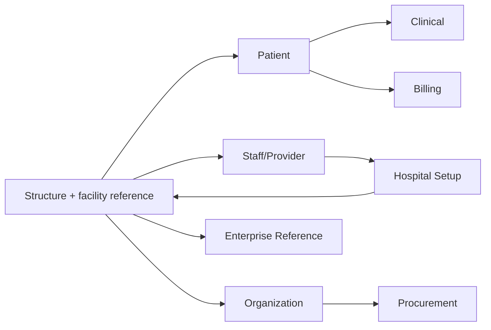
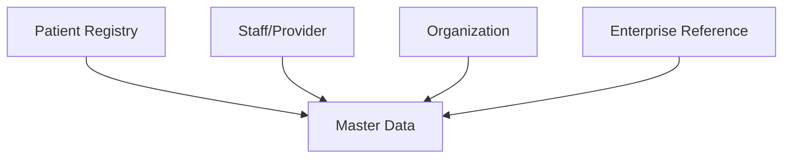
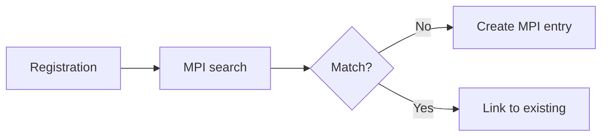
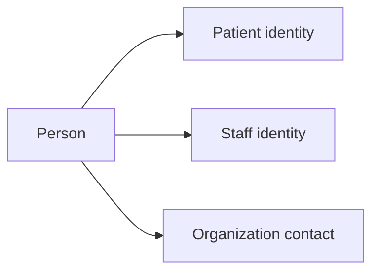
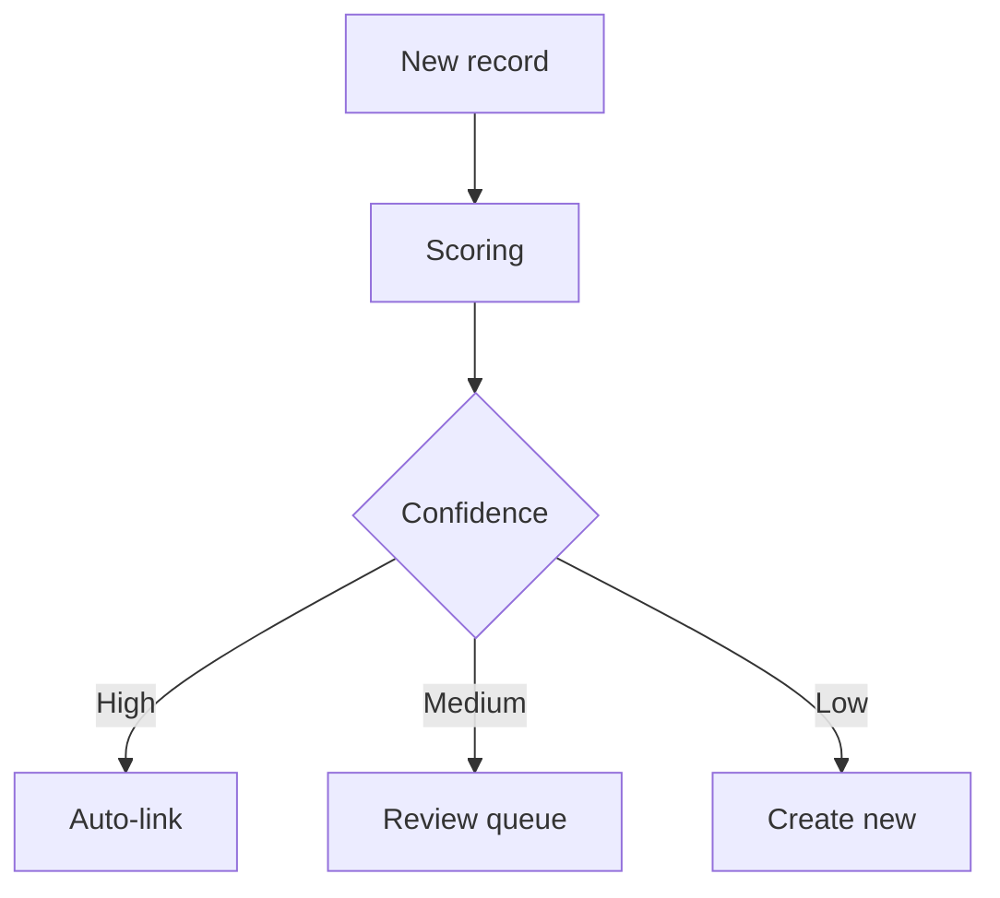
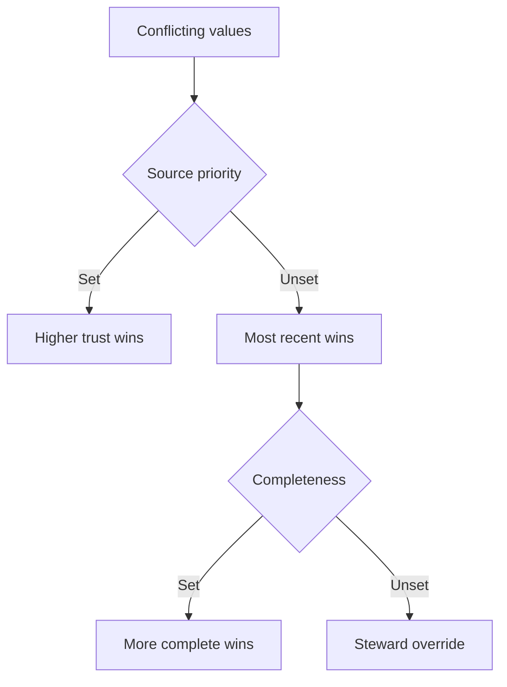
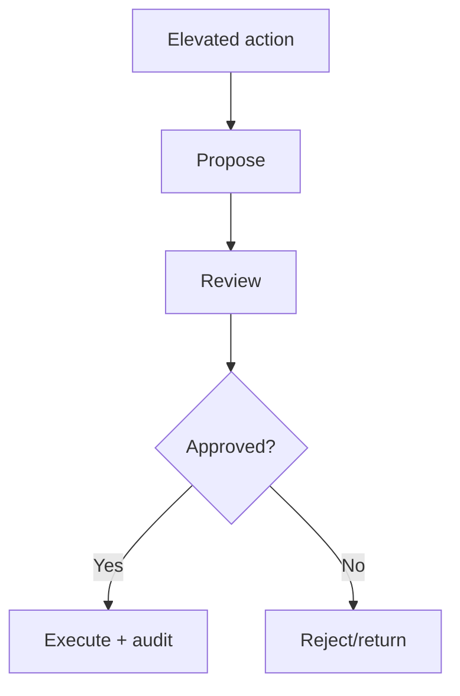

# Master Data Module — Business Requirements Specification (BRS)

> **Document ID:** `master-data/01-Business-Requirements`
> **Owner:** Product Lead / Business Analyst (master data)
> **Status:** 🔄 Pending approval (Phase 1 gate)
> **Version:** 1.0.0
> **Last updated:** 2026-08-06
> **Review cadence:** Re-reviewed at every phase gate and when the master data model changes.
>
> **Relationship:** This BRS is the authoritative statement of *what* the Master Data Management module must do. It is the parent of the module's technical design documents ([02-Workflow](02-Workflow.md), subsequent specifications) and the approved module overview in [README](README.md). It operationalizes the Master Data domain in [17-DATA-GOVERNANCE](../../17-DATA-GOVERNANCE.md) §5, aligns to [18-INTEROPERABILITY](../../18-INTEROPERABILITY.md) and [19-CLINICAL-STANDARDS](../../19-CLINICAL-STANDARDS.md), and is sequenced by [00-MASTER-ROADMAP](../../00-MASTER-ROADMAP.md).

---

## Table of Contents

1. [Executive Summary](#1-executive-summary)
2. [Business Context](#2-business-context)
3. [Business Objectives](#3-business-objectives)
4. [Scope](#4-scope)
5. [Out of Scope](#5-out-of-scope)
6. [Stakeholders](#6-stakeholders)
7. [User Roles](#7-user-roles)
8. [Business Requirements (MD-BR-001 onwards)](#8-business-requirements-md-br-001-onwards)
9. [Functional Requirements](#9-functional-requirements)
10. [Non-Functional Requirements](#10-non-functional-requirements)
11. [Business Rules](#11-business-rules)
12. [Master Data Domains](#12-master-data-domains)
13. [Master Patient Index (MPI)](#13-master-patient-index-mpi)
14. [Enterprise Person Index (EPI)](#14-enterprise-person-index-epi)
15. [Golden Record](#15-golden-record)
16. [Duplicate Detection](#16-duplicate-detection)
17. [Merge / Unmerge Rules](#17-merge--unmerge-rules)
18. [Survivorship Rules](#18-survivorship-rules)
19. [Data Stewardship](#19-data-stewardship)
20. [Data Ownership](#20-data-ownership)
21. [Approval Workflow](#21-approval-workflow)
22. [Exception Handling](#22-exception-handling)
23. [Dependency Matrix](#23-dependency-matrix)
24. [Acceptance Criteria](#24-acceptance-criteria)
25. [Cross References](#25-cross-references)

---

## 1. Executive Summary

The **Master Data Management (MDM)** module is the authoritative registry of master records for the Hospital ERP Enterprise platform. It provides the **single source of truth** for patient, staff/provider, and organization identity — with golden-record management, enterprise person/patient indexing, duplicate detection, and controlled, audited merge/un-merge.

It is the implementation of the **Registry** capability identified in the [00-MASTER-ROADMAP](../../00-MASTER-ROADMAP.md) and the Master Data domain in [17-DATA-GOVERNANCE](../../17-DATA-GOVERNANCE.md) §5. It complements — and does not duplicate — the organizational structure and facility-scoped reference data owned by [Hospital Setup](../hospital-setup/README.md).

**Key scope commitments:**

- A single, canonical, tenant-scoped master record for each entity.
- Identity integrity: unique identifiers, deduplication, golden records.
- Non-destructive lifecycle: deactivation over deletion, with full audit.
- Consent-aware, least-privilege access to sensitive master data.
- Multi-facility ready, single-facility first.

---

## 2. Business Context

The platform is a **data-driven clinical and financial system**. Every workflow — registering a patient, scheduling, prescribing, billing, reporting — begins by referencing a **master record**. Without authoritative, deduplicated master data, clinical safety and financial integrity are at risk.

The MDM module sits at the **hub** of the platform: it provides the patient, staff/provider, and organization identities that other modules reference, and it consumes the organizational structure and facility-scoped reference data that [Hospital Setup](../hospital-setup/README.md) governs.

---

## 3. Business Objectives

The objectives translate the platform vision into measurable outcomes for this module. They map to the module's success metrics.

| # | Objective | Measurable target |
| --- | --- | --- |
| OBJ-01 | Provide a canonical, deduplicated patient identity | 0 critical duplicate-incident errors |
| OBJ-02 | Provide a complete staff/provider master | 100% staff identity captured |
| OBJ-03 | Ensure identity integrity through the MPI/EPI | Duplicate rate < 1% |
| OBJ-04 | Maintain audit and history of master records | 100% changes audited |
| OBJ-05 | Support consent-aware access | 0 unauthorized sensitive accesses |
| OBJ-06 | Enable interoperability of master data | FHIR Patient exchange operational |

---

## 4. Scope

**In scope:**

- Patient registry and Master Patient Index (MPI).
- Enterprise Person Index (EPI) linking patient and staff identities.
- Staff/provider and organization master records.
- Golden-record and identifier lifecycle management.
- Duplicate detection, review, merge, and un-merge.
- Enterprise reference data and code sets.
- Data stewardship, ownership, and approval workflows.
- Audit, security, and privacy of master data.

**Guiding principles:**

| # | Principle | Application |
| --- | --- | --- |
| P-01 | **Single source of truth** | One canonical master record ([02-SYSTEM-ARCHITECTURE](../../02-SYSTEM-ARCHITECTURE.md) A3). |
| P-02 | **Identity integrity** | Unique identifiers and managed duplicates. |
| P-03 | **Non-destructive** | Deactivate over delete; history preserved. |
| P-04 | **Quality by default** | Validated at entry, monitored continuously. |
| P-05 | **Consent-aware** | Sensitive data access respects consent ([17-DATA-GOVERNANCE](../../17-DATA-GOVERNANCE.md) §14). |
| P-06 | **Audited** | Every master change is auditable ([08-AUDIT-LOGGING](../../08-AUDIT-LOGGING.md)). |
| P-07 | **Tenant-scoped** | Isolation per [09-MULTI-TENANCY](../../09-MULTI-TENANCY.md). |

---

## 5. Out of Scope

| Item | Owner | Reason |
| --- | --- | --- |
| Facility organizational structure (facility → location → department → unit → room) | [Hospital Setup](../hospital-setup/README.md) | Distinct module |
| Facility-scoped reference data (specialties, shift templates) | [Hospital Setup](../hospital-setup/README.md) | Facility-scoped, not enterprise |
| User accounts, roles, authentication | [06-AUTHENTICATION](../../06-AUTHENTICATION.md) | IAM concern |
| Clinical content (encounters, orders, results) | Clinical modules | Consumes master data |
| Clinical terminology source data | [19-CLINICAL-STANDARDS](../../19-CLINICAL-STANDARDS.md) | Terminology service |

---

## 6. Stakeholders

| Stakeholder | Interest |
| --- | --- |
| Front-desk / Admissions | Register patients, find records |
| Clinical staff | Reliable patient identity |
| Registry / data stewards | Quality, duplicates, merges |
| Finance / Billing | Accurate patient/payer identity |
| Compliance / Audit | Audit and privacy |
| Data Governance Board | Standards and ownership |
| Integrations | Consistent external identity |

---

## 7. User Roles

| Role | Primary needs |
| --- | --- |
| Front-desk / Registrar | Search, register, update patient records |
| Registry administrator | Duplicate review, merge, golden record |
| Data steward | Quality, reference data, remediation |
| Clinician | Read accurate patient identity |
| Billing / Finance | Read patient and payer identity |
| Auditor | Read audit trail |
| Data Governance Board | Approve standards, resolve disputes |

---

## 8. Business Requirements (MD-BR-001 onwards)

| # | Requirement | Priority |
| --- | --- | --- |
| MD-BR-001 | Register a patient with identity, demographics, and identifiers | Must |
| MD-BR-002 | Maintain a unique, stable patient identifier (MRN) | Must |
| MD-BR-003 | Detect and manage duplicate patient records | Must |
| MD-BR-004 | Maintain a Master Patient Index (MPI) | Must |
| MD-BR-005 | Maintain an Enterprise Person Index (EPI) | Must |
| MD-BR-006 | Manage golden records and record linking | Must |
| MD-BR-007 | Maintain the staff/provider master and credentials | Must |
| MD-BR-008 | Maintain the organization master (vendors, payers, partners) | Must |
| MD-BR-009 | Govern enterprise reference data and code sets | Must |
| MD-BR-010 | Assign and rotate identifiers (MRN, national IDs) | Must |
| MD-BR-011 | Merge and un-merge duplicate records with audit | Must |
| MD-BR-012 | Apply survivorship rules to resolve conflicting attributes | Must |
| MD-BR-013 | Enforce consent-aware access to sensitive master data | Must |
| MD-BR-014 | Maintain a complete, tamper-evident change history | Must |
| MD-BR-015 | Deactivate rather than delete master records | Must |
| MD-BR-016 | Support cross-facility master data where explicitly granted | Should |
| MD-BR-017 | Support FHIR Patient/Practitioner exchange ([18-INTEROPERABILITY](../../18-INTEROPERABILITY.md)) | Should |
| MD-BR-018 | Support a patient self-service linkage to the registry | Should |

---

## 9. Functional Requirements

Detailed functional behavior is specified in the module's Workflow ([02-Workflow](02-Workflow.md)), Database, API, and UI documents. Key functions:

| # | Function |
| --- | --- |
| FR-01 | Patient registration with duplicate screening |
| FR-02 | Patient search and record retrieval |
| FR-03 | Identifier assignment and lifecycle |
| FR-04 | Duplicate detection and candidate queue |
| FR-05 | Merge and un-merge operations |
| FR-06 | Golden-record maintenance and survivorship |
| FR-07 | Staff/provider master management |
| FR-08 | Organization master management |
| FR-09 | Enterprise reference data management |
| FR-10 | Consent flag and access management |
| FR-11 | Audit and history retrieval |

---

## 10. Non-Functional Requirements

| # | Category | Requirement |
| --- | --- | --- |
| NFR-01 | Performance | Patient search p95 < 1s ([14-PERFORMANCE-STANDARDS](../../14-PERFORMANCE-STANDARDS.md)) |
| NFR-02 | Availability | 99.9% target ([00-MASTER-ROADMAP](../../00-MASTER-ROADMAP.md) §2.2) |
| NFR-03 | Security | OIDC; MFA for merge/admin ([06-AUTHENTICATION](../../06-AUTHENTICATION.md)) |
| NFR-04 | Privacy | Consent-aware, least privilege ([17-DATA-GOVERNANCE](../../17-DATA-GOVERNANCE.md) §15) |
| NFR-05 | Audit | All changes tamper-evident ([08-AUDIT-LOGGING](../../08-AUDIT-LOGGING.md)) |
| NFR-06 | Scalability | MPI scales with registry volume |
| NFR-07 | Reliability | ACID integrity ([05-DATABASE-ARCHITECTURE](../../05-DATABASE-ARCHITECTURE.md) §6) |
| NFR-08 | Interoperability | FHIR Patient exchange ([18-INTEROPERABILITY](../../18-INTEROPERABILITY.md)) |

---

## 11. Business Rules

| # | Rule |
| --- | --- |
| BR-01 | Every patient record has at least one validated identifier. |
| BR-02 | MRN is unique within tenant scope. |
| BR-03 | New records are screened for duplicates before creation. |
| BR-04 | A record can be deactivated but never hard-deleted. |
| BR-05 | Merge requires the correct permissions and audit. |
| BR-06 | Merge is reversible via controlled un-merge. |
| BR-07 | Survivorship determines the winning attribute value. |
| BR-08 | Sensitive records require consent for access. |
| BR-09 | Identifier rotation preserves history. |
| BR-10 | Changes to master data are always audited. |

---

## 12. Master Data Domains

| Domain | Entities | Owner |
| --- | --- | --- |
| Patient Registry | Patient identity, demographics, MRN, identifiers, consent | Clinical Data Owner |
| Staff / Provider | Staff identity, credentials, demographics | HR/Ops Owner |
| Organization | Vendors, payers, partners | Procurement/Finance |
| Enterprise Reference | Identifier types, relationship types, org types | Data Governance Board |

### Domain Map

---

## 13. Master Patient Index (MPI)

The MPI links all records for the same patient across the platform.

| Aspect | Decision |
| --- | --- |
| Purpose | Single view of each patient across facilities/modules |
| Granularity | One logical patient per MRN/MPI entry |
| Records | Links all duplicate records to a golden record |
| Search | Fuzzy/duplicate search for matching |
| Cross-facility | Multi-facility-ready indexing |

### MPI Flow

---

## 14. Enterprise Person Index (EPI)

The EPI links person identities across roles — patient, staff/provider — for a **single enterprise view of a person**.

| Aspect | Decision |
| --- | --- |
| Purpose | Link a person's patient and staff identities |
| Use | Recognize a person across roles |
| Privacy | Role-specific data access maintained |
| Governance | Handled under data ownership rules |

### EPI Concept

---

## 15. Golden Record

| Aspect | Decision |
| --- | --- |
| Definition | Best, canonical record for an entity |
| Selection | Chosen from linked duplicates |
| Survivorship | Conflicting attributes resolved by rule ([§18](#18-survivorship-rules)) |
| Authority | Golden record is the reference for consumers |
| History | Original records retained and linked |

---

## 16. Duplicate Detection

| Aspect | Decision |
| --- | --- |
| Method | Deterministic + probabilistic matching |
| Signals | Name, DOB, identifiers, demographics |
| Candidate queue | Flagged for review |
| Thresholds | Configurable match confidence |
| Performance | Indexed search ([03-TECHNOLOGY-STACK](../../03-TECHNOLOGY-STACK.md)) |

### Detection Flow

---

## 17. Merge / Unmerge Rules

| Rule | Application |
| --- | --- |
| Merge target | Records merged into the golden record |
| Survivorship | Winning attributes per [§18](#18-survivorship-rules) |
| Audit | Merge fully audited |
| Reversibility | Un-merge restores original records |
| Permissions | Merge requires elevated permission ([07-ROLES-PERMISSIONS](../../07-ROLES-PERMISSIONS.md)) |
| Safety | No data loss on merge |

---

## 18. Survivorship Rules

Determines the winning value when duplicate records conflict.

| Strategy | Use |
| --- | --- |
| Source priority | Higher-trust source wins |
| Recency | Most recent wins |
| Completeness | More complete wins |
| Explicit | Manual override by steward |
| Consent | Sensitive fields follow consent |

### Survivorship

---

## 19. Data Stewardship

| Aspect | Decision |
| --- | --- |
| Steward role | Operational quality and remediation |
| Activities | Monitor quality, review duplicates, maintain reference data |
| Escalation | Unresolved issues to Data Governance Board |
| Standards | Per [17-DATA-GOVERNANCE](../../17-DATA-GOVERNANCE.md) §10 |

---

## 20. Data Ownership

| Role | Responsibility |
| --- | --- |
| Data Owner | Accountable for a domain's quality and privacy |
| Business Owner | Defines quality expectations |
| Data Steward | Executes quality and remediation |
| Data Custodian | Technical storage and security |
| Data Governance Board | Approves standards ([17-DATA-GOVERNANCE](../../17-DATA-GOVERNANCE.md) §9) |

---

## 21. Approval Workflow

Elevated actions (merge, deactivate, sensitive changes) require approval per [07-ROLES-PERMISSIONS](../../07-ROLES-PERMISSIONS.md) and the module's Workflow ([02-Workflow](02-Workflow.md)).

---

## 22. Exception Handling

| Exception | Handling |
| --- | --- |
| Duplicate not resolvable | Escalate to steward |
| Identifier conflict | Blocked; review |
| Merge conflict | Survivorship resolves; steward overrides |
| Consent denied | Sensitive data not returned |
| API validation failure | Rejected with detail ([11-API-STANDARDS](../../11-API-STANDARDS.md)) |
| Cross-tenant attempt | Blocked ([09-MULTI-TENANCY](../../09-MULTI-TENANCY.md)) |

---

## 23. Dependency Matrix

| Dependency | On | Purpose |
| --- | --- | --- |
| Organizational structure | [Hospital Setup](../hospital-setup/README.md) | Facility context for records |
| Identity/access | [06-AUTHENTICATION](../../06-AUTHENTICATION.md), [07-ROLES-PERMISSIONS](../../07-ROLES-PERMISSIONS.md) | AuthN/Z, merge permission |
| Storage | [05-DATABASE-ARCHITECTURE](../../05-DATABASE-ARCHITECTURE.md) | Persistence, integrity |
| Audit | [08-AUDIT-LOGGING](../../08-AUDIT-LOGGING.md) | Change history |
| Tenancy | [09-MULTI-TENANCY](../../09-MULTI-TENANCY.md) | Isolation |
| Clinical code sets | [19-CLINICAL-STANDARDS](../../19-CLINICAL-STANDARDS.md) | Reference values |
| Interoperability | [18-INTEROPERABILITY](../../18-INTEROPERABILITY.md) | FHIR exchange |
| Data governance | [17-DATA-GOVERNANCE](../../17-DATA-GOVERNANCE.md) | Quality, privacy, retention |

---

## 24. Acceptance Criteria

| Requirement | Acceptance criterion |
| --- | --- |
| MD-BR-001 | Registrar can register a patient with valid identifiers |
| MD-BR-002 | MRN is unique and stable within tenant |
| MD-BR-003 | New records are screened; duplicates flagged |
| MD-BR-004 | MPI links all records for one patient |
| MD-BR-006 | A golden record exists per unique patient |
| MD-BR-011 | Merge/un-merge is audited and reversible |
| MD-BR-012 | Survivorship resolves conflicts deterministically |
| MD-BR-013 | Sensitive data requires consent |
| MD-BR-014 | All changes have an immutable audit trail |
| MD-BR-015 | Deactivation preserves history |

---

## 25. Cross References

| Reference | Relationship | Direction |
| --- | --- | --- |
| [README](README.md) | Module overview | Provides |
| [02-Workflow](02-Workflow.md) | Module workflows | Provides |
| [00-MASTER-ROADMAP](../../00-MASTER-ROADMAP.md) | Phasing | Consumes |
| [02-SYSTEM-ARCHITECTURE](../../02-SYSTEM-ARCHITECTURE.md) | Single source of truth | Consumes |
| [05-DATABASE-ARCHITECTURE](../../05-DATABASE-ARCHITECTURE.md) | Storage, integrity | Consumes |
| [06-AUTHENTICATION](../../06-AUTHENTICATION.md) | Identity, consent | Consumes |
| [07-ROLES-PERMISSIONS](../../07-ROLES-PERMISSIONS.md) | Authorization | Consumes |
| [08-AUDIT-LOGGING](../../08-AUDIT-LOGGING.md) | Audit | Consumes |
| [09-MULTI-TENANCY](../../09-MULTI-TENANCY.md) | Tenant isolation | Consumes |
| [11-API-STANDARDS](../../11-API-STANDARDS.md) | API standards | Consumes |
| [14-PERFORMANCE-STANDARDS](../../14-PERFORMANCE-STANDARDS.md) | Performance | Consumes |
| [17-DATA-GOVERNANCE](../../17-DATA-GOVERNANCE.md) | Master data, PHI, privacy | Consumes |
| [18-INTEROPERABILITY](../../18-INTEROPERABILITY.md) | FHIR exchange | Consumes |
| [19-CLINICAL-STANDARDS](../../19-CLINICAL-STANDARDS.md) | Code sets | Consumes |
| [Hospital Setup](../hospital-setup/README.md) | Organizational structure | Consumes |

---

*End of `docs/modules/master-data/01-Business-Requirements.md`.*
