# Master Data Module — Workflow Specification

> **Document ID:** `master-data/02-Workflow`
> **Owner:** Architecture / Engineering Lead (data)
> **Status:** 🔄 Pending approval (Phase 1 gate)
> **Version:** 1.0.0
> **Last updated:** 2026-08-06
> **Review cadence:** Re-reviewed at every phase gate and when the master data model changes.
>
> **Relationship:** This workflow specification defines *how* the Master Data Management module behaves operationally — the flows, states, approvals, audit, and recovery that implement the requirements in [01-Business-Requirements](01-Business-Requirements.md). It builds on the module overview in [README](README.md) and follows the enterprise standards in [17-DATA-GOVERNANCE](../../17-DATA-GOVERNANCE.md) and [08-AUDIT-LOGGING](../../08-AUDIT-LOGGING.md).

---

## Table of Contents

1. [Workflow Overview](#1-workflow-overview)
2. [Workflow Objectives](#2-workflow-objectives)
3. [Actors](#3-actors)
4. [Master Data Lifecycle](#4-master-data-lifecycle)
5. [Create Workflow](#5-create-workflow)
6. [Update Workflow](#6-update-workflow)
7. [Approval Workflow](#7-approval-workflow)
8. [Versioning Workflow](#8-versioning-workflow)
9. [Duplicate Detection Workflow](#9-duplicate-detection-workflow)
10. [Golden Record Workflow](#10-golden-record-workflow)
11. [Merge Workflow](#11-merge-workflow)
12. [Unmerge Workflow](#12-unmerge-workflow)
13. [Reference Data Workflow](#13-reference-data-workflow)
14. [Archive Workflow](#14-archive-workflow)
15. [Restore Workflow](#15-restore-workflow)
16. [Delete Workflow](#16-delete-workflow)
17. [Exception Workflow](#17-exception-workflow)
18. [Notifications](#18-notifications)
19. [Audit Integration](#19-audit-integration)
20. [Security Checkpoints](#20-security-checkpoints)
21. [SLA](#21-sla)
22. [BPMN / Mermaid Workflow](#22-bpmn--mermaid-workflow)
23. [KPIs](#23-kpis)
24. [Cross References](#24-cross-references)

---

## 1. Workflow Overview

The Master Data Management module governs the **operational lifecycle of master records** — patients, staff/providers, organizations, and enterprise reference data. It covers the end-to-end flows by which a record is created, updated, approved, versioned, deduplicated, merged, archived, restored, and (by governed exception) deleted.

This specification defines the complete, deterministic behavior of those flows, including triggers, states, actors, approvals, audit, and recovery guarantees.

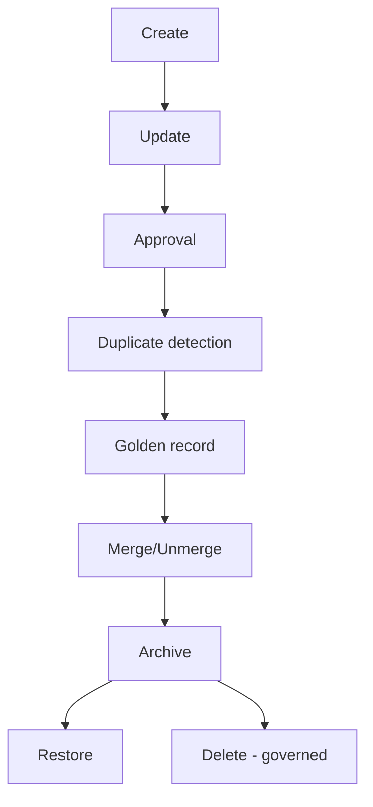

---

## 2. Workflow Objectives

| Objective | Outcome |
| --- | --- |
| Correctness | Master records are accurate and deduplicated |
| Safety | No unintended data loss or mislink |
| Auditability | Every state change is audited |
| Governed | Elevated actions require approval |
| Recoverable | Archive/restore and un-merge supported |
| Observable | Workflow steps are measured and monitored |

---

## 3. Actors

| Actor | Actions |
| --- | --- |
| Registrar / Front-desk | Create, search, update patient records |
| Clinician | Read accurate identity |
| Registry administrator | Review duplicates, merge, golden record |
| Data steward | Quality, reference data, remediation |
| Approver | Approve elevated actions ([07-ROLES-PERMISSIONS](../../07-ROLES-PERMISSIONS.md)) |
| Data Governance Board | Approve standards, resolve disputes |
| System | Automated flows (dedupe scoring, notifications) |

---

## 4. Master Data Lifecycle

The canonical states of a master record.

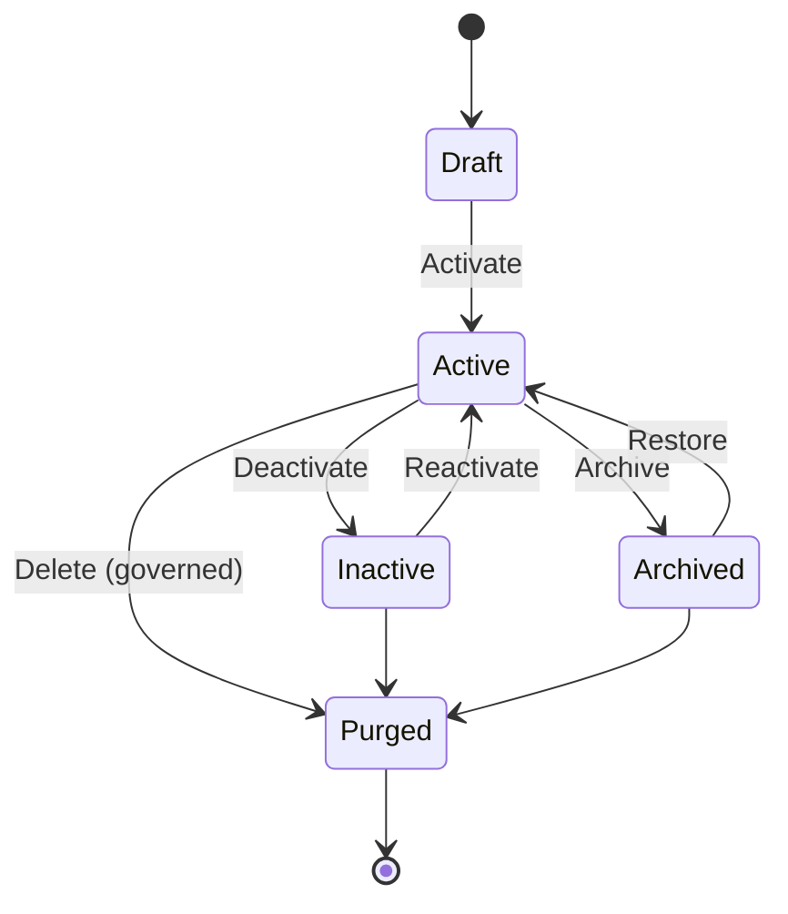

### State Table

| State | Meaning | Audited |
| --- | --- | --- |
| Draft | In-progress, not authoritative | Yes |
| Active | Authoritative, referenced | Yes |
| Inactive | Deactivated, history preserved | Yes |
| Archived | Moved to archival store | Yes |
| Purged | Irreversibly removed (governed) | Yes |

---

## 5. Create Workflow

Creates a master record with duplicate screening.

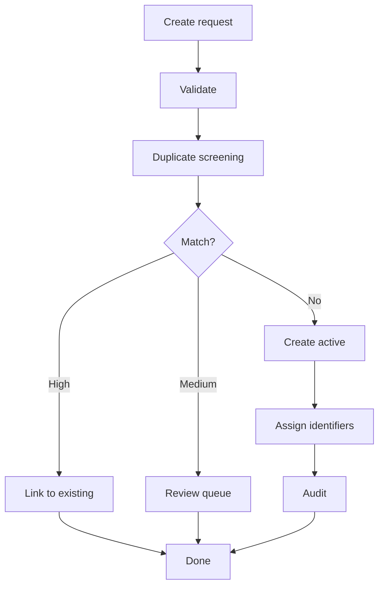

| Step | Action | Actor |
| --- | --- | --- |
| Validate | Validate identifiers/demographics | System |
| Screen | Run duplicate detection | System |
| Resolve | Link, queue, or create | Registrar/System |
| Assign | Assign MRN/identifiers | System |
| Audit | Record the create | System |

---

## 6. Update Workflow

Updates a master record with validation and audit.

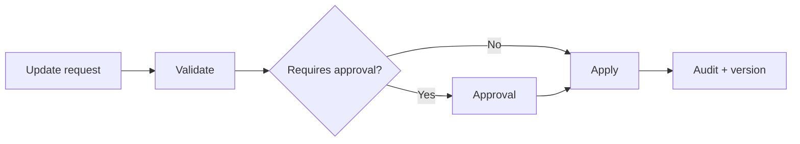

| Step | Action |
| --- | --- |
| Validate | Field validation ([11-API-STANDARDS](../../11-API-STANDARDS.md)) |
| Screen | Elevation check for sensitive changes |
| Approve | Approval where required ([§7](#7-approval-workflow)) |
| Apply | Update the record |
| Version | Record a version ([§8](#8-versioning-workflow)) |
| Audit | Audit the change |

---

## 7. Approval Workflow

Elevated actions (merge, deactivate, sensitive changes) require approval ([07-ROLES-PERMISSIONS](../../07-ROLES-PERMISSIONS.md)).

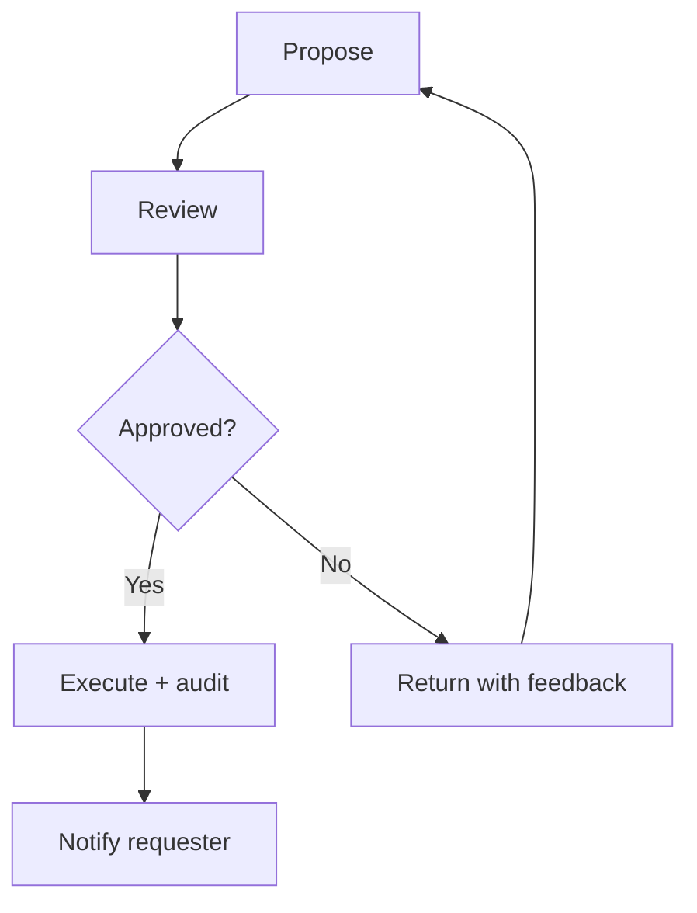

| Aspect | Decision |
| --- | --- |
| Requester ≠ approver | Separation of duties ([07-ROLES-PERMISSIONS](../../07-ROLES-PERMISSIONS.md) §8) |
| MFA | Required for elevated approval ([06-AUTHENTICATION](../../06-AUTHENTICATION.md)) |
| SLA | Approval response within defined window ([§21](#21-sla)) |
| Audit | Approval decision audited |

---

## 8. Versioning Workflow

Preserves the history of master records for accuracy and recovery.

| Aspect | Decision |
| --- | --- |
| Version on change | Every update creates a version |
| History | Prior versions retained and queryable |
| Point-in-time | Reconstruct a record at a point in time |
| Audit link | Version tied to the change audit event |
| Rollback | Corrective restore from a prior version |

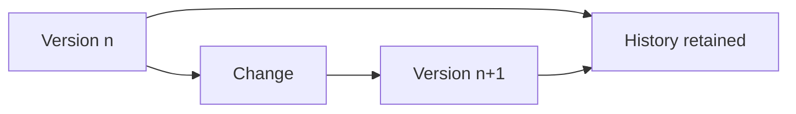

---

## 9. Duplicate Detection Workflow

Detects and triages duplicate records ([01-Business-Requirements](01-Business-Requirements.md) §16).

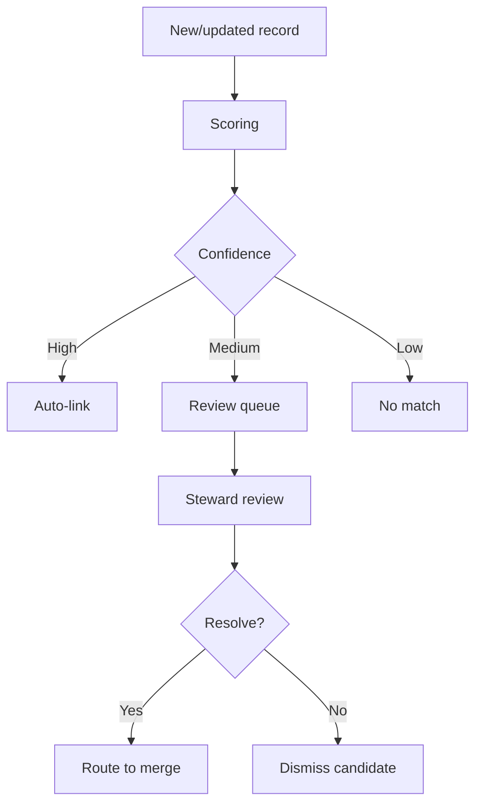

| Step | Action |
| --- | --- |
| Score | Deterministic + probabilistic matching |
| Triage | High auto-link / medium queue / low pass |
| Review | Steward reviews candidates |
| Resolve | Route to merge or dismiss |

---

## 10. Golden Record Workflow

Establishes and maintains the canonical record for an entity.

| Aspect | Decision |
| --- | --- |
| Selection | Chosen from linked duplicates |
| Survivorship | Winning attributes per rules ([01-Business-Requirements](01-Business-Requirements.md) §18) |
| Authority | Golden record is the reference for consumers |
| Re-evaluation | Survivorship re-applied on new data |
| Audit | Golden-record changes audited |

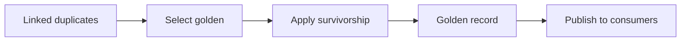

---

## 11. Merge Workflow

Merges duplicate records into the golden record.

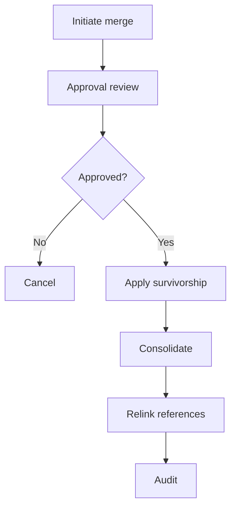

| Step | Action |
| --- | --- |
| Initiate | Select records to merge |
| Approve | Elevated approval ([§7](#7-approval-workflow)) |
| Survive | Resolve conflicts ([01-Business-Requirements](01-Business-Requirements.md) §18) |
| Consolidate | Merge into golden record |
| Relink | Update references to merged record |
| Audit | Record the merge |

---

## 12. Unmerge Workflow

Reverses a merge, restoring original records.

| Aspect | Decision |
| --- | --- |
| Trigger | Erroneous merge detected |
| Approval | Elevated approval required |
| Restore | Original records restored with history |
| References | References re-pointed to originals |
| Audit | Un-merge fully audited |
| Safety | No data loss |

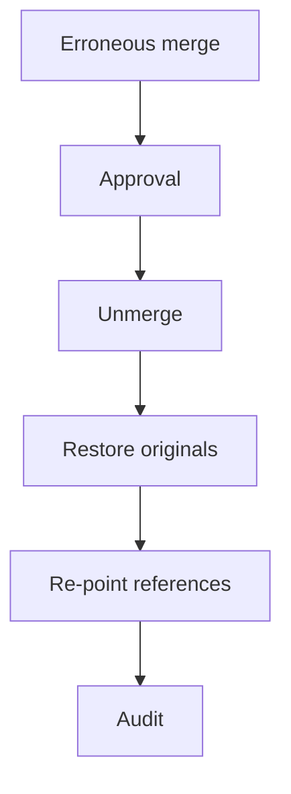

---

## 13. Reference Data Workflow

Manages enterprise reference data and code sets ([17-DATA-GOVERNANCE](../../17-DATA-GOVERNANCE.md) §7).

| Aspect | Decision |
| --- | --- |
| Add | Create a new reference value |
| Edit | Update a value with versioning |
| Deactivate | Disable a value (no hard delete) |
| Approval | Governed changes require review |
| Versioning | Editions pinned |
| Audit | All changes audited |

---

## 14. Archive Workflow

Moves inactive master data to the archival store ([05-DATABASE-ARCHITECTURE](../../05-DATABASE-ARCHITECTURE.md) §8).

| Aspect | Decision |
| --- | --- |
| Trigger | Inactive + retention threshold reached |
| Target | Object storage archive |
| Integrity | Preserved; retrieval on demand |
| Audit | Archival action audited |
| Lineage | Metadata updated ([17-DATA-GOVERNANCE](../../17-DATA-GOVERNANCE.md) §19) |

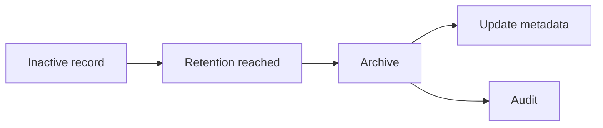

---

## 15. Restore Workflow

Restores an archived record to active.

| Aspect | Decision |
| --- | --- |
| Trigger | Archived record needed |
| Approval | Authorized restore |
| Target | Restore to active store |
| Integrity | Verify restored data |
| Audit | Restore audited |

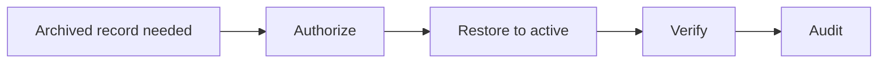

---

## 16. Delete Workflow

Deletion is a governed exception; deactivation is the default ([17-DATA-GOVERNANCE](../../17-DATA-GOVERNANCE.md) §18).

| Aspect | Decision |
| --- | --- |
| Default | Deactivate, never delete |
| Exception | Purge only when legally/regulatorily required |
| Approval | Elevated, board-approved |
| Hold | Legal hold supersedes |
| Audit | Deletion logged and verified |

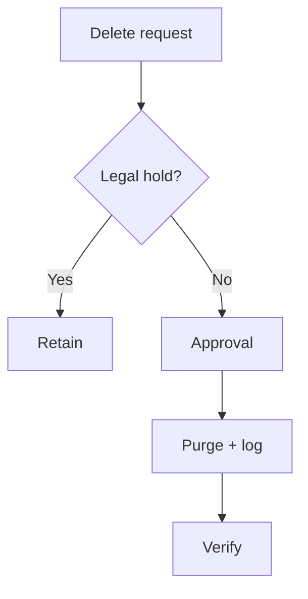

---

## 17. Exception Workflow

| Exception | Handling |
| --- | --- |
| Unresolvable duplicate | Escalate to steward |
| Identifier conflict | Block; review |
| Merge error | Un-merge ([§12](#12-unmerge-workflow)) |
| Approval timeout | Escalate per SLA ([§21](#21-sla)) |
| Cross-tenant attempt | Blocked ([09-MULTI-TENANCY](../../09-MULTI-TENANCY.md)) |
| Validation failure | Rejected with detail ([11-API-STANDARDS](../../11-API-STANDARDS.md)) |

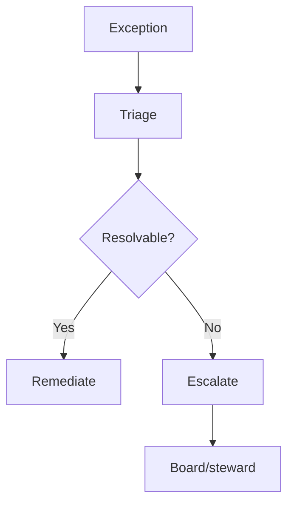

---

## 18. Notifications

| Notification | Trigger | Channel |
| --- | --- | --- |
| Duplicate candidate | Medium-confidence match | In-app + email (steward) |
| Approval request | Elevated action proposed | In-app + email (approver) |
| Approval outcome | Approved/rejected | In-app + email (requester) |
| Merge completed | Merge executed | In-app + email |
| Exception escalation | Unresolvable issue | Email + alert |
| SLA breach | Approval/SLA window exceeded | Alert |

---

## 19. Audit Integration

All workflow actions integrate with the enterprise audit standard ([08-AUDIT-LOGGING](../../08-AUDIT-LOGGING.md)).

| Event | Captures |
| --- | --- |
| Create | Actor, entity, identifiers |
| Update | Field changes, version |
| Approval | Decision, approver, reason |
| Duplicate | Candidate, match score, decision |
| Merge/Unmerge | Records, survivorship, outcome |
| Archive/Restore | Action, target, verify |
| Delete | Action, authorization, verification |

---

## 20. Security Checkpoints

| Checkpoint | Control |
| --- | --- |
| Entry | OIDC authentication ([06-AUTHENTICATION](../../06-AUTHENTICATION.md)) |
| Action | RBAC + scope ([07-ROLES-PERMISSIONS](../../07-ROLES-PERMISSIONS.md)) |
| Elevated | MFA + approval |
| Sensitive | Consent check ([17-DATA-GOVERNANCE](../../17-DATA-GOVERNANCE.md) §15) |
| Tenant | RLS isolation ([09-MULTI-TENANCY](../../09-MULTI-TENANCY.md)) |
| Exit | Audit + logging |

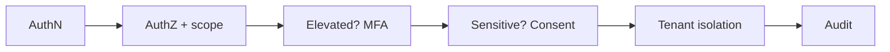

---

## 21. SLA

| Operation | SLA |
| --- | --- |
| Patient create/search | p95 < 1s ([14-PERFORMANCE-STANDARDS](../../14-PERFORMANCE-STANDARDS.md)) |
| Duplicate detection | Near-real-time |
| Approval response | Defined window (e.g., ≤ 24h median) |
| Merge execution | After approval, immediate |
| Archive/Restore | Batch; bounded |
| Exception response | Severity-based |

---

## 22. BPMN / Mermaid Workflow

End-to-end master data lifecycle in a single view.

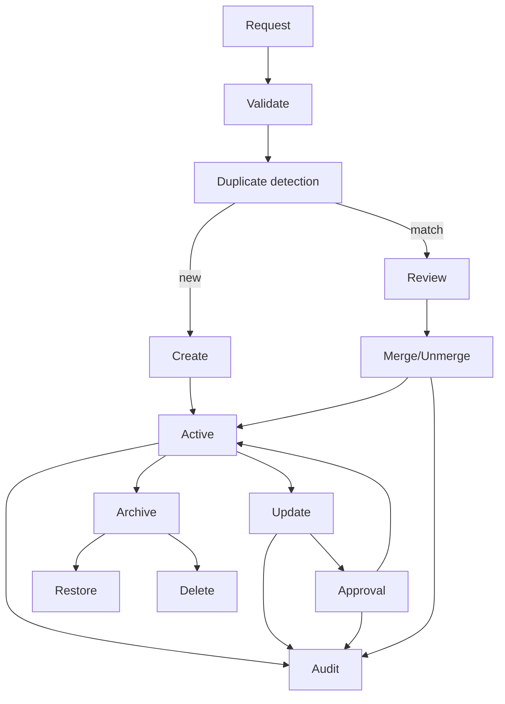

---

## 23. KPIs

| KPI | Target |
| --- | --- |
| Duplicate rate | < 1% |
| Auto-link accuracy | ≥ 95% |
| Merge error rate | 0 |
| Approval SLA compliance | ≥ 95% |
| Audit completeness | 100% |
| Data quality score | ≥ 95% |
| Archive/Restore success | 100% |

---

## 24. Cross References

| Reference | Relationship | Direction |
| --- | --- | --- |
| [01-Business-Requirements](01-Business-Requirements.md) | Requirements | Consumes |
| [README](README.md) | Module overview | Consumes |
| [00-MASTER-ROADMAP](../../00-MASTER-ROADMAP.md) | Phasing | Consumes |
| [05-DATABASE-ARCHITECTURE](../../05-DATABASE-ARCHITECTURE.md) | Archive, integrity | Consumes |
| [06-AUTHENTICATION](../../06-AUTHENTICATION.md) | AuthN, MFA | Consumes |
| [07-ROLES-PERMISSIONS](../../07-ROLES-PERMISSIONS.md) | Approval, SoD | Consumes |
| [08-AUDIT-LOGGING](../../08-AUDIT-LOGGING.md) | Audit | Consumes |
| [09-MULTI-TENANCY](../../09-MULTI-TENANCY.md) | Tenant isolation | Consumes |
| [11-API-STANDARDS](../../11-API-STANDARDS.md) | API standards | Consumes |
| [14-PERFORMANCE-STANDARDS](../../14-PERFORMANCE-STANDARDS.md) | SLA targets | Consumes |
| [17-DATA-GOVERNANCE](../../17-DATA-GOVERNANCE.md) | Lifecycle, privacy | Consumes |
| [Hospital Setup](../hospital-setup/README.md) | Staff relationship | Consumes |

---

*End of `docs/modules/master-data/02-Workflow.md`.*
