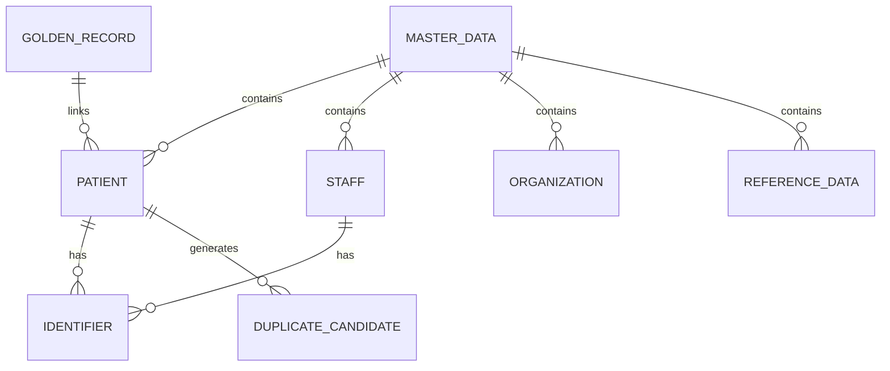
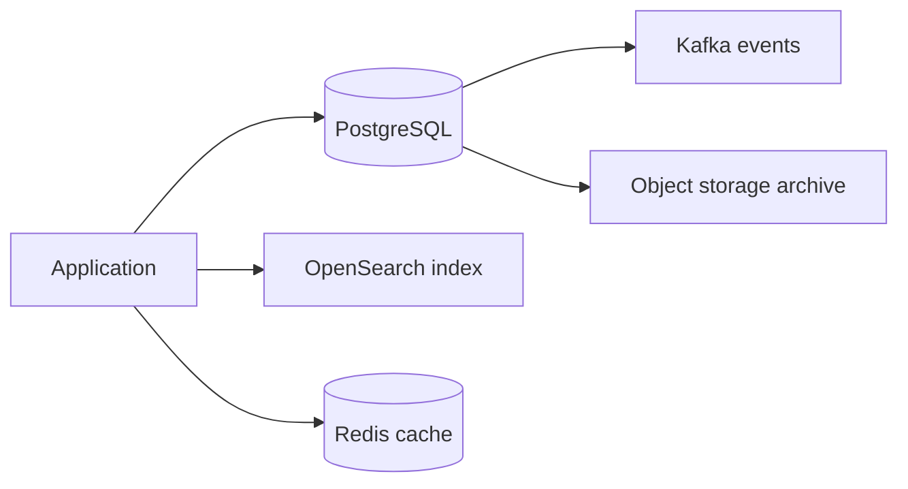
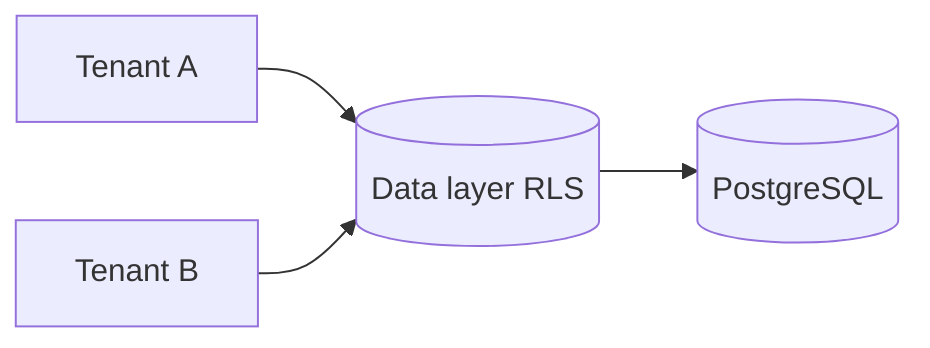

# Master Data Module — Database Architecture

> **Document ID:** `master-data/03-Database`
> **Owner:** Architecture / Engineering Lead (data)
> **Status:** 🔄 Pending approval (Phase 1 gate)
> **Version:** 1.0.0
> **Last updated:** 2026-08-06
> **Review cadence:** Re-reviewed at every phase gate and when the master data model changes.
>
> **Relationship:** Defines *how master data is stored, protected, and accessed* at the architectural level. The logical schema (entities, tables, columns) is in [04-Database-Tables](04-Database-Tables.md); storage choices derive from [05-DATABASE-ARCHITECTURE](../../05-DATABASE-ARCHITECTURE.md) and [03-TECHNOLOGY-STACK](../../03-TECHNOLOGY-STACK.md). Requirements and workflows come from [01-Business-Requirements](01-Business-Requirements.md) and [02-Workflow](02-Workflow.md).

---

## Table of Contents

1. [Database Overview](#1-database-overview)
2. [Database Objectives](#2-database-objectives)
3. [Design Principles](#3-design-principles)
4. [Logical Database Architecture](#4-logical-database-architecture)
5. [Physical Database Architecture](#5-physical-database-architecture)
6. [Database Schema Strategy](#6-database-schema-strategy)
7. [Master Data Domains](#7-master-data-domains)
8. [Entity Classification](#8-entity-classification)
9. [Multi-Tenant Strategy](#9-multi-tenant-strategy)
10. [Partitioning Strategy](#10-partitioning-strategy)
11. [Sharding Considerations](#11-sharding-considerations)
12. [Referential Integrity](#12-referential-integrity)
13. [Normalization Strategy](#13-normalization-strategy)
14. [Denormalization Strategy](#14-denormalization-strategy)
15. [Versioning Strategy](#15-versioning-strategy)
16. [Soft Delete Strategy](#16-soft-delete-strategy)
17. [Archival Strategy](#17-archival-strategy)
18. [Backup Strategy](#18-backup-strategy)
19. [Disaster Recovery](#19-disaster-recovery)
20. [Performance Strategy](#20-performance-strategy)
21. [Security Strategy](#21-security-strategy)
22. [Database Governance](#22-database-governance)
23. [Cross References](#23-cross-references)
24. [Executive Summary](#24-executive-summary)

---

## 1. Database Overview

This document defines the **database architecture** for the Master Data Management module: how master records are stored, isolated, versioned, archived, backed up, and secured. It covers the logical and physical design, multi-tenancy, partitioning, integrity, performance, and governance.

This document is **architecture only**. It deliberately does **not** define table columns, SQL, or migrations — those are specified in [04-Database-Tables](04-Database-Tables.md).

---

## 2. Database Objectives

| Objective | Outcome |
| --- | --- |
| Correctness | Master records are accurate and deduplicated |
| Integrity | Referential integrity protects relationships |
| Isolation | Tenant isolation enforced at the data layer |
| Durability | Backups and DR protect against loss |
| Performance | Master-data reads are fast and indexed |
| Auditability | History and versioning are preserved |

---

## 3. Design Principles

| # | Principle | Application |
| --- | --- | --- |
| DB-01 | **Single source of truth** | One canonical store ([02-SYSTEM-ARCHITECTURE](../../02-SYSTEM-ARCHITECTURE.md) A3) |
| DB-02 | **Tenant-scoped** | Isolation per [09-MULTI-TENANCY](../../09-MULTI-TENANCY.md) |
| DB-03 | **Non-destructive** | Soft delete; history preserved |
| DB-04 | **Versioned** | Change history maintained |
| DB-05 | **Integrity-first** | FK constraints and uniqueness |
| DB-06 | **Operable** | Backed up, archived, monitored ([05-DATABASE-ARCHITECTURE](../../05-DATABASE-ARCHITECTURE.md)) |

---

## 4. Logical Database Architecture

Master data is organized into logical domains, each a coherent set of entities.

| Logical group | Purpose |
| --- | --- |
| Patient | Patient identity, identifiers, consent |
| Staff/Provider | Staff identity, credentials |
| Organization | Vendors, payers, partners |
| Reference | Enterprise code sets |
| Indexing | MPI/EPI, golden record, duplicates |

---

## 5. Physical Database Architecture

Storage follows the platform storage map in [05-DATABASE-ARCHITECTURE](../../05-DATABASE-ARCHITECTURE.md) §3.

| Store | Role |
| --- | --- |
| PostgreSQL (primary) | System of record for canonical master data |
| OpenSearch | Search & duplicate matching index |
| Redis | Cache for hot master reads |
| Object storage (S3/MinIO) | Archived master data, exports |
| Kafka | Master-data change events |

---

## 6. Database Schema Strategy

| Aspect | Decision |
| --- | --- |
| Schema | Versioned, forward-only migrations ([05-DATABASE-ARCHITECTURE](../../05-DATABASE-ARCHITECTURE.md) §5) |
| Model | Relational, normalized core with targeted denormalization |
| Naming | Consistent, snake_case, singular ([04-CODING-STANDARDS](../../04-CODING-STANDARDS.md)) |
| Enforcement | Constraints for uniqueness and integrity |
| Location | Schema in `database/` as code |
| Detail | Columns/migrations in [04-Database-Tables](04-Database-Tables.md) |

---

## 7. Master Data Domains

| Domain | Entities | Canonical store |
| --- | --- | --- |
| Patient Registry | Patient, identifiers, consent | PostgreSQL |
| Staff / Provider | Staff, credentials | PostgreSQL |
| Organization | Organization, contacts | PostgreSQL |
| Enterprise Reference | Reference values, code sets | PostgreSQL |
| Index | MPI, EPI, golden record, duplicates | PostgreSQL + OpenSearch |

---

## 8. Entity Classification

| Class | Definition | Examples |
| --- | --- | --- |
| Master | Canonical, deduplicated record | Patient, staff, organization |
| Reference | Controlled vocabulary | Identifier types, org types |
| Index | Linkage and matching | MPI, EPI, golden record, candidates |
| Audit/history | Change record | Versions, audit events |
| Archive | Retained off hot store | Archived master records |

---

## 9. Multi-Tenant Strategy

| Aspect | Decision |
| --- | --- |
| Isolation | Row-level security (RLS) keyed on tenant ([09-MULTI-TENANCY](../../09-MULTI-TENANCY.md)) |
| Tenant key | Present on all tenant-scoped tables |
| Cross-tenant | Blocked at the data layer |
| Single-facility first | Multi-facility-ready data model |

---

## 10. Partitioning Strategy

| Aspect | Decision |
| --- | --- |
| High-volume tables | Partitioned by time ([05-DATABASE-ARCHITECTURE](../../05-DATABASE-ARCHITECTURE.md) §8) |
| Index tables | Candidate/duplicate tables partitioned |
| Audit/history | Time-partitioned |
| Bounds | Bounded table size, faster maintenance |
| Archival | Partitions archived by age |

---

## 11. Sharding Considerations

| Aspect | Decision |
| --- | --- |
| v1 approach | No sharding; single primary + replicas ([05-DATABASE-ARCHITECTURE](../../05-DATABASE-ARCHITECTURE.md) §4) |
| Driver | Registry scale and read load |
| When considered | Only when demonstrated need; ADR-gated |
| Constraint | Tenant/correlation affinity if adopted |
| Status | Future consideration |

---

## 12. Referential Integrity

| Rule | Application |
| --- | --- |
| FK constraints | Enforce parent-child relationships |
| RESTRICT on delete | No silent cascade ([02-Workflow](02-Workflow.md) §16) |
| Unique constraints | Back identifiers, MPI/EPI links |
| Tenant consistency | References stay within tenant scope |
| Integrity violations | Blocked and audited |

---

## 13. Normalization Strategy

| Aspect | Decision |
| --- | --- |
| Core | Normalized to eliminate redundancy |
| Canonical model | One source of truth per fact |
| Master records | Separate identity, identifiers, demographics |
| Reference data | Normalized code sets |
| Integrity | Normalization supports constraints |

---

## 14. Denormalization Strategy

| Aspect | Decision |
| --- | --- |
| Purpose | Optimize hot read/query paths |
| Projections | Derived stores (search, cache) denormalized ([05-DATABASE-ARCHITECTURE](../../05-DATABASE-ARCHITECTURE.md) §3) |
| Discipline | Canonical store stays normalized |
| Sync | Projections updated via events, not direct writes |
| Review | Denormalization justified per case |

---

## 15. Versioning Strategy

| Aspect | Decision |
| --- | --- |
| On change | Every update creates a version |
| History | Prior versions retained and queryable |
| Point-in-time | Reconstruct a record at a point in time |
| Audit link | Version tied to the audit event ([02-Workflow](02-Workflow.md) §8) |
| Rollback | Corrective restore from prior version |

---

## 16. Soft Delete Strategy

| Aspect | Decision |
| --- | --- |
| Default | Deactivate over delete ([02-Workflow](02-Workflow.md) §16) |
| State | Active / inactive; history preserved |
| Hard delete | Governed exception only |
| References | Deactivation guarded while referenced |
| Audit | Deactivation audited |

---

## 17. Archival Strategy

| Aspect | Decision |
| --- | --- |
| Trigger | Inactive + retention threshold ([17-DATA-GOVERNANCE](../../17-DATA-GOVERNANCE.md) §17) |
| Target | Object storage archive |
| Integrity | Preserved; retrieval on demand |
| Lineage | Metadata updated |
| Audit | Archival action audited |

---

## 18. Backup Strategy

| Aspect | Decision |
| --- | --- |
| Backups | Automated, encrypted ([05-DATABASE-ARCHITECTURE](../../05-DATABASE-ARCHITECTURE.md) §10) |
| Frequency | Per platform schedule |
| Retention | Aligned to recovery + compliance needs |
| Verification | Restores tested |
| Non-production | Synthetic data only |

---

## 19. Disaster Recovery

| Aspect | Decision |
| --- | --- |
| RPO/RTO | Defined per data class ([20-COMPLIANCE](../../20-COMPLIANCE.md) §14) |
| Replicas | Read replicas + failover ([05-DATABASE-ARCHITECTURE](../../05-DATABASE-ARCHITECTURE.md) §4) |
| Point-in-time | PITR for restore |
| Drills | Failover tested |
| Cross-region | Where supported |

---

## 20. Performance Strategy

| Aspect | Decision |
| --- | --- |
| Indexing | Hot query paths indexed ([05-DATABASE-ARCHITECTURE](../../05-DATABASE-ARCHITECTURE.md) §7) |
| Search | OpenSearch for fuzzy/duplicate matching |
| Cache | Redis for hot master reads |
| Avoid N+1 | Proper loading in access layer |
| Budget | p95 sub-second reads ([14-PERFORMANCE-STANDARDS](../../14-PERFORMANCE-STANDARDS.md)) |
| Tuning | Autovacuum and statistics maintenance |

---

## 21. Security Strategy

| Aspect | Decision |
| --- | --- |
| Access | Parameterized queries; least privilege |
| RLS | Tenant isolation ([09-MULTI-TENANCY](../../09-MULTI-TENANCY.md)) |
| Encryption | At rest and in transit ([05-DATABASE-ARCHITECTURE](../../05-DATABASE-ARCHITECTURE.md) §11) |
| Sensitive | Consent-aware access ([17-DATA-GOVERNANCE](../../17-DATA-GOVERNANCE.md) §15) |
| No PHI outside prod | Synthetic data in lower environments |
| Audit | Data access auditable |

---

## 22. Database Governance

| Aspect | Decision |
| --- | --- |
| Schema-as-code | Versioned migrations ([05-DATABASE-ARCHITECTURE](../../05-DATABASE-ARCHITECTURE.md) §5) |
| Review | Migrations reviewed in PRs |
| CI | Migrations run against clean DB in CI |
| Ownership | Data owner per domain ([17-DATA-GOVERNANCE](../../17-DATA-GOVERNANCE.md) §9) |
| Monitoring | Health, capacity, performance monitored |

---

## 23. Cross References

| Reference | Relationship | Direction |
| --- | --- | --- |
| [01-Business-Requirements](01-Business-Requirements.md) | Requirements | Consumes |
| [02-Workflow](02-Workflow.md) | Lifecycle flows | Consumes |
| [04-Database-Tables](04-Database-Tables.md) | Schema, columns | Provides |
| [00-MASTER-ROADMAP](../../00-MASTER-ROADMAP.md) | Phasing | Consumes |
| [02-SYSTEM-ARCHITECTURE](../../02-SYSTEM-ARCHITECTURE.md) | Single source of truth | Consumes |
| [03-TECHNOLOGY-STACK](../../03-TECHNOLOGY-STACK.md) | Storage, search | Consumes |
| [04-CODING-STANDARDS](../../04-CODING-STANDARDS.md) | Naming, access | Consumes |
| [05-DATABASE-ARCHITECTURE](../../05-DATABASE-ARCHITECTURE.md) | Storage, DR, security | Consumes |
| [07-ROLES-PERMISSIONS](../../07-ROLES-PERMISSIONS.md) | Authorization | Consumes |
| [09-MULTI-TENANCY](../../09-MULTI-TENANCY.md) | Tenant isolation | Consumes |
| [14-PERFORMANCE-STANDARDS](../../14-PERFORMANCE-STANDARDS.md) | Performance budget | Consumes |
| [17-DATA-GOVERNANCE](../../17-DATA-GOVERNANCE.md) | Lifecycle, privacy | Consumes |
| [20-COMPLIANCE](../../20-COMPLIANCE.md) | DR, retention | Consumes |

---

## 24. Executive Summary

The **Master Data Management** module stores its canonical records in a **tenant-scoped, normalized relational core**, with OpenSearch for search/duplicate matching, Redis for caching, object storage for archival, and Kafka for change events.

It follows the platform's single-source-of-truth principle, enforces tenant isolation via row-level security, preserves history through versioning and soft delete, and remains **architecture-level only** — table columns and migrations are defined in [04-Database-Tables](04-Database-Tables.md).

Key commitments: integrity-first constraints, non-destructive lifecycle, time-partitioned high-volume tables, robust backup/DR, and governed schema-as-code — all aligned to [05-DATABASE-ARCHITECTURE](../../05-DATABASE-ARCHITECTURE.md) and [17-DATA-GOVERNANCE](../../17-DATA-GOVERNANCE.md).

---

*End of `docs/modules/master-data/03-Database.md`.*
