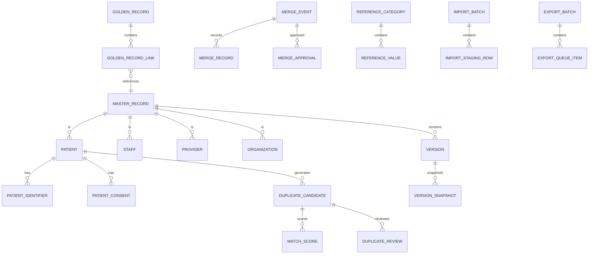

# Master Data Module — Database Tables

> **Document ID:** `master-data/04-Database-Tables`
> **Owner:** Architecture / Engineering Lead (data)
> **Status:** 🔄 Pending approval (Phase 1 gate)
> **Version:** 1.0.0
> **Last updated:** 2026-08-06
> **Review cadence:** Re-reviewed at every phase gate and when the master data model changes.
>
> **Relationship:** Defines the **canonical database schema** (tables, keys, constraints) for the Master Data Management module. It is the detailed companion to the architecture in [03-Database](03-Database.md), implements the requirements in [01-Business-Requirements](01-Business-Requirements.md), and follows [05-DATABASE-ARCHITECTURE](../../05-DATABASE-ARCHITECTURE.md) and [17-DATA-GOVERNANCE](../../17-DATA-GOVERNANCE.md).

---

## Table of Contents

1. [Overview](#1-overview)
2. [Design Principles](#2-design-principles)
3. [Naming Standards](#3-naming-standards)
4. [Table Categories](#4-table-categories)
5. [Core Master Tables](#5-core-master-tables)
6. [Patient Master Tables](#6-patient-master-tables)
7. [Staff Master Tables](#7-staff-master-tables)
8. [Provider Master Tables](#8-provider-master-tables)
9. [Organization Master Tables](#9-organization-master-tables)
10. [Facility Reference Tables](#10-facility-reference-tables)
11. [Geographic Reference Tables](#11-geographic-reference-tables)
12. [Clinical Reference Tables](#12-clinical-reference-tables)
13. [Identity Management Tables](#13-identity-management-tables)
14. [Contact Tables](#14-contact-tables)
15. [Address Tables](#15-address-tables)
16. [Document Tables](#16-document-tables)
17. [Language Tables](#17-language-tables)
18. [Lookup Tables](#18-lookup-tables)
19. [Duplicate Detection Tables](#19-duplicate-detection-tables)
20. [Golden Record Tables](#20-golden-record-tables)
21. [Merge History Tables](#21-merge-history-tables)
22. [Survivorship Tables](#22-survivorship-tables)
23. [Data Stewardship Tables](#23-data-stewardship-tables)
24. [Reference Data Tables](#24-reference-data-tables)
25. [Terminology Tables](#25-terminology-tables)
26. [Audit Reference Tables](#26-audit-reference-tables)
27. [Import Staging Tables](#27-import-staging-tables)
28. [Export Queue Tables](#28-export-queue-tables)
29. [Integration Mapping Tables](#29-integration-mapping-tables)
30. [Cross Reference Tables](#30-cross-reference-tables)
31. [Metadata Tables](#31-metadata-tables)
32. [Version Tables](#32-version-tables)
33. [Soft Delete Strategy](#33-soft-delete-strategy)
34. [Archive Tables](#34-archive-tables)
35. [Relationship Summary](#35-relationship-summary)
36. [Index Strategy](#36-index-strategy)
37. [Partition Strategy](#37-partition-strategy)
38. [Data Volume Estimates](#38-data-volume-estimates)
39. [Growth Projection](#39-growth-projection)
40. [Cross References](#40-cross-references)

> **Note:** This document defines table structure only. It intentionally contains **no SQL, no migrations, no ORM code, and no implementation**. Column data types are specified at implementation; key/constraint semantics are described here.

---

## 1. Overview

This document is the **canonical database specification** for the Master Data Management module. It defines the enterprise tables that hold canonical master records, indexing (MPI/EPI), duplicate detection, golden records, merge history, reference data, metadata, import/export staging, and audit. It defines **what** is stored and **how** records relate — not **how** they are implemented.

The schema comprises **109 tables** — 107 organized into 28 logical groups plus 2 archival governance tables (`archive_table`, `archive_manifest`) — all tenant-scoped, most soft-deletable and versioned, with per-table PHI classification, retention, and growth.

---

## 2. Design Principles

| # | Principle | Application |
| --- | --- | --- |
| DBP-01 | **Single source of truth** | One canonical table per fact ([03-Database](03-Database.md) DB-01) |
| DBP-02 | **Tenant-scoped** | Every table carries a tenant scope ([09-MULTI-TENANCY](../../09-MULTI-TENANCY.md)) |
| DBP-03 | **Non-destructive** | Soft delete by default ([03-Database](03-Database.md) §16) |
| DBP-04 | **Versioned** | Change history preserved ([03-Database](03-Database.md) §15) |
| DBP-05 | **Integrity-first** | FK, unique, and candidate keys enforced |
| DBP-06 | **Classified** | PHI/PII classification drives controls ([17-DATA-GOVERNANCE](../../17-DATA-GOVERNANCE.md) §14) |
| DBP-07 | **Standardized** | Consistent naming and conventions |

---

## 3. Naming Standards

| Convention | Rule |
| --- | --- |
| Case | snake_case, singular |
| Primary key | `id` (surrogate uuid) |
| Tenant key | `tenant_id` |
| Foreign key | `<parent>_id` |
| Status | `status` column |
| Audit | `created_at`, `updated_at`, optional `created_by`, `updated_by` |
| Soft delete | `deleted_at` or `status` |
| Version | `version` / separate version table |
| Constraint names | `pk_<table>`, `fk_<child>_<parent>`, `uq_<table>_<cols>`, `ix_<table>_<cols>` |

> **Cross-module references.** Columns named `actor_id` (and `reported_by`/`assignee_id`/`approver_id`) reference the **canonical actor/identity** managed by the platform IAM ([06-AUTHENTICATION](../../06-AUTHENTICATION.md), [07-ROLES-PERMISSIONS](../../07-ROLES-PERMISSIONS.md)); they are not defined in this schema. `source_system_id` references the **integration source-system** registry ([18-Integrations](18-Integrations.md)); the module's own `audit_actor` (§26) is the audit-side actor reference. These are cross-module references, not local FK targets.

> **Candidate keys.** Candidate keys MUST reference the exact FK column name declared in the same table (per `FK = <parent>_id`). Any abbreviated reference (e.g. candidate key `category_id` where the FK column is `reference_category_id`) is a naming drift to be normalized at implementation.

---

## 4. Table Categories

| # | Category | Tables |
| --- | --- | --- |
| 1 | Core Master | 6 |
| 2 | Patient Master | 6 |
| 3 | Staff Master | 5 |
| 4 | Provider Master | 4 |
| 5 | Organization Master | 5 |
| 6 | Facility Reference | 3 |
| 7 | Geographic Reference | 4 |
| 8 | Clinical Reference | 4 |
| 9 | Identity Management | 4 |
| 10 | Contact | 4 |
| 11 | Address | 3 |
| 12 | Document | 3 |
| 13 | Language | 3 |
| 14 | Lookup | 4 |
| 15 | Duplicate Detection | 5 |
| 16 | Golden Record | 3 |
| 17 | Merge History | 3 |
| 18 | Survivorship | 3 |
| 19 | Data Stewardship | 4 |
| 20 | Reference Data | 6 |
| 21 | Terminology | 3 |
| 22 | Audit Reference | 4 |
| 23 | Import Staging | 3 |
| 24 | Export Queue | 3 |
| 25 | Integration Mapping | 3 |
| 26 | Cross Reference | 3 |
| 27 | Metadata | 3 |
| 28 | Version | 3 |
| — | **Total** | **107** |

---

## 5. Core Master Tables

### Table: `master_record`
| Attribute | Detail |
| --- | --- |
| Purpose | Common identity for any canonical master entity |
| Business Owner | Data Governance Board |
| Description | Supertype row linking patient/staff/org/other master records to golden identity |
| Primary Key | `id` |
| Foreign Keys | `tenant_id`; `entity_type_id` |
| Candidate Keys | `entity_type_id + external_ref` |
| Unique Constraints | `uq_master_record_tenant_ext_ref` |
| Indexes | `ix_master_record_tenant_status` |
| Relationships | 1:N to entity-specific masters; 1:1 to golden_record |
| Lifecycle | draft → active → inactive → archived |
| Retention | Per class ([17-DATA-GOVERNANCE](../../17-DATA-GOVERNANCE.md) §16) |
| Tenant Scope | Yes (`tenant_id`) |
| PHI Classification | Mixed (entity-dependent) |
| Audit Required | Yes |
| Soft Delete | Yes |
| Versioned | Yes |
| Estimated Growth | High |

### Table: `golden_record`
| Attribute | Detail |
| --- | --- |
| Purpose | Canonical best record for a unique entity |
| Business Owner | Registry Administrator |
| Description | Golden record referenced by all consumers; linked to source records |
| Primary Key | `id` |
| Foreign Keys | `tenant_id`; `master_record_id` |
| Candidate Keys | `master_record_id` |
| Unique Constraints | `uq_golden_record_master` |
| Indexes | `ix_golden_record_tenant_status` |
| Relationships | 1:1 master_record; 1:N golden_record_link |
| Lifecycle | active → inactive → archived |
| Retention | Indefinite |
| Tenant Scope | Yes |
| PHI Classification | Mixed |
| Audit Required | Yes |
| Soft Delete | Yes |
| Versioned | Yes |
| Estimated Growth | High |

### Table: `enterprise_person`
| Attribute | Detail |
| --- | --- |
| Purpose | Links person identities across roles (patient/staff) |
| Business Owner | Data Governance Board |
| Description | EPI: a single enterprise view of a person |
| Primary Key | `id` |
| Foreign Keys | `tenant_id` |
| Candidate Keys | — |
| Unique Constraints | — |
| Indexes | `ix_enterprise_person_name`, `ix_enterprise_person_dob` |
| Relationships | 1:N to patient/staff person links |
| Lifecycle | active → inactive |
| Retention | Per class |
| Tenant Scope | Yes |
| PHI Classification | PHI/PII |
| Audit Required | Yes |
| Soft Delete | Yes |
| Versioned | Yes |
| Estimated Growth | High |

### Table: `entity_type`
| Attribute | Detail |
| --- | --- |
| Purpose | Classifies master record subtypes |
| Business Owner | Data Governance Board |
| Description | Reference lookup of entity types (patient, staff, org, etc.) |
| Primary Key | `id` |
| Foreign Keys | `tenant_id` |
| Candidate Keys | `code` |
| Unique Constraints | `uq_entity_type_tenant_code` |
| Indexes | `ix_entity_type_code` |
| Relationships | 1:N master_record |
| Lifecycle | active → inactive |
| Retention | Indefinite |
| Tenant Scope | Yes |
| PHI Classification | Internal |
| Audit Required | Yes |
| Soft Delete | Yes |
| Versioned | Yes |
| Estimated Growth | Low |

### Table: `master_domain`
| Attribute | Detail |
| --- | --- |
| Purpose | Groups master records by domain |
| Business Owner | Data Governance Board |
| Description | Domain registry (patient, staff, organization, reference) |
| Primary Key | `id` |
| Foreign Keys | `tenant_id` |
| Candidate Keys | `code` |
| Unique Constraints | `uq_master_domain_tenant_code` |
| Indexes | — |
| Relationships | 1:N entity_type |
| Lifecycle | active → inactive |
| Retention | Indefinite |
| Tenant Scope | Yes |
| PHI Classification | Internal |
| Audit Required | Yes |
| Soft Delete | Yes |
| Versioned | Yes |
| Estimated Growth | Low |

### Table: `record_status`
| Attribute | Detail |
| --- | --- |
| Purpose | Valid lifecycle states for master records |
| Business Owner | Data Governance Board |
| Description | Controlled vocabulary of statuses |
| Primary Key | `id` |
| Foreign Keys | `tenant_id` |
| Candidate Keys | `code` |
| Unique Constraints | `uq_record_status_tenant_code` |
| Indexes | — |
| Relationships | Referenced by status columns |
| Lifecycle | active → inactive |
| Retention | Indefinite |
| Tenant Scope | Yes |
| PHI Classification | Internal |
| Audit Required | Yes |
| Soft Delete | Yes |
| Versioned | Yes |
| Estimated Growth | Low |

---

## 6. Patient Master Tables

### Table: `patient`
| Attribute | Detail |
| --- | --- |
| Purpose | Canonical patient identity |
| Business Owner | Clinical Data Owner |
| Description | Core patient record; primary demographic attributes |
| Primary Key | `id` |
| Foreign Keys | `tenant_id`; `master_record_id`; `enterprise_person_id` |
| Candidate Keys | `master_record_id` |
| Unique Constraints | — |
| Indexes | `ix_patient_name`, `ix_patient_dob`, `ix_patient_sex` |
| Relationships | 1:N patient_identifier, patient_demographic, patient_consent, patient_alias; N:1 master_record (golden linkage via `master_record`) |
| Lifecycle | draft → active → inactive → archived |
| Retention | Per class ([17-DATA-GOVERNANCE](../../17-DATA-GOVERNANCE.md) §16) |
| Tenant Scope | Yes |
| PHI Classification | PHI |
| Audit Required | Yes |
| Soft Delete | Yes |
| Versioned | Yes |
| Estimated Growth | High |

### Table: `patient_identifier`
| Attribute | Detail |
| --- | --- |
| Purpose | Patient identifiers (MRN, national ID, insurance) |
| Business Owner | Clinical Data Owner |
| Description | Identifier records with type, issuer, value |
| Primary Key | `id` |
| Foreign Keys | `patient_id`; `tenant_id`; `identity_type_id` |
| Candidate Keys | `patient_id + identity_type_id + value` |
| Unique Constraints | `uq_patient_identifier_value` |
| Indexes | `ix_patient_identifier_value`, `ix_patient_identifier_type` |
| Relationships | N:1 patient; N:1 identity_type |
| Lifecycle | active → inactive |
| Retention | Per class |
| Tenant Scope | Yes |
| PHI Classification | PHI |
| Audit Required | Yes |
| Soft Delete | Yes |
| Versioned | Yes |
| Estimated Growth | High |

### Table: `patient_demographic`
| Attribute | Detail |
| --- | --- |
| Purpose | Extended patient demographics |
| Business Owner | Clinical Data Owner |
| Description | Marital status, ethnicity, religion, etc. |
| Primary Key | `id` |
| Foreign Keys | `patient_id`; `tenant_id` |
| Candidate Keys | `patient_id` |
| Unique Constraints | `uq_patient_demographic_patient` |
| Indexes | `ix_patient_demographic_ethnicity` |
| Relationships | 1:1 patient |
| Lifecycle | active → inactive |
| Retention | Per class |
| Tenant Scope | Yes |
| PHI Classification | PHI |
| Audit Required | Yes |
| Soft Delete | Yes |
| Versioned | Yes |
| Estimated Growth | Medium |

### Table: `patient_consent`
| Attribute | Detail |
| --- | --- |
| Purpose | Patient consent for data access/sharing |
| Business Owner | Clinical Data Owner |
| Description | Consent records governing sensitive access |
| Primary Key | `id` |
| Foreign Keys | `patient_id`; `tenant_id`; `consent_type_id` |
| Candidate Keys | `patient_id + consent_type_id` |
| Unique Constraints | — |
| Indexes | `ix_patient_consent_patient`, `ix_patient_consent_status` |
| Relationships | N:1 patient |
| Lifecycle | active → revoked |
| Retention | Per class + legal |
| Tenant Scope | Yes |
| PHI Classification | PHI |
| Audit Required | Yes |
| Soft Delete | Yes |
| Versioned | Yes |
| Estimated Growth | Medium |

### Table: `patient_relation`
| Attribute | Detail |
| --- | --- |
| Purpose | Relationships between patients (next-of-kin, guarantor) |
| Business Owner | Clinical Data Owner |
| Description | Patient-to-patient relationship links |
| Primary Key | `id` |
| Foreign Keys | `patient_id`; `related_patient_id`; `tenant_id`; `relation_type_id` |
| Candidate Keys | `patient_id + related_patient_id + relation_type_id` |
| Unique Constraints | `uq_patient_relation_pair` |
| Indexes | `ix_patient_relation_patient` |
| Relationships | N:1 patient (both sides) |
| Lifecycle | active → inactive |
| Retention | Per class |
| Tenant Scope | Yes |
| PHI Classification | PHI |
| Audit Required | Yes |
| Soft Delete | Yes |
| Versioned | Yes |
| Estimated Growth | Medium |

### Table: `patient_alias`
| Attribute | Detail |
| --- | --- |
| Purpose | Alternate patient names (maiden, aka) |
| Business Owner | Clinical Data Owner |
| Description | Aliases supporting search/matching |
| Primary Key | `id` |
| Foreign Keys | `patient_id`; `tenant_id` |
| Candidate Keys | — |
| Unique Constraints | — |
| Indexes | `ix_patient_alias_name` |
| Relationships | N:1 patient |
| Lifecycle | active → inactive |
| Retention | Per class |
| Tenant Scope | Yes |
| PHI Classification | PHI |
| Audit Required | Yes |
| Soft Delete | Yes |
| Versioned | Yes |
| Estimated Growth | Medium |

---

## 7. Staff Master Tables

### Table: `staff`
| Attribute | Detail |
| --- | --- |
| Purpose | Canonical staff/provider identity |
| Business Owner | HR/Ops Owner |
| Description | Staff master referenced by [Hospital Setup](../hospital-setup/README.md) assignment |
| Primary Key | `id` |
| Foreign Keys | `tenant_id`; `master_record_id`; `enterprise_person_id` |
| Candidate Keys | `master_record_id` |
| Unique Constraints | — |
| Indexes | `ix_staff_name`, `ix_staff_status` |
| Relationships | 1:N staff_identifier, staff_credential, staff_consent |
| Lifecycle | draft → active → inactive |
| Retention | Per class |
| Tenant Scope | Yes |
| PHI Classification | PII |
| Audit Required | Yes |
| Soft Delete | Yes |
| Versioned | Yes |
| Estimated Growth | Medium |

### Table: `staff_identifier`
| Attribute | Detail |
| --- | --- |
| Purpose | Staff identifiers (employee ID, national ID) |
| Business Owner | HR/Ops Owner |
| Description | Identifier records for staff |
| Primary Key | `id` |
| Foreign Keys | `staff_id`; `tenant_id`; `identity_type_id` |
| Candidate Keys | `staff_id + identity_type_id + value` |
| Unique Constraints | `uq_staff_identifier_value` |
| Indexes | `ix_staff_identifier_value` |
| Relationships | N:1 staff; N:1 identity_type |
| Lifecycle | active → inactive |
| Retention | Per class |
| Tenant Scope | Yes |
| PHI Classification | PII |
| Audit Required | Yes |
| Soft Delete | Yes |
| Versioned | Yes |
| Estimated Growth | Medium |

### Table: `staff_credential`
| Attribute | Detail |
| --- | --- |
| Purpose | Staff credentials and licenses |
| Business Owner | HR/Ops Owner |
| Description | Clinical/professional credentials with expiry |
| Primary Key | `id` |
| Foreign Keys | `staff_id`; `tenant_id`; `credential_type_id` |
| Candidate Keys | `staff_id + credential_type_id + number` |
| Unique Constraints | `uq_staff_credential_number` |
| Indexes | `ix_staff_credential_staff`, `ix_staff_credential_expiry` |
| Relationships | N:1 staff |
| Lifecycle | active → expired → inactive |
| Retention | Per class |
| Tenant Scope | Yes |
| PHI Classification | PII |
| Audit Required | Yes |
| Soft Delete | Yes |
| Versioned | Yes |
| Estimated Growth | Medium |

### Table: `staff_demographic`
| Attribute | Detail |
| --- | --- |
| Purpose | Extended staff demographics |
| Business Owner | HR/Ops Owner |
| Description | Supplementary staff attribute data |
| Primary Key | `id` |
| Foreign Keys | `staff_id`; `tenant_id` |
| Candidate Keys | `staff_id` |
| Unique Constraints | `uq_staff_demographic_staff` |
| Indexes | — |
| Relationships | 1:1 staff |
| Lifecycle | active → inactive |
| Retention | Per class |
| Tenant Scope | Yes |
| PHI Classification | PII |
| Audit Required | Yes |
| Soft Delete | Yes |
| Versioned | Yes |
| Estimated Growth | Low |

### Table: `staff_consent`
| Attribute | Detail |
| --- | --- |
| Purpose | Staff consent/preferences |
| Business Owner | HR/Ops Owner |
| Description | Consent for communication and data use |
| Primary Key | `id` |
| Foreign Keys | `staff_id`; `tenant_id`; `consent_type_id` |
| Candidate Keys | `staff_id + consent_type_id` |
| Unique Constraints | — |
| Indexes | `ix_staff_consent_staff` |
| Relationships | N:1 staff |
| Lifecycle | active → revoked |
| Retention | Per class |
| Tenant Scope | Yes |
| PHI Classification | PII |
| Audit Required | Yes |
| Soft Delete | Yes |
| Versioned | Yes |
| Estimated Growth | Low |

---

## 8. Provider Master Tables

### Table: `provider`
| Attribute | Detail |
| --- | --- |
| Purpose | External provider organizations/individuals |
| Business Owner | Clinical Data Owner |
| Description | Providers (facilities, networks, clinicians) for referral |
| Primary Key | `id` |
| Foreign Keys | `tenant_id`; `master_record_id` |
| Candidate Keys | `master_record_id` |
| Unique Constraints | — |
| Indexes | `ix_provider_name`, `ix_provider_type` |
| Relationships | 1:N provider_identifier, provider_credential, provider_network |
| Lifecycle | active → inactive |
| Retention | Per class |
| Tenant Scope | Yes |
| PHI Classification | Internal |
| Audit Required | Yes |
| Soft Delete | Yes |
| Versioned | Yes |
| Estimated Growth | Low |

### Table: `provider_credential`
| Attribute | Detail |
| --- | --- |
| Purpose | Provider credentials/registrations |
| Business Owner | Clinical Data Owner |
| Description | Licenses and registrations for providers |
| Primary Key | `id` |
| Foreign Keys | `provider_id`; `tenant_id`; `credential_type_id` |
| Candidate Keys | `provider_id + credential_type_id + number` |
| Unique Constraints | `uq_provider_credential_number` |
| Indexes | `ix_provider_credential_provider` |
| Relationships | N:1 provider |
| Lifecycle | active → expired → inactive |
| Retention | Per class |
| Tenant Scope | Yes |
| PHI Classification | Internal |
| Audit Required | Yes |
| Soft Delete | Yes |
| Versioned | Yes |
| Estimated Growth | Low |

### Table: `provider_network`
| Attribute | Detail |
| --- | --- |
| Purpose | Provider network membership |
| Business Owner | Clinical Data Owner |
| Description | Networks a provider belongs to |
| Primary Key | `id` |
| Foreign Keys | `provider_id`; `network_id`; `tenant_id` |
| Candidate Keys | `provider_id + network_id` |
| Unique Constraints | `uq_provider_network_pair` |
| Indexes | — |
| Relationships | N:1 provider; N:1 organization(network) |
| Lifecycle | active → inactive |
| Retention | Per class |
| Tenant Scope | Yes |
| PHI Classification | Internal |
| Audit Required | Yes |
| Soft Delete | Yes |
| Versioned | Yes |
| Estimated Growth | Low |

### Table: `provider_identifier`
| Attribute | Detail |
| --- | --- |
| Purpose | Provider identifiers (NPI, registration) |
| Business Owner | Clinical Data Owner |
| Description | Identifier records for providers |
| Primary Key | `id` |
| Foreign Keys | `provider_id`; `tenant_id`; `identity_type_id` |
| Candidate Keys | `provider_id + identity_type_id + value` |
| Unique Constraints | `uq_provider_identifier_value` |
| Indexes | `ix_provider_identifier_value` |
| Relationships | N:1 provider; N:1 identity_type |
| Lifecycle | active → inactive |
| Retention | Per class |
| Tenant Scope | Yes |
| PHI Classification | Internal |
| Audit Required | Yes |
| Soft Delete | Yes |
| Versioned | Yes |
| Estimated Growth | Low |

---

## 9. Organization Master Tables

### Table: `organization`
| Attribute | Detail |
| --- | --- |
| Purpose | Canonical organization master (vendors, payers, partners) |
| Business Owner | Procurement/Finance Owner |
| Description | Organization records with core attributes |
| Primary Key | `id` |
| Foreign Keys | `tenant_id`; `master_record_id`; `organization_type_id` |
| Candidate Keys | `master_record_id` |
| Unique Constraints | — |
| Indexes | `ix_organization_name`, `ix_organization_type` |
| Relationships | 1:N organization_contact, organization_identifier, organization_relationship |
| Lifecycle | active → inactive |
| Retention | Per class |
| Tenant Scope | Yes |
| PHI Classification | Internal |
| Audit Required | Yes |
| Soft Delete | Yes |
| Versioned | Yes |
| Estimated Growth | Medium |

### Table: `organization_contact`
| Attribute | Detail |
| --- | --- |
| Purpose | Organization contact points |
| Business Owner | Procurement/Finance Owner |
| Description | Contacts (person, role, channel) for an organization |
| Primary Key | `id` |
| Foreign Keys | `organization_id`; `tenant_id`; `contact_id` |
| Candidate Keys | — |
| Unique Constraints | — |
| Indexes | `ix_org_contact_org` |
| Relationships | N:1 organization; N:1 contact |
| Lifecycle | active → inactive |
| Retention | Per class |
| Tenant Scope | Yes |
| PHI Classification | Internal |
| Audit Required | Yes |
| Soft Delete | Yes |
| Versioned | Yes |
| Estimated Growth | Medium |

### Table: `organization_identifier`
| Attribute | Detail |
| --- | --- |
| Purpose | Organization identifiers (tax, registration) |
| Business Owner | Procurement/Finance Owner |
| Description | Identifier records for organizations |
| Primary Key | `id` |
| Foreign Keys | `organization_id`; `tenant_id`; `identity_type_id` |
| Candidate Keys | `organization_id + identity_type_id + value` |
| Unique Constraints | `uq_org_identifier_value` |
| Indexes | `ix_org_identifier_value` |
| Relationships | N:1 organization; N:1 identity_type |
| Lifecycle | active → inactive |
| Retention | Per class |
| Tenant Scope | Yes |
| PHI Classification | Internal |
| Audit Required | Yes |
| Soft Delete | Yes |
| Versioned | Yes |
| Estimated Growth | Medium |

### Table: `organization_type`
| Attribute | Detail |
| --- | --- |
| Purpose | Classifies organizations (vendor, payer, partner) |
| Business Owner | Procurement/Finance Owner |
| Description | Controlled vocabulary of org types |
| Primary Key | `id` |
| Foreign Keys | `tenant_id` |
| Candidate Keys | `code` |
| Unique Constraints | `uq_org_type_tenant_code` |
| Indexes | — |
| Relationships | 1:N organization |
| Lifecycle | active → inactive |
| Retention | Indefinite |
| Tenant Scope | Yes |
| PHI Classification | Internal |
| Audit Required | Yes |
| Soft Delete | Yes |
| Versioned | Yes |
| Estimated Growth | Low |

### Table: `organization_relationship`
| Attribute | Detail |
| --- | --- |
| Purpose | Relationships between organizations |
| Business Owner | Procurement/Finance Owner |
| Description | Parent/subsidiary/partner links |
| Primary Key | `id` |
| Foreign Keys | `organization_id`; `related_org_id`; `tenant_id`; `relation_type_id` |
| Candidate Keys | `organization_id + related_org_id + relation_type_id` |
| Unique Constraints | `uq_org_relation_pair` |
| Indexes | `ix_org_relation_org` |
| Relationships | N:1 organization (both sides) |
| Lifecycle | active → inactive |
| Retention | Per class |
| Tenant Scope | Yes |
| PHI Classification | Internal |
| Audit Required | Yes |
| Soft Delete | Yes |
| Versioned | Yes |
| Estimated Growth | Low |

---

## 10. Facility Reference Tables

### Table: `facility_reference`
| Attribute | Detail |
| --- | --- |
| Purpose | Reference view of facilities for master data scoping |
| Business Owner | Operations Owner |
| Description | Mirrors facility identity from [Hospital Setup](../hospital-setup/README.md) |
| Primary Key | `id` |
| Foreign Keys | `tenant_id` |
| Candidate Keys | `external_ref` |
| Unique Constraints | `uq_facility_ref_external` |
| Indexes | `ix_facility_ref_tenant_code` |
| Relationships | Referenced by master data scope |
| Lifecycle | active → inactive |
| Retention | Indefinite |
| Tenant Scope | Yes |
| PHI Classification | Internal |
| Audit Required | Yes |
| Soft Delete | Yes |
| Versioned | Yes |
| Estimated Growth | Low |

### Table: `department_reference`
| Attribute | Detail |
| --- | --- |
| Purpose | Reference view of departments |
| Business Owner | Operations Owner |
| Description | Mirrors department identity from Hospital Setup |
| Primary Key | `id` |
| Foreign Keys | `tenant_id`; `facility_reference_id` |
| Candidate Keys | `external_ref` |
| Unique Constraints | `uq_department_ref_external` |
| Indexes | `ix_department_ref_facility` |
| Relationships | N:1 facility_reference |
| Lifecycle | active → inactive |
| Retention | Indefinite |
| Tenant Scope | Yes |
| PHI Classification | Internal |
| Audit Required | Yes |
| Soft Delete | Yes |
| Versioned | Yes |
| Estimated Growth | Low |

### Table: `unit_reference`
| Attribute | Detail |
| --- | --- |
| Purpose | Reference view of units |
| Business Owner | Operations Owner |
| Description | Mirrors unit identity from Hospital Setup |
| Primary Key | `id` |
| Foreign Keys | `tenant_id`; `department_reference_id` |
| Candidate Keys | `external_ref` |
| Unique Constraints | `uq_unit_ref_external` |
| Indexes | `ix_unit_ref_department` |
| Relationships | N:1 department_reference |
| Lifecycle | active → inactive |
| Retention | Indefinite |
| Tenant Scope | Yes |
| PHI Classification | Internal |
| Audit Required | Yes |
| Soft Delete | Yes |
| Versioned | Yes |
| Estimated Growth | Low |

---

## 11. Geographic Reference Tables

### Table: `country`
| Attribute | Detail |
| --- | --- |
| Purpose | Country reference data |
| Business Owner | Data Governance Board |
| Description | Standard country codes/names |
| Primary Key | `id` |
| Foreign Keys | `tenant_id` |
| Candidate Keys | `code` |
| Unique Constraints | `uq_country_tenant_code` |
| Indexes | `ix_country_code` |
| Relationships | 1:N region |
| Lifecycle | active → inactive |
| Retention | Indefinite |
| Tenant Scope | Yes |
| PHI Classification | Internal |
| Audit Required | Yes |
| Soft Delete | Yes |
| Versioned | Yes |
| Estimated Growth | Low |

### Table: `region`
| Attribute | Detail |
| --- | --- |
| Purpose | Region/state/province reference |
| Business Owner | Data Governance Board |
| Description | Sub-national administrative areas |
| Primary Key | `id` |
| Foreign Keys | `tenant_id`; `country_id` |
| Candidate Keys | `country_id + code` |
| Unique Constraints | `uq_region_country_code` |
| Indexes | `ix_region_country` |
| Relationships | N:1 country; 1:N city |
| Lifecycle | active → inactive |
| Retention | Indefinite |
| Tenant Scope | Yes |
| PHI Classification | Internal |
| Audit Required | Yes |
| Soft Delete | Yes |
| Versioned | Yes |
| Estimated Growth | Low |

### Table: `city`
| Attribute | Detail |
| --- | --- |
| Purpose | City/town reference |
| Business Owner | Data Governance Board |
| Description | Cities within regions |
| Primary Key | `id` |
| Foreign Keys | `tenant_id`; `region_id` |
| Candidate Keys | `region_id + code` |
| Unique Constraints | `uq_city_region_code` |
| Indexes | `ix_city_region` |
| Relationships | N:1 region; 1:N postal_code |
| Lifecycle | active → inactive |
| Retention | Indefinite |
| Tenant Scope | Yes |
| PHI Classification | Internal |
| Audit Required | Yes |
| Soft Delete | Yes |
| Versioned | Yes |
| Estimated Growth | Low |

### Table: `postal_code`
| Attribute | Detail |
| --- | --- |
| Purpose | Postal code reference |
| Business Owner | Data Governance Board |
| Description | Postal codes linked to cities |
| Primary Key | `id` |
| Foreign Keys | `tenant_id`; `city_id` |
| Candidate Keys | `code` |
| Unique Constraints | `uq_postal_code_tenant_code` |
| Indexes | `ix_postal_code_city` |
| Relationships | N:1 city |
| Lifecycle | active → inactive |
| Retention | Indefinite |
| Tenant Scope | Yes |
| PHI Classification | Internal |
| Audit Required | Yes |
| Soft Delete | Yes |
| Versioned | Yes |
| Estimated Growth | Low |

---

## 12. Clinical Reference Tables

### Table: `clinical_code_set`
| Attribute | Detail |
| --- | --- |
| Purpose | Groups clinical codes by standard (ICD, LOINC, etc.) |
| Business Owner | Clinical Data Owner |
| Description | Code set registry aligning to [19-CLINICAL-STANDARDS](../../19-CLINICAL-STANDARDS.md) |
| Primary Key | `id` |
| Foreign Keys | `tenant_id` |
| Candidate Keys | `code` |
| Unique Constraints | `uq_clinical_code_set_tenant_code` |
| Indexes | — |
| Relationships | 1:N clinical_code |
| Lifecycle | active → inactive |
| Retention | Indefinite |
| Tenant Scope | Yes |
| PHI Classification | Internal |
| Audit Required | Yes |
| Soft Delete | Yes |
| Versioned | Yes |
| Estimated Growth | Low |

### Table: `clinical_code`
| Attribute | Detail |
| --- | --- |
| Purpose | Individual clinical codes |
| Business Owner | Clinical Data Owner |
| Description | Codes with edition, validity (ICD, LOINC, RxNorm, etc.) |
| Primary Key | `id` |
| Foreign Keys | `tenant_id`; `clinical_code_set_id` |
| Candidate Keys | `code_set_id + code + edition` |
| Unique Constraints | `uq_clinical_code_set_edition` |
| Indexes | `ix_clinical_code_value`, `ix_clinical_code_set` |
| Relationships | N:1 clinical_code_set |
| Lifecycle | active → inactive |
| Retention | Indefinite |
| Tenant Scope | Yes |
| PHI Classification | Internal |
| Audit Required | Yes |
| Soft Delete | Yes |
| Versioned | Yes |
| Estimated Growth | Medium |

### Table: `clinical_vocabulary`
| Attribute | Detail |
| --- | --- |
| Purpose | Vocabulary (terminology) registry |
| Business Owner | Clinical Data Owner |
| Description | Registered vocabularies served by terminology service |
| Primary Key | `id` |
| Foreign Keys | `tenant_id` |
| Candidate Keys | `code` |
| Unique Constraints | `uq_vocabulary_tenant_code` |
| Indexes | — |
| Relationships | 1:N terminology_entry |
| Lifecycle | active → inactive |
| Retention | Indefinite |
| Tenant Scope | Yes |
| PHI Classification | Internal |
| Audit Required | Yes |
| Soft Delete | Yes |
| Versioned | Yes |
| Estimated Growth | Low |

### Table: `clinical_mapping`
| Attribute | Detail |
| --- | --- |
| Purpose | Cross-standard code mappings |
| Business Owner | Clinical Data Owner |
| Description | Maps codes across standards (ICD↔SNOMED, etc.) |
| Primary Key | `id` |
| Foreign Keys | `tenant_id`; `source_code_id`; `target_code_id` |
| Candidate Keys | `source_code_id + target_code_id` |
| Unique Constraints | `uq_clinical_mapping_pair` |
| Indexes | `ix_clinical_mapping_source` |
| Relationships | N:1 clinical_code (both sides) |
| Lifecycle | active → inactive |
| Retention | Indefinite |
| Tenant Scope | Yes |
| PHI Classification | Internal |
| Audit Required | Yes |
| Soft Delete | Yes |
| Versioned | Yes |
| Estimated Growth | Medium |

---

## 13. Identity Management Tables

### Table: `identity_type`
| Attribute | Detail |
| --- | --- |
| Purpose | Identifier types (MRN, national ID, NPI) |
| Business Owner | Data Governance Board |
| Description | Controlled vocabulary of identity types |
| Primary Key | `id` |
| Foreign Keys | `tenant_id` |
| Candidate Keys | `code` |
| Unique Constraints | `uq_identity_type_tenant_code` |
| Indexes | — |
| Relationships | 1:N identity_record, identifier tables |
| Lifecycle | active → inactive |
| Retention | Indefinite |
| Tenant Scope | Yes |
| PHI Classification | Internal |
| Audit Required | Yes |
| Soft Delete | Yes |
| Versioned | Yes |
| Estimated Growth | Low |

### Table: `identity_issuer`
| Attribute | Detail |
| --- | --- |
| Purpose | Issuing authority for identifiers |
| Business Owner | Data Governance Board |
| Description | Organizations that issue identifiers |
| Primary Key | `id` |
| Foreign Keys | `tenant_id`; `organization_id` |
| Candidate Keys | `code` |
| Unique Constraints | `uq_identity_issuer_tenant_code` |
| Indexes | — |
| Relationships | 1:N identity_record |
| Lifecycle | active → inactive |
| Retention | Indefinite |
| Tenant Scope | Yes |
| PHI Classification | Internal |
| Audit Required | Yes |
| Soft Delete | Yes |
| Versioned | Yes |
| Estimated Growth | Low |

### Table: `identity_record`
| Attribute | Detail |
| --- | --- |
| Purpose | Generic identity records for master entities |
| Business Owner | Data Governance Board |
| Description | Unifies identifier assignment across entity types |
| Primary Key | `id` |
| Foreign Keys | `master_record_id`; `tenant_id`; `identity_type_id`; `identity_issuer_id` |
| Candidate Keys | `master_record_id + identity_type_id + value` |
| Unique Constraints | `uq_identity_record_value` |
| Indexes | `ix_identity_record_value`, `ix_identity_record_master` |
| Relationships | N:1 master_record; N:1 identity_type |
| Lifecycle | active → inactive |
| Retention | Per class |
| Tenant Scope | Yes |
| PHI Classification | Mixed |
| Audit Required | Yes |
| Soft Delete | Yes |
| Versioned | Yes |
| Estimated Growth | High |

### Table: `identity_assignment`
| Attribute | Detail |
| --- | --- |
| Purpose | Audit of identifier assignment/rotation |
| Business Owner | Data Governance Board |
| Description | Tracks assign/rotate/revoke lifecycle |
| Primary Key | `id` |
| Foreign Keys | `identity_record_id`; `tenant_id`; `actor_id` |
| Candidate Keys | — |
| Unique Constraints | — |
| Indexes | `ix_identity_assignment_record` |
| Relationships | N:1 identity_record |
| Lifecycle | append-only |
| Retention | Per class |
| Tenant Scope | Yes |
| PHI Classification | Mixed |
| Audit Required | Yes |
| Soft Delete | No |
| Versioned | No |
| Estimated Growth | Medium |

---

## 14. Contact Tables

### Table: `contact`
| Attribute | Detail |
| --- | --- |
| Purpose | Contact channels (email, phone) |
| Business Owner | Data Governance Board |
| Description | Contact points reusable across entities |
| Primary Key | `id` |
| Foreign Keys | `tenant_id`; `contact_type_id`; `contact_use_id` |
| Candidate Keys | — |
| Unique Constraints | — |
| Indexes | `ix_contact_value` |
| Relationships | 1:N organization_contact, entity contact links |
| Lifecycle | active → inactive |
| Retention | Per class |
| Tenant Scope | Yes |
| PHI Classification | PII |
| Audit Required | Yes |
| Soft Delete | Yes |
| Versioned | Yes |
| Estimated Growth | High |

### Table: `contact_type`
| Attribute | Detail |
| --- | --- |
| Purpose | Contact channel type (email, phone, sms) |
| Business Owner | Data Governance Board |
| Description | Controlled vocabulary of contact types |
| Primary Key | `id` |
| Foreign Keys | `tenant_id` |
| Candidate Keys | `code` |
| Unique Constraints | `uq_contact_type_tenant_code` |
| Indexes | — |
| Relationships | 1:N contact |
| Lifecycle | active → inactive |
| Retention | Indefinite |
| Tenant Scope | Yes |
| PHI Classification | Internal |
| Audit Required | Yes |
| Soft Delete | Yes |
| Versioned | Yes |
| Estimated Growth | Low |

### Table: `contact_use`
| Attribute | Detail |
| --- | --- |
| Purpose | Contact purpose (home, work, mobile) |
| Business Owner | Data Governance Board |
| Description | Controlled vocabulary of contact uses |
| Primary Key | `id` |
| Foreign Keys | `tenant_id` |
| Candidate Keys | `code` |
| Unique Constraints | `uq_contact_use_tenant_code` |
| Indexes | — |
| Relationships | 1:N contact |
| Lifecycle | active → inactive |
| Retention | Indefinite |
| Tenant Scope | Yes |
| PHI Classification | Internal |
| Audit Required | Yes |
| Soft Delete | Yes |
| Versioned | Yes |
| Estimated Growth | Low |

### Table: `contact_preference`
| Attribute | Detail |
| --- | --- |
| Purpose | Preferred contact channel |
| Business Owner | Data Governance Board |
| Description | Preferred channel and do-not-contact flags |
| Primary Key | `id` |
| Foreign Keys | `master_record_id`; `tenant_id`; `contact_id` |
| Candidate Keys | `master_record_id` |
| Unique Constraints | `uq_contact_pref_master` |
| Indexes | — |
| Relationships | N:1 master_record; N:1 contact |
| Lifecycle | active → inactive |
| Retention | Per class |
| Tenant Scope | Yes |
| PHI Classification | PII |
| Audit Required | Yes |
| Soft Delete | Yes |
| Versioned | Yes |
| Estimated Growth | Medium |

---

## 15. Address Tables

### Table: `address`
| Attribute | Detail |
| --- | --- |
| Purpose | Entity addresses |
| Business Owner | Data Governance Board |
| Description | Reusable address records with validation status |
| Primary Key | `id` |
| Foreign Keys | `tenant_id`; `address_type_id`; `postal_code_id` |
| Candidate Keys | — |
| Unique Constraints | — |
| Indexes | `ix_address_postal`, `ix_address_entity` |
| Relationships | 1:N entity address links |
| Lifecycle | active → inactive |
| Retention | Per class |
| Tenant Scope | Yes |
| PHI Classification | PII |
| Audit Required | Yes |
| Soft Delete | Yes |
| Versioned | Yes |
| Estimated Growth | High |

### Table: `address_type`
| Attribute | Detail |
| --- | --- |
| Purpose | Address purpose (home, work, mailing) |
| Business Owner | Data Governance Board |
| Description | Controlled vocabulary of address types |
| Primary Key | `id` |
| Foreign Keys | `tenant_id` |
| Candidate Keys | `code` |
| Unique Constraints | `uq_address_type_tenant_code` |
| Indexes | — |
| Relationships | 1:N address |
| Lifecycle | active → inactive |
| Retention | Indefinite |
| Tenant Scope | Yes |
| PHI Classification | Internal |
| Audit Required | Yes |
| Soft Delete | Yes |
| Versioned | Yes |
| Estimated Growth | Low |

### Table: `address_validation`
| Attribute | Detail |
| --- | --- |
| Purpose | Address validation outcomes |
| Business Owner | Data Governance Board |
| Description | Validation status, confidence, corrections |
| Primary Key | `id` |
| Foreign Keys | `address_id`; `tenant_id` |
| Candidate Keys | `address_id` |
| Unique Constraints | `uq_address_validation_address` |
| Indexes | — |
| Relationships | 1:1 address |
| Lifecycle | append-only |
| Retention | Per class |
| Tenant Scope | Yes |
| PHI Classification | PII |
| Audit Required | Yes |
| Soft Delete | No |
| Versioned | No |
| Estimated Growth | Medium |

---

## 16. Document Tables

### Table: `master_document`
| Attribute | Detail |
| --- | --- |
| Purpose | Documents attached to master records |
| Business Owner | Data Governance Board |
| Description | Metadata for stored documents (image, PDF) |
| Primary Key | `id` |
| Foreign Keys | `master_record_id`; `tenant_id`; `document_type_id`; `document_storage_id` |
| Candidate Keys | — |
| Unique Constraints | — |
| Indexes | `ix_master_document_master`, `ix_master_document_type` |
| Relationships | N:1 master_record; N:1 document_storage |
| Lifecycle | active → inactive |
| Retention | Per class |
| Tenant Scope | Yes |
| PHI Classification | Mixed |
| Audit Required | Yes |
| Soft Delete | Yes |
| Versioned | Yes |
| Estimated Growth | Medium |

### Table: `document_type`
| Attribute | Detail |
| --- | --- |
| Purpose | Document category (ID, photo, consent) |
| Business Owner | Data Governance Board |
| Description | Controlled vocabulary of document types |
| Primary Key | `id` |
| Foreign Keys | `tenant_id` |
| Candidate Keys | `code` |
| Unique Constraints | `uq_doc_type_tenant_code` |
| Indexes | — |
| Relationships | 1:N master_document |
| Lifecycle | active → inactive |
| Retention | Indefinite |
| Tenant Scope | Yes |
| PHI Classification | Internal |
| Audit Required | Yes |
| Soft Delete | Yes |
| Versioned | Yes |
| Estimated Growth | Low |

### Table: `document_storage`
| Attribute | Detail |
| --- | --- |
| Purpose | Object storage reference for documents |
| Business Owner | Platform Engineering |
| Description | Points to object storage location ([03-TECHNOLOGY-STACK](../../03-TECHNOLOGY-STACK.md)) |
| Primary Key | `id` |
| Foreign Keys | `tenant_id` |
| Candidate Keys | `storage_ref` |
| Unique Constraints | `uq_doc_storage_ref` |
| Indexes | — |
| Relationships | 1:N master_document |
| Lifecycle | active → archived |
| Retention | Per class |
| Tenant Scope | Yes |
| PHI Classification | Internal |
| Audit Required | Yes |
| Soft Delete | No |
| Versioned | No |
| Estimated Growth | Medium |

---

## 17. Language Tables

### Table: `language`
| Attribute | Detail |
| --- | --- |
| Purpose | Language reference data |
| Business Owner | Data Governance Board |
| Description | Languages with codes |
| Primary Key | `id` |
| Foreign Keys | `tenant_id` |
| Candidate Keys | `code` |
| Unique Constraints | `uq_language_tenant_code` |
| Indexes | — |
| Relationships | 1:N language_preference |
| Lifecycle | active → inactive |
| Retention | Indefinite |
| Tenant Scope | Yes |
| PHI Classification | Internal |
| Audit Required | Yes |
| Soft Delete | Yes |
| Versioned | Yes |
| Estimated Growth | Low |

### Table: `language_preference`
| Attribute | Detail |
| --- | --- |
| Purpose | Entity preferred language |
| Business Owner | Data Governance Board |
| Description | Preferred language for communication |
| Primary Key | `id` |
| Foreign Keys | `master_record_id`; `tenant_id`; `language_id` |
| Candidate Keys | `master_record_id + language_id` |
| Unique Constraints | `uq_lang_pref_master_lang` |
| Indexes | — |
| Relationships | N:1 master_record; N:1 language |
| Lifecycle | active → inactive |
| Retention | Per class |
| Tenant Scope | Yes |
| PHI Classification | Internal |
| Audit Required | Yes |
| Soft Delete | Yes |
| Versioned | Yes |
| Estimated Growth | Medium |

### Table: `language_proficiency`
| Attribute | Detail |
| --- | --- |
| Purpose | Staff/patient language proficiency |
| Business Owner | Data Governance Board |
| Description | Proficiency level per language |
| Primary Key | `id` |
| Foreign Keys | `master_record_id`; `tenant_id`; `language_id` |
| Candidate Keys | `master_record_id + language_id` |
| Unique Constraints | `uq_lang_prof_master_lang` |
| Indexes | — |
| Relationships | N:1 master_record; N:1 language |
| Lifecycle | active → inactive |
| Retention | Per class |
| Tenant Scope | Yes |
| PHI Classification | Internal |
| Audit Required | Yes |
| Soft Delete | Yes |
| Versioned | Yes |
| Estimated Growth | Low |

---

## 18. Lookup Tables

### Table: `lookup`
| Attribute | Detail |
| --- | --- |
| Purpose | Generic lookup values |
| Business Owner | Data Governance Board |
| Description | Simple key/value lookups |
| Primary Key | `id` |
| Foreign Keys | `tenant_id`; `lookup_category_id` |
| Candidate Keys | `category_id + code` |
| Unique Constraints | `uq_lookup_cat_code` |
| Indexes | `ix_lookup_category` |
| Relationships | N:1 lookup_category |
| Lifecycle | active → inactive |
| Retention | Indefinite |
| Tenant Scope | Yes |
| PHI Classification | Internal |
| Audit Required | Yes |
| Soft Delete | Yes |
| Versioned | Yes |
| Estimated Growth | Low |

### Table: `lookup_category`
| Attribute | Detail |
| --- | --- |
| Purpose | Groups lookup values |
| Business Owner | Data Governance Board |
| Description | Lookup categories |
| Primary Key | `id` |
| Foreign Keys | `tenant_id` |
| Candidate Keys | `code` |
| Unique Constraints | `uq_lookup_category_tenant_code` |
| Indexes | — |
| Relationships | 1:N lookup |
| Lifecycle | active → inactive |
| Retention | Indefinite |
| Tenant Scope | Yes |
| PHI Classification | Internal |
| Audit Required | Yes |
| Soft Delete | Yes |
| Versioned | Yes |
| Estimated Growth | Low |

### Table: `lookup_value`
| Attribute | Detail |
| --- | --- |
| Purpose | Detailed lookup values with attributes |
| Business Owner | Data Governance Board |
| Description | Extended lookup values with sort/active flags |
| Primary Key | `id` |
| Foreign Keys | `tenant_id`; `lookup_category_id` |
| Candidate Keys | `category_id + code` |
| Unique Constraints | `uq_lookup_value_cat_code` |
| Indexes | `ix_lookup_value_category` |
| Relationships | N:1 lookup_category |
| Lifecycle | active → inactive |
| Retention | Indefinite |
| Tenant Scope | Yes |
| PHI Classification | Internal |
| Audit Required | Yes |
| Soft Delete | Yes |
| Versioned | Yes |
| Estimated Growth | Low |

### Table: `enum_definition`
| Attribute | Detail |
| --- | --- |
| Purpose | Domain enum values |
| Business Owner | Data Governance Board |
| Description | Defines enum value sets for status/type columns |
| Primary Key | `id` |
| Foreign Keys | `tenant_id` |
| Candidate Keys | `code` |
| Unique Constraints | `uq_enum_def_tenant_code` |
| Indexes | — |
| Relationships | Referenced by enum columns |
| Lifecycle | active → inactive |
| Retention | Indefinite |
| Tenant Scope | Yes |
| PHI Classification | Internal |
| Audit Required | Yes |
| Soft Delete | Yes |
| Versioned | Yes |
| Estimated Growth | Low |

---

## 19. Duplicate Detection Tables

### Table: `duplicate_candidate`
| Attribute | Detail |
| --- | --- |
| Purpose | Candidate duplicate record pairs |
| Business Owner | Registry Administrator |
| Description | Flagged potential duplicates awaiting review |
| Primary Key | `id` |
| Foreign Keys | `master_record_id`; `candidate_record_id`; `tenant_id` |
| Candidate Keys | `master_record_id + candidate_record_id` |
| Unique Constraints | `uq_duplicate_pair` |
| Indexes | `ix_duplicate_master`, `ix_duplicate_status` |
| Relationships | N:1 master_record (both sides) |
| Lifecycle | open → reviewed → resolved |
| Retention | Per class |
| Tenant Scope | Yes |
| PHI Classification | Mixed |
| Audit Required | Yes |
| Soft Delete | Yes |
| Versioned | Yes |
| Estimated Growth | High |

### Table: `match_score`
| Attribute | Detail |
| --- | --- |
| Purpose | Match confidence scores for candidates |
| Business Owner | Registry Administrator |
| Description | Scores from deterministic + probabilistic matching |
| Primary Key | `id` |
| Foreign Keys | `duplicate_candidate_id`; `tenant_id`; `match_rule_id` |
| Candidate Keys | `duplicate_candidate_id + match_rule_id` |
| Unique Constraints | — |
| Indexes | `ix_match_score_candidate`, `ix_match_score_value` |
| Relationships | N:1 duplicate_candidate; N:1 match_rule |
| Lifecycle | append-only |
| Retention | Per class |
| Tenant Scope | Yes |
| PHI Classification | Internal |
| Audit Required | Yes |
| Soft Delete | No |
| Versioned | No |
| Estimated Growth | High |

### Table: `match_rule`
| Attribute | Detail |
| --- | --- |
| Purpose | Matching rules/algorithms |
| Business Owner | Registry Administrator |
| Description | Configurable matching rule definitions |
| Primary Key | `id` |
| Foreign Keys | `tenant_id` |
| Candidate Keys | `code` |
| Unique Constraints | `uq_match_rule_tenant_code` |
| Indexes | — |
| Relationships | 1:N match_score |
| Lifecycle | active → inactive |
| Retention | Indefinite |
| Tenant Scope | Yes |
| PHI Classification | Internal |
| Audit Required | Yes |
| Soft Delete | Yes |
| Versioned | Yes |
| Estimated Growth | Low |

### Table: `match_threshold`
| Attribute | Detail |
| --- | --- |
| Purpose | Confidence thresholds (auto-link, review, pass) |
| Business Owner | Registry Administrator |
| Description | Threshold configuration per rule |
| Primary Key | `id` |
| Foreign Keys | `tenant_id`; `match_rule_id` |
| Candidate Keys | `match_rule_id` |
| Unique Constraints | `uq_match_threshold_rule` |
| Indexes | — |
| Relationships | 1:1 match_rule |
| Lifecycle | active → inactive |
| Retention | Indefinite |
| Tenant Scope | Yes |
| PHI Classification | Internal |
| Audit Required | Yes |
| Soft Delete | Yes |
| Versioned | Yes |
| Estimated Growth | Low |

### Table: `duplicate_review`
| Attribute | Detail |
| --- | --- |
| Purpose | Steward review of duplicate candidates |
| Business Owner | Registry Administrator |
| Description | Review decisions and resolution actions |
| Primary Key | `id` |
| Foreign Keys | `duplicate_candidate_id`; `tenant_id`; `actor_id` |
| Candidate Keys | `duplicate_candidate_id` |
| Unique Constraints | `uq_duplicate_review_candidate` |
| Indexes | `ix_duplicate_review_actor` |
| Relationships | 1:1 duplicate_candidate |
| Lifecycle | append-only |
| Retention | Per class |
| Tenant Scope | Yes |
| PHI Classification | Mixed |
| Audit Required | Yes |
| Soft Delete | No |
| Versioned | No |
| Estimated Growth | High |

---

## 20. Golden Record Tables

### Table: `golden_record_link`
| Attribute | Detail |
| --- | --- |
| Purpose | Links source records to golden record |
| Business Owner | Registry Administrator |
| Description | Establishes the golden record membership |
| Primary Key | `id` |
| Foreign Keys | `golden_record_id`; `master_record_id`; `tenant_id` |
| Candidate Keys | `golden_record_id + master_record_id` |
| Unique Constraints | `uq_golden_link_pair` |
| Indexes | `ix_golden_link_golden`, `ix_golden_link_master` |
| Relationships | N:1 golden_record; N:1 master_record |
| Lifecycle | active → inactive |
| Retention | Indefinite |
| Tenant Scope | Yes |
| PHI Classification | Mixed |
| Audit Required | Yes |
| Soft Delete | Yes |
| Versioned | Yes |
| Estimated Growth | High |

### Table: `golden_record_source`
| Attribute | Detail |
| --- | --- |
| Purpose | Source system for golden-record data |
| Business Owner | Registry Administrator |
| Description | Tracks attribute provenance |
| Primary Key | `id` |
| Foreign Keys | `golden_record_link_id`; `tenant_id`; `source_system_id` |
| Candidate Keys | — |
| Unique Constraints | — |
| Indexes | `ix_golden_source_link` |
| Relationships | N:1 golden_record_link |
| Lifecycle | active → inactive |
| Retention | Indefinite |
| Tenant Scope | Yes |
| PHI Classification | Mixed |
| Audit Required | Yes |
| Soft Delete | Yes |
| Versioned | Yes |
| Estimated Growth | High |

### Table: `golden_record_audit`
| Attribute | Detail |
| --- | --- |
| Purpose | Audit of golden-record changes |
| Business Owner | Registry Administrator |
| Description | Append-only record of golden-record events |
| Primary Key | `id` |
| Foreign Keys | `golden_record_id`; `tenant_id`; `actor_id` |
| Candidate Keys | — |
| Unique Constraints | — |
| Indexes | `ix_golden_audit_golden` |
| Relationships | N:1 golden_record |
| Lifecycle | append-only |
| Retention | Per class |
| Tenant Scope | Yes |
| PHI Classification | Mixed |
| Audit Required | Yes |
| Soft Delete | No |
| Versioned | No |
| Estimated Growth | High |

---

## 21. Merge History Tables

### Table: `merge_event`
| Attribute | Detail |
| --- | --- |
| Purpose | A merge operation record |
| Business Owner | Registry Administrator |
| Description | Header for a merge/un-merge operation |
| Primary Key | `id` |
| Foreign Keys | `golden_record_id`; `tenant_id`; `actor_id` |
| Candidate Keys | — |
| Unique Constraints | — |
| Indexes | `ix_merge_event_golden`, `ix_merge_event_time` |
| Relationships | 1:N merge_record, merge_approval |
| Lifecycle | append-only |
| Retention | Per class |
| Tenant Scope | Yes |
| PHI Classification | Mixed |
| Audit Required | Yes |
| Soft Delete | No |
| Versioned | No |
| Estimated Growth | Medium |

### Table: `merge_record`
| Attribute | Detail |
| --- | --- |
| Purpose | Records involved in a merge |
| Business Owner | Registry Administrator |
| Description | Source and target records per merge |
| Primary Key | `id` |
| Foreign Keys | `merge_event_id`; `master_record_id`; `tenant_id` |
| Candidate Keys | `merge_event_id + master_record_id` |
| Unique Constraints | — |
| Indexes | `ix_merge_record_event`, `ix_merge_record_master` |
| Relationships | N:1 merge_event; N:1 master_record |
| Lifecycle | append-only |
| Retention | Per class |
| Tenant Scope | Yes |
| PHI Classification | Mixed |
| Audit Required | Yes |
| Soft Delete | No |
| Versioned | No |
| Estimated Growth | Medium |

### Table: `merge_approval`
| Attribute | Detail |
| --- | --- |
| Purpose | Approval for a merge/un-merge |
| Business Owner | Registry Administrator |
| Description | Approver decision and reason |
| Primary Key | `id` |
| Foreign Keys | `merge_event_id`; `tenant_id`; `approver_id` |
| Candidate Keys | `merge_event_id` |
| Unique Constraints | `uq_merge_approval_event` |
| Indexes | — |
| Relationships | 1:1 merge_event |
| Lifecycle | append-only |
| Retention | Per class |
| Tenant Scope | Yes |
| PHI Classification | Internal |
| Audit Required | Yes |
| Soft Delete | No |
| Versioned | No |
| Estimated Growth | Medium |

---

## 22. Survivorship Tables

### Table: `survivorship_rule`
| Attribute | Detail |
| --- | --- |
| Purpose | Rule for resolving conflicting attributes |
| Business Owner | Registry Administrator |
| Description | Defines source priority, recency, completeness strategies |
| Primary Key | `id` |
| Foreign Keys | `tenant_id`; `attribute_priority_id` |
| Candidate Keys | `code` |
| Unique Constraints | `uq_survivorship_rule_tenant_code` |
| Indexes | — |
| Relationships | 1:N survivorship_decision |
| Lifecycle | active → inactive |
| Retention | Indefinite |
| Tenant Scope | Yes |
| PHI Classification | Internal |
| Audit Required | Yes |
| Soft Delete | Yes |
| Versioned | Yes |
| Estimated Growth | Low |

### Table: `survivorship_decision`
| Attribute | Detail |
| --- | --- |
| Purpose | Applied survivorship decisions |
| Business Owner | Registry Administrator |
| Description | Attribute-level winning values with reasoning |
| Primary Key | `id` |
| Foreign Keys | `merge_event_id`; `tenant_id`; `survivorship_rule_id` |
| Candidate Keys | — |
| Unique Constraints | — |
| Indexes | `ix_survivorship_event`, `ix_survivorship_rule` |
| Relationships | N:1 merge_event; N:1 survivorship_rule |
| Lifecycle | append-only |
| Retention | Per class |
| Tenant Scope | Yes |
| PHI Classification | Mixed |
| Audit Required | Yes |
| Soft Delete | No |
| Versioned | No |
| Estimated Growth | Medium |

### Table: `attribute_priority`
| Attribute | Detail |
| --- | --- |
| Purpose | Source priority per attribute |
| Business Owner | Registry Administrator |
| Description | Configures which source wins per attribute |
| Primary Key | `id` |
| Foreign Keys | `tenant_id` |
| Candidate Keys | `attribute + source` |
| Unique Constraints | `uq_attribute_priority_source` |
| Indexes | — |
| Relationships | 1:N survivorship_rule |
| Lifecycle | active → inactive |
| Retention | Indefinite |
| Tenant Scope | Yes |
| PHI Classification | Internal |
| Audit Required | Yes |
| Soft Delete | Yes |
| Versioned | Yes |
| Estimated Growth | Low |

---

## 23. Data Stewardship Tables

### Table: `steward_assignment`
| Attribute | Detail |
| --- | --- |
| Purpose | Assigns stewards to domains/records |
| Business Owner | Data Governance Board |
| Description | Steward responsibility links |
| Primary Key | `id` |
| Foreign Keys | `tenant_id`; `master_domain_id`; `staff_id` |
| Candidate Keys | `master_domain_id + staff_id` |
| Unique Constraints | — |
| Indexes | `ix_steward_assignment_domain` |
| Relationships | N:1 master_domain; N:1 staff |
| Lifecycle | active → inactive |
| Retention | Per class |
| Tenant Scope | Yes |
| PHI Classification | Internal |
| Audit Required | Yes |
| Soft Delete | Yes |
| Versioned | Yes |
| Estimated Growth | Low |

### Table: `quality_issue`
| Attribute | Detail |
| --- | --- |
| Purpose | Data quality issues |
| Business Owner | Data Steward |
| Description | Flagged quality problems and severity |
| Primary Key | `id` |
| Foreign Keys | `master_record_id`; `tenant_id`; `reported_by` |
| Candidate Keys | — |
| Unique Constraints | — |
| Indexes | `ix_quality_issue_master`, `ix_quality_issue_severity` |
| Relationships | N:1 master_record |
| Lifecycle | open → in-progress → resolved |
| Retention | Per class |
| Tenant Scope | Yes |
| PHI Classification | Mixed |
| Audit Required | Yes |
| Soft Delete | Yes |
| Versioned | Yes |
| Estimated Growth | Medium |

### Table: `remediation_task`
| Attribute | Detail |
| --- | --- |
| Purpose | Tasks to fix quality issues |
| Business Owner | Data Steward |
| Description | Remediation steps and status |
| Primary Key | `id` |
| Foreign Keys | `quality_issue_id`; `tenant_id`; `assignee_id` |
| Candidate Keys | — |
| Unique Constraints | — |
| Indexes | `ix_remediation_issue`, `ix_remediation_assignee` |
| Relationships | N:1 quality_issue |
| Lifecycle | open → in-progress → closed |
| Retention | Per class |
| Tenant Scope | Yes |
| PHI Classification | Mixed |
| Audit Required | Yes |
| Soft Delete | Yes |
| Versioned | Yes |
| Estimated Growth | Medium |

### Table: `stewardship_log`
| Attribute | Detail |
| --- | --- |
| Purpose | Log of stewardship actions |
| Business Owner | Data Steward |
| Description | Append-only record of steward activity |
| Primary Key | `id` |
| Foreign Keys | `tenant_id`; `actor_id`; `quality_issue_id` |
| Candidate Keys | — |
| Unique Constraints | — |
| Indexes | `ix_stewardship_log_actor`, `ix_stewardship_log_time` |
| Relationships | N:1 quality_issue |
| Lifecycle | append-only |
| Retention | Per class |
| Tenant Scope | Yes |
| PHI Classification | Mixed |
| Audit Required | Yes |
| Soft Delete | No |
| Versioned | No |
| Estimated Growth | Medium |

---

## 24. Reference Data Tables

> **Naming note.** This module's `reference_value` is the **enterprise-level** reference table, distinct from the facility-scoped `reference_value` in the Hospital Setup module. At implementation the two tables MUST be fully qualified to avoid a name collision.

### Table: `reference_value`
| Attribute | Detail |
| --- | --- |
| Purpose | Enterprise reference values |
| Business Owner | Data Governance Board |
| Description | Controlled vocabulary values with attributes |
| Primary Key | `id` |
| Foreign Keys | `tenant_id`; `reference_category_id`; `reference_version_id` |
| Candidate Keys | `category_id + code` |
| Unique Constraints | `uq_reference_value_cat_code` |
| Indexes | `ix_reference_value_category`, `ix_reference_value_code` |
| Relationships | N:1 reference_category; N:1 reference_version |
| Lifecycle | active → inactive |
| Retention | Indefinite |
| Tenant Scope | Yes |
| PHI Classification | Internal |
| Audit Required | Yes |
| Soft Delete | Yes |
| Versioned | Yes |
| Estimated Growth | Low |

### Table: `reference_category`
| Attribute | Detail |
| --- | --- |
| Purpose | Categories of reference values |
| Business Owner | Data Governance Board |
| Description | Reference categories (identifier types, relation types) |
| Primary Key | `id` |
| Foreign Keys | `tenant_id` |
| Candidate Keys | `code` |
| Unique Constraints | `uq_reference_cat_tenant_code` |
| Indexes | — |
| Relationships | 1:N reference_value |
| Lifecycle | active → inactive |
| Retention | Indefinite |
| Tenant Scope | Yes |
| PHI Classification | Internal |
| Audit Required | Yes |
| Soft Delete | Yes |
| Versioned | Yes |
| Estimated Growth | Low |

### Table: `reference_version`
| Attribute | Detail |
| --- | --- |
| Purpose | Versioned editions of reference data |
| Business Owner | Data Governance Board |
| Description | Pins a snapshot of a reference set |
| Primary Key | `id` |
| Foreign Keys | `tenant_id` |
| Candidate Keys | `code + version` |
| Unique Constraints | `uq_reference_version_edition` |
| Indexes | — |
| Relationships | 1:N reference_value |
| Lifecycle | active → archived |
| Retention | Indefinite |
| Tenant Scope | Yes |
| PHI Classification | Internal |
| Audit Required | Yes |
| Soft Delete | Yes |
| Versioned | Yes |
| Estimated Growth | Low |

### Table: `consent_type`
| Attribute | Detail |
| --- | --- |
| Purpose | Typed vocabulary of patient/staff consent categories |
| Business Owner | Data Governance Board |
| Description | Consent categories (e.g., treatment, disclosure, research) |
| Primary Key | `id` |
| Foreign Keys | `tenant_id` |
| Candidate Keys | `code` |
| Unique Constraints | `uq_consent_type_tenant_code` |
| Indexes | `ix_consent_type_code` |
| Relationships | 1:N patient_consent; 1:N staff_consent |
| Lifecycle | active → inactive |
| Retention | Indefinite |
| Tenant Scope | Yes |
| PHI Classification | Internal |
| Audit Required | Yes |
| Soft Delete | Yes |
| Versioned | Yes |
| Estimated Growth | Low |

### Table: `credential_type`
| Attribute | Detail |
| --- | --- |
| Purpose | Typed vocabulary of staff/provider credentials & licenses |
| Business Owner | Data Governance Board |
| Description | Credential types (e.g., license, certification, registration) |
| Primary Key | `id` |
| Foreign Keys | `tenant_id` |
| Candidate Keys | `code` |
| Unique Constraints | `uq_credential_type_tenant_code` |
| Indexes | `ix_credential_type_code` |
| Relationships | 1:N staff_credential; 1:N provider_credential |
| Lifecycle | active → inactive |
| Retention | Indefinite |
| Tenant Scope | Yes |
| PHI Classification | Internal |
| Audit Required | Yes |
| Soft Delete | Yes |
| Versioned | Yes |
| Estimated Growth | Low |

### Table: `relation_type`
| Attribute | Detail |
| --- | --- |
| Purpose | Typed vocabulary of patient/patient and organization/organization relationships |
| Business Owner | Data Governance Board |
| Description | Relation types (e.g., next-of-kin, guarantor, subsidiary) |
| Primary Key | `id` |
| Foreign Keys | `tenant_id` |
| Candidate Keys | `code` |
| Unique Constraints | `uq_relation_type_tenant_code` |
| Indexes | `ix_relation_type_code` |
| Relationships | 1:N patient_relation; 1:N organization_relationship |
| Lifecycle | active → inactive |
| Retention | Indefinite |
| Tenant Scope | Yes |
| PHI Classification | Internal |
| Audit Required | Yes |
| Soft Delete | Yes |
| Versioned | Yes |
| Estimated Growth | Low |

---

## 25. Terminology Tables

### Table: `terminology_service`
| Attribute | Detail |
| --- | --- |
| Purpose | Registered terminology services |
| Business Owner | Clinical Data Owner |
| Description | Services that supply terminology ([19-CLINICAL-STANDARDS](../../19-CLINICAL-STANDARDS.md) §11) |
| Primary Key | `id` |
| Foreign Keys | `tenant_id` |
| Candidate Keys | `code` |
| Unique Constraints | `uq_terminology_service_tenant_code` |
| Indexes | — |
| Relationships | 1:N terminology_edition |
| Lifecycle | active → inactive |
| Retention | Indefinite |
| Tenant Scope | Yes |
| PHI Classification | Internal |
| Audit Required | Yes |
| Soft Delete | Yes |
| Versioned | Yes |
| Estimated Growth | Low |

### Table: `terminology_edition`
| Attribute | Detail |
| --- | --- |
| Purpose | Versioned terminology editions |
| Business Owner | Clinical Data Owner |
| Description | Pinned editions of a vocabulary |
| Primary Key | `id` |
| Foreign Keys | `tenant_id`; `terminology_service_id` |
| Candidate Keys | `service_id + edition` |
| Unique Constraints | `uq_terminology_edition` |
| Indexes | `ix_terminology_edition_service` |
| Relationships | N:1 terminology_service; 1:N terminology_entry |
| Lifecycle | active → archived |
| Retention | Indefinite |
| Tenant Scope | Yes |
| PHI Classification | Internal |
| Audit Required | Yes |
| Soft Delete | Yes |
| Versioned | Yes |
| Estimated Growth | Low |

### Table: `terminology_entry`
| Attribute | Detail |
| --- | --- |
| Purpose | Terminology terms served |
| Business Owner | Clinical Data Owner |
| Description | Cached/searchable terms from an edition |
| Primary Key | `id` |
| Foreign Keys | `tenant_id`; `terminology_edition_id`; `clinical_vocabulary_id` |
| Candidate Keys | `edition_id + term_code` |
| Unique Constraints | `uq_terminology_entry_edition_code` |
| Indexes | `ix_terminology_entry_code`, `ix_terminology_entry_display` |
| Relationships | N:1 terminology_edition; N:1 clinical_vocabulary |
| Lifecycle | active → inactive |
| Retention | Indefinite |
| Tenant Scope | Yes |
| PHI Classification | Internal |
| Audit Required | Yes |
| Soft Delete | Yes |
| Versioned | Yes |
| Estimated Growth | Medium |

---

## 26. Audit Reference Tables

### Table: `audit_reference`
| Attribute | Detail |
| --- | --- |
| Purpose | Master-data audit events |
| Business Owner | Compliance/Data Owner |
| Description | Records master-data changes ([08-AUDIT-LOGGING](../../08-AUDIT-LOGGING.md)) |
| Primary Key | `id` |
| Foreign Keys | `tenant_id`; `audit_action_id`; `audit_actor_id` |
| Candidate Keys | `event_id` |
| Unique Constraints | `uq_audit_reference_event` |
| Indexes | `ix_audit_reference_entity`, `ix_audit_reference_time`, `ix_audit_reference_actor` |
| Relationships | N:1 audit_action; N:1 audit_actor |
| Lifecycle | append-only |
| Retention | Per compliance schedule |
| Tenant Scope | Yes |
| PHI Classification | Mixed |
| Audit Required | Yes |
| Soft Delete | No |
| Versioned | No |
| Estimated Growth | High |

### Table: `audit_action`
| Attribute | Detail |
| --- | --- |
| Purpose | Audit action types (create, update, merge) |
| Business Owner | Compliance/Data Owner |
| Description | Controlled vocabulary of audit actions |
| Primary Key | `id` |
| Foreign Keys | `tenant_id` |
| Candidate Keys | `code` |
| Unique Constraints | `uq_audit_action_tenant_code` |
| Indexes | — |
| Relationships | 1:N audit_reference |
| Lifecycle | active → inactive |
| Retention | Indefinite |
| Tenant Scope | Yes |
| PHI Classification | Internal |
| Audit Required | Yes |
| Soft Delete | Yes |
| Versioned | Yes |
| Estimated Growth | Low |

### Table: `audit_actor`
| Attribute | Detail |
| --- | --- |
| Purpose | Actors of audit events |
| Business Owner | Compliance/Data Owner |
| Description | Resolves actor identity for audit |
| Primary Key | `id` |
| Foreign Keys | `tenant_id` |
| Candidate Keys | `actor_key` |
| Unique Constraints | `uq_audit_actor_key` |
| Indexes | — |
| Relationships | 1:N audit_reference |
| Lifecycle | append-only |
| Retention | Per compliance schedule |
| Tenant Scope | Yes |
| PHI Classification | Internal |
| Audit Required | Yes |
| Soft Delete | No |
| Versioned | No |
| Estimated Growth | Medium |

### Table: `audit_retention`
| Attribute | Detail |
| --- | --- |
| Purpose | Retention schedule for audit records |
| Business Owner | Compliance/Data Owner |
| Description | Defines retention per audit category |
| Primary Key | `id` |
| Foreign Keys | `tenant_id` |
| Candidate Keys | `category` |
| Unique Constraints | `uq_audit_retention_category` |
| Indexes | — |
| Relationships | Referenced by retention jobs |
| Lifecycle | active → inactive |
| Retention | Indefinite |
| Tenant Scope | Yes |
| PHI Classification | Internal |
| Audit Required | Yes |
| Soft Delete | Yes |
| Versioned | Yes |
| Estimated Growth | Low |

---

## 27. Import Staging Tables

### Table: `import_batch`
| Attribute | Detail |
| --- | --- |
| Purpose | Batch import header |
| Business Owner | Data Steward |
| Description | Tracks an import run and its status |
| Primary Key | `id` |
| Foreign Keys | `tenant_id`; `actor_id` |
| Candidate Keys | `batch_ref` |
| Unique Constraints | `uq_import_batch_ref` |
| Indexes | `ix_import_batch_status`, `ix_import_batch_time` |
| Relationships | 1:N import_staging_row |
| Lifecycle | running → completed/failed |
| Retention | Per class |
| Tenant Scope | Yes |
| PHI Classification | Mixed |
| Audit Required | Yes |
| Soft Delete | No |
| Versioned | No |
| Estimated Growth | Medium |

### Table: `import_staging_row`
| Attribute | Detail |
| --- | --- |
| Purpose | Raw imported rows |
| Business Owner | Data Steward |
| Description | Staged records before validation/apply |
| Primary Key | `id` |
| Foreign Keys | `import_batch_id`; `tenant_id` |
| Candidate Keys | `batch_id + row_num` |
| Unique Constraints | — |
| Indexes | `ix_import_row_batch`, `ix_import_row_status` |
| Relationships | N:1 import_batch |
| Lifecycle | staged → validated → applied/rejected |
| Retention | Per class |
| Tenant Scope | Yes |
| PHI Classification | Mixed |
| Audit Required | Yes |
| Soft Delete | No |
| Versioned | No |
| Estimated Growth | High |

### Table: `import_validation`
| Attribute | Detail |
| --- | --- |
| Purpose | Validation results for imported rows |
| Business Owner | Data Steward |
| Description | Per-row validation outcome and messages |
| Primary Key | `id` |
| Foreign Keys | `import_staging_row_id`; `tenant_id` |
| Candidate Keys | `staging_row_id` |
| Unique Constraints | `uq_import_validation_row` |
| Indexes | `ix_import_validation_row` |
| Relationships | 1:1 import_staging_row |
| Lifecycle | append-only |
| Retention | Per class |
| Tenant Scope | Yes |
| PHI Classification | Internal |
| Audit Required | Yes |
| Soft Delete | No |
| Versioned | No |
| Estimated Growth | High |

---

## 28. Export Queue Tables

### Table: `export_batch`
| Attribute | Detail |
| --- | --- |
| Purpose | Batch export header |
| Business Owner | Data Steward |
| Description | Tracks an export run and status |
| Primary Key | `id` |
| Foreign Keys | `tenant_id`; `actor_id` |
| Candidate Keys | `batch_ref` |
| Unique Constraints | `uq_export_batch_ref` |
| Indexes | `ix_export_batch_status` |
| Relationships | 1:N export_queue_item |
| Lifecycle | queued → running → completed |
| Retention | Per class |
| Tenant Scope | Yes |
| PHI Classification | Mixed |
| Audit Required | Yes |
| Soft Delete | No |
| Versioned | No |
| Estimated Growth | Medium |

### Table: `export_queue_item`
| Attribute | Detail |
| --- | --- |
| Purpose | Individual export work items |
| Business Owner | Data Steward |
| Description | Queued export records |
| Primary Key | `id` |
| Foreign Keys | `export_batch_id`; `tenant_id` |
| Candidate Keys | `batch_id + item_ref` |
| Unique Constraints | — |
| Indexes | `ix_export_item_batch`, `ix_export_item_status` |
| Relationships | N:1 export_batch |
| Lifecycle | queued → processing → done/failed |
| Retention | Per class |
| Tenant Scope | Yes |
| PHI Classification | Mixed |
| Audit Required | Yes |
| Soft Delete | No |
| Versioned | No |
| Estimated Growth | High |

### Table: `export_recipient`
| Attribute | Detail |
| --- | --- |
| Purpose | Recipient of an export |
| Business Owner | Data Steward |
| Description | Delivery target (system, email, file) |
| Primary Key | `id` |
| Foreign Keys | `export_batch_id`; `tenant_id`; `integration_endpoint_id` |
| Candidate Keys | — |
| Unique Constraints | — |
| Indexes | `ix_export_recipient_batch` |
| Relationships | N:1 export_batch; N:1 integration_endpoint |
| Lifecycle | append-only |
| Retention | Per class |
| Tenant Scope | Yes |
| PHI Classification | Internal |
| Audit Required | Yes |
| Soft Delete | No |
| Versioned | No |
| Estimated Growth | Medium |

---

## 29. Integration Mapping Tables

### Table: `integration_map`
| Attribute | Detail |
| --- | --- |
| Purpose | External integration mapping |
| Business Owner | Integration Owner |
| Description | Maps master data to external contracts ([18-INTEROPERABILITY](../../18-INTEROPERABILITY.md)) |
| Primary Key | `id` |
| Foreign Keys | `tenant_id`; `integration_endpoint_id` |
| Candidate Keys | `endpoint_id + resource_type` |
| Unique Constraints | — |
| Indexes | `ix_integration_map_endpoint` |
| Relationships | 1:N mapping_field; N:1 integration_endpoint |
| Lifecycle | active → inactive |
| Retention | Indefinite |
| Tenant Scope | Yes |
| PHI Classification | Internal |
| Audit Required | Yes |
| Soft Delete | Yes |
| Versioned | Yes |
| Estimated Growth | Low |

### Table: `integration_endpoint`
| Attribute | Detail |
| --- | --- |
| Purpose | External endpoint configuration |
| Business Owner | Integration Owner |
| Description | Connection config for external systems |
| Primary Key | `id` |
| Foreign Keys | `tenant_id` |
| Candidate Keys | `code` |
| Unique Constraints | `uq_integration_endpoint_tenant_code` |
| Indexes | — |
| Relationships | 1:N integration_map, export_recipient |
| Lifecycle | active → inactive |
| Retention | Indefinite |
| Tenant Scope | Yes |
| PHI Classification | Internal |
| Audit Required | Yes |
| Soft Delete | Yes |
| Versioned | Yes |
| Estimated Growth | Low |

### Table: `mapping_field`
| Attribute | Detail |
| --- | --- |
| Purpose | Field-level mapping |
| Business Owner | Integration Owner |
| Description | Source→target field mappings and transforms |
| Primary Key | `id` |
| Foreign Keys | `integration_map_id`; `tenant_id` |
| Candidate Keys | `map_id + source_field` |
| Unique Constraints | — |
| Indexes | `ix_mapping_field_map` |
| Relationships | N:1 integration_map |
| Lifecycle | active → inactive |
| Retention | Indefinite |
| Tenant Scope | Yes |
| PHI Classification | Internal |
| Audit Required | Yes |
| Soft Delete | Yes |
| Versioned | Yes |
| Estimated Growth | Low |

---

## 30. Cross Reference Tables

### Table: `cross_reference`
| Attribute | Detail |
| --- | --- |
| Purpose | Links records across systems |
| Business Owner | Integration Owner |
| Description | External↔internal identity references |
| Primary Key | `id` |
| Foreign Keys | `master_record_id`; `tenant_id`; `xref_type_id` |
| Candidate Keys | `master_record_id + xref_type_id + external_ref` |
| Unique Constraints | `uq_cross_reference_external` |
| Indexes | `ix_cross_reference_master`, `ix_cross_reference_external` |
| Relationships | N:1 master_record; N:1 xref_type |
| Lifecycle | active → inactive |
| Retention | Per class |
| Tenant Scope | Yes |
| PHI Classification | Mixed |
| Audit Required | Yes |
| Soft Delete | Yes |
| Versioned | Yes |
| Estimated Growth | Medium |

### Table: `xref_type`
| Attribute | Detail |
| --- | --- |
| Purpose | Cross-reference kinds |
| Business Owner | Integration Owner |
| Description | Controlled vocabulary of xref types |
| Primary Key | `id` |
| Foreign Keys | `tenant_id` |
| Candidate Keys | `code` |
| Unique Constraints | `uq_xref_type_tenant_code` |
| Indexes | — |
| Relationships | 1:N cross_reference |
| Lifecycle | active → inactive |
| Retention | Indefinite |
| Tenant Scope | Yes |
| PHI Classification | Internal |
| Audit Required | Yes |
| Soft Delete | Yes |
| Versioned | Yes |
| Estimated Growth | Low |

### Table: `xref_resolution`
| Attribute | Detail |
| --- | --- |
| Purpose | Resolution of cross-references |
| Business Owner | Integration Owner |
| Description | Status and resolution actions for xrefs |
| Primary Key | `id` |
| Foreign Keys | `cross_reference_id`; `tenant_id` |
| Candidate Keys | `cross_reference_id` |
| Unique Constraints | `uq_xref_resolution_ref` |
| Indexes | — |
| Relationships | 1:1 cross_reference |
| Lifecycle | append-only |
| Retention | Per class |
| Tenant Scope | Yes |
| PHI Classification | Internal |
| Audit Required | Yes |
| Soft Delete | No |
| Versioned | No |
| Estimated Growth | Medium |

---

## 31. Metadata Tables

### Table: `metadata_catalog`
| Attribute | Detail |
| --- | --- |
| Purpose | Catalog of metadata entities |
| Business Owner | Data Governance Board |
| Description | Entries for each governed table/field |
| Primary Key | `id` |
| Foreign Keys | `tenant_id` |
| Candidate Keys | `entity` |
| Unique Constraints | `uq_metadata_catalog_entity` |
| Indexes | — |
| Relationships | 1:N schema_metadata |
| Lifecycle | active → inactive |
| Retention | Indefinite |
| Tenant Scope | Yes |
| PHI Classification | Internal |
| Audit Required | Yes |
| Soft Delete | Yes |
| Versioned | Yes |
| Estimated Growth | Low |

### Table: `schema_metadata`
| Attribute | Detail |
| --- | --- |
| Purpose | Technical schema metadata |
| Business Owner | Platform Engineering |
| Description | Column/type/constraint metadata |
| Primary Key | `id` |
| Foreign Keys | `metadata_catalog_id`; `tenant_id` |
| Candidate Keys | `catalog_id + column` |
| Unique Constraints | — |
| Indexes | `ix_schema_metadata_catalog` |
| Relationships | N:1 metadata_catalog |
| Lifecycle | active → inactive |
| Retention | Indefinite |
| Tenant Scope | Yes |
| PHI Classification | Internal |
| Audit Required | Yes |
| Soft Delete | Yes |
| Versioned | Yes |
| Estimated Growth | Low |

### Table: `data_dictionary`
| Attribute | Detail |
| --- | --- |
| Purpose | Business definitions |
| Business Owner | Data Governance Board |
| Description | Business glossary entries ([17-DATA-GOVERNANCE](../../17-DATA-GOVERNANCE.md) §8) |
| Primary Key | `id` |
| Foreign Keys | `tenant_id`; `metadata_catalog_id` |
| Candidate Keys | `term` |
| Unique Constraints | `uq_data_dictionary_term` |
| Indexes | — |
| Relationships | N:1 metadata_catalog |
| Lifecycle | active → inactive |
| Retention | Indefinite |
| Tenant Scope | Yes |
| PHI Classification | Internal |
| Audit Required | Yes |
| Soft Delete | Yes |
| Versioned | Yes |
| Estimated Growth | Low |

---

## 32. Version Tables

### Table: `version`
| Attribute | Detail |
| --- | --- |
| Purpose | Versioning of master records |
| Business Owner | Platform Engineering |
| Description | Version records for master entities |
| Primary Key | `id` |
| Foreign Keys | `master_record_id`; `tenant_id`; `actor_id` |
| Candidate Keys | `master_record_id + version_number` |
| Unique Constraints | `uq_version_record_number` |
| Indexes | `ix_version_master`, `ix_version_time` |
| Relationships | 1:N version_snapshot; N:1 master_record |
| Lifecycle | append-only |
| Retention | Per class |
| Tenant Scope | Yes |
| PHI Classification | Mixed |
| Audit Required | Yes |
| Soft Delete | No |
| Versioned | No |
| Estimated Growth | High |

### Table: `version_snapshot`
| Attribute | Detail |
| --- | --- |
| Purpose | Attribute snapshot at a version |
| Business Owner | Platform Engineering |
| Description | Captures the value set of a version |
| Primary Key | `id` |
| Foreign Keys | `version_id`; `tenant_id` |
| Candidate Keys | `version_id` |
| Unique Constraints | `uq_version_snapshot_version` |
| Indexes | `ix_version_snapshot_version` |
| Relationships | 1:1 version |
| Lifecycle | append-only |
| Retention | Per class |
| Tenant Scope | Yes |
| PHI Classification | Mixed |
| Audit Required | Yes |
| Soft Delete | No |
| Versioned | No |
| Estimated Growth | High |

### Table: `version_audit`
| Attribute | Detail |
| --- | --- |
| Purpose | Audit of version creation |
| Business Owner | Platform Engineering |
| Description | Links versions to change events |
| Primary Key | `id` |
| Foreign Keys | `version_id`; `tenant_id`; `audit_reference_id` |
| Candidate Keys | `version_id` |
| Unique Constraints | `uq_version_audit_version` |
| Indexes | — |
| Relationships | 1:1 version; N:1 audit_reference |
| Lifecycle | append-only |
| Retention | Per class |
| Tenant Scope | Yes |
| PHI Classification | Mixed |
| Audit Required | Yes |
| Soft Delete | No |
| Versioned | No |
| Estimated Growth | High |

---

## 33. Soft Delete Strategy

| Aspect | Decision |
| --- | --- |
| Default | Soft delete via `deleted_at` or `status = inactive` |
| Exceptions | Append-only tables never soft-delete (audit, merge, version, scores) |
| History | Deleted records retained and queryable |
| References | Deactivation guarded while referenced ([02-Workflow](02-Workflow.md) §16) |
| Hard delete | Governed exception, audited |
| Audit | Deletion audited |

### Table: `archive_table` (governance metadata)
| Attribute | Detail |
| --- | --- |
| Purpose | Registers archival metadata per table |
| Business Owner | Data Governance Board |
| Description | Records archive target/strategy per table |
| Primary Key | `id` |
| Foreign Keys | `tenant_id` |
| Candidate Keys | `table_name` |
| Unique Constraints | `uq_archive_table_name` |
| Indexes | — |
| Relationships | Referenced by archival jobs |
| Lifecycle | active → inactive |
| Retention | Indefinite |
| Tenant Scope | Yes |
| PHI Classification | Internal |
| Audit Required | Yes |
| Soft Delete | Yes |
| Versioned | Yes |
| Estimated Growth | Low |

---

## 34. Archive Tables

| Aspect | Decision |
| --- | --- |
| Target | Object storage archive ([05-DATABASE-ARCHITECTURE](../../05-DATABASE-ARCHITECTURE.md) §8) |
| Trigger | Inactive + retention threshold |
| Partition | High-volume tables archived by time partition |
| Integrity | Preserved; retrieval on demand |
| Lineage | Metadata updated ([17-DATA-GOVERNANCE](../../17-DATA-GOVERNANCE.md) §19) |
| Audit | Archival action audited |

### Table: `archive_manifest`
| Attribute | Detail |
| --- | --- |
| Purpose | Records archived data batches |
| Business Owner | Data Governance Board |
| Description | Manifest of archived records and location |
| Primary Key | `id` |
| Foreign Keys | `tenant_id` |
| Candidate Keys | `archive_ref` |
| Unique Constraints | `uq_archive_manifest_ref` |
| Indexes | `ix_archive_manifest_time` |
| Relationships | Referenced by restore operations |
| Lifecycle | append-only |
| Retention | Per compliance schedule |
| Tenant Scope | Yes |
| PHI Classification | Mixed |
| Audit Required | Yes |
| Soft Delete | No |
| Versioned | No |
| Estimated Growth | Medium |

---

## 35. Relationship Summary

| From | To | Cardinality |
| --- | --- | --- |
| master_record | patient/staff/provider/org | 1:N |
| golden_record | golden_record_link | 1:N |
| golden_record_link | master_record | N:1 |
| patient | patient_identifier/consent/alias | 1:N |
| duplicate_candidate | match_score/review | 1:N |
| merge_event | merge_record/approval | 1:N |
| reference_category | reference_value | 1:N |
| import_batch | import_staging_row | 1:N |
| export_batch | export_queue_item | 1:N |
| master_record | version | 1:N |
| version | version_snapshot | 1:N |

---

## 36. Index Strategy

| Index | Purpose | Tables |
| --- | --- | --- |
| Search index | Name/demographic lookup | patient, staff, organization, aliases |
| Identifier index | Exact identifier lookup | `*_identifier`, identity_record, cross_reference |
| FK index | Parent lookups | All child tables |
| Status index | Lifecycle filtering | Active/inactive queries |
| Time index | Partition + archival | audit, version, import/export |
| Duplicate index | Match scoring | duplicate_candidate, match_score |
| Golden index | Golden link lookup | golden_record_link |
| Composite | Multi-attribute matching | patient (name, dob, sex) |

---

## 37. Partition Strategy

| Table group | Strategy |
| --- | --- |
| Audit (audit_reference, version) | Time-partitioned |
| Import/export (staging, queue) | Time-partitioned |
| Duplicate (candidate, score) | Time/hash-partitioned by tenant |
| Master (patient, staff, org) | By tenant (RLS); no partition initially |
| High-volume identifiers | Hash by tenant/identifier |
| Reference/lookup | Not partitioned (small) |

---

## 38. Data Volume Estimates

| Table group | Initial estimate | Growth |
| --- | --- | --- |
| Patient master | 100k–500k | High |
| Patient identifiers | 300k–1.5M | High |
| Audit (master data) | 5M–20M rows/yr | High |
| Duplicate candidates | 50k–500k | Medium |
| Version history | 1M–10M | High |
| Reference/lookup | < 10k | Low |
| Terminology entries | 100k–1M | Medium |

---

## 39. Growth Projection

| Horizon | Projection | Action |
| --- | --- | --- |
| Year 1 | +25% | Partition + index tuning |
| Year 3 | 2–3x | Archival active; evaluate read replicas |
| Year 5 | 5–10x | Evaluate sharding ([03-Database](03-Database.md) §11) |
| Always | — | Capacity monitoring ([05-DATABASE-ARCHITECTURE](../../05-DATABASE-ARCHITECTURE.md) §12) |

---

## 40. Cross References

| Reference | Relationship | Direction |
| --- | --- | --- |
| [03-Database](03-Database.md) | Architecture | Provides |
| [01-Business-Requirements](01-Business-Requirements.md) | Requirements | Consumes |
| [02-Workflow](02-Workflow.md) | Lifecycle flows | Consumes |
| [00-MASTER-ROADMAP](../../00-MASTER-ROADMAP.md) | Phasing | Consumes |
| [03-TECHNOLOGY-STACK](../../03-TECHNOLOGY-STACK.md) | Storage, search | Consumes |
| [05-DATABASE-ARCHITECTURE](../../05-DATABASE-ARCHITECTURE.md) | Storage, partition, DR | Consumes |
| [08-AUDIT-LOGGING](../../08-AUDIT-LOGGING.md) | Audit | Consumes |
| [09-MULTI-TENANCY](../../09-MULTI-TENANCY.md) | Tenant isolation | Consumes |
| [17-DATA-GOVERNANCE](../../17-DATA-GOVERNANCE.md) | PHI, retention, lifecycle | Consumes |
| [18-INTEROPERABILITY](../../18-INTEROPERABILITY.md) | Integration mapping | Consumes |
| [19-CLINICAL-STANDARDS](../../19-CLINICAL-STANDARDS.md) | Terminology | Consumes |
| [Hospital Setup](../hospital-setup/README.md) | Staff/facility relationship | Consumes |

---

*End of `docs/modules/master-data/04-Database-Tables.md`.*
