# Master Data Module — Relationships & ERD

> **Document ID:** `master-data/05-Relationships`
> **Owner:** Data / Engineering Lead (master data)
> **Status:** 🔄 Pending approval (Phase 1 gate)
> **Version:** 1.0.0
> **Last updated:** 2026-08-06
> **Review cadence:** Re-reviewed at every phase gate and when the master data model changes.
>
> **Relationship:** This document specifies the **entity-relationship diagram** of the Master Data Management module: every relationship, cardinality, optionality, and constraint, rendered as Mermaid ER diagrams and documented in tabular form. It is the visual companion to the canonical table definitions in [04-Database-Tables](04-Database-Tables.md), the database architecture in [03-Database](03-Database.md), and implements the requirements in [01-Business-Requirements](01-Business-Requirements.md).

---

## Table of Contents

1. [Purpose & Scope](#1-purpose--scope)
2. [ERD Conventions](#2-erd-conventions)
3. [Entity Index](#3-entity-index)
4. [Full ERD](#4-full-erd)
5. [Relationship Catalog](#5-relationship-catalog)
6. [Identifying vs Non-Identifying Relationships](#6-identifying-vs-non-identifying-relationships)
7. [Cardinality & Optionality Matrix](#7-cardinality--optionality-matrix)
8. [ERD by Table Group](#8-erd-by-table-group)
9. [Core Master ERD](#9-core-master-erd)
10. [Patient Master ERD](#10-patient-master-erd)
11. [Staff & Provider ERD](#11-staff--provider-erd)
12. [Organization ERD](#12-organization-erd)
13. [Identity, Contact & Address ERD](#13-identity-contact--address-erd)
14. [Reference, Lookup & Terminology ERD](#14-reference-lookup--terminology-erd)
15. [Deduplication & Golden Record ERD](#15-deduplication--golden-record-erd)
16. [Merge, Survivorship & Stewardship ERD](#16-merge-survivorship--stewardship-erd)
17. [Import, Export & Integration ERD](#17-import-export--integration-erd)
18. [Metadata, Version & Audit ERD](#18-metadata-version--audit-erd)
19. [Cross-Module ERD](#19-cross-module-erd)
20. [Relationship Integrity Rules](#20-relationship-integrity-rules)
21. [Key-based Relationships](#21-key-based-relationships)
22. [Role-Played Relationships](#22-role-played-relationships)
23. [Recursive Relationships](#23-recursive-relationships)
24. [Relationship to Constraints](#24-relationship-to-constraints)
25. [Read-path Projections & Views](#25-read-path-projections--views)
26. [Cross References](#26-cross-references)

---

## 1. Purpose & Scope

This document defines **how master data entities relate** to each other and to other modules. It covers the full ERD, the relationship catalog, cardinalities, identifying vs non-identifying relationships, role-played and recursive relationships, and integrity rules.

**Scope:** relationships among the entities defined in [04-Database-Tables](04-Database-Tables.md) and across modules. **Out of scope:** column-level definitions ([04-Database-Tables](04-Database-Tables.md)) and storage architecture ([03-Database](03-Database.md)).

---

## 2. ERD Conventions

| Convention | Rule |
| --- | --- |
| Notation | Mermaid `erDiagram` (Crow's foot) |
| Entity name | UPPERCASE_SNAKE |
| Cardinality | `||` exactly one, `o|` zero or one, `|{` one or many, `o{` zero or many |
| Parent → child | `PARENT ||--o{ CHILD` |
| FK naming | `<parent>_id` |
| Tenant scope | All entities carry `tenant_id` ([09-MULTI-TENANCY](../../09-MULTI-TENANCY.md)) |
| Legend | 1 = exactly one; 0..1 = optional one; 1..\* = one or more; 0..\* = optional many |

---

## 3. Entity Index

The canonical entities from [04-Database-Tables](04-Database-Tables.md) §4, grouped for ERD rendering.

| Group | Entities |
| --- | --- |
| Core Master | MASTER_RECORD, GOLDEN_RECORD, ENTERPRISE_PERSON, ENTITY_TYPE, MASTER_DOMAIN, RECORD_STATUS |
| Patient Master | PATIENT, PATIENT_IDENTIFIER, PATIENT_DEMOGRAPHIC, PATIENT_CONSENT, PATIENT_RELATION, PATIENT_ALIAS |
| Staff Master | STAFF, STAFF_IDENTIFIER, STAFF_CREDENTIAL, STAFF_DEMOGRAPHIC, STAFF_CONSENT |
| Provider Master | PROVIDER, PROVIDER_CREDENTIAL, PROVIDER_NETWORK, PROVIDER_IDENTIFIER |
| Organization | ORGANIZATION, ORGANIZATION_CONTACT, ORGANIZATION_IDENTIFIER, ORGANIZATION_TYPE, ORGANIZATION_RELATIONSHIP |
| Facility Ref | FACILITY_REFERENCE, DEPARTMENT_REFERENCE, UNIT_REFERENCE |
| Geographic Ref | COUNTRY, REGION, CITY, POSTAL_CODE |
| Clinical Ref | CLINICAL_CODE_SET, CLINICAL_CODE, CLINICAL_VOCABULARY, CLINICAL_MAPPING |
| Identity | IDENTITY_TYPE, IDENTITY_ISSUER, IDENTITY_RECORD, IDENTITY_ASSIGNMENT |
| Contact/Address | CONTACT, CONTACT_TYPE, CONTACT_USE, CONTACT_PREFERENCE, ADDRESS, ADDRESS_TYPE, ADDRESS_VALIDATION |
| Document/Language | MASTER_DOCUMENT, DOCUMENT_TYPE, DOCUMENT_STORAGE, LANGUAGE, LANGUAGE_PREFERENCE, LANGUAGE_PROFICIENCY |
| Lookup | LOOKUP, LOOKUP_CATEGORY, LOOKUP_VALUE, ENUM_DEFINITION |
| Deduplication | DUPLICATE_CANDIDATE, MATCH_SCORE, MATCH_RULE, MATCH_THRESHOLD, DUPLICATE_REVIEW |
| Golden Record | GOLDEN_RECORD_LINK, GOLDEN_RECORD_SOURCE, GOLDEN_RECORD_AUDIT |
| Merge/Survivorship | MERGE_EVENT, MERGE_RECORD, MERGE_APPROVAL, SURVIVORSHIP_RULE, SURVIVORSHIP_DECISION, ATTRIBUTE_PRIORITY |
| Stewardship | STEWARD_ASSIGNMENT, QUALITY_ISSUE, REMEDIATION_TASK, STEWARDSHIP_LOG |
| Reference Data | REFERENCE_VALUE, REFERENCE_CATEGORY, REFERENCE_VERSION |
| Terminology | TERMINOLOGY_SERVICE, TERMINOLOGY_EDITION, TERMINOLOGY_ENTRY |
| Audit Ref | AUDIT_REFERENCE, AUDIT_ACTION, AUDIT_ACTOR, AUDIT_RETENTION |
| Import/Export | IMPORT_BATCH, IMPORT_STAGING_ROW, IMPORT_VALIDATION, EXPORT_BATCH, EXPORT_QUEUE_ITEM, EXPORT_RECIPIENT |
| Integration | INTEGRATION_MAP, INTEGRATION_ENDPOINT, MAPPING_FIELD |
| Cross Ref | CROSS_REFERENCE, XREF_TYPE, XREF_RESOLUTION |
| Metadata/Version | METADATA_CATALOG, SCHEMA_METADATA, DATA_DICTIONARY, VERSION, VERSION_SNAPSHOT, VERSION_AUDIT |

---

## 4. Full ERD

The canonical relationships among the core master, patient, golden-record, deduplication, merge, and versioning entities.

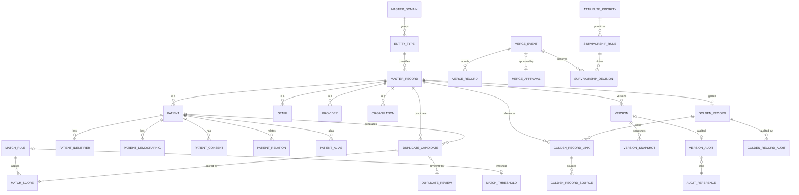

---

## 5. Relationship Catalog

Each relationship is identified, with its source, target, FK, and cardinality.

| ID | From (parent) | To (child) | FK column | Cardinality |
| --- | --- | --- | --- | --- |
| R-01 | `entity_type` | `master_record` | `entity_type_id` | 1 : N |
| R-02 | `master_domain` | `entity_type` | `master_domain_id` | 1 : N |
| R-03 | `master_record` | `patient` | `master_record_id` | 1 : N |
| R-04 | `master_record` | `staff` | `master_record_id` | 1 : N |
| R-05 | `master_record` | `provider` | `master_record_id` | 1 : N |
| R-06 | `master_record` | `organization` | `master_record_id` | 1 : N |
| R-07 | `master_record` | `golden_record` | `master_record_id` | 1 : 1 |
| R-08 | `golden_record` | `golden_record_link` | `golden_record_id` | 1 : N |
| R-09 | `golden_record_link` | `master_record` | `master_record_id` | N : 1 |
| R-10 | `patient` | `patient_identifier` | `patient_id` | 1 : N |
| R-11 | `patient` | `patient_demographic` | `patient_id` | 1 : 1 |
| R-12 | `patient` | `patient_consent` | `patient_id` | 1 : N |
| R-13 | `patient` | `patient_relation` | `patient_id` | 1 : N |
| R-14 | `patient` | `patient_alias` | `patient_id` | 1 : N |
| R-15 | `master_record` | `duplicate_candidate` | `master_record_id` | 1 : N |
| R-16 | `duplicate_candidate` | `match_score` | `duplicate_candidate_id` | 1 : N |
| R-17 | `match_rule` | `match_score` | `match_rule_id` | 1 : N |
| R-18 | `match_rule` | `match_threshold` | `match_rule_id` | 1 : 1 |
| R-19 | `duplicate_candidate` | `duplicate_review` | `duplicate_candidate_id` | 1 : 1 |
| R-20 | `merge_event` | `merge_record` | `merge_event_id` | 1 : N |
| R-21 | `merge_event` | `merge_approval` | `merge_event_id` | 1 : 1 |
| R-22 | `merge_event` | `survivorship_decision` | `merge_event_id` | 1 : N |
| R-23 | `survivorship_rule` | `survivorship_decision` | `survivorship_rule_id` | 1 : N |
| R-24 | `attribute_priority` | `survivorship_rule` | `attribute_priority_id` | 1 : N |
| R-25 | `master_record` | `version` | `master_record_id` | 1 : N |
| R-26 | `version` | `version_snapshot` | `version_id` | 1 : 1 |
| R-27 | `version` | `version_audit` | `version_id` | 1 : 1 |
| R-28 | `version_audit` | `audit_reference` | `audit_reference_id` | N : 1 |
| R-29 | `golden_record` | `golden_record_audit` | `golden_record_id` | 1 : N |
| R-30 | `golden_record_link` | `golden_record_source` | `golden_record_link_id` | 1 : N |
| R-31 | `organization_type` | `organization` | `organization_type_id` | 1 : N |
| R-32 | `organization` | `organization_contact` | `organization_id` | 1 : N |
| R-33 | `organization` | `organization_identifier` | `organization_id` | 1 : N |
| R-34 | `organization` | `organization_relationship` | `organization_id` | 1 : N |
| R-35 | `facility_reference` | `department_reference` | `facility_reference_id` | 1 : N |
| R-36 | `department_reference` | `unit_reference` | `department_reference_id` | 1 : N |
| R-37 | `country` | `region` | `country_id` | 1 : N |
| R-38 | `region` | `city` | `region_id` | 1 : N |
| R-39 | `city` | `postal_code` | `city_id` | 1 : N |
| R-40 | `clinical_code_set` | `clinical_code` | `clinical_code_set_id` | 1 : N |
| R-41 | `clinical_vocabulary` | `terminology_entry` | `clinical_vocabulary_id` | 1 : N |
| R-42 | `clinical_code` | `clinical_mapping` | `source_code_id` | 1 : N |
| R-43 | `clinical_code` | `clinical_mapping` | `target_code_id` | 1 : N |
| R-44 | `identity_type` | `identity_record` | `identity_type_id` | 1 : N |
| R-45 | `identity_issuer` | `identity_record` | `identity_issuer_id` | 1 : N |
| R-46 | `identity_record` | `identity_assignment` | `identity_record_id` | 1 : N |
| R-47 | `contact_type` | `contact` | `contact_type_id` | 1 : N |
| R-48 | `contact_use` | `contact` | `contact_use_id` | 1 : N |
| R-49 | `contact` | `contact_preference` | `contact_id` | 1 : N |
| R-50 | `address_type` | `address` | `address_type_id` | 1 : N |
| R-51 | `address` | `address_validation` | `address_id` | 1 : 1 |
| R-52 | `document_type` | `master_document` | `document_type_id` | 1 : N |
| R-53 | `document_storage` | `master_document` | `document_storage_id` | 1 : N |
| R-54 | `language` | `language_preference` | `language_id` | 1 : N |
| R-55 | `language` | `language_proficiency` | `language_id` | 1 : N |
| R-56 | `lookup_category` | `lookup` | `lookup_category_id` | 1 : N |
| R-57 | `lookup_category` | `lookup_value` | `lookup_category_id` | 1 : N |
| R-58 | `reference_category` | `reference_value` | `reference_category_id` | 1 : N |
| R-59 | `reference_version` | `reference_value` | `reference_version_id` | 1 : N |
| R-60 | `terminology_service` | `terminology_edition` | `terminology_service_id` | 1 : N |
| R-61 | `terminology_edition` | `terminology_entry` | `terminology_edition_id` | 1 : N |
| R-62 | `audit_action` | `audit_reference` | `audit_action_id` | 1 : N |
| R-63 | `audit_actor` | `audit_reference` | `audit_actor_id` | 1 : N |
| R-64 | `import_batch` | `import_staging_row` | `import_batch_id` | 1 : N |
| R-65 | `import_staging_row` | `import_validation` | `import_staging_row_id` | 1 : 1 |
| R-66 | `export_batch` | `export_queue_item` | `export_batch_id` | 1 : N |
| R-67 | `integration_endpoint` | `integration_map` | `integration_endpoint_id` | 1 : N |
| R-68 | `integration_map` | `mapping_field` | `integration_map_id` | 1 : N |
| R-69 | `integration_endpoint` | `export_recipient` | `integration_endpoint_id` | 1 : N |
| R-70 | `master_record` | `cross_reference` | `master_record_id` | 1 : N |
| R-71 | `xref_type` | `cross_reference` | `xref_type_id` | 1 : N |
| R-72 | `cross_reference` | `xref_resolution` | `cross_reference_id` | 1 : 1 |
| R-73 | `metadata_catalog` | `schema_metadata` | `metadata_catalog_id` | 1 : N |
| R-74 | `metadata_catalog` | `data_dictionary` | `metadata_catalog_id` | 1 : N |
| R-75 | `master_domain` | `steward_assignment` | `master_domain_id` | 1 : N |
| R-76 | `staff` | `steward_assignment` | `staff_id` | 1 : N |
| R-77 | `quality_issue` | `remediation_task` | `quality_issue_id` | 1 : N |
| R-78 | `quality_issue` | `stewardship_log` | `quality_issue_id` | 1 : N |

---

## 6. Identifying vs Non-Identifying Relationships

| Type | Rule | Examples |
| --- | --- | --- |
| **Identifying** | Child's identity depends on the parent; child has no independent existence | `patient_demographic` (1:1 with `patient`), `version_snapshot` (1:1 with `version`) |
| **Non-identifying** | Child has its own identity (`id`) and references the parent | `patient` → `master_record`, `match_score` → `duplicate_candidate` |
| **Default** | All relationships are non-identifying unless noted | — |

| Relationship | Type | Rationale |
| --- | --- | --- |
| R-11 patient_demographic | Identifying | Attribute extension of patient |
| R-26 version_snapshot | Identifying | Owns the version's value set |
| R-51 address_validation | Identifying | Attribute extension of address |
| R-65 import_validation | Identifying | Owns the staging row's outcome |
| R-19 duplicate_review | Identifying | Owns the candidate's review |
| All others | Non-identifying | Independent child identity |

---

## 7. Cardinality & Optionality Matrix

| Cardinality | Meaning | Optionality | Examples |
| --- | --- | --- | --- |
| 1 : N | One parent, many children | Parent required | `patient` → `patient_identifier` |
| 1 : 1 | One parent, one child | Parent required, child optional | `patient` → `patient_demographic` |
| 0..1 : N | Parent optional | Parent optional | `address` → `postal_code` |
| N : 1 | Many children, one parent | Child optional | `golden_record_link` → `master_record` |

### Optionality Highlights

| FK column | Table | Optional? | Rationale |
| --- | --- | --- | --- |
| `master_record_id` | `patient`/`staff`/`provider`/`organization` | No | Every master is a master_record |
| `master_record_id` | `golden_record` | Yes (0..1) | Not all records yet golden |
| `postal_code_id` | `address` | Yes | Address may lack a postal reference |
| `actor_id` | audit/version tables | Yes | System-originated changes |
| `related_org_id` | `organization_relationship` | No | Both endpoints required |

---

## 8. ERD by Table Group

The following sections render the ERD per logical group, complementing the full ERD in [§4](#4-full-erd).

---

## 9. Core Master ERD

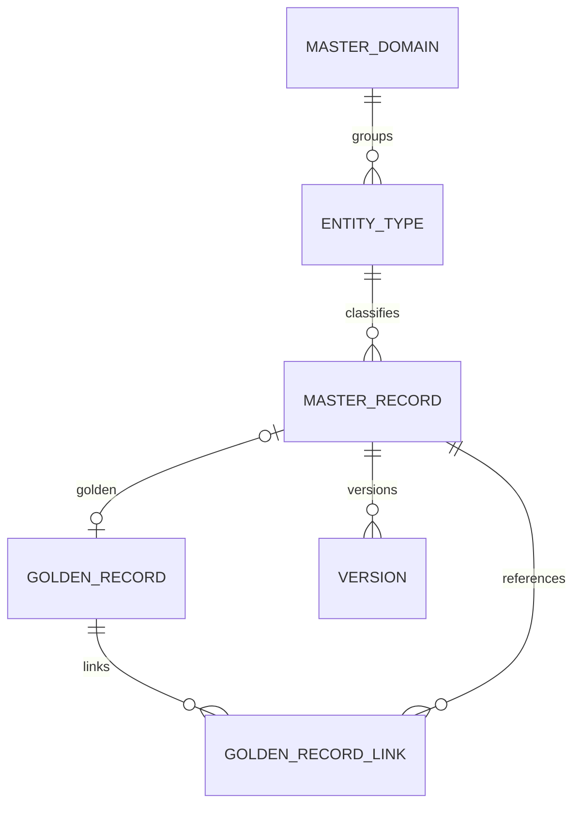

| Relationship | FK | Cardinality | Notes |
| --- | --- | --- | --- |
| master_domain → entity_type | `master_domain_id` | 1:N | Domain groups entity types |
| entity_type → master_record | `entity_type_id` | 1:N | Classifies record subtypes |
| master_record → golden_record | `master_record_id` | 1:0..1 | Optional golden link |
| golden_record → golden_record_link | `golden_record_id` | 1:N | Golden membership |
| golden_record_link → master_record | `master_record_id` | N:1 | Link target |

---

## 10. Patient Master ERD

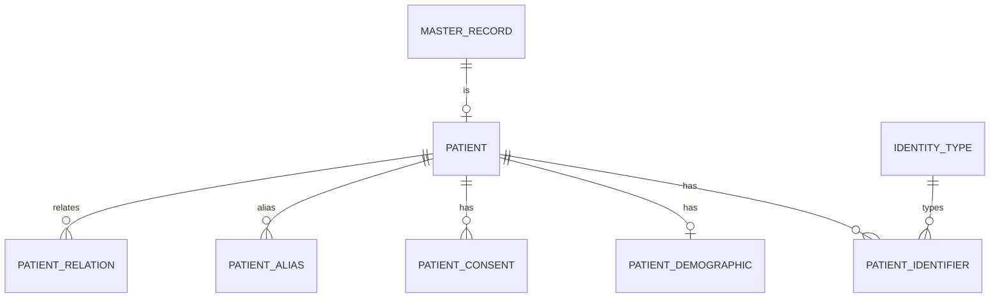

| Relationship | FK | Cardinality | Notes |
| --- | --- | --- | --- |
| master_record → patient | `master_record_id` | 1:N | Patient is a master record |
| patient → patient_identifier | `patient_id` | 1:N | Multiple identifiers |
| patient → patient_demographic | `patient_id` | 1:0..1 | Optional extension |
| patient → patient_consent | `patient_id` | 1:N | Consent records |
| patient → patient_relation | `patient_id` | 1:N | Self-referencing links |
| patient → patient_alias | `patient_id` | 1:N | Alternate names |

---

## 11. Staff & Provider ERD

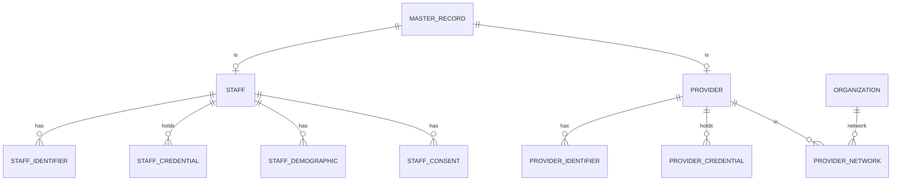

| Relationship | FK | Cardinality | Notes |
| --- | --- | --- | --- |
| master_record → staff | `master_record_id` | 1:N | Staff is a master record |
| staff → staff_credential | `staff_id` | 1:N | Licenses/credentials |
| provider → provider_network | `provider_id` | 1:N | Network membership |
| provider_network → organization | `network_id` | N:1 | Network is an organization |

---

## 12. Organization ERD

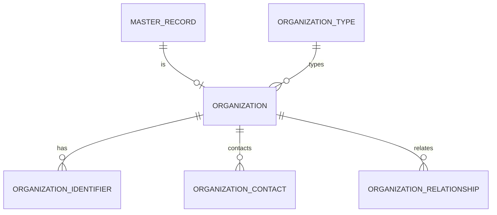

| Relationship | FK | Cardinality | Notes |
| --- | --- | --- | --- |
| organization_type → organization | `organization_type_id` | 1:N | Org classification |
| organization → organization_identifier | `organization_id` | 1:N | Identifiers |
| organization → organization_contact | `organization_id` | 1:N | Contact links |
| organization → organization_relationship | `organization_id` | 1:N | Self-referencing |

---

## 13. Identity, Contact & Address ERD

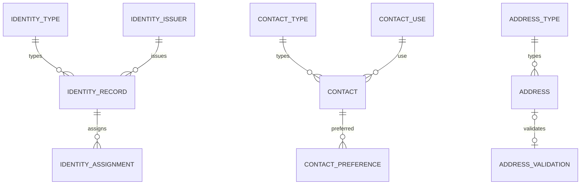

| Relationship | FK | Cardinality | Notes |
| --- | --- | --- | --- |
| identity_type → identity_record | `identity_type_id` | 1:N | Identifier type |
| identity_issuer → identity_record | `identity_issuer_id` | 1:N | Issuing authority |
| identity_record → identity_assignment | `identity_record_id` | 1:N | Assignment history |
| contact → contact_preference | `contact_id` | 1:N | Preferred channel |
| address → address_validation | `address_id` | 1:0..1 | Validation outcome |

---

## 14. Reference, Lookup & Terminology ERD

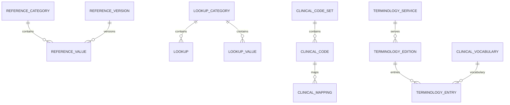

| Relationship | FK | Cardinality | Notes |
| --- | --- | --- | --- |
| reference_category → reference_value | `reference_category_id` | 1:N | Reference group |
| reference_version → reference_value | `reference_version_id` | 1:N | Pinned edition |
| clinical_code_set → clinical_code | `clinical_code_set_id` | 1:N | Code membership |
| clinical_code → clinical_mapping | `source_code_id` | 1:N | Source mapping |
| clinical_code → clinical_mapping | `target_code_id` | 1:N | Target mapping |
| terminology_edition → terminology_entry | `terminology_edition_id` | 1:N | Edition terms |

---

## 15. Deduplication & Golden Record ERD

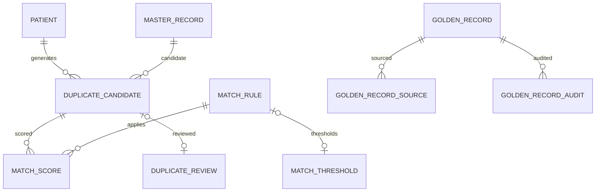

| Relationship | FK | Cardinality | Notes |
| --- | --- | --- | --- |
| duplicate_candidate → match_score | `duplicate_candidate_id` | 1:N | Multiple scores |
| match_rule → match_score | `match_rule_id` | 1:N | One rule, many scores |
| match_rule → match_threshold | `match_rule_id` | 1:0..1 | Optional thresholds |
| duplicate_candidate → duplicate_review | `duplicate_candidate_id` | 1:0..1 | Review when triaged |
| golden_record → golden_record_audit | `golden_record_id` | 1:N | Change audit |

---

## 16. Merge, Survivorship & Stewardship ERD

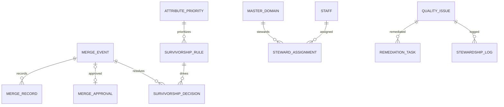

| Relationship | FK | Cardinality | Notes |
| --- | --- | --- | --- |
| merge_event → merge_record | `merge_event_id` | 1:N | Involved records |
| merge_event → merge_approval | `merge_event_id` | 1:0..1 | Approval decision |
| merge_event → survivorship_decision | `merge_event_id` | 1:N | Resolved attributes |
| master_domain → steward_assignment | `master_domain_id` | 1:N | Steward domain |
| quality_issue → remediation_task | `quality_issue_id` | 1:N | Fix tasks |

---

## 17. Import, Export & Integration ERD

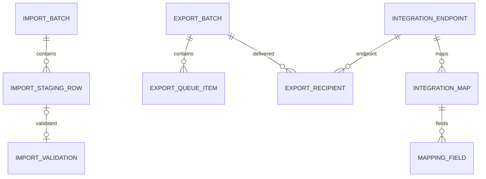

| Relationship | FK | Cardinality | Notes |
| --- | --- | --- | --- |
| import_batch → import_staging_row | `import_batch_id` | 1:N | Batch rows |
| import_staging_row → import_validation | `import_staging_row_id` | 1:0..1 | Validation outcome |
| export_batch → export_queue_item | `export_batch_id` | 1:N | Work items |
| integration_endpoint → integration_map | `integration_endpoint_id` | 1:N | Map config |
| integration_map → mapping_field | `integration_map_id` | 1:N | Field mappings |

---

## 18. Metadata, Version & Audit ERD

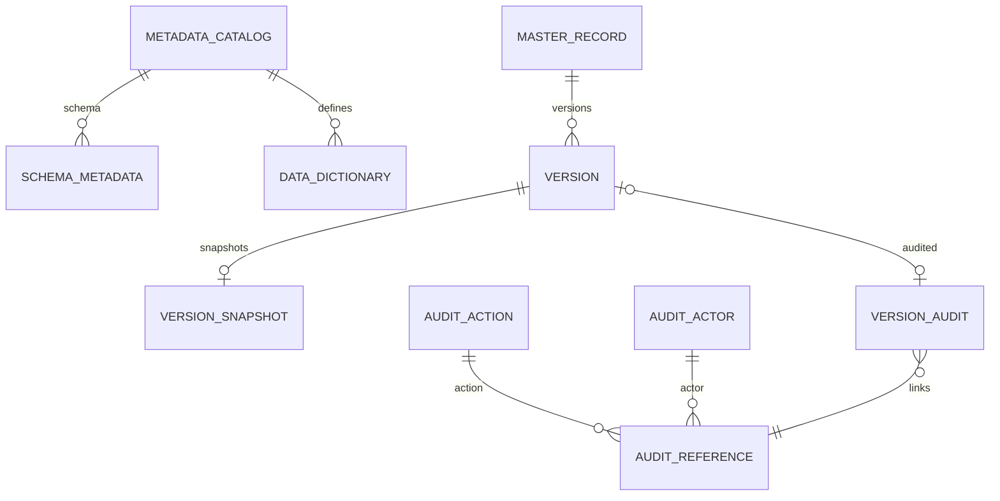

| Relationship | FK | Cardinality | Notes |
| --- | --- | --- | --- |
| metadata_catalog → schema_metadata | `metadata_catalog_id` | 1:N | Column metadata |
| metadata_catalog → data_dictionary | `metadata_catalog_id` | 1:N | Definitions |
| version → version_snapshot | `version_id` | 1:0..1 | Value set |
| version → version_audit | `version_id` | 1:0..1 | Audit link |
| audit_action → audit_reference | `audit_action_id` | 1:N | Action type |

---

## 19. Cross-Module ERD

The master-data module provides identity to other modules and references organizational structure.

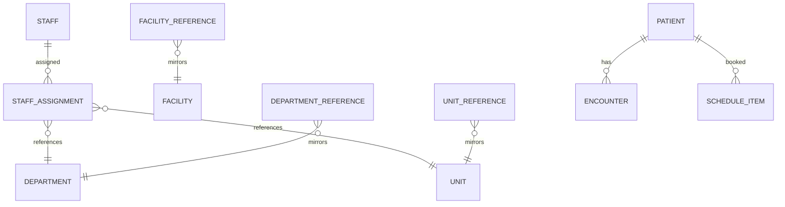

| Cross-module | Platform entity | Nature |
| --- | --- | --- |
| `staff` → `staff_assignment` | Hospital Setup | Provides staff master |
| `staff_assignment` → `department`/`unit` | Hospital Setup | References structure |
| `facility_reference` → `facility` | Hospital Setup | Mirrors facility |
| `patient` → encounter/schedule | Clinical/Scheduling | Provides patient identity |

> Referenced entities (`staff_assignment`, `department`, `unit`, `facility`) are owned by [Hospital Setup](../hospital-setup/README.md).

---

## 20. Relationship Integrity Rules

| Rule | Application |
| --- | --- |
| Tenant consistency | Related rows share the same `tenant_id` ([09-MULTI-TENANCY](../../09-MULTI-TENANCY.md)) |
| RESTRICT on delete | No cascade deletes; deactivation guards references ([02-Workflow](02-Workflow.md) §16) |
| No orphan FKs | Every FK references an existing parent |
| Integrity enforcement | FK constraints back every relationship |
| Audit | Relationship changes audited ([08-AUDIT-LOGGING](../../08-AUDIT-LOGGING.md)) |

---

## 21. Key-based Relationships

| Key type | Role | Examples |
| --- | --- | --- |
| Surrogate PK | Child identity | `id` on every table |
| Foreign key | Parent linkage | `patient_id`, `master_record_id` |
| Candidate key | Natural uniqueness | `identity_type_id + value` |
| Unique constraint | Enforce 1:1 / uniqueness | `uq_golden_record_master` |
| Composite key | Membership uniqueness | `golden_record_link` pair |

---

## 22. Role-Played Relationships

| Table | Role(s) played | FK(s) |
| --- | --- | --- |
| `organization` | Network role via `provider_network.network_id` | `network_id` |
| `patient` | Both sides of `patient_relation` (self, relative) | `patient_id`, `related_patient_id` |
| `organization` | Both sides of `organization_relationship` | `organization_id`, `related_org_id` |
| `master_record` | Source + candidate in `duplicate_candidate` | `master_record_id`, `candidate_record_id` |
| `clinical_code` | Source + target in `clinical_mapping` | `source_code_id`, `target_code_id` |
| `staff` | Steward via `steward_assignment.staff_id` | `staff_id` |

---

## 23. Recursive Relationships

| Table | Nature | FK(s) |
| --- | --- | --- |
| `patient_relation` | Patient ↔ patient (next-of-kin, guarantor) | `patient_id`, `related_patient_id` |
| `organization_relationship` | Organization ↔ organization (parent/subsidiary) | `organization_id`, `related_org_id` |
| `clinical_mapping` | Clinical code ↔ clinical code (cross-standard) | `source_code_id`, `target_code_id` |

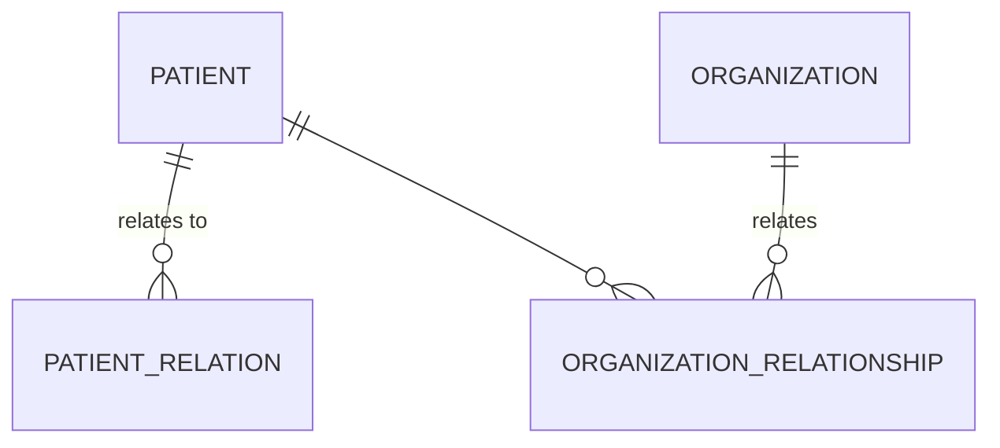

---

## 24. Relationship to Constraints

| Constraint type | Enforces | Example |
| --- | --- | --- |
| `pk_` | Primary identity | `pk_master_record` |
| `fk_` | Referential integrity | `fk_patient_master_record` |
| `uq_` | Uniqueness | `uq_golden_record_master` |
| `ix_` | Query performance | `ix_patient_identifier_value` |

Constraints are named per [04-CODING-STANDARDS](../../04-CODING-STANDARDS.md) §4 and defined in [04-Database-Tables](04-Database-Tables.md).

---

## 25. Read-path Projections & Views

| Projection | Derived from | Purpose |
| --- | --- | --- |
| MPI view | `patient` + identifiers + golden link | Single patient view |
| EPI view | `enterprise_person` + patient/staff | Cross-role person view |
| Search index | patient/staff/org names, identifiers | Fuzzy search ([03-TECHNOLOGY-STACK](../../03-TECHNOLOGY-STACK.md)) |
| Golden record view | golden + survivorship decisions | Authoritative read |
| Reference cache | reference/lookup values | Hot read cache |

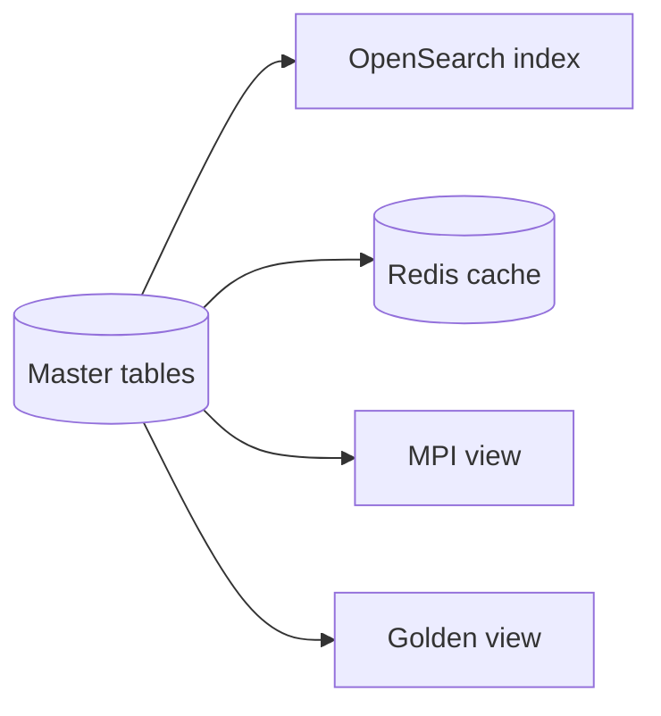

---

## 26. Cross References

| Reference | Relationship | Direction |
| --- | --- | --- |
| [04-Database-Tables](04-Database-Tables.md) | Table definitions | Provides |
| [03-Database](03-Database.md) | Database architecture | Consumes |
| [01-Business-Requirements](01-Business-Requirements.md) | Requirements | Consumes |
| [02-Workflow](02-Workflow.md) | Lifecycle flows | Consumes |
| [00-MASTER-ROADMAP](../../00-MASTER-ROADMAP.md) | Phasing | Consumes |
| [03-TECHNOLOGY-STACK](../../03-TECHNOLOGY-STACK.md) | Search, cache | Consumes |
| [04-CODING-STANDARDS](../../04-CODING-STANDARDS.md) | Constraint naming | Consumes |
| [08-AUDIT-LOGGING](../../08-AUDIT-LOGGING.md) | Audit | Consumes |
| [09-MULTI-TENANCY](../../09-MULTI-TENANCY.md) | Tenant isolation | Consumes |
| [18-INTEROPERABILITY](../../18-INTEROPERABILITY.md) | Integration mapping | Consumes |
| [Hospital Setup](../hospital-setup/README.md) | Staff/facility relationship | Consumes |

---

*End of `docs/modules/master-data/05-Relationships.md`.*
