# Master Data Module — Entity-Relationship Diagram (ERD)

> **Document ID:** `master-data/06-ERD`
> **Owner:** Data / Engineering Lead (master data)
> **Status:** 🔄 Pending approval (Phase 1 gate)
> **Version:** 1.0.0
> **Last updated:** 2026-08-06
> **Review cadence:** Re-reviewed at every phase gate and when the master data model changes.
>
> **Relationship:** This document is the **canonical Entity-Relationship Diagram** of the Master Data Management module. It visualizes, group by group, the entities defined in [04-Database-Tables](04-Database-Tables.md) and the relationships catalogued in [05-Relationships](05-Relationships.md). It introduces **no** new entity, foreign key, cardinality, or relationship beyond those two source documents. It implements the requirements in [01-Business-Requirements](01-Business-Requirements.md) and the lifecycle in [02-Workflow](02-Workflow.md).

---

## Table of Contents

1. [ERD Purpose & Scope](#1-erd-purpose--scope)
2. [ERD Conventions](#2-erd-conventions)
3. [Entity Group Index](#3-entity-group-index)
4. [Complete Enterprise ERD](#4-complete-enterprise-erd)
5. [Core Master ERD](#5-core-master-erd)
6. [Patient Master ERD](#6-patient-master-erd)
7. [Staff & Provider ERD](#7-staff--provider-erd)
8. [Organization ERD](#8-organization-erd)
9. [Identity / Contact / Address ERD](#9-identity--contact--address-erd)
10. [Reference & Lookup ERD](#10-reference--lookup-erd)
11. [Terminology & Code-System ERD](#11-terminology--code-system-erd)
12. [Duplicate Detection ERD](#12-duplicate-detection-erd)
13. [Golden Record ERD](#13-golden-record-erd)
14. [Merge / Unmerge ERD](#14-merge--unmerge-erd)
15. [Survivorship ERD](#15-survivorship-erd)
16. [Data Stewardship ERD](#16-data-stewardship-erd)
17. [Import / Export ERD](#17-import--export-erd)
18. [Integration Mapping ERD](#18-integration-mapping-erd)
19. [Metadata / Versioning ERD](#19-metadata--versioning-erd)
20. [Audit-Related ERD](#20-audit-related-erd)
21. [Cross-Module ERD](#21-cross-module-erd)
22. [Tenant Isolation Relationships](#22-tenant-isolation-relationships)
23. [Relationship Integrity Rules](#23-relationship-integrity-rules)
24. [Read Models / Projections](#24-read-models--projections)
25. [ERD Validation Checklist](#25-erd-validation-checklist)
26. [Cross References](#26-cross-references)

---

## 1. ERD Purpose & Scope

This document specifies the **entity-relationship diagram** of the Master Data Management module: every entity, relationship, cardinality, and key, rendered as Mermaid ER diagrams and documented in tabular form.

**Scope:** relationships among the entities defined in [04-Database-Tables](04-Database-Tables.md) and the relationship catalog in [05-Relationships](05-Relationships.md), including cross-module relationships to [Hospital Setup](../hospital-setup/README.md).

**Source-of-truth rule:** This document is a **projection** of [04-Database-Tables](04-Database-Tables.md) and [05-Relationships](05-Relationships.md). It **does not** introduce new tables, foreign keys, cardinalities, or relationships. Any entity shown here exists in 04; any relationship shown here exists in 05. Ownership boundaries (notably Hospital Setup's facility hierarchy) are preserved and referenced, never duplicated.

**Out of scope:** column-level data types ([04-Database-Tables](04-Database-Tables.md)), storage architecture ([03-Database](03-Database.md)), and domain modeling ([07-Domain-Model](07-Domain-Model.md)).

---

## 2. ERD Conventions

| Convention | Rule |
| --- | --- |
| Notation | Mermaid `erDiagram` (Crow's foot) |
| Entity name | UPPERCASE_SNAKE |
| Cardinality | `\|\|` exactly one · `o\|` zero or one · `\|{` one or many · `o{` zero or many |
| Parent → child | `PARENT \|\|--o{ CHILD` |
| FK naming | `<parent>_id` |
| Tenant scope | All entities carry `tenant_id` ([09-MULTI-TENANCY](../../09-MULTI-TENANCY.md)) |
| R-ID | Relationship ID from [05-Relationships](05-Relationships.md) §5 |
| Legend | 1 = exactly one · 0..1 = optional one · 1..\* = one or more · 0..\* = optional many |

---

## 3. Entity Group Index

All entities are defined in [04-Database-Tables](04-Database-Tables.md) §4. Groups mirror the per-group ERDs in [05-Relationships](05-Relationships.md).

| Group | Entities | Defined in 04 |
| --- | --- | --- |
| Core Master | MASTER_RECORD, GOLDEN_RECORD, ENTERPRISE_PERSON, ENTITY_TYPE, MASTER_DOMAIN, RECORD_STATUS | §5 |
| Patient Master | PATIENT, PATIENT_IDENTIFIER, PATIENT_DEMOGRAPHIC, PATIENT_CONSENT, PATIENT_RELATION, PATIENT_ALIAS | §6 |
| Staff Master | STAFF, STAFF_IDENTIFIER, STAFF_CREDENTIAL, STAFF_DEMOGRAPHIC, STAFF_CONSENT | §7 |
| Provider Master | PROVIDER, PROVIDER_CREDENTIAL, PROVIDER_NETWORK, PROVIDER_IDENTIFIER | §8 |
| Organization | ORGANIZATION, ORGANIZATION_CONTACT, ORGANIZATION_IDENTIFIER, ORGANIZATION_TYPE, ORGANIZATION_RELATIONSHIP | §9 |
| Facility Ref | FACILITY_REFERENCE, DEPARTMENT_REFERENCE, UNIT_REFERENCE | §10 |
| Geographic Ref | COUNTRY, REGION, CITY, POSTAL_CODE | §11 |
| Clinical Ref | CLINICAL_CODE_SET, CLINICAL_CODE, CLINICAL_VOCABULARY, CLINICAL_MAPPING | §12 |
| Identity | IDENTITY_TYPE, IDENTITY_ISSUER, IDENTITY_RECORD, IDENTITY_ASSIGNMENT | §13 |
| Contact/Address | CONTACT, CONTACT_TYPE, CONTACT_USE, CONTACT_PREFERENCE, ADDRESS, ADDRESS_TYPE, ADDRESS_VALIDATION | §14/§15 |
| Document/Language | MASTER_DOCUMENT, DOCUMENT_TYPE, DOCUMENT_STORAGE, LANGUAGE, LANGUAGE_PREFERENCE, LANGUAGE_PROFICIENCY | §16/§17 |
| Lookup | LOOKUP, LOOKUP_CATEGORY, LOOKUP_VALUE, ENUM_DEFINITION | §18 |
| Deduplication | DUPLICATE_CANDIDATE, MATCH_SCORE, MATCH_RULE, MATCH_THRESHOLD, DUPLICATE_REVIEW | §19 |
| Golden Record | GOLDEN_RECORD_LINK, GOLDEN_RECORD_SOURCE, GOLDEN_RECORD_AUDIT | §20 |
| Merge/Survivorship | MERGE_EVENT, MERGE_RECORD, MERGE_APPROVAL, SURVIVORSHIP_RULE, SURVIVORSHIP_DECISION, ATTRIBUTE_PRIORITY | §21/§22 |
| Stewardship | STEWARD_ASSIGNMENT, QUALITY_ISSUE, REMEDIATION_TASK, STEWARDSHIP_LOG | §23 |
| Reference Data | REFERENCE_VALUE, REFERENCE_CATEGORY, REFERENCE_VERSION, CONSENT_TYPE, CREDENTIAL_TYPE, RELATION_TYPE | §24 |
| Terminology | TERMINOLOGY_SERVICE, TERMINOLOGY_EDITION, TERMINOLOGY_ENTRY | §25 |
| Audit Ref | AUDIT_REFERENCE, AUDIT_ACTION, AUDIT_ACTOR, AUDIT_RETENTION | §26 |
| Import/Export | IMPORT_BATCH, IMPORT_STAGING_ROW, IMPORT_VALIDATION, EXPORT_BATCH, EXPORT_QUEUE_ITEM, EXPORT_RECIPIENT | §27/§28 |
| Integration | INTEGRATION_MAP, INTEGRATION_ENDPOINT, MAPPING_FIELD | §29 |
| Cross Ref | CROSS_REFERENCE, XREF_TYPE, XREF_RESOLUTION | §30 |
| Metadata/Version | METADATA_CATALOG, SCHEMA_METADATA, DATA_DICTIONARY, VERSION, VERSION_SNAPSHOT, VERSION_AUDIT | §31/§32 |
| Archival | ARCHIVE_TABLE, ARCHIVE_MANIFEST | §33/§34 |

### Standalone / Independent Entities

These entities are defined in [04-Database-Tables](04-Database-Tables.md) but carry **no** catalogued relationship in [05-Relationships](05-Relationships.md) — they are intentionally standalone (lookup/audit/archival/role-linking), not orphaned:

| Entity | 04 reference | Nature |
| --- | --- | --- |
| `enterprise_person` | §5 | EPI; role-linking conceptual entity (no FK relationship in the 05 catalog) |
| `record_status` | §5 | Controlled status vocabulary |
| `enum_definition` | §18 | Enum value definitions |
| `audit_retention` | §26 | Retention schedule lookup |
| `archive_table` | §33 | Archival governance metadata |
| `archive_manifest` | §34 | Archival manifest |

---

## 4. Complete Enterprise ERD

The canonical relationships among the core, identity, deduplication, golden-record, merge, and versioning entities — all from [05-Relationships](05-Relationships.md) §4.

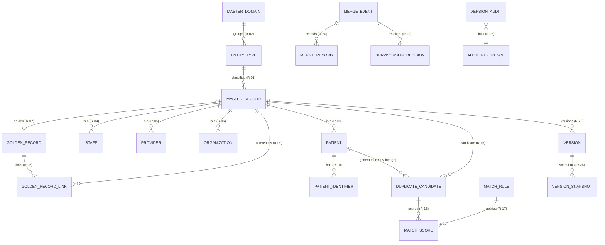

---

## 5. Core Master ERD

Mirrors [05-Relationships](05-Relationships.md) §9.

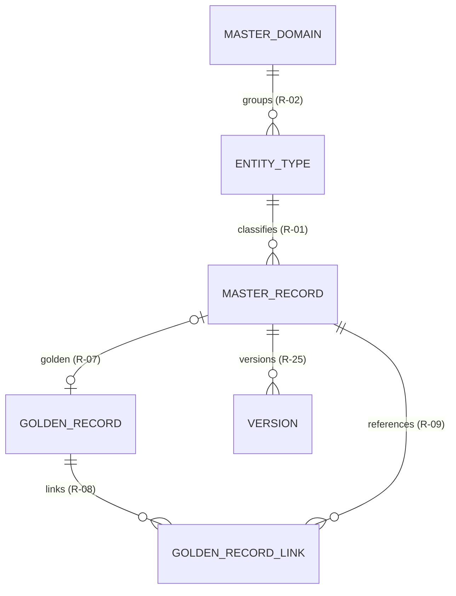

| Relationship | R-ID | FK | Cardinality |
| --- | --- | --- | --- |
| master_domain → entity_type | R-02 | `master_domain_id` | 1 : N |
| entity_type → master_record | R-01 | `entity_type_id` | 1 : N |
| master_record → golden_record | R-07 | `master_record_id` | 1 : 0..1 |
| golden_record → golden_record_link | R-08 | `golden_record_id` | 1 : N |
| golden_record_link → master_record | R-09 | `master_record_id` | N : 1 |
| master_record → version | R-25 | `master_record_id` | 1 : N |

---

## 6. Patient Master ERD

Mirrors [05-Relationships](05-Relationships.md) §10.

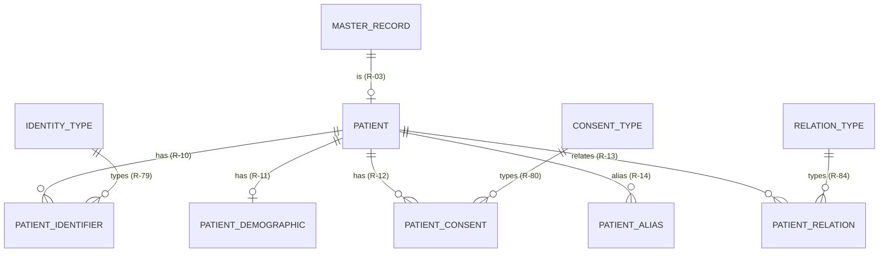

| Relationship | R-ID | FK | Cardinality |
| --- | --- | --- | --- |
| master_record → patient | R-03 | `master_record_id` | 1 : N |
| patient → patient_identifier | R-10 | `patient_id` | 1 : N |
| patient → patient_demographic | R-11 | `patient_id` | 1 : 0..1 |
| patient → patient_consent | R-12 | `patient_id` | 1 : N |
| patient → patient_alias | R-14 | `patient_id` | 1 : N |
| patient → patient_relation | R-13 | `patient_id` | 1 : N |
| identity_type → patient_identifier | R-79 | `identity_type_id` | 1 : N |
| consent_type → patient_consent | R-80 | `consent_type_id` | 1 : N |
| relation_type → patient_relation | R-84 | `relation_type_id` | 1 : N |

---

## 7. Staff & Provider ERD

Mirrors [05-Relationships](05-Relationships.md) §11.

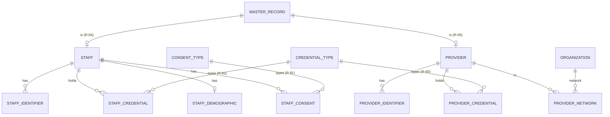

| Relationship | R-ID | FK | Cardinality | Note |
| --- | --- | --- | --- | --- |
| master_record → staff | R-04 | `master_record_id` | 1 : N | |
| master_record → provider | R-05 | `master_record_id` | 1 : N | |
| staff → staff_identifier | — | `staff_id` | 1 : N | Staff master group (04 §7) |
| staff → staff_credential | — | `staff_id` | 1 : N | |
| staff → staff_demographic | — | `staff_id` | 1 : 0..1 | |
| staff → staff_consent | — | `staff_id` | 1 : N | |
| provider → provider_identifier | — | `provider_id` | 1 : N | Provider master group (04 §8) |
| provider → provider_credential | — | `provider_id` | 1 : N | |
| provider → provider_network | — | `provider_id` | 1 : N | |
| organization → provider_network | R-86 | `network_id` | 1 : N | Network is an organization |
| consent_type → staff_consent | R-81 | `consent_type_id` | 1 : N | |
| credential_type → staff_credential | R-82 | `credential_type_id` | 1 : N | |
| credential_type → provider_credential | R-83 | `credential_type_id` | 1 : N | |

> **Note:** Staff/provider subgroup relationships (no R-ID) are defined in [05-Relationships](05-Relationships.md) §11. `provider_network` links to `organization` (network role-played relationship, [05-Relationships](05-Relationships.md) §22).

---

## 8. Organization ERD

Mirrors [05-Relationships](05-Relationships.md) §12.

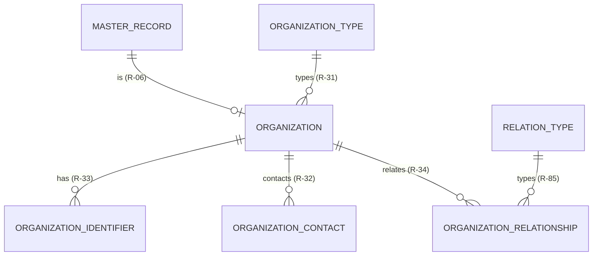

| Relationship | R-ID | FK | Cardinality |
| --- | --- | --- | --- |
| master_record → organization | R-06 | `master_record_id` | 1 : N |
| organization_type → organization | R-31 | `organization_type_id` | 1 : N |
| organization → organization_identifier | R-33 | `organization_id` | 1 : N |
| organization → organization_contact | R-32 | `organization_id` | 1 : N |
| organization → organization_relationship | R-34 | `organization_id` | 1 : N |
| relation_type → organization_relationship | R-85 | `relation_type_id` | 1 : N |

---

## 9. Identity / Contact / Address ERD

Mirrors [05-Relationships](05-Relationships.md) §13.

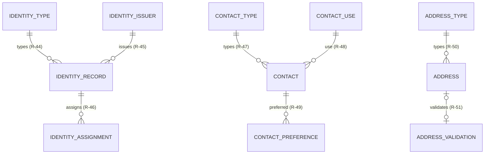

| Relationship | R-ID | FK | Cardinality |
| --- | --- | --- | --- |
| identity_type → identity_record | R-44 | `identity_type_id` | 1 : N |
| identity_issuer → identity_record | R-45 | `identity_issuer_id` | 1 : N |
| identity_record → identity_assignment | R-46 | `identity_record_id` | 1 : N |
| contact_type → contact | R-47 | `contact_type_id` | 1 : N |
| contact_use → contact | R-48 | `contact_use_id` | 1 : N |
| contact → contact_preference | R-49 | `contact_id` | 1 : N |
| address_type → address | R-50 | `address_type_id` | 1 : N |
| address → address_validation | R-51 | `address_id` | 1 : 0..1 |

### Document & Language subgroup

These subgroup relationships are defined in [05-Relationships](05-Relationships.md) §13 (contact/identity group context).

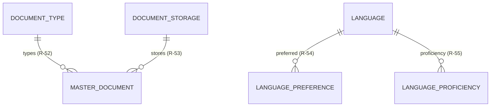

| Relationship | R-ID | FK | Cardinality |
| --- | --- | --- | --- |
| document_type → master_document | R-52 | `document_type_id` | 1 : N |
| document_storage → master_document | R-53 | `document_storage_id` | 1 : N |
| language → language_preference | R-54 | `language_id` | 1 : N |
| language → language_proficiency | R-55 | `language_id` | 1 : N |

---

## 10. Reference & Lookup ERD

Covers enterprise reference data and lookup values ([04-Database-Tables](04-Database-Tables.md) §18/§24; [05-Relationships](05-Relationships.md) §14).

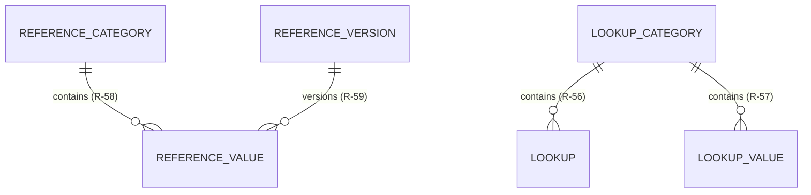

| Relationship | R-ID | FK | Cardinality |
| --- | --- | --- | --- |
| reference_category → reference_value | R-58 | `reference_category_id` | 1 : N |
| reference_version → reference_value | R-59 | `reference_version_id` | 1 : N |
| lookup_category → lookup | R-56 | `lookup_category_id` | 1 : N |
| lookup_category → lookup_value | R-57 | `lookup_category_id` | 1 : N |

### Geographic Reference subgroup

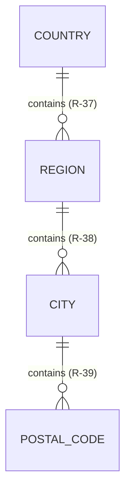

| Relationship | R-ID | FK | Cardinality |
| --- | --- | --- | --- |
| country → region | R-37 | `country_id` | 1 : N |
| region → city | R-38 | `region_id` | 1 : N |
| city → postal_code | R-39 | `city_id` | 1 : N |

### Facility Reference subgroup

These reference-view relationships are defined in [05-Relationships](05-Relationships.md) §10. The chain mirrors, and does not duplicate, Hospital Setup's hierarchy.

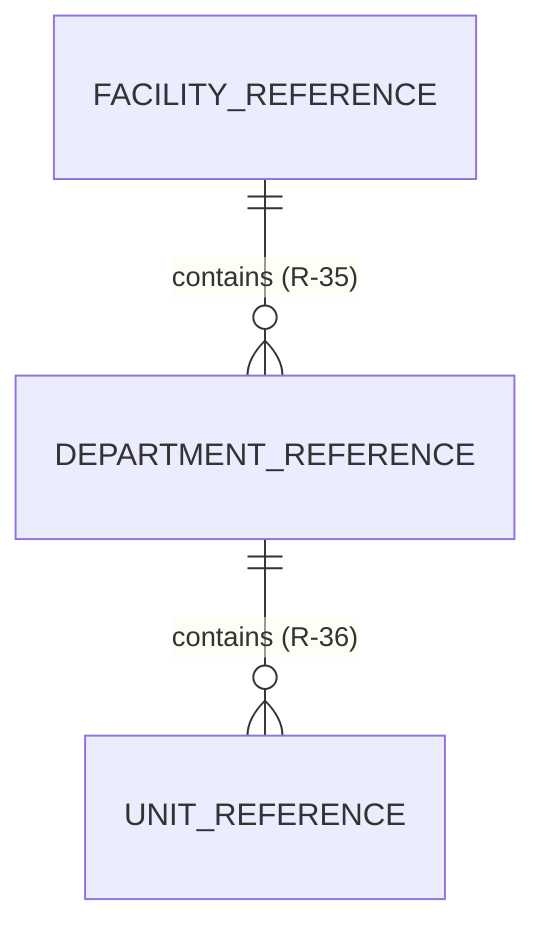

| Relationship | R-ID | FK | Cardinality |
| --- | --- | --- | --- |
| facility_reference → department_reference | R-35 | `facility_reference_id` | 1 : N |
| department_reference → unit_reference | R-36 | `department_reference_id` | 1 : N |

---

## 11. Terminology & Code-System ERD

Mirrors [05-Relationships](05-Relationships.md) §14 (terminology) and §17.

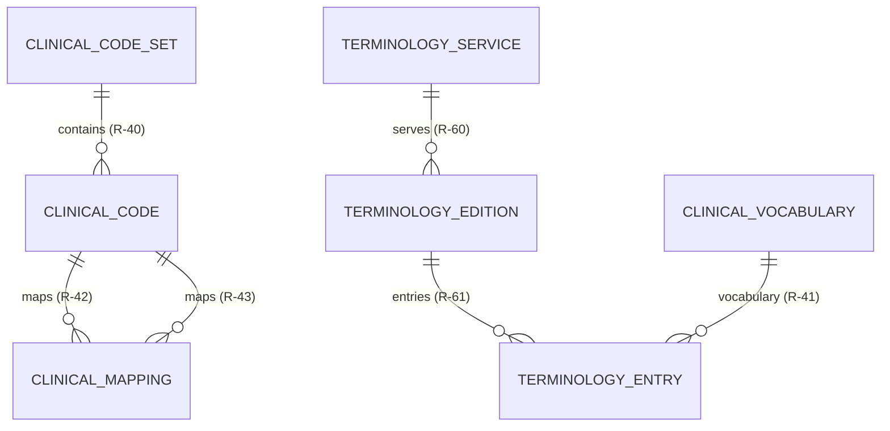

| Relationship | R-ID | FK | Cardinality |
| --- | --- | --- | --- |
| clinical_code_set → clinical_code | R-40 | `clinical_code_set_id` | 1 : N |
| clinical_code → clinical_mapping | R-42 | `source_code_id` | 1 : N |
| clinical_code → clinical_mapping | R-43 | `target_code_id` | 1 : N |
| terminology_service → terminology_edition | R-60 | `terminology_service_id` | 1 : N |
| terminology_edition → terminology_entry | R-61 | `terminology_edition_id` | 1 : N |
| clinical_vocabulary → terminology_entry | R-41 | `clinical_vocabulary_id` | 1 : N |

> **Note:** `clinical_mapping` is a recursive relationship between two `clinical_code` roles (source/target) — [05-Relationships](05-Relationships.md) §23. Clinical code sets and terminology align to [19-CLINICAL-STANDARDS](../../19-CLINICAL-STANDARDS.md).

---

## 12. Duplicate Detection ERD

Mirrors [05-Relationships](05-Relationships.md) §15.

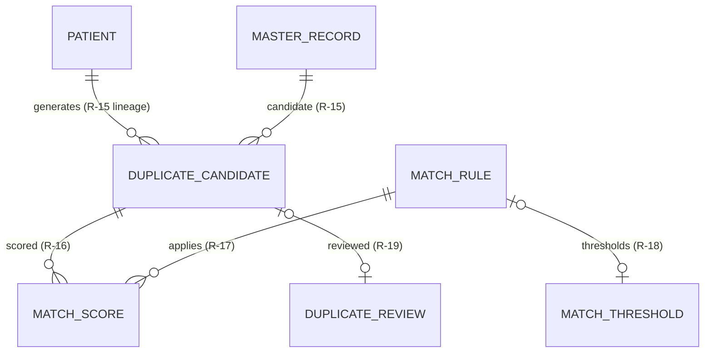

| Relationship | R-ID | FK | Cardinality |
| --- | --- | --- | --- |
| master_record → duplicate_candidate | R-15 | `master_record_id` | 1 : N |
| duplicate_candidate → match_score | R-16 | `duplicate_candidate_id` | 1 : N |
| match_rule → match_score | R-17 | `match_rule_id` | 1 : N |
| match_rule → match_threshold | R-18 | `match_rule_id` | 1 : 0..1 |
| duplicate_candidate → duplicate_review | R-19 | `duplicate_candidate_id` | 1 : 0..1 |

> **Note:** `master_record` plays the source and candidate roles in `duplicate_candidate` — a role-played relationship ([05-Relationships](05-Relationships.md) §22). The `PATIENT`-side edge visualizes the patient lineage of candidates (R-15 lineage).

---

## 13. Golden Record ERD

Mirrors [05-Relationships](05-Relationships.md) §15.

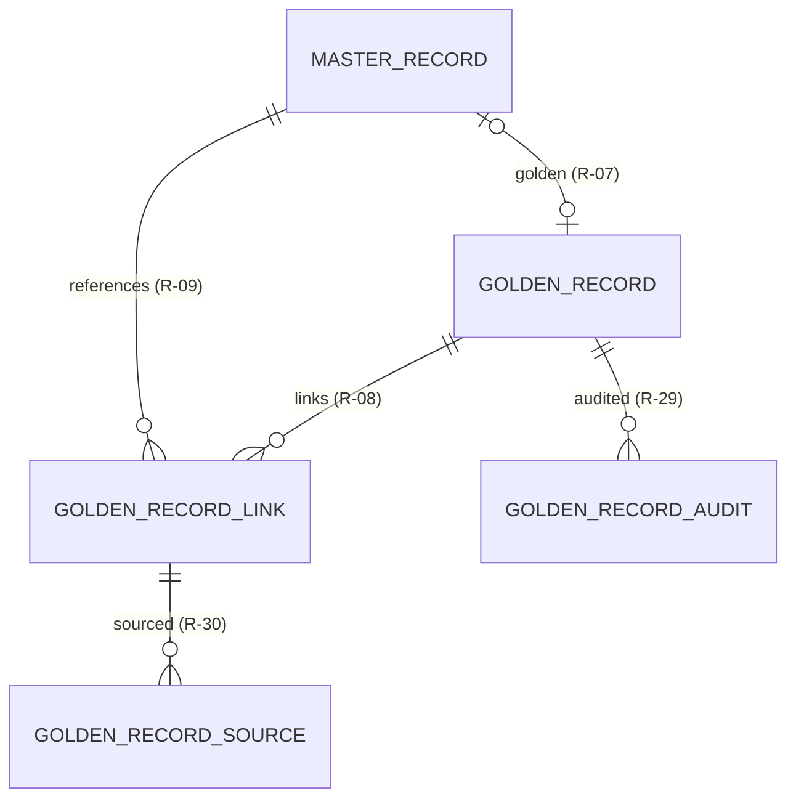

| Relationship | R-ID | FK | Cardinality |
| --- | --- | --- | --- |
| master_record → golden_record | R-07 | `master_record_id` | 1 : 0..1 |
| golden_record → golden_record_link | R-08 | `golden_record_id` | 1 : N |
| golden_record_link → master_record | R-09 | `master_record_id` | N : 1 |
| golden_record_link → golden_record_source | R-30 | `golden_record_link_id` | 1 : N |
| golden_record → golden_record_audit | R-29 | `golden_record_id` | 1 : N |

---

## 14. Merge / Unmerge ERD

Mirrors [05-Relationships](05-Relationships.md) §16.

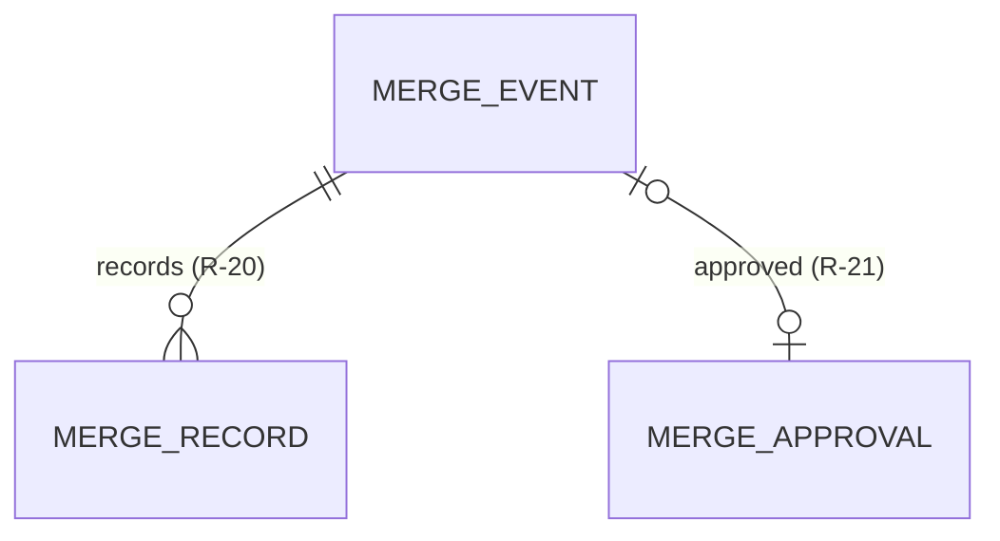

| Relationship | R-ID | FK | Cardinality |
| --- | --- | --- | --- |
| merge_event → merge_record | R-20 | `merge_event_id` | 1 : N |
| merge_event → merge_approval | R-21 | `merge_event_id` | 1 : 0..1 |

> **Note:** Merge and un-merge share the same `merge_event` model ([02-Workflow](02-Workflow.md) §11–§12).

---

## 15. Survivorship ERD

Mirrors [05-Relationships](05-Relationships.md) §16.

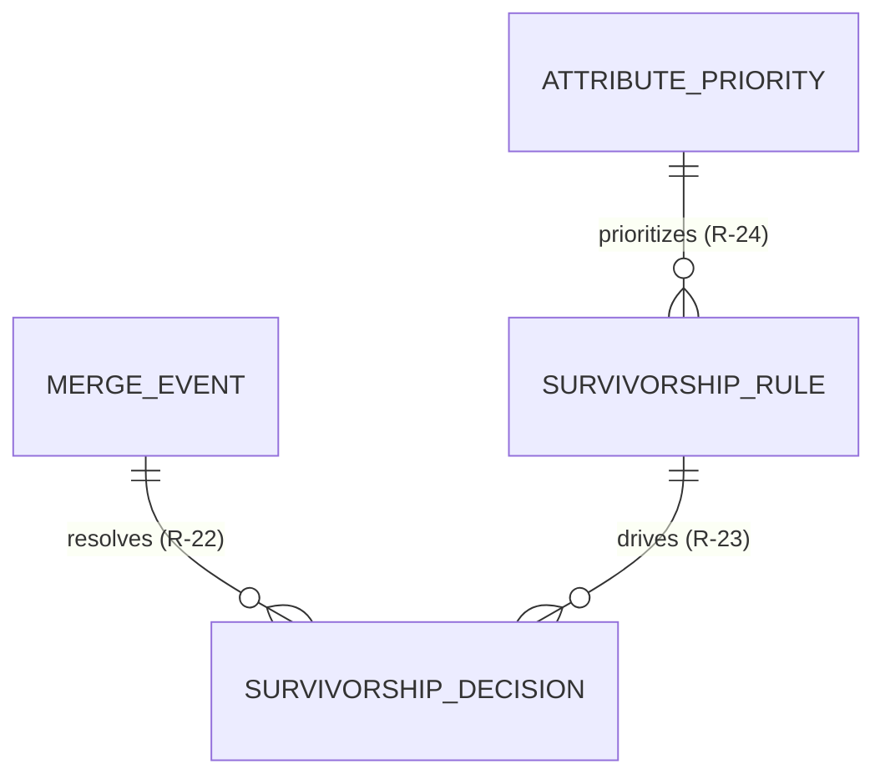

| Relationship | R-ID | FK | Cardinality |
| --- | --- | --- | --- |
| merge_event → survivorship_decision | R-22 | `merge_event_id` | 1 : N |
| survivorship_rule → survivorship_decision | R-23 | `survivorship_rule_id` | 1 : N |
| attribute_priority → survivorship_rule | R-24 | `attribute_priority_id` | 1 : N |

---

## 16. Data Stewardship ERD

Mirrors [05-Relationships](05-Relationships.md) §16.

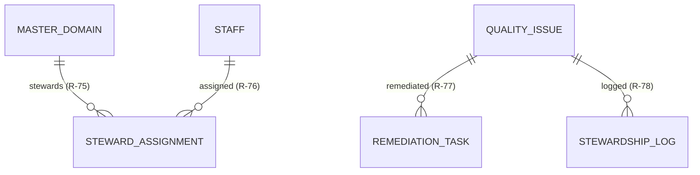

| Relationship | R-ID | FK | Cardinality |
| --- | --- | --- | --- |
| master_domain → steward_assignment | R-75 | `master_domain_id` | 1 : N |
| staff → steward_assignment | R-76 | `staff_id` | 1 : N |
| quality_issue → remediation_task | R-77 | `quality_issue_id` | 1 : N |
| quality_issue → stewardship_log | R-78 | `quality_issue_id` | 1 : N |

---

## 17. Import / Export ERD

Mirrors [05-Relationships](05-Relationships.md) §17.

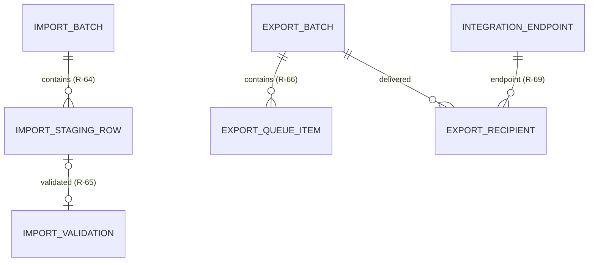

| Relationship | R-ID | FK | Cardinality |
| --- | --- | --- | --- |
| import_batch → import_staging_row | R-64 | `import_batch_id` | 1 : N |
| import_staging_row → import_validation | R-65 | `import_staging_row_id` | 1 : 0..1 |
| export_batch → export_queue_item | R-66 | `export_batch_id` | 1 : N |
| export_batch → export_recipient | — | `export_batch_id` | 1 : N |
| integration_endpoint → export_recipient | R-69 | `integration_endpoint_id` | 1 : N |

> **Note:** `export_batch → export_recipient` (no R-ID) is defined in [05-Relationships](05-Relationships.md) §17.

---

## 18. Integration Mapping ERD

Mirrors [05-Relationships](05-Relationships.md) §17.

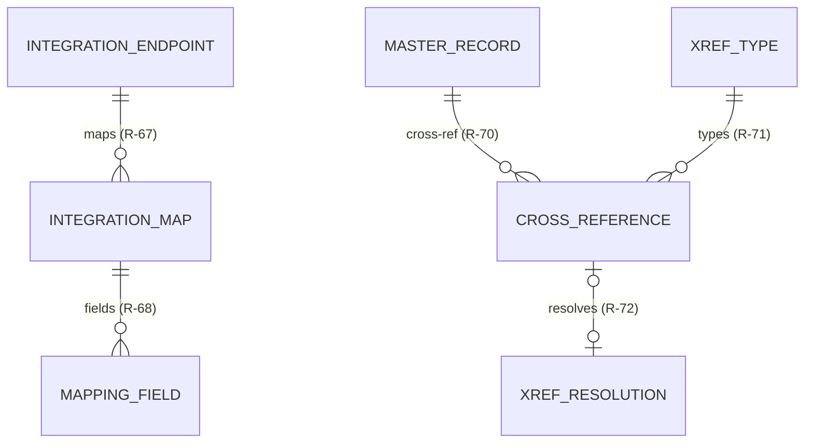

| Relationship | R-ID | FK | Cardinality |
| --- | --- | --- | --- |
| integration_endpoint → integration_map | R-67 | `integration_endpoint_id` | 1 : N |
| integration_map → mapping_field | R-68 | `integration_map_id` | 1 : N |
| master_record → cross_reference | R-70 | `master_record_id` | 1 : N |
| xref_type → cross_reference | R-71 | `xref_type_id` | 1 : N |
| cross_reference → xref_resolution | R-72 | `cross_reference_id` | 1 : 0..1 |

---

## 19. Metadata / Versioning ERD

Mirrors [05-Relationships](05-Relationships.md) §18.

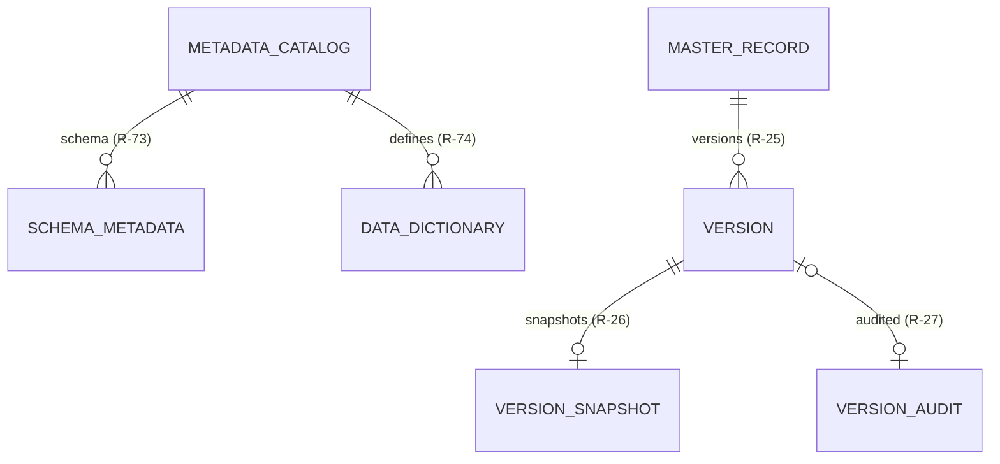

| Relationship | R-ID | FK | Cardinality |
| --- | --- | --- | --- |
| metadata_catalog → schema_metadata | R-73 | `metadata_catalog_id` | 1 : N |
| metadata_catalog → data_dictionary | R-74 | `metadata_catalog_id` | 1 : N |
| master_record → version | R-25 | `master_record_id` | 1 : N |
| version → version_snapshot | R-26 | `version_id` | 1 : 0..1 |
| version → version_audit | R-27 | `version_id` | 1 : 0..1 |

---

## 20. Audit-Related ERD

Mirrors [05-Relationships](05-Relationships.md) §18.

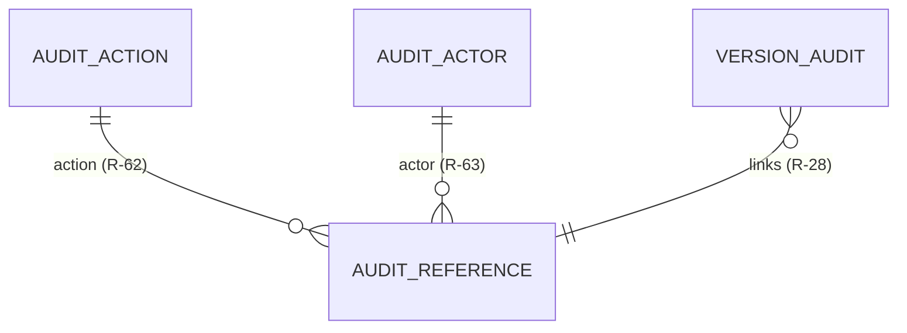

| Relationship | R-ID | FK | Cardinality |
| --- | --- | --- | --- |
| audit_action → audit_reference | R-62 | `audit_action_id` | 1 : N |
| audit_actor → audit_reference | R-63 | `audit_actor_id` | 1 : N |
| version_audit → audit_reference | R-28 | `audit_reference_id` | N : 1 |

> **Note:** `audit_retention` is a standalone lookup (no relationship) — [03-Database](03-Database.md) §22. Audit follows [08-AUDIT-LOGGING](../../08-AUDIT-LOGGING.md).

---

## 21. Cross-Module ERD

The master-data module provides identity to other modules and references — never duplicates — Hospital Setup's facility hierarchy. Mirrors [05-Relationships](05-Relationships.md) §19.

```mermaid
erDiagram
    STAFF ||--o{ STAFF_ASSIGNMENT : "assigned"
    STAFF_ASSIGNMENT }o--|| DEPARTMENT : "references"
    STAFF_ASSIGNMENT }o--|| UNIT : "references"
    FACILITY_REFERENCE }o--|| FACILITY : "mirrors"
    DEPARTMENT_REFERENCE }o--|| DEPARTMENT : "mirrors"
    UNIT_REFERENCE }o--|| UNIT : "mirrors"
    PATIENT ||--o{ ENCOUNTER : "has"
    PATIENT ||--o{ SCHEDULE_ITEM : "booked"
```

| Cross-module | Platform entity | Ownership | Nature |
| --- | --- | --- | --- |
| `staff` → `staff_assignment` | Hospital Setup | Hospital Setup | Provides staff master |
| `staff_assignment` → `department`/`unit` | Hospital Setup | Hospital Setup | References structure |
| `facility_reference` → `facility` | Hospital Setup | Hospital Setup | Mirrors facility |
| `department_reference` → `department` | Hospital Setup | Hospital Setup | Mirrors department |
| `unit_reference` → `unit` | Hospital Setup | Hospital Setup | Mirrors unit |
| `patient` → `encounter` | Clinical | Clinical | Provides patient identity |
| `patient` → `schedule_item` | Scheduling | Scheduling | Provides patient identity |

> **Ownership boundary:** The facility hierarchy (`facility` → `location` → `department` → `unit`) is owned exclusively by [Hospital Setup](../hospital-setup/README.md). The master-data module references it via reference views; it does **not** own or duplicate it ([05-Relationships](05-Relationships.md) §19).

---

## 22. Tenant Isolation Relationships

All master-data entities are tenant-scoped ([09-MULTI-TENANCY](../../09-MULTI-TENANCY.md), [03-Database](03-Database.md) §9).

| Rule | Application |
| --- | --- |
| `tenant_id` on all tables | Present on every tenant-scoped table (04) |
| RLS isolation | Row-level security keyed on tenant |
| Cross-tenant block | Blocked at the data layer |
| Referential tenant consistency | Related rows share the same `tenant_id` |
| Single-facility first | Multi-facility-ready model |

```mermaid
flowchart LR
    T1[Tenant A] --> RLS[(Data layer RLS)]
    T2[Tenant B] --> RLS
    RLS --> PG[(PostgreSQL)]
```

---

## 23. Relationship Integrity Rules

| Rule | Application | Source |
| --- | --- | --- |
| FK constraints | Enforce parent-child relationships | [05-Relationships](05-Relationships.md) §20 |
| RESTRICT on delete | No cascade deletes; deactivation guards references | [02-Workflow](02-Workflow.md) §16 |
| No orphan FK | Every FK references an existing parent | [05-Relationships](05-Relationships.md) §20 |
| Tenant consistency | Related rows share `tenant_id` | §22 above |
| No silent data loss | Merge/unmerge reversible and audited | [02-Workflow](02-Workflow.md) §11–§12 |
| Audit | Relationship changes audited | [08-AUDIT-LOGGING](../../08-AUDIT-LOGGING.md) |

---

## 24. Read Models / Projections

| Projection | Derived from | Purpose |
| --- | --- | --- |
| MPI view | `patient` + identifiers + golden link | Single patient view ([01-Business-Requirements](01-Business-Requirements.md) §13) |
| EPI view | `enterprise_person` + patient/staff | Cross-role person view (BRS §14) |
| Search index | patient/staff/org names, identifiers | Fuzzy search ([03-TECHNOLOGY-STACK](../../03-TECHNOLOGY-STACK.md)) |
| Golden record view | golden + survivorship decisions | Authoritative read (BRS §15) |
| Reference cache | reference/lookup values | Hot read cache |

```mermaid
flowchart LR
    MASTER[(Master tables)] --> SEARCH[OpenSearch index]
    MASTER --> CACHE[(Redis cache)]
    MASTER --> MPI[MPI view]
    MASTER --> GOLDEN[Golden view]
```

> **Note:** Projections are read models over the canonical tables; the canonical store remains the source of truth ([05-DATABASE-ARCHITECTURE](../../05-DATABASE-ARCHITECTURE.md) §3).

---

## 25. ERD Validation Checklist

This document is a **projection** of [04-Database-Tables](04-Database-Tables.md) and [05-Relationships](05-Relationships.md). The following confirms internal consistency:

| Check | Status | Evidence |
| --- | --- | --- |
| No orphan entities | ✅ | Every entity shown exists in [04-Database-Tables](04-Database-Tables.md) §4; standalone entities are explicitly listed in [§3](#3-entity-group-index) |
| No orphan relationships | ✅ | Every relationship shown exists in [05-Relationships](05-Relationships.md) §5/§9–§18; R-IDs cited |
| No undocumented FK | ✅ | All FKs appear in 04 table definitions and 05 catalog |
| No cardinality mismatch | ✅ | Cardinalities match 05 §5; 1:N, 1:0..1, N:1 as catalogued |
| No tenant-scope mismatch | ✅ | All entities tenant-scoped per 04 and [09-MULTI-TENANCY](../../09-MULTI-TENANCY.md) |
| No invented entity/FK/relationship | ✅ | None introduced beyond 04/05 |
| Ownership preserved | ✅ | Hospital Setup facility hierarchy referenced, not duplicated |

---

## 26. Cross References

| Reference | Relationship | Direction |
| --- | --- | --- |
| [04-Database-Tables](04-Database-Tables.md) | Canonical table inventory | Consumes |
| [05-Relationships](05-Relationships.md) | Canonical relationship catalog | Consumes |
| [03-Database](03-Database.md) | Database architecture | Consumes |
| [01-Business-Requirements](01-Business-Requirements.md) | Requirements | Consumes |
| [02-Workflow](02-Workflow.md) | Lifecycle flows | Consumes |
| [07-Domain-Model](07-Domain-Model.md) | Domain model | Provides |
| [00-MASTER-ROADMAP](../../00-MASTER-ROADMAP.md) | Phasing | Consumes |
| [03-TECHNOLOGY-STACK](../../03-TECHNOLOGY-STACK.md) | Search, cache | Consumes |
| [08-AUDIT-LOGGING](../../08-AUDIT-LOGGING.md) | Audit | Consumes |
| [09-MULTI-TENANCY](../../09-MULTI-TENANCY.md) | Tenant isolation | Consumes |
| [18-INTEROPERABILITY](../../18-INTEROPERABILITY.md) | Integration mapping | Consumes |
| [19-CLINICAL-STANDARDS](../../19-CLINICAL-STANDARDS.md) | Terminology, code sets | Consumes |
| [Hospital Setup](../hospital-setup/README.md) | Staff/facility relationship | Consumes |

---

*End of `docs/modules/master-data/06-ERD.md`.*
