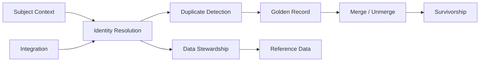
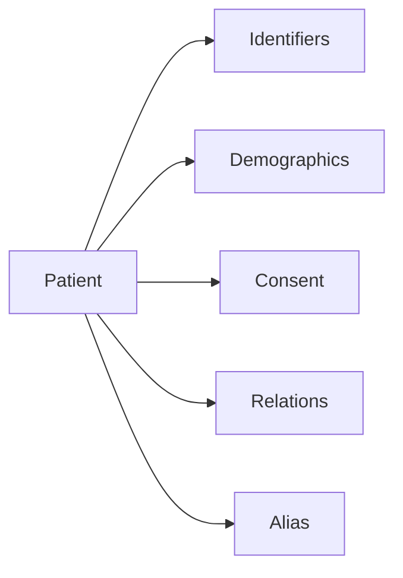
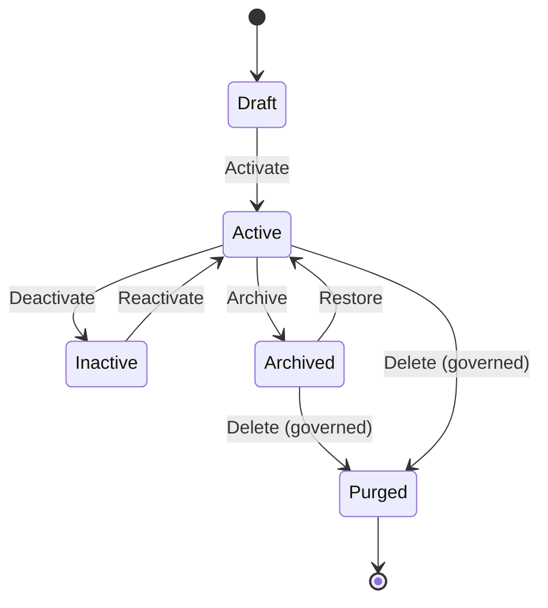
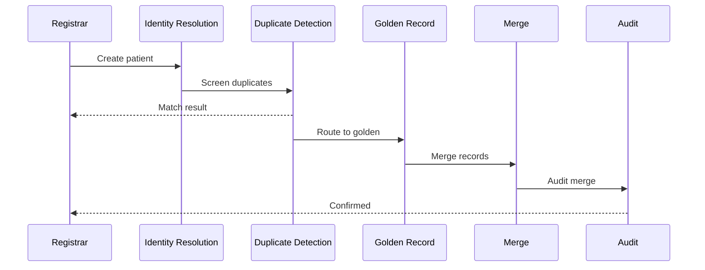

# Master Data Module — Domain Model

> **Document ID:** `master-data/07-Domain-Model`
> **Owner:** Architecture / Engineering Lead (data)
> **Status:** 🔄 Pending approval (Phase 1 gate)
> **Version:** 1.0.0
> **Last updated:** 2026-08-06
> **Review cadence:** Re-reviewed at every phase gate and when the master data model changes.
>
> **Relationship:** This document models the **business domains and domain objects** of the Master Data Management module. It is grounded exclusively in the entities in [04-Database-Tables](04-Database-Tables.md), the relationships in [05-Relationships](05-Relationships.md), the lifecycle in [02-Workflow](02-Workflow.md), and the requirements in [01-Business-Requirements](01-Business-Requirements.md). It introduces no domain concept not supported by those documents.

---

## Table of Contents

1. [Domain Model Overview](#1-domain-model-overview)
2. [Domain Boundaries](#2-domain-boundaries)
3. [Bounded Contexts](#3-bounded-contexts)
4. [Aggregate Roots](#4-aggregate-roots)
5. [Entities](#5-entities)
6. [Value Objects](#6-value-objects)
7. [Domain Services](#7-domain-services)
8. [Domain Events](#8-domain-events)
9. [Commands](#9-commands)
10. [Queries](#10-queries)
11. [Policies](#11-policies)
12. [Business Invariants](#12-business-invariants)
13. [Patient Domain](#13-patient-domain)
14. [Staff Domain](#14-staff-domain)
15. [Provider Domain](#15-provider-domain)
16. [Organization Domain](#16-organization-domain)
17. [Reference Data Domain](#17-reference-data-domain)
18. [Identity Resolution Domain](#18-identity-resolution-domain)
19. [Duplicate Detection Domain](#19-duplicate-detection-domain)
20. [Golden Record Domain](#20-golden-record-domain)
21. [Merge / Unmerge Domain](#21-merge--unmerge-domain)
22. [Survivorship Domain](#22-survivorship-domain)
23. [Data Stewardship Domain](#23-data-stewardship-domain)
24. [Integration Domain](#24-integration-domain)
25. [State Transitions](#25-state-transitions)
26. [Domain Interaction Diagram](#26-domain-interaction-diagram)
27. [Cross-Module Domain Boundaries](#27-cross-module-domain-boundaries)
28. [Cross References](#28-cross-references)

---

## 1. Domain Model Overview

This document describes the **domain model** of the Master Data Management module — the business objects, their responsibilities, behaviors, and the rules governing them. The domain is organized into bounded contexts, each owning a coherent set of entities from the canonical schema.

The domain model is a **logical** view. It maps to — but does not duplicate — the physical tables in [04-Database-Tables](04-Database-Tables.md).

---

## 2. Domain Boundaries

| Domain | Owns | Does not own |
| --- | --- | --- |
| Patient | Patient identity, identifiers, demographics, consent, relations, aliases | Clinical encounters, scheduling ([06-ERD](06-ERD.md) §21) |
| Staff | Staff identity, credentials, demographics, consent | Facility staffing (Hospital Setup) |
| Provider | Provider identity, credentials, networks | — |
| Organization | Organization identity, types, relationships | Facility hierarchy (Hospital Setup) |
| Reference Data | Reference values, lookups, geographic, terminology | — |
| Identity Resolution | MPI/EPI, identifiers, cross-reference | — |
| Duplicate Detection | Candidates, match scores, rules, thresholds, review | — |
| Golden Record | Golden record, links, sources, audit | — |
| Merge/Unmerge | Merge events, records, approvals | — |
| Survivorship | Survivorship rules, decisions, attribute priority | — |
| Data Stewardship | Stewards, quality issues, remediation | — |
| Integration | Integration maps, endpoints, cross-references | — |

---

## 3. Bounded Contexts

| Bounded Context | Responsibility |
| --- | --- |
| Subject | Patient, staff, provider, organization master records |
| Identity Resolution | Assign identifiers, MPI/EPI |
| Duplicate Detection | Find and triage duplicates |
| Golden Record | Maintain the canonical record |
| Merge/Unmerge | Consolidate or separate records |
| Survivorship | Resolve conflicting attributes |
| Data Stewardship | Quality and remediation |
| Reference Data | Controlled vocabularies |
| Integration | External mappings and cross-references |

---

## 4. Aggregate Roots

An aggregate root is the consistency boundary for a set of entities.

| Aggregate Root | Members | Invariant |
| --- | --- | --- |
| `MasterRecord` | master_record, golden_record, version, cross_reference | One canonical identity per record |
| `Patient` | patient, patient_identifier, patient_demographic, patient_consent, patient_relation, patient_alias | Patient identity is consistent |
| `Staff` | staff, staff_identifier, staff_credential, staff_demographic, staff_consent | Staff identity is consistent |
| `Provider` | provider, provider_credential, provider_network, provider_identifier | Provider identity is consistent |
| `Organization` | organization, organization_identifier, organization_contact, organization_relationship | Org identity is consistent |
| `DuplicateCandidate` | duplicate_candidate, match_score, duplicate_review | A candidate is scored and reviewed |
| `GoldenRecord` | golden_record, golden_record_link, golden_record_source, golden_record_audit | Golden record is authoritative |
| `MergeEvent` | merge_event, merge_record, merge_approval, survivorship_decision | Merge is approved and audited |

---

## 5. Entities

Entities have identity and lifecycle. Each maps to a table in [04-Database-Tables](04-Database-Tables.md).

| Entity | Table | Aggregate | Notes |
| --- | --- | --- | --- |
| MasterRecord | `master_record` | MasterRecord | Supertype |
| GoldenRecord | `golden_record` | GoldenRecord | Canonical record |
| Patient | `patient` | Patient | |
| Staff | `staff` | Staff | |
| Provider | `provider` | Provider | |
| Organization | `organization` | Organization | |
| DuplicateCandidate | `duplicate_candidate` | DuplicateCandidate | |
| MergeEvent | `merge_event` | MergeEvent | |

> The full entity inventory (106 tables) is defined in [04-Database-Tables](04-Database-Tables.md) §4; this section names the domain-level entities.

---

## 6. Value Objects

Value objects have no identity and are defined by their attributes.

| Value Object | Backing | Source |
| --- | --- | --- |
| Identifier | `identity_type_id` + value | [04-Database-Tables](04-Database-Tables.md) §13 |
| Address | `address` attributes | §15 |
| Contact | `contact` attributes | §14 |
| Demographic | `*_demographic` attributes | §6/§7 |
| MatchScore | `match_score` value | §19 |
| SurvivorshipDecision | `survivorship_decision` | §22 |
| Consent | `*_consent` attributes | §6/§7 |

---

## 7. Domain Services

Domain services execute operations that do not naturally belong to a single entity.

| Service | Responsibility | Source |
| --- | --- | --- |
| `DuplicateDetectionService` | Score and triage candidates | [02-Workflow](02-Workflow.md) §9 |
| `GoldenRecordService` | Select and maintain golden records | §10 |
| `MergeService` | Execute merge/unmerge | §11/§12 |
| `SurvivorshipService` | Resolve attribute conflicts | §15 (BRS) |
| `IdentityResolutionService` | Assign identifiers, MPI/EPI | BRS §13–§14 |
| `StewardshipService` | Quality and remediation | BRS §23 |
| `ApprovalService` | Route and record approvals | [02-Workflow](02-Workflow.md) §7 |

---

## 8. Domain Events

Events capture state changes for audit and integration ([08-AUDIT-LOGGING](../../08-AUDIT-LOGGING.md), [02-SYSTEM-ARCHITECTURE](../../02-SYSTEM-ARCHITECTURE.md) §12).

| Event | Trigger | Consumers |
| --- | --- | --- |
| `MasterRecordCreated` | Create | Audit, integration |
| `MasterRecordUpdated` | Update | Audit, version |
| `DuplicateDetected` | Detection | Review queue, notifications |
| `DuplicateResolved` | Review | Golden record |
| `GoldenRecordEstablished` | Selection | Consumers |
| `RecordsMerged` | Merge | Audit, consumers |
| `RecordsUnmerged` | Unmerge | Audit, consumers |
| `StewardshipActionTaken` | Remediation | Audit |
| `MasterRecordArchived` | Archive | Audit, storage |

---

## 9. Commands

| Command | Performer | Outcome |
| --- | --- | --- |
| `CreatePatient` | Registrar | Patient created |
| `UpdateMasterRecord` | Authorized user | Record updated + versioned |
| `ScreenDuplicate` | System | Candidate + scores |
| `ReviewDuplicate` | Steward | Resolve or dismiss |
| `EstablishGolden` | Steward | Golden record selected |
| `MergeRecords` | Steward (approved) | Records consolidated |
| `UnmergeRecords` | Steward (approved) | Records separated |
| `ArchiveRecord` | System/steward | Record archived |
| `ApplySurvivorship` | System | Conflicts resolved |

---

## 10. Queries

| Query | Returns | Source |
| --- | --- | --- |
| Find patient by identifier | Patient + golden link | MPI view (§24) |
| Search master records | Matches with scores | Duplicate search |
| Get golden record | Authoritative record | Golden view |
| Get version history | Version snapshots | Version tables |
| List duplicates for review | Candidate queue | Duplicate tables |
| Get merge history | Merge events | Merge tables |

---

## 11. Policies

Policies are rules enforced at the domain layer.

| Policy | Rule | Source |
| --- | --- | --- |
| Single active primary | One active primary assignment | [07-ROLES-PERMISSIONS](../../07-ROLES-PERMISSIONS.md) |
| No deactivate-with-children | Block deactivation with active children | [02-Workflow](02-Workflow.md) §16 |
| Separation of duties | Requester ≠ approver | [07-ROLES-PERMISSIONS](../../07-ROLES-PERMISSIONS.md) §8 |
| Tenant scoping | Access within tenant scope | [09-MULTI-TENANCY](../../09-MULTI-TENANCY.md) |
| Consent | Sensitive access gated by consent | [17-DATA-GOVERNANCE](../../17-DATA-GOVERNANCE.md) §15 |

---

## 12. Business Invariants

| Invariant | Applies to |
| --- | --- |
| Unique identifier per type+value within tenant | identity, identifiers |
| Exactly one active primary assignment per staff | staff assignment (Hospital Setup) |
| Deactivation guarded while referenced | all master records |
| No hard delete of data-bearing records | all master records |
| Golden record references source records | golden record |
| Merge/unmerge fully reversible and audited | merge |

---

## 13. Patient Domain

| Entity | Backing table | Lifecycle |
| --- | --- | --- |
| Patient | `patient` | draft → active → inactive → archived |
| PatientIdentifier | `patient_identifier` | active → inactive |
| PatientDemographic | `patient_demographic` | active → inactive |
| PatientConsent | `patient_consent` | active → revoked |
| PatientRelation | `patient_relation` | active → inactive |
| PatientAlias | `patient_alias` | active → inactive |

---

## 14. Staff Domain

| Entity | Backing table | Lifecycle |
| --- | --- | --- |
| Staff | `staff` | draft → active → inactive |
| StaffIdentifier | `staff_identifier` | active → inactive |
| StaffCredential | `staff_credential` | active → expired → inactive |
| StaffDemographic | `staff_demographic` | active → inactive |
| StaffConsent | `staff_consent` | active → revoked |

---

## 15. Provider Domain

| Entity | Backing table | Lifecycle |
| --- | --- | --- |
| Provider | `provider` | active → inactive |
| ProviderCredential | `provider_credential` | active → expired → inactive |
| ProviderNetwork | `provider_network` | active → inactive |
| ProviderIdentifier | `provider_identifier` | active → inactive |

---

## 16. Organization Domain

| Entity | Backing table | Lifecycle |
| --- | --- | --- |
| Organization | `organization` | active → inactive |
| OrganizationIdentifier | `organization_identifier` | active → inactive |
| OrganizationContact | `organization_contact` | active → inactive |
| OrganizationRelationship | `organization_relationship` | active → inactive |
| OrganizationType | `organization_type` | active → inactive |

---

## 17. Reference Data Domain

| Entity | Backing table | Lifecycle |
| --- | --- | --- |
| ReferenceValue | `reference_value` | active → inactive |
| ReferenceCategory | `reference_category` | active → inactive |
| ReferenceVersion | `reference_version` | active → archived |
| LookupValue | `lookup_value` | active → inactive |
| Lookup | `lookup` | active → inactive |
| Country / Region / City / PostalCode | geographic tables | active → inactive |

---

## 18. Identity Resolution Domain

| Entity | Backing table | Lifecycle |
| --- | --- | --- |
| IdentityRecord | `identity_record` | active → inactive |
| IdentityType | `identity_type` | active → inactive |
| IdentityIssuer | `identity_issuer` | active → inactive |
| IdentityAssignment | `identity_assignment` | append-only |
| CrossReference | `cross_reference` | active → inactive |
| EnterprisePerson (EPI) | `enterprise_person` | active → inactive |

> EPI links person identities across roles; represented as a conceptual entity ([06-ERD](06-ERD.md) §3).

---

## 19. Duplicate Detection Domain

| Entity | Backing table | Lifecycle |
| --- | --- | --- |
| DuplicateCandidate | `duplicate_candidate` | open → reviewed → resolved |
| MatchScore | `match_score` | append-only |
| MatchRule | `match_rule` | active → inactive |
| MatchThreshold | `match_threshold` | active → inactive |
| DuplicateReview | `duplicate_review` | append-only |

---

## 20. Golden Record Domain

| Entity | Backing table | Lifecycle |
| --- | --- | --- |
| GoldenRecord | `golden_record` | active → inactive → archived |
| GoldenRecordLink | `golden_record_link` | active → inactive |
| GoldenRecordSource | `golden_record_source` | active → inactive |
| GoldenRecordAudit | `golden_record_audit` | append-only |

---

## 21. Merge / Unmerge Domain

| Entity | Backing table | Lifecycle |
| --- | --- | --- |
| MergeEvent | `merge_event` | append-only |
| MergeRecord | `merge_record` | append-only |
| MergeApproval | `merge_approval` | append-only |

> Merge and unmerge share the same event model ([02-Workflow](02-Workflow.md) §11–§12).

---

## 22. Survivorship Domain

| Entity | Backing table | Lifecycle |
| --- | --- | --- |
| SurvivorshipRule | `survivorship_rule` | active → inactive |
| SurvivorshipDecision | `survivorship_decision` | append-only |
| AttributePriority | `attribute_priority` | active → inactive |

---

## 23. Data Stewardship Domain

| Entity | Backing table | Lifecycle |
| --- | --- | --- |
| StewardAssignment | `steward_assignment` | active → inactive |
| QualityIssue | `quality_issue` | open → in-progress → resolved |
| RemediationTask | `remediation_task` | open → in-progress → closed |
| StewardshipLog | `stewardship_log` | append-only |

---

## 24. Integration Domain

| Entity | Backing table | Lifecycle |
| --- | --- | --- |
| IntegrationEndpoint | `integration_endpoint` | active → inactive |
| IntegrationMap | `integration_map` | active → inactive |
| MappingField | `mapping_field` | active → inactive |
| CrossReference | `cross_reference` | active → inactive |
| XrefType | `xref_type` | active → inactive |
| XrefResolution | `xref_resolution` | append-only |

---

## 25. State Transitions

| Transition | Guard | Audit |
| --- | --- | --- |
| Draft → Active | Valid record | Yes |
| Active → Inactive | No active references | Yes |
| Inactive → Active | Authorized | Yes |
| Active → Archived | Inactive + retention threshold | Yes |
| Archived → Active | Authorized restore | Yes |
| * → Purged | Legal/regulatory, board approval | Yes |

> Lifecycle states align to [02-Workflow](02-Workflow.md) §4.

---

## 26. Domain Interaction Diagram

---

## 27. Cross-Module Domain Boundaries

| Boundary | Master-data domain | Other module | Nature |
| --- | --- | --- | --- |
| Staff ↔ staffing | Staff | Hospital Setup | Provides staff master |
| Facility reference | Reference | Hospital Setup | References facility hierarchy |
| Patient → clinical | Patient | Clinical/EHR | Provides patient identity |
| Patient → scheduling | Patient | Scheduling | Provides patient identity |
| IAM ↔ staff | Staff | IAM | Staff identity feeds access ([06-AUTHENTICATION](../../06-AUTHENTICATION.md)) |

> Master-data owns identity; it does not own the facility hierarchy or clinical data.

---

## 28. Cross References

| Reference | Relationship | Direction |
| --- | --- | --- |
| [04-Database-Tables](04-Database-Tables.md) | Entity inventory | Consumes |
| [05-Relationships](05-Relationships.md) | Relationships | Consumes |
| [06-ERD](06-ERD.md) | ERD | Consumes |
| [02-Workflow](02-Workflow.md) | Lifecycle | Consumes |
| [01-Business-Requirements](01-Business-Requirements.md) | Requirements | Consumes |
| [03-Database](03-Database.md) | Architecture | Consumes |
| [06-AUTHENTICATION](../../06-AUTHENTICATION.md) | Identity | Consumes |
| [07-ROLES-PERMISSIONS](../../07-ROLES-PERMISSIONS.md) | Authorization | Consumes |
| [09-MULTI-TENANCY](../../09-MULTI-TENANCY.md) | Tenancy | Consumes |
| [17-DATA-GOVERNANCE](../../17-DATA-GOVERNANCE.md) | Governance | Consumes |
| [Hospital Setup](../hospital-setup/README.md) | Staff/facility | Consumes |

---

*End of `docs/modules/master-data/07-Domain-Model.md`.*
