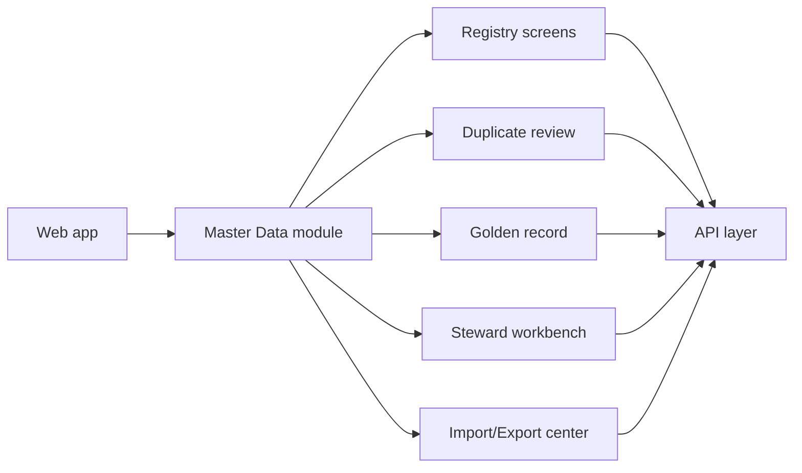
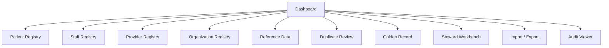
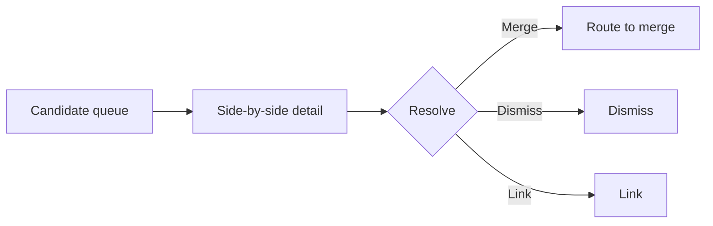

# Master Data Module — UI Specification

> **Document ID:** `master-data/08-UI`
> **Owner:** Product / UX Lead (master data)
> **Status:** 🔄 Pending approval (Phase 1 gate)
> **Version:** 1.0.0
> **Last updated:** 2026-08-06
> **Review cadence:** Re-reviewed at every phase gate and when UI/design standards change.
>
> **Relationship:** This document defines the **user interface** of the Master Data Management module — screens, navigation, interactions, and role-based visibility. It follows [12-UI-UX-GUIDELINES](../../12-UI-UX-GUIDELINES.md) and [13-DESIGN-SYSTEM](../../13-DESIGN-SYSTEM.md), implements the workflows in [02-Workflow](02-Workflow.md), and reflects the role model in [07-ROLES-PERMISSIONS](../../07-ROLES-PERMISSIONS.md).

---

## Table of Contents

1. [UI Architecture](#1-ui-architecture)
2. [UI Principles](#2-ui-principles)
3. [Navigation](#3-navigation)
4. [Dashboard](#4-dashboard)
5. [Master Data Registry](#5-master-data-registry)
6. [Patient Registry](#6-patient-registry)
7. [Staff Registry](#7-staff-registry)
8. [Provider Registry](#8-provider-registry)
9. [Organization Registry](#9-organization-registry)
10. [Reference Data](#10-reference-data)
11. [Duplicate Review](#11-duplicate-review)
12. [Golden Record](#12-golden-record)
13. [Merge / Unmerge](#13-merge--unmerge)
14. [Data Steward Workbench](#14-data-steward-workbench)
15. [Approval Screens](#15-approval-screens)
16. [Version History](#16-version-history)
17. [Audit Viewer](#17-audit-viewer)
18. [Import Center](#18-import-center)
19. [Export Center](#19-export-center)
20. [Integration Mapping](#20-integration-mapping)
21. [Search](#21-search)
22. [Filters](#22-filters)
23. [Bulk Operations](#23-bulk-operations)
24. [Empty/Error/Loading States](#24-emptyerrorloading-states)
25. [Accessibility](#25-accessibility)
26. [Responsive Design](#26-responsive-design)
27. [Role-Based UI Visibility](#27-role-based-ui-visibility)
28. [Cross References](#28-cross-references)

---

## 1. UI Architecture

The Master Data UI is a module within the platform's web frontend, built on the shared [Design System](../../13-DESIGN-SYSTEM.md). It follows the module/layer structure in [02-SYSTEM-ARCHITECTURE](../../02-SYSTEM-ARCHITECTURE.md) §8.

| Layer | Responsibility |
| --- | --- |
| Screen | Render + interaction |
| State | Local + server state |
| API client | Calls the [10-API](10-API.md) contract |
| Design system | Shared components ([13-DESIGN-SYSTEM](../../13-DESIGN-SYSTEM.md)) |

---

## 2. UI Principles

| # | Principle | Application |
| --- | --- | --- |
| UI-01 | **Clear before clever** | Simple, deterministic interactions |
| UI-02 | **Role-aware** | UI reflects permissions (API is authority) |
| UI-03 | **Consistent** | Reuses design-system components |
| UI-04 | **Safe by default** | Confirmation on destructive actions |
| UI-05 | **Accessible** | WCAG-compliant ([12-UI-UX-GUIDELINES](../../12-UI-UX-GUIDELINES.md) §14) |
| UI-06 | **Responsive** | Works across web + mobile |

---

## 3. Navigation

| Item | Screen | Permission-gated |
| --- | --- | --- |
| Dashboard | Master data overview | `masterdata:read` |
| Patient Registry | Patient list + detail | `patients:read` |
| Staff Registry | Staff list + detail | `staff:read` |
| Provider Registry | Provider list + detail | `providers:read` |
| Organization Registry | Organization list + detail | `organizations:read` |
| Reference Data | Reference/lookup management | `reference:manage` |
| Duplicate Review | Candidate queue | `duplicates:review` |
| Golden Record | Golden record view | `golden:read` |
| Steward Workbench | Quality + remediation | `stewardship:manage` |
| Import / Export | Data exchange | `import:run` / `export:run` |
| Audit Viewer | Audit trail | `audit:read` |

---

## 4. Dashboard

The master-data dashboard surfaces quality, duplicate, and registry health ([16-Dashboards](16-Dashboards.md) §5).

| Widget | Data |
| --- | --- |
| Registry counts | Patients, staff, providers, organizations |
| Duplicate queue | Open candidates by severity |
| Golden record status | Established links, pending |
| Data quality score | Quality index |
| Recent activity | Recent changes/audit |

---

## 5. Master Data Registry

A consolidated registry view across patient, staff, provider, and organization records.

| Element | Detail |
| --- | --- |
| List | Searchable, filterable table ([§21](#21-search), [§22](#22-filters)) |
| Detail | Master record + golden link + versions |
| Actions | Create, update, deactivate, archive, restore, reactivate, purge (per permission) |
| Split | Filterable by entity type |
| Bulk | Bulk operations ([§23](#23-bulk-operations)) |

---

## 6. Patient Registry

| Screen | Contents |
| --- | --- |
| Patient List | Searchable; identifier + demographic columns |
| Patient Detail | Identity, identifiers, demographics, consent, relations, aliases, golden link |
| Patient Create/Edit | Form with validation |
| Patient History | Version + audit history |
| Duplicate Link | Link to duplicate candidates |

---

## 7. Staff Registry

| Screen | Contents |
| --- | --- |
| Staff List | Searchable; name, identifiers, credentials |
| Staff Detail | Identity, credentials, demographics, consent |
| Staff Create/Edit | Form with validation |
| Credential view | Licenses + expiry status |

---

## 8. Provider Registry

| Screen | Contents |
| --- | --- |
| Provider List | Searchable; name, type, identifiers |
| Provider Detail | Identity, credentials, networks |
| Provider Create/Edit | Form with validation |

---

## 9. Organization Registry

| Screen | Contents |
| --- | --- |
| Organization List | Searchable; name, type, identifiers |
| Organization Detail | Identity, contacts, relationships |
| Organization Create/Edit | Form with validation |

---

## 10. Reference Data

| Screen | Contents |
| --- | --- |
| Reference List | Categories + values with active flags |
| Reference Edit | Add/edit/deactivate values |
| Lookup Management | Lookup categories + values |
| Geographic | Country/region/city/postal reference |
| Terminology | Code-set and terminology views |

---

## 11. Duplicate Review

| Screen | Contents |
| --- | --- |
| Candidate Queue | Open candidates with match scores ([§22](#22-filters)) |
| Candidate Detail | Both records side by side, scores, rule breakdown |
| Resolution | Link, merge, or dismiss with reason |
| Threshold View | Match thresholds per rule |

---

## 12. Golden Record

| Screen | Contents |
| --- | --- |
| Golden List | Established golden records |
| Golden Detail | Authoritative attributes + source records |
| Survivorship View | Attribute-level winning values |
| Link View | Source records linked |

---

## 13. Merge / Unmerge

| Screen | Contents |
| --- | --- |
| Merge Initiate | Select records, review differences |
| Merge Approval | Approver review with reason (SoD) |
| Survivorship Preview | Preview winning attributes |
| Merge Result | Post-merge confirmation |
| Unmerge Initiate | Reverse a merge (approved) |

---

## 14. Data Steward Workbench

| Screen | Contents |
| --- | --- |
| Work Queue | Quality issues + remediation tasks |
| Issue Detail | Issue, severity, records affected |
| Remediation | Task creation/assignment/completion |
| Stewardship Log | Action history |

---

## 15. Approval Screens

| Screen | Contents |
| --- | --- |
| Approval Queue | Pending elevated actions ([02-Workflow](02-Workflow.md) §7) |
| Approval Detail | Change summary, before/after, reason |
| Decision | Approve / reject with comment |
| MFA | Elevated decisions require MFA ([06-AUTHENTICATION](../../06-AUTHENTICATION.md)) |

---

## 16. Version History

| Screen | Contents |
| --- | --- |
| Version List | Versions of a record with timestamps + actor |
| Version Diff | Before/after comparison |
| Point-in-time | Reconstruct record at a version |

---

## 17. Audit Viewer

| Screen | Contents |
| --- | --- |
| Audit Trail | Filterable audit events ([13-Audit](13-Audit.md)) |
| Event Detail | Actor, action, entity, before/after |
| Retention | Per compliance schedule |

> Restricted to `audit:read` ([07-ROLES-PERMISSIONS](../../07-ROLES-PERMISSIONS.md)).

---

## 18. Import Center

| Screen | Contents |
| --- | --- |
| Import Start | Select format, file, mapping ([17-Import-Export](17-Import-Export.md)) |
| Import Progress | Batch status, row counts |
| Validation Results | Per-row errors/warnings |
| Import Review | Review before apply |
| Import History | Past batches |

---

## 19. Export Center

| Screen | Contents |
| --- | --- |
| Export Start | Select scope, format, recipient |
| Export Progress | Queue status |
| Export Results | Delivered/acknowledged |
| Export History | Past exports |

---

## 20. Integration Mapping

| Screen | Contents |
| --- | --- |
| Endpoint List | External endpoints ([18-Integrations](18-Integrations.md)) |
| Mapping Editor | Field-level source→target mapping |
| Cross-Reference | External↔internal identity mapping |
| Test | Test a mapping |

---

## 21. Search

| Aspect | Detail |
| --- | --- |
| Types | Exact identifier, fuzzy name, demographic |
| Backend | OpenSearch ([03-TECHNOLOGY-STACK](../../03-TECHNOLOGY-STACK.md)) |
| Result | Matching records + confidence |
| Scope | Tenant-scoped always |
| Debounce | Input debounced for responsiveness |

---

## 22. Filters

| Filter | Applies to |
| --- | --- |
| Entity type | Master registry |
| Status | All registries |
| Date range | Audit, versions, import/export |
| Severity | Duplicate queue, stewardship |
| Identifier type | Registries |
| Confidence | Duplicate queue |

---

## 23. Bulk Operations

| Operation | Guard |
| --- | --- |
| Bulk deactivate | Confirmation + reason |
| Bulk archive | Confirmation + approval |
| Bulk restore | Confirmation + audit |
| Bulk reactivate | Confirmation + approval |
| Bulk reference update | Validation preview |
| Bulk export | Scope + recipient confirmation |

---

## 24. Empty/Error/Loading States

| State | Behavior |
| --- | --- |
| Empty | Clear message + next action ([12-UI-UX-GUIDELINES](../../12-UI-UX-GUIDELINES.md) §10) |
| Loading | Skeleton/progress indicator |
| Error | Standard error envelope + retry |
| Partial | Warning with partial results |
| Offline | Banner + cached data ([12-UI-UX-GUIDELINES](../../12-UI-UX-GUIDELINES.md) §12) |

---

## 25. Accessibility

| Aspect | Requirement |
| --- | --- |
| Standard | WCAG 2.1 AA ([12-UI-UX-GUIDELINES](../../12-UI-UX-GUIDELINES.md) §14) |
| Keyboard | Full keyboard navigation |
| Focus | Visible focus states |
| Contrast | Design-system tokens |
| Screen reader | ARIA labels, semantic markup |
| Reduced motion | Respect preference |

---

## 26. Responsive Design

| Breakpoint | Behavior |
| --- | --- |
| Desktop | Full registry tables, multi-column |
| Tablet | Condensed tables, panels |
| Mobile | Card layout, list-first, bottom actions |
| Test | Verified across breakpoints ([20-Testing](20-Testing.md)) |

---

## 27. Role-Based UI Visibility

| Role | Visible UI | Source |
| --- | --- | --- |
| Registrar | Patient registry, search, create/update | [11-Permissions](11-Permissions.md) §6 |
| Registry Admin | Duplicate review, golden record, merge | §12–§14 |
| Data Steward | Steward workbench, quality, reference | §15–§16 |
| Approver | Approval screens | §16 |
| Finance/Ops | Organization, reference views | §10 |
| Auditor | Audit viewer | §18 |
| Executive | Dashboards (read) | [16-Dashboards](16-Dashboards.md) |

> UI visibility mirrors permissions; the [10-API](10-API.md) remains the authority ([04-CODING-STANDARDS](../../04-CODING-STANDARDS.md) §9).

---

## 28. Cross References

| Reference | Relationship | Direction |
| --- | --- | --- |
| [12-UI-UX-GUIDELINES](../../12-UI-UX-GUIDELINES.md) | UI/UX standard | Consumes |
| [13-DESIGN-SYSTEM](../../13-DESIGN-SYSTEM.md) | Design system | Consumes |
| [02-Workflow](02-Workflow.md) | Workflows | Consumes |
| [11-Permissions](11-Permissions.md) | Authorization | Consumes |
| [10-API](10-API.md) | API contract | Consumes |
| [16-Dashboards](16-Dashboards.md) | Dashboards | Consumes |
| [07-ROLES-PERMISSIONS](../../07-ROLES-PERMISSIONS.md) | Roles | Consumes |
| [Hospital Setup](../hospital-setup/README.md) | Shared UI | Consumes |

---

*End of `docs/modules/master-data/08-UI.md`.*
