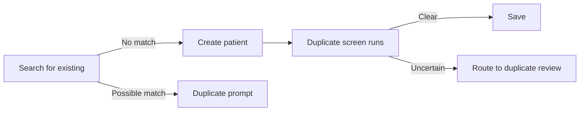
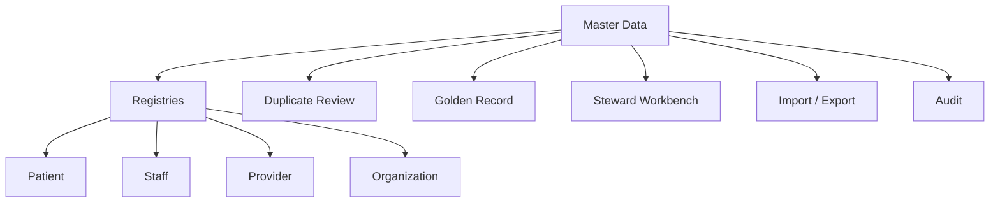

# Master Data Module — UX Specification

> **Document ID:** `master-data/09-UX`
> **Owner:** Product / UX Lead (master data)
> **Status:** 🔄 Pending approval (Phase 1 gate)
> **Version:** 1.0.0
> **Last updated:** 2026-08-06
> **Review cadence:** Re-reviewed at every phase gate and when UX patterns change.
>
> **Relationship:** This document defines the **user experience** of the Master Data Management module — personas, journeys, information architecture, and interaction patterns. It follows [12-UI-UX-GUIDELINES](../../12-UI-UX-GUIDELINES.md) and [13-DESIGN-SYSTEM](../../13-DESIGN-SYSTEM.md), and operationalizes the screens in [08-UI](08-UI.md) for the workflows in [02-Workflow](02-Workflow.md).

---

## Table of Contents

1. [UX Strategy](#1-ux-strategy)
2. [Personas](#2-personas)
3. [User Journeys](#3-user-journeys)
4. [Information Architecture](#4-information-architecture)
5. [Navigation UX](#5-navigation-ux)
6. [Search UX](#6-search-ux)
7. [Registry UX](#7-registry-ux)
8. [Duplicate Review UX](#8-duplicate-review-ux)
9. [Golden Record UX](#9-golden-record-ux)
10. [Merge UX](#10-merge-ux)
11. [Unmerge UX](#11-unmerge-ux)
12. [Approval UX](#12-approval-ux)
13. [Data Steward UX](#13-data-steward-ux)
14. [Bulk Operation UX](#14-bulk-operation-ux)
15. [Import UX](#15-import-ux)
16. [Export UX](#16-export-ux)
17. [Error Prevention](#17-error-prevention)
18. [Error Recovery](#18-error-recovery)
19. [Accessibility](#19-accessibility)
20. [Responsive UX](#20-responsive-ux)
21. [Mobile UX](#21-mobile-ux)
22. [Feedback Patterns](#22-feedback-patterns)
23. [Loading States](#23-loading-states)
24. [Empty States](#24-empty-states)
25. [Confirmation Patterns](#25-confirmation-patterns)
26. [UX Metrics](#26-ux-metrics)
27. [Cross References](#27-cross-references)

---

## 1. UX Strategy

The Master Data UX prioritizes **accuracy and confidence** over speed. The primary user goals are to correctly identify entities, resolve duplicates, and maintain trustworthy canonical records — so the UX is designed to make verification easy, irreversible actions explicit, and provenance transparent.

| Strategic pillar | Design implication |
| --- | --- |
| Confidence | Side-by-side comparison, confidence scores, source provenance |
| Safety | Confirmation + reason capture before destructive actions |
| Speed | Fast search and reusable patterns ([14-PERFORMANCE-STANDARDS](../../14-PERFORMANCE-STANDARDS.md)) |
| Trust | Transparent audit and version history visible inline |

---

## 2. Personas

Personas align to the role model in [07-ROLES-PERMISSIONS](../../07-ROLES-PERMISSIONS.md) and the module [11-Permissions](11-Permissions.md).

| Persona | Surface | Core need |
| --- | --- | --- |
| Registrar | Web | Create/update patient, staff records fast and correctly |
| Registry Administrator | Web | Review duplicates, manage golden records, merge/unmerge |
| Data Steward | Web | Resolve quality issues, manage reference data |
| Approver | Web + MFA | Review elevated actions (deactivate, merge, archive) |
| Finance / Ops | Web | View organizations and reference data |
| Auditor | Web (read) | Inspect audit and version history |
| Executive | Web (read) | Monitor dashboards ([16-Dashboards](16-Dashboards.md)) |

---

## 3. User Journeys

### Journey: Registrar creates a patient

| Step | UX |
| --- | --- |
| Search first | Duplicate prevention starts at entry |
| Create | Guided form with validation ([02-Workflow](02-Workflow.md) §5) |
| Screen | Silent duplicate check with feedback |
| Save | Confirmation + version created |

### Journey: Steward resolves a duplicate
| Step | UX |
| --- | --- |
| Queue | Prioritized candidates |
| Compare | Side-by-side with scores |
| Decide | Link / merge / dismiss with reason |
| Approve | Route elevated decisions |
| Confirm | Audited outcome |

---

## 4. Information Architecture

| Principle | Application |
| --- | --- |
| Progressive disclosure | Detail on demand |
| Consistent labels | Design-system terminology |
| Predictable paths | Fewest clicks to common task |
| Search-first | Search at top level |

---

## 5. Navigation UX

| Aspect | Detail |
| --- | --- |
| Persistent | Global nav keeps context |
| Contextual | Secondary nav per screen |
| Breadcrumbs | Clear hierarchy in registries |
| Shortcuts | Common actions (create, search) |
| Keyboard | Command palette for power users |

---

## 6. Search UX

| Aspect | Detail |
| --- | --- |
| Entry | Prominent search bar on registries |
| Debounce | Search-as-you-type with debounce |
| Identifiers | Exact match on identifier type+value |
| Fuzzy | Name/demographic fuzzy match ([06-ERD](06-ERD.md) §24) |
| Results | Ranked with confidence + source |
| Empty | Clear "no match" with create option |

---

## 7. Registry UX

| Aspect | Detail |
| --- | --- |
| List | Sortable, filterable columns ([08-UI](08-UI.md) §22) |
| Row action | View / edit / deactivate per permission |
| Detail | Tabs (identity, identifiers, history, golden) |
| Create | Inline validation, save+version |
| Pagination | Server-side pagination ([10-API](10-API.md) §25) |

---

## 8. Duplicate Review UX

| Aspect | Detail |
| --- | --- |
| Comparison | Side-by-side records, diff highlighting |
| Scores | Per-rule confidence breakdown ([19-Duplicate](04-Database-Tables.md) §19) |
| Decision | Clear primary action (link/merge/dismiss) |
| Reason | Required reason for audit |
| Batch | Resolve multiple in one session |
| Escalate | Route uncertain cases to a senior steward |

---

## 9. Golden Record UX

| Aspect | Detail |
| --- | --- |
| Authoritative view | Golden attributes clearly marked |
| Provenance | Source per attribute ([06-ERD](06-ERD.md) §13) |
| Survivorship | Show winning attribute + rule |
| Read-focused | Golden view is mostly read + controlled edits |

---

## 10. Merge UX

| Aspect | Detail |
| --- | --- |
| Initiate | Select records, preview differences |
| Survivorship preview | Attribute-by-attribute winning values |
| Approval | Elevates to approver (SoD) ([11-Permissions](11-Permissions.md) §20) |
| Result | Post-merge confirmation + audit link |
| Reversible | Unmerge path visible |

---

## 11. Unmerge UX

| Aspect | Detail |
| --- | --- |
| Initiate | From merge history, select to reverse |
| Preview | Records to be restored |
| Approval | Elevated + audited |
| Confirm | Restore confirmation |

---

## 12. Approval UX

| Aspect | Detail |
| --- | --- |
| Queue | Pending approvals with priority |
| Detail | Before/after, reason, actor |
| Decision | Approve / reject with mandatory comment |
| MFA | Required for elevated decisions ([06-AUTHENTICATION](../../06-AUTHENTICATION.md)) |
| History | Full approval trail |

---

## 13. Data Steward UX

| Aspect | Detail |
| --- | --- |
| Workbench | Unified queue of issues + tasks ([08-UI](08-UI.md) §14) |
| Prioritize | Sort by severity, age, impact |
| Remediate | Guided fix with validation |
| Log | Action history transparent |
| Reference | Manage reference/lookup values |

---

## 14. Bulk Operation UX

| Aspect | Detail |
| --- | --- |
| Selection | Multi-select with count |
| Preview | Dry-run of impact |
| Confirm | Strong confirmation + reason ([§25](#25-confirmation-patterns)) |
| Progress | Per-item status |
| Report | Summary of applied/skipped/failed |

---

## 15. Import UX

| Aspect | Detail |
| --- | --- |
| Upload | Drag-and-drop + file selection ([17-Import-Export](17-Import-Export.md)) |
| Mapping | Field-mapping preview |
| Validation | Progressive: format → schema → data |
| Review | Staged rows with errors |
| Apply | Confirmation before apply |

---

## 16. Export UX

| Aspect | Detail |
| --- | --- |
| Scope | Select filters/records |
| Format | Choose format ([17-Import-Export](17-Import-Export.md) §5) |
| Recipient | Delivery target |
| Track | Queue status + download link |

---

## 17. Error Prevention

| Pattern | Application |
| --- | --- |
| Inline validation | Validate on input, fail fast |
| Constraint hints | Show allowed values/formats |
| Confirm destructive | Always confirm deactivate/merge/delete |
| Prevent double-submit | Disable during submit |
| Search-first | Reduce duplicate creation errors |

---

## 18. Error Recovery

| Pattern | Application |
| --- | --- |
| Standard error | Consistent error envelope ([10-API](10-API.md) §24) |
| Retry | Idempotent retry ([10-API](10-API.md) §28) |
| Undo | Reversible via version history |
| Unmerge | Explicit reversal for merges |
| Dead-letter | Failed async surfaced to ops ([14-Notifications](14-Notifications.md)) |

---

## 19. Accessibility

Follow [12-UI-UX-GUIDELINES](../../12-UI-UX-GUIDELINES.md) §14 (WCAG 2.1 AA) and [08-UI](08-UI.md) §25 — keyboard, focus, contrast, screen-reader, reduced-motion support.

---

## 20. Responsive UX

| Breakpoint | UX |
| --- | --- |
| Desktop | Full tables, side-by-side compare |
| Tablet | Condensed, panels |
| Mobile | Card layout, list-first, bottom actions |

---

## 21. Mobile UX

| Aspect | Detail |
| --- | --- |
| Scope | Read + approve-focused on mobile |
| Compare | Simplified compare for review |
| Offline | Cached authorized data with bounded retention ([12-UI-UX-GUIDELINES](../../12-UI-UX-GUIDELINES.md) §12) |
| Actions | Prominent primary action on mobile |

---

## 22. Feedback Patterns

| Pattern | Use |
| --- | --- |
| Toast | Non-critical success (save) |
| Banner | Page-level status/warning |
| Dialog | Confirmation and decision |
| Inline | Field validation |
| Progress | Long-running (import/export) |

---

## 23. Loading States

| State | Pattern |
| --- | --- |
| Initial | Skeleton |
| Pagination | Skeleton rows |
| Search | Debounce + indicator |
| Action | Disabled + spinner |
| Async | Progress bar (import/export) |

---

## 24. Empty States

| Empty | Message + action |
| --- | --- |
| No records | "No records yet — create one" |
| No search results | "No match — create new" + suggestion |
| No duplicates | "No duplicates pending" |
| Empty queue | "Nothing awaiting approval" |

---

## 25. Confirmation Patterns

| Action | Confirmation |
| --- | --- |
| Deactivate | Confirm + reason (required) |
| Merge | Preview + confirm + reason |
| Unmerge | Confirm + reason |
| Archive | Confirm + reason |
| Delete/purge | Strong confirm + legal/regulatory note ([02-Workflow](02-Workflow.md) §16) |

---

## 26. UX Metrics

| Metric | Target | Source |
| --- | --- | --- |
| Task completion | High for registry create/update | [20-Testing](20-Testing.md) |
| Duplicate detection precision | Reduced false positives | BRS §18 |
| Merge reversal success | 100% reversible | [02-Workflow](02-Workflow.md) §12 |
| Approval response | ≤24 h ([14-Notifications](14-Notifications.md) §19) | platform |
| Accessibility | No AA violations | [12-UI-UX-GUIDELINES](../../12-UI-UX-GUIDELINES.md) §14 |

---

## 27. Cross References

| Reference | Relationship | Direction |
| --- | --- | --- |
| [08-UI](08-UI.md) | Screens | Consumes |
| [12-UI-UX-GUIDELINES](../../12-UI-UX-GUIDELINES.md) | UX standard | Consumes |
| [13-DESIGN-SYSTEM](../../13-DESIGN-SYSTEM.md) | Design system | Consumes |
| [02-Workflow](02-Workflow.md) | Workflows | Consumes |
| [01-Business-Requirements](01-Business-Requirements.md) | Requirements | Consumes |
| [11-Permissions](11-Permissions.md) | Authorization | Consumes |
| [16-Dashboards](16-Dashboards.md) | Dashboards | Consumes |
| [Hospital Setup](../hospital-setup/README.md) | Shared UX | Consumes |

---

*End of `docs/modules/master-data/09-UX.md`.*
