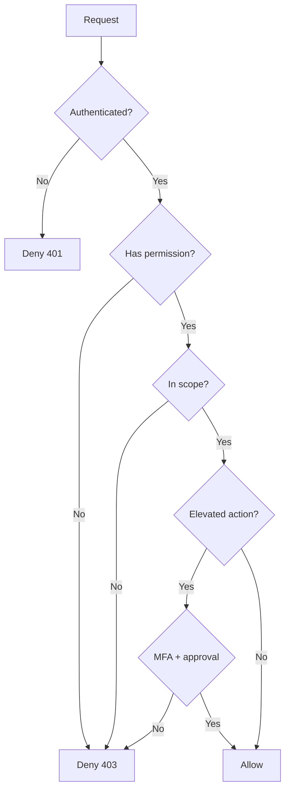

# Master Data Module — Permissions & Roles

> **Document ID:** `master-data/11-Permissions`
> **Owner:** Architecture / Engineering Lead (security)
> **Status:** 🔄 Pending approval (Phase 1 gate)
> **Version:** 1.0.0
> **Last updated:** 2026-08-06
> **Review cadence:** Re-reviewed at every phase gate and when the role catalog changes.
>
> **Relationship:** This document defines the **authorization model** of the Master Data Management module — roles, permissions, scoping, and decision rules. It follows [07-ROLES-PERMISSIONS](../../07-ROLES-PERMISSIONS.md) and [06-AUTHENTICATION](../../06-AUTHENTICATION.md), and enforces the model defined in [07-Domain-Model](07-Domain-Model.md) and the API in [10-API](10-API.md).

---

## Table of Contents

1. [Purpose](#1-purpose)
2. [Permission Principles](#2-permission-principles)
3. [Permission Naming](#3-permission-naming)
4. [Role Catalog](#4-role-catalog)
5. [Permission Catalog](#5-permission-catalog)
6. [Role × Permission Matrix](#6-role--permission-matrix)
7. [Patient Permissions](#7-patient-permissions)
8. [Staff Permissions](#8-staff-permissions)
9. [Provider Permissions](#9-provider-permissions)
10. [Organization Permissions](#10-organization-permissions)
11. [Reference Data Permissions](#11-reference-data-permissions)
12. [Duplicate Permissions](#12-duplicate-permissions)
13. [Merge / Unmerge Permissions](#13-merge--unmerge-permissions)
14. [Golden Record Permissions](#14-golden-record-permissions)
15. [Steward Permissions](#15-steward-permissions)
16. [Approval Permissions](#16-approval-permissions)
17. [Import / Export Permissions](#17-import--export-permissions)
18. [Audit Permissions](#18-audit-permissions)
19. [Tenant Scoping](#19-tenant-scoping)
20. [Separation of Duties](#20-separation-of-duties)
21. [MFA-Gated Actions](#21-mfa-gated-actions)
22. [Authorization Decision Tables](#22-authorization-decision-tables)
23. [Authorization Testing](#23-authorization-testing)
24. [Cross References](#24-cross-references)

---

## 1. Purpose

This document defines **who can do what** in the Master Data module. It operationalizes the platform authorization model ([07-ROLES-PERMISSIONS](../../07-ROLES-PERMISSIONS.md)) for master-data operations, with least-privilege, default-deny, and separation-of-duties enforced.

---

## 2. Permission Principles

| # | Principle | Application |
| --- | --- | --- |
| P-01 | Least privilege | Roles grant minimum permissions |
| P-02 | Default deny | Deny unless explicitly granted |
| P-03 | Separation of duties | Requester ≠ approver for elevated actions |
| P-04 | Context matters | Facility/department scoping |
| P-05 | Centrally governed | Data-defined, versioned |
| P-06 | Testable | Automated authorization tests ([20-Testing](20-Testing.md)) |

---

## 3. Permission Naming

Permissions follow `resource:action` ([07-ROLES-PERMISSIONS](../../07-ROLES-PERMISSIONS.md) §5).

| Resource | Example actions |
| --- | --- |
| `patients` | `read`, `create`, `update` |
| `staff` | `read`, `create`, `update` |
| `providers` | `read`, `create`, `update` |
| `organizations` | `read`, `create`, `update` |
| `reference` | `read`, `manage` |
| `duplicates` | `read`, `review` |
| `golden` | `read`, `manage` |
| `merge` | `read`, `execute` |
| `unmerge` | `execute` |
| `approval` | `review` |
| `stewardship` | `manage` |
| `import` | `run` |
| `export` | `run` |
| `integration` | `manage` |
| `masterdata` | `read` |
| `audit` | `read` (platform) |

---

## 4. Role Catalog

Baseline roles (extensible; maintained as data per [07-ROLES-PERMISSIONS](../../07-ROLES-PERMISSIONS.md)).

| Role | Representative permissions | Scope |
| --- | --- | --- |
| **Registrar** | Patient/staff create/update, search | Facility |
| **Registry Administrator** | Duplicate review, golden record, merge, reference | Facility |
| **Data Steward** | Quality, remediation, reference management | Facility |
| **Approver** | Approval review for elevated actions | Facility / global |
| **Finance / Ops** | Organization + reference read | Facility |
| **Integration Owner** | Integration endpoints, mappings, cross-refs | Facility / global |
| **Auditor** | Audit + version read | Global read |
| **Executive** | Dashboards, read | Global read |

---

## 5. Permission Catalog

| Permission | Description |
| --- | --- |
| `patients:read` | View patient records |
| `patients:create` | Create patient records |
| `patients:update` | Update / deactivate patient records |
| `staff:read` | View staff records |
| `staff:create` | Create staff records |
| `staff:update` | Update / deactivate staff records |
| `providers:read` | View provider records |
| `providers:create` | Create provider records |
| `providers:update` | Update / deactivate provider records |
| `organizations:read` | View organization records |
| `organizations:create` | Create organization records |
| `organizations:update` | Update / deactivate organization records |
| `reference:read` | View reference/lookup data |
| `reference:manage` | Manage reference/lookup values |
| `duplicates:read` | View duplicate candidates |
| `duplicates:review` | Review/resolve duplicate candidates |
| `golden:read` | View golden records |
| `golden:manage` | Maintain golden records |
| `merge:read` | View merge history |
| `merge:execute` | Initiate a merge |
| `unmerge:execute` | Initiate an unmerge |
| `approval:review` | Review/decide approvals |
| `stewardship:manage` | Manage quality issues and remediation |
| `import:run` | Run imports |
| `export:run` | Run exports |
| `integration:manage` | Manage integrations and mappings |
| `masterdata:read` | View master registry + dashboard |
| `audit:read` | View audit trail |

---

## 6. Role × Permission Matrix

| Permission | Registrar | Registry Admin | Data Steward | Approver | Finance/Ops | Integration | Auditor | Executive |
| --- | :---: | :---: | :---: | :---: | :---: | :---: | :---: | :---: |
| `patients:read` | ✓ | ✓ | ✓ | ✓ | · | · | · | read-only |
| `patients:create` | ✓ | ✓ | · | · | · | · | · | · |
| `patients:update` | ✓ | ✓ | ✓ | · | · | · | · | · |
| `staff:read` | ✓ | ✓ | ✓ | ✓ | ✓ | · | · | read-only |
| `staff:create` | ✓ | ✓ | · | · | · | · | · | · |
| `staff:update` | ✓ | ✓ | ✓ | · | · | · | · | · |
| `providers:read` | ✓ | ✓ | ✓ | ✓ | ✓ | · | · | read-only |
| `providers:create` | ✓ | ✓ | · | · | · | · | · | · |
| `providers:update` | ✓ | ✓ | ✓ | · | · | · | · | · |
| `organizations:read` | ✓ | ✓ | ✓ | ✓ | ✓ | · | · | read-only |
| `organizations:create` | ✓ | ✓ | · | · | · | · | · | · |
| `organizations:update` | ✓ | ✓ | ✓ | · | · | · | · | · |
| `reference:read` | ✓ | ✓ | ✓ | ✓ | ✓ | ✓ | · | read-only |
| `reference:manage` | · | ✓ | ✓ | · | · | · | · | · |
| `duplicates:read` | ✓ | ✓ | ✓ | ✓ | · | · | · | · |
| `duplicates:review` | · | ✓ | ✓ | · | · | · | · | · |
| `golden:read` | ✓ | ✓ | ✓ | ✓ | · | · | · | read-only |
| `golden:manage` | · | ✓ | ✓ | · | · | · | · | · |
| `merge:read` | · | ✓ | ✓ | ✓ | · | · | · | · |
| `merge:execute` | · | ✓ | · | · | · | · | · | · |
| `unmerge:execute` | · | ✓ | · | · | · | · | · | · |
| `approval:review` | · | · | · | ✓ | · | · | · | · |
| `stewardship:manage` | · | ✓ | ✓ | · | · | · | · | · |
| `import:run` | · | ✓ | ✓ | · | · | ✓ | · | · |
| `export:run` | · | ✓ | ✓ | · | ✓ | ✓ | · | · |
| `integration:manage` | · | · | · | · | · | ✓ | · | · |
| `masterdata:read` | ✓ | ✓ | ✓ | ✓ | ✓ | ✓ | ✓ | ✓ |
| `audit:read` | · | · | · | · | · | · | ✓ | · |

---

## 7. Patient Permissions

See matrix: `patients:read`, `patients:create`, `patients:update`. Deactivation (`patients:update` on delete) is an elevated action requiring approval.

---

## 8. Staff Permissions

`staff:read`, `staff:create`, `staff:update`. Credentials and consents require `staff:read` (view) / `staff:update` (manage).

---

## 9. Provider Permissions

`providers:read`, `providers:create`, `providers:update`. Networks require `providers:update`.

---

## 10. Organization Permissions

`organizations:read`, `organizations:create`, `organizations:update`.

---

## 11. Reference Data Permissions

`reference:read` (view), `reference:manage` (add/edit/deactivate values).

---

## 12. Duplicate Permissions

`duplicates:read` (view candidates + scores), `duplicates:review` (resolve). Review is audited and logged.

---

## 13. Merge / Unmerge Permissions

`merge:read`, `merge:execute`, `unmerge:execute`. All merge/unmerge actions are elevated and routed to an Approver (SoD) — [§20](#20-separation-of-duties).

---

## 14. Golden Record Permissions

`golden:read` (view), `golden:manage` (maintain). Golden edits are versioned and audited.

---

## 15. Steward Permissions

`stewardship:manage` governs quality issues, remediation tasks, and steward assignments.

---

## 16. Approval Permissions

`approval:review` is limited to the Approver role. Approvals are MFA-gated and audited.

---

## 17. Import / Export Permissions

`import:run` and `export:run`. Import apply is elevated; rollback is governed.

---

## 18. Audit Permissions

`audit:read` (platform) restricted to Auditor and System administrator ([07-ROLES-PERMISSIONS](../../07-ROLES-PERMISSIONS.md) §4).

---

## 19. Tenant Scoping

| Rule | Application |
| --- | --- |
| Facility scope | Most roles apply within facility/context |
| Intersection | Effective scope = union of roles ∩ scope |
| Patient-relationship | Clinical access limited to care relationship |
| Consent | Sensitive access gated by consent |
| RLS | Enforced at data layer ([06-ERD](06-ERD.md) §22) |

---

## 20. Separation of Duties

| Action | Requester | Approver |
| --- | --- | --- |
| Deactivate record | Registry Admin / Steward | Approver |
| Merge | Registry Admin | Approver |
| Unmerge | Registry Admin | Approver |
| Purge / archive | Steward | Approver |
| Import apply | Importer | Approver (where elevated) |

> Requester and approver MUST be different principals ([07-ROLES-PERMISSIONS](../../07-ROLES-PERMISSIONS.md) §8).

---

## 21. MFA-Gated Actions

| Action | MFA |
| --- | --- |
| Approve/reject any approval | Required |
| Merge / unmerge | Required |
| Purge / hard delete | Required |
| Deactivate with active references | Required |
| Elevated reference change | Required |

---

## 22. Authorization Decision Tables

---

## 23. Authorization Testing

| Test | Scope |
| --- | --- |
| Positive | Authorized role can perform action |
| Negative | Unauthorized role denied |
| Scope | Out-of-scope denied |
| SoD | Requester cannot approve own action |
| MFA | Elevated requires MFA |
| Reference | Matrix matches [10-API](10-API.md) endpoints |

> Authorization tests are automated ([20-Testing](20-Testing.md) §16) and re-run at gates ([07-ROLES-PERMISSIONS](../../07-ROLES-PERMISSIONS.md) §11).

---

## 24. Cross References

| Reference | Relationship | Direction |
| --- | --- | --- |
| [07-ROLES-PERMISSIONS](../../07-ROLES-PERMISSIONS.md) | Platform authZ | Consumes |
| [06-AUTHENTICATION](../../06-AUTHENTICATION.md) | AuthN | Consumes |
| [10-API](10-API.md) | API endpoints | Consumes |
| [07-Domain-Model](07-Domain-Model.md) | Domains | Consumes |
| [12-Security](12-Security.md) | Security | Consumes |
| [13-Audit](13-Audit.md) | Audit | Consumes |
| [20-Testing](20-Testing.md) | Testing | Consumes |
| [09-MULTI-TENANCY](../../09-MULTI-TENANCY.md) | Tenancy | Consumes |
| [Hospital Setup](../hospital-setup/README.md) | Role sharing | Consumes |

---

*End of `docs/modules/master-data/11-Permissions.md`.*
