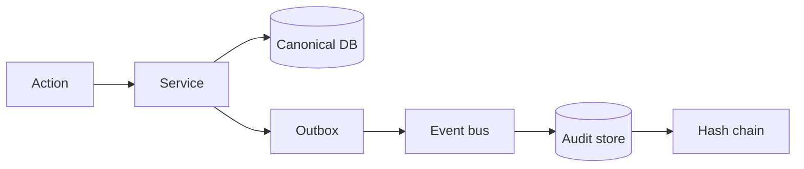

# Master Data Module — Audit

> **Document ID:** `master-data/13-Audit`
> **Owner:** Security / Engineering Lead (audit)
> **Status:** 🔄 Pending approval (Phase 1 gate)
> **Version:** 1.0.0
> **Last updated:** 2026-08-06
> **Review cadence:** Re-reviewed at every phase gate and when audit requirements change.
>
> **Relationship:** This document defines the **audit** of the Master Data Management module — events, schema mapping, integrity, retention, and querying. It follows [08-AUDIT-LOGGING](../../08-AUDIT-LOGGING.md) as authoritative and maps to the audit tables in [04-Database-Tables](04-Database-Tables.md) §26.

---

## Table of Contents

1. [Purpose](#1-purpose)
2. [Audit Principles](#2-audit-principles)
3. [Audit Objectives](#3-audit-objectives)
4. [Audit Event Model](#4-audit-event-model)
5. [Event Catalog](#5-event-catalog)
6. [Master Data Audit Events](#6-master-data-audit-events)
7. [Duplicate Audit Events](#7-duplicate-audit-events)
8. [Merge / Unmerge Audit](#8-merge--unmerge-audit)
9. [Golden Record Audit](#9-golden-record-audit)
10. [Approval Audit](#10-approval-audit)
11. [Import / Export Audit](#11-import--export-audit)
12. [Integration Audit](#12-integration-audit)
13. [Audit Schema Mapping](#13-audit-schema-mapping)
14. [Integrity](#14-integrity)
15. [Audit Write Path](#15-audit-write-path)
16. [Audit Query Path](#16-audit-query-path)
17. [Retention](#17-retention)
18. [Archival](#18-archival)
19. [PHI Handling](#19-phi-handling)
20. [Access Control](#20-access-control)
21. [Monitoring](#21-monitoring)
22. [Reports](#22-reports)
23. [Testing](#23-testing)
24. [Cross References](#24-cross-references)

---

## 1. Purpose

This document defines how the Master Data module **records and exposes** an immutable audit trail of every security- and data-relevant action — satisfying [08-AUDIT-LOGGING](../../08-AUDIT-LOGGING.md) and regulatory requirements ([20-COMPLIANCE](../../20-COMPLIANCE.md)).

---

## 2. Audit Principles

| # | Principle | Application |
| --- | --- | --- |
| AU-01 | Immutable | Append-only, tamper-evident ([§14](#14-integrity)) |
| AU-02 | Complete | Every relevant mutation audited |
| AU-03 | Attributable | Actor, time, context captured |
| AU-04 | Searchable | Efficient query path ([§16](#16-audit-query-path)) |
| AU-05 | Retained | Per compliance schedule ([§17](#17-retention)) |
| AU-06 | Restricted | `audit:read` only ([11-Permissions](11-Permissions.md) §18) |

---

## 3. Audit Objectives

| Objective | Detail |
| --- | --- |
| Accountability | Who did what, when |
| Traceability | Full change history |
| Compliance | Regulatory evidence |
| Security | Detect anomalies |
| Forensic | Investigation support |

---

## 4. Audit Event Model

An audit event records one auditable action, per [08-AUDIT-LOGGING](../../08-AUDIT-LOGGING.md) §5.

| Field | Description |
| --- | --- |
| eventId | Unique event id |
| eventType | Event type (below) |
| actorId | Acting principal |
| actorType | user / service / system |
| action | create / update / deactivate / merge / ... |
| resource | Entity + id |
| tenantId | Tenant scope |
| before | Prior state (redacted) |
| after | New state (redacted) |
| correlationId | Trace correlation |
| occurredAt | UTC timestamp |
| chainHash | Tamper-evidence hash ([§14](#14-integrity)) |

---

## 5. Event Catalog

Events are defined per [08-AUDIT-LOGGING](../../08-AUDIT-LOGGING.md) §5, namespaced `md.*`.

| Event | Type |
| --- | --- |
| `md.master_record.created` | Create |
| `md.master_record.updated` | Update |
| `md.master_record.deactivated` | Deactivate |
| `md.master_record.archived` | Archive |
| `md.master_record.restored` | Restore |
| `md.master_record.reactivated` | Reactivate |
| `md.master_record.purged` | Purge |
| `md.duplicate.candidate_created` | Detection |
| `md.duplicate.reviewed` | Review |
| `md.duplicate.threshold_changed` | Detection |
| `md.merge.initiated` | Merge |
| `md.merge.approved` | Merge |
| `md.merge.rejected` | Merge |
| `md.merge.executed` | Merge |
| `md.unmerge.executed` | Unmerge |
| `md.golden.established` | Golden |
| `md.golden.updated` | Golden |
| `md.golden.link_changed` | Golden |
| `md.approval.decided` | Approval |
| `md.approval.mfa` | Approval |
| `md.consent.changed` | Consent |
| `md.identity.assigned` | Identity |
| `md.stewardship.action_taken` | Stewardship |
| `md.import.batch_started` | Import |
| `md.import.applied` | Import |
| `md.import.rollback` | Import |
| `md.export.run` | Export |
| `md.integration.changed` | Integration |
| `md.cross_reference.changed` | Integration |

---

## 6. Master Data Audit Events

| Event | Captures |
| --- | --- |
| created | New patient/staff/provider/org |
| updated | Field changes (before/after) |
| deactivated | Deactivation + reason + approval |
| archived | Archive trigger |
| purged | Purge + legal basis |

---

## 7. Duplicate Audit Events

| Event | Captures |
| --- | --- |
| candidate_created | New duplicate candidate + scores |
| reviewed | Resolution decision + reason |
| threshold_changed | Match threshold change |

---

## 8. Merge / Unmerge Audit

| Event | Captures |
| --- | --- |
| merge.initiated | Request + records |
| merge.approved / rejected | Decision + approver |
| merge.executed | Survivorship decisions + result |
| unmerge.executed | Reversal + result |

---

## 9. Golden Record Audit

| Event | Captures |
| --- | --- |
| golden.established | Selection + source links |
| golden.updated | Attribute changes |
| golden.link_changed | Link add/remove |

---

## 10. Approval Audit

| Event | Captures |
| --- | --- |
| approval.decided | Approve/reject + comment + actor |
| approval.mfa | MFA verification |

---

## 11. Import / Export Audit

| Event | Captures |
| --- | --- |
| import.applied | Batch id, row counts |
| import.rollback | Rollback + scope |
| export.run | Scope, format, recipient |

---

## 12. Integration Audit

| Event | Captures |
| --- | --- |
| integration.changed | Endpoint/map/mapping changes |
| cross_reference.changed | Identity cross-reference changes |

---

## 13. Audit Schema Mapping

Maps audit events to tables in [04-Database-Tables](04-Database-Tables.md) §26 and the version tables in §32.

| Audit store | Backing table | Contents |
| --- | --- | --- |
| Master audit | `audit_reference` | Canonical audit events |
| Version audit | `version_audit` + `version_snapshot` | Versioned state |
| Golden audit | `golden_record_audit` | Golden changes |
| Stewardship log | `stewardship_log` | Remediation actions |
| Import/export | `import_validation`, `export_queue_item` | Data exchange outcomes |

---

## 14. Integrity

| Control | Detail |
| --- | --- |
| Append-only | No updates/deletes on audit |
| Tamper-evidence | Hash chaining ([08-AUDIT-LOGGING](../../08-AUDIT-LOGGING.md) §7) |
| WORM | Write-once-read-many storage |
| Verification | Periodic hash verification |

---

## 15. Audit Write Path

Audit is written in the same transaction as the source change (outbox pattern, [02-SYSTEM-ARCHITECTURE](../../02-SYSTEM-ARCHITECTURE.md) §12).

---

## 16. Audit Query Path

| Aspect | Detail |
| --- | --- |
| Query | Filter by eventType, actor, resource, tenant, time |
| Index | Optimized on tenant + time + eventType |
| Pagination | Server-side |
| Export | Authorized audit export |

---

## 17. Retention

Retention follows [08-AUDIT-LOGGING](../../08-AUDIT-LOGGING.md) §10 and [17-DATA-GOVERNANCE](../../17-DATA-GOVERNANCE.md) §12; compliance schedule in [20-COMPLIANCE](../../20-COMPLIANCE.md) §12.

| Data class | Retention |
| --- | --- |
| Master audit | Per compliance schedule |
| Version snapshots | Per retention policy |
| Import/export logs | Per retention policy |
| PHI-touching audit | Regulatory minimum |

---

## 18. Archival

Old audit events are archived to object storage per [05-DATABASE-ARCHITECTURE](../../05-DATABASE-ARCHITECTURE.md) §8, with the `archive_manifest` tracking export ([04-Database-Tables](04-Database-Tables.md) §34).

---

## 19. PHI Handling

| Aspect | Decision |
| --- | --- |
| Redaction | Audit stores redacted values; full PHI only where required |
| No PHI in tokens | Identity-only |
| No secrets | Secrets never audited |
| Access | `audit:read` only |

---

## 20. Access Control

| Role | Access |
| --- | --- |
| Auditor | Full read |
| System administrator | Read (governed) |
| Others | Denied |
| Service | Programmatic via `audit:read` |

---

## 21. Monitoring

| Aspect | Detail |
| --- | --- |
| Alert | Anomalous audit patterns |
| Coverage | Audit completeness metric |
| SOC | Security events routed |

---

## 22. Reports

Audit reports per [15-Reports](15-Reports.md) §15 (Approval History, Setup Change Log, Access Review).

---

## 23. Testing

Audit testing per [20-Testing](20-Testing.md) §22 — integrity, completeness, immutability, and redaction.

---

## 24. Cross References

| Reference | Relationship | Direction |
| --- | --- | --- |
| [08-AUDIT-LOGGING](../../08-AUDIT-LOGGING.md) | Audit standard | Consumes |
| [04-Database-Tables](04-Database-Tables.md) | Audit tables | Consumes |
| [11-Permissions](11-Permissions.md) | Access | Consumes |
| [12-Security](12-Security.md) | Security | Consumes |
| [15-Reports](15-Reports.md) | Audit reports | Provides |
| [20-Testing](20-Testing.md) | Testing | Consumes |
| [20-COMPLIANCE](../../20-COMPLIANCE.md) | Compliance | Consumes |
| [17-DATA-GOVERNANCE](../../17-DATA-GOVERNANCE.md) | Retention | Consumes |

---

*End of `docs/modules/master-data/13-Audit.md`.*
