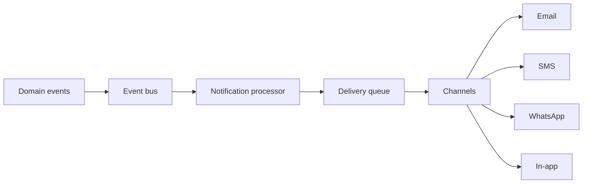

# Master Data Module — Notifications

> **Document ID:** `master-data/14-Notifications`
> **Owner:** Engineering Lead (messaging)
> **Status:** 🔄 Pending approval (Phase 1 gate)
> **Version:** 1.0.0
> **Last updated:** 2026-08-06
> **Review cadence:** Re-reviewed at every phase gate.
>
> **Relationship:** This document defines **notifications** for the Master Data Management module — types, channels, priorities, escalation, and delivery. It consumes the event model in [07-Domain-Model](07-Domain-Model.md) §8 and the platform messaging architecture ([02-SYSTEM-ARCHITECTURE](../../02-SYSTEM-ARCHITECTURE.md) §12).

---

## Table of Contents

1. [Purpose](#1-purpose)
2. [Scope](#2-scope)
3. [Architecture](#3-architecture)
4. [Event Sources](#4-event-sources)
5. [Notification Types](#5-notification-types)
6. [Delivery Channels](#6-delivery-channels)
7. [Priority](#7-priority)
8. [Templates](#8-templates)
9. [User Preferences](#9-user-preferences)
10. [Escalation](#10-escalation)
11. [Retry](#11-retry)
12. [Queue Processing](#12-queue-processing)
13. [Failure Handling](#13-failure-handling)
14. [Rate Limiting](#14-rate-limiting)
15. [Security](#15-security)
16. [Audit](#16-audit)
17. [Monitoring](#17-monitoring)
18. [Reports](#18-reports)
19. [KPIs](#19-kpis)
20. [Cross References](#20-cross-references)

---

## 1. Purpose

This document defines how the Master Data module **notifies** the right people at the right time — approvals pending, duplicates flagged, quality issues open, import/export events, and escalations.

---

## 2. Scope

Notifications for: approval requests/decisions, duplicate candidates awaiting review, quality issues, import/export completion/errors, integration failures, and scheduled reviews.

---

## 3. Architecture

Uses Kafka + notification service ([03-TECHNOLOGY-STACK](../../03-TECHNOLOGY-STACK.md)).

---

## 4. Event Sources

| Source | Events |
| --- | --- |
| Domain model | `md.*` events ([13-Audit](13-Audit.md) §5) |
| Workflow | Approval, deactivation, merge ([02-Workflow](02-Workflow.md)) |
| Import/Export | Completion, errors ([17-Import-Export](17-Import-Export.md)) |
| Integration | Sync failures ([18-Integrations](18-Integrations.md)) |

---

## 5. Notification Types

| Type | Trigger |
| --- | --- |
| Approval pending | Elevated action awaiting approver |
| Approval decided | Outcome of an approval |
| Duplicate flagged | New duplicate candidate |
| Quality issue | New/updated quality issue |
| Import completed / failed | Import lifecycle |
| Export completed / failed | Export lifecycle |
| Integration failed | Sync/endpoint failure |
| Review due | Scheduled structure/reference review |

---

## 6. Delivery Channels

| Channel | Use |
| --- | --- |
| Email | Formal, approvals, summaries |
| In-app | Immediate, non-critical |
| SMS | High-priority to key contacts |
| WhatsApp | Optional, user-preferred |

---

## 7. Priority

| Priority | Examples | SLA |
| --- | --- | --- |
| P0 | Integration outage, PHI breach signal | Immediate + escalate |
| P1 | Import failure, blocked merge | 15 min ack |
| P2 | Duplicate flagged, approval pending | 2 h |
| P3 | Review due, routine summary | 24 h |

---

## 8. Templates

| Aspect | Decision |
| --- | --- |
| Standard | Shared notification templates |
| Context | Tenant + module data |
| PHI | No PHI in notification bodies ([§15](#15-security)) |
| Localization | Where enabled ([24-Future-Roadmap](24-Future-Roadmap.md) §10) |

---

## 9. User Preferences

| Aspect | Decision |
| --- | --- |
| Channel per type | User-configurable |
| Quiet hours | Optional |
| Digests | Optional daily summary |
| Defaults | Sensible defaults; secure by default |

---

## 10. Escalation

| Scenario | Escalation |
| --- | --- |
| Approval SLA exceeded | Escalate to next approver level |
| P0 unacknowledged | Escalate immediately |
| Retry exhausted | Escalate to on-call ([§13](#13-failure-handling)) |

---

## 11. Retry

| Aspect | Decision |
| --- | --- |
| Max attempts | Configurable, default 3 |
| Backoff | Exponential |
| Idempotent | No duplicate delivery on retry |

---

## 12. Queue Processing

| Aspect | Decision |
| --- | --- |
| Ordering | Priority-first |
| Durability | Kafka-backed, replayable |
| Consumer | Notification service consumer group |

---

## 13. Failure Handling

| Aspect | Decision |
| --- | --- |
| Dead-letter | Failed notifications to DLQ |
| Alert | DLQ monitored |
| Manual | Re-drive via operator |

---

## 14. Rate Limiting

| Aspect | Decision |
| --- | --- |
| Per channel | Rate limited per recipient |
| Burst | Bounded |
| Abuse | Prevent notification spam |

---

## 15. Security

| Aspect | Decision |
| --- | --- |
| Recipient authZ | Recipients authorized per [11-Permissions](11-Permissions.md) |
| No PHI | Notification bodies redacted; links only |
| TLS | Secure channel delivery |
| Phishing | No clickable PHI; no secrets |

---

## 16. Audit

All notification events are audited per [13-Audit](13-Audit.md) and [08-AUDIT-LOGGING](../../08-AUDIT-LOGGING.md) — send, delivery, failure, and preference changes.

---

## 17. Monitoring

| Metric | Detail |
| --- | --- |
| Delivery rate | % delivered |
| Error rate | % failed |
| Latency | Time to deliver |
| Escalation | Count of escalations |

---

## 18. Reports

Notification delivery reports feed [15-Reports](15-Reports.md) (approval SLA, delivery health).

---

## 19. KPIs

| KPI | Target |
| --- | --- |
| Approval response | ≤24 h median |
| P0 acknowledgment | ≤15 min |
| Delivery success | ≥ 99% |
| Escalation rate | Decreasing |

---

## 20. Cross References

| Reference | Relationship | Direction |
| --- | --- | --- |
| [07-Domain-Model](07-Domain-Model.md) | Events | Consumes |
| [02-SYSTEM-ARCHITECTURE](../../02-SYSTEM-ARCHITECTURE.md) | Messaging | Consumes |
| [03-TECHNOLOGY-STACK](../../03-TECHNOLOGY-STACK.md) | Stack | Consumes |
| [13-Audit](13-Audit.md) | Audit | Consumes |
| [15-Reports](15-Reports.md) | Reports | Provides |
| [11-Permissions](11-Permissions.md) | Recipients | Consumes |
| [02-Workflow](02-Workflow.md) | Triggers | Consumes |

---

*End of `docs/modules/master-data/14-Notifications.md`.*
