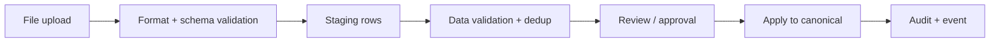
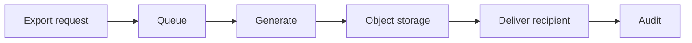

# Master Data Module — Import & Export

> **Document ID:** `master-data/17-Import-Export`
> **Owner:** Engineering Lead (data exchange)
> **Status:** 🔄 Pending approval (Phase 1 gate)
> **Version:** 1.0.0
> **Last updated:** 2026-08-06
> **Review cadence:** Re-reviewed at every phase gate.
>
> **Relationship:** This document defines **import and export** for the Master Data Management module — architecture, validation, staging, approval, execution, and security. It follows [13-Audit](13-Audit.md), [12-Security](12-Security.md), and the data-access rules in [05-DATABASE-ARCHITECTURE](../../05-DATABASE-ARCHITECTURE.md).

---

## Table of Contents

1. [Purpose](#1-purpose)
2. [Scope](#2-scope)
3. [Import Architecture](#3-import-architecture)
4. [Export Architecture](#4-export-architecture)
5. [Supported Formats](#5-supported-formats)
6. [File Validation](#6-file-validation)
7. [Schema Validation](#7-schema-validation)
8. [Data Validation](#8-data-validation)
9. [Duplicate Detection](#9-duplicate-detection)
10. [Transformation](#10-transformation)
11. [Mapping](#11-mapping)
12. [Staging](#12-staging)
13. [Approval](#13-approval)
14. [Import Execution](#14-import-execution)
15. [Error Handling](#15-error-handling)
16. [Retry](#16-retry)
17. [Rollback](#17-rollback)
18. [Export Workflow](#18-export-workflow)
19. [Large Dataset Handling](#19-large-dataset-handling)
20. [Security](#20-security)
21. [PHI Protection](#21-phi-protection)
22. [Audit](#22-audit)
23. [Notifications](#23-notifications)
24. [Monitoring](#24-monitoring)
25. [Reports](#25-reports)
26. [Cross References](#26-cross-references)

---

## 1. Purpose

Define how the Master Data module **ingests** external master data and **exports** it, with validation, staging, approval, and full audit — preserving tenant and PHI boundaries.

---

## 2. Scope

Import/export of patient, staff, provider, organization, and reference data via files (CSV/JSON) and the API ([10-API](10-API.md) §20–§21). Bulk updates and initial load.

---

## 3. Import Architecture

Backed by `import_batch`, `import_staging_row`, `import_validation` ([04-Database-Tables](04-Database-Tables.md) §27).

---

## 4. Export Architecture

Backed by `export_batch`, `export_queue_item`, `export_recipient` (§28).

---

## 5. Supported Formats

| Format | Import | Export |
| --- | --- | --- |
| CSV | Yes | Yes |
| JSON | Yes | Yes |
| XLSX | Import staging | Export |
| PDF | — | Reports only |

---

## 6. File Validation

| Check | Detail |
| --- | --- |
| Format | Extension + structure |
| Size | Within limits |
| Encoding | UTF-8 |
| Header | Required columns |
| Integrity | Row counts, delimiters |

---

## 7. Schema Validation

| Check | Detail |
| --- | --- |
| Columns | Match mapped schema |
| Types | Field data types |
| Required | Mandatory fields present |
| Length | Bounds per [04-Database-Tables](04-Database-Tables.md) |

---

## 8. Data Validation

| Check | Detail |
| --- | --- |
| Formats | Date, phone, email |
| Reference | Values exist in reference data |
| Constraints | Uniqueness, invariants ([07-Domain-Model](07-Domain-Model.md) §12) |
| Tenant | Rows scoped to tenant |

---

## 9. Duplicate Detection

Imported records are screened against existing records via the duplicate pipeline ([06-ERD](06-ERD.md) §12) before apply.

---

## 10. Transformation

| Aspect | Detail |
| --- | --- |
| Normalize | Case, whitespace, identifiers |
| Map | External → canonical fields ([§11](#11-mapping)) |
| Enrich | Defaults, reference resolution |

---

## 11. Mapping

| Aspect | Detail |
| --- | --- |
| Definition | Mapping per format/resource ([18-Integrations](18-Integrations.md)) |
| Field map | Source field → canonical field |
| Defaults | Unmapped defaults |
| Test | Mapping preview before run |

---

## 12. Staging

Imported rows land in `import_staging_row` before any canonical write. No PHI enters canonical tables until approved.

---

## 13. Approval

| Aspect | Decision |
| --- | --- |
| Elevated | Import apply requires approval ([11-Permissions](11-Permissions.md) §17) |
| Review | Staged rows reviewed for errors/duplicates |
| Bulk | Bulk apply elevated ([11-Permissions](11-Permissions.md) §20) |

---

## 14. Import Execution

| Step | Detail |
| --- | --- |
| Apply | Staged rows written in transactions |
| Duplicate | Matches routed, not silently overwritten |
| Audited | Every applied row audited ([13-Audit](13-Audit.md) §11) |
| Idempotent | Retry-safe via idempotency ([10-API](10-API.md) §28) |

---

## 15. Error Handling

| Aspect | Detail |
| --- | --- |
| Row errors | Per-row captured in `import_validation` |
| Abort | Fatal errors abort batch |
| Continue | Non-fatal continue + summary |
| Alert | Errors surfaced ([14-Notifications](14-Notifications.md)) |

---

## 16. Retry

| Aspect | Detail |
| --- | --- |
| Batch retry | Configurable, bounded |
| Idempotent | Re-run safe |
| Dead-letter | Failed to DLQ for operator |

---

## 17. Rollback

| Aspect | Detail |
| --- | --- |
| Pre-apply | Drop staging, no canonical impact |
| Post-apply | Governed rollback, audited |
| Reversible | Version history supports reversal |

---

## 18. Export Workflow

| Step | Detail |
| --- | --- |
| Scope | Filters/records to export |
| Format | User choice ([§5](#5-supported-formats)) |
| Recipient | Delivery target |
| Status | Queued → generated → delivered |
| Audit | Exported + recipient recorded |

---

## 19. Large Dataset Handling

| Aspect | Detail |
| --- | --- |
| Streaming | Large exports streamed |
| Batching | Chunked writes |
| Backpressure | Queue-bounded |
| Object storage | Output to S3/MinIO ([03-TECHNOLOGY-STACK](../../03-TECHNOLOGY-STACK.md)) |

---

## 20. Security

| Aspect | Decision |
| --- | --- |
| Access | `import:run` / `export:run` ([11-Permissions](11-Permissions.md) §17) |
| Validation | Server-side always ([12-Security](12-Security.md) §12) |
| Tenant | Rows tenant-scoped ([12-Security](12-Security.md) §5) |
| Rate | Bulk limited |

---

## 21. PHI Protection

| Aspect | Decision |
| --- | --- |
| Staging | PHI only in tenant-scoped staging |
| Export | PHI export authorized + audited |
| De-identify | Anonymized exports where required ([17-DATA-GOVERNANCE](../../17-DATA-GOVERNANCE.md) §13) |
| No logs | No PHI in logs |

---

## 22. Audit

All imports/exports are audited ([13-Audit](13-Audit.md) §11) — batch, rows, outcome, actor, recipient.

---

## 23. Notifications

Import/export completion and errors notify stakeholders ([14-Notifications](14-Notifications.md) §5).

---

## 24. Monitoring

| Metric | Detail |
| --- | --- |
| Batch health | Success/error rates |
| Queue depth | Pending work |
| Throughput | Rows/min ([19-Performance](19-Performance.md) §18) |
| Alerts | Failures, stuck batches |

---

## 25. Reports

Import/export reports feed [15-Reports](15-Reports.md) §17.

---

## 26. Cross References

| Reference | Relationship | Direction |
| --- | --- | --- |
| [13-Audit](13-Audit.md) | Audit | Consumes |
| [12-Security](12-Security.md) | Security | Consumes |
| [11-Permissions](11-Permissions.md) | Access | Consumes |
| [10-API](10-API.md) | APIs | Consumes |
| [18-Integrations](18-Integrations.md) | Mapping | Consumes |
| [15-Reports](15-Reports.md) | Reports | Provides |
| [05-DATABASE-ARCHITECTURE](../../05-DATABASE-ARCHITECTURE.md) | Data access | Consumes |

---

*End of `docs/modules/master-data/17-Import-Export.md`.*
