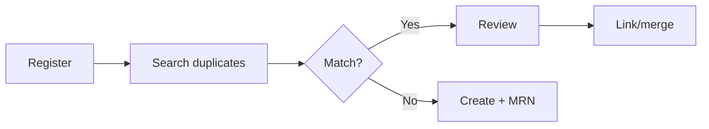
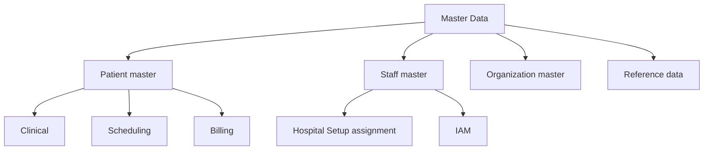

# Master Data Module

> **Module ID:** `master-data`
> **Document:** `docs/modules/master-data/README.md`
> **Owner:** Architecture / Engineering Lead (data)
> **Status:** 🔄 Pending approval (Phase 1 gate)
> **Version:** 1.0.0
> **Last updated:** 2026-08-06
> **Review cadence:** Re-reviewed at every phase gate and whenever the master data model changes.
>
> **Relationship:** Defines the **Enterprise Master Data Management (MDM)** module — the authoritative registry of master records (patients, staff/providers, organizations) and enterprise reference data that every other module references. It operationalizes the Master Data domain in [17-DATA-GOVERNANCE](../../17-DATA-GOVERNANCE.md) §5, follows the single-source-of-truth principle in [02-SYSTEM-ARCHITECTURE](../../02-SYSTEM-ARCHITECTURE.md), and provides the `staff` (Registry) and patient master referenced by [Hospital Setup](../hospital-setup/README.md). Data storage follows [05-DATABASE-ARCHITECTURE](../../05-DATABASE-ARCHITECTURE.md); APIs follow [11-API-STANDARDS](../../11-API-STANDARDS.md); authorization follows [07-ROLES-PERMISSIONS](../../07-ROLES-PERMISSIONS.md).

---

## Table of Contents

1. [Module Overview](#1-module-overview)
2. [Business Requirements](#2-business-requirements)
3. [Workflow](#3-workflow)
4. [Master Data Categories](#4-master-data-categories)
5. [Reference Data](#5-reference-data)
6. [Relationships](#6-relationships)
7. [Permissions](#7-permissions)
8. [Validation](#8-validation)
9. [API Overview](#9-api-overview)
10. [Reports](#10-reports)
11. [Dashboards](#11-dashboards)
12. [Security](#12-security)
13. [Audit](#13-audit)
14. [Future Enhancements](#14-future-enhancements)
15. [Cross References](#15-cross-references)

---

## 1. Module Overview

### 1.1 Purpose

The **Master Data** module establishes the **authoritative registry of master records** for the Hospital ERP Enterprise platform: patients, staff/providers, organizations, and enterprise reference data. It provides the **single source of truth** for identity that every clinical, financial, and operational workflow references — with golden-record management, duplicate detection, and controlled identifiers.

It is the implementation of the **Registry** capability identified in the [00-MASTER-ROADMAP](../../00-MASTER-ROADMAP.md) and the Master Data domain in [17-DATA-GOVERNANCE](../../17-DATA-GOVERNANCE.md) §5.

### 1.2 Why This Module Exists

- A patient record needs a unique, deduplicated identity before clinical care begins.
- Staff identity and credentials must be consistent across assignment ([Hospital Setup](../hospital-setup/README.md)) and access ([07-ROLES-PERMISSIONS](../../07-ROLES-PERMISSIONS.md)).
- Master records must be **one source**, referenced not copied, per [02-SYSTEM-ARCHITECTURE](../../02-SYSTEM-ARCHITECTURE.md) A3.

### 1.3 Scope

**In scope:** patient registry (MPI), staff/provider master, organization master, enterprise reference data and code sets, golden records and identifiers, duplicate detection, and master-data quality.

**Out of scope:** facility-specific organizational structure (see [Hospital Setup](../hospital-setup/README.md)), user accounts/roles (see [06-AUTHENTICATION](../../06-AUTHENTICATION.md)), and facility-scoped setup reference data (see [Hospital Setup](../hospital-setup/README.md)).

### 1.4 Guiding Principles

| # | Principle | Application |
| --- | --- | --- |
| P-01 | **Single source of truth** | One canonical master record; referenced, not copied. |
| P-02 | **Identity integrity** | Patients/staff uniquely identified; duplicates managed. |
| P-03 | **Non-destructive** | Deactivate over delete; history preserved. |
| P-04 | **Quality by default** | Validated at entry; monitored continuously. |
| P-05 | **Tenant-scoped** | Isolation per [09-MULTI-TENANCY](../../09-MULTI-TENANCY.md). |
| P-06 | **Audited** | Every master change is auditable ([08-AUDIT-LOGGING](../../08-AUDIT-LOGGING.md)). |

---

## 2. Business Requirements

The authoritative requirements are detailed in [01-Business-Requirements](01-Business-Requirements.md). Key requirements include:

| # | Requirement | Priority |
| --- | --- | --- |
| MD-01 | Register a patient with identity, demographics, and identifiers | Must |
| MD-02 | Maintain a unique, stable patient identifier (MRN/MPI) | Must |
| MD-03 | Detect and manage duplicate patient records | Must |
| MD-04 | Maintain the staff/provider master and credentials | Must |
| MD-05 | Manage organization master (vendors, payers, partners) | Must |
| MD-06 | Govern enterprise reference data and code sets | Must |
| MD-07 | Provide golden-record and identifier lifecycle management | Must |
| MD-08 | Support consent-aware access to sensitive master data | Must |
| MD-09 | Maintain audit and history of all master records | Must |
| MD-10 | Allow merging and un-merging of duplicate records | Should |

---

## 3. Workflow

The detailed workflows are in [02-Workflow](02-Workflow.md).

| Workflow | Description |
| --- | --- |
| Patient registration | Create a patient, check for duplicates, assign MRN |
| Duplicate detection | Match candidates, review, merge |
| Staff onboarding | Provision staff master and credentials |
| Identifier management | Assign/rotate identifiers (MRN, national IDs) |
| Reference data maintenance | Add/edit/deactivate code sets |
| Record lifecycle | Activate, deactivate, reactivate master records |

### Registration Flow

---

## 4. Master Data Categories

| Category | Entities | Canonical source |
| --- | --- | --- |
| **Patient** | Patient identity, demographics, MRN, identifiers, consent flags | This module |
| **Staff / Provider** | Staff identity, credentials, demographics | This module |
| **Organization** | Vendors, payers, partner organizations | This module |
| **Facility structure** | Facility → location → department → unit | [Hospital Setup](../hospital-setup/README.md) |
| **User/Identity** | User accounts, roles | [06-AUTHENTICATION](../../06-AUTHENTICATION.md) |

### Golden Records

| Aspect | Decision |
| --- | --- |
| Master record | Canonical, deduplicated record |
| Golden record | Selected best record for a unique entity |
| Duplicates | Linked to the golden record |
| Identifiers | Stable, tenant-scoped |
| Provenance | Source of each attribute tracked |

---

## 5. Reference Data

Enterprise reference data and code sets ([17-DATA-GOVERNANCE](../../17-DATA-GOVERNANCE.md) §7).

| Reference | Examples | Owner |
| --- | --- | --- |
| Identifier types | MRN, ABHA, national ID, insurance | Master Data |
| Relationship types | Next-of-kin, guarantor | Master Data |
| Organization types | Vendor, payer, partner | Master Data |
| Clinical code sets | ICD, LOINC, RxNorm | [19-CLINICAL-STANDARDS](../../19-CLINICAL-STANDARDS.md) |
| Facility-scoped reference | specialties, shift templates | [Hospital Setup](../hospital-setup/README.md) |

### Reference Data Rules

| Rule | Application |
| --- | --- |
| Centrally governed | Enterprise code sets managed here |
| Versioned | Editions pinned and reviewed |
| Validated | Codes validated against editions |
| No hard-coding | Referenced, not embedded |
| Tenant-aware | Enterprise vs facility scope |

---

## 6. Relationships

The master data module is the **hub** other modules reference.

| Module | Relationship | Nature |
| --- | --- | --- |
| Hospital Setup | References patient (via MRN) and staff (`staff` Registry) | Provides master |
| Scheduling | References patient + staff | Consumes |
| EHR / Clinical | References patient | Consumes |
| Billing / Finance | References patient, payer, staff | Consumes |
| Pharmacy / Lab | References patient, staff | Consumes |
| IAM | References staff identity | Provides identity basis |
| Terminology | Consumes clinical code sets | Consumes |

### Relationship Diagram

---

## 7. Permissions

Authorization follows [07-ROLES-PERMISSIONS](../../07-ROLES-PERMISSIONS.md); module permissions are detailed in the Permissions document.

| Permission | Grants |
| --- | --- |
| `patient:read` | Read patient records |
| `patient:create` | Register patients |
| `patient:update` | Update patient records |
| `patient:merge` | Merge/un-merge duplicates |
| `staff:read` / `staff:update` | Staff master access |
| `mdm:reference` | Manage reference data |
| `mdm:audit` | View master-data audit |

### Role Access (illustrative)

| Role | patient:read | patient:create | patient:merge | mdm:reference |
| --- | :---: | :---: | :---: | :---: |
| Front-desk | ✓ | ✓ | · | · |
| Clinician | ✓ | ✓ | · | · |
| Registry admin | ✓ | ✓ | ✓ | ✓ |
| Auditor | read-only | · | · | · |

---

## 8. Validation

Validation follows [11-API-STANDARDS](../../11-API-STANDARDS.md) and is detailed in the module's Validation document.

| Rule | Application |
| --- | --- |
| Required identifiers | At least one validated identifier |
| Format | Email, phone, national IDs |
| Uniqueness | MRN/identifier unique |
| Consistency | Demographics consistent (e.g., DOB/sex) |
| Duplicate check | New records screened for matches |
| Consent flags | Valid consent states |

---

## 9. API Overview

The full API is specified in the module's API document, following [11-API-STANDARDS](../../11-API-STANDARDS.md).

| Method | Path (illustrative) | Purpose |
| --- | --- | --- |
| POST | `/api/v1/patients` | Register a patient |
| GET | `/api/v1/patients/{id}` | Read a patient |
| PUT/PATCH | `/api/v1/patients/{id}` | Update a patient |
| GET | `/api/v1/patients?q=` | Search patients |
| POST | `/api/v1/patients/dedupe` | Run duplicate detection |
| POST | `/api/v1/patients/merge` | Merge duplicates |
| GET | `/api/v1/staff` | List staff master |
| GET | `/api/v1/reference-values` | List reference data |

All endpoints versioned, paginated, and secured per [11-API-STANDARDS](../../11-API-STANDARDS.md).

---

## 10. Reports

Reports are specified in the module's Reports document.

| Report | Purpose |
| --- | --- |
| Registry summary | Patient/staff counts by type |
| Duplicate report | Open duplicate candidates |
| Merge history | Records merged/un-merged |
| Identifier report | Identifier assignment and coverage |
| Reference catalog | Enterprise code sets |
| Audit report | Master-record change log |

---

## 11. Dashboards

Dashboards are specified in the module's Dashboards document.

| Dashboard | Purpose |
| --- | --- |
| Registry Health | Patient/staff totals, duplicates, quality |
| Duplicate Queue | Pending duplicate reviews |
| Reference Coverage | Code set completeness |
| Quality | Master-data quality KPIs |

---

## 12. Security

Security follows [06-AUTHENTICATION](../../06-AUTHENTICATION.md) and the module's Security document.

| Control | Application |
| --- | --- |
| Authentication | OIDC; MFA for merge/admin |
| Authorization | RBAC + scoping ([07-ROLES-PERMISSIONS](../../07-ROLES-PERMISSIONS.md)) |
| Patient privacy | Consent-aware access ([17-DATA-GOVERNANCE](../../17-DATA-GOVERNANCE.md) §14) |
| Tenant isolation | RLS ([09-MULTI-TENANCY](../../09-MULTI-TENANCY.md)) |
| No PHI outside prod | Non-production synthetic data |
| Encryption | At rest and in transit |

---

## 13. Audit

All master-data changes are audited ([08-AUDIT-LOGGING](../../08-AUDIT-LOGGING.md)).

| Audit | Captures |
| --- | --- |
| Record changes | Who changed what, when |
| Duplicate/merge | Merge and un-merge events |
| Identifier changes | Identifier assignment/rotation |
| Access | Sensitive record access |
| Reference changes | Code set modifications |

---

## 14. Future Enhancements

| Enhancement | Description |
| --- | --- |
| Advanced MPI | Probabilistic matching, survivorship |
| Real-time search | OpenSearch duplicate matching at scale ([03-TECHNOLOGY-STACK](../../03-TECHNOLOGY-STACK.md)) |
| Cross-facility registry | Shared enterprise patient index |
| Patient portal sync | Registry feeds patient self-service |
| AI-assisted matching | ML-assisted duplicate resolution |

---

## 15. Cross References

| Reference | Relationship | Direction |
| --- | --- | --- |
| [01-Business-Requirements](01-Business-Requirements.md) | Module requirements | Provides |
| [02-Workflow](02-Workflow.md) | Module workflows | Provides |
| [00-MASTER-ROADMAP](../../00-MASTER-ROADMAP.md) | Phasing, Registry capability | Consumes |
| [02-SYSTEM-ARCHITECTURE](../../02-SYSTEM-ARCHITECTURE.md) | Single source of truth | Consumes |
| [05-DATABASE-ARCHITECTURE](../../05-DATABASE-ARCHITECTURE.md) | Storage, integrity | Consumes |
| [06-AUTHENTICATION](../../06-AUTHENTICATION.md) | Identity, consent | Consumes |
| [07-ROLES-PERMISSIONS](../../07-ROLES-PERMISSIONS.md) | Authorization | Consumes |
| [08-AUDIT-LOGGING](../../08-AUDIT-LOGGING.md) | Audit | Consumes |
| [09-MULTI-TENANCY](../../09-MULTI-TENANCY.md) | Tenant isolation | Consumes |
| [11-API-STANDARDS](../../11-API-STANDARDS.md) | API standards | Consumes |
| [17-DATA-GOVERNANCE](../../17-DATA-GOVERNANCE.md) | Master data domain, PHI | Consumes |
| [19-CLINICAL-STANDARDS](../../19-CLINICAL-STANDARDS.md) | Clinical code sets | Consumes |
| [Hospital Setup](../hospital-setup/README.md) | Facility/staff relationship | Consumes |

---

*End of `docs/modules/master-data/README.md`.*
